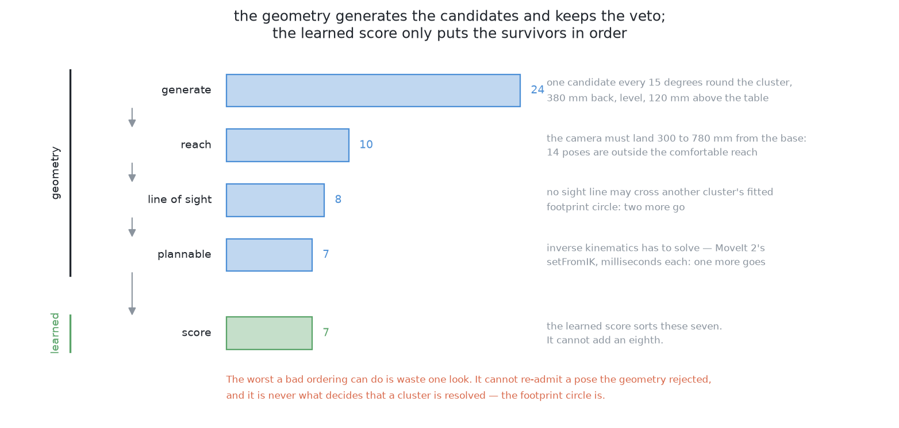
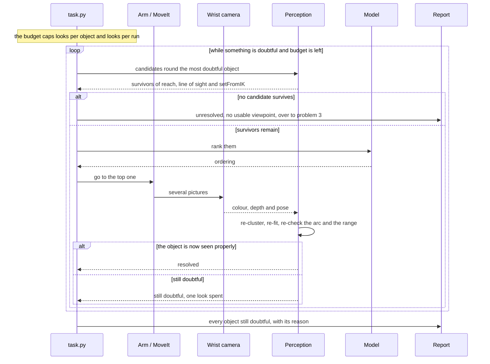
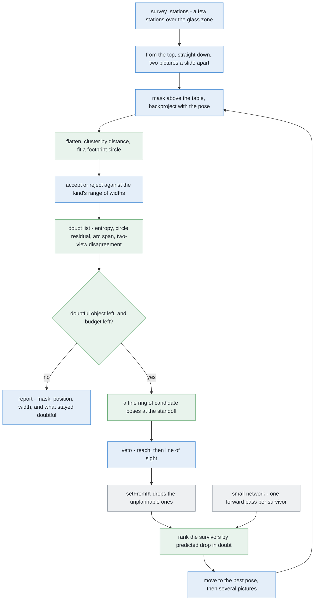
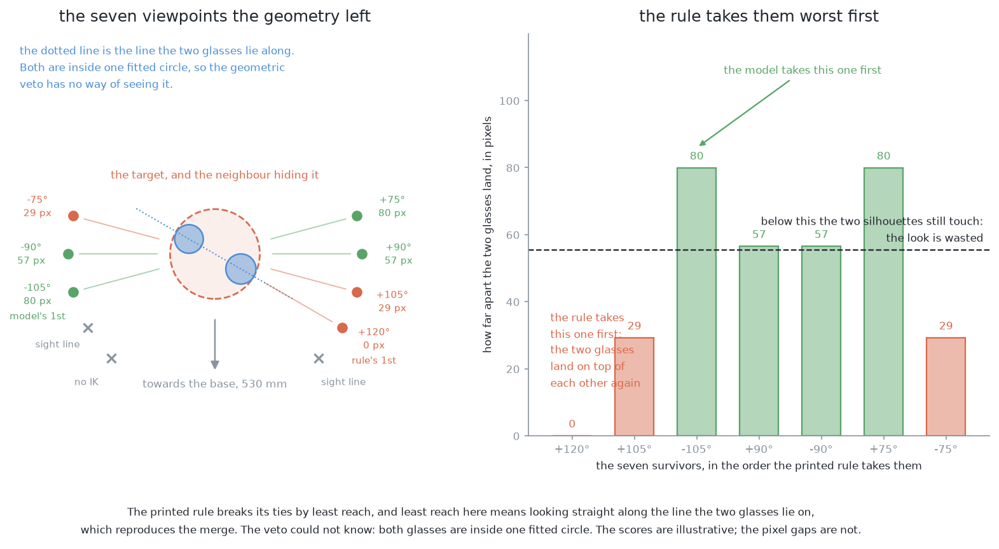
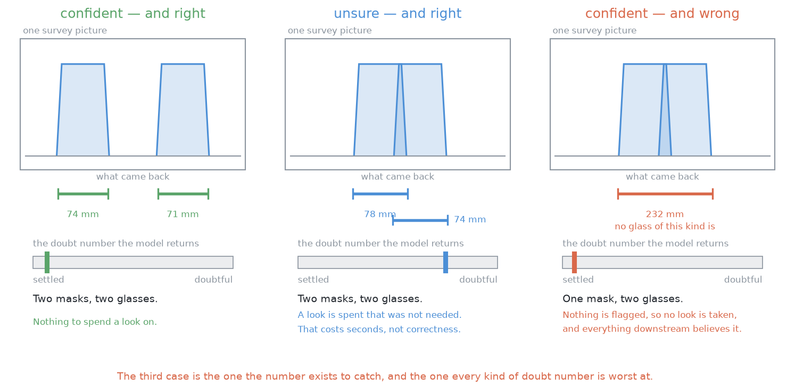
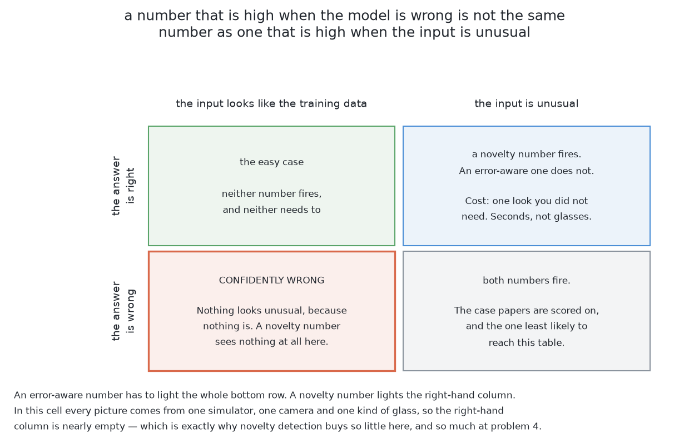
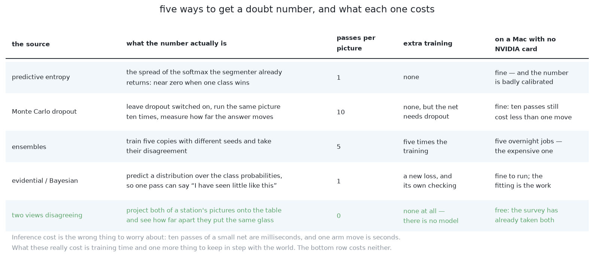
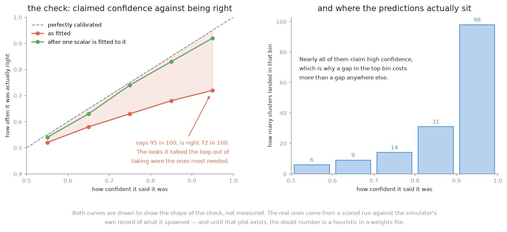
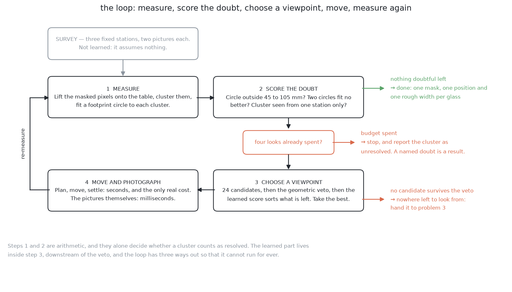
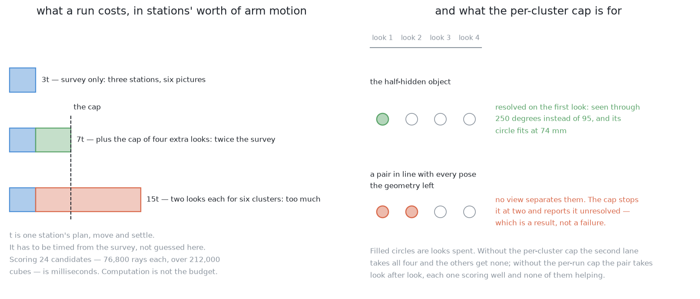

# Solution 4 — learned doubt steers the next picture

*Hybrid, with the model as a ranker. The fixed sweep happens first. Then a
learned estimate of how unsure each object is decides which extra picture is
worth taking, from candidate poses the geometry has already filtered.*

> **The cell is described once, in [the cell](../../the-cell.md)** — the layout,
> the two places the camera works from, from the top and from the side, all four
> sensors, and the words this project uses them with. What follows is only what
> is specific to this solution.

## In one paragraph

The arm cannot look everywhere, so it has to choose. This solution leaves the
geometry in charge of where the camera is allowed to stand — it must be
reachable, not blocked, and the planner must accept it. A learned number then
does the smaller job of saying which of the survivors is worth the seconds. That
number estimates how much doubt a look would remove. It can never let in a pose
the arithmetic rejected, and it can never declare an object settled. That
ordering is what makes this a hybrid, and it is what limits the damage when the
estimate is wrong — which is the failure the whole design is arranged around.

## The problem this solves

Four to six glasses stand on the table. All one kind, the kind known, never
closer than the smallest gap problem 2 promises between their centres, upright
and solid. The arm has to say which pixels belong to which glass, where each one
stands, and how wide its footprint is. It also has to say, honestly, which
glasses it could not separate.

Two things get in the way, and they are different problems.

**Two glasses can hide each other.** If the camera is in line with both, the
near one covers part of the far one. The picture no longer holds the fact that
would have separated them — which pixels were near and which were far — and no
amount of work on that picture puts it back.

**The camera can no longer stand wherever it likes.** It is on the wrist, so
choosing where it stands means choosing where the whole arm stands. A viewpoint
has to clear the line of sight, the arm's own reach, and the planner, all at
once. With five glasses on the table, a glass can end up with no usable
viewpoint at all.

[`problem.md`](../problem.md) names the failure to watch hardest: two real
glasses reported as one. A glass split in two looks wrong immediately. A merged
pair looks like one large glass, and everything downstream believes it. That is
exactly the case where a perception step is *confident and wrong*, which is why
nothing learned is allowed to decide anything in this design.

## How it works, end to end

Take the pictures you always take. Work out what is settled and what is not. For
anything not settled, ask where you would have to look for it to become clear,
go and look there, and work it out again. Stop when nothing is doubtful, or when
the budget is spent.

### The setup

The table top's height is a constant and the arm is bolted to the near edge,
reaching out across the table. The glasses stand inside the glass zone
(`GLASS_ZONE`), a rectangle of table a little wider than it is deep: four to six
of them, one known kind, never closer than the smallest legal gap, and varying a
lot in height and somewhat in width. The rack is on the far side of the table,
out of the back of every picture the survey takes.

The camera is **on the wrist**. It is a small RGB-D sensor, colour and depth
through the same lens. Moving it means moving the whole arm, so a new place to
look from costs **seconds**, while one more picture from where the camera
already is costs **milliseconds**.

That single imbalance drives the whole design: **take more pictures from each
place you go, and go to fewer places.**

Known before the run: the table plane, the band of distances from the base that
the arm works comfortably in, the lens, and the kind of glass — and therefore
the range of footprint widths every glass on this table must fall inside. Not
known: how many glasses there are, where they stand, and which pixels belong to
which.

### The pictures

**The survey comes first, and it is not learned.** A method that chooses its own
viewpoints needs some belief about the world to choose the first one from, and
before the first picture there is none. So `survey_stations` spreads a few
stations over the glass zone, overlapping them enough that a glass cut off at
the edge of one picture is well inside another. At each station the camera works
**from the top** — high above the table, looking straight down — and takes **two
pictures a short slide apart**. The slide is wide enough that a glass visibly
shifts between the two pictures, which is what measures its height, and narrow
enough that both pictures still catch the same glasses.

**Extra looks come second, and there are only a few of them.** They are taken
**from the side**: the camera comes down low, stands back at the measuring
standoff, and looks level at the doubtful object. That is the same standoff
geometry problem 1 uses to measure a profile, so a look taken to settle a doubt
is not wasted even if the doubt turns out to be nothing — it also serves the
next step. Level is the part that matters here, because level is the view in
which two glasses standing apart on the table either separate or fail to.

### What each picture captures

Four things come back from one shutter:

- **A colour picture**, small.
- **A depth picture**, the same size and lined up with the colour pixel for
  pixel. It has a near limit and a far limit; outside them it returns nothing.
- **A mask** of the pixels standing above the table plane, from
  `detect.standing_on_the_table`. It says *glass, not table*. It has no opinion
  about how many glasses.
- **The pose** of the camera at the moment of the shutter, worked out from the
  arm's own joint angles rather than from where the arm was told to go.

One more thing follows from the lens, and every argument below uses it. The lens
spreads a fixed angle over a fixed number of pixels, so **how much of the world
one pixel covers depends only on how far away that world is**. From the top,
high above the table, a pixel covers a millimetre or two of table. From the
side, standing much closer to one glass, a pixel covers rather less. That is the
bridge between an argument in pixels and an argument in millimetres, and it is
why the code never hard-codes either.

### What is interpreted, and how



Notice that the numbers only ever fall. The learned stage takes seven candidates
and returns the same seven in a different order.

The chain, in order:

1. **Mask.** Pixels above the table plane.
2. **Backproject.** Every masked pixel, with its depth and the recorded pose,
   becomes a point in the room in millimetres from the arm's base.
3. **Flatten.** Drop the height. A glass is a footprint on a known plane.
4. **Cluster by distance**, over the points from every picture at once. Dots
   close enough together are chained into one group. This is where glasses stop
   being pixels and become objects — on the table, not in a picture.
5. **Fit a circle** to each group: a centre, a width, and a residual, which is
   how far the points sit from the fitted circle on average.
6. **Accept or reject** each circle against the range of widths this kind of
   glass can be. **This is the step that decides whether an object is resolved,
   and it is arithmetic.** A circle outside the range is rejected whatever any
   model says about it.
7. **Score the doubt** per group, as a small list of numbers rather than one:
   - the mean per-pixel **entropy** over its mask — the model's own doubt (see
     below for what entropy means here);
   - the **circle-fit residual**, and whether the diameter is in range — pure
     geometry, owing nothing to the model;
   - the **angular span of the points** round the fitted centre, and how many
     there are against how many a footprint that size should give — this is what
     catches a glass seen through a narrow gap;
   - the **disagreement between the station's two views** — model-free, and
     already paid for.

   A group is doubtful if **any one** of these fires. They are ORed, not ANDed,
   so a silent model cannot suppress a geometric complaint.
8. **Generate** a ring of candidate poses round the most doubtful object, evenly
   spaced all the way round it, each at the measuring standoff. The ring is fine
   rather than coarse, because the tests that follow are cheap enough to afford
   it.
9. **Veto**, cheapest test first. **Reach**: the camera has to land inside the
   band of distances the arm works comfortably in, which is one square root
   each.
   **Line of sight**: reject any sight line that passes through another object's
   fitted circle, which is one line-against-circle test per pair. Then **inverse
   kinematics**: MoveIt 2's `setFromIK` asks whether any set of joint angles
   puts the hand at that pose at all, and answers in milliseconds.
10. **Rank** the survivors with the learned score, by how far it predicts the
    doubt would fall if the camera went there. One forward pass of a small
    network each.
11. **Move**, settle, and take several pictures along the slide rather than only
    two, because the arm is already standing there and pictures are nearly free.
12. **Back to step 2**, with the new points added. This is a re-measure, not a
    patch: clustering and circle fitting run again over everything, so a look
    can change the answer for an object it was not aimed at.

Steps 8 and 9 are geometry, and they hold the veto. Step 10 is the only learned
step, and all it does is reorder a list the geometry has already approved. The
model cannot propose a pose, cannot re-admit one the geometry rejected, and
cannot declare an object resolved. **That is why a wrong prediction costs one
wasted look rather than a wrong answer.**

### What comes out

Per glass: a **mask** (which pixels in which picture), a **position** on the
table in millimetres from the arm's base, and a **rough footprint width** in
millimetres. Alongside it, a list of the objects still doubtful when the budget
ran out, each with its reason — out-of-range circle, too narrow an arc, no
candidate viewpoint, or cap reached.

Both go to the report. The resolved glasses are what problem 1's step 2
measures, from the standoff poses this solution has already proved reachable.
The doubtful list is the input to [problem 3](../../problem-3/problem.md), whose
job is to move a glass that cannot be separated where it stands.

## The sequence

The normal path: the three-station survey, one object that comes back doubtful,
one extra look, and the answer.

```mermaid
sequenceDiagram
    participant T as task.py
    participant A as Arm / MoveIt
    participant C as Wrist camera
    participant P as Perception
    participant M as Model
    participant R as Report

    T->>A: survey_stations over the glass zone
    A-->>T: a few stations
    loop each station
        A->>A: from the top, looking straight down
        A->>C: two pictures, a short slide apart
        C-->>P: colour and depth, plus the pose
    end
    P->>P: mask, backproject, flatten, cluster by distance
    P->>P: fit a footprint circle per group
    P-->>T: one group more than expected; one seen through a narrow arc
    Note over T,M: the arc and the dot count flag it, not the model
    T->>P: a ring of candidate poses at the standoff
    P-->>T: a handful survive reach, line of sight and setFromIK
    T->>M: rank the survivors by predicted drop in doubt
    M-->>T: ordering, best first
    T->>A: go to the best pose
    A->>C: several pictures along the slide
    C-->>P: colour, depth and pose for each
    P->>P: re-cluster and re-fit every circle
    P-->>T: every group now settled
    T->>R: mask, position and width per glass
```

The interesting path: the loop itself, where a bad ordering costs a look, and
the two caps are the only thing that makes the loop stop.



## In pseudocode



**Legend.** Green is new code written for this solution; blue is code the
project already has; grey is a third-party library.

```text
stations = survey_stations(GLASS_ZONE, footprint)      # have  · work_cell.arm.dimensions
for eye in each_station_slid_by(stations, BASELINE):   # have  · work_cell.task
    rgb, depth, pose = arm.look_down_from(eye, HEIGHT)  # have  · work_cell.task
    mask = detect.standing_on_the_table(depth, pose)   # have  · work_cell.glasses.detect
    points += backproject(depth, mask, pose, K)        # have  · work_cell.glasses.perception

looks_left = LOOKS_PER_RUN                             # NEW   · whole-run cap
spent = Counter()                                      # NEW   · per-object cap
while looks_left > 0:                                  # NEW   · ~50 lines
    groups = cluster_by_distance(points[:, :2], GAP)   # NEW   · numpy
    for g in groups:                                   # NEW
        g.centre, g.width, g.rms = fit_circle(g)       # NEW   · numpy.linalg.lstsq
        g.doubt = (entropy(g), g.rms,                  # NEW   · torch + numpy
                   arc_span(g), views_differ(g))       # NEW   · numpy
    g = worst(groups, kind.accepts, spent)             # NEW   · work_cell.glasses.spec
    if g is None:                                      # NEW   · nothing doubtful left
        break
    poses = ring(g.centre, back=STANDOFF, step=FINE)   # NEW   · numpy
    poses = [p for p in poses if reaches(p)]           # have  · work_cell.arm.dimensions
    poses = [p for p in poses if sight_clear(p, g)]    # have  · work_cell.task
    poses = [p for p in poses if arm.set_from_ik(p)]   # have  · moveit2
    if not poses:                                      # NEW
        report.doubtful(g, "no usable viewpoint")      # have  · work_cell.report
        spent[g.id] = LOOKS_PER_OBJECT                 # NEW   · stop retrying it
        continue
    best = max(poses, key=model.predicted_drop)        # NEW   · torch
    points += arm.photograph_from(best, shots=SEVERAL) # have  · work_cell.task
    spent[g.id] += 1                                   # NEW
    looks_left -= 1                                    # NEW
report.glasses(groups)                                 # have  · work_cell.report
```

The libraries, and whether adding one is a decision:

| Library | Used for | Licence | In the pixi environment? |
| --- | --- | --- | --- |
| [NumPy](https://numpy.org/) | backprojection, clustering, circle fits | BSD-3-Clause | yes |
| [OpenCV](https://opencv.org/) | masks, connected components, ellipse fit | Apache-2.0 from 4.5 | yes |
| Matplotlib | the calibration plot | BSD-style | yes |
| [MoveIt 2](https://moveit.ai/) | `setFromIK` for the plannability veto | BSD-3-Clause | yes, already a dependency |
| [Gazebo](https://gazebosim.org/) | every training example | Apache-2.0 | yes, already running |
| [PyTorch](https://github.com/pytorch/pytorch) | the segmenter and the scoring network | BSD-3-Clause | **no** |
| [OctoMap](https://octomap.github.io/) | occupancy map, only if a volume-based score is ever built | core BSD-3-Clause, extensions differ | **no** |
| [TorchUncertainty](https://github.com/ENSTA-U2IS-AI/torch-uncertainty), [Laplace](https://github.com/aleximmer/Laplace) | ready-made uncertainty methods, optional | permissive, but read the file | **no** |

PyTorch is the real addition. Everything else on the list is either already
there or optional, and the geometric half of this solution needs none of it.

## A worked example

The survey has finished. There is one group on the table for each glass, and one
more besides.

Most of the groups fit footprint circles comfortably inside the range this kind
of glass is allowed, with plenty of dots spread all the way round the circle.
Those ones are settled, and nothing further happens to them.

One group is the interesting one, and it is worth being precise about why,
because the obvious story is the wrong one.

**It is not a merge.** Two glasses at the closest spacing problem 2 allows still
have a strip of bare table between them several times wider than the grouping
distance. The chain cannot cross a strip of nothing, so they come back as two
groups and not one. Inside problem 2's spacing rule, clustering on the table
does not merge two glasses, and a worked example that pretended otherwise would
be teaching the wrong lesson.

**What actually goes wrong is that one glass is barely seen at all.** The second
glass of that pair stands almost directly behind the first, from every one of
the survey stations. Only a sliver of its footprint ever reaches the camera. So
its group comes back with three things worth noticing:

- **a fitted circle that is inside the allowed range.** This is the trap. The
  range check — the one arithmetic test that decides whether an object is
  resolved — has nothing to complain about, because a sliver of a circle can be
  fitted by a circle of a perfectly ordinary size.
- **dots spanning only a narrow arc of that circle**, where a glass seen
  properly gives dots round most of it. A narrow arc is what a glass seen
  through a gap looks like.
- **far fewer dots than a footprint of that size should give** at that distance.
  The expected count is arithmetic — it follows from how much table one pixel
  covers — so the shortfall is measurable rather than a feeling.

And the model's own doubt about this group is **low**. Its mask is a perfectly
good mask, crisply drawn, with confident pixels. It is just a mask of one third
of a glass, and nothing about a mask says how much of an object it covers.

So **the geometry flagged it and the model would have said nothing.** That is
the single most important sentence on this page, and it is why the doubt signals
are ORed together rather than blended into one number.

### Filtering the candidates

The ring of candidate directions now gets cut down, cheapest test first.

**Reach.** Think of it as two circles drawn on the table around the arm's base:
an inner one the camera must not come inside, and an outer one it must not go
beyond. The candidate directions that point back towards the base put the camera
inside the inner circle, folded over itself. The ones that point away from the
base put it outside the outer circle, stretched straight. What survives is a
band of directions running roughly *across* the line from the base to the object
— and on a ring this fine, that band still holds a good number of candidates.
Reach alone removes over half of them, and it costs one square root each.

**Line of sight.** A third glass stands off to one side, and the sight lines
that would pass through its fitted circle are dropped. It is worth seeing why
this is a real removal and not a pedantic one: from those directions the third
glass would sit in the frame *on top of* the target, covering a good part of the
width of the picture, so the mask would again be a mask of two things. A few
more candidates go.

**Plannability.** `setFromIK` is asked whether a set of joint angles exists for
each survivor, and one or two of them turn out to have none. Those go too.

What reaches the learned score is a handful of candidates, all of them genuinely
worth visiting. That is the whole point of the ordering: the expensive stage is
handed a short list.

### The ordering



The bar chart is ordered the way the printed rule takes the candidates, and the
very first bar it takes is zero. That is the case this whole solution exists to
make.

Here is what the geometry could not know. The glass hiding our target stands
close beside it, and the line joining the two runs off at an angle to the line
from the arm's base. Both glasses look perfectly settled in their own right, so
**no line-of-sight test fires**. The test asks whether a sight line crosses
another object's fitted circle, and from most of these directions it does not.
What the test never asks is whether the target will end up *behind* its
neighbour at the moment the shutter opens.

Think about what governs that. The two glasses separate in the picture by an
amount that depends on the angle between the camera's direction and the line
joining the pair. Stand square across that line and they separate as much as
they possibly can. Stand along it and they separate not at all — one is dead
behind the other. In between the separation falls off smoothly, like the sine of
the angle you have turned away from square. And they only truly come apart once
that separation exceeds the two half-widths added together.

So the candidates fall into three groups:

| where the camera stands | do the two glasses come apart? |
| --- | --- |
| square across the joining line, or nearly so | **yes**, clearly |
| part-way round from square | **just barely** |
| along the joining line, or nearly so | **no** — one sits inside the other |

That is the same answer solution 3's arithmetic gives from the other direction:
a neighbour blocks a wedge of directions round the joining line, and the width
of the wedge grows as the neighbour gets closer or wider. The two arguments
agree exactly, which is a good sign that neither of them is wrong.

**The printed rule gets this badly wrong.** Every survivor has a clear line of
sight, because the filter saw to that, so the rule has nothing left to separate
them and falls through to its tiebreak: prefer the pose that asks the least of
the arm's reach. And the pose that asks least of the reach is the one *nearest
the object along the line from the base* — which here is almost exactly along
the line joining the two glasses. So the rule's first pick is the one direction
that looks straight down the pair, and the look reproduces the original problem
exactly. Its second pick is the next one round, which is still inside the
neighbour's wedge. **Both of the object's looks are spent and nothing is
resolved.**

**The learned score gets it right**, and orders the candidates roughly by how
nearly square they are to the joining line. Its first pick is one of the two
square ones. Between those two it prefers the one that keeps the arm less
extended: less stretch, less wobble at the wrist, less distance to travel.
Nobody told the model either of those things. Both came out of training on what
actually happened when the arm went to each pose.

The model's ordering is the illustrative part of this example. The reasoning
about when two glasses come apart is not illustrative — it is what the camera
would really see, and you can check it with a ruler and a piece of paper.

### The look itself

Plan, move, settle — seconds, and this is the only real cost in the whole
method. Then several pictures along the slide rather than only two, because the
arm is already standing there and a picture costs almost nothing.

The target is now seen through most of a circle instead of a narrow arc, with
the dot count to match, and the circle fits at a width that sits comfortably
inside the kind's range. Every one of the three complaints that flagged it has
gone quiet. One look spent out of the run's budget.

### The counter-argument, which is the honest part

What the model learned to prefer is viewpoints across the line joining a
doubtful object and whatever is hiding it. That can be written down:

> Take the doubtful object and its nearest neighbour. Sort the surviving
> candidates by how nearly perpendicular they are to the line joining the two.

Four lines of arithmetic. No data, no weights file, no training run — and on
this example it picks the same viewpoint. That is why the overview marks this
solution *the richest version of moving the camera* rather than something to
build first. With one known kind, the thing that makes a look pay off is one
nameable quantity, and a nameable quantity should be named rather than fitted.

Fitting earns its keep when there is no single quantity to name: when the kind
is unknown, the allowed footprint range is the union of several, and whether a
look pays off depends on shape as well as geometry. That is [problem
4](../../problem-4/problem.md), not this one.

## What the doubt number is, and what it is worth

**Uncertainty** is a second number returned beside the answer, saying how far to
trust the first.

For a **detection** — a rectangle round an object — it is one number for the
rectangle. For a **segmentation** — a yes-or-no label per pixel — it is one
number per pixel, so the doubt is itself a picture.

Three questions have to be asked of such a number before it is allowed to steer
an arm.

### It has to catch the case where the answer is confident and wrong



Look at the third panel. The doubt is low and the answer is wrong, and the bar
looks exactly like the bar in the first panel, where the answer was right.

- **Confident and right.** Two masks, two glasses, low doubt. Nothing to spend a
  look on.
- **Unsure and right.** The loop spends a look it did not need. That costs
  seconds of arm time, not correctness, and seconds are the cheaper currency.
- **Confident and wrong.** One mask over two glasses, or a mask of one third of
  a glass, with low doubt. Nothing is flagged, no look is taken, and the run
  reports a glass that is not where it says.

A doubt number is only worth having if it catches the third case, and every
method below is best at the second and worst at the third.

Worse, in that third case the uncertainty is often *genuinely* low. The mask is
a perfectly good mask — of two glasses, or of part of one. The model was asked
which pixels are glass and got that right. Nothing in that question has an
opinion about how many glasses there are, or about how much of one you are
looking at. The doubt has to come from somewhere that does, and here that is the
footprint circle and the arc span.

### Wrong is not the same as unusual



Read the left-hand column. Both cells have ordinary, familiar-looking inputs.
One answer is right and one is wrong, and no amount of novelty detection tells
them apart.

**Novelty detection** is high when the input looks unlike the training data.
**Error-awareness** is high when the answer is wrong, whatever the input looked
like. The loop wants the second, and it is much harder to get. The two coincide
only where an unusual input also produces a wrong answer, which is the corner
most papers are scored on.

Here every picture comes out of one simulator, through one camera, with one kind
of glass. So the unusual-input column is nearly empty, and novelty detection
buys almost nothing. It starts buying a great deal at [problem
4](../../problem-4/problem.md), where the kind is no longer known, and a badly
calibrated model is most confident precisely on the shape it has never seen.

Two more words worth having. **Aleatoric** doubt is noise in the measurement,
and another picture will not remove it. **Epistemic** doubt is the model not
knowing, and a different picture can. Only epistemic doubt justifies moving the
arm — and a hidden glass is epistemic almost by definition. The fact that would
settle it exists; it is just not in a picture taken from in line with its
neighbour.

### Five ways to get the number



Read the last column. On this machine the differences at inference time are
almost irrelevant. The differences in training cost are not.

- **Predictive entropy.** How spread out the per-pixel probability is. For a
  two-class choice the entropy is `-(p log2 p + (1-p) log2 (1-p))`. Read it as a
  shape rather than as numbers: it is largest when the model is exactly torn
  between the two answers, and it falls away towards zero as the model becomes
  sure of either one. So a large value means "no idea" and a small one means
  "sure". It costs one forward pass and no extra training, which is why almost
  everyone reaches for it first. Its weakness is that these outputs are
  systematically overconfident ([Guo and
  colleagues](https://arxiv.org/abs/1706.04599)), so a confidently wrong answer
  comes back with confidently *low* entropy — the third panel above.
- **Monte Carlo dropout.** Dropout is a training trick that switches off random
  parts of the network. Leave it switched on when the model is *used*, run the
  same picture ten times, and read the spread of the answers ([Gal and
  Ghahramani](https://arxiv.org/abs/1506.02142); [Bayesian
  SegNet](https://arxiv.org/abs/1511.02680) is the per-pixel version). Ten
  forward passes, no extra training.
- **Ensembles.** Train several copies of the network from different random
  starts. Where they agree, the answer came from the data. Where they disagree,
  it came from the random start. [Deep
  ensembles](https://arxiv.org/abs/1612.01474) win most published comparisons,
  and multiply the training cost by however many copies you train.
- **Evidential and Bayesian deep learning.** Have the network predict a
  distribution *over* probabilities, so one pass returns both the answer and how
  much evidence stands behind it ([Sensoy and
  colleagues](https://arxiv.org/abs/1806.01768); [Amini and
  colleagues](https://arxiv.org/abs/1910.02600) for regression). The cost is a
  less familiar loss, and the evidence strength needs its own calibration check.
- **Disagreement between the station's two views.** No model at all. Segment
  both pictures, project each onto the table, and measure how far apart the two
  put the same glass. The two views should agree to within the noise in a depth
  reading; a disagreement several times larger than that is not noise, it is a
  sign that one of the two views was looking at something other than a whole
  glass. It costs nothing, because both pictures are already paid for.

Even a method that needs several forward passes is still thousands of times
cheaper than one move of the arm. So on a machine with no NVIDIA card, the
choice between these is about **training cost**, not about what happens at run
time. [PyTorch](https://github.com/pytorch/pytorch) (BSD-3-Clause) runs a small
segmenter on a picture this size in a few milliseconds through its CPU or Metal
path; exactly how few has to be measured.
[TorchUncertainty](https://github.com/ENSTA-U2IS-AI/torch-uncertainty) and
[Laplace](https://github.com/aleximmer/Laplace) package several of these methods
so you do not have to write them yourself. Both look permissively licensed, but
read the licence file rather than taking it on trust.

### Calibration, which is what makes the number mean something



The gap between the red curve and the dashed diagonal is the thing to look at.
Where the model claims to be almost certain and is in fact right only about two
thirds of the time, the loop is being talked out of exactly the looks it most
needed.

A doubt number is **calibrated** when its claims come true about as often as it
says they will. If it says it is sure, it should usually be right; if it says it
is unsure, it should be wrong a fair share of the time. Anything else and a
threshold on that number is a threshold on nothing in particular.

To check it, run the pipeline over a few hundred spawned arrangements, sort
every prediction into bins by the confidence it claimed, and plot claimed
against observed, scored against the simulator's own record of what it spawned.
A curve below the diagonal is overconfident, which is both the usual direction
and the dangerous one. The summary number is the average gap, weighted by how
many predictions fell in each bin. That is called expected calibration error.
The weighting matters, because nearly all predictions claim high confidence.

The cheap repair is **temperature scaling**: divide the raw scores by one number
before turning them into probabilities, with that number fitted on held-out data
in seconds. It does not make a wrong answer right. It makes the model's claim
about that answer honest, which is all the loop needs.

Until that plot exists for this cell, the doubt number is a rule of thumb that
happens to live in a weights file. That is an argument for measuring it, not
against fitting it, and the simulator makes the labels free.

### What the model is actually trained to predict

The obvious target is the expected drop in the model's own uncertainty. Taken
alone it has a hole in it. If the perception step is confidently wrong, there is
no uncertainty to drop, every candidate scores near zero, and the ordering
carries no information — in exactly the case where it is needed.

The repair is the doubt *list* of step 7 above. The learned part predicts how
far that whole list would fall if the camera went to a given pose. Where the
model's own doubt is real, it dominates. Where the model is confidently wrong,
the geometric parts still have something to say, and the score still orders
sensibly.

Making a model's own confidence the sole currency of doubt is the mistake. The
geometry has to be in the currency too.

**Training data is free.** Spawn an arrangement in
[Gazebo](https://gazebosim.org/) (Apache-2.0, already running). Run the survey.
Note which groups are doubtful and by how much. Pick a candidate pose, render
the view from it, run the geometry again, and measure how far the doubt actually
fell. State and pose in, measured drop out: one training example, with no arm
moving and nobody labelling anything. A few thousand of them is an overnight
job.

One honest note on the neighbour. Predicting *whether the answer changes* is a
more direct target, and that is the "learn which viewpoints pay off" solution.
The difference is small: a continuous doubt also tells the loop whether to look
at all and when to stop, where a did-it-change classifier only ranks poses.

## The feedback loop



Follow the right-hand edge: there are three ways out, and one of them is simply
running out of time.

The loop is old. Ruzena Bajcsy's *Active Perception* (Proceedings of the IEEE,
1988) made the argument that a camera which can move is not the same instrument
as one that cannot. Connolly's *The Determination of Next Best Views* (ICRA,
1985) named the step that follows from it: given what has been seen, which
viewpoint next. This solution keeps that shape and changes what "next best" is
scored on.

### The classical score, and why it is not used

The textbook score is **information gain over an occupancy map**. Cut the room
into cubes, store a probability of occupancy per cube, and score a candidate by
how much of the map's total uncertainty it would resolve (Moravec and Elfes,
ICRA 1985; [OctoMap](https://octomap.github.io/) is the standard implementation,
core library BSD-3-Clause, with differently licensed extensions alongside it).

It is affordable here, and it is worth knowing that before dismissing it. The
glass zone is small and the glasses are short, so a grid fine enough to be
useful over it comes to a few hundred thousand cubes. One candidate casts one
ray per pixel of the picture, and each ray crosses a few tens of cubes. That is
a few million cube visits per candidate — milliseconds of work — and the whole
ring of candidates still finishes well inside a second. MoveIt 2 already keeps
an occupancy map, so the structure exists whether or not this solution is built
on top of it.

It is not used because it answers a different question. Occupancy uncertainty
asks *where is the room unmapped*. The question here is *have I seen enough of
this glass*, and a badly seen glass sits on a perfectly well-mapped table. The
volume-based score would happily send the arm to look at the empty half of the
table.

What survives from it is the shape of the idea: score a candidate by the doubt
it would remove.

### The budget, which is the exit condition



The left panel is in units of one station's worth of arm motion, because the
absolute number has to be measured rather than asserted.

Write *t* for one plan, move and settle — one station's worth of arm motion,
timed from the survey routine as it actually runs rather than guessed here. The
survey is **3t**. With the cap of four extra looks the worst case is **7t**, a
bit more than twice the survey. Six objects taking two looks each would be
**15t**, five times the survey, which does not fit a run meant to take tens of
seconds.

Hence two caps, not one:

- **Two looks per object.** Stops a single hopeless object eating everything.
- **Four looks per run.** Stops six moderately doubtful objects between them
  eating everything.

The right panel shows why both are needed. One object resolves on its first look
and gives the rest back. Another — one lying in line with every pose the
geometry left — never resolves, and without the per-object cap it would take all
four, each look scoring well and none of them helping.

When a cap fires, the object is reported as unresolved with its reason. That is
a result, not a failure: [`problem.md`](../problem.md) asks for exactly this
list.

### What the loop costs in computation, which is nothing

Per doubtful object: one square root per candidate direction for the reach test,
one line-against-circle test per candidate and neighbour for the sight lines, a
`setFromIK` call at milliseconds each for whatever survives those, and one
forward pass of a small network per remaining candidate. Even the full
volume-based score, casting a ray per pixel through a grid of hundreds of
thousands of cubes, would be milliseconds. Measured against *t*, the cost of one
arm move in seconds, every bit of that is free.

**The thing to economise on is the number of times the arm moves, not the
arithmetic.** A design that saves computation by taking one more look has the
trade exactly backwards.

## What it needs

**Data.** None from outside. Every example comes from Gazebo, generated
unattended.

**Hardware.** The Apple Silicon Mac the project already runs on. No NVIDIA card
and no CUDA at any point. Training is an overnight job for a small network.
Inference is milliseconds, and how many should be measured before the numbers
above are relied on.

**Time.** The geometric filter is needed whether or not the model is built, so
it is not a cost of this solution. On top of it: a day or so to wire up the
example generator, an overnight training run, and the calibration measurement —
the part most likely to be skipped, and the part that decides whether any of it
was worth doing.

## Where it is strong and where it breaks

**Strong**

- **Arm time goes where the doubt is**, decided during the run.
- **It degrades to something that works.** Without the weights, the geometric
  filter still returns reachable, unblocked, plannable poses — sorted by the
  printed rule, that is [move the
  camera](solution-overview.md#solution-3--move-the-camera).
- **Bounded failure.** A bad ordering costs one wasted look and nothing else.
  The two caps — one per object, one per run — bound the total waste. And
  neither the arm's safety nor the test that decides an object is resolved
  depends on the model at all.
- **Free labels.** The simulator knows exactly what it spawned, so every
  training example labels itself.
- **Reusable looks.** The candidate poses reuse problem 1's own standoff
  geometry, so a look taken to settle a doubt is also a look problem 1 can
  measure from.

**Breaks**

- **The ordering was good enough already.** The doubt is one question asked a
  few times, and the perpendicular-to-the-neighbour rule picks the same pose in
  four lines of arithmetic.
- **A confidently wrong model is invisible to itself.** A mask of one third of a
  glass has low entropy everywhere. Only the geometry catches it, so the model
  may never declare an object resolved.
- **Two holes geometry cannot close.** Sight lines test against fitted circles,
  so a circle fitted to a sliver hides its own problem. And an object no
  viewpoint can resolve pulls look after look until the per-object cap fires.
- **No candidate survives** is a fact about where the glasses stand, not a
  perception failure — over to [problem 3](../../problem-3/problem.md).
- **Real glassware.** A depth camera returns no usable surface for transparent
  glass.
- **Unproven until the calibration plot is drawn.** Build the filter now, fit
  the model later.

## The general methods behind this

This solution joins two bodies of work: one about making a model say how sure it
is, and one about deciding what to measure next. Both are general, and the
second is much older than the first.

### Uncertainty quantification in deep learning — a model that reports its own doubt

A network trained the usual way outputs a number between zero and one, and it
will happily report near-certainty about an input unlike anything it has ever
seen. Making that number mean something is a field in itself. Three practical
families:

**Monte Carlo dropout** — leave dropout switched on when the model is used, run
the same input several times, and read the spread (Gal and Ghahramani,
[arXiv:1506.02142](https://arxiv.org/abs/1506.02142)). Cheapest to adopt,
weakest guarantees.

**Deep ensembles** — train several models from different random starts and read
their disagreement (Lakshminarayanan et al.,
[arXiv:1612.01474](https://arxiv.org/abs/1612.01474)). Consistently the
strongest of the three, and the most expensive, since it multiplies training
cost.

**Evidential and Bayesian methods** — have the network output the parameters of
a distribution rather than a single point (Sensoy et al.,
[arXiv:1806.01768](https://arxiv.org/abs/1806.01768)). One forward pass, at the
cost of a less familiar loss.

- **Mostly used for** anything where being wrong is expensive and saying "I do
  not know" is cheap: medical imaging, self-driving, industrial inspection, and
  active learning, where the doubt is what picks the next thing to label.
- **Rarely right for** cases where the model is wrong in a way it cannot
  represent. Every method here measures *disagreement between plausible models*,
  so a mistake they all share is invisible. None of them reliably detects "my
  training data did not contain this situation at all".
- **More:** [uncertainty
  quantification](https://en.wikipedia.org/wiki/Uncertainty_quantification);
  [ensemble learning](https://en.wikipedia.org/wiki/Ensemble_learning).

### Aleatoric and epistemic uncertainty — two different kinds of not knowing

**Aleatoric** uncertainty is in the data and does not shrink with more of it: a
blurred edge is genuinely ambiguous. **Epistemic** uncertainty is in the model
and does shrink: a shape it has not seen enough of. Only the second is a reason
to go and look again, and that distinction is what makes this solution's loop
sensible rather than superstitious (Kendall and Gal,
[arXiv:1703.04977](https://arxiv.org/abs/1703.04977)).

- **Mostly used for** deciding *what to do* about doubt. Epistemic doubt says
  gather more. Aleatoric doubt says the measurement will not improve, so either
  accept it or change the sensor.
- **Rarely separable cleanly** in practice. The split depends on the model, and
  the two are easy to confuse — which is why the guards here never let the model
  decide anything on its own.

### Calibration — making a probability mean what it says

A model is **calibrated** when the things it calls likely happen about as often
as it says they will. Modern networks are badly overconfident by default, and
the standard fix is **temperature scaling**: one single number, fitted on
held-out data (Guo et al.,
[arXiv:1706.04599](https://arxiv.org/abs/1706.04599)). Without it, a threshold
on a confidence is a threshold on an arbitrary number.

- **Mostly used for** any system that acts on a probability rather than just
  taking the highest-scoring answer: triage, abstention, risk-weighted
  decisions, and exactly the budget-spending this solution does.
- **Rarely optional.** If nothing downstream reads the number as a probability,
  calibration does not matter. The moment a threshold appears, it does.
- **More:** [Platt scaling](https://en.wikipedia.org/wiki/Platt_scaling);
  scikit-learn's [calibration
  guide](https://scikit-learn.org/stable/modules/calibration.html).

### Active learning and information gain — choosing the most informative next measurement

The general principle is older than the vision problem: given a budget, spend it
on the measurement that most reduces what you do not know. In machine learning
this is **active learning**, where the model picks which example to have
labelled. In robotics it is view planning, where it picks where to stand. Both
score candidates by how much uncertainty they expect to remove.

- **Mostly used for** settings where measurements are expensive and there are
  many to choose from: labelling budgets, designing scientific experiments,
  robot exploration.
- **Rarely right for** cheap measurements. If another picture costs
  milliseconds, take several and skip the reasoning — which is precisely why
  this cell's *pictures* are taken freely and only its *moves* are planned.
- **More:** Settles, [Active Learning Literature
  Survey](https://burrsettles.com/pub/settles.activelearning.pdf); [active
  learning](https://en.wikipedia.org/wiki/Active_learning_%28machine_learning%29).
