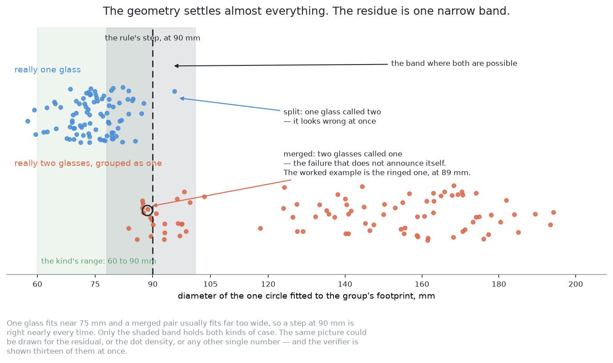
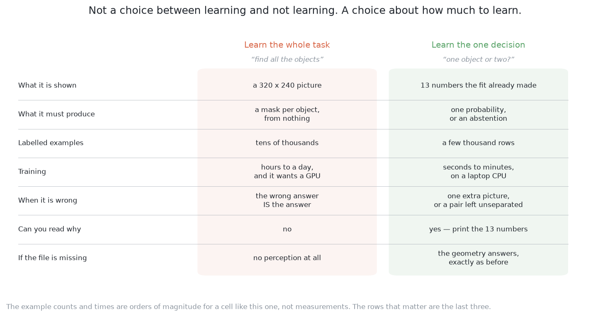
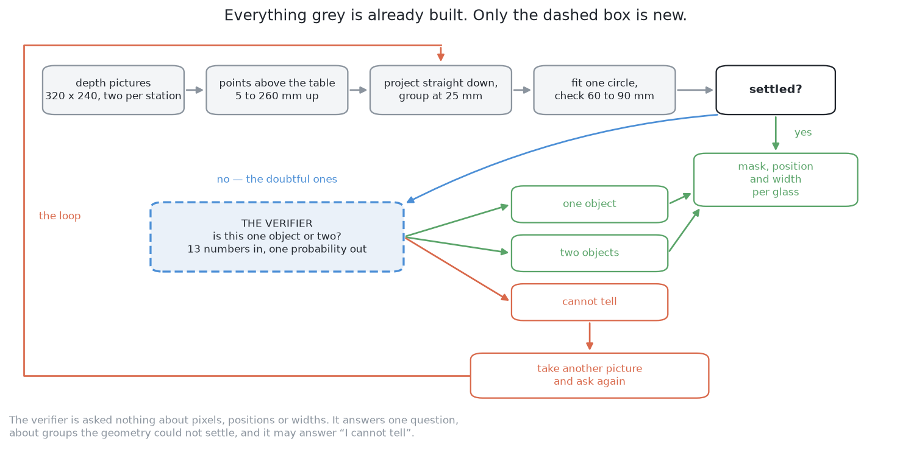
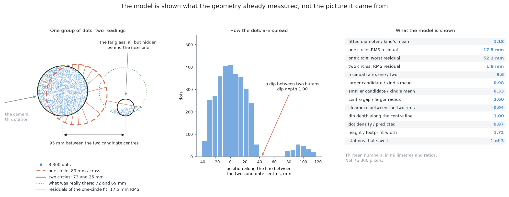
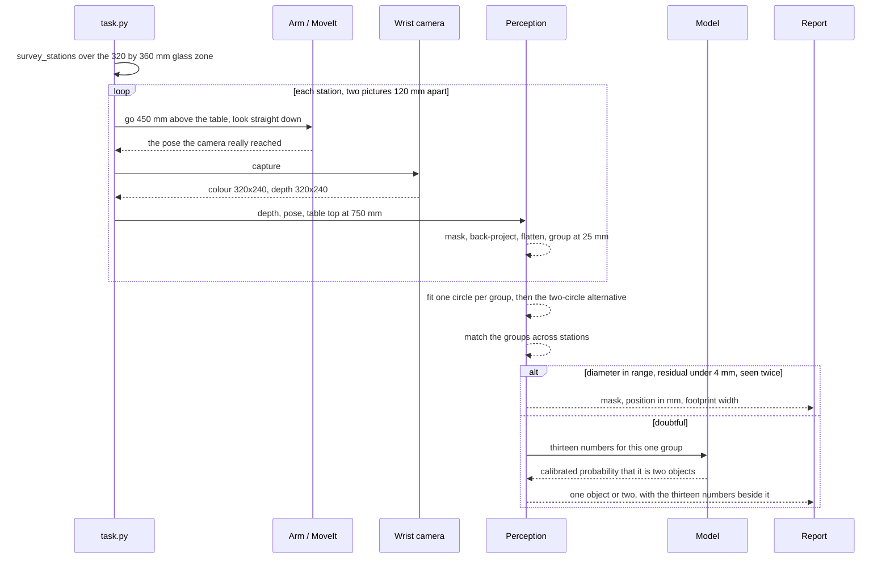
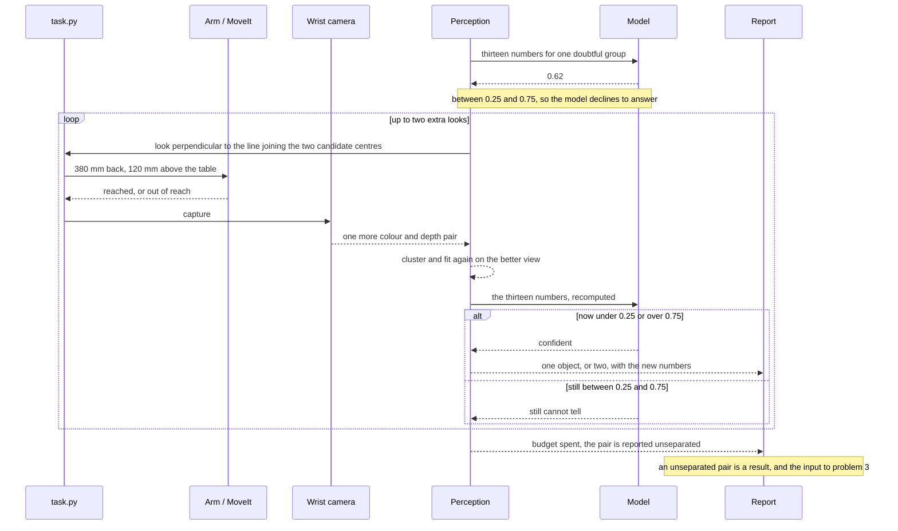
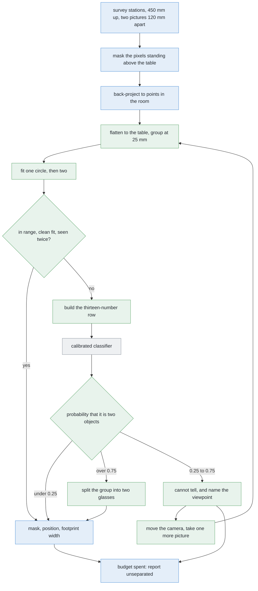
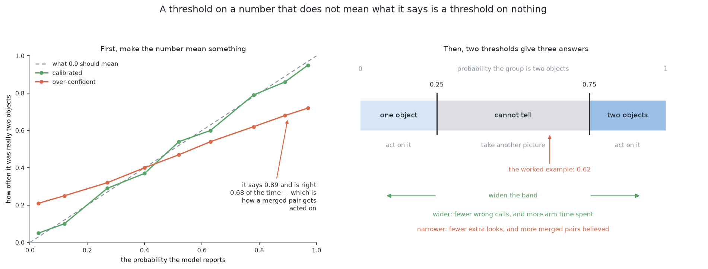
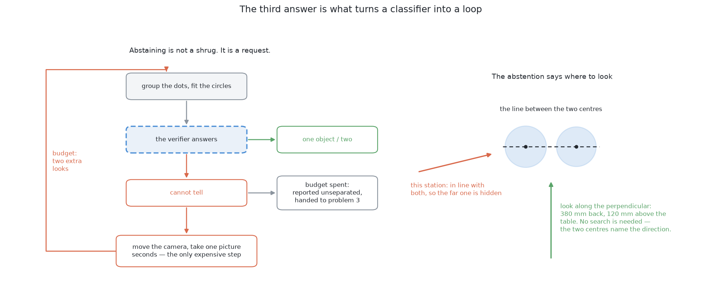
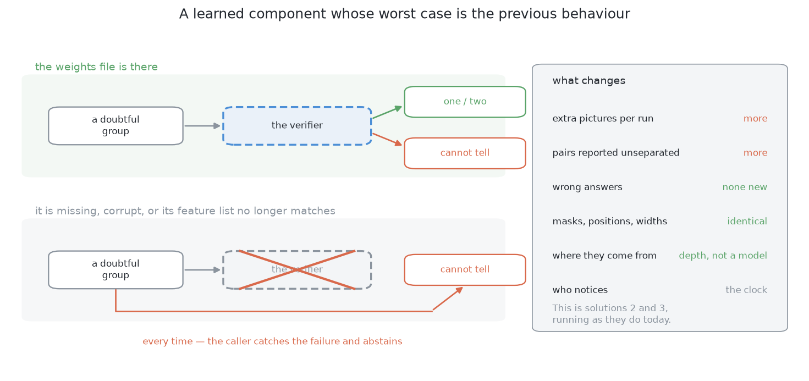

# Solution 5 — a learned verifier over the clusters

*Hybrid, with the model as a verifier. Do not learn the perception. Learn the
one question the rules are worst at — is this one object or two — from numbers
the rules have already worked out.*

> **The cell is described once, in [the cell](../../the-cell.md)** — the layout,
> the two camera poses, all four sensors, and the words this project uses them
> with. What follows is only what is specific to this solution.

## In one paragraph

Do not learn the perception. The geometry already separates almost every glass
on the table, in millimetres you can print. What it cannot settle is the handful
of groups on the boundary: one object, or two? So learn that one decision, from
the thirteen numbers the circle fit has already produced. The input is small, so
the model trains in minutes on a laptop. Its most useful answer is "I cannot
tell", which asks the arm for one more picture. Delete the weights file and the
geometry answers exactly as it did before.

## The problem this solves

Several glasses stand on a table. They are all of one kind, that kind is known,
and the arm has to say which pixels belong to which glass.

[Solution 2, cluster on the table](solution-overview.md#solution-2--cluster-on-the-table),
does that properly. Turn every pixel that has a depth reading into a point in
the room. Drop each point onto the table. Group the dots by how close they are.
Fit a circle to each group, and check its diameter against the range this kind of
glass is allowed to be. It is exact, it is fast, it needs no training data, and
every step is a number you can print.

It handles almost everything. But the circle fit has to commit to a threshold,
and reality has no step in it there.



Each dot is one group of points the clustering produced, placed by the diameter
of the circle fitted to it. The blue row was really one glass. The orange row was
really two. They barely overlap, which is why the rule works at all. But the
shaded band holds both, and a rule that has to answer "one or two" from that one
number has to guess inside it. The ringed orange dot at 89 millimetres is the
worked example further down.

That is the case `problem.md` says to watch hardest. Two real glasses reported as
one does not look wrong downstream. It looks like one large glass, and everything
after it believes that.

## Where it comes from

There are two honest ways to use a model here.

The first is to hand it the whole job: give it the picture, let it return one
mask per glass. That is
[solution 7](solution-overview.md#solution-7--a-segmenter-trained-from-scratch)
and [solution 8](solution-overview.md#solution-8--per-pixel-votes-for-the-centre).
It means the model owns every answer, including the thousands of easy ones the
geometry already gets right for free.

The second is to leave the geometry alone and add a model with one job: *look at
this one doubtful group and tell me whether it is one object or two.*



Read the last three rows first. They are the ones that decide whether a component
belongs in a machine that moves.

The pattern — **do not learn the whole task, learn the one decision the rules do
badly** — turns up everywhere under several names, and none of them has won.

- **Verifier** is used when a cheap stage proposes an answer and a second stage
  checks it. That is the closest fit, and the name this document uses.
- **Cascade** is used when cheap tests run first and an expensive one runs only
  on what survives, as in
  [OpenCV's cascade classifier](https://docs.opencv.org/4.x/db/d28/tutorial_cascade_classifier.html)
  for face detection. OpenCV is Apache-2.0
  ([licence](https://github.com/opencv/opencv/blob/4.x/LICENSE)).
- **A learned gate** is used when the model picks which branch of a rule-based
  system runs.
- **Residual learning** gets used in conversation to mean "learn what the rules
  got wrong". Avoid it in writing: in the literature it means the skip
  connections inside a ResNet ([He et al.](https://arxiv.org/abs/1512.03385)),
  which is a different thing entirely.

The reason the pattern exists is that the two families fail in opposite
directions.

A programmed rule is exact, cheap, inspectable and needs no data. But it must
commit to a number, and nothing in the physical world changes at 90 mm. So the
rule is wrong in a band around its own threshold, and choosing the number more
carefully only moves the band somewhere else.

A fitted model has a soft boundary instead, and it can use several weak pieces of
evidence at once. It pays for that with examples, with opacity, and with going
out of date. Ask it one narrow question and all three costs shrink at once.

## How it works, end to end



Everything grey already exists. The only new thing is the dashed box, and it is
asked only about the minority of groups the circle fit could not settle. It is
not shown pixels. It is shown thirteen numbers the fit has already computed. Note
what comes out of it: three answers, not two.

### The setup

The table top is at 750 mm (`TABLE_TOP_Z`, `table/layout.py`), and every height
in the cell is measured from it. The glasses stand in the glass zone,
`GLASS_ZONE = (0.32, 0.64, −0.44, −0.08)` in `rack/layout.py` — a patch of table
320 mm by 360 mm, on the far side from the rack. Four to six glasses stand in it,
all of one known kind, upright, solid, and at least 150 mm from each other.

The camera is on the wrist. `CAMERA_OFFSET` in `arm/dimensions.py` puts it 85 mm
to one side of `tool0` and 15 mm above it, so the fingers stay out of shot. That
also means pointing the tool at something is not the same as pointing the camera
at it. And moving the camera means moving the whole arm.

Known in advance: the table's height, the camera's lens settings, the kind's
footprint range, and solution 2's 25 mm grouping distance. Not known: how many
glasses there are, where they stand, or how big they are.

**No glass's size is written down anywhere in this project.** That is the rule
the whole repository is built on, and the verifier does not break it, because
nothing it outputs becomes a dimension.

What this solution adds to the cell is one file: a fitted model, and its loader.

### The pictures

The survey is solution 2's, unchanged. `survey_stations(GLASS_ZONE, footprint)`
in `arm/dimensions.py` works out how many places the camera has to be parked to
cover the zone, with `SURVEY_OVERLAP` of 0.35 so that nothing falls only on the
edge of a picture. At each station the camera goes to `SURVEY_HEIGHT` — **450 mm
above the table top** — and looks **straight down**.

Two pictures at each station, `SURVEY_BASELINE` = **120 mm** apart. One picture
from above cannot say how far away a glass is, only which direction it lies in.
The camera has to lay the outline down flat on the table, and a glass stands
above the table. How far a glass appears to shift between the two pictures is
what fixes where it really stands.

Why straight down from 450 mm, rather than level from 380 mm, which is how
problem 1 measures a glass? Because the level view merges constantly: the near
glass hides the far one. The survey view does not. Across 4320 legal
arrangements — four kinds, six sizes each, spacings from 150 to 300 mm, every
angle — not one pair came back as a single patch. One picture from 450 mm covers
520 by 390 mm of table, which holds the whole 320 by 360 mm zone.

This solution takes no extra pictures on the normal path. It asks for one only
when it says "I cannot tell", and then it names where to stand: perpendicular to
the line joining the two candidate centres, 380 mm back and 120 mm above the
table (`MEASURE_VIEW_HEIGHT`).

### What each picture captures

The wrist camera is an RGB-D sensor with a field of view of 1.047 radians and a
320 × 240 frame, which makes fx = fy = **277.1 pixels**. It works from 0.05 m to
3.0 m. One `capture()` returns:

- **colour**, 320 × 240 — used for the report's pictures, not for any
  measurement;
- **depth**, 320 × 240, one distance in metres per pixel, or nothing where the
  sensor got no return;
- **the camera's pose at the shutter**, a 4 × 4 matrix, recorded from where the
  camera really was rather than where the arm was sent. The camera sits 85 mm off
  to one side of the wrist, and the pair of pictures measures a distance between
  them, so a centimetre of error here goes straight into every reported position;
- **the mask**, from `standing_on_the_table()` in `glasses/detect.py`: a
  320 × 240 yes/no picture, where yes means the point behind that pixel sits
  above the table top.

At 450 mm, one pixel covers 450 / 277.1 = **1.62 mm** of table, so **2.64 mm²**
each. Two pictures per station means a patch of table that both of them see
arrives as about 2 / 2.64 = **0.758 dots per square millimetre**. That is the
yardstick the density feature is measured against.

It is deliberately crude — a glass's top is nearer the camera than the table is,
so a well-seen footprint comes in above that figure. Crude is enough, because the
model is shown the comparison rather than asked to trust it.

### What is interpreted, and how

In order:

1. **Back-projection.** Each masked pixel, its depth and the pose become a point
   in the room.
2. **Height filter.** Points at table height are the table. They go.
3. **Flattening.** Each surviving point drops to its (x, y) on the table.
4. **Clustering.** The flattened dots are grouped by distance, at 25 mm.
5. **Circle fit.** Least squares gives each group a centre, a diameter and an
   **RMS residual**. That last one is worth defining: take every point's distance
   from the fitted circle, square them, take the mean, take the square root. It
   is how far the points sit from the circle on average. One glass seen properly
   fits with a residual of a millimetre or two, because a glass really is round.
6. **The two-circle alternative.** Split the dots and fit each half, giving two
   candidate centres, two diameters and a second residual.
7. **Station agreement.** `where_they_stand()` matches the groups across the two
   pictures and across the stations, which fixes each position and each width.
8. **Range check.** The one-circle diameter against the kind's footprint range.

Steps 1 to 8 are solution 2. Everything below is new.

9. **The doubt trigger.** A group goes to the verifier if any of these hold: its
   one-circle diameter is within about 8 mm of either end of the kind's range; or
   its one-circle RMS residual is above about 4 mm; or only one station saw it.

   *Drawing that band is a design decision, not a detail.* Too narrow and the
   model never sees the cases that matter. Too wide and you are paying a model to
   answer questions arithmetic already answered. The residual condition is the one
   that earns its place: a merged pair can fit a perfectly in-range circle, but it
   cannot fit it *well*.
10. **The feature row.** Thirteen numbers, below.
11. **The classifier.** A calibrated model returns one probability that the group
    is two objects.
12. **The two thresholds.** Below 0.25, one object. Above 0.75, two. In between,
    "I cannot tell".



The model is **not** shown the picture. The thirteen numbers are:

| # | The number | What it asks |
| --- | --- | --- |
| 1 | fitted diameter, over the kind's mean diameter | is this the right size for one glass? |
| 2 | RMS residual of the one-circle fit | is it really round? |
| 3 | its single worst residual | is it round everywhere, or bent in one place? |
| 4 | larger candidate diameter, over the kind's mean | would one of two halves pass as a glass? |
| 5 | smaller candidate diameter, over the kind's mean | would the other? |
| 6 | RMS residual of the best two-circle fit | do two circles fit better? |
| 7 | the ratio of 2 to 6 | how much better? |
| 8 | gap between the two candidate centres, in fitted radii | are the two halves far enough apart to be separate things? |
| 9 | angular span of the dots around the fitted centre | is this a whole footprint, or an arc of one? |
| 10 | dot count against what the camera predicts at that range | is there enough evidence to say anything? |
| 11 | how many stations saw it | did more than one viewpoint agree? |
| 12 | how far its centre moved between stations | did it stay put, as a real object does? |
| 13 | its height above the table, over its footprint width | is the cloud glass-shaped? |

Number 9 is the one nothing else in the pipeline looks at, and it is the one
problem 2's own ambiguity turns on. At legal separations, glasses do not become
confusing by being close together. They become confusing when one stands behind
another from a station, and what comes back then is an arc rather than a whole
footprint.

**Why numbers rather than raw pixels.** Four reasons.

Every number above is a length in millimetres or a ratio of two lengths, so none
of them changes when the arm stands somewhere else. Projecting onto the table has
already removed the viewpoint. A model fed raw pixels has to learn the camera
before it can learn anything about glasses, and relearn it the day the camera
moves.

Thirteen numbers is a thirteen-dimensional problem. A 320 × 240 crop is a
76,800-dimensional one. That is the difference between a few thousand training
examples and tens of thousands.

The thirteen print beside the answer, so a wrong call is readable in seconds.

And a small model given pixels of simulator renderings will happily learn the
renderer's lighting or background instead of the glasses. Numbers in table
millimetres give it nothing of the sort to latch onto.

The honest cost: a feature is a piece of the answer written down by hand. If the
thirteen do not contain the evidence, no model can recover it. For this cell that
is a good trade, because the evidence here really is geometric.

### What comes out

Per glass, the same three things problem 2 asks for — and the verifier produces
none of them. A **mask** (which pixels in which picture), a **position** in
millimetres from the arm's base, and a **rough footprint width** in millimetres.
Those all come from depth measured during the run.

What the verifier adds is one line per doubtful group: **one object**, **two
objects**, or **cannot tell**, with the probability and the thirteen numbers
beside it.

A "cannot tell" is a request with an address, and it goes to the loop in
[solution 3, move the camera](solution-overview.md#solution-3--move-the-camera).
When the budget of extra looks is spent and the group is still doubtful, the pair
is written into the report as **unseparated**, which is a result and not a
failure, and is the handover to [problem 3](../../problem-3).

The verifier itself runs on the CPU in about a millisecond. The picture it can
ask for costs seconds of arm motion, because the camera is on the wrist. Three to
four orders of magnitude, and that ratio decides the design: **spend computation
freely, spend arm moves carefully.**

## The sequence

The normal path: the survey runs as solution 2 wrote it, and the verifier is
asked only about the groups the range check could not settle.



The interesting path: what "I cannot tell" does. The model declines, names a
viewpoint, and the arm goes and takes one more picture.



## In pseudocode



**Legend.** Green is new code, written for this solution or for the two it builds
on. Blue is code the project already has. Grey is a third-party library.

```text
stations = survey_stations(GLASS_ZONE, footprint)        # have · work_cell.arm.dimensions
for station in stations:                                 # have · work_cell.task
    for sideways in (-60.0, +60.0):                      # have · SURVEY_BASELINE / 2
        view, pose = arm.look_down_from(station, sideways)   # have · work_cell.task
        mask = detect.standing_on_the_table(view.depth, pose)  # have · work_cell.glasses.detect
        points = backproject(view.depth, mask, pose, K)  # have · work_cell.glasses.perception
        dots += points[:, :2]                            # NEW  · numpy
groups = cluster_by_distance(dots, 25.0)                 # NEW  · solution 2, numpy only
groups = where_they_stand(groups, stations)              # have · work_cell.glasses.detect

for group in groups:                                     # NEW  · solution 2
    one = fit_circle(group)                              # NEW  · numpy.linalg.lstsq
    two = fit_two_circles(group)                         # NEW  · solution 2, numpy
    if kind.accepts(one.diameter) and one.rms < 4.0 and group.stations > 1:
        report.table(one_glass(group, one))              # have · work_cell.report
        continue                                         # the geometry settled it

    row = thirteen_numbers(group, one, two, kind, K)     # NEW  · numpy
    p = verifier.predict_proba(row)                      # NEW  · sklearn, calibrated
    if p < 0.25:                                         # NEW  · the reject band
        report.table(one_glass(group, one))              # have · work_cell.report
    elif p > 0.75:
        report.table(two_glasses(group, two))            # have · work_cell.report
    elif group.looks_left > 0:
        arm.look_again(across(two.centres), 380.0, 120.0)    # NEW  · needs solution 3
    else:
        report.trouble(unseparated(group, row, p))       # have · work_cell.report
```

**The libraries.**

| Library | Used for | In the pixi environment? | Licence |
| --- | --- | --- | --- |
| [NumPy](https://numpy.org/) | back-projection, flattening, clustering, both circle fits, the feature row | **yes**, pinned `>=1.26,<3` | BSD-3-Clause ([licence](https://github.com/numpy/numpy/blob/main/LICENSE.txt)) |
| OpenCV | the mask and the connected components upstream of the clustering | **yes**, as `py-opencv` | Apache-2.0 ([licence](https://github.com/opencv/opencv/blob/4.x/LICENSE)) |
| [Gazebo](https://gazebosim.org/) | spawns the glasses, and its spawn record is where the labels come from | **yes**, already running | Apache-2.0 |
| [scikit-learn](https://scikit-learn.org/) | [`HistGradientBoostingClassifier`](https://scikit-learn.org/stable/modules/generated/sklearn.ensemble.HistGradientBoostingClassifier.html), [`RandomForestClassifier`](https://scikit-learn.org/stable/modules/generated/sklearn.ensemble.RandomForestClassifier.html) as the alternative, and [`CalibratedClassifierCV`](https://scikit-learn.org/stable/modules/generated/sklearn.calibration.CalibratedClassifierCV.html) | **no** — it would have to be added to `pixi.toml` from conda-forge | BSD-3-Clause ([licence](https://github.com/scikit-learn/scikit-learn/blob/main/COPYING)) |
| [PyTorch](https://pytorch.org/) | only if the thirteen numbers prove insufficient and a small convolutional network over a 32 × 32 crop is tried, on the Mac's [MPS backend](https://pytorch.org/docs/stable/notes/mps.html) | **no**, and not needed for the first version | BSD-3-style ([licence](https://github.com/pytorch/pytorch/blob/main/LICENSE)) |

Adding a dependency is a real decision, and scikit-learn is the only one this
solution actually requires.

A gradient-boosted tree asks a sequence of yes/no questions about single
numbers — "is the residual ratio above 3.2?" — and fits a few hundred small trees
in sequence, each one correcting what the previous ones got wrong. It suits this
problem for three reasons. The decision genuinely is a set of thresholds
combined. It does not care that the features are on wildly different scales. And
it trains on a CPU in seconds at this size.

That last point is not a nicety. **This is an Apple Silicon Mac with no NVIDIA
graphics card**, so anything wanting compiled CUDA kernels is not buildable here
at all. See [`learned-with-hardware.md`](learned-with-hardware.md) for the
methods moved out for exactly that reason.

**The training data costs nothing.** Gazebo spawns the glasses, so it knows how
many there are and where each one stands. Every group the clustering produces
during a simulated run is compared against that record and labelled *one* or
*two*, with no human involved.

Two things matter about collecting it.

**Do not sample uniformly.** Glasses scattered at random give overwhelmingly easy
groups. Spawn deliberately, at the legal separations of 150 mm and up, with
stations placed so that one glass stands behind another and the arc the camera
gets runs from a full circle down to a sliver. That is where problem 2's
ambiguity lives.

**Keep a held-out set.** Fit on one set of runs, and measure on runs the model
has never seen. A few thousand rows is the order to aim for. Whether generating
them is one hour or six on this machine is **not yet measured**, but it is an
overnight job at worst, and it runs unattended.

## A worked example

**This arrangement is below problem 2's floor, and is shown anyway.** The two
glasses stand 88 mm apart, against the 150 mm minimum problem 2 guarantees, so it
is not an input problem 2 can receive. It is the kind of pair
[problem 3](../../problem-3) exists to move apart.

It is here because it is the clearest picture of the failure that matters: an
in-range circle with a residual nobody checked. The same failure reaches problem 2
through one glass hiding another instead of through closeness, and the row below
is what the verifier would be handed either way. The numbers are not invented;
`make_05_images.py` computes them from the geometry drawn in the pictures above.

**The arrangement.** Two glasses of the kind whose footprint range is 60 to
90 mm. Their true diameters are 72 mm and 69 mm, and their centres are 88 mm
apart — so their rims are 88 − 36 − 34.5 = 17.5 mm from touching. At the 25 mm
grouping distance, that is one group, not two. The camera is almost in line with
both, so the near glass hides nearly all of the far one.

**What the geometry finds.** 3,300 dots. The single circle fitted to the group's
outline comes out at **88.6 mm across**. The kind's range is 60 to 90 mm. **88.6
is inside it.** The check that makes solution 2 safe passes, the two-circle
alternative is never tried, and one glass is reported where there are two —
without a single step of the pipeline doing anything wrong.

**What the geometry also has, and ignores.** The RMS residual of that fit is
**17.5 mm**, with a worst single residual of **52.2 mm**. A glass that really is
one round thing does not fit like that.

Split the dots in two and fit each half: **73.3 mm** and **24.8 mm**, with centres
**95.2 mm** apart and an RMS residual of **1.8 mm** — nine times better. But
24.8 mm is far below the kind's 60 mm floor, so the two-circle answer fails the
range check as well.

Both answers are defective, and the rule prefers the one that passes its check.

**The row handed to the verifier.**

| Feature | Value | Arithmetic |
| --- | --- | --- |
| fitted diameter / kind's mean | 1.18 | 88.6 / 75 |
| one circle: RMS residual | 17.5 mm | |
| one circle: worst residual | 52.2 mm | |
| two circles: RMS residual | 1.8 mm | |
| residual ratio, one / two | 9.6 | 17.47 / 1.81, before rounding |
| larger candidate / kind's mean | 0.98 | 73.3 / 75 |
| smaller candidate / kind's mean | 0.33 | 24.8 / 75 |
| centre gap / larger radius | 2.60 | 95.2 / 36.65 |
| clearance between the two rims | +0.94 | (95.2 − 36.65 − 12.4) / 49.05 |
| dip depth along the centre line | 1.00 | the gap between the humps is empty |
| dot density / predicted | 0.87 | (3,300 / 5,030) / 0.758 |
| height / footprint width | 1.72 | 152 / 88.6 |
| stations that saw it | 1 of 3 | |

Two entries differ from the list of thirteen above, because the generator draws a
single station and a close pair. It prints the rim clearance and the dip depth
along the centre line, which only a close pair makes informative, where a
problem-2 row would carry the angular span and the movement of the centre between
stations instead. The other eleven line up.

**What comes back.** The verifier has not been built, so this number is
illustrative rather than measured: something like **0.62**, the probability that
this is two objects. Above even, because of the residual, the empty dip and the
thin evidence. Not far above, because the diameter is comfortably in range and
one of the two candidate circles is nonsense.

0.62 falls between the two thresholds, so the verifier **declines to answer**.

**What that buys.** The arm takes one more picture, from the perpendicular to the
line joining the two candidate centres, 380 mm back and 120 mm above the table.
Re-clustered and re-fitted, the group becomes two circles of **72 mm** and
**69 mm**, centres **88 mm** apart, both inside the range. The geometry answers on
its own.

The model's contribution was not the answer. It was knowing that it did not have
one, and where to look.

## The feedback loop

A classifier that must answer is a component. A classifier that may decline is a
**loop**, because declining is a request for another measurement, and another
measurement is something the arm can go and take.

### Calibration first

A model that outputs 0.9 is claiming that, among all the cases it scores 0.9,
about nine in ten really are two objects. A model whose outputs behave that way
is **calibrated**.

Models very often are not. They report 0.9 and are right two thirds of the time,
or report 0.5 and are right nearly always. The standard reference for how badly
modern networks do this is [Guo et al.](https://arxiv.org/abs/1706.04599).



On the left is a **reliability diagram**: the probability the model reported along
the bottom, and how often that turned out to be right up the side. The dashed
diagonal is what an honest number looks like. The orange curve is the failure to
fear — it says 0.89 and is right 0.68 of the time, which is precisely how a merged
pair gets confidently acted on.

Fixing this is routine and cheap. Fit the model, then fit a second, tiny function
that maps its raw scores onto honest probabilities, using held-out data the model
never trained on.
[scikit-learn's calibration guide](https://scikit-learn.org/stable/modules/calibration.html)
covers both usual choices: fitting an S-shaped curve, and isotonic regression,
which fits any curve that only goes up. And
[`CalibratedClassifierCV`](https://scikit-learn.org/stable/modules/generated/sklearn.calibration.CalibratedClassifierCV.html)
does it in one line. It costs a held-out set and about a second.

### Then the two thresholds

On the right of the same picture: one confidence axis, two thresholds, three
answers.

- below 0.25 — **one object**; act on it;
- above 0.75 — **two objects**; act on it;
- in between — **cannot tell**; go and take another picture.

That is a **reject option**: the model may hand the question back instead of
guessing. The oldest reference is Chow, *On optimum recognition error and reject
tradeoff*, IEEE Transactions on Information Theory, 1970
([DOI](https://doi.org/10.1109/TIT.1970.1054406)). The modern literature calls it
selective prediction.

The band is a dial with a cost on each side. Widen it and more groups get a
second look: fewer wrong calls, more arm time. Narrow it and the arm moves less,
and more merged pairs get believed. Because a merged pair is the expensive failure
and arm time is merely slow, the band should start wide and be narrowed only when
a scored run shows the extra looks are not changing any answers.

### What "I cannot tell" asks for



Declining is not a shrug. It is a request with an address, and that is what makes
it cheap.

The two-circle fit has already produced two candidate centres. If those centres
are real, the viewpoint that separates them is the one perpendicular to the line
joining them — from there the two stand side by side instead of one behind the
other. So the next viewpoint needs no search and no scoring model. The refusal
names it.

The loop stops when the verifier is confident, or when the budget of two extra
looks is spent. If the budget runs out and the group is still doubtful, that is a
**result**: the pair is reported unseparated and handed to
[problem 3](../../problem-3), whose job is to move glasses apart.

This is the same loop that
[solution 3, move the camera](solution-overview.md#solution-3--move-the-camera)
runs on a hand-written rule. The verifier does not replace that loop. It gives it
a better reason to fire.

## What it needs

**Hardware.** Nothing beyond the machine already in use. No CUDA, no graphics
card, no external service.

**Data.** A few thousand labelled rows, generated in simulation, weighted towards
the ambiguous band, as described above.

**Code.** A feature extractor of roughly thirty lines on top of solution 2's
clustering; a loader; a training script. The heaviest part is the data generation
harness, not the model.

**Artefacts, and one discipline about them.** One version-pinned model file,
checked in beside its loader. Its size is **not yet known**, but a few hundred
small trees is kilobytes, not megabytes.

And **store a hash of the feature list inside the file**. Add a feature, change an
order, rename something, and the loader must refuse the old model rather than
quietly feed it the wrong thirteen numbers. A silently misread model is much worse
than a missing one. A missing one falls back to the geometry. A misread one
answers confidently from nonsense.

## Where it is strong and where it breaks

**Strong**

- One yes-or-no question, thirteen inputs, a readable training set. It fits in
  one head, and Gazebo regenerates the labels, so retraining costs seconds.
- It cannot invent a glass, move a position or change a width. Worst case: one
  extra picture, or a pair handed to problem 3.
- It degrades to pure geometry. Missing file, hash mismatch, failed import — the
  caller declines on every doubtful group, as solutions 2 and 3 do today, and
  masks, positions and widths are identical. Most learned components fail to
  *nothing*. This one fails to *the previous system*.



**Breaks**

- It is only as good as its hand-written trigger band. A group never routed to it
  is never verified.
- It can be confidently wrong. A merged pair scored 0.05 passes every gate, and
  only the calibration check against the simulator's record catches it.
- Drift in the camera, the table height or the lighting puts every group in the
  band. That is loud, and it costs time rather than correctness.
- It goes stale silently when the spawner changes. The feature hash catches a
  changed feature set, not a changed world.
- It holds a size-shaped prior in a file, which sits beside
  [the rule that governs this repo](../../../CLAUDE.md).
- Problem 4 turns "one or two" into "one or two, of which kinds".
- It needs depth, and real glassware returns none.

**Right when** the rules already get most of the way, the failure left is one
nameable decision, and the truth is cheap to obtain. All three hold here. Measure
the failure before building this.

## The general methods behind this

The pattern here — cheap exact method first, small learned model only on the
cases it cannot settle — is old, well named, and used far outside vision.

### Cascades — a cheap test first, an expensive one only where it is needed

Arrange classifiers in order of cost. The cheap one handles the easy majority and
passes only the doubtful remainder to the expensive one. The best-known example is
the **Viola–Jones** face detector (CVPR 2001), which made real-time face detection
possible in 2001 by rejecting almost every part of an image in a few arithmetic
operations.

- **Mostly used for** anything with a large easy majority and a small hard
  minority: detection over a whole image, spam filtering, fraud screening, and any
  pipeline where the accurate method is too slow to run everywhere.
- **Rarely right for** problems where the cheap stage cannot be made both fast
  *and* safe. A cascade is only as good as its first stage: whatever that wrongly
  throws away, no later stage ever sees.
- **More:** [Viola–Jones](https://en.wikipedia.org/wiki/Viola%E2%80%93Jones_object_detection_framework).

### Classification with a reject option — a model allowed to say "I cannot tell"

Instead of forcing every input into a class, allow a third answer: decline, and
hand the case to something else — another sensor, another viewpoint, a human. The
best rule is old and simple (C. K. Chow,
[*On optimum recognition error and reject tradeoff*](https://doi.org/10.1109/TIT.1970.1054406),
IEEE Trans. Information Theory, 1970): decline when the best class probability
falls below a threshold set by the relative cost of an error and a refusal.

- **Mostly used for** settings where being wrong is expensive and a fallback
  exists: medical triage, document processing with a human in the loop,
  industrial inspection, and any robot that can take another measurement.
- **Rarely right for** systems with no fallback. If declining just means failing,
  a reject option turns errors into refusals without helping. It also needs
  calibrated probabilities before the threshold means anything at all.
- **More:** [calibration](https://scikit-learn.org/stable/modules/calibration.html),
  which is what makes the threshold meaningful.

### Gradient-boosted trees and random forests — the right size of model for a dozen numbers

Two families for data that comes in rows and columns. **Random forests** (Breiman,
2001) average many deep trees, each grown on a different random slice of the data.
**Gradient boosting** (Friedman, 2001) fits many shallow trees in sequence, each
correcting the last. On a handful of hand-chosen numbers, both beat a neural
network for accuracy, training time and explainability, and neither needs a
graphics card.

- **Mostly used for** row-and-column problems, which is the great majority of
  applied machine learning outside images, text and audio. They are still the
  default first thing to try, and frequently the last.
- **Rarely right for** raw high-dimensional signals where nobody knows which
  features matter: pixels, waveforms, language. There the network wins precisely
  because nobody has to name the features.
- **More:** [random forest](https://en.wikipedia.org/wiki/Random_forest);
  [gradient boosting](https://en.wikipedia.org/wiki/Gradient_boosting);
  [`HistGradientBoostingClassifier`](https://scikit-learn.org/stable/modules/generated/sklearn.ensemble.HistGradientBoostingClassifier.html).

### Hand-chosen features against end-to-end learning

Handing a model thirteen numbers in millimetres rather than a 76,800-pixel crop is
a deliberate choice with a known trade. Hand-chosen features need hundreds of
examples where raw pixels need tens of thousands. They do not change when
something you have already accounted for changes. Each one prints beside the
answer. The cost is that the model can only see what the features contain.

- **Mostly used for** small-data problems, regulated fields where decisions have
  to be explainable, and pipelines where a reliable geometric stage already
  produces meaningful quantities.
- **Rarely right for** problems where the telling detail is not something anyone
  can name in advance — which is most of perception, and why the other learned
  solutions here take pixels.

← [The problem](../problem.md) ·
[Solution overview](solution-overview.md#solution-5--a-learned-verifier-over-the-clusters) ·
[Problem 3 — moving them apart](../../problem-3) →
