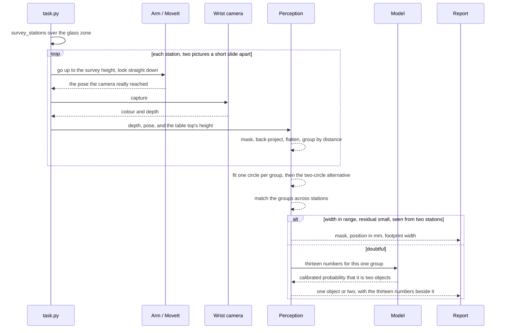
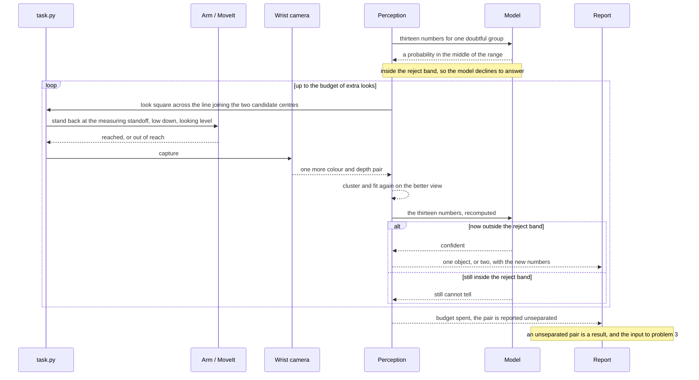
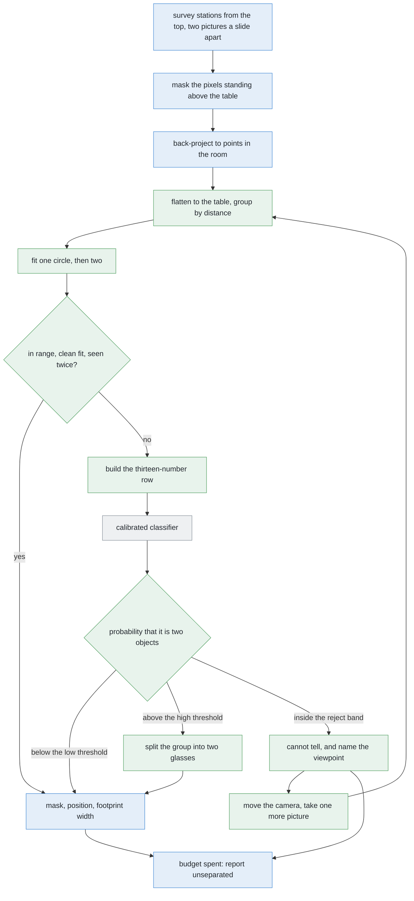

# Solution 5 — a learned verifier over the clusters

*Hybrid, with the model as a verifier. Do not learn the perception. Learn the
one question the rules are worst at — is this one object or two — from numbers
the rules have already worked out.*

> **The cell is described once, in [the cell](../../the-cell.md)** — the layout,
> the two places the camera works from, from the top and from the side, all four
> sensors, and the words this project uses them with. What follows is only what
> is specific to this solution.

## In one paragraph

Do not learn the perception. The geometry already separates almost every glass
on the table, in millimetres you can print. What it cannot settle is the handful
of groups on the boundary: one object, or two? So learn that one decision, from
the thirteen numbers the circle fit has already produced. The input is small, so
the model trains in minutes on a laptop. Its most useful answer is "I cannot
tell", which asks the arm for one more picture. Delete the weights file and the
geometry answers exactly as it did before.

## The problem this solves

Several glasses stand on a table. They are all of one kind, that kind is known,
and the arm has to say which pixels belong to which glass.

[Solution 2, cluster on the
table](solution-overview.md#solution-2--cluster-on-the-table), does that
properly. Turn every pixel that has a depth reading into a point in the room.
Drop each point onto the table. Group the dots by how close they are. Fit a
circle to each group, and check its diameter against the range this kind of
glass is allowed to be. It is exact, it is fast, it needs no training data, and
every step is a number you can print.

It handles almost everything. But the circle fit has to commit to a threshold,
and reality has no step in it there.


Each dot is one group of points the clustering produced, placed along the axis
by the width of the circle fitted to it. The blue row was really one glass. The
orange row was really two. They barely overlap, which is exactly why the simple
rule works as well as it does. But the shaded band in the middle holds both
kinds, and a rule that has to answer "one or two" from that single number has no
choice but to guess inside it. The ringed orange dot near the top of the allowed
range is the worked example further down this page.

That is the case `problem.md` says to watch hardest. Two real glasses reported
as one does not look wrong downstream. It looks like one large glass, and
everything after it believes that.

## Where it comes from

There are two honest ways to use a model here.

The first is to hand it the whole job: give it the picture, let it return one
mask per glass. That is [solution
7](solution-overview.md#solution-7--a-segmenter-trained-from-scratch) and
[solution 8](solution-overview.md#solution-8--per-pixel-votes-for-the-centre).
It means the model owns every answer, including the thousands of easy ones the
geometry already gets right for free.

The second is to leave the geometry alone and add a model with one job: *look at
this one doubtful group and tell me whether it is one object or two.*


Read the last three rows first. They are the ones that decide whether a
component belongs in a machine that moves.

The pattern — **do not learn the whole task, learn the one decision the rules do
badly** — turns up everywhere under several names, and none of them has won.

- **Verifier** is used when a cheap stage proposes an answer and a second stage
  checks it. That is the closest fit, and the name this document uses.
- **Cascade** is used when cheap tests run first and an expensive one runs only
  on what survives, as in [OpenCV's cascade
  classifier](https://docs.opencv.org/4.x/db/d28/tutorial_cascade_classifier.html)
  for face detection. OpenCV is Apache-2.0
  ([licence](https://github.com/opencv/opencv/blob/4.x/LICENSE)).
- **A learned gate** is used when the model picks which branch of a rule-based
  system runs.
- **Residual learning** gets used in conversation to mean "learn what the rules
  got wrong". Avoid it in writing: in the literature it means the skip
  connections inside a ResNet ([He et al.](https://arxiv.org/abs/1512.03385)),
  which is a different thing entirely.

The reason the pattern exists is that the two families fail in opposite
directions.

A programmed rule is exact, cheap, inspectable and needs no data. But it must
commit to a single cut-off, and **nothing in the physical world changes at that
cut-off**. A group a hair under it and a group a hair over it are the same kind
of object. So the rule is wrong in a band around its own threshold, and choosing
the threshold more carefully does not remove the band — it only slides the band
somewhere else.

A fitted model has a soft boundary instead, and it can use several weak pieces
of evidence at once. It pays for that with examples, with opacity, and with
going out of date. Ask it one narrow question and all three costs shrink at
once.

## How it works, end to end


Everything grey already exists. The only new thing is the dashed box, and it is
asked only about the minority of groups the circle fit could not settle. It is
not shown pixels. It is shown thirteen numbers the fit has already computed.
Note what comes out of it: three answers, not two.

### The setup

The table top's height is a constant (`TABLE_TOP_Z` in `table/layout.py`), and
every height in the cell is measured up from it. The glasses stand in the
**glass zone** (`GLASS_ZONE`), a patch of table a little wider than it is deep,
on the far side from the rack. Four to six glasses stand in it, all of one known
kind, upright, solid, and never closer to each other than the smallest gap
problem 2 promises.

The camera is on the wrist. `CAMERA_OFFSET` in `arm/dimensions.py` puts it a
little to one side of the tool centre and a little above it, which is what keeps
the fingers out of shot. It also means that pointing the *tool* at something is
not the same as pointing the *camera* at it. And because the camera rides on the
wrist, moving the camera means moving the whole arm.

Known in advance: the table's height, the camera's lens settings, the range of
footprint widths this kind of glass can be, and solution 2's grouping distance.
Not known: how many glasses there are, where they stand, or how big they are.

**No glass's size is written down anywhere in this project.** That is the rule
the whole repository is built on, and the verifier does not break it, because
nothing it outputs becomes a dimension.

What this solution adds to the cell is one file: a fitted model, and its loader.

### The pictures

The survey is solution 2's, unchanged, and it works **from the top**.
`survey_stations(GLASS_ZONE, footprint)` in `arm/dimensions.py` works out how
many places the camera has to be parked to cover the zone, overlapping them
(`SURVEY_OVERLAP`) so that nothing ends up only on the edge of a picture. At
each station the camera goes up to the survey height (`SURVEY_HEIGHT`) and looks
**straight down**.

Two pictures at each station, a short slide apart (`SURVEY_BASELINE`). One
picture from the top cannot say how far away a glass is, only which direction it
lies in. So the camera can only lay the outline down flat on the table — and a
glass stands above the table, which pushes the laid-down outline outwards. How
far the glass appears to shift between the two pictures is what fixes how tall
it is, and therefore where it really stands.

Why from the top, rather than from the side, which is how problem 1 measures a
glass? Because from the side, merging is constant: the near glass hides the far
one, and it takes only one pair standing in line. From the top it does not
happen at all. We checked that against every legal arrangement the cell's scene
generator can make — thousands of them, all four kinds, every spacing, every
angle — and not one pair came back as a single patch. One picture from the
survey height covers more table than the whole glass zone, so the zone is always
in frame.

This solution takes no extra pictures at all on the normal path. It asks for one
only when it says "I cannot tell", and when it does, it **names where to
stand**: square across the line joining the two candidate centres, at the
measuring standoff, low down (`MEASURE_VIEW_HEIGHT`). Square across that line is
the direction from which two things standing side by side separate most.

### What each picture captures

The wrist camera is an RGB-D sensor: colour and depth through one lens, both
pictures small and the same size, with a near limit and a far limit on the
depth. One `capture()` returns:

- **a colour picture** — used for the pictures in the report, not for any
  measurement;
- **a depth picture** of the same size, one distance per pixel, or nothing where
  the sensor got no return at all;
- **the camera's pose at the shutter**, recorded from where the camera really
  was rather than from where the arm was sent. This matters more here than
  anywhere else in the cell, because the pair of pictures *measures a distance
  between two poses*. An error in the pose does not average out — it goes
  straight into every position the cell reports;
- **the mask**, from `standing_on_the_table()` in `glasses/detect.py`: a yes/no
  picture the same size, where yes means the point behind that pixel sits above
  the table top.

One more thing follows from the lens, and the density feature below depends on
it. The lens spreads a fixed angle over a fixed number of pixels, so how much
table one pixel covers depends only on how high the camera is. That gives an
expected number of dots per unit area of table — a yardstick the measured dot
count can be compared against. A footprint that returns far fewer dots than the
yardstick predicts was mostly hidden.

The yardstick is deliberately crude. A glass's top is nearer the camera than the
table is, so a well-seen footprint actually comes in a little *above* it. Crude
is enough, because the model is shown the comparison and left to make of it what
it will, rather than being asked to trust the number.

### What is interpreted, and how

In order:

1. **Back-projection.** Each masked pixel, its depth and the pose become a point
   in the room.
2. **Height filter.** Points at table height are the table. They go.
3. **Flattening.** Each surviving point drops to its (x, y) on the table.
4. **Clustering.** The flattened dots are chained into groups by how close
   together they are.
5. **Circle fit.** Least squares gives each group a centre, a diameter and an
   **RMS residual**. That last one is worth defining: take every point's
   distance from the fitted circle, square them, take the mean, take the square
   root. It is how far the points sit from the circle on average. One glass seen
   properly fits with a residual of a millimetre or two, because a glass really
   is round.
6. **The two-circle alternative.** Split the dots and fit each half, giving two
   candidate centres, two diameters and a second residual.
7. **Station agreement.** `where_they_stand()` matches the groups across the two
   pictures and across the stations, which fixes each position and each width.
8. **Range check.** The one-circle diameter against the kind's footprint range.

Steps 1 to 8 are solution 2. Everything below is new.

9. **The doubt trigger.** A group goes to the verifier if any one of three
   things holds: its fitted width lands close to either end of the kind's
   allowed range; or its residual is larger than a well-seen single glass ever
   gives; or only one station saw it at all.

   *Drawing that band is a design decision, not a detail.* Too narrow and the
   model never sees the cases that actually matter, so it earns nothing. Too wide
   and you are paying a model to answer questions the arithmetic already answered
   perfectly well. Of the three conditions, the residual one really earns its
   place: a merged pair can fit a circle whose width is perfectly in range, but
   it cannot fit that circle *well*, because two humps are not a circle.
10. **The feature row.** Thirteen numbers, listed below.
11. **The classifier.** A calibrated model returns one probability that the
    group is two objects rather than one.
12. **The two thresholds.** There are two, not one, and that is the whole point.
    Below the **low** threshold the model is confident it is one object, and the
    pipeline acts on that. Above the **high** threshold it is confident it is
    two, and the pipeline acts on that. Between the two it says **"I cannot
    tell"**, and the pipeline goes and takes another picture instead of guessing.
    The gap between the thresholds is called a *reject band*, and widening it
    trades answers for honesty.


The model is **not** shown the picture. The thirteen numbers are:

| # | The number | What it asks |
| --- | --- | --- |
| 1 | fitted width, as a fraction of a typical glass of this kind | is this the right size for one glass? |
| 2 | RMS residual of the one-circle fit | is it really round? |
| 3 | its single worst residual | is it round everywhere, or bent in one place? |
| 4 | larger candidate width, as the same fraction | would one of two halves pass as a glass? |
| 5 | smaller candidate width, as the same fraction | would the other? |
| 6 | RMS residual of the best two-circle fit | do two circles fit better? |
| 7 | the ratio of 2 to 6 | how much better? |
| 8 | gap between the two candidate centres, measured in fitted radii | are the two halves far enough apart to be separate things? |
| 9 | angular span of the dots around the fitted centre | is this a whole footprint, or only an arc of one? |
| 10 | dot count against what the camera predicts at that height | is there enough evidence here to say anything at all? |
| 11 | how many stations saw it | did more than one viewpoint agree? |
| 12 | how far its centre moved between stations | did it stay put, as a real object does? |
| 13 | its height above the table, over its footprint width | is the cloud glass-shaped? |

Number 9 is the one nothing else in the pipeline looks at, and it is the one
problem 2's own ambiguity turns on. At legal separations, glasses do not become
confusing by being close together. They become confusing when one stands behind
another from a station, and what comes back then is an arc rather than a whole
footprint.

**Why numbers rather than raw pixels.** Four reasons.

Every number above is a length in millimetres or a ratio of two lengths, so none
of them changes when the arm stands somewhere else. Projecting onto the table
has already removed the viewpoint. A model fed raw pixels has to learn the
camera before it can learn anything about glasses, and relearn it the day the
camera moves.

Thirteen numbers is a thirteen-dimensional problem. A crop of the picture is a
problem with as many dimensions as it has pixels — thousands of them. Roughly
speaking, the more dimensions a model has to learn over, the more examples it
needs, and that difference is the difference between a training set you can
generate in an afternoon and one you cannot.

The thirteen numbers print beside the answer, so a wrong call can be read and
understood in seconds rather than being a black box.

And a small model given raw pixels from a simulator will happily learn the
renderer's lighting or its background instead of learning anything about
glasses. It then fails the moment either changes. Lengths measured on the table
give it nothing of that sort to seize on.

The honest cost: a feature is a piece of the answer written down by hand. If the
thirteen do not contain the evidence, no model can recover it. For this cell
that is a good trade, because the evidence here really is geometric.

### What comes out

Per glass, the same three things problem 2 asks for — and the verifier produces
none of them. A **mask** (which pixels in which picture), a **position** in
millimetres from the arm's base, and a **rough footprint width** in millimetres.
Those all come from depth measured during the run.

What the verifier adds is one line per doubtful group: **one object**, **two
objects**, or **cannot tell**, with the probability and the thirteen numbers
beside it.

A "cannot tell" is a request with an address, and it goes to the loop in
[solution 3, move the camera](solution-overview.md#solution-3--move-the-camera).
When the budget of extra looks is spent and the group is still doubtful, the
pair is written into the report as **unseparated**, which is a result and not a
failure, and is the handover to [problem 3](../../problem-3).

The verifier itself runs on the CPU in about a millisecond. The picture it can
ask for costs seconds of arm motion, because the camera is on the wrist. That is
a difference of thousands of times over, and that one ratio decides the whole
design: **spend computation freely, spend arm moves carefully.**

## The sequence

The normal path: the survey runs as solution 2 wrote it, and the verifier is
asked only about the groups the range check could not settle.



The interesting path: what "I cannot tell" does. The model declines, names a
viewpoint, and the arm goes and takes one more picture.



## In pseudocode



**Legend.** Green is new code, written for this solution or for the two it
builds on. Blue is code the project already has. Grey is a third-party library.

```text
stations = survey_stations(GLASS_ZONE, footprint)        # have · work_cell.arm.dimensions
for station in stations:                                 # have · work_cell.task
    for sideways in station.slide(SURVEY_BASELINE):      # have · work_cell.task
        view, pose = arm.look_down_from(station, sideways)   # have · work_cell.task
        mask = detect.standing_on_the_table(view.depth, pose)  # have · work_cell.glasses.detect
        points = backproject(view.depth, mask, pose, K)  # have · work_cell.glasses.perception
        dots += points[:, :2]                            # NEW  · numpy
groups = cluster_by_distance(dots, GROUP_GAP)            # NEW  · solution 2, numpy only
groups = where_they_stand(groups, stations)              # have · work_cell.glasses.detect

for group in groups:                                     # NEW  · solution 2
    one = fit_circle(group)                              # NEW  · numpy.linalg.lstsq
    two = fit_two_circles(group)                         # NEW  · solution 2, numpy
    if kind.accepts(one.width) and one.rms < CLEAN and group.stations > 1:
        report.table(one_glass(group, one))              # have · work_cell.report
        continue                                         # the geometry settled it

    row = thirteen_numbers(group, one, two, kind, K)     # NEW  · numpy
    p = verifier.predict_proba(row)                      # NEW  · sklearn, calibrated
    if p < LOW:                                          # NEW  · below the band
        report.table(one_glass(group, one))              # have · work_cell.report
    elif p > HIGH:                                       # NEW  · above the band
        report.table(two_glasses(group, two))            # have · work_cell.report
    elif group.looks_left > 0:                           # NEW  · inside the band
        arm.look_again(across(two.centres), STANDOFF)    # NEW  · needs solution 3
    else:
        report.trouble(unseparated(group, row, p))       # have · work_cell.report
```

**The libraries.**

| Library | Used for | In the pixi environment? | Licence |
| --- | --- | --- | --- |
| [NumPy](https://numpy.org/) | back-projection, flattening, clustering, both circle fits, the feature row | **yes**, pinned `>=1.26,<3` | BSD-3-Clause ([licence](https://github.com/numpy/numpy/blob/main/LICENSE.txt)) |
| OpenCV | the mask and the connected components upstream of the clustering | **yes**, as `py-opencv` | Apache-2.0 ([licence](https://github.com/opencv/opencv/blob/4.x/LICENSE)) |
| [Gazebo](https://gazebosim.org/) | spawns the glasses, and its spawn record is where the labels come from | **yes**, already running | Apache-2.0 |
| [scikit-learn](https://scikit-learn.org/) | [`HistGradientBoostingClassifier`](https://scikit-learn.org/stable/modules/generated/sklearn.ensemble.HistGradientBoostingClassifier.html), [`RandomForestClassifier`](https://scikit-learn.org/stable/modules/generated/sklearn.ensemble.RandomForestClassifier.html) as the alternative, and [`CalibratedClassifierCV`](https://scikit-learn.org/stable/modules/generated/sklearn.calibration.CalibratedClassifierCV.html) | **no** — it would have to be added to `pixi.toml` from conda-forge | BSD-3-Clause ([licence](https://github.com/scikit-learn/scikit-learn/blob/main/COPYING)) |
| [PyTorch](https://pytorch.org/) | only if the thirteen numbers prove insufficient and a small convolutional network over a crop of the picture is tried, on the Mac's [MPS backend](https://pytorch.org/docs/stable/notes/mps.html) | **no**, and not needed for the first version | BSD-3-style ([licence](https://github.com/pytorch/pytorch/blob/main/LICENSE)) |

Adding a dependency is a real decision, and scikit-learn is the only one this
solution actually requires.

A gradient-boosted tree asks a sequence of yes/no questions about single numbers
— "is the residual ratio above 3.2?" — and fits a few hundred small trees in
sequence, each one correcting what the previous ones got wrong. It suits this
problem for three reasons. The decision genuinely is a set of thresholds
combined. It does not care that the features are on wildly different scales. And
it trains on a CPU in seconds at this size.

That last point is not a nicety. **This is an Apple Silicon Mac with no NVIDIA
graphics card**, so anything wanting compiled CUDA kernels is not buildable here
at all. See [`learned-with-hardware.md`](learned-with-hardware.md) for the
methods moved out for exactly that reason.

**The training data costs nothing.** Gazebo spawns the glasses, so it knows how
many there are and where each one stands. Every group the clustering produces
during a simulated run is compared against that record and labelled *one* or
*two*, with no human involved.

Two things matter about collecting it.

**Do not sample uniformly.** Glasses scattered at random give overwhelmingly
easy groups, and a model trained on easy groups learns nothing useful. Spawn
deliberately: at the tightest legal separations, with the stations placed so
that one glass stands behind another, and with the arc the camera gets running
all the way from a full circle down to a sliver. That whole range is where
problem 2's real ambiguity lives.

**Keep a held-out set.** Fit on one set of runs, and measure on runs the model
has never seen. A few thousand rows is the order of magnitude to aim for. How
long generating them takes on this machine is **not yet measured**, but it is an
overnight job at worst, and it runs unattended.

## A worked example

**This arrangement is closer than problem 2 ever allows, and is shown anyway.**
The two glasses stand much nearer to each other than the smallest gap problem 2
guarantees, so it is not an input problem 2 can actually receive. It is the kind
of pair [problem 3](../../problem-3) exists to move apart.

It is here because it is the clearest possible picture of the failure that
matters: **a circle whose width is inside the allowed range, with a residual
nobody checked.** The same failure reaches problem 2 by a different route — one
glass hiding another, rather than the two being close — and the row below is
what the verifier would be handed either way.

**The arrangement.** Two glasses of one kind, both ordinary widths for that
kind, standing so close that the gap between their rims is far narrower than the
grouping distance. So the chain crosses, and it is one group rather than two.
The camera is almost in line with both, so the near glass hides nearly all of
the far one.

**What the geometry finds.** The single circle fitted to the group comes out
**just inside the top of the kind's allowed range**. That is the whole problem
in one sentence. The check that makes solution 2 safe *passes*. The two-circle
alternative is therefore never even tried. One glass is reported where there are
two, and not a single step of the pipeline has done anything wrong.

**What the geometry also has, and throws away.** The residual of that fit is
enormous — many times what a well-seen single glass gives, with one point
sitting further from the fitted circle than a whole glass is wide. A thing that
really is one round object does not fit a circle like that. The evidence was
there; nobody looked at it.

Now split the dots in two and fit each half. The residual collapses to about
what a real glass gives — the fit is *an order of magnitude better*. But the two
halves come out lopsided: one is a plausible glass and the other is far too
small to be a glass of this kind. So the two-circle answer fails the range check
as well.

**Both answers are defective, and the rule prefers the one that passes its
check.** That is the trap, and no amount of moving the threshold gets out of it.

**The row handed to the verifier.** The thirteen numbers say, between them,
something the range check on its own cannot:

| What the number says | Which way it points |
| --- | --- |
| the fitted width is high for this kind, but legal | weakly towards two |
| the one-circle residual is far larger than a glass ever gives | strongly towards two |
| its single worst residual is worse still | strongly towards two |
| two circles fit an order of magnitude better | strongly towards two |
| but the smaller of the two halves is far too small to be a glass | back towards one |
| the two candidate centres are further apart than either fitted radius | towards two |
| the middle of the group, along the line joining the humps, is empty | strongly towards two |
| the dot count is a little short of what the height predicts | weakly towards two |
| only one station ever saw it | towards doubt itself |

Read the column of verdicts rather than any single row. Most of the evidence
points one way, one piece points firmly the other, and nothing is decisive. That
is exactly the shape of a case where the honest answer is *I do not know*.

**What comes back.** The verifier has not been built yet, so what follows is
illustrative rather than measured. It would return a probability somewhat
**above even** — pushed up by the residual, the empty middle and the thin
evidence — but not far above, because the fitted width is comfortably legal and
one of the two candidate circles is nonsense.

And a probability somewhat above even **falls inside the reject band**. So the
verifier declines to answer.

**What that buys.** The arm takes one more picture, from square across the line
joining the two candidate centres, at the measuring standoff. Re-clustered and
re-fitted from there, the group becomes two circles of ordinary width for the
kind, their centres the right distance apart, both comfortably inside the range.
**The geometry now answers on its own**, and the model is not consulted at all.

The model's contribution was not the answer. It was knowing that it did not have
one, and where to look.

## The feedback loop

A classifier that must answer is a component. A classifier that may decline is a
**loop**, because declining is a request for another measurement, and another
measurement is something the arm can go and take.

### Calibration first

A model that reports a high probability is making a claim about a whole
collection of cases, not about this one. It is claiming that among all the
groups it scores that high, roughly that share really are two objects. A model
whose outputs behave that way is **calibrated**, and a calibrated probability is
the only kind you can put a threshold on.

Models very often are not calibrated. They report near-certainty and are right
only two thirds of the time, or report a coin-flip and are right nearly always.
The standard reference for how badly modern networks do this is [Guo et
al.](https://arxiv.org/abs/1706.04599).


On the left is a **reliability diagram**: the probability the model reported
along the bottom, and how often that turned out to be right up the side. The
dashed diagonal is what an honest number looks like — claims and outcomes
agreeing everywhere. The orange curve is the failure to fear: it claims
near-certainty and is right only about two thirds of the time. That gap is
precisely how a merged pair gets confidently acted on.

Fixing this is routine and cheap. Fit the model, then fit a second, tiny
function that maps its raw scores onto honest probabilities, using held-out data
the model never trained on. [scikit-learn's calibration
guide](https://scikit-learn.org/stable/modules/calibration.html) covers both
usual choices: fitting an S-shaped curve, and isotonic regression, which fits
any curve that only goes up. And
[`CalibratedClassifierCV`](https://scikit-learn.org/stable/modules/generated/sklearn.calibration.CalibratedClassifierCV.html)
does it in one line. It costs a held-out set and about a second.

### Then the two thresholds

On the right of the same picture: one confidence axis, two thresholds, three
answers.

- **below the low threshold** — one object; act on it;
- **above the high threshold** — two objects; act on it;
- **in between** — cannot tell; go and take another picture.

That is a **reject option**: the model may hand the question back instead of
guessing. The oldest reference is Chow, *On optimum recognition error and reject
tradeoff*, IEEE Transactions on Information Theory, 1970
([DOI](https://doi.org/10.1109/TIT.1970.1054406)). The modern literature calls
it selective prediction.

The band is a dial with a cost on each side. Widen it and more groups get a
second look: fewer wrong calls, more arm time. Narrow it and the arm moves less,
and more merged pairs get believed. Because a merged pair is the expensive
failure and arm time is merely slow, the band should start wide and be narrowed
only when a scored run shows the extra looks are not changing any answers.

### What "I cannot tell" asks for


Declining is not a shrug. It is a request with an address, and that is what
makes it cheap.

The two-circle fit has already produced two candidate centres. If those centres
are real, the viewpoint that separates them is the one perpendicular to the line
joining them — from there the two stand side by side instead of one behind the
other. So the next viewpoint needs no search and no scoring model. The refusal
names it.

The loop stops when the verifier is confident, or when the budget of two extra
looks is spent. If the budget runs out and the group is still doubtful, that is
a **result**: the pair is reported unseparated and handed to [problem
3](../../problem-3), whose job is to move glasses apart.

This is the same loop that [solution 3, move the
camera](solution-overview.md#solution-3--move-the-camera) runs on a hand-written
rule. The verifier does not replace that loop. It gives it a better reason to
fire.

## What it needs

**Hardware.** Nothing beyond the machine already in use. No CUDA, no graphics
card, no external service.

**Data.** A few thousand labelled rows, generated in simulation, weighted
towards the ambiguous band, as described above.

**Code.** A feature extractor of roughly thirty lines on top of solution 2's
clustering; a loader; a training script. The heaviest part is the data
generation harness, not the model.

**Artefacts, and one discipline about them.** One version-pinned model file,
checked in beside its loader. Its size is **not yet known**, but a few hundred
small trees is kilobytes, not megabytes.

And **store a hash of the feature list inside the file**. Add a feature, change
an order, rename something, and the loader must refuse the old model rather than
quietly feed it the wrong thirteen numbers. A silently misread model is much
worse than a missing one. A missing one falls back to the geometry. A misread
one answers confidently from nonsense.

## Where it is strong and where it breaks

**Strong**

- One yes-or-no question, thirteen inputs, a readable training set. It fits in
  one head, and Gazebo regenerates the labels, so retraining costs seconds.
- It cannot invent a glass, move a position or change a width. Worst case: one
  extra picture, or a pair handed to problem 3.
- It degrades to pure geometry. Missing file, hash mismatch, failed import — the
  caller declines on every doubtful group, as solutions 2 and 3 do today, and
  masks, positions and widths are identical. Most learned components fail to
  *nothing*. This one fails to *the previous system*.


**Breaks**

- It is only as good as its hand-written trigger band. A group never routed to
  it is never verified.
- It can be confidently wrong. A merged pair the model scores as clearly one
  object passes every gate there is, and only the calibration check against the
  simulator's own record ever catches it.
- Drift in the camera, the table height or the lighting puts every group in the
  band. That is loud, and it costs time rather than correctness.
- It goes stale silently when the spawner changes. The feature hash catches a
  changed feature set, not a changed world.
- It holds a size-shaped prior in a file, which sits beside [the rule that
  governs this repo](../../../CLAUDE.md).
- Problem 4 turns "one or two" into "one or two, of which kinds".
- It needs depth, and real glassware returns none.

**Right when** the rules already get most of the way, the failure left is one
nameable decision, and the truth is cheap to obtain. All three hold here.
Measure the failure before building this.

## The general methods behind this

The pattern here — cheap exact method first, small learned model only on the
cases it cannot settle — is old, well named, and used far outside vision.

### Cascades — a cheap test first, an expensive one only where it is needed

Arrange classifiers in order of cost. The cheap one handles the easy majority
and passes only the doubtful remainder to the expensive one. The best-known
example is the **Viola–Jones** face detector (CVPR 2001), which made real-time
face detection possible in 2001 by rejecting almost every part of an image in a
few arithmetic operations.

- **Mostly used for** anything with a large easy majority and a small hard
  minority: detection over a whole image, spam filtering, fraud screening, and
  any pipeline where the accurate method is too slow to run everywhere.
- **Rarely right for** problems where the cheap stage cannot be made both fast
  *and* safe. A cascade is only as good as its first stage: whatever that
  wrongly throws away, no later stage ever sees.
- **More:**
  [Viola–Jones](https://en.wikipedia.org/wiki/Viola%E2%80%93Jones_object_detection_framework).

### Classification with a reject option — a model allowed to say "I cannot tell"

Instead of forcing every input into a class, allow a third answer: decline, and
hand the case to something else — another sensor, another viewpoint, a human.
The best rule is old and simple (C. K. Chow, [*On optimum recognition error and
reject tradeoff*](https://doi.org/10.1109/TIT.1970.1054406), IEEE Trans.
Information Theory, 1970): decline when the best class probability falls below a
threshold set by the relative cost of an error and a refusal.

- **Mostly used for** settings where being wrong is expensive and a fallback
  exists: medical triage, document processing with a human in the loop,
  industrial inspection, and any robot that can take another measurement.
- **Rarely right for** systems with no fallback. If declining just means
  failing, a reject option turns errors into refusals without helping. It also
  needs calibrated probabilities before the threshold means anything at all.
- **More:**
  [calibration](https://scikit-learn.org/stable/modules/calibration.html), which
  is what makes the threshold meaningful.

### Gradient-boosted trees and random forests — the right size of model for a dozen numbers

Two families for data that comes in rows and columns. **Random forests**
(Breiman, 2001) average many deep trees, each grown on a different random slice
of the data. **Gradient boosting** (Friedman, 2001) fits many shallow trees in
sequence, each correcting the last. On a handful of hand-chosen numbers, both
beat a neural network for accuracy, training time and explainability, and
neither needs a graphics card.

- **Mostly used for** row-and-column problems, which is the great majority of
  applied machine learning outside images, text and audio. They are still the
  default first thing to try, and frequently the last.
- **Rarely right for** raw high-dimensional signals where nobody knows which
  features matter: pixels, waveforms, language. There the network wins precisely
  because nobody has to name the features.
- **More:** [random forest](https://en.wikipedia.org/wiki/Random_forest);
  [gradient boosting](https://en.wikipedia.org/wiki/Gradient_boosting);
  [`HistGradientBoostingClassifier`](https://scikit-learn.org/stable/modules/generated/sklearn.ensemble.HistGradientBoostingClassifier.html).

### Hand-chosen features against end-to-end learning

Handing a model a dozen or so lengths measured on the table, rather than a crop
of the picture with thousands of pixels in it, is a deliberate choice with a
known trade. Hand-chosen features need hundreds of examples where raw pixels
need tens of thousands. They do not change when something you have already
accounted for changes. And each one prints beside the answer, so a wrong call
can be read. The cost is that the model can only ever see what the features
contain.

- **Mostly used for** small-data problems, regulated fields where decisions have
  to be explainable, and pipelines where a reliable geometric stage already
  produces meaningful quantities.
- **Rarely right for** problems where the telling detail is not something anyone
  can name in advance — which is most of perception, and why the other learned
  solutions here take pixels.

← [The problem](../problem.md) · [Solution
overview](solution-overview.md#solution-5--a-learned-verifier-over-the-clusters)
· [Problem 3 — moving them apart](../../problem-3) →
