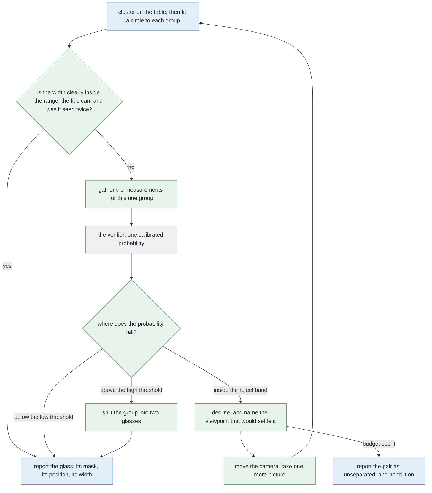

# Solution 5 — a learned verifier over the clusters

*Hybrid, with the model as a verifier. Do not learn the perception. Learn the
one question the rules are worst at — is this one object or two — from numbers
the rules have already worked out.*

> **The cell is described once, in [the cell](../../the-cell.md)** — the layout,
> the two places the camera works from, from the top and from the side, all four
> sensors, and the words this project uses them with. What follows is only what
> is specific to this solution.

## Introduction

This document explains how to add a trained model to a system whose rules
already work, without giving the model any of the work the rules do well. The
problem it addresses is narrow and specific: the geometric method separates
almost every glass on the table correctly, but it has to commit to a single
cut-off, and there is a thin band of cases either side of that cut-off where it
has no choice but to guess. So the model is asked one question, about those
cases only, and its most useful answer turns out to be "I cannot tell". By the
end you will understand why a model given one narrow question costs far less
than a model given the whole task, why it is shown a handful of measurements
rather than the picture, what a probability has to mean before a threshold may
be placed on it, and why declining to answer is more valuable here than
answering.

## The problem this solves

Several glasses stand on a table. They are all of one kind, that kind is known,
and the arm has to say which pixels belong to which glass.

[Solution 2, cluster on the
table](solution-overview.md#solution-2--cluster-on-the-table) already does that
properly, and it is worth recalling how, because this solution changes only one
step of it. Every pixel that has a depth reading becomes a point in the room.
Each point drops onto the table. The dots are grouped by how close together they
are. A circle is fitted to each group, and its width is checked against the
range this kind of glass is allowed to be. The method is exact, it is fast, it
needs no training data, and every step is a number you can print.

It handles almost everything. But the check at the end has to commit to a
threshold, and **reality has no step in it there.**

Each dot in that picture is one group the clustering produced, placed along the
axis by the width of the circle fitted to it. The blue row was really one glass,
and the orange row was really two. The two rows barely overlap, which is exactly
why the simple rule works as well as it does.

But look at the shaded band in the middle. It holds both kinds. A rule that has
to answer "one or two" from that single number has no choice but to guess inside
that band, and no amount of care in choosing the threshold removes the band. It
only slides the band somewhere else. The ringed orange dot near the top of the
allowed range is the worked example further down this page.

That band is where the failure the problem statement says to watch hardest
lives. **Two real glasses reported as one does not look wrong downstream.** It
looks like one large glass, and everything after it believes that.

## The main idea

There are two honest ways to use a model here, and the choice between them is
the main idea of this document.

The first way is to hand the model the whole job: give it the picture and let it
return one mask per glass. That is what [solution
7](solution-overview.md#solution-7--a-segmenter-trained-from-scratch) and
[solution 8](solution-overview.md#solution-8--per-pixel-votes-for-the-centre)
do, and it means the model owns every answer, including the thousands of easy
ones the geometry already gets right for free.

The second way is to leave the geometry alone and add a model with exactly one
job: *look at this one doubtful group and tell me whether it is one object or
two.*

Read the last three rows of that comparison first, because they are the rows
that decide whether a component belongs in a machine that moves.

### Why this pattern exists

The pattern here is **do not learn the whole task, learn the one decision the
rules do badly**, and the reason it exists is that the two families of method
fail in opposite directions.

A programmed rule is exact, cheap, inspectable, and needs no data at all. But it
must commit to a single cut-off, and nothing in the physical world changes at
that cut-off. A group a hair under it and a group a hair over it are the same
kind of object. So the rule is wrong in a band around its own threshold, and
that band is a property of having a threshold rather than of having chosen the
wrong one.

A fitted model has a soft boundary instead of a cut-off, and it can weigh
several weak pieces of evidence at once, which is exactly what the band needs.
It pays for that with three things: it needs examples, it is hard to inspect,
and it goes out of date as the world it was fitted to changes. **Ask it one
narrow question and all three costs shrink at once**, because a narrow question
needs few examples, has few inputs to inspect, and depends on little that can
drift.

This pattern turns up everywhere under several names, and none of them has won,
so it is worth knowing all of them. It is called a **verifier** when a cheap
stage proposes an answer and a second stage checks it, which is the closest fit
here and the name this document uses. It is called a **cascade** when cheap
tests run first and an expensive one runs only on what survives. It is called
**a learned gate** when the model picks which branch of a rule-based system
runs. One name to avoid in writing is *residual learning*, which people use in
conversation to mean "learn what the rules got wrong", but which in the
literature means the skip connections inside a particular network design ([He
and colleagues](https://arxiv.org/abs/1512.03385)) and so will be misunderstood.

## What the verifier is shown

Everything grey in that picture already exists. The only new thing is the dashed
box, and it is consulted only about the minority of groups the circle fit could
not settle.

The most important fact about that box is what goes into it. **It is not shown
the picture.** It is shown a small set of measurements that the geometry has
already worked out, and each of those measurements asks one plain question about
the group.

| The measurement | What it asks |
| --- | --- |
| the fitted width, as a fraction of a typical glass of this kind | is this the right size for one glass? |
| how far the dots sit from the fitted circle on average | is it really round? |
| its single worst such distance | is it round everywhere, or bent in one place? |
| the larger half's width, as the same fraction | would one of two halves pass as a glass? |
| the smaller half's width, as the same fraction | would the other one? |
| how far the dots sit from the best pair of circles | do two circles fit better? |
| the ratio between those two fit errors | how much better? |
| the gap between the two candidate centres, in fitted radii | are the halves far enough apart to be separate things? |
| how much of the circle the dots span | is this a whole footprint, or only an arc of one? |
| the dot count against what the camera predicts at that height | is there enough evidence here to say anything at all? |
| how many stations saw it | did more than one viewpoint agree? |
| how far its centre moved between stations | did it stay put, as a real object does? |
| its height above the table, over its footprint width | is the cloud glass-shaped? |

One of those measurements deserves singling out, because nothing else in the
whole pipeline looks at it and it is the one this problem's ambiguity actually
turns on. It is **how much of the circle the dots span**. At the separations
this problem guarantees, glasses do not become confusing by standing close
together. They become confusing when one stands behind another from a station,
and what comes back then is an arc rather than a whole footprint.

### Why measurements rather than pixels

Choosing measurements over pixels is a deliberate trade, and there are four
reasons for it here.

The first is that every measurement in that table is a length on the table, or a
ratio of two lengths, so **none of them changes when the arm stands somewhere
else**. Projecting onto the table has already removed the viewpoint. A model fed
raw pixels would have to learn the camera before it could learn anything about
glasses, and relearn it the day the camera moved.

The second is about how much data is needed. A dozen or so measurements make a
problem with a dozen or so dimensions, while a crop of the picture makes a
problem with as many dimensions as it has pixels. Roughly speaking, the more
dimensions a model has to learn over, the more examples it needs, and that
difference here is the difference between a training set you can generate in an
afternoon and one you cannot.

The third is that the measurements **print beside the answer**, so a wrong call
can be read and understood in seconds instead of being a black box.

The fourth is specific to working in a simulator. A small model given raw pixels
from a simulator will happily learn the renderer's lighting or its background
instead of learning anything about glasses, and then it fails the moment either
of those changes. Lengths measured on the table give it nothing of that sort to
seize on.

The honest cost of this trade is worth stating plainly. **A feature is a piece
of the answer written down by hand.** If those measurements do not contain the
evidence, then no model can recover it, however good the model is. For this cell
that is a good trade, because the evidence here really is geometric.

## Which groups reach the verifier

The verifier is not asked about every group, and deciding which groups reach it
is a design decision rather than a detail.

A group is sent to the verifier if any one of three things holds. Its fitted
width may land close to either end of the range this kind of glass is allowed.
Its fit error may be larger than a well-seen single glass ever gives. Or only
one station may have seen it at all.

Drawing that band too narrow and the model never sees the cases that actually
matter, so it earns nothing. Drawing it too wide and you are paying a model to
answer questions the arithmetic already answered perfectly well.

Of the three conditions, the one about fit error really earns its place, and the
reason is worth understanding because the worked example turns on it. **A merged
pair can fit a circle whose width is perfectly in range, but it cannot fit that
circle well**, because two humps side by side are not a circle. So the fit error
catches cases the width check cannot.

## Calibration: what a probability has to mean

The verifier returns a probability, and before a threshold may be placed on that
probability, one property has to hold.

When a model reports a high probability, it is making a claim about a whole
collection of cases rather than about this one case. It is claiming that among
all the groups it scores that high, roughly that share really are two objects. A
model whose outputs behave that way is **calibrated**, and a calibrated
probability is the only kind you can usefully put a threshold on.

Models very often are not calibrated. They report near-certainty and are right
only about two thirds of the time, or report something close to a coin-flip and
are right nearly always. The standard reference for how badly modern networks do
this is [Guo and colleagues](https://arxiv.org/abs/1706.04599).

On the left of that picture is a **reliability diagram**, which plots the
probability the model reported along the bottom against how often that turned
out to be right up the side. The dashed diagonal is what an honest number looks
like, with claims and outcomes agreeing everywhere. The orange curve is the
failure to fear: it claims near-certainty and is right only about two thirds of
the time, and that gap is precisely how a merged pair gets confidently acted on.

Fixing this is routine and cheap, and it is worth knowing that it is a separate
step rather than a better model. First fit the model. Then fit a second, tiny
function that maps the model's raw scores onto honest probabilities, using data
the model never trained on. There are two usual choices for that second
function: fitting a smooth S-shaped curve, or fitting any curve that only ever
goes upwards. It costs a held-out set of examples and about a second of
computation, and it does not make a wrong answer right — it makes the model's
*claim* about that answer honest, which is all the loop needs.

## Two thresholds, and the third answer

Now the design decision that gives this solution its value. There are **two
thresholds rather than one**, and the gap between them is the point.

Below the **low** threshold, the model is confident the group is one object, and
the pipeline acts on that. Above the **high** threshold, it is confident the
group is two, and the pipeline acts on that. Between the two, it says **"I
cannot tell"**, and the pipeline goes and takes another picture instead of
guessing.

That third answer has a name in the literature. It is called a **reject
option**, which means a model is allowed to hand the question back rather than
forcing every input into a class. The oldest treatment of it is Chow's *On
optimum recognition error and reject tradeoff*
([DOI](https://doi.org/10.1109/TIT.1970.1054406), IEEE Transactions on
Information Theory, 1970), and the modern literature calls the same idea
selective prediction.

The width of the band between the thresholds is a dial with a cost on each side.
Widen it and more groups get a second look, which means fewer wrong calls and
more arm time. Narrow it and the arm moves less, and more merged pairs get
believed. Because a merged pair is the expensive failure and arm time is merely
slow, **the band should start wide** and be narrowed only when a scored run
shows that the extra looks are not changing any answers.

## What "I cannot tell" asks for

Declining to answer is not a shrug, and this is what makes it cheap rather than
merely honest. It is **a request with an address**.

Here is why. The two-circle fit has already produced two candidate centres. If
those two centres are real, then the viewpoint that separates them is the one
square across the line joining them, because from there the two glasses stand
side by side instead of one behind the other. So the next viewpoint needs no
search and no scoring model at all. **The refusal names it.**

That is what turns a classifier into a loop. A classifier that must answer is a
component. A classifier that may decline is a loop, because declining is a
request for another measurement, and another measurement is something the arm
can go and take.

The loop stops when the verifier becomes confident, or when the budget of extra
looks is spent. If the budget runs out and the group is still doubtful, that is
a **result** rather than a failure: the pair is reported as unseparated and
handed to [problem 3](../../problem-3), whose job is to move glasses apart.

This is the same loop that [solution 3, move the
camera](solution-overview.md#solution-3--move-the-camera) already runs on a
hand-written rule. The verifier does not replace that loop. It gives the loop a
better reason to fire.

## How the concepts fit together

Put in order, the concepts make one path with three exits, and the model appears
at only one point on it.

Green marks what this solution adds, blue marks work the project already does,
and grey marks the learned model.

Two things about that path are worth saying in words.

The first is what the verifier **produces**, which is nothing that ends up in
the answer. The mask, the position and the width all still come from the
geometry. The verifier only decides which of three branches the group takes. So
it cannot invent a glass, move a position, or change a width.

The second is the cost imbalance that makes the loop worth having. The verifier
itself runs on an ordinary processor in about a millisecond. The picture it can
ask for costs seconds of arm motion, because the camera is on the wrist. That is
a difference of thousands of times over, and that one ratio decides the design:
**spend computation freely, and spend arm movements carefully.**

## A worked example

This example is deliberately more extreme than anything this problem can
produce, and the reason for that is worth stating before the example starts.

The two glasses in it stand much nearer to each other than the smallest gap this
problem guarantees, so it is not an input this problem can actually receive. It
is the kind of pair [problem 3](../../problem-3) exists to move apart. It is
used here because it is the clearest possible picture of the failure that
matters, which is **a circle whose width is inside the allowed range, with a fit
error nobody checked**. The same failure reaches this problem by a different
route, through one glass hiding another rather than through the two being close,
and what the verifier is handed looks the same either way.

**The arrangement.** Two glasses of one kind, both of ordinary width for that
kind, standing so close that the gap between their rims is far narrower than the
grouping distance. So the chain crosses that gap, and they come back as one
group rather than two. The camera is almost in line with both, so the near glass
hides nearly all of the far one.

**What the geometry finds.** The single circle fitted to the group comes out
just inside the top of the kind's allowed range. That is the whole problem in
one sentence, because the check that makes solution 2 safe now *passes*. The
two-circle alternative is therefore never even tried. One glass is reported
where there are two, and not a single step of the pipeline has done anything
wrong.

**What the geometry also has, and throws away.** The fit error of that circle is
enormous, many times what a well-seen single glass gives, with one point sitting
further from the fitted circle than a whole glass is wide. A thing that really
is one round object does not fit a circle like that. The evidence was there all
along, and nobody looked at it.

Now split the dots in two and fit each half. The fit error collapses to about
what a real glass gives, so the two-circle fit is better by a wide margin. But
the two halves come out lopsided: one of them is a plausible glass and the other
is far too small to be a glass of this kind. So the two-circle answer fails the
range check as well.

**Both answers are defective, and the rule prefers the one that passes its
check.** That is the trap, and no amount of moving the threshold gets out of it.

**What the measurements say between them.** Here is the row the verifier is
handed, written as what each measurement is pointing at rather than as numbers.

| What the measurement says | Which way it points |
| --- | --- |
| the fitted width is high for this kind, but legal | weakly towards two |
| the fit error is far larger than a glass ever gives | strongly towards two |
| its single worst point is worse still | strongly towards two |
| two circles fit far better than one | strongly towards two |
| but the smaller half is far too small to be a glass | back towards one |
| the two candidate centres are further apart than either fitted radius | towards two |
| the middle of the group, along the line joining the humps, is empty | strongly towards two |
| the dot count is a little short of what the height predicts | weakly towards two |
| only one station ever saw it | towards doubt itself |

Read the column of verdicts rather than any single row. Most of the evidence
points one way, one piece points firmly the other, and nothing is decisive.
**That is exactly the shape of a case where the honest answer is "I do not
know".**

**What comes back.** The verifier has not been built yet, so what follows is
illustrative rather than measured. It would return a probability somewhat above
even, pushed up by the fit error, the empty middle and the thin evidence, but
not far above, because the fitted width is comfortably legal and one of the two
candidate circles is nonsense.

And a probability somewhat above even falls inside the reject band, so the
verifier declines to answer.

**What that buys.** The arm takes one more picture, from square across the line
joining the two candidate centres, at the measuring standoff. Re-clustered and
re-fitted from there, the group becomes two circles of ordinary width for the
kind, their centres the right distance apart, both comfortably inside the range.
**The geometry now answers on its own**, and the model is not consulted at all.

So the model's contribution was not the answer. It was knowing that it did not
have one, and knowing where to look.

## Where it is strong and where it breaks

The strengths of this solution all come from how narrow its job is.

It is one yes-or-no question over a dozen or so inputs, with a readable training
set, so it fits in one head and the simulator regenerates the labels, which
means retraining costs seconds rather than days. It cannot invent a glass, move
a position, or change a width, so the worst case is one extra picture or a pair
handed to problem 3.

And the third strength is the one worth remembering, because it is unusual. **It
degrades to pure geometry.** If the model file is missing, or fails to load, or
does not match what the code expects, then the caller declines on every doubtful
group, which is exactly what solutions 2 and 3 do today, and the masks,
positions and widths come out identical. Most learned components fail to
*nothing*. This one fails to *the previous system*.

That property depends on one piece of discipline, so it is worth naming as a
concept. The model file must carry a record of which measurements it was fitted
on, and the loader must **refuse** a file whose record does not match. Add a
measurement, change the order, or rename one, and the loader has to stop rather
than quietly feed the model the wrong inputs. A silently misread model is much
worse than a missing one: a missing one falls back to the geometry, while a
misread one answers confidently from nonsense.

The weaknesses divide into what the design cannot see and what it cannot
survive.

What it cannot see comes first. It is only as good as its hand-written trigger
band, because a group never routed to it is never verified. It can also be
confidently wrong, since a merged pair the model scores as clearly one object
passes every gate there is, and only the calibration check against the
simulator's own record ever catches that. And it goes stale silently when the
world it was fitted to changes, because the record of measurements catches a
changed *feature set* and not a changed *world*.

What it cannot survive comes second. Drift in the camera, the table height or
the lighting puts every group inside the band at once, which is at least loud
and costs time rather than correctness. It holds a size-shaped prior inside a
file, which sits uncomfortably beside [the rule that governs this
repository](../../../CLAUDE.md). Problem 4 changes the question from "one or
two" into "one or two, of which kinds", which this design does not answer. And
it needs depth readings, which real glassware does not give.

This solution is the right choice when three things hold: the rules already get
most of the way, the failure that is left is one nameable decision, and the
truth is cheap to obtain. All three hold here. The thing to do before building
it is to **measure the failure**, so that you know how large the band actually
is.

## Where the idea comes from

The pattern here, of a cheap exact method first and a small learned model only
on the cases it cannot settle, is old, well named, and used far outside vision.
Four ideas sit behind it.

### Cascades — a cheap test first, an expensive one only where it is needed

Arrange classifiers in order of cost, so that the cheap one handles the easy
majority and passes only the doubtful remainder to the expensive one. The
best-known example is the **Viola–Jones** face detector (CVPR 2001), which made
real-time face detection possible by rejecting almost every part of an image in
a handful of arithmetic operations.

Cascades are used for anything with a large easy majority and a small hard
minority, such as detection over a whole image, spam filtering, fraud screening,
and any pipeline where the accurate method is too slow to run everywhere. They
are rarely right for problems where the cheap stage cannot be made both fast
*and* safe, because a cascade is only as good as its first stage: whatever that
stage wrongly throws away, no later stage ever sees.

For more, see
[Viola–Jones](https://en.wikipedia.org/wiki/Viola%E2%80%93Jones_object_detection_framework).

### Classification with a reject option — a model allowed to decline

Instead of forcing every input into a class, allow a third answer: decline, and
hand the case to something else, whether that is another sensor, another
viewpoint, or a person. The best rule for when to decline is old and simple
(Chow, [*On optimum recognition error and reject
tradeoff*](https://doi.org/10.1109/TIT.1970.1054406), 1970): decline when the
best class probability falls below a threshold set by the relative cost of an
error and a refusal.

It is used wherever being wrong is expensive and a fallback exists, such as
medical triage, document processing with a person in the loop, industrial
inspection, and any robot that can take another measurement. It is rarely right
for systems with no fallback, because if declining simply means failing, then a
reject option turns errors into refusals without helping anybody. It also needs
calibrated probabilities before the threshold means anything at all.

### Trees rather than networks — the right size of model here

Two families suit data that comes in rows and columns. **Random forests**
(Breiman, 2001) average many deep trees, each grown on a different random slice
of the data. **Gradient boosting** (Friedman, 2001) fits many shallow trees in
sequence, each one correcting what the last got wrong. On a handful of
hand-chosen measurements, both beat a neural network on accuracy, on training
time and on explainability, and neither needs a graphics card.

They are used for row-and-column problems, which is the great majority of
applied machine learning outside images, text and audio, and they remain the
default first thing to try and frequently the last. They are rarely right for
raw high-dimensional signals where nobody knows which features matter, such as
pixels, waveforms and language, because there the network wins precisely because
nobody has to name the features.

For more, see [random forest](https://en.wikipedia.org/wiki/Random_forest) and
[gradient boosting](https://en.wikipedia.org/wiki/Gradient_boosting).

### Hand-chosen features against end-to-end learning

The last idea is the trade this whole solution rests on. Handing a model a dozen
or so lengths measured on the table, rather than a crop of the picture with
thousands of pixels in it, buys three things and costs one.

It buys a far smaller training set, because hand-chosen features need hundreds
of examples where raw pixels need tens of thousands. It buys stability, because
the features do not change when something you have already accounted for
changes. And it buys readability, because each feature prints beside the answer.

What it costs is that the model can only ever see what the features contain. So
this choice suits small-data problems, regulated fields where decisions have to
be explainable, and pipelines where a reliable geometric stage already produces
meaningful quantities. It is rarely right where the telling detail is not
something anyone can name in advance — which is most of perception, and which is
why the other learned solutions here take pixels instead.

## Where it sits among the other solutions

The clearest way to place this solution is by what it leaves alone. Solution 2
does all the perception and keeps all of it. Solution 3 provides the loop that
goes and takes another picture. This solution adds neither perception nor
motion. It adds a better reason for the loop to fire, on the narrow band of
cases where the geometry's threshold was guessing.

That makes it the cheapest learned component in this whole set, and the only one
that fails back to the system it was added to rather than failing to nothing.

← [The problem](../problem.md) · [Solution
overview](solution-overview.md#solution-5--a-learned-verifier-over-the-clusters)
· [Problem 3 — moving them apart](../../problem-3) →
