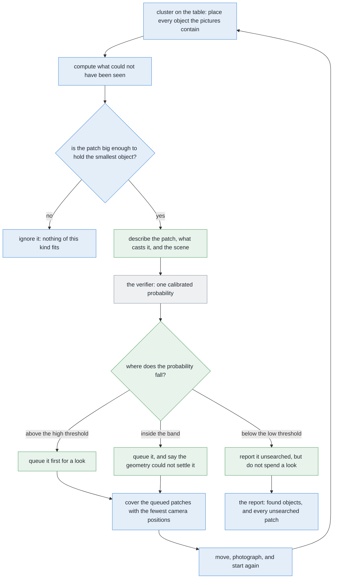

# Solution 5 — a learned verifier over the places nobody could see

*Hybrid, with the model as a verifier. The geometry can say where an object
could be hiding. It cannot say whether one probably is. Learn that one decision,
from numbers the geometry has already worked out.*

> **The cell is described once, in [the cell](../../the-cell.md)** — the layout,
> the two places the camera works from, from the top and from the side, all four
> sensors, and the words this project uses them with. What follows is only what
> is specific to this solution.

## Introduction

This document explains how to add a trained model to the hardest difficulty in
this problem, which is that an object can be absent from a picture altogether.
The programmed solutions get as far as they can go on their own: they work out
where an object *could* have been hiding and report those places as unsearched.
What they cannot do is say which of those places is **likely** to have something
in it, and that matters because looking costs seconds and there is a budget. By
the end you will understand why this particular model cannot be shown pixels
even in principle, what it is shown instead, why one of its inputs comes from
the problem statement rather than from the camera, and why its most useful
answer is again "I cannot tell".

This document replaces an earlier solution 5, which put a verifier over the
clustered groups to decide whether a group was one object or two. That solution
answered a real question and it still would, but it answered the wrong one for
this problem: a verifier over groups is never consulted about an object that
produced no group. The pattern is kept and pointed at the decision that now
matters.

## The problem this solves

Start from what the programmed side produces, because this solution takes its
input from there and adds nothing to the perception.

[Solution 2](02-cluster-on-the-table.md) places every object the pictures
contain, and then does something less obvious: it works out which parts of the
table **could not have been seen**. Because splay is exact arithmetic and the
objects that were found have known positions, widths and heights, the region
each one hides is computable. Any patch of that region large enough to hold the
smallest object of the kind is reported as an **unsearched patch**.

So the run ends up holding a short list of places, each carrying one honest
statement: *an object of this kind could be standing here, and nothing would
have shown it.*

That statement is exactly true and not very useful on its own, and the reason is
worth being precise about. **It is a statement about possibility, and what the
run needs is a statement about likelihood.** Every scene produces some
unsearched patches, because objects always hide something behind them. Looking
at all of them would spend the whole budget on places that are almost certainly
empty.

### What the rules cannot do with it

It is tempting to sort the patches with a rule — largest first, say, or nearest
the middle of the zone. That is worth doing, and it is worth knowing why it is
not enough.

The evidence bearing on "is something hiding in this patch?" is **several weak
pieces at once**, and none of them is decisive. A large patch can hold an object
but large patches are common. A patch cast by a very tall object is more likely
to be hiding something simply because tall objects hide more table. A patch near
the edge of the zone is less likely to hold anything, because objects are placed
inside the zone and the edges see fewer of them. And a patch that two stations
both failed to see is a different proposition from one that only a single
station missed.

Combining several weak pieces of evidence, none of which is decisive, is the
thing a threshold does worst and a fitted model does best. That is the whole
argument for this solution, and it is the same argument the verifier pattern
always rests on.

### And one piece of evidence that is not in the pictures at all

There is one input worth singling out, because it does not come from the camera
and it is the strongest single clue available.

**The problem statement says there are four to six objects on the table.** So if
the survey found four, then as many as two are unaccounted for, and every
unsearched patch is suddenly much more interesting. If it found six, then
nothing is missing, and every patch can be ignored however large it is.

That is a genuinely useful prior and the programmed side makes poor use of it,
because using it well means weighing "how many are unaccounted for" against "how
plausible is each patch" — which is again the combination of weak evidence that
a rule handles badly.

## The main idea

The main idea is the same division of labour the other hybrids use, and it is
chosen so that the learned part cannot do harm.

**The geometry decides what is possible.** It produces the patches, and it alone
decides whether a patch is large enough to matter. A patch too small to hold the
smallest object of the kind never reaches the model at all.

**The model decides only the order.** It returns, for each patch, a probability
that something is standing in it. Nothing downstream is allowed to treat a low
probability as proof that a patch is empty: the patch stays on the report as
unsearched either way. What the probability changes is which patches the arm
spends its looks on first.

That ordering is worth stating as a rule, because it is what makes the solution
safe to add. **The model can waste a look. It cannot cause a missed object to go
unreported.** A patch the model scores low is still reported as unsearched, and
the run is still honest about it.

## Why this verifier cannot be shown pixels

Every other learned solution in this set has to argue for using measurements
rather than raw pixels, and the argument is usually about cost and transfer.
Here the argument is much shorter, and it is worth pausing on because it is
unusual.

**The thing this model is asked about is defined by the absence of pixels.**

An unsearched patch is a piece of table that no camera could see. There is no
picture of it. There is nothing to crop, nothing to feed a network, and no image
at all in which the answer might be hiding. Whatever the model is shown, it
cannot be the patch, because the patch was never photographed. That is not an
inconvenience to be worked around; it is the definition of the thing.

So the input has to be a description of the patch and its surroundings, built
from what *was* seen. This is a useful reminder about learned components in
general: before asking what a model should be shown, it is worth asking what
evidence exists at all.

## What the verifier is shown

The input is a handful of measurements, and they fall into three groups. Each
group answers a different kind of question.

**About the patch itself**, there is how much area it has, how many of the
smallest object's footprints would fit inside it, how elongated it is, and how
far it sits from the middle of the zone. Shape matters as well as size, because
a long thin patch of a given area is less likely to hold a round footprint than
a compact one.

**About what casts it**, there is the height and the width of the object whose
outline hides it, how many objects contribute to it, and whether the patch is
cast by an object or by the edge of the frame. Those matter because they say how
the patch came to exist, and a patch cast by a very tall object covers more
table than one cast by a short one.

**About the scene as a whole**, there is how many objects the survey found
against the number the problem allows, how much of the zone is accounted for by
the objects already placed, how many stations failed to see this patch, and how
many looks the budget has left. That first item is the count prior described
above, and it is the input that ties a patch to the rest of the scene rather
than treating it in isolation.

| What the measurement says | Why it bears on the question |
| --- | --- |
| how many of the smallest footprints fit in the patch | a patch that can only just hold one is a weaker candidate than one that could hold three |
| how elongated the patch is | a sliver of a given area is less likely to hold a round footprint |
| how far the patch is from the middle of the zone | objects are placed inside the zone, so the edges hold fewer |
| how tall the object casting it is | tall objects hide much more table, so their patches are more often occupied |
| how many objects cast the patch together | a patch several objects conspire to hide is a different proposition |
| whether the frame edge contributes | a patch that is partly off the edge of the picture is not the same as one behind an object |
| how many objects were found, against the number allowed | the count prior: found four of up to six, and two may be missing |
| how many stations failed to see it | one station missing a patch is common; two is not |
| how many looks the budget has left | the ordering matters more when only one look remains |

Every one of those is a length, a count or a ratio. None of them changes when
the arm stands somewhere else, because they are all computed on the table rather
than in a picture.

## Calibration, which is what makes the number mean anything

The verifier returns a probability, and before a threshold may be put on it, one
property has to hold — the same property the other learned solutions need, and
for the same reason.

A probability is **calibrated** when its claims come true about as often as it
says they will. If it says a patch is very likely occupied, then patches it
scores that highly should usually turn out to be occupied. If it says a patch is
probably empty, a fair share of those should turn out to hold something.
Anything else and the ordering is an ordering of an arbitrary number.

Models are very often not calibrated, and the standard repair is not a better
model but a separate, tiny step afterwards: fit the model, then fit a small
function that maps its raw scores onto honest probabilities, using data the
model never trained on. It costs a held-out set and a second of computation, and
it does not make a wrong answer right. It makes the model's *claim* about that
answer honest.

Checking calibration is straightforward here, because the simulator knows
exactly what it spawned. Run the pipeline over a few hundred arrangements,
collect every unsearched patch with the probability the model gave it, and
record whether an object really was standing there. Then compare what was
claimed against what happened.

There is one thing to watch that is specific to this solution. **Occupied
patches are rare**, because most hidden table really is empty. So a model that
says "empty" about everything will score very well on accuracy and be completely
useless. The measurement that matters is therefore not how often the model is
right but whether its high scores are actually enriched for occupied patches —
which is what a calibration plot shows and an accuracy figure hides.

## Two thresholds, and the third answer

As with the other verifiers in this set, there are two thresholds rather than
one, and the gap between them is the point.

**Above the high threshold**, the patch is probably occupied. It goes to the
front of the queue for a look, and if the budget allows only one look, this is
the patch that gets it.

**Below the low threshold**, the patch is probably empty. It is still reported
as unsearched — this is the part that must not be skipped — but it is not worth
an arm movement while anything else is waiting.

**Between the two**, the model says **"I cannot tell"**, and here that answer
has a particularly clean meaning. It means the geometry and the count between
them do not settle whether something is hiding, which is precisely the situation
in which another picture is the only way forward.

The width of the band between the thresholds is a dial with a cost on each side.
Widen it and more patches are treated as worth looking at, which costs arm time
and misses fewer objects. Narrow it and the arm moves less and more objects stay
missed. Because a missed object is the worst failure this problem has and arm
time is merely slow, **the band should start wide**, and be narrowed only when a
scored run shows that the extra looks are finding nothing.

## How the concepts fit together

Green marks what this solution adds, blue marks work the programmed solutions
already do, and grey marks the model.

Two things about that flow are worth saying in words.

The first is where the model sits. Everything that can **remove** a patch from
consideration is arithmetic: the size test drops the patches nothing could fit
in, and the covering step decides which camera positions to use. The model only
sorts what is left. So a wrong prediction costs one wasted look, or one look
taken later than it should have been.

The second is that **every patch reaches the report**, whatever the model said
about it. The probability changes the queue and never the record. That is the
property that makes this safe: the worst failure in this problem is a missing
object nobody knows about, and no score the model produces can bring that about.

## A worked example

The survey has finished. It found **four** objects, and the problem allows four
to six, so as many as two may be unaccounted for. That fact alone raises the
stakes on everything below.

The blind-region arithmetic returns three patches large enough to hold the
smallest object of the kind. The budget allows one extra look.

**The first patch** lies behind the tallest object in the scene, on the far side
from the arm. It is compact rather than elongated, it could hold two of the
smallest footprints side by side, it sits well inside the zone, and two of the
three stations failed to see it. Every piece of evidence points the same way.

**The second patch** is larger in area but a long thin sliver, squeezed between
the edge of the frame and the outline of a middling object. Its area would
suggest it is the best candidate; its shape says a round footprint would not fit
comfortably anywhere in it; and one station saw most of it.

**The third patch** is compact and reasonably large, but it lies right at the
edge of the zone, where objects are rarely placed, and only one station missed
it.

A rule that sorted by area would take the second patch, which is the sliver. A
rule that sorted by how many stations missed it would take the first, which
happens to be right, but would have taken the sliver too if the sliver had been
missed twice.

**What the verifier does** with these is combine the pieces. The first patch
scores high: compact, roomy, central, missed twice, and with two objects
unaccounted for. The second scores low despite its area, because the shape and
the single-station miss both count against it. The third lands in the middle,
because central placement is the one thing it lacks.

So the single look goes to the first patch. The arm moves to a camera position
from which that patch is visible — chosen by the covering step, which also
checks whether the same position happens to see either of the others — takes the
picture, and the clustering runs again over everything.

**Both endings are worth following.** If an object is standing in that patch, it
is found, the count reaches five, and the two remaining patches are re-computed
from the new set of objects, which usually shrinks them. If the patch turns out
to be empty, that is not a wasted look: the patch leaves the unsearched list,
the count still stands at four, and the remaining patches become *more*
suspicious rather than less, because there are still two objects unaccounted for
and fewer places left for them to be.

That second ending is the one that shows why the count prior is worth having. A
verifier that looked at each patch in isolation would learn nothing from an
empty result. One that knows how many objects are unaccounted for learns
something from every look, whichever way it goes.

## Where it is strong and where it breaks

The strengths come from the narrowness of the job and from where it sits.

It answers one question over a handful of inputs, so it needs few examples,
trains in seconds, and can be inspected by printing its inputs beside its
answer. Its labels are free, because the simulator knows exactly what it spawned
and therefore knows whether each patch was occupied. It cannot cause the failure
this problem cares most about, because every patch reaches the report whatever
it scores. And it **degrades to the programmed solutions**: with no model at
all, the patches are looked at in whatever order the geometry suggests, which is
exactly what solutions 2 and 3 do together.

The weaknesses divide into what it cannot see, what is hard about training it,
and whether it is worth building at all.

What it cannot see is inherited. It reasons about patches computed from the
objects that were **found**, so an object hidden behind an object that was
itself hidden lies outside its reach entirely. No amount of training fixes that,
because the patch it would need to be asked about was never computed.

What is hard about training it is the rarity problem described under
calibration. Occupied patches are the minority, so the training set is
unbalanced, accuracy is a useless measure, and the model will drift towards
saying "empty" unless the loss and the scoring both account for that.

Whether it is worth building at all is the honest question, and the answer for
this cell is **probably not yet**. Solution 2 measured how often objects are
actually hidden from every station, and the answer was never: the three survey
stations see every object between them. So in this cell the unsearched patches
are nearly always empty, the geometry's own ordering is good enough, and a model
would be sorting a list that rarely matters.

What would change that is any of three things: dropping a survey station,
widening the zone, or letting the objects stand closer together. All three make
hidden objects real rather than theoretical, and at that point the ordering
starts deciding whether objects are found. The thing to do before building this
is therefore to **measure how often a patch is occupied**, exactly as the
earlier solution 5 said to measure the size of its ambiguous band first.

## Where the idea comes from

The pattern here is old and well named, and three ideas sit behind it.

### Verifiers and cascades — a cheap exact test first

Arrange the work in order of cost, so that a cheap exact method handles
everything it can and an expensive or learned one is consulted only on what is
left. When the second stage checks the first, it is usually called a
**verifier**; when it simply runs on the survivors, a **cascade**. The
best-known example is the Viola–Jones face detector, which made real-time
detection possible by rejecting almost every part of an image in a handful of
arithmetic operations.

This is used wherever there is a large easy majority and a small hard minority.
It is rarely right when the cheap stage cannot be made both fast and safe,
because whatever the first stage wrongly discards, no later stage ever sees.
Here the first stage is the patch-size test, and it is safe because it is exact:
a patch too small to hold the smallest object genuinely cannot hold one.

### Classification with a reject option — a model allowed to decline

Instead of forcing every input into a class, allow a third answer: decline, and
hand the case to something else. Here the something else is an arm movement. The
rule for when to decline is old and simple (Chow,
[DOI](https://doi.org/10.1109/TIT.1970.1054406), 1970): decline when the best
probability falls below a threshold set by the relative cost of an error and a
refusal.

It is used wherever being wrong is expensive and a fallback exists, and it is
rarely right where declining simply means failing. Here declining means looking,
which is cheap, so the reject option earns its place easily.

### Priors, and why the count matters

The last idea is the most general and the least often used well. **A prior is
information you had before the measurement**, and combining it correctly with
the measurement is what turns a reading into a belief.

The count in this problem — four to six objects — is a prior of exactly that
kind. It says nothing about any individual patch and everything about how
seriously to take the set of them. Found six and the patches are irrelevant.
Found four and two objects are somewhere.

The general lesson is worth carrying: when a learned component seems to need
more evidence than the sensors provide, it is worth asking what the
**specification** already guarantees. Here the specification supplied the
strongest single input the model has.

## Where it sits among the other solutions

This solution sits on top of two programmed ones and adds nothing to either.
Solution 2 finds the objects and computes the patches. Solution 3 covers the
patches with camera positions and performs the movement. This solution only
decides which patches are worth the covering step's attention first.

Against the other learned solutions, the comparison is about which difficulty
each one attacks. Solutions 7 and 8 replace the perception itself, and neither
of them can help here, because a model that labels pixels has no pixels to
label. Solutions 4 and 6 order candidate viewpoints for a **doubtful object**,
which is a different request from a **suspect place**. This solution is the only
learned component in the set pointed at the difficulty the problem statement
says to watch hardest.

Which makes its honest position slightly awkward and worth stating plainly: it
is aimed at the most important difficulty, and it is also the one whose value
most depends on a measurement nobody has taken yet.
