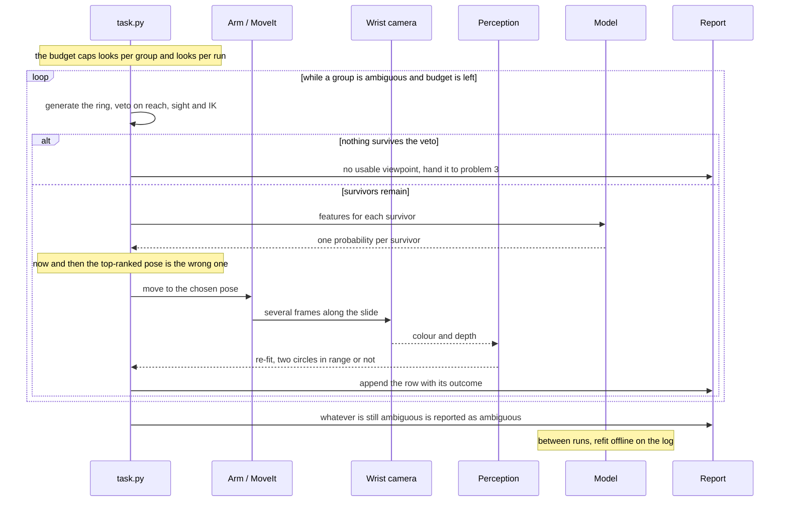
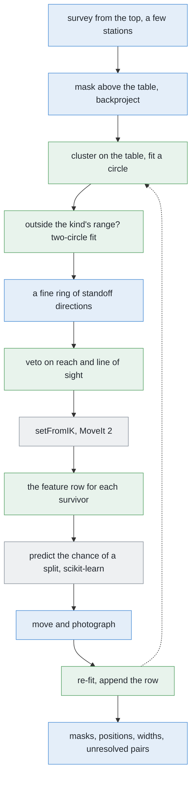

# Solution 6 — learn which viewpoints pay off

*Hybrid, with the model as a ranker. Solution 3 scores a viewpoint with a rule
somebody wrote. Solution 4 scores it by how far the perception step's doubt
should fall. This one predicts, directly, whether taking that picture will
change the answer — and it trains that prediction on an experiment the simulator
can run for every case.*

> **The cell is described once, in [the cell](../../the-cell.md)** — the layout,
> the two places the camera works from, from the top and from the side, all four
> sensors, and the words this project uses them with. What follows is only what
> is specific to this solution.

## In one paragraph

Three solutions here choose where to look next. They differ in what they score.
This one scores the thing actually wanted: the chance that a picture from a
given pose splits an ambiguous group into two glasses. That question has an
exact answer the simulator can look up — spawn an arrangement, render from the
pose, see whether the ambiguity went away. So choosing a viewpoint becomes
ordinary supervised learning, on labels that are free and exact. The geometry
still generates the candidates and still holds the veto. The model only orders
what survives, so a bad prediction costs one wasted look.

## The problem this solves

[`problem.md`](../problem.md) asks for one set of pixels per glass, a position
for each, and an honest list of the pairs that could not be separated.

Two glasses that are far apart on the table can still land on top of each other
in a picture. When they do, the flood fill returns one blob and everything
downstream believes it is one glass. That is the failure the problem watches
hardest, because it does not announce itself.

The fix is to take a different picture. The camera is on the wrist, so a
viewpoint is an arm pose: it costs seconds of motion, while the picture itself
costs milliseconds. So the question is not *can we look again*. It is *where,
given that we can only afford one or two more looks*.

[Solution 3](solution-overview.md#solution-3--move-the-camera) answers it with a
rule. Throw away the poses the arm cannot reach. Throw away the ones looking
through another glass. Of what is left, take the one needing least reach.

That rule is cheap, printable, and right most of the time. Its blind spot is not
an oversight. It is a symmetry.


**How far the camera ends up from the base depends only on the angle between the
standoff direction and the line out from the base.** Swing the same angle to the
other side of that line and the reach is identical.

So **every viewpoint has a mirror image that scores exactly the same.** Least
reach cannot separate two candidates on opposite sides of the line out from the
base, however different what they would see. Both coloured cameras above stand
the same distance back from the same group, both are the same distance from the
base, and neither has anything in the way. To a reach-based score they are
identical.

They are not remotely equally useful. One of them looks **across** the line
joining the hidden pair, so the two glasses land well apart in the picture with
clear table between them, and the fit resolves them. The other looks almost
**along** that line, so the near glass covers most of the far one and the
picture comes back as a single blob — no better than the picture that raised the
doubt in the first place, and one look poorer.

To tell those two apart, a rule would have to know about the line joining the
proposed pair, about which views have already been taken, and about how both
interact with the fitted radii. Somebody could write that rule, and then the
next one, and the one after.

The alternative is to stop writing rules and measure the thing directly: **if I
go there and take the picture, will this group come apart into two glasses?**
That is a yes-or-no question about one pose in one arrangement. It has an exact
answer. And the simulator can look it up, because it renders the view from any
pose it is asked for, and it knows what it spawned.


The three panels are one arrangement and eight candidates, scored three ways.
Green in the rows at the bottom means the pair really does come apart from
there.

- **Solution 3** scores by least reach. Its top two are tied to the millimetre
  and one of them is useless.
- **Solution 4** scores by how far the segmenter's own per-pixel doubt should
  fall. That is a better question than reach, and it is still a stand-in for the
  real one. It has a specific bad case: from the pose that lines the two glasses
  up, the blob looks like one clean, well-bounded glass, so the model is
  *confident*, and a large predicted drop in doubt is exactly the wrong answer.
- **Solution 6** scores the chance the picture splits the group, and is the only
  one of the three that puts both useless looks at the end.

The useful lesson is not "learning beats rules". It is that **the shape of a
learning problem is worth working out before reaching for the heaviest tool that
fits it.** This one turns out to be a table of numbers and a column of zeros and
ones.

## How it works, end to end

### The setup

The table top's height is a constant and the arm is bolted to its near edge,
reaching out across the table. The glasses stand in the glass zone, a rectangle
of table a little wider than it is deep: four to six of them, one known kind,
upright, solid, never closer than the smallest legal gap. The camera is fixed to
the wrist, so choosing a viewpoint means choosing an arm pose, and the arm only
works comfortably inside a band of distances from its own base.

Known before the run starts: the table plane, the lens, the kind of glass and
the range of footprint widths it allows, and one thing solutions 1 to 3 do not
carry — **a weights file, fitted beforehand, that scores a candidate
viewpoint**. Not known: how many glasses there are, where they stand, or their
proportions. No glass's size is written down anywhere in this project.


The weights come from a sweep that needs neither a person nor an arm. Five
steps, run in Gazebo, appending one row each pass:

1. **Spawn.** Four to six glasses of one kind in the zone at random, no closer
   than the smallest legal gap, with proportions drawn from the kind's plausible
   range.
2. **Fit.** Run the normal survey and the normal clustering. A group whose
   fitted circle falls outside the kind's range is ambiguous — in the picture
   above, one group fits a circle far too wide for any single glass of its kind.
3. **Pick a candidate.** Generate the standoff directions round that group and
   drop the ones the geometry rejects.
4. **Render.** Gazebo draws the view from that pose. The arm does not move and
   nothing is planned. This is a camera placed in a scene, nothing more.
5. **Write the row.** The candidate's features from step 3, and the outcome of
   re-running the fit on step 4's picture.

The outcome in step 5 is *read*, not judged. The simulator holds the true poses
of everything it spawned, so "did the group come apart into the right two
glasses" is a lookup.

About ten candidates survive per group, and an arrangement usually yields one or
two ambiguous groups. So two thousand arrangements give of the order of twenty
thousand rows.

Hold out a fifth of the **arrangements**, not a fifth of the rows. Two
candidates from the same arrangement are not independent, so splitting by row
lets the model look up the answer instead of predicting it.

One choice in step 5 decides more than it looks. The label is *did this picture
change the answer* — 1 if the failed group came back as two circles inside the
kind's range, 0 otherwise. It is **not** *was the final answer correct*. The
second needs ground truth the arm will never have. The first needs only the two
fits, before and after, so it is also observable during a normal run. That is
what makes [the feedback loop](#the-feedback-loop) below possible.

### The pictures

Two kinds of picture, taken at different times for different reasons.

**The survey**, which happens first and assumes nothing. It is taken **from the
top**: a few stations, the camera high above the table looking straight down,
and two pictures a short slide apart at each station, so that the shift between
them gives the height of each glass. Neighbouring stations overlap enough that a
glass cut off at the edge of one picture sits well inside another.

**The extra look**, which is the picture this solution chooses. It is taken
**from the side**: the camera comes down low and stands back from the doubtful
group at the measuring standoff. That is the same standoff problem 1 measures
from, and it is comfortably clear of the distance below which a glass would fill
the frame before all of it was in the frame.

It is a sideways move, and the sideways part is the whole point. What the first
picture threw away was which pixels were near the camera and which were far. A
camera standing well to one side simply *has* that fact, with no cleverness
required.

The candidates lie on a ring round the group at that standoff, and the ring is
deliberately **fine** rather than coarse. Problem 1's `_standoffs()` offers a
coarse one, and that coarseness turns out to be expensive: over hundreds of
drawn arrangements, a coarse ring leaves getting on for half of all glasses with
no usable viewpoint, while a fine one leaves only a small fraction. Most of what
this cell calls "no viewpoint" is the ring running out of spokes, not the
geometry running out of room. And generating more candidates costs arithmetic
and nothing else, because the vetoes below throw them away before the planner is
ever asked.

At the chosen pose the arm takes several pictures along the slide rather than
only two, because the move is what costs and a picture is milliseconds.

### What each picture captures

Every frame is small, colour and depth together, through one lens. Four things
come back and are kept together:

- **Colour.** Not used by this solution. It is kept for the report and for the
  solutions that do read it.
- **Depth.** One distance per pixel. How much of the world one pixel covers
  depends only on how far away that world is, so a pixel covers more table from
  the top, high up, than it covers of a glass from the side, standing close.
- **The mask.** Which pixels stand above the table plane, from
  `detect.standing_on_the_table`.
- **The pose the arm recorded** when the shutter opened. Without it a depth
  reading is a distance and nothing more. With it, every masked pixel becomes a
  point in table millimetres.

### What is interpreted, and how

The chain from those pixels to the answer, in order. Steps 1 to 5 are [solution
2](02-cluster-on-the-table.md) unchanged. Everything after them is this
solution.

1. **Mask.** Keep the pixels standing above the table plane.
2. **Backproject.** Turn each masked pixel into a point in table millimetres,
   from its depth, the lens and the recorded pose.
3. **Cluster.** Group those points by distance *on the table*, not in the
   picture. Grouping in the picture is what merges two glasses in line with the
   camera.
4. **Fit a circle** to each group's footprint: centre, diameter, residual.
5. **Judge.** A diameter inside the kind's range is a glass. Outside it the
   group is **ambiguous**, and a two-circle fit proposes the pair it might be.


6. **Generate.** A fine ring of standoff directions round the ambiguous group,
   each at the measuring standoff, low down and level.
7. **Veto on reach.** The camera point must land inside the band of distances
   the arm works comfortably in.
8. **Veto on line of sight.** Reject any ray passing through another group's
   fitted footprint circle.
9. **Veto on plannability.** Inverse kinematics on what is left — [MoveIt
   2](https://moveit.ai/)'s `setFromIK`, milliseconds each — drops the poses the
   arm cannot hold.
10. **Score.** The model reads a couple of dozen numbers per survivor and
    returns a probability. It cannot add a pose and it cannot remove one.

That ordering is the safety argument, and it is a rule rather than a detail of
the implementation: **everything that can reject a pose is arithmetic, and the
model comes after all of it.** The worst a wrong prediction can do is put one
reachable, unblocked, plannable pose ahead of another. The cost is one look. The
model is never asked about safety, so it cannot cause an unsafe move.


Every feature is a millimetre, a degree or a count — never a pixel value. There
is a hard reason for that: at the moment the score is wanted, **the picture does
not exist**. The arm is deciding whether to spend three seconds going somewhere,
so the only input available is a prediction computed from what it currently
believes.

Hand-made numbers have three more advantages here. They transfer, because a
millimetre means the same thing under a different light, with a different glass
colour and a different camera gain. They fit from thousands of rows, where raw
pixels would need orders of magnitude more — and every one of those rows costs a
render. And when the model chooses wrongly you can print the couple of dozen
numbers and see at a glance which one was unusual.

Five groups of them:

- **The proposed pair.** The one-circle diameter. The two diameters the
  two-circle fit proposes. Their separation in fitted radii rather than
  millimetres, so the number means the same for a large glass and a small one.
  And how much worse the one circle fits than the two, which is how strongly the
  geometry believes there are two things there at all.
- **The candidate against that pair.** The angle between the line of sight and
  the line joining the two proposed centres — square across separates them as
  much as possible, straight along separates them not at all — together with its
  sine, and the separation and overlap the pair would show *in pixels*. Those
  last two are the same geometry expressed in the units the camera actually
  works in, which is what decides whether the two outlines touch.
- **The candidate against everything else.** How close the ray passes to each of
  the three nearest other groups, measured in that group's own radii, and how
  many groups fall inside the camera's view. A neighbour can sit close to the
  line of sight and block nothing, because it is on the far side of the target,
  so the sign matters and is part of the feature.
- **The arm.** How the reach sits against the two ends of the comfortable band,
  the standoff, and the height above the table. The veto has already computed
  all of these, so they cost nothing to include.
- **What has already been looked at.** The angle from the nearest view already
  taken, how many views this group has had, and how many looks the budget has
  left. This is the group a hand-written rule always forgets, and it is what
  decides the worked example below: **a picture taken from almost where you
  already stood is almost the same picture**, and it teaches you almost nothing
  new.

A yes-or-no target over a short table of numbers of different kinds — angles,
millimetres, ratios, counts — is exactly the case **gradient-boosted decision
trees** were made for (Friedman, *Greedy Function Approximation: A Gradient
Boosting Machine*, Annals of Statistics, 2001).

A tree asks threshold questions — "is the line of sight more than halfway
towards square with the join line?" — and lands in a leaf holding a prediction.
Boosting fits a weak tree, fits the next one to whatever the first got wrong,
and adds them up.
[`HistGradientBoostingClassifier`](https://scikit-learn.org/stable/modules/generated/sklearn.ensemble.HistGradientBoostingClassifier.html)
trains a table of this size in seconds on this machine, on the CPU alone.
[LightGBM](https://github.com/microsoft/LightGBM) and
[XGBoost](https://github.com/dmlc/xgboost) are the same family with more
settings to adjust, and are not needed at this size.

A small network in [PyTorch](https://pytorch.org/) is worth having only if the
target becomes a number rather than a yes or no — how far the one-circle
residual dropped, say — where it fits a smooth curve more naturally than a
staircase of thresholds does. An ordering needs only the ranking, so yes-or-no
is enough to start with.

### What comes out

Per glass, exactly what [`problem.md`](../problem.md) asks for: a **mask**
saying which pixels in which picture are that glass, a **position** in
millimetres from the arm's base, and a **rough footprint width** in millimetres.
Beside it, the list of pairs that could not be separated and why — no candidate
survived the veto, or the budget ran out.

The report receives all of it. The unseparated pairs are the handover to
[problem 3](../../problem-3/problem.md), which is allowed to move the glasses.

One more thing leaves the run: for every look taken, a row of twenty features
and its outcome, appended to a log.

## The sequence

The normal path: survey, one group that fails the circle fit, one extra look,
resolved.

```mermaid
sequenceDiagram
    participant T as task.py
    participant A as Arm / MoveIt
    participant C as Wrist camera
    participant P as Perception
    participant M as Model
    participant R as Report
    T->>A: survey from the top, a few stations
    A->>C: two frames a short slide apart at each station
    C-->>P: colour and depth, plus the lens settings
    P->>P: mask, backproject, cluster, fit circles
    P-->>T: most groups fit fine; one is far too wide for this kind
    Note over T: too wide to be one glass, so the group is ambiguous
    T->>P: two-circle fit on the doubtful group
    P-->>T: two plausible circles, centres close together
    T->>T: a fine ring of directions at the standoff
    T->>T: the reach veto removes about half
    T->>T: the line-of-sight veto removes a few more
    T->>A: setFromIK on what is left
    A-->>T: the poses the arm can actually hold
    T->>M: the feature row for each survivor
    M-->>T: best is the one square across the join line
    T->>A: move there, seconds
    A->>C: several frames along the slide
    C-->>P: colour and depth
    P-->>T: two circles, both in range, well apart
    T->>R: masks, positions, footprint widths
    T->>R: append one row, outcome 1
```

The interesting path: the loop that runs when a look does not pay off, what
stops it, and the second loop that only closes between runs.



The floor is not drawn and matters as much as the cap: every group that fails
the circle fit gets one look whatever the model predicts.

## In pseudocode



Legend, because colour alone is not accessible: **green** is new code written
for this solution, **blue** is code the project already has, **grey** is a
third-party library. The dotted arrow is the loop back for a second look.

```text
stations = survey_stations(GLASS_ZONE, footprint)       # have · work_cell.arm.dimensions
for station in stations:                                # have · work_cell.task
    depth, pose = arm.look_down_from(station)           # have · work_cell.task
    mask = detect.standing_on_the_table(depth, pose)    # have · work_cell.glasses.detect
    points += backproject(depth, mask, pose, K)         # have · work_cell.glasses.perception
clusters = cluster_by_distance(points[:, :2], GROUP_GAP)  # NEW · numpy
for c in clusters:                                      # NEW  · ~25 lines, numpy only
    centre, diameter, rms = fit_circle(c)               # NEW  · numpy.linalg.lstsq
    if kind.accepts(diameter):                          # have · work_cell.glasses.spec
        continue                                        #
    pair = fit_two_circles(c)                           # NEW  · numpy.linalg.lstsq
    ring = standoffs(centre, STANDOFF, step=FINE)       # have · work_cell.task
    poses = [p for p in ring if in_reach(p)]            # have · work_cell.arm.dimensions
    poses = [p for p in poses if clear(p, clusters)]    # have · work_cell.task
    poses = [p for p in poses if arm.set_from_ik(p)]    # have · moveit
    if not poses:                                       #
        report.no_viewpoint(c)                          # have · work_cell.report
        continue                                        #
    rows = [features(p, pair, clusters, seen, budget)   # NEW  · ~80 lines, numpy only
            for p in poses]                             #
    best = argmax(model.predict_proba(rows))            # NEW  · scikit-learn
    depth, pose = arm.look_level_from(poses[best])      # have · work_cell.task
    after = fit_two_circles(recluster(depth, pose))     # NEW  · numpy
    log.append(rows[best], kind.accepts_both(after))    # NEW  · csv, stdlib
report.glasses(clusters)                                # have · work_cell.report
report.doubtful(still_ambiguous)                        # have · work_cell.report
```

What it needs from outside the project, and whether the environment already has
it:

| Library | What it does here | Licence | In the pixi environment? |
|---|---|---|---|
| [NumPy](https://numpy.org/) | backprojection, clustering, both circle fits, the feature rows | BSD-3-Clause ([licence](https://github.com/numpy/numpy/blob/main/LICENSE.txt)) | **yes** |
| [MoveIt 2](https://moveit.ai/) | `setFromIK` for the plannability veto, then the move | BSD-3-Clause | **yes** — the cell already runs on it |
| [Gazebo](https://gazebosim.org/) | renders the offline sweep that makes the rows | Apache-2.0 | **yes** — already running |
| [scikit-learn](https://scikit-learn.org/) | `HistGradientBoostingClassifier`: fits the ranker, and checks its [calibration](https://scikit-learn.org/stable/modules/calibration.html) | BSD-3-Clause ([licence](https://github.com/scikit-learn/scikit-learn/blob/main/COPYING)) | **no** — the one dependency this solution adds |
| [PyTorch](https://pytorch.org/) | only if the target becomes a number rather than a yes or no, later | BSD-3-style ([licence](https://github.com/pytorch/pytorch/blob/main/LICENSE)) | **no**, and not needed |

OpenCV and Matplotlib are installed and this solution uses neither. SciPy is not
installed and is not needed either.

## A worked example

The survey finishes. Most of the groups fit circles comfortably inside the range
this kind of glass is allowed. One does not: its circle comes out about twice as
wide as any single glass of this kind can be, so the group is **ambiguous**. It
stands about halfway out across the arm's comfortable reach. The budget allows a
few extra looks for the whole run.

**What the fit proposes.** Two circles, both plausible widths for the kind, with
their centres much closer together than any two real glasses could ever be.

That separation is not believable — the spawner never puts two glasses closer
than the smallest legal gap — and *why* it is wrong is instructive. From the
survey's line of sight the far glass is mostly hidden behind the near one, so
the points that did come back sit almost on top of each other. The **direction**
of the line joining the pair is reliable. Its **length** is an under-estimate,
and always in the same direction. That is one more reason to hand the model the
separation measured in fitted radii, and let it learn for itself how much to
trust it.

**Reach.** Think of the camera as sitting on a ring drawn round the group, and
the arm as working only inside a band of distances from its own base. Swinging
the candidate direction round the ring moves the camera nearer to the base or
further from it, smoothly. So the reach veto keeps a continuous **arc** of the
ring and throws away the two ends: the directions pointing back towards the
base, which would fold the arm up, and the directions pointing away from it,
which would stretch the arm straight. On a fine ring that arc still holds a good
number of candidates — but it removes about half of them, and it costs one
square root each.

**Line of sight.** One neighbour stands fairly close to the group. Seen from the
group, that neighbour covers a wedge of directions, and any candidate inside the
wedge is dropped. It is worth confirming that this is a real objection rather
than a cautious one: from inside that wedge the neighbour's outline would cover
a good fraction of the width of the picture, sitting directly over the target. A
few more candidates go.

**Plannability.** `setFromIK` finds no joint angles at all for one of the
survivors, so that one goes too. A handful are left to be scored.

**The scores.** The best is the direction **square across the line joining the
proposed pair**. It is clear of every footprint, it is well round from the
direction the survey already looked from, and it sits comfortably within the
reach band.

Two of the others are worth naming, because a hand-written rule gets both of
them wrong.

- **The one with the least reach of any survivor** scores near the bottom.
  Because it asks least of the arm and has a clear line of sight, solution 3's
  rule ranks it *joint first*. But it lies almost along the join line, so from
  there the two glasses stay squarely on top of each other and the picture
  repeats the problem.
- **The one pointing back the way the survey already looked** also scores near
  the bottom, even though it is perfectly reachable and perfectly unblocked.
  Whatever it returns, the run has already seen it. Nothing in solution 3's rule
  knows that, because solution 3's rule has no memory of where the camera has
  already been.

**The look.** Plan, move, settle: a few seconds, and that is the whole cost.
Then several pictures along the slide.

From the chosen pose, the two glasses land well apart in the picture — far
enough apart that there is clear table between their two outlines, rather than
one outline running into the other. So the clustering separates them with room
to spare, and the fit returns two circles, both comfortably inside the kind's
range, their centres the full distance apart that two real glasses stand. The
group is resolved, and one look of the budget has been spent.

For contrast, work the same thing through from the low-reach candidate the rule
preferred. From there the pair projects barely apart at all, against two
outlines each wider than that gap — so the outlines overlap, and what comes back
is a single blob, still too wide to be one glass of this kind. The group stays
ambiguous and the run is one look poorer with nothing to show for it.

Finally, a row is appended to the log: the feature row of the pose that was
taken, and the outcome — in this case, that the group did come apart.

## Where it comes from

Three separate lines of work meet here.

**Active perception.** The observation that a camera which can move is not the
same instrument as one that cannot. Ruzena Bajcsy's *Active Perception*
(Proceedings of the IEEE, 1988) named it, and Connolly's *The Determination of
Next Best Views* (ICRA, 1985) is the loop that follows: given what you have seen
and where you could go, where next? Scott, Roth and Rivest's survey *View
planning for automated three-dimensional object reconstruction and inspection*
(ACM Computing Surveys, 2003) collects the classical answers, nearly all of
which score a viewpoint by how much unknown space it would resolve. Solution 3
is a small, hand-cut version of that tradition.

**Predicting whether an action will work, from data.** Grasping took the same
step about ten years ago, for the same reason. Nobody could write down a rule
saying whether a gripper pose would hold an object, so people collected attempts
and fitted a function from the pose to whether it worked. Pinto and Gupta's
[*Supersizing Self-supervision*](https://arxiv.org/abs/1509.06825) (ICRA 2016)
had a robot try tens of thousands of grasps and label them by whether the object
came up. Levine et al.'s [*Learning Hand-Eye Coordination for Robotic
Grasping*](https://arxiv.org/abs/1603.02199) (2016) is the larger version.

Neither is reinforcement learning. There is no episode and no reward — just an
input, an attempt, and a recorded outcome. The label is free because the world
produces it.

**Next best view as supervised learning.** Vasquez-Gomez et al.'s [*Supervised
learning of the next-best-view for 3D object
reconstruction*](https://arxiv.org/abs/1905.05833) trains a network to pick the
best of a fixed set of poses, with labels generated by simulating each pose and
measuring what it gained. The same move, made for a different payoff.


The comparison worth having in mind is against the heavier alternative: a policy
trained by reinforcement learning, written up as
[an active-vision policy](learned-with-hardware.md#an-active-vision-policy) in
the companion document.

Read the "working out which look helped" row first, because it decides
everything else. A reinforcement-learning agent takes several looks and gets one
number saying how the whole episode went. Working out *which* look earned that
number is the central difficulty of the method, and it is why episodes have to
be played out in their thousands.

Here the label for one look does not depend on what the arm does next, so there
is nothing to work out. Remove that problem and the episode goes with it, and
with the episode go the reward function, the exploration schedule, the discount
factor and most of the machine time.

A policy does buy one thing this does not: it can also learn *when to stop*.
Here that stays a written rule — stop when nothing is ambiguous, or the budget
is spent.

## The feedback loop

The loop inside a run is the ordinary one: look, see what happened, look again
if you must. The second loop is the reason to build this at all.


**Inside a run.** Fit. Find the groups whose circle falls outside the kind's
range. Generate the ring of candidates and veto them. Score the survivors and
take the highest. Move and photograph. Re-fit. Append one row holding the
features that were scored and the outcome that was observed.

It stops when nothing is ambiguous, when the budget is spent, or when a group
has no surviving candidate. Whatever is still ambiguous is reported as
ambiguous, which is what `problem.md` asks for.

Two rules keep it from running away, and neither of them is the model.

- **A floor that ignores the score.** Any group failing the circle fit gets one
  look whatever the prediction says. Otherwise a model that predicts no payoff
  anywhere silently reports a merged pair as one large glass.
- **A cap.** Two extra looks per group and four per run. Three survey stations
  are the run's cost today and the whole run should take tens of seconds, so
  four extra looks roughly doubles it. Six does not fit.

**Between runs.** The run-time label needs no ground truth — it is *did the
answer change*, which is two circle fits and a comparison. So it is available on
a real table, with no simulator and nobody watching. Every look the arm takes is
another labelled row.

The right-hand panel above is the shape of that claim, and it is drawn rather
than measured: nothing here has been run. Its point is the flat line. A
hand-written rule performs exactly as well on its thousandth run as on its
first. A fitted one does not have to.

Three guards on the retraining, all dull and all necessary.

- **Retrain offline, between runs, never mid-run.** A model that changes during
  a run makes the run impossible to reproduce, and a run you cannot reproduce is
  a run you cannot debug.
- **Check calibration, do not assume it.** Of the looks the model was most
  confident about, did about that share actually resolve the group?
  scikit-learn's [calibration
  guide](https://scikit-learn.org/stable/modules/calibration.html) has the
  method and the plot. If the answer is no, this is a rule of thumb wearing a
  weights file, and that should be said out loud.
- **Log something other than the model's favourite.** A log holding outcomes
  only for poses the model already liked teaches it nothing about the rest, and
  retraining on it locks in an early mistake. Take the second-ranked candidate
  about one look in twenty. That is the cheapest possible version of what the
  active-learning literature calls exploration; Settles' [*Active Learning
  Literature Survey*](https://burrsettles.com/pub/settles.activelearning.pdf)
  (University of Wisconsin–Madison, 2009) tours the better versions, none of
  which is needed at this scale.

## What it needs

**Data.** Produced by Gazebo, which is already running. Of the order of two
thousand arrangements, each sweeping its ambiguous groups against the surviving
poses: tens of thousands of rows. Nothing from outside the simulator, no
photographs, no downloaded weights.

**Hardware.** A CPU. The trees train in seconds and predict in microseconds.
Nothing here wants CUDA, which is the condition that removed several otherwise
good answers from this document.

**Time.** The sweep is the real work, and Gazebo dominates its cost, not the
fitting. The overview's estimate is a few hours unattended. That number should
be *timed on the first hundred arrangements and extrapolated*, not believed. The
harness that drives the sweep — spawn, survey, list, render, re-fit, append — is
a few hundred lines, and it is the part that will take a day to get right.

**Artefacts to keep in step.** A weights file of a few hundred kilobytes, and
beside it a hash of the feature list, so that a changed or reordered feature
makes the loader refuse rather than quietly misread column seven. And a log file
that grows.

## Where it is strong and where it breaks


**Strong**

- It scores the outcome, not a stand-in like unknown volume or least reach.
- It gets most of a learned policy's benefit with no episodes, no reward, no
  machine days and no graphics card.
- Delete the weights and the veto still returns reachable, unblocked, plannable
  poses. Ordered by reach, that is solution 3, which this extends.
- It improves with use for the price of a log file, and a wrong choice prints as
  twenty numbers.

**Breaks**

- It is an ordering, not a capability. Score solution 3's rule first: if its top
  pick usually resolves the group, this earns nothing.
- No two-circle fit means no features, and an empty candidate list leaves
  nothing to order — the handover to [problem 3](../../problem-3/problem.md).
- It can predict a payoff that never arrives, or none anywhere. The cap and the
  floor bound both.
- A tree asked about something outside its training range answers with its usual
  confidence. Train across the whole four-to-six range, and fall back outside
  it.
- It cannot rank a pose nobody generated. The ring is one standoff and one
  height, so any better view from some other distance or some other height is
  invisible to it.
- The log holds only poses the model liked, so retraining without the
  one-in-twenty rule locks in mistakes. Change the standoff list or the spawner
  and the weights quietly describe a cell that no longer exists: the hash
  catches a changed feature, not a changed world.
- The labels are only as honest as Gazebo, and real glassware returns no depth.
  It earns most at [problem 4](../../problem-4/problem.md), where the kind is
  unknown.

## The general methods behind this

This solution predicts the *value of an action* rather than a property of the
world, which puts it in a different family from everything before it — and one
where the simulator, not a human, supplies the labels.

### Learning a utility, rather than learning to perceive

The model here does not say what is on the table. It says how much a given
action would help. That is **utility** or **value** estimation, and the trick
that makes it workable is that the answer is cheap to check: take the action in
simulation and see. A viewpoint either resolved the ambiguity or it did not. So
a hard question about the future becomes ordinary supervised learning on an
exactly labelled past.

- **Mostly used for** choosing among actions when the outcome can be simulated
  or replayed: view planning, grasp ranking, move ordering in games, and any
  situation with a cheap way to ask "did that work?"
- **Rarely right for** actions whose outcome cannot be judged without doing them
  for real. Then there is no free label set, and the problem becomes
  reinforcement learning, with all of its cost in attempts.
- **More:** contrast with the grasping work, which learned the same shape of
  function from real attempts rather than simulated ones — Pinto and Gupta,
  [Supersizing Self-supervision](https://arxiv.org/abs/1509.06825), and Levine
  et al., [Learning Hand-Eye Coordination for Robotic
  Grasping](https://arxiv.org/abs/1603.02199).

### Learning to rank — order matters, absolute scores do not

Nothing downstream uses the predicted number. Only the order of the candidates
matters. That is **learning to rank**, and it is easier than predicting the
number itself: a model that is wrong by the same amount everywhere still ranks
perfectly, and it only ever needs to be right about the top of the list.

- **Mostly used for** search, recommendation and ad placement — and, in exactly
  the same shape, for ordering candidate grasps, viewpoints or motions in
  robotics.
- **Rarely right for** cases where the *size* of the number is used, not just
  the order: deciding whether to act at all, say, or comparing against a fixed
  budget. Ranking tells you which is best. It never tells you whether the best
  is any good.

### Supervised learning on simulator-generated labels

The simulator knows exactly what it spawned, so every training row comes
labelled for nothing. That removes the expensive part of supervised learning and
replaces it with a different problem: the labels are perfect, but the world is
not real.

- **Mostly used for** robotics and self-driving, where real labelled data is
  slow and dangerous to collect, and where the quantity that matters — a pose, a
  contact, an outcome — is exactly what a simulator holds and a human labeller
  cannot see.
- **Rarely right without** a plan for the gap between simulation and reality. A
  model trained only on synthetic scenes has fitted one renderer's shading and
  one spawner's habits, and it will be confidently wrong on anything outside
  both.
- **More:** [domain adaptation](https://en.wikipedia.org/wiki/Domain_adaptation)
  for the family of fixes; domain randomisation, covered in [solution
  7](07-a-segmenter-trained-from-scratch.md), for the one that suits simulators.

### Active learning — the same idea pointed at a labelling budget

Choosing the most informative next viewpoint is the robot's version of choosing
the most informative next example to label. The mathematics is shared, and so is
the central warning: a rule that always picks the most uncertain case tends to
pick the *unlabelable* ones — the corrupted, the ambiguous, the genuinely
undecidable. Which is why a floor and a cap matter more than the score.

- **Mostly used for** expensive labels: medical annotation, expert review,
  scientific experiments.
- **Rarely right for** cheap measurements, where taking several and skipping the
  reasoning is faster than deciding which one to take.
- **More:** Settles, [Active Learning Literature
  Survey](https://burrsettles.com/pub/settles.activelearning.pdf); [active
  learning](https://en.wikipedia.org/wiki/Active_learning_%28machine_learning%29).

### Generate, veto, then rank

The structural pattern, and the reason a wrong prediction here costs one wasted
look rather than a wrong answer. Geometry generates the candidates and holds an
absolute veto, and the model is only allowed to reorder what survives. Position
in the pipeline is what limits the damage — see [where the learned part
sits](solution-overview.md#three-families-and-what-hybrid-means).
