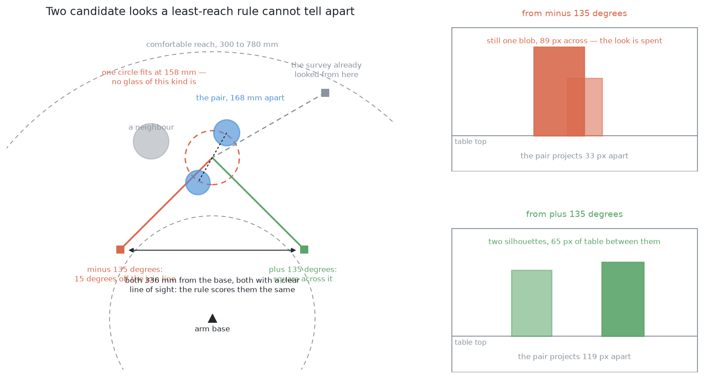
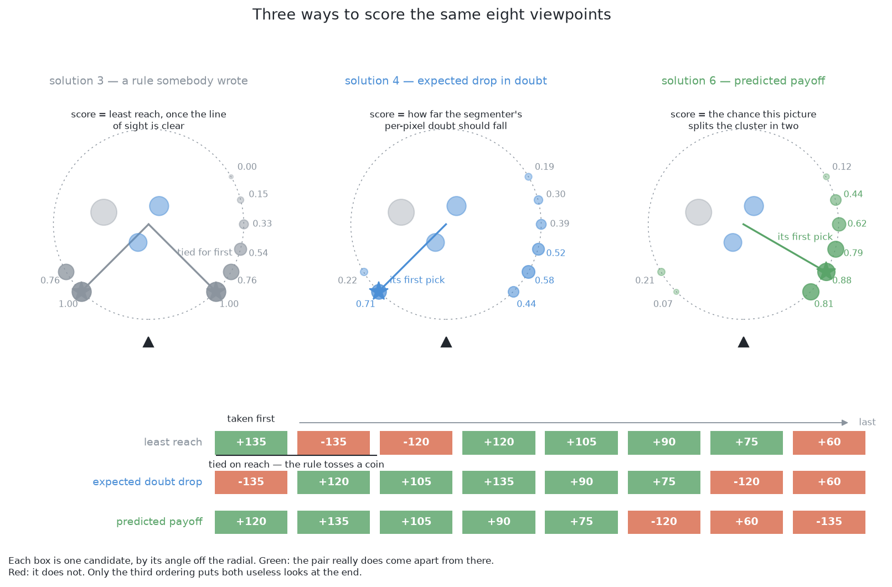
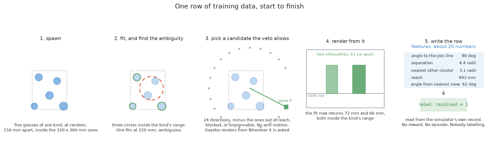
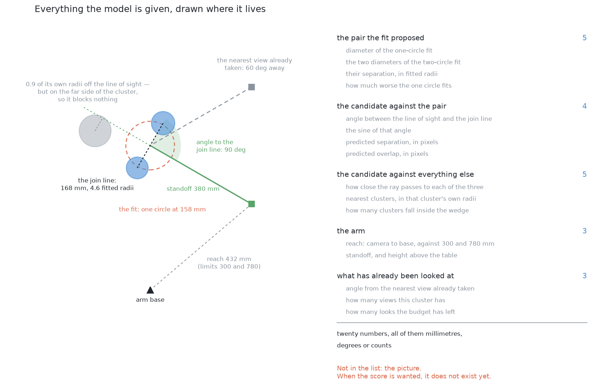
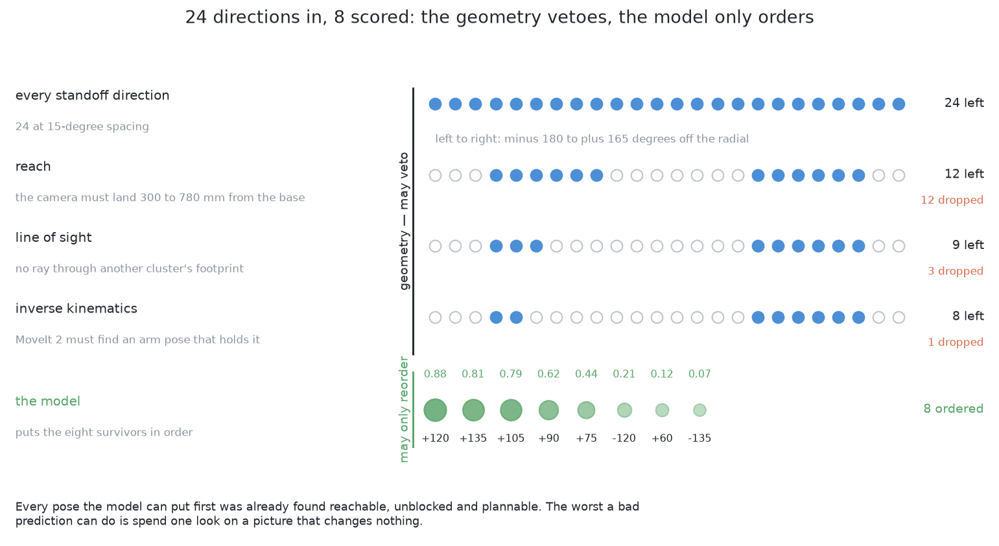
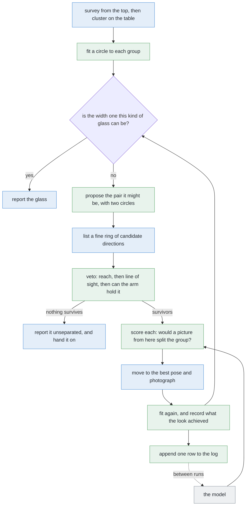
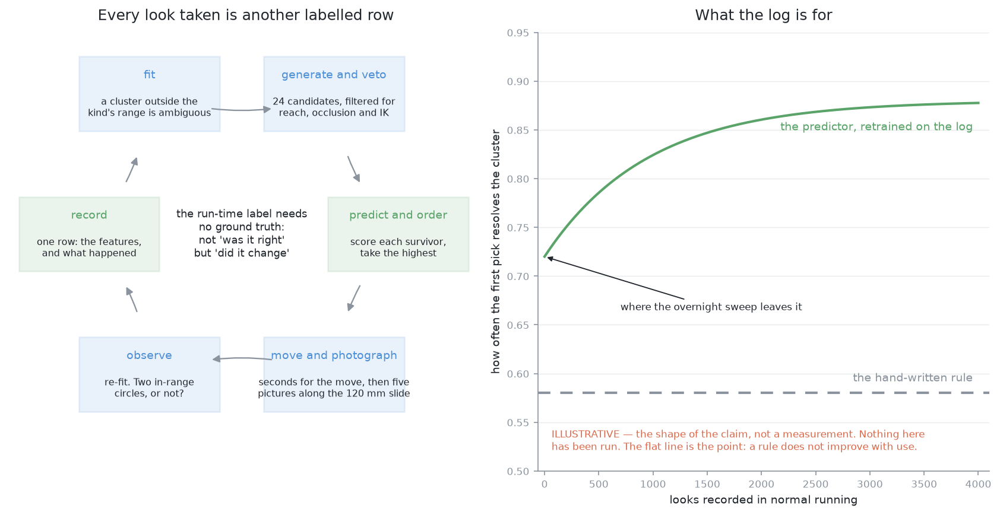
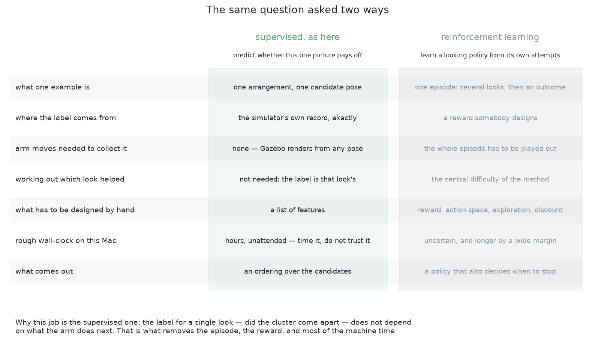
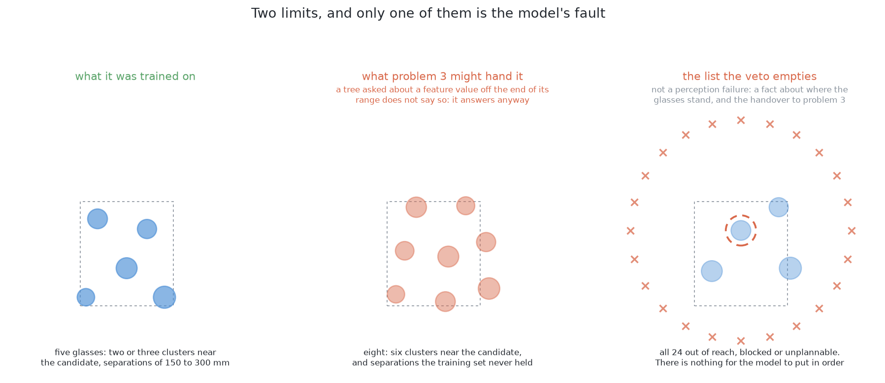

# Solution 6 — learn which viewpoints pay off

*Hybrid, with the model as a ranker. Score a candidate viewpoint by the thing
actually wanted: the chance that a picture taken from there splits an ambiguous
group into two glasses.*

> **The cell is described once, in [the cell](../../the-cell.md)** — the layout,
> the two places the camera works from, from the top and from the side, all four
> sensors, and the words this project uses them with. What follows is only what
> is specific to this solution.

## Introduction

This document explains how choosing where to look next can be turned into an
ordinary learning problem, of the simplest kind there is. The problem it
addresses is that the arm can afford only one or two extra pictures, so
something has to decide which pose is worth the seconds, and the hand-written
rule that does this today has a blind spot that no amount of care removes. The
idea here is to stop writing rules and instead **measure the thing we actually
want**: if the camera goes there and takes the picture, does the ambiguous group
come apart or not? By the end you will understand why that question has an exact
answer the simulator can simply look up, why the label chosen for it can also be
read during a real run, why the model is shown measurements rather than the
picture, and why the arithmetic still holds every power to refuse.

There is one general lesson here worth carrying away even if you never build
this. It is not "learning beats rules". It is that **the shape of a learning
problem is worth working out before reaching for the heaviest tool that fits
it**, because this one turns out to need nothing more than a table of numbers
and a column of yes-or-no answers.

## The problem this solves

The problem statement asks for one set of pixels per glass, a position for each,
and an honest list of the pairs that could not be separated.

Two glasses that stand far apart on the table can still land on top of each
other in a picture. When that happens, the step that groups touching pixels
returns one blob, and everything downstream believes it is one glass. That is
the failure the problem watches hardest, because it does not announce itself.

The fix is to take a different picture. But the camera is mounted on the wrist,
so a viewpoint is an arm pose, and that costs seconds of movement while the
picture itself costs milliseconds. So the question is not *can we look again*.
The question is **where**, given that we can only afford one or two more looks.

[Solution 3](03-move-the-camera.md) answers that
question with a rule. Throw away the poses the arm cannot reach. Throw away the
ones looking through another glass. Of whatever is left, take the one that asks
least of the arm's reach.

That rule is cheap, printable, and right most of the time. Its blind spot is not
an oversight by whoever wrote it. **It is a symmetry.**

### The symmetry a reach-based rule cannot see

Here is the geometry. How far the camera ends up from the arm's base depends
only on the angle between the direction it stands off in and the line running
out from the base. Swing that same angle to the other side of that line, and the
distance from the base is identical.

So **every viewpoint has a mirror image that scores exactly the same.** A rule
that ranks by reach cannot separate two candidates on opposite sides of the line
out from the base, however different what they would see. Both of the coloured
cameras in that picture stand the same distance back from the same group, both
are the same distance from the base, and neither has anything in the way. To a
reach-based score they are the same pose.

They are not remotely equally useful. One of them looks **across** the line
joining the hidden pair, so the two glasses land well apart in the picture with
clear table between them, and the fit resolves them. The other looks almost
**along** that line, so the near glass covers most of the far one and the
picture comes back as a single blob — no better than the picture that raised the
doubt in the first place, and one look poorer.

To tell those two apart, a rule would have to know about the line joining the
proposed pair, about which views have already been taken, and about how both of
those interact with the fitted widths. Somebody could write that rule. Then they
would write the next one, and the one after that.

### The alternative: measure the outcome directly

The alternative is to stop writing rules and ask the question we actually care
about: **if I go there and take the picture, will this group come apart into two
glasses?**

That is a yes-or-no question about one pose in one arrangement, and it has an
exact answer. Better still, the simulator can simply look that answer up,
because it renders the view from any pose it is asked for, and it knows exactly
what it spawned.

Those three panels show one arrangement and a set of candidates, scored three
ways, where green in the rows at the bottom means the pair really does come
apart from there.

**Solution 3** scores by least reach. Its top two candidates are tied exactly,
because of the symmetry above, and one of them is useless.

**Solution 4** scores by how far the model's own doubt should fall. That is a
better question than reach, but it is still a stand-in for the real one, and it
has a specific bad case. From the pose that lines the two glasses up, the blob
looks like one clean, well-bounded glass, so the model is *confident*, and a
large predicted drop in doubt is exactly the wrong answer.

**This solution** scores the chance the picture splits the group, and it is the
only one of the three that puts both useless looks at the end.

## The main idea

The main idea is that this is ordinary supervised learning, and that everything
awkward about learning has been removed from it by the choice of what to
predict.

There is no episode, no reward, no exploration schedule and no discount factor.
There is an input, an attempt, and a recorded outcome. The geometry still
generates the candidates and still holds every power to refuse them, and the
model only orders what survives, so a wrong prediction costs one wasted look and
nothing else.

The sections below build that up: first where the training data comes from, then
the one choice about the label that makes the whole thing work, then what the
model is shown, and finally why the arithmetic has to come first.

## Where the training data comes from

The training data comes from a sweep that needs neither a person nor an arm. It
runs entirely inside the simulator and appends one row each pass, in five steps.

First it **spawns** an arrangement: four to six glasses of one kind in the zone
at random, never closer than the smallest legal gap, with proportions drawn from
the kind's plausible range.

Then it **fits**, by running the normal survey and the normal clustering. A
group whose fitted circle falls outside the range this kind of glass is allowed
is ambiguous, and those are the groups this solution is about. In the picture
above, one group fits a circle far too wide for any single glass of its kind.

Then it **picks a candidate**, by generating the ring of directions round that
group and dropping the ones the geometry rejects.

Then it **renders** the view from that pose. Note what does *not* happen here:
the arm does not move and nothing is planned. This is a camera placed in a scene
and nothing more, which is why the sweep is cheap.

Finally it **writes the row**, holding the candidate's measurements and the
outcome of re-running the fit on the rendered picture.

The outcome in that last step is **read rather than judged**, and this is what
makes the labels exact. The simulator holds the true poses of everything it
spawned, so "did the group come apart into the right two glasses" is a lookup
rather than an opinion.

A few thousand arrangements give tens of thousands of rows, because about ten
candidates survive the veto per group and an arrangement usually yields one or
two ambiguous groups.

One thing about splitting that data matters, and getting it wrong would quietly
invalidate everything. **Hold back whole arrangements, not individual rows.**
Two candidates from the same arrangement are not independent of each other, so
splitting by row lets the model look the answer up instead of predicting it, and
the measured accuracy then means nothing at all.

### The one choice about the label that decides everything

There is a choice hiding in that last step, and it decides more than it appears
to.

The label is *did this picture change the answer*, which is yes if the failed
group came back as two circles inside the kind's allowed range, and no
otherwise. It is **not** *was the final answer correct*.

The difference is the whole reason the second loop later in this document is
possible. Being correct needs ground truth, which the arm will never have
outside a simulator. Having changed the answer needs only the two fits, before
and after, and a comparison between them. So the label is **observable during an
ordinary run**, on a real table, with no simulator and nobody watching.

That one property is what turns this from a thing you train once into a thing
that improves with use.

The same label extends cleanly to the second kind of request this problem
created, and it is worth noticing that it needs no new idea. Since one kind of
glass now spans a shot glass to a large tapered glass, a tall glass can cover a
short one completely, so [solution 2](02-cluster-on-the-table.md) also reports
**unsearched patches**: places that could not have been seen and are large
enough to hold the smallest glass. A look aimed at such a patch has an outcome
that is just as observable as a look aimed at a group. Did a glass appear that
was not in the list before? That is a count and a comparison, it needs no ground
truth, and it can be read on a real table exactly like the other label.

So the same model can order both kinds of request, trained on the same kind of
row. The one thing it must not do is treat them as interchangeable, because the
two outcomes are not equally valuable: resolving a merged pair corrects a
measurement, while finding a hidden glass corrects an **omission**, and an
omission is the worse failure. That weighting belongs in a written rule rather
than inside the model.

## What the model is shown

Every measurement handed to the model is a length, an angle or a count, and
**never a pixel value**. There is a hard reason for that rather than a stylistic
one: at the moment the score is wanted, **the picture does not exist yet**. The
arm is deciding whether to spend seconds going somewhere, so the only input
available is a prediction computed from what it currently believes.

Hand-made measurements have three further advantages here. They transfer,
because a length on the table means the same thing under a different light, with
a different glass colour and a different camera setting. They can be fitted from
thousands of rows, where raw pixels would need orders of magnitude more, and
every one of those rows costs a render. And when the model chooses wrongly, you
can print the measurements and see at a glance which one was unusual.

They fall into five groups, and each group answers a different kind of question.

**About the proposed pair**, there is the width of the single fitted circle, the
two widths the two-circle fit proposes, the separation between those two centres
measured in fitted radii rather than in millimetres so that the number means the
same for a large glass and a small one, and how much worse one circle fits than
two — which is how strongly the geometry believes there are two things there at
all.

**About the candidate against that pair**, there is the angle between the line
of sight and the line joining the two proposed centres, where square across
separates them as much as possible and straight along separates them not at all,
together with the separation and overlap the pair would show in the picture.
Those last two are the same geometry expressed in the units the camera actually
works in, and that is what decides whether the two outlines touch.

**About the candidate against everything else**, there is how close the ray
passes to each of the nearest other groups, measured in that group's own radii,
and how many groups fall inside the camera's view. One subtlety is included
deliberately: a neighbour can sit close to the line of sight and block nothing
at all, because it is on the far side of the target, so the sign matters and is
part of the measurement.

**About the arm**, there is how the reach sits against the two ends of the
comfortable band, the standoff, and the height above the table. The vetoes have
already worked all of these out, so they cost nothing to include.

**About what has already been looked at**, there is the angle from the nearest
view already taken, how many views this group has had, and how many looks the
budget has left. This is the group a hand-written rule always forgets, and it is
what decides the worked example below, because **a picture taken from almost
where you already stood is almost the same picture**, and it teaches you almost
nothing new.

### Why trees rather than a network

A yes-or-no answer predicted from a short table of numbers of different kinds —
angles, lengths, ratios and counts — is exactly the case that **decision-tree
boosting** was made for (Friedman, *Greedy Function Approximation: A Gradient
Boosting Machine*, Annals of Statistics, 2001).

A tree asks threshold questions, such as "is the line of sight more than halfway
towards square with the joining line?", and lands in a leaf holding a
prediction. Boosting fits a weak tree, then fits the next tree to whatever the
first one got wrong, and adds them up. On a table of this size that trains in
seconds on an ordinary processor, with no graphics card involved anywhere.

A small network is worth having only if the target stops being a yes or no and
becomes a number, such as how far the fit error dropped, because a network fits
a smooth curve more naturally than a staircase of thresholds does. But an
ordering needs only the ranking, so a yes-or-no target is enough to start with.

## The arithmetic comes first

Before the model is consulted at all, the candidates pass through the same three
vetoes [solution 3](03-move-the-camera.md) uses, in
the same order, cheapest first.

The **reach** veto requires the camera to land inside the band of distances the
arm works comfortably in. The **line of sight** veto rejects any ray passing
through another group's fitted footprint circle. And the **plannability** veto
asks whether any set of joint angles exists that puts the hand at the pose at
all, dropping the ones that have none.

Only then does the model read its measurements and return a probability.

That ordering is the safety argument, and it is a rule rather than an
implementation detail: **everything that can reject a pose is arithmetic, and
the model comes after all of it.** The worst a wrong prediction can do is put
one reachable, unblocked, holdable pose ahead of another. The cost of that is
one look. The model is never asked about safety, so it cannot cause an unsafe
movement.

There is one more reason the ring of candidate directions should be **fine**
rather than coarse, and it belongs here because it depends on the vetoes being
cheap. Over hundreds of drawn arrangements, a coarse ring leaves getting on for
half of all glasses with no usable viewpoint, while a fine ring leaves only a
small fraction. So most of what this cell calls "no viewpoint" is the ring
running out of spokes rather than the geometry running out of room. Generating
more candidates costs arithmetic and nothing else, because the vetoes throw them
away before the planner is ever asked.

## How the concepts fit together

Put in order, this solution has **two** loops rather than one, and that is the
unusual thing about it.

Green marks what this solution adds, blue marks work the project already does,
grey marks the model, and the dotted arrow is the second loop, which closes only
between runs.

### The loop inside a run

The loop inside a run is the ordinary one. Fit. Find the groups whose circle
falls outside the allowed range. Generate the ring of candidates and veto them.
Score the survivors and take the highest. Move, photograph, and fit again. Then
append one row holding the measurements that were scored and the outcome that
was observed.

It stops when nothing is ambiguous, when the budget is spent, or when a group
has no surviving candidate at all. Whatever is still ambiguous is reported as
ambiguous, which is what the problem statement asks for.

Two rules keep that loop from running away, and neither of them is the model.

The first is **a floor that ignores the score**. Any group failing the circle
fit gets one look whatever the prediction says. Without that floor, a model that
predicts no payoff anywhere would silently report a merged pair as one large
glass, which is the exact failure the whole problem is arranged around.

The second is **a cap**, both per group and per run. The survey is what the run
costs today, and the whole run should take tens of seconds, so a small number of
extra looks roughly doubles it while a larger number does not fit at all.

### The loop between runs

The second loop is the reason to build this solution at all, and it exists only
because of the choice of label described earlier.

The label needs no ground truth, because it is *did the answer change*, which is
two circle fits and a comparison between them. So it is available on a real
table, with no simulator and nobody watching. **Every look the arm takes is
another labelled row.**

The right-hand panel above is the shape of that claim rather than a measurement
of it, because nothing here has been run yet. Its point is the flat line. A
hand-written rule performs exactly as well on its thousandth run as on its
first. A fitted one does not have to.

Three guards on the retraining are all dull and all necessary.

**Retrain offline, between runs, and never during one.** A model that changes
during a run makes the run impossible to reproduce, and a run you cannot
reproduce is a run you cannot debug.

**Check calibration rather than assuming it.** Of the looks the model was most
confident about, did about that share actually resolve the group? If the answer
is no, then this is a rule of thumb wearing a weights file, and that should be
said out loud rather than discovered later.

**Log something other than the model's own favourite.** A log holding outcomes
only for the poses the model already liked teaches it nothing about the rest,
and retraining on such a log locks in an early mistake. The repair is to take
the second-ranked candidate occasionally. That is the cheapest possible version
of what the active-learning literature calls exploration, and Settles' [*Active
Learning Literature
Survey*](https://burrsettles.com/pub/settles.activelearning.pdf) (2009) tours
the better versions, none of which is needed at this scale.

## A worked example

This example follows one ambiguous group through the method, and its purpose is
to show the two candidates that a hand-written rule gets wrong.

The survey finishes. Most of the groups fit circles comfortably inside the range
this kind of glass is allowed. One does not, because its circle comes out about
twice as wide as any single glass of this kind can be, so that group is
**ambiguous**. It stands about halfway out across the arm's comfortable reach.

**What the fit proposes.** Two circles, both of plausible width for the kind,
but with their centres much closer together than any two real glasses could ever
be.

That proposed separation is not believable, because the spawner never puts two
glasses closer than the smallest legal gap — and *why* it is wrong is
instructive. From the survey's line of sight, the far glass is mostly hidden
behind the near one, so the points that did come back sit almost on top of each
other. The **direction** of the line joining the pair is reliable. Its
**length** is an under-estimate, and always in the same direction. That is one
more reason to hand the model the separation measured in fitted radii, and let
it learn for itself how much to trust it.

**Reach removes about half the candidates.** Picture the camera as sitting on a
ring drawn round the group, and the arm as working only inside a band of
distances from its own base. Swinging the candidate direction round the ring
carries the camera nearer to the base and then further from it, smoothly. So the
reach veto keeps a continuous **arc** of the ring and throws away both ends: the
directions pointing back towards the base, which would fold the arm up, and the
directions pointing away from it, which would stretch the arm straight. On a
fine ring, that arc still holds a good number of candidates.

**Line of sight removes several more.** One neighbour stands fairly close to the
group, and seen from the group that neighbour covers a wedge of directions, so
any candidate inside the wedge is dropped. It is worth confirming that this is a
real objection rather than a cautious one: from inside that wedge, the
neighbour's outline would cover a good fraction of the width of the picture,
sitting directly over the target.

**Plannability removes one.** For one of the survivors, no set of joint angles
exists that puts the hand there at all.

**The scores.** The best score goes to the direction **square across the line
joining the proposed pair**. It is clear of every footprint, it is well round
from the direction the survey already looked from, and it sits comfortably
within the reach band.

Two of the others are worth naming, because a hand-written rule gets both of
them wrong.

The first is **the candidate with the least reach of any survivor**, which
scores near the bottom here. Because it asks least of the arm and has a clear
line of sight, solution 3's rule ranks it joint first. But it lies almost along
the joining line, so from there the two glasses stay squarely on top of each
other and the picture simply repeats the problem.

The second is **the candidate pointing back the way the survey already looked**,
which also scores near the bottom even though it is perfectly reachable and
perfectly unblocked. Whatever it returns, the run has already seen it. Nothing
in solution 3's rule knows that, because solution 3's rule has no memory of
where the camera has already been.

**The look itself.** Plan, move, settle: a few seconds, and that is the whole
cost. Then several pictures along the slide, because the arm is already standing
there.

From the chosen pose, the two glasses land well apart in the picture, far enough
apart that there is clear table between their two outlines rather than one
outline running into the other. So the clustering separates them with room to
spare, and the fit returns two circles, both comfortably inside the kind's
range, with their centres the full distance apart that two real glasses stand.
The group is resolved, and one look of the budget has been spent.

For contrast, work the same thing through from the low-reach candidate the rule
preferred. From there the pair projects barely apart at all, against two
outlines each wider than that gap, so the outlines overlap and what comes back
is a single blob, still too wide to be one glass of this kind. The group stays
ambiguous, and the run is one look poorer with nothing to show for it.

Finally a row is appended to the log, holding the measurements of the pose that
was taken and the outcome — in this case, that the group did come apart.

## Where the idea comes from

Three separate lines of work meet in this solution.

### Active perception, and the loop that follows from it

The first is the observation that a camera which can move is not the same
instrument as one that cannot. Bajcsy's *Active Perception* (Proceedings of the
IEEE, 1988) named it, and Connolly's *The Determination of Next Best Views*
(ICRA, 1985) is the loop that follows from it: given what you have seen and
where you could go, where next? Scott, Roth and Rivest's survey *View planning
for automated three-dimensional object reconstruction and inspection* (ACM
Computing Surveys, 2003) collects the classical answers, nearly all of which
score a viewpoint by how much unknown space it would resolve. Solution 3 is a
small, hand-cut version of that tradition.

### Predicting whether an action will work, from data

The second is a move that grasping made about ten years ago, for exactly the
reason that applies here. Nobody could write down a rule saying whether a
gripper pose would hold an object, so people collected attempts and fitted a
function from the pose to whether it worked. Pinto and Gupta's [*Supersizing
Self-supervision*](https://arxiv.org/abs/1509.06825) (ICRA 2016) had a robot try
tens of thousands of grasps and label them by whether the object came up. Levine
and colleagues' [*Learning Hand-Eye Coordination for Robotic
Grasping*](https://arxiv.org/abs/1603.02199) (2016) is the larger version.

Neither of those is reinforcement learning, and the distinction matters. There
is no episode and no reward, only an input, an attempt, and a recorded outcome.
The label is free because the world produces it.

### Next best view as supervised learning

The third is the same move made for this exact payoff. Vasquez-Gomez and
colleagues' [*Supervised learning of the next-best-view for 3D object
reconstruction*](https://arxiv.org/abs/1905.05833) trains a model to pick the
best of a fixed set of poses, with labels generated by simulating each pose and
measuring what it gained.

### Why this is not reinforcement learning

The comparison worth having in mind is against the heavier alternative, which is
a policy trained by reinforcement learning, written up as [an active-vision
policy](learned-with-hardware.md#an-active-vision-policy) in the companion
document.

Read the "working out which look helped" row of that comparison first, because
it decides everything else. A reinforcement-learning agent takes several looks
and then gets one number saying how the whole episode went. Working out
**which** of those looks earned that number is the central difficulty of the
method, and it is why episodes have to be played out in their thousands.

Here, the label for one look does not depend on what the arm does next, so there
is nothing to work out. Remove that problem and the episode goes with it, and
with the episode go the reward function, the exploration schedule, the discount
factor and most of the machine time.

A policy does buy one thing this solution does not: it can also learn **when to
stop**. Here that stays a written rule, which is to stop when nothing is
ambiguous or the budget is spent.

## The general ideas behind this

This solution predicts the *value of an action* rather than a property of the
world, which puts it in a different family from everything before it — and one
where the simulator rather than a person supplies the labels. Five general ideas
are worth knowing separately.

### Learning a utility, rather than learning to perceive

The model here does not say what is on the table. It says how much a given
action would help. That is called **utility** or **value** estimation, and the
trick that makes it workable is that the answer is cheap to check: take the
action in simulation and see what happened. A viewpoint either resolved the
ambiguity or it did not. So a hard question about the future becomes ordinary
supervised learning on an exactly labelled past.

It is used for choosing among actions wherever the outcome can be simulated or
replayed, such as view planning, grasp ranking, move ordering in games, and any
situation with a cheap way to ask "did that work?". It is rarely right for
actions whose outcome cannot be judged without doing them for real, because then
there is no free label set and the problem becomes reinforcement learning, with
all of its cost in attempts.

### Learning to rank — the order matters and the score does not

Nothing downstream uses the predicted number itself. Only the order of the
candidates matters. That is called **learning to rank**, and it is an easier
problem than predicting the number, because a model that is wrong by the same
amount everywhere still ranks perfectly, and it only ever needs to be right
about the top of the list.

It is used for search, recommendation and advertisement placement, and in
exactly the same shape for ordering candidate grasps, viewpoints or motions in
robotics. It is rarely right where the *size* of the number is used rather than
just the order, such as deciding whether to act at all, or comparing against a
fixed budget. **Ranking tells you which candidate is best. It never tells you
whether the best one is any good.** That is why the floor described earlier
exists.

### Supervised learning on labels a simulator generates

The simulator knows exactly what it spawned, so every training row comes
labelled for nothing. That removes the expensive part of supervised learning and
replaces it with a different problem: the labels are perfect, but the world is
not real.

It is used throughout robotics and self-driving, where real labelled data is
slow and dangerous to collect, and where the quantity that matters — a pose, a
contact, an outcome — is exactly what a simulator holds and a human labeller
cannot see. It is rarely right **without** a plan for the gap between simulation
and reality, because a model trained only on synthetic scenes has fitted one
renderer's shading and one spawner's habits, and it will be confidently wrong on
anything outside both.

For more, see [domain
adaptation](https://en.wikipedia.org/wiki/Domain_adaptation) for the family of
fixes, and the domain randomisation described in [solution
7](07-a-segmenter-trained-from-scratch.md) for the one that suits simulators.

### Active learning — the same idea pointed at a labelling budget

Choosing the most informative next viewpoint is the robot's version of choosing
the most informative next example to label. The mathematics is shared, and so is
the central warning: a rule that always picks the most uncertain case tends to
pick the *unlabelable* ones, meaning the corrupted, the ambiguous and the
genuinely undecidable. Which is precisely why a floor and a cap matter more here
than the score does.

It is used wherever labels are expensive, such as medical annotation, expert
review and scientific experiments. It is rarely right for cheap measurements,
where taking several and skipping the reasoning is faster than deciding which
one to take.

### Generate, veto, then rank

The last idea is the structural pattern, and it is the reason a wrong prediction
here costs one wasted look rather than a wrong answer. Geometry generates the
candidates and holds an absolute veto, and the model is only allowed to reorder
what survives. **Position in the pipeline is what limits the damage** — see
[where the learned part
sits](solution-overview.md#three-families-and-what-hybrid-means).

## Where it is strong and where it breaks

The strengths come from what the design does not need.

It scores the outcome rather than a stand-in such as unknown volume or least
reach, so it is aimed at the thing actually wanted. It gets most of a learned
policy's benefit with no episodes, no reward function, no machine days and no
graphics card. Delete the weights file and the vetoes still return reachable,
unblocked, holdable poses, which ordered by reach is exactly solution 3 — so
this solution extends that one rather than replacing it. And it improves with
use for the price of a log file, while a wrong choice still prints as a readable
row of measurements.

The weaknesses divide into what it is not, what it cannot see, and what it
cannot survive.

What it is not comes first, and it is the most important caution here. **This is
an ordering, not a capability.** Score solution 3's rule first, and if its top
pick usually resolves the group, then this solution earns nothing at all.
Measure before building.

What it cannot see comes second. If there is no two-circle fit then there are no
measurements to give it, and an empty candidate list leaves nothing to order,
both of which are the handover to [problem 3](../../problem-3/problem.md). It
can predict a payoff that never arrives, or predict none anywhere, and the cap
and the floor are what bound both of those. A tree asked about something outside
its training range answers with its usual confidence, so it should be trained
across the whole range the cell allows and fall back to the rule outside it. And
it cannot rank a pose nobody generated: the ring is one standoff at one height,
so any better view from some other distance or some other height is invisible to
it.

What it cannot survive comes third. The log holds only the poses the model
liked, so retraining without the occasional second-ranked look locks in
mistakes. Change the list of candidate directions, or change the spawner, and
the weights quietly describe a cell that no longer exists — the record of
measurements stored inside the model file catches a changed *feature*, and not a
changed *world*. And the labels are only as honest as the simulator, while real
glassware returns no depth at all.

This solution earns most at [problem 4](../../problem-4/problem.md), where the
kind of glass is unknown, because there the thing that makes a look pay off
stops being one nameable quantity.

## Where it sits among the other solutions

The clearest way to place this solution is against the two it shares a skeleton
with. All three of solution 3, solution 4 and this one generate candidates,
filter them with arithmetic, and then order the survivors. They differ only in
what the ordering is based on.

Solution 3 orders by a printed rule, which is cheap and has the symmetry blind
spot described at the top of this document. Solution 4 orders by how far a
model's own doubt should fall, which is better but still a stand-in. This
solution orders by the predicted outcome itself, which is the thing actually
wanted.

So the three form a ladder, and the rung to build is the lowest one that
measurably does the job.
