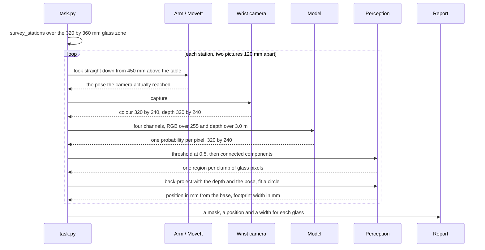
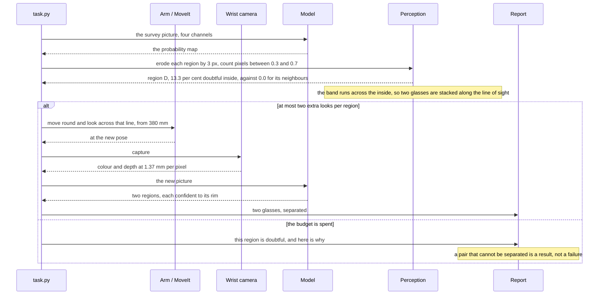
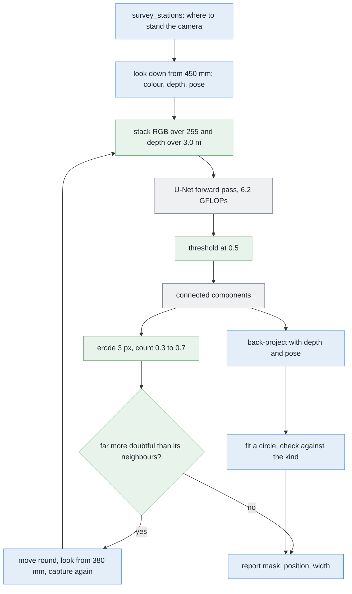

# Solution 7 — a segmenter trained from scratch

*Learned, as the decider, and trained from random initialisation on renders
alone. One class, one kind of object, one camera — a network that only has to
work in this cell can be small enough to train in an afternoon.*

## In one paragraph

This cell does not need a general-purpose model. One class, one kind of object,
one camera, one lighting rig, pictures 320 by 240. A small encoder-decoder — a
U-Net of about 482,000 weights, which is arithmetic on its channel widths and
not a measurement — can be trained from random initialisation on Gazebo renders
alone, because the simulator labels every picture exactly and for nothing. It
returns a probability at every pixel, and the pixels it is unsure about are a
reason to take another picture. It gives semantic and not instance
segmentation, and it learns Gazebo, not the world.

## The problem this solves

[`problem.md`](../problem.md) sets the job. Four to six glasses stand on a
table, all of one kind, the kind known, at least 150 mm apart. The arm
photographs them from a wrist camera and has to say **which pixels belong to
which glass**, give each glass a place on the table and a rough footprint
width, and name honestly any pair it could not tell apart.

The difficulty is that two glasses far apart on the table can still land on top
of each other in a picture, if the camera happens to be in line with both.
Grouping pixels by whether they touch — a flood fill — then returns one blob,
and one blob means one glass to everything downstream.

The programmed answers work on the depth reading: lift the points into the
room and cluster them where they actually are rather than where they happen to
land in the picture. They work well and they are the core of this project's
answer, and they lean entirely on depth and on the table plane being findable.

This solution asks a different question. **Can a network be taught to label the
glass pixels directly, with no rule about planes or heights written anywhere?**
And can that be done here, on an Apple Silicon Mac with no NVIDIA graphics
card, with no photograph of a real glass anywhere in the project, in hours
rather than days?

## How it works, end to end

### The setup

The table top is at 750 mm and everything in the cell is measured from it. The
glasses stand in the glass zone, 320 by 360 mm of table (`GLASS_ZONE` in
`rack/layout.py`), four to six of them, upright and opaque. The camera is on
the wrist, 85 mm to one side of the tool axis, so moving the camera means
moving the whole arm and the arm's own reach decides where a picture can be
taken from.

Known before the run starts: the table height, the camera — 320 by 240 pixels,
a 60 degree horizontal field of view, so fx = fy = 277.1 pixels — the kind of
glass and its grip rule, and the guarantee that no two glasses are closer than
150 mm. Not known: how many glasses there are, where they stand, or how big
they are. This project never writes a glass's size down.

What this solution adds to the cell is one file: about 482,000 trained weights,
1.93 MB at four bytes each, produced before the run and shipped with the code.

### The pictures

Two kinds of picture, both from the same wrist camera.

**The survey.** `survey_stations()` in `arm/dimensions.py` spreads stations
over the glass zone, as few as will cover it, each picture overlapping its
neighbour by 35 per cent so that no glass lands only on an edge. At each
station the arm looks straight down from **450 mm above the table**
(`SURVEY_HEIGHT`) and takes **two pictures 120 mm apart** (`SURVEY_BASELINE`).
Two rather than one because a single top-down picture cannot say how far away a
glass is, only which direction it lies in; how far a glass appears to shift
between the pair is what fixes where it stands. At 450 mm with fx = 277.1 one
pixel covers 1.62 mm and one picture covers about 520 by 390 mm of table.

**The second look.** When a region comes back doubtful, the arm moves round to
photograph it from the side, at the **380 mm standoff**, looking across the
line joining the suspected pair rather than along it. There one pixel covers
1.37 mm. Round, not closer: the problem is the direction the camera is looking
from, not the resolution.

### What each picture captures

The wrist camera is an RGBD sensor. One capture returns:

- **colour**, 320 by 240, eight bits per channel;
- **depth**, 320 by 240, in metres, clipped at 0.05 m near and **3.0 m** far;
- **the camera's pose as reached**, not as commanded. The camera sits 85 mm off
  the wrist axis and the two survey pictures measure a distance between them,
  so a centimetre of error here would go straight into every position reported.

It does **not** return a mask. Nothing in the sensor knows which pixels are
glass — that is the whole job.

One more thing is captured, but only during training and never during a run:
Gazebo also hands over the per-object mask it drew, because the simulator knows
which pixels are which object. It drew them. That is the reason this solution
exists.

### What is interpreted, and how

The chain from raw pixels to the answer, in order:

1. **Stack the input.** Colour divided by 255, depth divided by the camera's
   3.0 m far clip, into four channels at 320 by 240. Depth is scaled, not
   converted to a height above the table — handing over a height would be
   handing the network the very cue the clustering solutions use.
2. **One forward pass** through the U-Net. About 6.2 GFLOPs. Out comes one
   probability per pixel, same width, same height.
3. **Threshold at 0.5** to get a binary mask.
4. **Connected components** on that mask: one region per clump of glass pixels.
5. **Erode each region by 3 pixels**, then count the pixels inside what is left
   whose probability falls between 0.3 and 0.7. That is the doubt statistic,
   and the erosion is what makes it mean anything — see the feedback loop below.
6. **Back-project** each region's pixels through the depth reading and the
   recorded pose into points in the room, in millimetres from the arm's base.
7. **Fit a circle** to the footprint and check its diameter against the kind's
   accepted range.
8. **Decide.** A region far more doubtful than its neighbours, or one whose
   diameter the kind rejects, is queued for a second look. The rest are matched
   across the two survey pictures by `where_they_stand()`.

Steps 3 to 8 are ordinary arithmetic. Only step 2 is learned.

### What comes out


Look at the right-hand panel. It is the same width and the same height as the
picture on the left, but every pixel holds one number between 0 and 1: how sure
the network is that this pixel is glass. The plot underneath follows the dashed
line across one glass. The number is near 0 over the table, near 1 over the
glass, and it passes through the middle only in a band about two pixels wide at
the rim, where genuinely nobody could say.

Per glass, the run reports a **mask**, a **position in millimetres** from the
arm's base and a **rough footprint width in millimetres**. Alongside those it
keeps the probability map itself, which is what the loop reads, and a list of
regions it is **reporting as doubtful rather than guessing at**.

`task.py` receives all of it and decides what happens next; `report.py` writes
it down. The doubtful pairs are the handover to
[problem 3](../../problem-3/problem.md), which is allowed to move a glass and
this problem is not.

## The sequence

The normal path: one survey station, two pictures, one answer per glass.



The interesting path: the region the network is unsure about, and what happens
when the budget for extra looks runs out.



## In pseudocode

The pipeline, coloured by who owns each step.



**Legend.** Green is new code written for this solution; blue is code this
project already has; grey is a third-party library.

Note where the colours fall. The only green in the run-time path is arithmetic
on arrays — stack, threshold, erode, compare. The network itself is a library
call, and everything that turns pixels into millimetres is already written.

```text
# once, before the run
for scene in randomised_scenes(4000):                    # NEW    · work_cell.glasses.spawn
    rgb, depth, truth = gazebo.render(scene)             # gazebo · the label costs nothing
    if coin_flip():                                      # NEW    · modality dropout
        depth = zeros_like(depth)                        # NEW    · numpy
    x = stack(rgb / 255.0, depth / 3.0)                  # NEW    · numpy
    p = unet(x)                                          # torch  · 482,177 weights
    loss = weighted_bce(p, truth) + dice_loss(p, truth)  # torch  · 7.5 on glass, 1 minus Dice
    loss.backward()                                      # torch  · Adam, batches of 16

# during the run
stations = survey_stations(GLASS_ZONE, footprint)        # have   · work_cell.arm.dimensions
for station in stations:                                 # have   · work_cell.task
    rgb, depth, pose = arm.look_down_from(station)       # have   · work_cell.task
    x = stack(rgb / 255.0, depth / 3.0)                  # NEW    · numpy
    prob = unet(x)                                       # torch  · one pass, 6.2 GFLOPs
    mask = prob > 0.5                                    # NEW    · numpy
    regions = connected_components(mask)                 # cv2    · connectedComponents
    for region in regions:                               # NEW    · ~20 lines
        core = erode(region, 3)                          # cv2    · erode, a 3 px collar off
        doubt = fraction(0.3 < prob[core] < 0.7)         # NEW    · numpy
        points = backproject(depth, region, pose, K)     # have   · work_cell.glasses.perception
        centre, diameter = fit_circle(points[:, :2])     # have   · work_cell.glasses.detect
        if far_above(doubt, others_in_this_frame):       # NEW    · relative, not an absolute
            look_again(centre, across=band_direction)    # have   · work_cell.task
        elif not kind.accepts(diameter):                 # have   · work_cell.glasses.spec
            report.doubtful(region, diameter)            # have   · work_cell.report
        else:
            report.glass(centre, diameter, region)       # have   · work_cell.report
```

The libraries, and which of them the environment already has:

| library | used for | licence | in the pixi environment |
| --- | --- | --- | --- |
| [PyTorch](https://pytorch.org/) | the network, the training loop, the MPS backend | BSD-3-style [licence](https://github.com/pytorch/pytorch/blob/main/LICENSE) | **No.** It is a large dependency and taking it on is a real decision, not a line in a file |
| [NumPy](https://numpy.org/) | stacking, thresholding, counting the doubt | BSD-3-Clause | Yes |
| [OpenCV](https://opencv.org/) | connected components, erosion | Apache-2.0 | Yes |
| [Gazebo](https://gazebosim.org/) | every training render and every label | Apache-2.0 | Yes, through `ros-jazzy-ros-gz` |
| [segmentation_models.pytorch](https://github.com/qubvel-org/segmentation_models.pytorch), optional | a ready-made U-Net instead of writing eighty lines | MIT | **No**, and its encoder defaults to ImageNet weights — that default has to be turned off explicitly or this project's rule is broken by a keyword argument nobody looked at |

PyTorch is the only heavy one, and it is unavoidable: there is no way to train
or run a network without it. Everything else is already here.

## A worked example

Take the merge that this problem exists to prevent, and put numbers on it.

**The geometry.** The camera is at survey height, 450 mm above the table,
looking down. fx = 277.1, so at the table plane one pixel covers

    450 / 277.1 = 1.62 mm

and the picture covers about 520 x 390 mm. That figure is exact only at the
centre of the frame: the left and right edges are further from the camera —
450 / cos 30 degrees = 520 mm — so a pixel there covers 1.88 mm, about 15 per
cent more. Every number below uses the centre-of-frame scale.

**The two glasses.** Both are of a kind whose footprint runs 60 to 90 mm; both
happen to be 78 mm across. They stand 180 mm apart, which clears the 150 mm
minimum comfortably. Unluckily, the line joining them points almost straight
away from the camera.

Each is 78 / 1.62 = **48 pixels** across. Their centres land **30 pixels**
apart in the picture. Since 30 x 1.62 = 48.6 mm, only 49 mm of their 180 mm
separation is across the camera's view; the rest,

    sqrt(180^2 - 48.6^2) = 173 mm

is along the line of sight, where the picture cannot record it.

Two discs 48 pixels across with centres 30 pixels apart overlap. The union runs
from 24 pixels left of the near centre to 24 right of the far one:
30 + 48 = **78 pixels** across, 79 counting both edge pixels. Its area is about
3,120 pixels.

**What the network returns.** One region. The probability map is near 1 across
all 3,120 pixels of it, because every one of them genuinely is glass. The
network is not wrong. It answered the question it was asked, and the question
had no place in it for "two".

A 78-pixel region is 126 mm wide, and no glass of this kind is wider than
90 mm, so the circle fit can *notice* that something is off. Noticing is not
separating.

**What the second look does.** Move the camera round to look across the line
joining the two glasses rather than along it, from the side-on standoff of
380 mm. There one pixel covers 380 / 277.1 = **1.37 mm**. The 173 mm that was
hidden along the line of sight is now 173 / 1.37 = **126 pixels** across the
picture, and each glass is 78 / 1.37 = **57 pixels** wide. Two 57-pixel discs
with centres 126 pixels apart leave a clear gap of about 69 pixels between
them. They come back as two regions, each confident to its rim, and the merge
is gone.

## The network itself

The reason a small network can do this well is that **the cell is narrow**: one
class, glass or not glass; one kind of object, drawn inside one kind's
plausible range, and across the whole library that is 65 to 230 mm tall with
footprints 45 to 105 mm across; one camera, 320 x 240 with fx = fy = 277.1; one
lighting rig, in one simulator; objects always upright and always opaque.
Almost all the variety a general model is built to absorb does not occur here.
So the network can be small, and a small network with an endless supply of
exactly labelled pictures is something you can train from nothing in an
afternoon.

### Why train from scratch rather than fine-tune


The two columns are the two ways to begin, and every row is something that
differs between them.

A network here is a function from a picture to a picture of labels: a fixed
chain of arithmetic whose **weights** are what make one network different from
another. They start as random noise. **Training** shows the network a picture,
compares what it produced with the answer wanted, and nudges each weight the
way that would have helped. Nobody writes the rule it ends up applying and
nobody can read it back out.

**Fine-tuning** means not starting from noise: take a network somebody else
trained on a large collection of labelled photographs, throw away its last
layer, bolt your own on, continue training. It is the standard advice
everywhere, because **labelled real pictures are scarce** — somebody has to
draw round every object in every picture — and a borrowed backbone cuts the
number of labels you need by an order of magnitude.

Two things make that argument collapse in this cell.

**Every backbone worth borrowing was fitted to real photographs.** ImageNet
([image-net.org](https://www.image-net.org/)) and COCO
([cocodataset.org](https://cocodataset.org/)) are photographs, and so is
everything trained on them, including promptable foundation models such as
Segment Anything ([arXiv:2304.02643](https://arxiv.org/abs/2304.02643), code
Apache-2.0). This project's rule is that everything a solution needs must be
producible by Gazebo on this machine. A file of weights fitted to photographs
of the real world is not. That is not a judgement about whether those models
are good; they are excluded by where their numbers came from. The versions of
this project that *do* allow them are written up in
[`learned-with-hardware.md`](learned-with-hardware.md).

**The scarcity fine-tuning exists to solve is not present.** Asking Gazebo for
a render and its per-object mask costs the same as asking for the render. No
annotator, so no annotator's budget and no annotator's mistakes. Labels here
are free.

A third, smaller reason: most ready-made backbones want CUDA kernels and this
machine has no NVIDIA card. That alone would decide nothing — plenty run on
CPU — but it removes the last practical argument for borrowing.

So: random initialisation. Which is reasonable only *because* of the second
point. Training from scratch on a few hundred hand-drawn labels would be a bad
idea. Training from scratch on an endless supply of exact ones is not.

### The shape: a U-Net


Follow the left column down, then the right column up. The dashed green lines
are the part that gives the shape its name.

**The down path.** Start with the picture: 320 wide, 240 tall, four channels
deep — red, green, blue, depth. Apply two convolutions. A **convolution** takes
a small window, here 3 x 3, slides it over the picture, and at each position
multiplies the values in the window by a fixed set of weights and adds them up.
One set of weights produces one output channel; sixteen sets produce sixteen.

Then **halve it**. A 2 x 2 max pool keeps the largest of each block of four
pixels, giving 160 x 120. Two more convolutions, now 32 channels. Halve again
to 80 x 60 and widen to 64. Halve again to 40 x 30 and widen to 128. That last,
smallest, widest layer is the **bottleneck**.

Two things happen on the way down and they pull against each other. Each
halving throws away exactly where something is — after three, one unit stands
for an 8 x 8 patch of the original. But each halving also means the next 3 x 3
window covers four times as much of the original picture. Deeper units know
less precisely where they are looking and much more about what is around them.
That trade is the whole reason for going down. (320 and 240 both divide by 8
exactly — 40 x 30 — so three halvings need no padding and no cropping. They
divide by 16 too, which matters below.)

**The up path.** A **transposed convolution**, 2 x 2, doubles 40 x 30 back to
80 x 60 while narrowing 128 channels to 64. Two more 3 x 3 convolutions, double
again, and again, until the tensor is 320 x 240 with 16 channels. A final 1 x 1
convolution — a window of exactly one pixel, so no mixing across space, just a
weighted sum of the 16 channels — collapses it to one channel, and a logistic
function squashes that to between 0 and 1.

**The skip connections.** The bottleneck knows there is a glass roughly over
there, but three max pools have destroyed which pixel its rim sits on. Doubling
the tensor back up cannot invent that detail. So do not throw it away: before
each halving keep a copy, and on the way back up **glue the copy on** as extra
channels — hence the 128 channels feeding the first decoder convolution at
80 x 60, 64 from below and 64 copied across. That is what the dashed lines are,
and what the U refers to. The design is Ronneberger, Fischer and Brox, 2015
([arXiv:1505.04597](https://arxiv.org/abs/1505.04597)), written for microscope
images, where the same problem — label every pixel, few examples — arises.

### How many weights that is


A 3 x 3 convolution from *m* input channels to *n* output channels holds
3 x 3 x *m* x *n* weights, plus one bias per output channel. The table below is
that formula applied to the widths above and nothing else. **It is arithmetic
on the channel widths, not a measurement.** No network was built or weighed.

| block | what it does | weights |
| --- | --- | --- |
| down 1 | 4 -> 16, then 16 -> 16 | 2,912 |
| down 2 | 16 -> 32, then 32 -> 32 | 13,888 |
| down 3 | 32 -> 64, then 64 -> 64 | 55,424 |
| bottleneck | 64 -> 128, then 128 -> 128 | 221,440 |
| up 3 | double, then 128 -> 64, 64 -> 64 | 143,552 |
| up 2 | double, then 64 -> 32, 32 -> 32 | 35,936 |
| up 1 | double, then 32 -> 16, 16 -> 16 | 9,008 |
| head | 1 x 1, 16 -> 1 | 17 |
| **total** | | **482,177** |

**The deep, narrow layers hold nearly all of it.** The bottleneck and the first
decoder block are 364,992 of the 482,177 — 76 per cent — because weights scale
with the *product* of the channel widths, which doubles twice per level, while
the spatial size shrinks by four. Widening the deepest level is expensive;
widening the first is nearly free.

**The whole thing is small.** At four bytes per weight, 482,177 weights is
1.93 MB. As 16-bit floats it is under a megabyte. This is a file you can
commit, version and regenerate without thinking about it.

### The receptive field, and the warning it gives

There is a number worth computing before trusting this design, and it is on the
right-hand panel above: the **receptive field**, how much of the input one unit
at the bottleneck actually depends on.

Each 3 x 3 convolution extends the field by one pixel either side, at whatever
scale it is working at. Start at 1. Two convolutions at full scale take it to
5. A pool takes it to 6 and doubles the scale. Two convolutions there: 14.
Pool: 16. Two more: 32. Pool: 36. Two more at the bottleneck's scale of 8:
**68**.

So one bottleneck unit sees a 68 x 68 patch of the input. At survey height one
pixel covers 1.62 mm, so that patch is about **110 mm of table**. The glasses
are guaranteed to stand **at least 150 mm apart**. The deepest layer, the one
with the context to reason about a neighbour, cannot see two glasses at once.

A fourth halving fixes it: 20 x 15 at the bottleneck, a receptive field of 140
pixels, about 227 mm of table. It costs 1,941,249 weights instead of 482,177 —
four times as many. Whether the extra level is needed is **uncertain**: the
decoder's convolutions widen the field further on the way back up, and the
evidence for separating two overlapping silhouettes may be entirely local to
the seam. It is flagged because it is much cheaper to check with arithmetic
before training than to diagnose after.

### The loss, and why most pixels being table matters


The left panel counts the pixels; the right one shows two scores disagreeing
about the same three answers.

Training needs a **loss**: one number saying how wrong an answer was, which the
nudging tries to reduce. The obvious one is **binary cross entropy**. For a
pixel that really is glass the penalty is minus the logarithm of the
probability the network gave it — being sure and right costs nothing, being
sure and wrong costs a great deal — and for a table pixel the same with the
probability flipped. Average over every pixel.

That average is the trouble, and it comes out of this cell's geometry. One
picture is 320 x 240 = 76,800 pixels. At survey height a glass with a 78 mm
footprint is 48 pixels across, so its silhouette is roughly 1,810 pixels. Five
of them is about 9,048 pixels — **11.8 per cent of the picture**. Nearly nine
pixels in ten are table.

So a network can lower the average a long way without learning anything. Start
by saying 0.5 to everything: the loss is 0.693 per pixel. Now learn one thing
only — "say 0.02 everywhere", which is "there is never any glass". The table
terms each cost 0.020, the glass terms each cost 3.912, and the weighted
average is **0.479**. The loss has fallen by nearly a third and the network has
learned to produce an empty picture. That is worst early in training, when
there is nothing better on offer.

Two standard fixes, and this uses both.

**Weight the rare class up.** Multiply every glass pixel's term by roughly
88.2 / 11.8, about 7.5, so the two halves of the picture matter equally.

**Add a loss that measures overlap rather than counting pixels.** The **Dice
coefficient** is twice the number of pixels both the answer and the truth call
glass, divided by the total number either calls glass. It is 1 for a perfect
match, 0 when they share nothing, and it has no term for the table at all.
Using 1 minus Dice alongside the weighted cross entropy is the usual recipe,
from Milletari and colleagues, 2016
([arXiv:1606.04797](https://arxiv.org/abs/1606.04797)).

The right-hand panel is why. Three answers, two scores:

| the answer | pixel accuracy | Dice |
| --- | --- | --- |
| say "table" everywhere | 0.882 | 0.000 |
| every mask 3 pixels too thin | 0.972 | 0.867 |
| exactly right | 1.000 | 1.000 |

Pixel accuracy gives a useless answer 0.882 and a visibly wrong one 0.972,
because it is mostly reporting how many table pixels were correctly called
table. Dice gives the useless answer 0 and notices the thin masks. A score that
rewards saying nothing will be optimised by a network that says nothing.

### The depth channel, and what it does not buy for free

Depth is an **input channel**, one of the four. That is worth stating plainly,
because it means this solution does **not** get "works without depth" for free.
A network handed depth will lean on it, because it is by far the easiest signal
in the picture, and the colour path will never develop.

The property is worth wanting. If the glasses ever become real glass, the depth
camera stops returning anything useful through them and every method that
clusters points in the room loses its input at once. A colour-only method
survives that day.

It is earned, not given, by **modality dropout**: on some fraction of training
pictures the depth channel is replaced with zeros. After that the same weights
run on colour alone, **less accurately** — the depth channel was carrying real
information and dropping it costs something — but they run. What fraction is
right is a choice, not a measurement; a half is the obvious starting point and
it is **uncertain** whether that is right here.

Depth is normalised by dividing by the camera's 3.0 m far clip, so the channel
sits in the same 0-to-1 range as the colour. It is not converted into a height
above the table, which would hand the network the very cue the clustering
solutions use and would make the colour-only claim hollow.

### Semantic, not instance


The middle panel is the point: one region, every pixel correctly labelled
"glass", and no way to ask it which glass.

A per-pixel class map is **semantic** segmentation. Problem 2 asks for
**instance** segmentation, so on its own this solution does not answer the
problem and the separating has to be added. The two cheap places to add it are
a second output channel predicting each object's **boundary**, so regions can
be cut along the predicted seam, or a pair of channels predicting, at every
glass pixel, the **offset to the centre of its own object**. Offsets fail more
gently: a seam has to be predicted along its whole length and one missing pixel
rejoins two objects, whereas offsets are one vote per pixel and a few wrong
votes are outvoted. [Solution 8](08-per-pixel-votes-for-the-centre.md) is that
idea in full.

### Domain randomisation


Six renders of the same arrangement. Look at what changes between them, then at
the two lines underneath saying what is deliberately held still.

Here is the failure it prevents. Gazebo will render this table, under this
light, with this grey, for ever, exactly the same way. If every training
picture has the table at the same shade, the network is free to learn "glass
means the pixels that are not that shade of grey". That rule scores perfectly
on every training picture and every held-out one, because the held-out pictures
came out of the same renderer. Then somebody changes the world file, or adds a
light, and the model falls over for a reason nobody can see in any of the
numbers.

**Domain randomisation** is the fix, and it is blunt: vary everything you are
not trying to teach, scene by scene, over a range wider than anything you
expect to meet. The network cannot use any of the varied things as a shortcut,
because none is reliable. What is left constant is the shape and position of
the objects, so that is what it has to learn. The idea is from Tobin and
colleagues, 2017 ([arXiv:1703.06907](https://arxiv.org/abs/1703.06907)).

It matters **even though this cell only ever runs in one simulator**. The world
file will change during the project's life. A model that has quietly keyed on a
texture breaks silently the day one changes, and randomising is how you find
that out during training instead.

What would be varied, scene by scene:

- **light** — direction, intensity, colour temperature, how many sources;
- **the table** — its colour and texture;
- **the glasses** — tint, reflectivity, and each one's proportions drawn
  independently from its kind's plausible range;
- **the camera pose** — a few millimetres and a degree or two around the
  nominal survey pose, because the arm's own positioning is not exact;
- **exposure and sensor noise**;
- **the arrangement** — four to six glasses, placed anywhere in the 320 x 360 mm
  zone.

And one thing worth randomising **past** the specification: the minimum
separation. The cell guarantees 150 mm, but training with pairs down to 60 or
80 mm makes 150 mm an ordinary interior case rather than the hardest thing the
network ever saw. The edge of the specification should be somewhere in the
middle of the training set.

What would **not** be varied: the camera's intrinsics. fx = fy = 277.1 and
320 x 240 are facts about the camera this cell has, not nuisances to be robust
to, and teaching the network to cope with focal lengths it will never meet
spends capacity for nothing. Likewise the glasses stand upright on a flat
table, because that is the task.

### The data, the recipe and the machine

The training set is generated, not collected. A script spawns a random scene in
Gazebo according to the list above, renders it from a survey pose, and writes
the picture out with the per-object mask the simulator already holds. Two
pictures per station, 120 mm apart, matching what the arm will actually take.

**How much.** A few thousand scenes — call it 4,000 scenes and 8,000 pictures.
Whether that is enough is **uncertain**, and the way to find out is a curve
rather than an argument: train on 1,000, 2,000, 4,000 and 8,000 and see where
held-out Dice stops improving.

**The training loop.** Adam as the optimiser
([arXiv:1412.6980](https://arxiv.org/abs/1412.6980)), batches of 16,
normalisation after every convolution — batch normalisation
([arXiv:1502.03167](https://arxiv.org/abs/1502.03167)) is fine at batch 16, and
group normalisation ([arXiv:1803.08494](https://arxiv.org/abs/1803.08494)) is
the alternative if the batch has to shrink. Weighted cross entropy plus 1 minus
Dice. Stop when the held-out loss stops falling.

**The machine.** PyTorch reaches the GPU on an Apple Silicon Mac through the
**MPS** backend — Metal Performance Shaders, Apple's own GPU compute library —
by moving tensors to `torch.device("mps")`; Apple documents the setup at
[developer.apple.com/metal/pytorch](https://developer.apple.com/metal/pytorch/).
No CUDA is involved anywhere. Two practical notes: some operations are not
implemented for MPS and fall back to the CPU, which is why
`PYTORCH_ENABLE_MPS_FALLBACK=1` exists and why a fallback in the inner loop can
cost more than the GPU saves; and MPS uses the machine's unified memory, so
there is no separate card memory to run out of.

**The time budget, honestly.** The arithmetic per picture *can* be computed.
Summing the multiply-accumulates over every convolution at its own spatial size
gives **3.08 billion** per forward pass, or about **6.2 GFLOPs**. A backward
pass is roughly twice a forward one, so an epoch over 8,000 pictures is about
**148 TFLOPs**. That is arithmetic on the same channel widths as the parameter
count.

The rate at which this machine actually performs it **has not been measured and
is not guessed at here.** It depends on which operations fall back to the CPU,
on how fast the data loader keeps up, and on the machine. The honest recipe is:
time one epoch, multiply by the number of epochs, decide then. For scale only,
as pure division: at a sustained 1 TFLOP per second an epoch is about two and a
half minutes, at a fifth of that about twelve. Forty epochs is then somewhere
between an hour and eight. "An afternoon" is plausible on that arithmetic and
is **not a measurement**. Rendering time is in the same position: time ten
scenes and multiply.

## The feedback loop


Three panels: the probability map, then only the pixels it is unsure about,
then the two ways of counting those pixels.

A per-pixel model has a measure of doubt built into its output, which most
methods do not. It does not return a mask; it returns a **confidence map**.
Thresholding at 0.5 gives a mask and throws the doubt away. Keeping it gives
the loop something to run on. Call a pixel **doubtful** if its probability is
between 0.3 and 0.7 — the network cannot say.

**The rim has to be eroded away before anything is counted.** Every region has
a doubtful rim about two pixels wide, because at the edge of any object some
pixel really is half glass and half table. That is not news, and it is large:
a glass 66 mm across and 173 mm tall, seen from the 380 mm standoff at 1.37 mm
per pixel, covers about 48 by 126 pixels, so its perimeter is about 348 pixels
and a two-pixel rim is about 696 of its 6,048 pixels — **about 12 per cent
before anything has gone wrong.** Counting doubtful pixels over a whole region
mostly measures its perimeter-to-area ratio, which is a fact about its shape
and not about its trouble. So cut a collar **three pixels** wide off the
outside of each region and count only what is left.

The merged pair has something the others do not: a band of doubt running across
the **inside** of the region, where the near glass's rim passes over the far
one. On the drawing in that figure — and these are measurements of the drawing,
which is arithmetic on discs, not of a trained network — the two ways of
counting come out as:

| region | doubtful, whole region | doubtful, interior only |
| --- | --- | --- |
| A, on its own | 7.8% | 0.0% |
| B, on its own | 7.8% | 0.0% |
| C, on its own | 7.8% | 0.0% |
| D, the merged pair | 17.7% | 13.3% |

Over the whole region the pair is a little over twice its neighbours, which is
a weak signal and gets weaker for a bigger glass, because perimeter grows more
slowly than area. Over the interior it is the difference between nothing and
something.

**The three things a loop needs**, from the overview's test:

1. **A measure of doubt.** Interior doubtful fraction, per region, thresholded
   relative to the other regions in the same picture — "far more doubtful than
   its neighbours" — rather than as an absolute number, because that
   self-calibrates against that frame's lighting and exposure.
2. **An action that could reduce it.** The band's direction says which. The band
   marks where one object's edge crosses another, so the two objects are stacked
   perpendicular to it, and the camera should move so it is no longer looking
   along the line joining them — round, not closer.
3. **A budget.** Moving the arm and letting it settle costs seconds; a picture
   costs milliseconds; one forward pass is 6.2 GFLOPs, so tens of milliseconds
   at most. The expensive thing is the move. Cap it at two extra looks per
   doubtful region, and when the budget is spent **report the region as doubtful
   rather than guessing**, which is the handover problem 2 owes to problem 3.

The loop's weakness is the important one: it only fires when the network is
unsure. A network that is confident and wrong fires nothing.

## What it needs

Beyond the libraries in the table above:

**Data.** A randomising spawner and a script that dumps each render beside its
per-object masks. A few thousand scenes; how many is enough is uncertain.
Nothing from outside the simulator, and nothing drawn by hand.

**Hardware.** The machine this project already runs on. No NVIDIA card, no
CUDA, no downloaded weights.

**Time.** Rendering the set, then training. Both are bracketed above and
neither has been measured on this machine.

**Artefacts to keep.** One weights file, 1.93 MB as 32-bit floats, version
pinned and regenerable from the spawner's seed.

## Where it is strong and where it breaks

**Strong**

- **No rule written down** — no plane tolerance, no height threshold, no
  assumption the table is level.
- **It reports its own doubt**, one probability per pixel — what
  [move the camera](03-move-the-camera.md) needs.
- **Cheap to retrain:** 482,177 weights, 1.93 MB, no graphics card, nothing
  downloaded.
- **Colour alone survives real glass** — only with modality dropout trained in,
  and then less accurately.

**Breaks**

- **Semantic, not instance.** One region per clump, so alone it does not answer
  problem 2; [solution 8](08-per-pixel-votes-for-the-centre.md) adds two output
  channels that separate them.
- **Nothing in millimetres.** The arm's numbers still come from the depth under
  those pixels.
- **Confident and wrong** is the failure the loop cannot catch — the *merged*
  failure the problem singles out. Only downstream arithmetic guards it: refuse
  a 126 mm footprint for a kind whose widest member is 90 mm.
- **It learns Gazebo.** Accepted while this cell only runs in Gazebo; not the
  day a real arm is involved —
  [`learned-with-hardware.md`](learned-with-hardware.md).
- **A size prior nobody can read**, learned from one kind's range: not a
  constant in a file, but a fact about glass sizes the project ships; the report
  should say so.
- **It fails silently** on a glass lying down, a new light, a changed texture:
  held-out Dice drops if anyone runs it; no number to print says why.
- **Both conditions must hold** — free labels, narrow problem. Without them,
  and on any day depth works,
  [cluster on the table](02-cluster-on-the-table.md) wins.

## The general methods behind this

This is mainstream deep segmentation, shrunk. Every component is standard and
most of them are ten years old; what is unusual is only the decision to train
from random initialisation on synthetic data rather than fine-tune something
large.

### Semantic segmentation — a class label at every pixel

Rather than a box round an object, produce a label for each pixel. The idea
became practical with **fully convolutional networks** (Long, Shelhamer and
Darrell, [arXiv:1411.4038](https://arxiv.org/abs/1411.4038)), which replaced a
classifier's final dense layers with convolutions so that any-sized images map
to any-sized label maps.

- **Mostly used for** medical imaging, satellite and aerial imagery, driving
  scenes, and industrial inspection — anywhere the *extent* of a thing matters
  more than its bounding box.
- **Rarely right for** counting or separating individuals, because a class label
  has nowhere to record *which* object a pixel belongs to. Two touching things
  of the same class come back as one region, which is the limitation this
  solution runs into and [solution 8](08-per-pixel-votes-for-the-centre.md)
  removes.
- **More:** [image segmentation](https://en.wikipedia.org/wiki/Image_segmentation).

### The encoder–decoder with skip connections — U-Net

Halve the resolution repeatedly while widening the channels, then double it back
up, and copy each encoder level across to the matching decoder level so that
detail lost on the way down is available on the way back. That is **U-Net**
(Ronneberger, Fischer and Brox,
[arXiv:1505.04597](https://arxiv.org/abs/1505.04597)), designed for biomedical
images with very few training examples, which is exactly why it suits a small
synthetic dataset.

- **Mostly used for** dense prediction with limited data: cell and organ
  segmentation, defect detection, depth and normal estimation. It is still the
  default architecture for a small segmentation problem.
- **Rarely right for** problems needing broad semantic context or many classes,
  where a pretrained transformer or a large backbone earns its size. A small
  U-Net knows only what its receptive field and its training set contained.

### Overlap losses — scoring the shape, not the pixel count

Cross-entropy averages over pixels, so on an image that is 90 per cent
background a model can score well by predicting background everywhere.
**Dice** and **IoU** losses score the overlap between predicted and true
regions instead, and are usually added to rather than substituted for
cross-entropy (Milletari et al.,
[arXiv:1606.04797](https://arxiv.org/abs/1606.04797)).

- **Mostly used for** class-imbalanced dense prediction, which is nearly all of
  medical imaging and most industrial inspection.
- **Rarely right alone** — Dice is unstable for very small or empty targets, so
  the standard practice is a sum of the two losses rather than either by itself.

### Domain randomisation — training on variation instead of realism

A simulator will render the same table under the same light for ever, and a
network handed a constant will use it. Randomise everything you are *not*
teaching — lighting, textures, colours, camera pose, exposure, noise, the number
and placement of objects — so that the only stable signal left is the one you
want learned (Tobin et al.,
[arXiv:1703.06907](https://arxiv.org/abs/1703.06907)).

- **Mostly used for** sim-to-real transfer in robotics, where synthetic data is
  free and real labelled data is not. It is the cheapest reality-gap fix and
  often enough on its own.
- **Rarely sufficient for** anything depending on fine appearance that the
  renderer does not model — transparency, subsurface scattering, specular
  highlights, exactly the properties real glassware has. It also costs capacity:
  a model robust to everything is worse at any one thing.
- **More:** [domain adaptation](https://en.wikipedia.org/wiki/Domain_adaptation)
  for the alternatives.

### Training from scratch against fine-tuning a foundation model

The default advice everywhere is to start from pretrained weights. It is right
when data is scarce and the domain is broad — and wrong when the domain is one
class, one camera and one lighting rig, and labels are free. A borrowed backbone
spends most of its capacity on the thousand things this cell never contains, and
weights fitted to real photographs are an artefact from outside the simulator.

- **Mostly used:** fine-tuning wins almost always in general computer vision,
  and [SAM](https://arxiv.org/abs/2304.02643) and
  [Mask R-CNN](https://arxiv.org/abs/1703.06870) are what a normal project
  reaches for first.
- **Rarely right to skip it** unless the problem really is narrow and the labels
  really are free. Both conditions hold here; when either goes, so does the
  argument.
