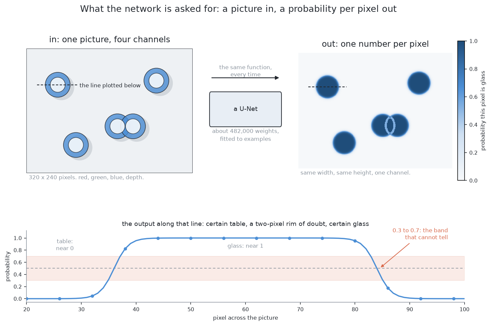
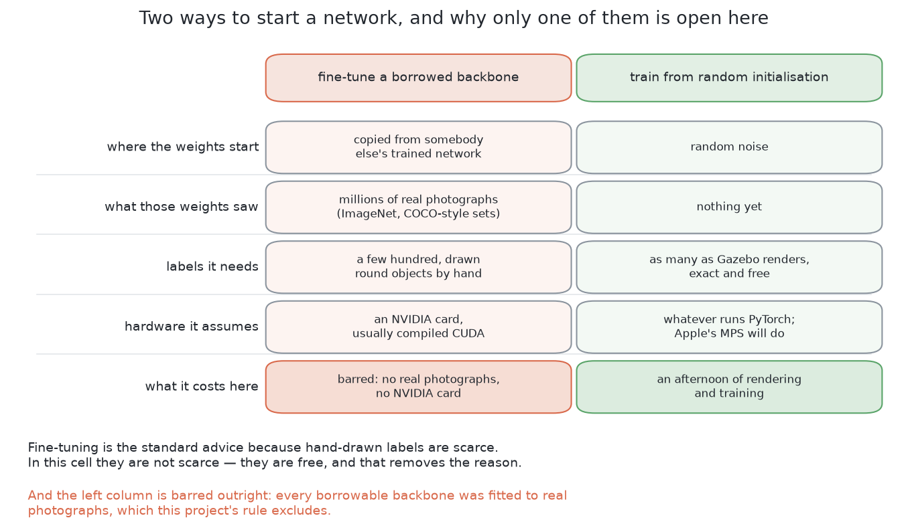
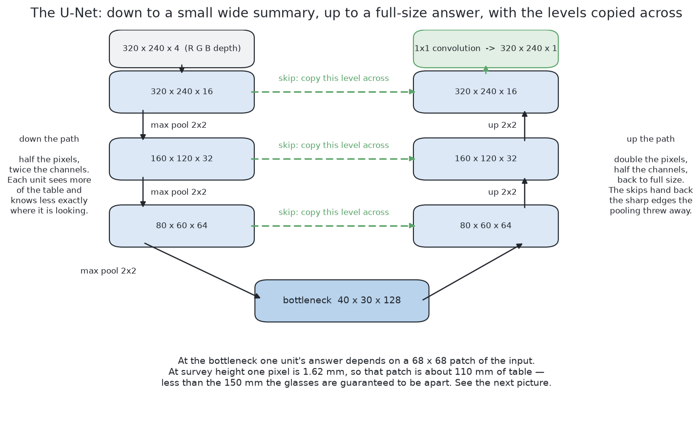
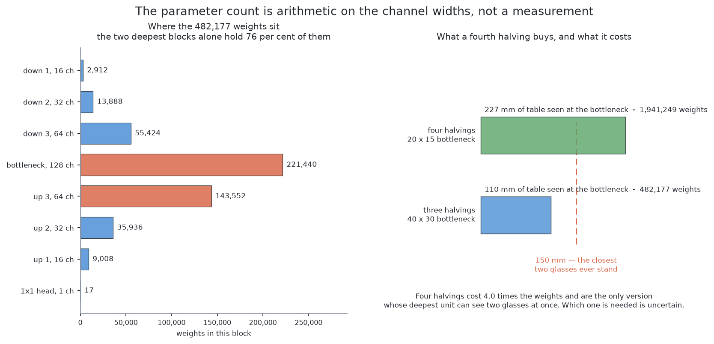
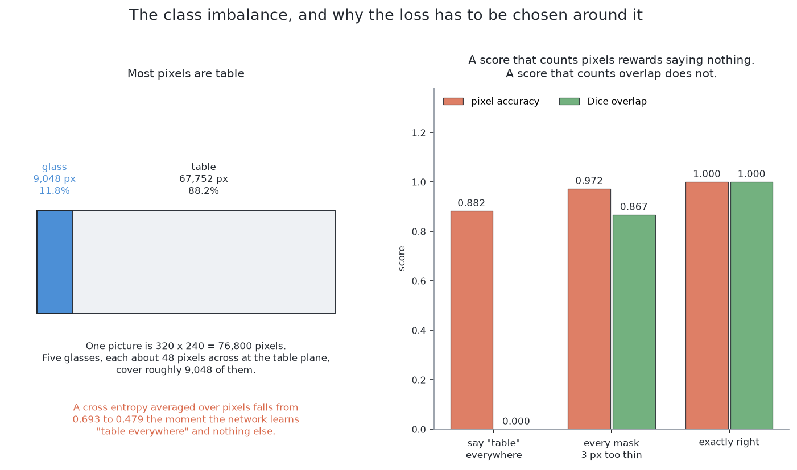
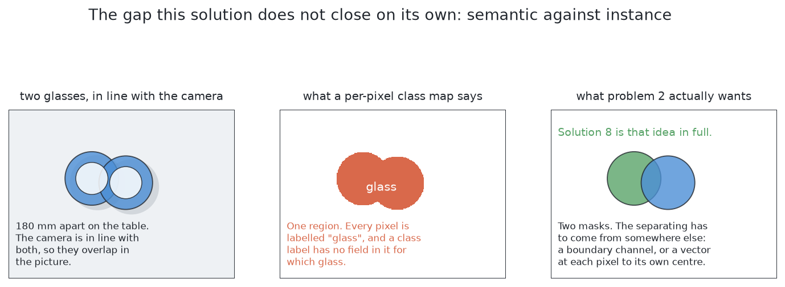
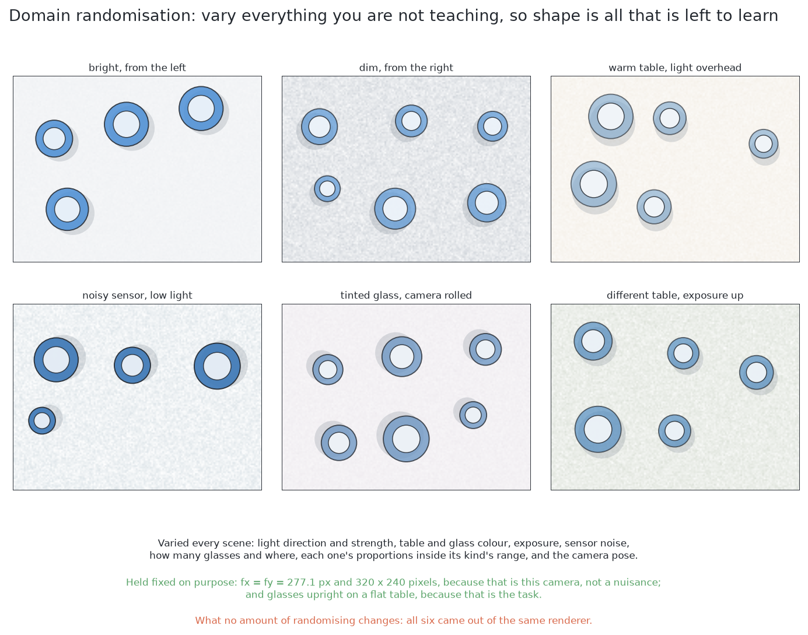
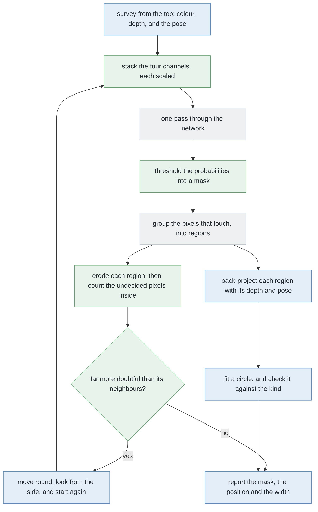
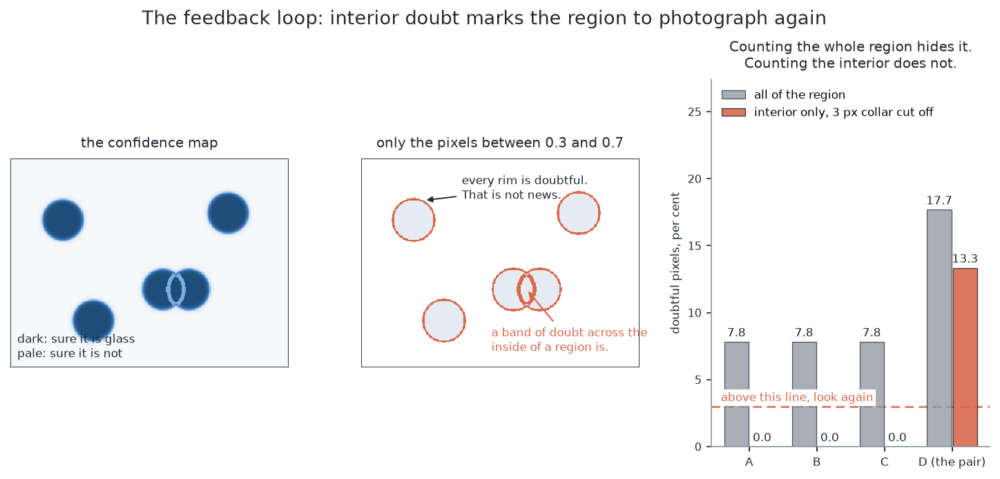

# Solution 7 — a segmenter trained from scratch

*Learned. Train a small network from a random start, on pictures the simulator
renders and labels for nothing, to say at every pixel whether it is glass.*

> **The cell is described once, in [the cell](../../the-cell.md)** — the layout,
> the two places the camera works from, from the top and from the side, all four
> sensors, and the words this project uses them with. What follows is only what
> is specific to this solution.

## Introduction

This document explains how to train a neural network for this cell from a random
start, without borrowing anybody else's weights, and why that is a reasonable
thing to do here when it usually is not. The problem it addresses is that every
programmed method in this project leans on depth readings, and real glassware
returns no depth at all, so it is worth knowing whether a network can find the
glasses from colour instead. By the end you will understand what the network's
shape is and why it has that shape, where its weights actually sit, one
arithmetic check worth doing **before** training rather than after, why the
obvious way of scoring it rewards saying nothing, and the one limitation it
cannot escape however well it is trained.

That last point is worth knowing in advance, because it decides how this
solution is used. **It can say which pixels are glass. It cannot say which
glass.**

## The problem this solves

The problem statement asks for one set of pixels per glass, a position for each,
and an honest list of the pairs that could not be separated. Four to six glasses
stand on the table, all of one kind, that kind known, never closer than the
smallest gap the problem promises between their centres.

The difficulty is that two glasses far apart on the table can still land on top
of each other in a picture, if the camera happens to be in line with both.
Grouping pixels by whether they touch then returns one blob, and one blob means
one glass to everything downstream.

The programmed answers work on the **depth** reading. They lift the pixels into
the room as points and group them where the objects actually are, rather than
where they happen to land in the picture. Those answers work well, they are the
core of this project's approach, and they lean entirely on depth readings
existing and on the table plane being findable.

So this solution asks a different question. **Can a network be taught to label
the glass pixels directly, with no rule about planes or heights written
anywhere?** And can that be done here, on an ordinary machine with no dedicated
graphics card, with no photograph of a real glass anywhere in the project, in
hours rather than days?

## The main idea

The main idea is that **this cell is narrow**, and a narrow problem needs only a
small network.

Consider how little varies here. There is one class to predict, which is glass
or not glass. There is one kind of object at a time, drawn from inside that
kind's plausible range of shapes. There is one camera, with one lens. There is
one lighting setup, inside one simulator. And the objects are always upright and
always solid.

Almost all the variety a general-purpose model is built to absorb simply does
not occur. So the network can be small. And a small network with an endless
supply of exactly labelled pictures is something you can train from nothing in
an afternoon.

Look at the right-hand panel of that picture. It is the same width and height as
the picture on the left, but every pixel holds one number between zero and one,
saying how sure the network is that this particular pixel is glass.

The plot underneath follows the dashed line across one glass. The number sits
near zero over the table, near one over the glass, and it passes through the
middle only in a narrow band at the rim — exactly where a person with a
magnifying glass could not say either. **That narrow band is the network being
honest**, and later in this document it turns out to be the reason doubt has to
be counted inside a region rather than at its edge.

## What a network is, and what training means

Before going further, two words need defining, because everything after this
uses them.

A **neural network** is a program whose behaviour comes from numbers fitted to
examples, rather than from rules anybody wrote. Those numbers are called
**weights**. They start as random noise, and **training** shows the network a
picture, compares what it produced against the answer wanted, and nudges each
weight in the direction that would have helped. Nobody writes the rule the
network ends up applying, and nobody can read that rule back out afterwards.

**Fine-tuning** means not starting from random numbers. You take a network
somebody else trained on a large collection of labelled photographs, throw away
its last layer, attach your own, and carry on training. This is the standard
advice everywhere, and the reason is that **labelled real pictures are scarce**,
because somebody has to draw round every object in every picture, and a borrowed
network cuts the number of labels you need by a large factor.

## Why train from scratch rather than borrow

Two things make the usual argument for fine-tuning collapse in this cell, and it
is worth being clear that only one of them is about this project's rules.

The first is that **every network worth borrowing was fitted to real
photographs.** The large collections of labelled images that such networks are
trained on are photographs, and so is everything trained on them, including the
large general-purpose segmentation models. This project's rule is that
everything a solution needs must be producible by the simulator on this machine,
and a file of weights fitted to photographs of the real world is not. That is
not a judgement about whether those models are good. They are excluded by
**where their numbers came from**, and the versions of this project that do
allow them are written up in
[`learned-with-hardware.md`](learned-with-hardware.md).

The second reason is the one that actually matters, because it would apply even
without the rule. **The scarcity that fine-tuning exists to solve is not present
here.** Asking the simulator for a render and its per-object mask costs the same
as asking for the render alone. There is no annotator, so there is no
annotator's budget and no annotator's mistakes. Labels here are free.

There is also a third, smaller reason: most ready-made networks expect a
dedicated graphics card, and this machine has none. That alone would decide
nothing, because plenty of them run without one, but it removes the last
practical argument for borrowing.

So the answer is a random start — and it is reasonable **only because of the
second reason**. Training from scratch on a few hundred hand-drawn labels would
be a bad idea. Training from scratch on an endless supply of exact ones is not.

## The shape of the network

The shape used here is called a **U-Net**, and the picture explains the name:
follow the left column down, then the right column up, and the dashed lines
across the middle are the part that makes it a U.

### The down path

Start with the picture, four channels deep: red, green, blue and depth.

Apply two **convolutions**. A convolution takes a small square window, slides it
over the picture, and at each position multiplies the values inside the window
by a fixed set of weights and adds them up. One set of weights produces one
output channel, and many sets produce many channels.

Then **halve it**. A max pool keeps the largest value out of each little block
of pixels, so the picture comes out half as wide and half as tall. Then two more
convolutions, with the channel count doubled. Halve again and double again.
Halve once more. That last, smallest, widest layer is called the **bottleneck**.

Two things happen on the way down, and they pull against each other. Each
halving throws away exactly *where* something is, because one unit now stands
for a whole patch of the original picture. But each halving also means the next
window covers four times as much of the original picture as it did before. So
deeper units know less and less precisely where they are looking, and more and
more about what is around them.

**That trade is the entire reason for going down**, and the section after next
is what happens if you do not check it.

### The up path

A **transposed convolution** does the reverse of a pool: it doubles the width
and height back up while narrowing the channels. Two more convolutions, double
again, and again, until the block of numbers is back to the size of the original
picture. A final convolution with a window of exactly one pixel — so no mixing
across space at all, just a weighted sum of the channels — collapses it to a
single channel. Then a function that squashes any number into the range zero to
one turns that into a probability.

### The skip connections, which are the point of the shape

Here is the problem the up path alone cannot solve. The bottleneck knows there
is a glass roughly over *there*, but the halvings have destroyed which exact
pixel its rim sits on. Doubling the size back up cannot invent that detail,
because the detail was thrown away.

So do not throw it away. Before each halving, keep a copy of the block of
numbers, and on the way back up **attach the copy on** as extra channels. The
fine detail comes across on the copy, the sense of context comes up from below,
and the convolution after the join mixes the two. Those copies are the dashed
lines in the picture, and they are what the U refers to.

The design is Ronneberger, Fischer and Brox, 2015
([arXiv:1505.04597](https://arxiv.org/abs/1505.04597)), and it was written for
microscope images, where exactly the same problem arises: label every pixel,
with very few examples.

## Where the weights sit

One fact about convolutions decides the shape of the whole weight budget, and it
is worth understanding rather than looking up.

A convolution holds one weight per window position, per input channel, per
output channel. So **the weight count of a block grows with the product of its
two channel counts.**

Follow what that implies. Going one level deeper doubles the input channels
*and* doubles the output channels, so it roughly quadruples the weights in that
block. Meanwhile that block is working on a picture a quarter of the size, so it
costs no more arithmetic than before.

The result is that **the deep, narrow layers hold nearly all the weights.** The
bottleneck and the block just after it hold roughly three quarters of the total
between them, while the first block, the one working on the full-size picture,
holds almost none. Widening the deepest level is expensive, and widening the
first is nearly free. So anyone tuning this network should spend their attention
at the bottom rather than the top.

And the whole thing is small. The total comes to a few hundred thousand weights,
which is a couple of megabytes stored, or under half that at reduced precision.
This is a file you can commit to the repository, version alongside the code, and
regenerate without thinking about it — which is exactly not true of the large
pre-trained models this solution deliberately does not use.

## The receptive field, and the warning it gives

There is one thing worth working out **before** trusting this design, and it
follows directly from the trade described in the down path. It is called the
**receptive field**, and it is how much of the original picture one unit at the
bottleneck actually depends on.

It is easy to compute. Each convolution extends the field by one pixel on each
side, *at whatever scale it is currently working at*, and each pool doubles that
scale. So the field grows slowly at first and then in bigger and bigger jumps,
and by the time you reach the bottleneck it covers a square patch of the
original picture some tens of pixels across.

Now turn that patch into a distance on the table, using how much table one pixel
covers from the height the camera flies at. Here is the warning:

> **That patch of table is smaller than the smallest gap the cell guarantees
> between two glasses.**

Read that again, because it is the kind of thing that becomes invisible once
training has started. The deepest layer — the one layer with enough context to
reason about a neighbour at all — **cannot see two glasses at the same time**.
It is structurally incapable of the comparison you might have hoped it was
making.

Adding a fourth halving fixes it. The bottleneck then works at half the scale
again, and its receptive field covers a patch of table comfortably wider than
the guaranteed gap. It costs about four times as many weights, for the reason
given in the previous section.

Whether the extra level is actually needed is **not known**, and this document
is not going to pretend otherwise. Two things could rescue the shallower design.
The decoder's own convolutions widen the field further on the way back up. And
the evidence that separates two overlapping outlines may turn out to be entirely
local to the seam where they meet, in which case no unit ever needs to see both
glasses at once.

It is flagged here for one reason: **it is far cheaper to check this with
arithmetic before training than to diagnose it afterwards**, when all you have
is a network that quietly never separates anything.

## The loss, and why most pixels being table matters

Training needs a **loss**, which is one number saying how wrong an answer was,
and which the nudging then tries to reduce.

The obvious loss is called **binary cross entropy**. For a pixel that really is
glass, the penalty is smaller the higher the probability the network gave it, so
being sure and right costs almost nothing while being sure and wrong costs a
great deal. For a table pixel it is the same with the probability flipped. Then
you average over every pixel in the picture.

**That average is the trouble**, and the trouble comes straight out of this
cell's geometry. Seen from the top, a glass takes up a small patch of a large
picture, and there are only a handful of glasses. Count the pixels and the great
majority of every picture is bare table. Glass is the rare class by a wide
margin.

So a network can lower the average a long way without learning anything at all.
Imagine it starts by saying "maybe" to every pixel. Now let it learn exactly one
thing: *say "not glass" everywhere*. The table pixels, which are the great
majority, now cost almost nothing each. The glass pixels cost a great deal each,
but there are few of them. Work the weighted average through and **it has fallen
substantially**. The network has been rewarded for producing an empty picture,
and this is at its worst early in training, when there is nothing better on
offer and this is the easiest improvement available.

Two standard fixes exist, and this design uses both.

The first is to **weight the rare class up**. Multiply every glass pixel's
contribution by the ratio of the two class sizes, so that the glass pixels and
the table pixels contribute equally to the total. Now "say nothing is glass" is
no longer an improvement at all.

The second is to **add a loss that measures overlap rather than counting
pixels**. The **Dice coefficient** is twice the number of pixels that both the
answer and the truth call glass, divided by the total number either of them
calls glass. It is one for a perfect match, zero when they share nothing, and it
has no term for the table at all. Using one minus Dice alongside the weighted
cross entropy is the usual recipe, from Milletari and colleagues, 2016
([arXiv:1606.04797](https://arxiv.org/abs/1606.04797)).

The right-hand panel of that picture shows why the second fix is needed, by
scoring three answers two ways.

| the answer | pixel accuracy | Dice |
| --- | --- | --- |
| say "table" everywhere | **high** | **zero** |
| every mask a few pixels too thin | **higher still** | noticeably below perfect |
| exactly right | perfect | perfect |

Pixel accuracy gives a **useless** answer a high score, and a **visibly wrong**
one an even higher score, because what it is mostly reporting is how many table
pixels were correctly called table, and that is the easy part. Dice gives the
useless answer zero, because the two masks share nothing, and it notices the
thin masks, because they share less than they should.

The lesson generalises far beyond this page: **a score that rewards saying
nothing will be optimised by a network that says nothing.**

## The depth channel, and what it does not buy for free

Depth is one of the four input channels, and that needs stating plainly, because
it means this solution does **not** get "works without depth" for free.

A network handed depth will lean on it, because depth is by far the easiest
signal in the picture, and the colour path will then never develop at all.

The property is worth wanting. If the glasses ever become real glass, the depth
camera stops returning anything useful through them, and every method that
groups points in the room loses its input at once. A colour-only method survives
that day.

It is earned rather than given, by a trick called **modality dropout**: on some
of the training pictures, the depth channel is replaced with nothing. After that
the same weights run on colour alone, **less accurately** — the depth channel
was carrying real information, and dropping it costs something — but they run.
What share of pictures should have their depth removed is a choice rather than a
measurement, and what is right here is not known.

One further detail matters for the same reason. The depth channel is scaled into
the same range as the colour channels, and it is deliberately **not** converted
into a height above the table. Converting it would hand the network the very
clue the clustering solutions use, and it would make the colour-only claim
hollow.

## Which pixels are glass, but not which glass

This is the limitation named in the introduction, and it is structural rather
than a matter of training harder.

The middle panel of that picture is the point: one region, every pixel correctly
labelled "glass", and no way whatever to ask it *which* glass.

A per-pixel class map is called **semantic** segmentation. This problem asks for
**instance** segmentation, which means one mask per object. So on its own this
solution does not answer the problem, and the separating has to be added
somewhere.

There are two cheap places to add it. One is a second output channel predicting
each object's **boundary**, so that regions can be cut along the predicted seam.
The other is a pair of channels predicting, at every glass pixel, the **offset
to the centre of its own object**.

Offsets fail more gently, and the reason is worth remembering as a general
principle. A seam has to be predicted correctly along its whole length, and one
missing pixel rejoins two objects completely. Offsets are one vote per pixel, so
a few wrong votes are simply outvoted by the many right ones. [Solution
8](08-per-pixel-votes-for-the-centre.md) is that idea in full.

## Domain randomisation

Those are six renders of the same arrangement. Look at what changes between
them, and then at the two lines underneath saying what is deliberately held
still.

Here is the failure this prevents. The simulator will render this table, under
this light, with this shade of grey, for ever, in exactly the same way. If every
training picture has the table at the same shade, then the network is free to
learn "glass means the pixels that are not that shade of grey". That rule scores
perfectly on every training picture *and* on every held-out one, because the
held-out pictures came out of the same renderer. Then somebody changes the world
file, or adds a light, and the model falls over for a reason that appears in
none of the numbers.

**Domain randomisation** is the fix, and it is blunt: vary everything you are
not trying to teach, scene by scene, over a range wider than anything you expect
to meet. The network then cannot use any of the varied things as a shortcut,
because none of them is reliable. What is left constant is the shape and
position of the objects, so that is what it has to learn. The idea is from Tobin
and colleagues, 2017 ([arXiv:1703.06907](https://arxiv.org/abs/1703.06907)).

It matters **even though this cell only ever runs in one simulator**, because
the world file will change during the project's life. A model that has quietly
keyed on a texture breaks silently the day somebody changes that texture, and
randomising is how you find that out during training instead of afterwards.

What would be varied, scene by scene, is the light, meaning its direction,
intensity, colour and how many sources there are; the table, meaning its colour
and texture; the glasses, meaning their tint, their shininess, and each one's
proportions drawn independently from its kind's plausible range; the camera
pose, jittered slightly around the nominal place it looks down from, because the
arm's own positioning is not exact; the exposure and the sensor noise; and the
arrangement itself, with four to six glasses placed anywhere in the zone.

One thing is worth randomising **past** the specification, which is the minimum
separation between glasses. The cell guarantees a certain gap, but training with
pairs standing much closer than that makes the guaranteed gap an *ordinary* case
in the middle of the range, rather than the very hardest thing the network ever
saw. As a general rule: **the edge of the specification should sit somewhere in
the middle of the training set**, so that the model has seen worse than it will
ever meet.

One thing would **not** be varied, which is the camera's lens. The focal length
and the picture size are facts about the camera this cell has, and not nuisances
to be made robust against. Teaching the network to cope with lenses it will
never meet spends its limited capacity on nothing. The same goes for the glasses
standing upright on a flat table, because that is the task rather than an
accident of the data.

## How the concepts fit together

Put in order, the network sits in the middle of a short chain, and everything on
either side of it is ordinary arithmetic the project already has.

Green marks what this solution adds, blue marks work the project already does,
and grey marks a library step and the network itself.

Note where the colours fall, because it is the honest summary of how much work
this is. The only new code in the running path is arithmetic on arrays: stack,
threshold, erode, compare. The network itself is a library call, and everything
that turns pixels into distances on the table is already written.

Note also what the network does **not** produce. No position on the table comes
out of it. The arm's numbers still come from the depth readings under the pixels
the network labelled, and the circle fitted to those points is still what
decides whether the region is a plausible glass.

## The feedback loop, and where doubt has to be counted

A per-pixel model has a measure of doubt built into its output, which most
methods do not. It does not return a mask. It returns a **confidence map**, with
a probability at every pixel.

Thresholding that map gives a mask and throws the doubt away. Keeping the map
gives the loop something to run on. Call a pixel **doubtful** when its
probability is neither clearly glass nor clearly not, because the network
genuinely cannot say.

Two things can then be read off: **how much** doubt surrounds a region, and
**where** that doubt sits.

The "how much" needs care, because the obvious way of measuring it does not
work, and this is the most useful practical idea in this document.

**The rim has to be removed before anything is counted.** Every region has a
doubtful rim a couple of pixels wide, because at the edge of any object some
pixel really *is* half glass and half table. That is the correct answer rather
than a failure. But it is not small either: for a glass-shaped region, a rim
that thin is already a noticeable fraction of the whole region before anything
has gone wrong at all.

Worse, that fraction depends on the region's **shape** rather than on its
trouble. A long thin region has more perimeter for each unit of area than a fat
one, so it looks more doubtful simply for being thin. Counting doubtful pixels
over a whole region therefore mostly measures perimeter against area, which
tells you nothing about whether the answer is right.

So **erode the region first**, which means shaving a thin collar off its
outside, and count only what is left. A glass the network is sure about then has
essentially nothing uncertain inside it. And doubt in a band across a region's
**middle** is the signature of a second glass behind it — which, after the
erosion, is the only thing left there.

That gives the loop both of the things it needs. A region far more doubtful than
its neighbours is one to photograph again, and the band of doubt gives the
direction to look from, because the band marks where one object's edge crosses
another, so the two objects are stacked across it.

The loop needs a third thing, which is a budget. Moving the arm and letting it
settle costs seconds, while a picture costs milliseconds and one pass of a
network this small costs tens of milliseconds at most. **The expensive thing is
the movement**, by a factor of thousands. So the loop caps the extra looks per
doubtful region, and when the budget is spent it reports the region as doubtful
rather than guessing.

## A worked example

Take the merge this problem exists to prevent, and follow it through.

The camera works from the top. Two glasses stand a comfortable distance apart on
the table, but the line joining them points almost straight away from the
camera.

That last sentence is the whole example. Their separation is a real distance in
the room, but the camera can only record the part of it that runs **across** the
view, while the part running **along** the line of sight is flattened away
entirely. And here, almost all of the separation is along the line of sight. So
two glasses that a ruler would call well apart land with their centres only a
few pixels apart in the picture.

Two round shapes wider than the gap between their centres **overlap**. So what
comes back is one blob, wider than either glass and narrower than the two of
them laid side by side.

**What the network returns** is one region, with the probability near one across
the whole of it — because every one of those pixels genuinely *is* glass.

**The network is not wrong.** It answered exactly the question it was asked, and
that question has no place in it for "two". Asking "is this pixel glass?" of
every pixel separately can never produce the answer "these pixels are two
objects". That is the honest limitation of this whole solution, and no amount of
extra training changes it.

What the arithmetic downstream *can* notice is that the blob is wider than any
single glass of this kind could possibly be. Noticing is not separating, but it
is enough to raise a doubt and ask for another picture.

**What the second look does.** Move the camera round so that it looks **across**
the line joining the two glasses rather than along it, from the side at the
measuring standoff.

Now the separation that was hidden along the line of sight is the part running
across the view, and it is the near-invisible part that has been flattened away
instead. So the two glasses land well apart in the picture, far enough apart
that there is clear table between their outlines. They come back as two regions,
each confident right up to its own rim, and the merge is gone.

Standing closer also means each pixel covers less, so each glass fills more of
the frame. But that is a side benefit and not the reason it worked. **What fixed
it was the change of direction.**

## What it needs

**Data.** The training set is generated rather than collected. A script spawns a
random scene according to the randomisation list above, renders it from the top,
and writes the picture out together with the per-object mask the simulator
already holds. It takes two pictures per station, a slide apart, matching
exactly what the arm will really take.

How many scenes are enough is **not known**, and the way to find out is a curve
rather than an argument. Train on a quarter of the data, then half, then all of
it, and see whether the held-out Dice is still improving when you run out. If it
is, generate more. If it flattened long ago, you generated too much.

**The training recipe.** A standard optimiser, small batches, and normalisation
after every convolution. The loss is the weighted cross entropy plus one minus
Dice, as described above. Stop when the held-out loss stops falling.

**The machine.** Everything here runs on the machine the project already uses,
with no dedicated graphics card and nothing requiring one. Two practical notes
are worth knowing in advance. Some operations are not available on the machine's
own graphics path and quietly fall back to the processor, and a fallback inside
the innermost loop can cost more than the graphics path saves. And that path
shares the machine's memory rather than having its own, so there is no separate
card memory to run out of.

**The time budget, honestly.** The *arithmetic* per picture can be computed
exactly, by adding up the multiplications over every convolution at its own
size, which is the same kind of sum as the weight count. A backward pass costs
roughly twice a forward one. So the total arithmetic for a full training run is
known before anything is run.

What is **not** known is the rate at which this machine actually performs it,
because that depends on which operations fall back, on whether the data loader
keeps up, and on the machine itself. This document does not guess at it. The
honest recipe is: **time one pass over the data, multiply by the number of
passes, and decide then.** "An afternoon" is plausible on the arithmetic, and it
is not a measurement. Rendering time sits in exactly the same position: time a
handful of scenes and multiply.

**Artefacts to keep.** One weights file, a couple of megabytes, version pinned
and regenerable from the spawner's own random seed.

## Where it is strong and where it breaks

The strengths come from what this solution does not need to be told.

**No rule is written down** anywhere in it: no plane tolerance, no height
threshold, and no assumption that the table is level. **It reports its own
doubt**, as one probability per pixel, which is exactly what the solution that
moves the camera needs. It is **cheap to retrain**, being a few hundred thousand
weights and a couple of megabytes, with no graphics card and nothing downloaded.
And **colour alone can be made to survive real glass**, though only with
modality dropout trained in, and then less accurately.

The weaknesses divide into what it cannot do, what it cannot see, and what it
cannot survive.

What it cannot do is the structural limitation. **It says which pixels are
glass, and not which glass**, giving one region per clump, so on its own it does
not answer this problem. And **nothing in real distances comes out of it**,
because the arm's numbers still come from the depth under those pixels.

There is a second structural limitation, and it is worse, because no change to
the output would fix it. Since one kind now spans a shot glass to a large
tapered glass, a tall glass's outline can cover a short one completely from
above — and then the short glass contributes **no pixels at all**. A network
that labels pixels has nothing to label. It is not that it would label them
wrongly; there is nothing there to be right or wrong about. So this solution is
blind to the failure the problem says to watch hardest, and the only thing that
is not blind to it is the geometric argument in [solution
2](02-cluster-on-the-table.md) about where a glass could have been hiding.

What it cannot see is the failure the problem singles out. **Confident and
wrong** is exactly the merged case, and the loop cannot catch it, because a mask
over two glasses has low doubt everywhere. Only the arithmetic downstream guards
against it, by refusing a footprint wider than any glass of that kind can be. It
also **fails silently** on a glass lying down, a new light or a changed texture:
the held-out Dice drops if anybody runs it, but no number the run prints says
why.

What it cannot survive is the move out of simulation. **It learns the
simulator**, which is accepted while this cell only runs there, and not on the
day a real arm is involved. And **it holds a size prior nobody can read**,
learned from one kind's range — not a constant in a file, but a fact about glass
sizes that the project ships, which the report ought to say out loud.

Finally, two conditions have to hold for this to be worth building at all:
labels must be free, and the problem must be narrow. Without both of those, and
on any day depth readings work, [cluster on the
table](02-cluster-on-the-table.md) wins.

## The general ideas behind this

This is mainstream deep segmentation, shrunk. Every component is standard and
most of them are ten years old. What is unusual here is only the decision to
train from a random start on synthetic data rather than fine-tune something
large.

### Semantic segmentation — a class label at every pixel

Rather than a box round an object, produce a label for each pixel. The idea
became practical with **fully convolutional networks** (Long, Shelhamer and
Darrell, [arXiv:1411.4038](https://arxiv.org/abs/1411.4038)), which replaced a
classifier's final layers with convolutions so that a picture of any size maps
to a label map of the same size.

It is used for medical imaging, satellite and aerial pictures, driving scenes
and industrial inspection — anywhere the *extent* of a thing matters more than a
box round it. It is rarely right for counting or separating individuals, because
a class label has nowhere to record *which* object a pixel belongs to, so two
touching things of the same class come back as one region. That is the
limitation this solution runs into and that [solution
8](08-per-pixel-votes-for-the-centre.md) removes.

For more, see [image
segmentation](https://en.wikipedia.org/wiki/Image_segmentation).

### The encoder–decoder with skip connections

Halve the resolution repeatedly while widening the channels, then double it back
up, and copy each level on the way down across to the matching level on the way
up, so that detail lost going down is available coming back. That is the
**U-Net** (Ronneberger, Fischer and Brox,
[arXiv:1505.04597](https://arxiv.org/abs/1505.04597)), designed for biomedical
images with very few training examples — which is exactly why it suits a small
synthetic dataset.

It is used for labelling every pixel when data is limited, such as cell and
organ segmentation, defect detection and depth estimation, and it remains the
default architecture for a small segmentation problem. It is rarely right for
problems needing broad understanding of a scene or many classes, where a large
pretrained network earns its size, because a small network knows only what its
receptive field and its training set contained.

### Overlap losses — scoring the shape rather than the pixel count

Cross-entropy averages over pixels, so on a picture that is mostly background a
model can score well by predicting background everywhere. **Dice** and
**intersection over union** losses score the overlap between the predicted and
the true regions instead, and they are usually added to cross-entropy rather
than used in place of it (Milletari and colleagues,
[arXiv:1606.04797](https://arxiv.org/abs/1606.04797)).

They are used wherever one class is far rarer than the other, which covers most
medical and industrial segmentation. They are rarely enough on their own,
because an overlap score says nothing about how confident the individual pixels
were, which is exactly the information the feedback loop in this document runs
on.

### Domain randomisation — training on variation instead of realism

Vary everything you are not trying to teach, over a range wider than reality, so
that the model cannot key on any of it (Tobin and colleagues,
[arXiv:1703.06907](https://arxiv.org/abs/1703.06907)).

It is used wherever training data comes from a simulator and has to work
somewhere else, which is most of robotics. It is rarely sufficient on its own
for fine visual judgements, because randomising appearance makes a model ignore
appearance, and sometimes appearance is the signal.

### Training from scratch against fine-tuning a large model

The last idea is the choice this whole document turns on. Fine-tuning wins
whenever labels are scarce, which is almost always. Training from scratch wins
in the narrow case where labels are free, the problem is small, and the borrowed
weights would bring knowledge of a world you do not have. This cell is that
narrow case, and it is worth noticing how rare that is rather than generalising
from it.

## Where it sits among the other solutions

This solution is best read as the **first half** of a learned answer rather than
a complete one. It produces a good class map and reports honest doubt, and then
stops exactly where the problem starts asking which glass is which.

[Solution 8](08-per-pixel-votes-for-the-centre.md) is the second half. It keeps
this network's shape and its training recipe almost unchanged, and replaces the
single output channel with a pair that vote for each object's centre — which is
the cheapest way to turn a class map into one mask per object.

And on any day the depth readings work, [cluster on the
table](02-cluster-on-the-table.md) answers the whole problem with no weights
file at all. So the honest place for this solution is as preparation for the day
depth stops working, and as the groundwork for solution 8.
