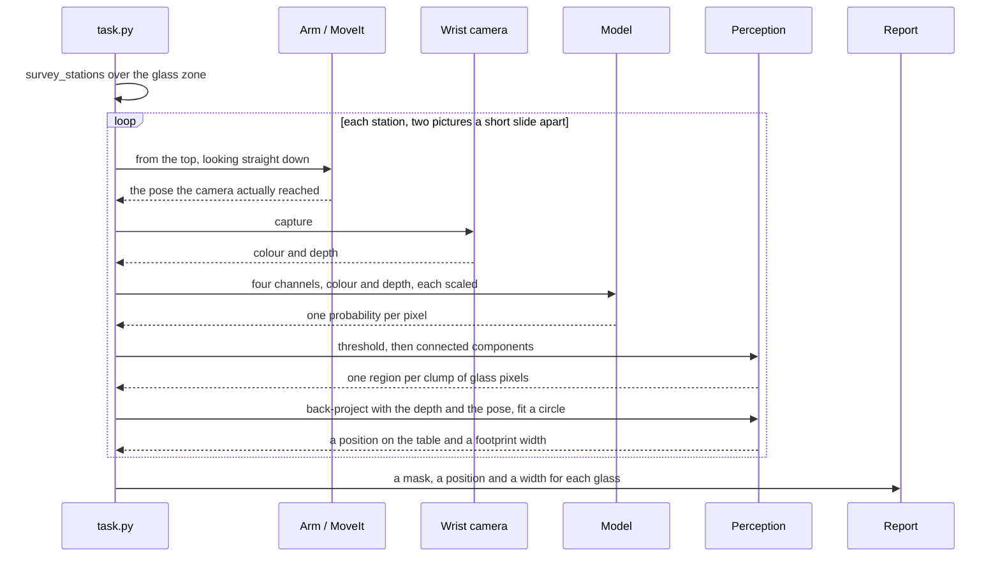
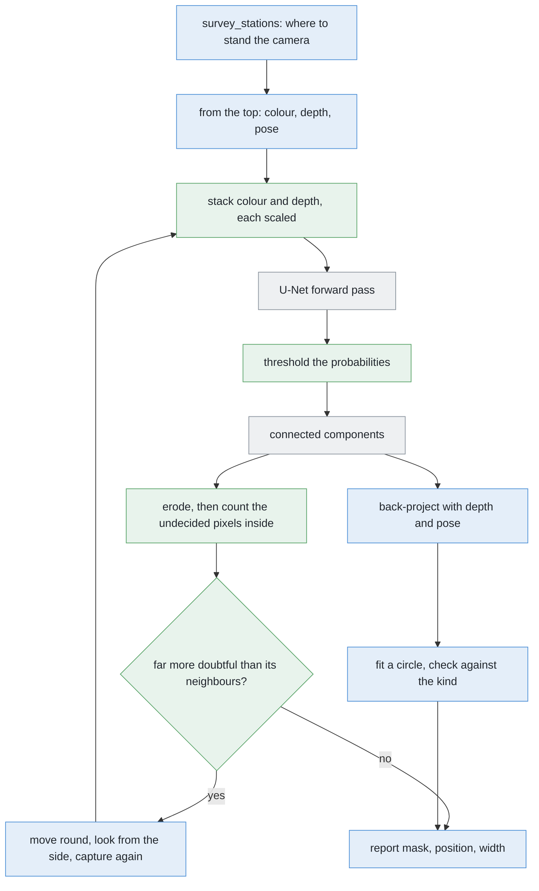

# Solution 7 — a segmenter trained from scratch

*Learned, as the decider, and trained from a random start on renders alone. One
class, one kind of object, one camera — a network that only has to work in this
cell can be small enough to train in an afternoon.*

> **The cell is described once, in [the cell](../../the-cell.md)** — the layout,
> the two places the camera works from, from the top and from the side, all four
> sensors, and the words this project uses them with. What follows is only what
> is specific to this solution.

## In one paragraph

This cell does not need a general-purpose model. It has one class of object, one
kind of glass at a time, one camera, one lighting setup, and small pictures. A
small network — a U-Net, whose size follows from arithmetic on its channel
widths rather than from any measurement — can be trained from a random start on
Gazebo renders alone, because the simulator labels every picture exactly and for
nothing. It returns a probability at every pixel, and the pixels it is unsure
about are a reason to go and take another picture. It tells you *which pixels
are glass*, but not *which glass*, and it learns Gazebo rather than the world.

## The problem this solves

[`problem.md`](../problem.md) sets the job. Four to six glasses stand on a
table, all of one kind, the kind known, never closer to each other than the
smallest gap problem 2 promises. The arm photographs them from a wrist camera
and has to say **which pixels belong to which glass**, give each glass a place
on the table and a rough footprint width, and name honestly any pair it could
not tell apart.

The difficulty is that two glasses far apart on the table can still land on top
of each other in a picture, if the camera happens to be in line with both.
Grouping pixels by whether they touch — a flood fill — then returns one blob,
and one blob means one glass to everything downstream.

The programmed answers work on the depth reading. They lift the points into the
room and group them where they actually are, rather than where they happen to
land in the picture. They work well, they are the core of this project's answer,
and they lean entirely on depth, and on the table plane being findable.

This solution asks a different question. **Can a network be taught to label the
glass pixels directly, with no rule about planes or heights written anywhere?**
And can that be done here, on an Apple Silicon Mac with no NVIDIA graphics card,
with no photograph of a real glass anywhere in the project, in hours rather than
days?

## How it works, end to end

### The setup

The table top's height is a constant and everything in the cell is measured up
from it. The glasses stand in the glass zone (`GLASS_ZONE`), a rectangle of
table a little wider than it is deep, four to six of them, upright and solid.
The camera is on the wrist, a little to one side of the tool axis, so moving the
camera means moving the whole arm — and the arm's own reach decides where a
picture can be taken from at all.

Known before the run starts: the table height, the camera's lens, the kind of
glass and its grip rule, and the guarantee that no two glasses are closer than
problem 2's smallest gap. Not known: how many glasses there are, where they
stand, or how big they are. This project never writes a glass's size down.

What this solution adds to the cell is **one file**: the trained weights, a
couple of megabytes of them, produced before the run and shipped alongside the
code.

### The pictures

Two kinds of picture, both from the same wrist camera.

**The survey, taken from the top.** `survey_stations()` in `arm/dimensions.py`
spreads stations over the glass zone, as few as will cover it, each picture
overlapping its neighbour enough that no glass lands only on an edge. At each
station the arm lifts the camera to the survey height (`SURVEY_HEIGHT`), points
it straight down, and takes **two pictures a short slide apart**
(`SURVEY_BASELINE`).

Two rather than one, because a single picture from the top cannot say how far
away a glass is, only which direction it lies in. How far the glass appears to
shift between the pair is what fixes how tall it is, and therefore where it
really stands. Up at that height one pixel covers a millimetre or two of table,
and one picture covers more table than the whole glass zone.

**The second look, taken from the side.** When a region comes back doubtful, the
arm moves round and photographs it from the side, at the measuring standoff,
looking **across** the line joining the suspected pair rather than along it.
Standing closer, a pixel covers rather less.

Round, not closer. **The problem is the direction the camera is looking from,
not the resolution.** Doubling the pixels would not separate two things one of
which is behind the other; stepping to the side would.

### What each picture captures

The wrist camera is an RGB-D sensor. One capture returns:

- **a colour picture**, small, three channels;
- **a depth picture** the same size, with a near limit and a far limit beyond
  which it returns nothing;
- **the camera's pose as reached**, not as commanded. The camera sits off the
  wrist axis, and the two survey pictures *measure a distance between two
  poses*, so an error here does not average out — it would go straight into
  every position the cell reports.

It does **not** return a mask. Nothing in the sensor knows which pixels are
glass. That is the whole job.

One more thing is captured, but only during training and never during a run:
Gazebo also hands over the per-object mask it drew, because the simulator knows
which pixels are which object. It drew them. That is the reason this solution
exists.

### What is interpreted, and how

The chain from raw pixels to the answer, in order:

1. **Stack the input.** The three colour channels and the depth channel, each
   scaled into the same range, stacked into four channels the size of the
   picture. Depth is *scaled*, not converted into a height above the table —
   handing over a height would be handing the network the very clue the
   clustering solutions use, and the point of this solution is to find out
   whether it can manage without it.
2. **One forward pass** through the U-Net — that is, run the picture through the
   network once. Out comes one probability per pixel, same width, same height.
3. **Threshold** the probabilities to get a black-and-white mask.
4. **Connected components** on that mask: one region per clump of glass pixels.
5. **Erode each region** — shave a thin collar off its outside — then count the
   pixels inside what is left whose probability is neither clearly glass nor
   clearly not. That count is the doubt statistic, and the eroding is what makes
   it mean anything, because the *edge* of any region is always uncertain and
   would swamp everything else. See the feedback loop below.
6. **Back-project** each region's pixels through the depth reading and the
   recorded pose into points in the room, in millimetres from the arm's base.
7. **Fit a circle** to the footprint and check its diameter against the kind's
   accepted range.
8. **Decide.** A region far more doubtful than its neighbours, or one whose
   diameter the kind rejects, is queued for a second look. The rest are matched
   across the two survey pictures by `where_they_stand()`.

Steps 3 to 8 are ordinary arithmetic. Only step 2 is learned.

### What comes out


Look at the right-hand panel. It is the same width and height as the picture on
the left, but every pixel holds one number between zero and one: how sure the
network is that this particular pixel is glass.

The plot underneath follows the dashed line across one glass. The number sits
near zero over the table, near one over the glass, and it passes through the
middle only in a narrow band a couple of pixels wide at the rim — exactly where
a person with a magnifying glass could not say either. That narrow band is the
network being honest, and it is why the *inside* of a region, not its edge, is
where doubt is worth counting.

Per glass, the run reports a **mask**, a **position in millimetres** from the
arm's base, and a **rough footprint width in millimetres**. Alongside those it
keeps the probability map itself, which is what the loop reads, and a list of
regions it is **reporting as doubtful rather than guessing at**.

`task.py` receives all of it and decides what happens next. `report.py` writes
it down. The doubtful pairs are the handover to [problem
3](../../problem-3/problem.md), which is allowed to move a glass and this
problem is not.

## The sequence

The normal path: one survey station, two pictures, one answer per glass.



The interesting path: the region the network is unsure about, and what happens
when the budget for extra looks runs out.

```mermaid
sequenceDiagram
    participant T as task.py
    participant A as Arm / MoveIt
    participant C as Wrist camera
    participant M as Model
    participant P as Perception
    participant R as Report
    T->>M: the survey picture, four channels
    M-->>T: the probability map
    T->>P: erode each region, then count the undecided pixels inside
    P-->>T: one region is full of them; its neighbours have none at all
    Note over P: the band runs across the inside, so two glasses are stacked along the line of sight
    alt a budget of extra looks per region
        T->>A: move round and look across that line, from the side
        A-->>T: at the new pose
        T->>C: capture
        C-->>T: colour and depth, from much closer in
        T->>M: the new picture
        M-->>T: two regions, each confident to its rim
        T->>R: two glasses, separated
    else the budget is spent
        T->>R: this region is doubtful, and here is why
        Note over R: a pair that cannot be separated is a result, not a failure
    end
```

## In pseudocode

The pipeline, coloured by who owns each step.



**Legend.** Green is new code written for this solution; blue is code this
project already has; grey is a third-party library.

Note where the colours fall. The only green in the run-time path is arithmetic
on arrays — stack, threshold, erode, compare. The network itself is a library
call, and everything that turns pixels into millimetres is already written.

```text
# once, before the run
for scene in randomised_scenes(MANY):                    # NEW    · work_cell.glasses.spawn
    rgb, depth, truth = gazebo.render(scene)             # gazebo · the label costs nothing
    if coin_flip():                                      # NEW    · modality dropout
        depth = zeros_like(depth)                        # NEW    · numpy
    x = stack(scaled(rgb), scaled(depth))                # NEW    · numpy
    p = unet(x)                                          # torch  · the trained weights
    loss = weighted_bce(p, truth) + dice_loss(p, truth)  # torch  · glass weighted up, plus Dice
    loss.backward()                                      # torch  · Adam, in small batches

# during the run
stations = survey_stations(GLASS_ZONE, footprint)        # have   · work_cell.arm.dimensions
for station in stations:                                 # have   · work_cell.task
    rgb, depth, pose = arm.look_down_from(station)       # have   · work_cell.task
    x = stack(scaled(rgb), scaled(depth))                # NEW    · numpy
    prob = unet(x)                                       # torch  · one forward pass
    mask = prob > THRESHOLD                              # NEW    · numpy
    regions = connected_components(mask)                 # cv2    · connectedComponents
    for region in regions:                               # NEW    · ~20 lines
        core = erode(region, COLLAR)                     # cv2    · shave the edge off
        doubt = fraction(undecided(prob[core]))          # NEW    · numpy
        points = backproject(depth, region, pose, K)     # have   · work_cell.glasses.perception
        centre, diameter = fit_circle(points[:, :2])     # have   · work_cell.glasses.detect
        if far_above(doubt, others_in_this_frame):       # NEW    · relative, not an absolute
            look_again(centre, across=band_direction)    # have   · work_cell.task
        elif not kind.accepts(diameter):                 # have   · work_cell.glasses.spec
            report.doubtful(region, diameter)            # have   · work_cell.report
        else:
            report.glass(centre, diameter, region)       # have   · work_cell.report
```

The libraries, and which of them the environment already has:

| library | used for | licence | in the pixi environment |
| --- | --- | --- | --- |
| [PyTorch](https://pytorch.org/) | the network, the training loop, the MPS backend | BSD-3-style [licence](https://github.com/pytorch/pytorch/blob/main/LICENSE) | **No.** It is a large dependency, and taking it on is a real decision, not a line in a file |
| [NumPy](https://numpy.org/) | stacking, thresholding, counting the doubt | BSD-3-Clause | Yes |
| [OpenCV](https://opencv.org/) | connected components, erosion | Apache-2.0 | Yes |
| [Gazebo](https://gazebosim.org/) | every training render and every label | Apache-2.0 | Yes, through `ros-jazzy-ros-gz` |
| [segmentation_models.pytorch](https://github.com/qubvel-org/segmentation_models.pytorch), optional | a ready-made U-Net instead of writing eighty lines | MIT | **No**, and its encoder defaults to ImageNet weights — that default has to be turned off explicitly, or this project's rule is broken by a keyword argument nobody looked at |

PyTorch is the only heavy one, and it is unavoidable: there is no way to train
or run a network without it. Everything else is already here.

## A worked example

Take the merge that this problem exists to prevent, and follow it through.

**The geometry.** The camera is up at the survey height, looking straight down.
The lens spreads a fixed angle over a fixed number of pixels, so from up there
one pixel covers a millimetre or two of table. Note that this is exact only at
the *centre* of the frame — the edges of the picture are further from the lens
than the centre is, so a pixel out there covers noticeably more table.
Everything below uses the centre-of-frame scale.

**The two glasses.** Both are of one kind, and both happen to be the same width,
comfortably inside the range that kind allows. They stand well apart on the
table, clearing problem 2's smallest gap with room to spare. **Unluckily, the
line joining them points almost straight away from the camera.**

That last sentence is the whole example. Their separation is a real distance in
the room, but the camera can only record the part of it that runs *across* the
view. The part running *along* the line of sight is invisible, because a camera
flattens that direction away entirely. And here almost all of the separation is
along the line of sight. So two glasses that a ruler would call well apart land
with their centres only a few pixels apart in the picture.

Two round shapes wider than the gap between their centres **overlap**. So what
comes back is one blob, wider than either glass and narrower than the two of
them laid side by side.

**What the network returns.** One region, with the probability near one across
the whole of it — because every one of those pixels genuinely *is* glass.

**The network is not wrong.** It answered exactly the question it was asked, and
that question has no place in it for "two". Asking "is this pixel glass?" of
every pixel separately can never produce the answer "these pixels are two
objects". That is the honest limitation of this whole solution, and no amount of
extra training changes it.

What the arithmetic downstream *can* notice is that the blob is wider than any
single glass of this kind could be. Noticing is not separating, but it is enough
to raise a doubt and ask for another picture.

**What the second look does.** Move the camera round so that it looks **across**
the line joining the two glasses rather than along it, from the side at the
measuring standoff.

Now the separation that was hidden along the line of sight is the part running
across the view, and it is the near-invisible part that has been flattened away
instead. So the two glasses land well apart in the picture — far enough apart
that there is clear table between their outlines. They come back as two regions,
each confident right up to its rim, and the merge is gone.

Standing closer also means each pixel covers less, so each glass fills more of
the frame. But that is a side benefit and not the reason it worked. **What fixed
it was the change of direction.**

## The network itself

The reason a small network can do this well is that **the cell is narrow**.
There is one class to predict, glass or not glass. There is one kind of object
at a time, drawn from inside that kind's plausible range of shapes. There is one
camera, with one lens. There is one lighting setup, in one simulator. And the
objects are always upright and always solid.

Almost all the variety a general model is built to absorb does not occur here.
So the network can be small. And a small network with an endless supply of
exactly labelled pictures is something you can train from nothing in an
afternoon.

### Why train from scratch rather than fine-tune


The two columns are the two ways to begin, and every row is something that
differs between them.

A network here is a function from a picture to a picture of labels: a fixed
chain of arithmetic whose **weights** are what make one network different from
another. They start as random numbers. **Training** shows the network a picture,
compares what it produced with the answer wanted, and nudges each weight the way
that would have helped. Nobody writes the rule it ends up applying, and nobody
can read it back out.

**Fine-tuning** means not starting from random numbers. Take a network somebody
else trained on a large collection of labelled photographs, throw away its last
layer, bolt your own on, and continue training. It is the standard advice
everywhere, because **labelled real pictures are scarce** — somebody has to draw
round every object in every picture — and a borrowed network cuts the number of
labels you need by a factor of ten or more.

Two things make that argument collapse in this cell.

**Every network worth borrowing was fitted to real photographs.** ImageNet
([image-net.org](https://www.image-net.org/)) and COCO
([cocodataset.org](https://cocodataset.org/)) are photographs, and so is
everything trained on them — including the large general-purpose models such as
Segment Anything ([arXiv:2304.02643](https://arxiv.org/abs/2304.02643), code
Apache-2.0).

This project's rule is that everything a solution needs must be producible by
Gazebo on this machine. A file of weights fitted to photographs of the real
world is not. That is not a judgement about whether those models are good. They
are excluded by where their numbers came from. The versions of this project that
*do* allow them are written up in
[`learned-with-hardware.md`](learned-with-hardware.md).

**The scarcity that fine-tuning exists to solve is not present.** Asking Gazebo
for a render and its per-object mask costs the same as asking for the render. No
annotator, so no annotator's budget and no annotator's mistakes. Labels here are
free.

A third, smaller reason: most ready-made networks want CUDA and this machine has
no NVIDIA card. That alone would decide nothing — plenty run on CPU — but it
removes the last practical argument for borrowing.

So: a random start. Which is reasonable only *because* of the second point.
Training from scratch on a few hundred hand-drawn labels would be a bad idea.
Training from scratch on an endless supply of exact ones is not.

### The shape: a U-Net


Follow the left column down, then the right column up. The dashed green lines
are the part that gives the shape its name.

**The down path.** Start with the picture, four channels deep — red, green, blue
and depth.

Apply two convolutions. A **convolution** takes a small square window, slides it
over the picture, and at each position multiplies the values inside the window
by a fixed set of weights and adds them up. One set of weights produces one
output channel; many sets produce many channels.

Then **halve it**. A max pool keeps the largest value out of each little block
of pixels, so the picture comes out half as wide and half as tall. Two more
convolutions, with the channel count doubled. Halve again, double again. Halve
once more. That last, smallest, widest layer is the **bottleneck**.

Two things happen on the way down, and they pull against each other. Each
halving throws away exactly *where* something is, because one unit now stands
for a whole patch of the original picture. But each halving also means the next
window covers four times as much of the original picture as it did before. So
deeper units know less and less precisely where they are looking, and more and
more about what is around them. **That trade is the entire reason for going
down**, and the next section is what happens when you do not check it.

(The picture's width and height both divide evenly by two several times over,
which is why the halvings need no padding and no cropping anywhere.)

**The up path.** A **transposed convolution** does the reverse of a pool: it
doubles the width and height back up, while narrowing the channels. Two more
convolutions, double again, and again, until the block of numbers is back to the
size of the original picture. A final convolution with a window of exactly one
pixel — so no mixing across space at all, just a weighted sum of the channels —
collapses it to a single channel. Then a function that squashes any number into
the range zero to one turns it into a probability.

**The skip connections.** Here is the problem the up path alone cannot solve.
The bottleneck knows there is a glass roughly over *there*, but the halvings
have destroyed which exact pixel its rim sits on. Doubling the size back up
cannot invent that detail, because the detail was thrown away.

So do not throw it away. Before each halving, keep a copy of the block of
numbers, and on the way back up **glue the copy on** as extra channels. The fine
detail comes across on the copy; the sense of context comes up from below; the
convolution after the join mixes the two. Those copies are the dashed lines in
the picture, and they are what the U refers to.

The design is Ronneberger, Fischer and Brox, 2015
([arXiv:1505.04597](https://arxiv.org/abs/1505.04597)), written for microscope
images, where the same problem arises — label every pixel, with few examples.

### How many weights that is


A convolution from some number of input channels to some number of output
channels holds one weight per window position per input channel per output
channel. So the weight count of a block grows with the **product** of its two
channel counts.

That one fact decides the shape of the whole budget. Going one level deeper
doubles the input channels *and* doubles the output channels, so it roughly
quadruples the weights in that block. Meanwhile the block is working on a
picture a quarter of the size, so it costs no more arithmetic. The result:

**The deep, narrow layers hold nearly all the weights.** The bottleneck and the
block just after it hold roughly three quarters of the total between them, while
the first block — the one working on the full-size picture — holds almost none.
Widening the deepest level is expensive; widening the first is nearly free.
Anyone tuning this network should spend their attention at the bottom, not the
top.

**And the whole thing is small.** The total comes to a few hundred thousand
weights, which is a couple of megabytes on disk, and under half that if the
weights are stored at half precision. This is a file you can commit to the
repository, version alongside the code, and regenerate without thinking about it
— which is not true of the large pre-trained models this solution deliberately
does not use.

### The receptive field, and the warning it gives

There is one thing worth working out **before** trusting this design, and it is
in the right-hand panel above: the **receptive field**. That is how much of the
original picture one unit at the bottleneck actually depends on.

It is easy to compute. Each convolution extends the field by one pixel on each
side, *at whatever scale it is currently working at*. Each pool doubles that
scale. So the field grows slowly at first and then in bigger and bigger jumps,
and by the time you reach the bottleneck it covers a square patch of the
original picture some tens of pixels across.

Now turn that patch into millimetres of table, using how much table one pixel
covers from the survey height. And here is the warning:

> **That patch of table is smaller than the smallest gap the cell guarantees
> between two glasses.**

Read that again, because it is the kind of thing that is invisible once training
has started. The deepest layer — the one layer with enough context to reason
about a neighbour at all — **cannot see two glasses at the same time**. It is
structurally incapable of the comparison you might have hoped it was making.

Adding a fourth halving fixes it. The bottleneck then works at half the scale
again, and its receptive field covers a patch of table comfortably wider than
the guaranteed gap. It costs about four times as many weights, for the reason
given above.

Whether the extra level is actually needed is **not known**, and this document
is not going to pretend otherwise. Two things could rescue the shallower design:
the decoder's own convolutions widen the field further on the way back up, and
the evidence that separates two overlapping outlines may turn out to be entirely
local to the seam where they meet, in which case no unit ever needs to see both
glasses. It is flagged here because **it is far cheaper to check this with
arithmetic before training than to diagnose it afterwards**, when all you have
is a network that quietly never separates anything.

### The loss, and why most pixels being table matters


The left panel counts the pixels. The right one shows two scores disagreeing
about the same three answers.

Training needs a **loss**: one number saying how wrong an answer was, which the
nudging then tries to reduce. The obvious one is **binary cross entropy**. For a
pixel that really is glass, the penalty is minus the logarithm of the
probability the network gave it — so being sure and right costs nothing, and
being sure and wrong costs a great deal. For a table pixel it is the same with
the probability flipped. Then average over every pixel.

That average is the trouble, and the trouble comes straight out of this cell's
geometry. Seen from the top, a glass takes up a small patch of a large picture,
and there are only a handful of glasses. Count the pixels and **the great
majority of every picture is bare table**. Glass is the rare class by a wide
margin.

So a network can lower the average a long way without learning anything at all.
Imagine it starts by saying "maybe" to every pixel. Now let it learn exactly one
thing: *say "not glass" everywhere*. The table pixels — the great majority — now
cost almost nothing each. The glass pixels cost a great deal each, but there are
few of them. Work the weighted average through and **it has fallen
substantially**. The network has been rewarded for producing an empty picture.
This is at its worst early in training, when there is nothing better on offer
and this is the easiest improvement available.

Two standard fixes, and this uses both.

**Weight the rare class up.** Multiply every glass pixel's term by the ratio of
the two class sizes, so that the glass pixels and the table pixels contribute
equally to the total. Now "say nothing is glass" is no longer an improvement.

**Add a loss that measures overlap rather than counting pixels.** The **Dice
coefficient** is twice the number of pixels that both the answer and the truth
call glass, divided by the total number either calls glass. It is 1 for a
perfect match, 0 when they share nothing, and it has no term for the table at
all. Using 1 minus Dice alongside the weighted cross entropy is the usual
recipe, from Milletari and colleagues, 2016
([arXiv:1606.04797](https://arxiv.org/abs/1606.04797)).

The right-hand panel is why. Three answers, scored two ways:

| the answer | pixel accuracy | Dice |
| --- | --- | --- |
| say "table" everywhere | **high** | **zero** |
| every mask a few pixels too thin | **higher still** | noticeably below perfect |
| exactly right | perfect | perfect |

Pixel accuracy gives a **useless** answer a high score, and a **visibly wrong**
one an even higher score, because what it is mostly reporting is how many table
pixels were correctly called table — and that is the easy part. Dice gives the
useless answer zero, because the two masks share nothing, and it notices the
thin masks, because they share less than they should.

The lesson generalises far beyond this page: **a score that rewards saying
nothing will be optimised by a network that says nothing.**

### The depth channel, and what it does not buy for free

Depth is an **input channel**, one of the four. That is worth stating plainly,
because it means this solution does **not** get "works without depth" for free.
A network handed depth will lean on it, because it is by far the easiest signal
in the picture, and the colour path will never develop.

The property is worth wanting. If the glasses ever become real glass, the depth
camera stops returning anything useful through them, and every method that
groups points in the room loses its input at once. A colour-only method survives
that day.

It is earned, not given, by **modality dropout**: on some fraction of the
training pictures, the depth channel is replaced with zeros. After that the same
weights run on colour alone, **less accurately** — the depth channel was
carrying real information, and dropping it costs something — but they run. What
fraction is right is a choice, not a measurement. A half is the obvious starting
point, and whether that is right here is **not known**.

Depth is normalised by dividing by the camera's 3.0 m far clip, so the channel
sits in the same 0-to-1 range as the colour. It is not converted into a height
above the table, which would hand the network the very clue the clustering
solutions use, and would make the colour-only claim hollow.

### Which pixels are glass, but not which glass


The middle panel is the point: one region, every pixel correctly labelled
"glass", and no way to ask it *which* glass.

A per-pixel class map is called **semantic** segmentation. Problem 2 asks for
**instance** segmentation — one mask per object — so on its own this solution
does not answer the problem, and the separating has to be added.

The two cheap places to add it are a second output channel predicting each
object's **boundary**, so regions can be cut along the predicted seam, or a pair
of channels predicting, at every glass pixel, the **offset to the centre of its
own object**.

Offsets fail more gently. A seam has to be predicted along its whole length, and
one missing pixel rejoins two objects. Offsets are one vote per pixel, and a few
wrong votes are outvoted.
[Solution 8](08-per-pixel-votes-for-the-centre.md) is that idea in full.

### Domain randomisation


Six renders of the same arrangement. Look at what changes between them, then at
the two lines underneath saying what is deliberately held still.

Here is the failure it prevents. Gazebo will render this table, under this
light, with this grey, for ever, exactly the same way. If every training picture
has the table at the same shade, the network is free to learn "glass means the
pixels that are not that shade of grey". That rule scores perfectly on every
training picture and every held-out one, because the held-out pictures came out
of the same renderer. Then somebody changes the world file, or adds a light, and
the model falls over for a reason nobody can see in any of the numbers.

**Domain randomisation** is the fix, and it is blunt: vary everything you are
not trying to teach, scene by scene, over a range wider than anything you expect
to meet. The network cannot use any of the varied things as a shortcut, because
none of them is reliable. What is left constant is the shape and position of the
objects, so that is what it has to learn. The idea is from Tobin and colleagues,
2017 ([arXiv:1703.06907](https://arxiv.org/abs/1703.06907)).

It matters **even though this cell only ever runs in one simulator**. The world
file will change during the project's life. A model that has quietly keyed on a
texture breaks silently the day one changes, and randomising is how you find
that out during training instead.

What would be varied, scene by scene:

- **light** — direction, intensity, colour, how many sources;
- **the table** — its colour and texture;
- **the glasses** — tint, shininess, and each one's proportions drawn
  independently from its kind's plausible range;
- **the camera pose** — jittered slightly around the nominal survey pose,
  because the arm's own positioning is not exact;
- **exposure and sensor noise**;
- **the arrangement** — four to six glasses, placed anywhere in the zone.

And one thing worth randomising **past** the specification: the minimum
separation between glasses. The cell guarantees a certain gap, but training with
pairs standing much closer than that makes the guaranteed gap an *ordinary* case
in the middle of the range, rather than the very hardest thing the network ever
saw. As a rule: **the edge of the specification should sit somewhere in the
middle of the training set**, so that the model has seen worse than it will ever
meet.

What would **not** be varied: the camera's lens settings. The focal length and
the picture size are facts about the camera this cell has, not nuisances to be
made robust against. Teaching the network to cope with lenses it will never meet
spends its limited capacity on nothing. Likewise the glasses stand upright on a
flat table, because that is the task, not an accident of the data.

### The data, the recipe and the machine

The training set is generated, not collected. A script spawns a random scene in
Gazebo according to the list above, renders it from a survey pose, and writes
the picture out together with the per-object mask the simulator already holds.
Two pictures per station, a slide apart, matching exactly what the arm will
really take.

**How much.** A few thousand scenes, giving a few thousand pictures. Whether
that is enough is **not known**, and the way to find out is a curve rather than
an argument: train on a quarter of the data, then half, then all of it, and see
whether the held-out Dice is still improving when you run out. If it is,
generate more; if it flattened long ago, you generated too much.

**The training loop.** Adam as the optimiser
([arXiv:1412.6980](https://arxiv.org/abs/1412.6980)), small batches,
normalisation after every convolution — batch normalisation
([arXiv:1502.03167](https://arxiv.org/abs/1502.03167)) is fine at a reasonable
batch size, and group normalisation
([arXiv:1803.08494](https://arxiv.org/abs/1803.08494)) is the alternative if the
batch has to shrink. Weighted cross entropy plus one minus Dice, as above. Stop
when the held-out loss stops falling.

**The machine.** PyTorch reaches the GPU on an Apple Silicon Mac through the
**MPS** backend — Metal Performance Shaders, Apple's own GPU library — by moving
data to `torch.device("mps")`. Apple documents the setup at
[developer.apple.com/metal/pytorch](https://developer.apple.com/metal/pytorch/).
No CUDA is involved anywhere.

Two practical notes. Some operations are not implemented for MPS and fall back
to the CPU, which is why `PYTORCH_ENABLE_MPS_FALLBACK=1` exists, and why a
fallback in the inner loop can cost more than the GPU saves. And MPS uses the
machine's shared memory, so there is no separate card memory to run out of.

**The time budget, honestly.** The *arithmetic* per picture can be computed
exactly, by adding up the multiplications over every convolution at its own size
— the same kind of sum as the weight count. A backward pass costs roughly twice
a forward one. So the total arithmetic for a full training run is known before
anything is run.

What is **not** known is the rate at which this machine actually performs it.
That depends on which operations fall back to the CPU, on whether the data
loader keeps up, and on the machine itself. This document does not guess at it.

The honest recipe is: **time one pass over the data, multiply by the number of
passes, and decide then.** "An afternoon" is plausible on the arithmetic, and it
is not a measurement. Rendering time sits in exactly the same position: time a
handful of scenes and multiply.

## The feedback loop


Three panels: the probability map, then only the pixels it is unsure about, then
the two ways of counting those pixels.

A per-pixel model has a measure of doubt built into its output, which most
methods do not. It does not return a mask. It returns a **confidence map**.
Thresholding the map gives a mask, and throws the doubt away. Keeping the map
gives the loop something to run on. Call a pixel **doubtful** when its
probability is neither clearly glass nor clearly not — the network genuinely
cannot say.

**The rim has to be eroded away before anything is counted**, and this is the
part that is easy to get wrong. Every region has a doubtful rim a couple of
pixels wide, because at the edge of any object some pixel really *is* half glass
and half table. That is not a failure; it is the correct answer. But it is not
small either: for a glass-shaped region, a rim a couple of pixels wide is
already a noticeable fraction of the whole region before anything has gone wrong
at all.

Worse, that fraction depends on the region's **shape**, not on its trouble. A
long thin region has more perimeter per unit of area than a fat one, so it looks
more doubtful simply for being thin. Counting doubtful pixels over a whole
region therefore mostly measures perimeter against area, which tells you
nothing.

So cut a thin collar off the outside of each region, and count only what is
left.

The merged pair has something the single glasses do not: **a band of doubt
running across the inside of the region**, where the near glass's rim passes
over the far one. That band is not an edge of the region — it is in the middle
of it — and that is exactly why it survives the erosion while the ordinary rim
does not.

The figure measures both ways of counting, on the drawing rather than on a
trained network:

| region | doubtful, whole region | doubtful, interior only |
| --- | --- | --- |
| each single glass | a noticeable fraction, all of it rim | **none at all** |
| the merged pair | about twice that | **a large fraction** |

Over the whole region, the merged pair is only about twice its neighbours. That
is a weak signal, and — for the reason above — it gets *weaker* the larger the
glass is, because area grows faster than perimeter. Over the interior, it is the
difference between nothing and something, which is the strongest kind of signal
there is.

**The three things a loop needs**, from the overview's test:

1. **A measure of doubt.** The interior doubtful fraction, per region, compared
   against the other regions in the same picture — "far more doubtful than its
   neighbours" — rather than against an absolute number. That way it
   self-corrects for that frame's lighting and exposure.
2. **An action that could reduce it.** The band's direction says which. The band
   marks where one object's edge crosses another, so the two objects are stacked
   perpendicular to it, and the camera should move so it is no longer looking
   along the line joining them. Round, not closer.
3. **A budget.** Moving the arm and letting it settle costs seconds. A picture
   costs milliseconds, and one forward pass of a network this small costs tens
   of milliseconds at most. **The expensive thing is the move**, by a factor of
   thousands. Cap it at a small number of extra looks per doubtful region, and
   when the budget is spent **report the region as doubtful rather than
   guessing**, which is the handover problem 2 owes to problem 3.

The loop's weakness is the important one: it only fires when the network is
unsure. A network that is confident and wrong fires nothing.

## What it needs

Beyond the libraries in the table above:

**Data.** A randomising spawner and a script that dumps each render beside its
per-object masks. A few thousand scenes; how many is enough is not known.
Nothing from outside the simulator, and nothing drawn by hand.

**Hardware.** The machine this project already runs on. No NVIDIA card, no CUDA,
no downloaded weights.

**Time.** Rendering the set, then training. Both are bracketed above and neither
has been measured on this machine.

**Artefacts to keep.** One weights file, a couple of megabytes, version pinned
and regenerable from the spawner's own random seed.

## Where it is strong and where it breaks

**Strong**

- **No rule written down** — no plane tolerance, no height threshold, no
  assumption that the table is level.
- **It reports its own doubt**, one probability per pixel, which is what [move
  the camera](03-move-the-camera.md) needs.
- **Cheap to retrain:** a few hundred thousand weights, a couple of megabytes,
  no graphics card, and nothing downloaded from anywhere.
- **Colour alone survives real glass** — but only with modality dropout trained
  in, and then less accurately.

**Breaks**

- **It says which pixels are glass, not which glass.** One region per clump, so
  alone it does not answer problem 2. [Solution
  8](08-per-pixel-votes-for-the-centre.md) adds two output channels that
  separate them.
- **Nothing in millimetres.** The arm's numbers still come from the depth under
  those pixels.
- **Confident and wrong** is the failure the loop cannot catch, and it is
  exactly the merged failure the problem singles out. Only the arithmetic
  downstream guards against it, by refusing a footprint wider than any glass of
  that kind can be.
- **It learns Gazebo.** That is accepted while this cell only runs in Gazebo,
  and not the day a real arm is involved — see
  [`learned-with-hardware.md`](learned-with-hardware.md).
- **It holds a size prior nobody can read**, learned from one kind's range. Not
  a constant in a file, but a fact about glass sizes the project ships. The
  report should say so.
- **It fails silently** on a glass lying down, a new light, a changed texture.
  Held-out Dice drops if anyone runs it, but no number to print says why.
- **Both conditions must hold** — free labels, and a narrow problem. Without
  them, and on any day depth works, [cluster on the
  table](02-cluster-on-the-table.md) wins.

## The general methods behind this

This is mainstream deep segmentation, shrunk. Every component is standard and
most of them are ten years old. What is unusual is only the decision to train
from a random start on synthetic data, rather than fine-tune something large.

### Semantic segmentation — a class label at every pixel

Rather than a box round an object, produce a label for each pixel. The idea
became practical with **fully convolutional networks** (Long, Shelhamer and
Darrell, [arXiv:1411.4038](https://arxiv.org/abs/1411.4038)), which replaced a
classifier's final layers with convolutions, so that a picture of any size maps
to a label map of the same size.

- **Mostly used for** medical imaging, satellite and aerial pictures, driving
  scenes, and industrial inspection — anywhere the *extent* of a thing matters
  more than a box round it.
- **Rarely right for** counting or separating individuals, because a class label
  has nowhere to record *which* object a pixel belongs to. Two touching things
  of the same class come back as one region, which is the limitation this
  solution runs into and [solution 8](08-per-pixel-votes-for-the-centre.md)
  removes.
- **More:** [image
  segmentation](https://en.wikipedia.org/wiki/Image_segmentation).

### The encoder–decoder with skip connections — U-Net

Halve the resolution repeatedly while widening the channels, then double it back
up, and copy each level on the way down across to the matching level on the way
up, so that detail lost going down is available coming back. That is **U-Net**
(Ronneberger, Fischer and Brox,
[arXiv:1505.04597](https://arxiv.org/abs/1505.04597)), designed for biomedical
images with very few training examples — which is exactly why it suits a small
synthetic dataset.

- **Mostly used for** labelling every pixel when data is limited: cell and organ
  segmentation, defect detection, depth estimation. It is still the default
  architecture for a small segmentation problem.
- **Rarely right for** problems needing broad understanding of a scene or many
  classes, where a large pretrained network earns its size. A small U-Net knows
  only what its receptive field and its training set contained.

### Overlap losses — scoring the shape, not the pixel count

Cross-entropy averages over pixels, so on a picture that is mostly background a
model can score well by predicting background everywhere. **Dice**
and **IoU** losses score the overlap between the predicted and the true regions
instead, and are usually added to rather than used instead of cross-entropy
(Milletari et al., [arXiv:1606.04797](https://arxiv.org/abs/1606.04797)).

- **Mostly used for** labelling every pixel when one class is much rarer than
  the other, which is nearly all of medical imaging and most industrial
  inspection.
- **Rarely right alone** — Dice behaves badly for very small or empty targets,
  so the standard practice is a sum of the two losses rather than either by
  itself.

### Domain randomisation — training on variation instead of realism

A simulator will render the same table under the same light for ever, and a
network handed a constant will use it. Randomise everything you are *not*
teaching — lighting, textures, colours, camera pose, exposure, noise, the number
and placement of objects — so that the only reliable signal left is the one you
want learned (Tobin et al.,
[arXiv:1703.06907](https://arxiv.org/abs/1703.06907)).

- **Mostly used for** moving a model from simulation to reality in robotics,
  where synthetic data is free and real labelled data is not. It is the cheapest
  fix for that gap, and often enough on its own.
- **Rarely sufficient for** anything depending on fine appearance that the
  renderer does not model — transparency, light scattering inside a material,
  bright reflections. Which is exactly what real glassware has. It also costs
  room to learn: a model robust to everything is worse at any one thing.
- **More:** [domain adaptation](https://en.wikipedia.org/wiki/Domain_adaptation)
  for the alternatives.

### Training from scratch against fine-tuning a large model

The default advice everywhere is to start from pretrained weights. It is right
when data is scarce and the problem is broad. It is wrong when the problem is
one class, one camera and one lighting setup, and labels are free. A borrowed
network spends most of its room to learn on the thousand things this cell never
contains, and weights fitted to real photographs come from outside the
simulator.

- **Mostly used:** fine-tuning wins almost always in general computer vision,
  and [SAM](https://arxiv.org/abs/2304.02643) and [Mask
  R-CNN](https://arxiv.org/abs/1703.06870) are what a normal project reaches for
  first.
- **Rarely right to skip it** unless the problem really is narrow and the labels
  really are free. Both conditions hold here. When either goes, so does the
  argument.
