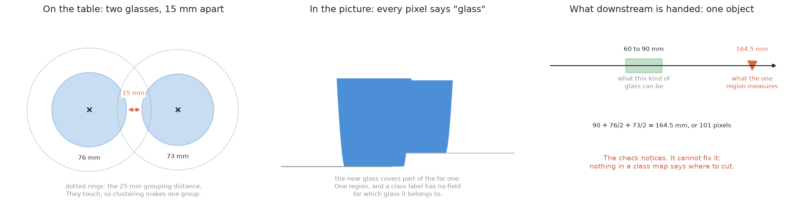
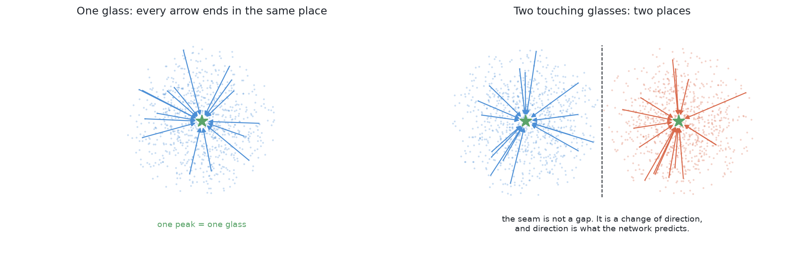
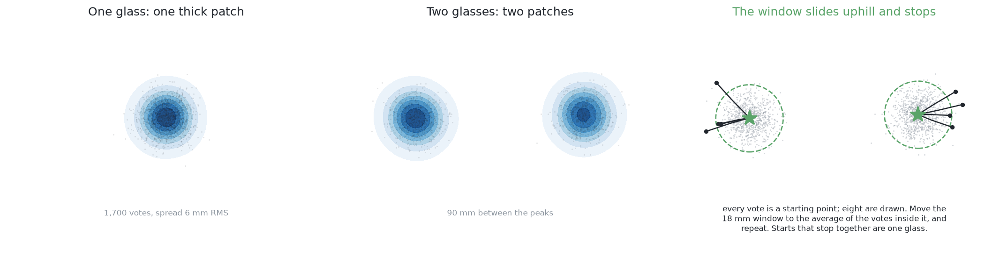
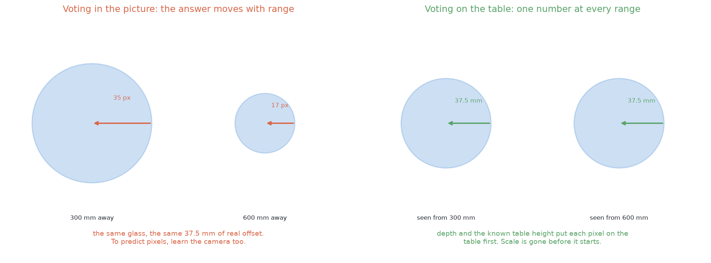
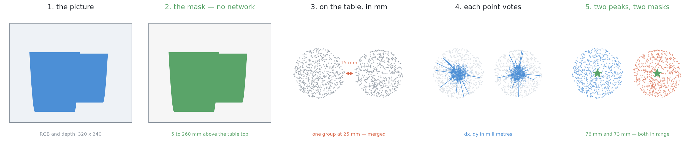
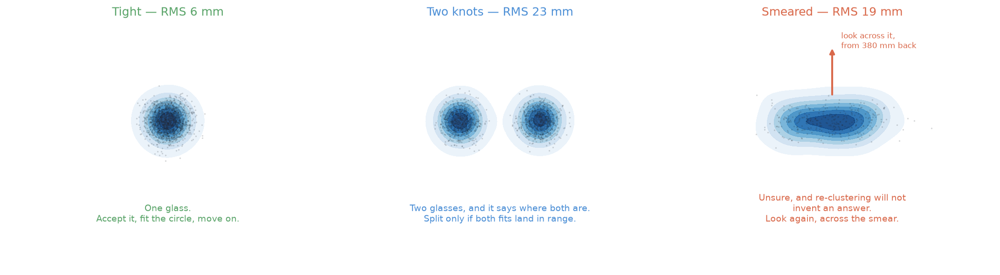
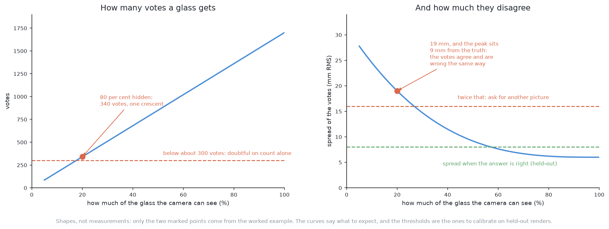

# Solution 8 — per-pixel votes for the centre

*Learned, as the decider. A network that says, at every object pixel, which way
that pixel's own object centre lies — so telling two objects apart becomes
counting the places the arrows point at.*

## In one paragraph

A network that labels each pixel "glass" or "not glass" cannot separate two
glasses that touch: a class label has nowhere to record *which* glass. So ask
for a different output: at each glass pixel, a short vector pointing to the
middle of its own glass. Add it to the pixel's position and you have a vote.
One glass makes one pile of votes, two make two. Predict the vector **in table
millimetres** rather than image pixels, and the camera drops out. The spread of
a pile is a confidence, and a loose pile is a reason to look again.

## The problem this solves

Four to six glasses stand on the table. They are all the same kind, the kind is
known, and they are opaque, so the depth camera sees them. The job is to say
**which pixels belong to which glass**, give each glass a position on the table
in millimetres, and give each a rough footprint width. Nothing is picked up and
no profile is measured here.

Two separate things stop the obvious methods, and it is worth being precise
about both, because this solution is aimed at the second one.

**In the picture, silhouettes overlap.** If the camera is roughly in line with
two glasses, the near one covers part of the far one and the two outlines join.
A **mask** — a picture the same size as the photograph where every pixel is
just yes or no, yes meaning "this is glass" — then shows one joined patch. The
step that turns a mask into separate objects is **connected components**, also
called a flood fill: take a yes pixel nobody has visited, spread out to every
yes pixel touching it, call that patch one object, repeat. It answers exactly
one question, *are these pixels joined?*, and joined is what the two silhouettes
are.

**On the table, the points can be too close to group.** Solution 2, *cluster on
the table*, avoids the picture entirely. Every pixel with a depth reading is
turned into a point in the room, points within 5 to 260 mm of the table top are
kept, and points closer together than a chosen **grouping distance** are put in
the same group. That grouping distance has to satisfy two demands at once. It
must be **larger** than the biggest hole inside one glass's own set of points,
or one glass comes back as two. It must be **smaller** than the gap between two
different glasses, or two glasses come back as one. With the glasses 150 mm
apart, any number between about 10 and 100 mm works and the choice does not
matter. As the glasses come closer, the window of workable numbers narrows,
and when two glasses actually touch it closes: no grouping distance exists
that keeps them apart and keeps each of them whole.

Look at the middle panel: there is no seam between the two silhouettes to find,
and the right panel shows what the next step is handed — a single object
164.5 mm across, when this kind of glass is never more than 90 mm. The check
notices. It cannot fix anything, because nothing in a class map says *where*
to cut.

It is worth saying why more training does not rescue a class map. **Semantic
segmentation** labels every pixel with a class. **Instance segmentation** labels
every pixel with a class *and* with which object it belongs to. Problem 2 asks
for the second. A network trained to produce a class label per pixel is being
asked for a value with one field in it, and that field's value is "glass" for
every glass pixel on the table. A perfectly trained class map still merges
touching glasses, because the answer it was asked for has no room to say
anything else. The fix is not a better network. It is a **different output**.

## The idea, in plain words

Ask each glass pixel a question it can actually answer.

A single pixel cannot count the glasses on the table. It has no idea how many
there are. But it can know something local and useful: **which way the middle
of its own glass lies, and how far**. That is a short arrow, and the network
predicts one at every glass pixel.

Now follow the arrows. Every pixel on one glass points at that glass's middle,
so all of its arrows end in the same small area. Every pixel on the glass next
to it points at *that* glass's middle. Two glasses produce two places where
arrows pile up. Five produce five. **Counting objects has become counting piles
of arrow-ends**, and that is easy.

The right-hand panel is the whole argument. The two sets of pixels touch — there
is no gap anywhere along the dashed line — and it does not matter, because what
changes at the seam is not the pixels but the **direction** the arrows point.

Two properties follow from that, and both matter in a system that has to be
honest about being wrong.

**It does not depend on finding a boundary.** A method that separates objects by
drawing a line between them lives or dies on that line. One mistaken pixel in
the seam reconnects the two objects and they merge again. Voting has no seam to
get wrong. A glass 75 mm across contributes roughly 1,700 votes here, so a
handful of pixels that point the wrong way add a handful of strays to a pile of
1,700 and move nothing.

**The thing being clustered changes scale.** Clustering the pixels themselves
needs a **gap between the edges** of two objects, and that gap can be zero.
Clustering the votes needs a **distance between the centres** of two objects,
and that cannot be zero — two glasses of this kind, with footprints 45 to
105 mm across, have centres at least about 45 mm apart even when they are
pressed together. The hard case for one method is a comfortable case for the
other.

## Where it comes from

The idea is much older than neural networks, and knowing the older version makes
the learned one easy to read.

The **Hough transform** (Paul Hough's 1962 patent, for finding particle tracks)
turns "find a shape" into "find a peak". Each edge point in a picture votes for
every line that could pass through it; lines that many points agree on collect
many votes; the peaks in the vote table are the lines. Nothing in it searches
for lines directly. It only counts agreement. Solution 1's circle detection is
the same machinery aimed at circles.

The **generalised Hough transform** (D. H. Ballard, "Generalizing the Hough
transform to detect arbitrary shapes", *Pattern Recognition* 13(2), 1981)
extends it to a shape that has no equation. You build a table in advance: for
each kind of edge that appears on the object, the offset from that edge to the
object's centre. Then each edge point in a new picture looks itself up and votes
for where the centre would be. The peaks are the objects. **That is exactly the
scheme in this solution**, with one piece replaced.

The piece that gets replaced is the hand-built table. The **implicit shape
model** (Leibe, Leonardis and Schiele, around 2004) learned the offsets from
examples instead of writing them down. **Hough forests** (Gall and Lempitsky,
CVPR 2009) learned them with random decision trees, so each image patch votes
for the object centre and the votes are pooled. A neural network doing the same
job is the natural next step, and per-pixel vectors pointing at object centres
appear in several strands of modern work — instance segmentation, and 6-D pose
estimation where pixels vote for keypoints rather than centres. **I am confident
about Ballard 1981 and about Gall and Lempitsky 2009. I am not confident which
neural paper should be called the canonical ancestor, and I have not verified
any arXiv identifier for that strand, so I am not giving one** — treat this
paragraph as background, not as a citation.

What survives from 1981 is the reason the scheme is used at all: **a vote is
local evidence for a global claim.** The claim "there is an object centred
here" is not something any one pixel can check. The evidence "my object's middle
is 30 mm that way" is. Pooling hundreds of pieces of weak local evidence into
one strong global claim is what the peak-finding does, and it is why a few wrong
pixels cost nothing.

## How it works, step by step

Five steps. Nothing here is specific to this cell yet.

**1. Decide which pixels are object pixels.** Voting only makes sense for pixels
that sit on an object, so something has to mark those first. This can be
learned, or, as here, computed.

**2. Predict an offset at each of those pixels.** Two numbers per pixel: how far
and which way to the middle of the object this pixel belongs to. That is the
only thing the network does.

**3. Turn each offset into a vote.** Add the offset to the pixel's own position.
The result is a single point — where that pixel thinks its object's middle is.
Two numbers per pixel become one dot on a plane.

**4. Find where the dots pile up.** Each object should produce one tight pile.
The piles are the objects, and their positions are the objects' centres.

**5. Give each object its pixels.** Every vote came from a pixel. The pixels
whose votes landed in one pile are that object's mask. The instance
segmentation falls out of the clustering — it is not a separate step.

Step 4 is the only one that needs explaining. The method used here is **mean
shift**, and in plain words it is this: *put a circular window of fixed radius
down somewhere, move the window to the average position of the dots inside it,
and repeat until it stops moving.* Each move is a step uphill, towards thicker
dots. Whichever pile a window starts on, it climbs that pile and stops at the
top. Run it from every dot, and dots whose windows stop in the same place belong
to the same pile. Counting piles is then counting distinct stopping places.

The left two panels are the raw signal — one thick patch of votes for one glass,
two for two. The right panel shows eight windows started at eight different
votes, each walking uphill and stopping; the dashed circles are the window at
its resting place.

There is exactly **one number to choose**: the window radius, usually called the
bandwidth. It is not a threshold on the data, it is a statement about how far
apart two piles have to be to count as two. Too small and one noisy pile breaks
into several. Too large and two nearby piles are swallowed by one window and
merge. Unlike the grouping distance in the section above, this number is comparing **centre-to-centre distances**, which is why a workable
value exists even when the objects touch.

## How it works here

This is where the solution earns its place, and the reason is one decision:
**the network predicts the offset in millimetres on the table, not in pixels in
the picture.**

### The mask is free, so nothing has to be learned for it

The table top is at a known height. The camera's pose is known from the arm's
joint angles. The glasses are opaque, so depth comes back for every glass pixel.
Put those together and every pixel with a depth reading can be placed in the
room, and its **height above the table** computed. A pixel between 5 and 260 mm
above the table top is a glass pixel — 5 mm to clear the table's own noise,
260 mm because this kind of glass is never taller than 230 mm.

So step 1 costs nothing and learns nothing. That is worth pausing on. Solution
7, *a segmenter trained from scratch*, spends a whole network on deciding
glass-or-not, and gets a class map that cannot separate. Here the geometry
answers the easy question for free and the network is left with only the hard
one.

### Every object pixel already has a position in millimetres

The same arithmetic that gives the height gives the position. Before the network
is asked anything, each glass pixel already sits somewhere on the table, in
millimetres from the arm's base. The network's job shrinks to: **from here, how
far and which way to my glass's footprint centre?**

The left panel is the trouble with image offsets: the same glass, the same
37.5 mm of real displacement, is 35 pixels at 300 mm range and 17 pixels at
600 mm. The right panel is what putting the pixel on the table first buys —
37.5 mm either way.

### Why that is so much better

**The target stops depending on the camera.** In the picture, the offset for a
given physical displacement shrinks as one over the range. Those two numbers
above come straight from the camera: at 300 mm, 300 / 277.1 = 1.083 mm per
pixel, so 37.5 mm is 34.6 pixels; at 600 mm, 600 / 277.1 = 2.166 mm per pixel,
so the same 37.5 mm is 17.3 pixels. A network predicting pixel offsets has to
learn that relationship, which is to say it has to learn the camera.

And it is not only a between-pictures problem. In a **single** survey picture,
taken 450 mm above the table, the table itself is 450 mm from the camera while
the rim of a 230 mm glass is 220 mm from it. Depths inside one frame therefore
span roughly a factor of two, so the correct pixel offset varies by a factor of
two *within one photograph*. On the table, all of that disappears.

**The target becomes small and bounded.** Footprints here are 45 to 105 mm
across, so the distance from any pixel's table position to its own footprint
centre is at most 105 / 2 = 52.5 mm. Every training target is a pair of
numbers between −52.5 and +52.5. A bounded, camera-independent target is a much
easier thing to fit than an unbounded one, which is the main reason a small
network is plausible here at all.

**The votes land somewhere the answer is obvious.** The table plane is not an
abstract vote space. It is the actual table, on which each glass is a disc 45 to
105 mm across. A pile of votes on that plane can be checked against physical
facts: the circle fitted to a pile's voters must have a diameter inside this
kind's range, and two piles cannot be closer than two footprints allow.

**Votes from different pictures pool.** Because a vote is a place on the table,
votes from two photographs taken from two positions are in the same frame and
can be clustered together without any matching step. That is what makes the
feedback loop below cheap: the second picture's votes are simply added to the
pile.

### The five stages, end to end

Read it left to right: the network is only involved in stage 4, and everything
before and after it is arithmetic the project already has.

### The network and the loss

**In:** four channels at 320 x 240 — red, green, blue, and height above the
table. Height rather than raw depth, because height is the quantity that is
comparable between viewpoints.

**Out:** two channels at the same size — dx and dy, in table millimetres.

**Shape:** a small U-Net (Ronneberger, Fischer and Brox,
[arXiv:1505.04597](https://arxiv.org/abs/1505.04597)). A U-Net halves the
picture repeatedly while widening it, so that later layers see a large part of
the scene, then doubles it back up to full size, with each level on the way down
copied across to the matching level on the way up so fine detail is not lost.
Seeing a large part of the scene is exactly what this task needs: a pixel cannot
know where its glass's middle is by looking only at itself. **The parameter
count and the depth of the network are uncertain** — solution 7 arrives at
roughly 480,000 weights for a similar shape by arithmetic on the layer widths,
and whether that is the right size for this job is something to measure, not to
assert.

**Loss:** smooth L1 on dx and dy, in millimetres, **over object pixels only**.

Two parts of that need unpacking. *Smooth L1*, also called the Huber loss,
scores a small mistake by its square and a large one by its size. Squaring small
errors makes the fit precise where it is nearly right; not squaring large ones
stops a handful of wild pixels from dominating every update. Pixels near an
object's edge, where a pixel may genuinely belong to either glass, are exactly
the wild ones, so this matters here.

*Over object pixels only* is not a detail. Most pixels in a survey picture are
table, and the correct offset for a table pixel does not exist — there is no
object for it to point at. If those pixels are included the loss is dominated by
a question with no answer. So the loss is multiplied by the mask from step 1
before it is summed, and the network is scored only where the question makes
sense.

### The training data

Gazebo renders the scene and already knows, per object, exactly which pixels are
which and where each object stands. The label is then arithmetic rather than
annotation: for a pixel inside glass *k*'s mask, the target is *k*'s footprint
centre minus that pixel's own table position. There is no annotator, so there is
no annotator error, and there is no limit on how many scenes can be made beyond
the time it takes to render them.

Two things about what to spawn. **Spawn the hard case.** The cell's own rule
puts glasses at least 150 mm apart, and a training set drawn only from that rule
never shows the network a pair it cannot already separate with 25 lines of
clustering. Pairs 60 to 120 mm apart, and pairs actually touching, are where the
network has to be taught. **Keep the easy case too**, in proportion, or the
network learns that there is always a pair.

And **randomise everything that is not shape**. A simulator will render the same
table under the same light for ever, and a network given a constant will use it
as a clue. Domain randomisation (Tobin et al.,
[arXiv:1703.06907](https://arxiv.org/abs/1703.06907)) varies lighting, textures,
glass tint, camera pose, exposure, image noise, depth noise and dropout, and the
number and placement of glasses, so that shape is the only thing left that
predicts the answer. This matters even though the system will only ever run in
Gazebo, because this cell's own lighting and table will change during the
project's life.

### Turning votes into glasses, with the numbers this cell allows

Put every vote down as a dot on the table plane, then run mean shift.

The window radius should be chosen from the **measured spread of the votes**,
not picked out of the air. Measure, on held-out renders where the truth is
known, the RMS distance of a glass's votes from its true centre. A radius of
about two to three times that figure is large enough not to shatter one pile and
small enough to keep two apart. With a spread of 6 to 8 mm, that means roughly
15 to 20 mm.

It is worth stating the limit of this honestly. Two glasses of the smallest
footprint, 45 mm, pressed against each other, have centres 45 mm apart. A window
radius of 30 mm would then reach from one centre almost to the other and the two
piles risk merging into one. So the loose end of the plausible range is already
too loose for the tightest case the cell can produce, and 15 to 20 mm is the
number to start from. This is a real constraint, and it is the reason the
measurement above is worth doing before choosing.

Finally, **arithmetic has the last word**. Each pile's voters are fitted with a
circle. A pile whose fitted diameter falls outside this kind's range is not
reported as a glass, whatever the votes say. The learned part proposes; the
geometry disposes.

## A worked example

All of the arithmetic below uses only the cell's published numbers.

**The scale.** The survey picture is taken 450 mm above the table and
fx = fy = 277.1 pixels, so one pixel covers 450 / 277.1 = **1.62 mm** on the
table. A glass 75 mm across is 75 / 1.62 = **46 pixels** wide, and its
silhouette covers roughly a disc of that width — π × 23² ≈ 1,660 pixels. Call
it **about 1,700 votes per glass**.

**The case that defeats clustering.** Two glasses of a kind whose footprint runs
60 to 90 mm stand 90 mm apart, centre to centre. Their footprints measure 76 and
73 mm, so the gap between their edges is 90 − 38 − 36.5 = **15.5 mm**. At
solution 2's 25 mm grouping distance the two sets of points are one group. The
merged group spans 90 + 38 + 36.5 = **164.5 mm**, or 101 pixels. The kind's
range tops out at 90 mm, so the check fires — but it fires on a blob it has no
way to divide.

**What the votes do.** The pixels of the two glasses are as merged as before;
their votes are not. The piles land at (0.42, −0.31) m and (0.51, −0.30) m from
the arm's base, which is √(90² + 10²) = **90.6 mm** apart — a comfortable
distance for an 18 mm window. Their spreads are 6 and 8 mm RMS, both inside the
held-out figure. Circle fits on the two sets of voters give 76 and 73 mm, both
inside the kind's 60 to 90 mm range. Two glasses, two positions, two masks, two
widths.

**The case that defeats voting.** One glass stands mostly behind another and is
80 per cent hidden. It contributes 0.2 × 1,700 = **340 votes**, and they all
come from one crescent down its visible side. Its pile's centre lands 9 mm from
the truth — the votes agree with each other and are wrong in the same direction,
which is what a one-sided view does — and the pile's spread is 19 mm RMS, about
three times the held-out figure.

**What that costs to fix.** The spread is over the threshold, so the arm takes
one more picture: 380 mm back, looking level from 120 mm above the table, across
the line joining the two glasses. That is the pose problem 1's step 2 already
uses, so no new capability is needed. At 380 mm, one pixel covers
380 / 277.1 = **1.37 mm**, and the 75 mm glass is now 75 / 1.37 = **55 pixels**
wide — more pixels on a glass than the survey picture gave, from a direction
where nothing is in front of it. Its votes come back to a 6 mm spread.

**What that costs in time.** Running the network on a picture costs
milliseconds. Moving the arm to the new pose and letting it settle costs
seconds. The whole design of the loop follows from that ratio: compute freely,
move rarely.

## The feedback loop

This solution has a real one, and the thing that drives it is free.

**The doubt.** The spread of a pile of votes about its own peak, as an RMS
distance in millimetres, is a per-glass confidence that costs one line to
compute. It needs calibrating once: run the trained network over held-out
renders where the truth is known, and record what the spread looks like when the
answer is right. Every threshold below is a multiple of that figure, not a
constant somebody chose.

Three shapes, three different actions — and the important point is that the
shape says not only *whether* to look again but *where*.

**Tight.** The spread is at or below the held-out figure. The pile is one glass.
Fit the circle, check the diameter against the kind's range, report it, move on.

**Two knots inside one pile.** The votes have split into two tight lumps. That
is two glasses, and it has already told you where both of them are. Propose the
split, then check it: accept it only if **both** fitted circles land inside the
kind's range. If only one does, the split is not believed, and the pair is
reported doubtful rather than guessed at.

**One broad smear, with no lump sharper than the rest.** This is the network
saying it does not know. Re-running the clustering will not manufacture an
answer, because there is no answer in the data. **An unsure pile is a reason to
take another picture**, and the smear says which one: a smear almost always has
a long axis, and that axis is the direction along which the evidence is thin.
Look **across** it — perpendicular to the long axis, from 380 mm back. There is
no search over candidate viewpoints. The cloud names the direction, and the
geometry that already exists turns a direction into a reachable pose.

**Too few votes, whatever the spread.** This is a fourth case and it has to be
checked separately, because the spread does not catch it. A heavily occluded
glass votes from a crescent, and those votes can agree closely with each other
while being wrong together. Below roughly 300 votes — under a fifth of a whole
glass — a pile is doubtful on count alone, even if it looks tight.

**What the second picture buys.** Because the votes are places on the table and
the camera pose is known, the second picture's votes go into the same plane as
the first picture's. There is no correspondence problem to solve, no matching of
regions between views. The piles simply get more voters from a better angle.
That is a direct consequence of voting in table coordinates, and it would not be
available if the offsets were in pixels.

**The budget.** Every extra look costs seconds of arm motion, and arm motion is
by far the most expensive resource in this cell. So the loop is capped: two
extra looks per doubtful pile, then stop. A pile still doubtful after that is
**reported as an unseparated pair**, with its position and the reason, and
handed to problem 3, which moves things. That is a result, not a failure. The
rule the whole project runs on applies here too: anything doubtful is reported,
never guessed.

## What it needs

**From the cell**, all of which exists: the wrist depth camera, the known table
height, and the camera pose from the arm's joint angles.

**Software.** Two of the five libraries below are not in this project's
environment yet and would have to be added to `pixi.toml`:

- [PyTorch](https://pytorch.org/) — BSD-3-style
  ([licence](https://github.com/pytorch/pytorch/blob/main/LICENSE)) — to train
  and run the network, on the **MPS** backend, which is PyTorch's route to
  Apple's own GPU. There is no NVIDIA card in this machine and nothing here
  needs one. **Not currently installed.**
- [scikit-learn](https://scikit-learn.org/) — BSD-3-Clause — for
  [`sklearn.cluster.MeanShift`](https://scikit-learn.org/stable/modules/generated/sklearn.cluster.MeanShift.html).
  **Not currently installed**, and avoidable: mean shift over a few thousand
  two-dimensional points is about forty lines of NumPy, which the diagram script
  beside this document demonstrates.
- [NumPy](https://numpy.org/) — BSD-3-Clause — already present.
- [OpenCV](https://opencv.org/) — Apache-2.0 for version 4.5 and later — already
  present, and it is what fits the circle to each pile's voters.
- [Gazebo Harmonic](https://gazebosim.org/) — Apache-2.0 — already present, and
  it is the entire source of training data.

**Data.** Rendered scenes with per-object masks and positions, weighted towards
close and touching pairs. A few thousand is the order of magnitude to aim at;
**how many is actually enough is uncertain** and is the first thing to measure.

**Time.** Uncertain, and it should be measured rather than estimated: time one
epoch on this machine and multiply, and expect some operations to fall back to
the CPU on MPS. The target is hours, not days, because a method that cannot be
retrained in an afternoon will not be iterated on.

**To build, on top of *cluster on the table*:** a label generator, a training script, a
version-pinned weights file, and the peak-finding.

## What it is good at

**It separates glasses that touch.** This is the thing it exists for, and it is
the thing clustering on the table cannot do at any setting. Votes need no gap
between objects — only enough pixels on each of them.

**Its output is in millimetres, so the arithmetic still decides.** Every pile
goes through a circle fit and a diameter check against the kind's range before
it is believed. The learned part proposes objects; it does not get to overrule
geometry.

**The mask costs nothing.** Deciding whether a pixel is glass is answered by the
known table height. The network is only asked the question the geometry cannot
answer, which is why it can be small.

**It degrades gracefully.** A few pixels pointing the wrong way are a few stray
dots among 1,700. The comparable mistake in a boundary-predicting method —
a few wrong pixels in the seam — rejoins two objects completely.

**It comes with a confidence.** The spread of each pile is a per-object doubt,
free, and it is specific enough to say which direction to look next.

**Votes from several pictures pool without any matching step**, because they are
positions in one shared frame.

## What it is bad at

**It learns the renderer.** Trained only on Gazebo output, it has fitted this
simulator's shading, depth noise and dropout, not the world's. Domain
randomisation narrows that gap and does not close it, and with no real-world
data there is nothing that can check whether it worked. This is an accepted
trade for a cell that only ever runs in simulation, and it stops being
acceptable the moment a real arm is involved.

**It inherits the table-height assumption, and quietly.** Every vote is a
position computed by cutting a camera ray at the table plane and measuring from
it. If the recorded table height is a few millimetres wrong, every pixel's table
position moves, every vote moves with it, and the piles are still tight and
still wrong. Nothing in the vote spread can see a global shift, because a shift
that moves everything moves the votes and the peak together.

**It holds a size-shaped prior that nobody can read.** The offsets it predicts
are millimetres of one kind of glass's radius. A network trained on this kind
has that kind's size range baked into its weights. That sits awkwardly with this
repo's governing rule — no glass's size appears anywhere in the project — and
the weights file is exactly the kind of place a measurement can hide without
anyone noticing. It is not a constant in a file, but it is not nothing either,
and the report should say so plainly.

**It needs depth to exist.** The mask, the table positions and the height
channel all come from the depth camera. On real glassware, which is transparent,
depth returns nothing and there is nothing to vote with.

**It says nothing about kind.** Everything here assumes one known kind. Naming
the kind is problem 4.

## How it fails

The two curves are shapes to expect, not measurements: only the two marked
points come from the worked example above, and both thresholds are figures to
calibrate on held-out renders.

**Too few votes.** A heavily occluded glass votes from a crescent. Its votes are
biased towards the side that can be seen, so the peak is pulled off the true
centre, and the spread does not necessarily reveal it — a crescent's votes can
agree closely and be wrong together. This is why the vote **count** is a
separate check from the vote **spread**. Below a few hundred votes, do not
believe the pile regardless of how tight it looks.

**Two piles on one glass — a split.** This one is loud. Both fitted circles come
out too small for the kind's range, and the check catches it in one line.

**One pile on two glasses — a merge.** This is the quiet one, and it is the
failure to watch hardest, because everything downstream believes a merged pair
is a single large glass. Two guards catch it. The circle fitted to the pile's
voters comes out far too large — 164.5 mm in the worked example, against a range
that stops at 90 mm. And the pile holds roughly twice as many votes as a single
glass should. Neither guard is the model; both are arithmetic that does not need
the model to be right.

**Confident and wrong.** The network can produce a tight, clean pile for a
situation it has never seen, with nothing in the output admitting it. The loop
never fires. Only the circle fit and the vote count stand between that and a
wrong answer being acted on.

**A wrong table height.** Global, silent, and invisible to every check above,
because it moves the truth and the estimate together. It shows up, if at all, as
a systematic offset between the reported positions and where the arm actually
finds things.

## When it would be the right choice

When the glasses genuinely touch, or stand closer than any grouping distance can
handle. That is the line where *cluster on the table* stops, and this is the
cheapest learned thing past it: the mask comes free from the known table height,
the labels come free from the simulator, and the output is in millimetres so the
existing checks still apply.

It is the wrong choice while the glasses stand 150 mm apart, as the cell's rule
says they do. At that spacing, 25 lines of clustering give the same answer with
no training, no weights file and nothing to keep in step with the world. Adding
a network there buys nothing and adds a thing that can rot.

And it stops existing on real glassware. No depth, no height channel, no table
positions, no votes.

## The general methods behind this

Voting for a centre is one of the oldest ideas in computer vision, and the
learned version changes only where the votes come from. The other half of the
solution — turning a cloud of votes into objects — is a standard clustering
method with a useful property.

### The Hough transform — local evidence for a global claim

A single edge pixel cannot say where a shape is, but it can vote for every shape
that would explain it; accumulate the votes and the peaks are the shapes really
present. Hough's 1962 patent did it for straight lines in bubble-chamber
photographs, and the **generalised Hough transform** (D. H. Ballard, *Pattern
Recognition*, 1981) extended it to arbitrary shapes by replacing the equation
with a lookup table of offsets.

- **Mostly used for** finding parametric shapes in noisy, cluttered images where
  much of the outline is missing: lines, circles and ellipses in inspection,
  document analysis, and lane finding. Voting is naturally robust to occlusion,
  because the visible part still votes correctly.
- **Rarely right for** shapes with many parameters, since the accumulator grows
  exponentially with them, and for scenes where a learned detector is available
  and the shape is not cleanly parametric.
- **More:** [Hough transform](https://en.wikipedia.org/wiki/Hough_transform);
  [generalised Hough transform](https://en.wikipedia.org/wiki/Generalised_Hough_transform).

### Learned voting — replacing the lookup table with a model

**Hough forests** (Gall and Lempitsky, CVPR 2009) first replaced the hand-built
offset table with a learned one: patches vote for an object centre, and a random
forest decides how. The neural descendants apply the same structure to points
and pixels — **VoteNet** ([arXiv:1904.09664](https://arxiv.org/abs/1904.09664))
has point-cloud points vote for object centres, and **PVNet**
([arXiv:1812.11788](https://arxiv.org/abs/1812.11788)) has pixels vote for
keypoints in pose estimation, specifically because voting survives occlusion.

- **Mostly used for** detection and pose estimation under heavy occlusion and
  clutter — bin picking, 6D pose, crowded scenes — where a method needing the
  whole object visible fails and a method needing only a fraction does not.
- **Rarely right for** objects with no well-defined centre, or where the
  offsets are large relative to the image, since the regression target grows and
  the votes scatter.

### Per-pixel offsets as instance segmentation

The general problem this solves: a class map has nowhere to record *which*
object a pixel belongs to. Predicting a vector per pixel — towards its own
object's centre — is one of two standard answers, the other being to learn an
embedding per pixel and cluster those instead (**associative embedding**, Newell
et al., [arXiv:1611.05424](https://arxiv.org/abs/1611.05424)). Offsets fail more
gently than boundary prediction, because one bad pixel in a seam rejoins two
objects whereas one bad vote is outvoted.

- **Mostly used for** bottom-up instance segmentation and pose estimation, and
  favoured where objects are numerous and overlapping, since nothing depends on
  a box.
- **Rarely right for** scenes with few, well-separated objects, where a
  detect-then-segment approach like Mask R-CNN is simpler and stronger.

### Mean shift — finding peaks without being told how many

Slide a window to the mean of the points inside it, repeat until it stops
moving; every starting point that ends in the same place belongs to one mode
(Comaniciu and Meer, *PAMI*, 2002). Unlike k-means it does not need the number
of clusters in advance, which is the whole point here — the number of clusters
*is* the answer.

- **Mostly used for** mode finding where the count is unknown: tracking, colour
  segmentation, and exactly this job of turning a vote cloud into objects.
- **Rarely right for** high-dimensional data, where it is slow and the bandwidth
  becomes impossible to choose, and for clusters of very different densities,
  where one bandwidth cannot serve both.
- **More:** [mean shift](https://en.wikipedia.org/wiki/Mean_shift);
  [`sklearn.cluster.MeanShift`](https://scikit-learn.org/stable/modules/generated/sklearn.cluster.MeanShift.html).

## Where it sits

It stands on *cluster on the table*, reusing that solution's height-above-table
mask, its table positions and its circle fit, and replacing only the step where
that solution merges touching glasses. It is also the separation mechanism that
*a segmenter trained from scratch* defers to: that solution produces a class
map, notes that a class map cannot separate instances, and points here for the
part that can.

It competes with the other way of bolting separation onto a segmenter —
predicting object boundaries — and it is chosen over that because a boundary
fails catastrophically at a single bad pixel while a vote field fails by a few
votes in seventeen hundred. When it is unsure it borrows the 380 mm side-on pose
from *move the camera*, and it hands anything still unresolved after two extra
looks to problem 3, in the same form that every other solution here reports an
unseparated pair.
