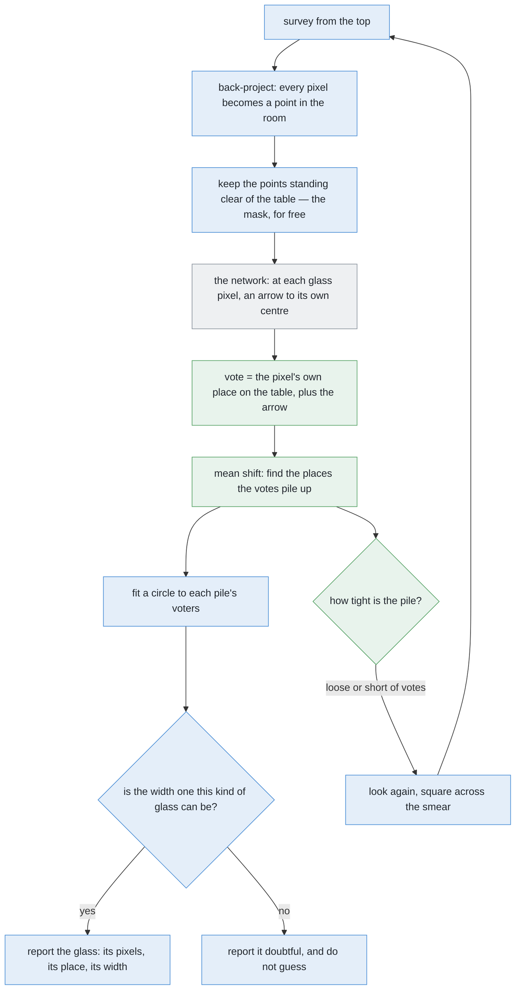
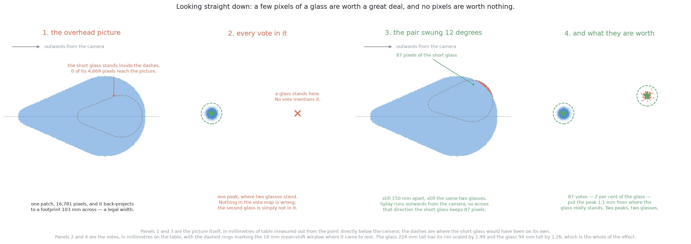
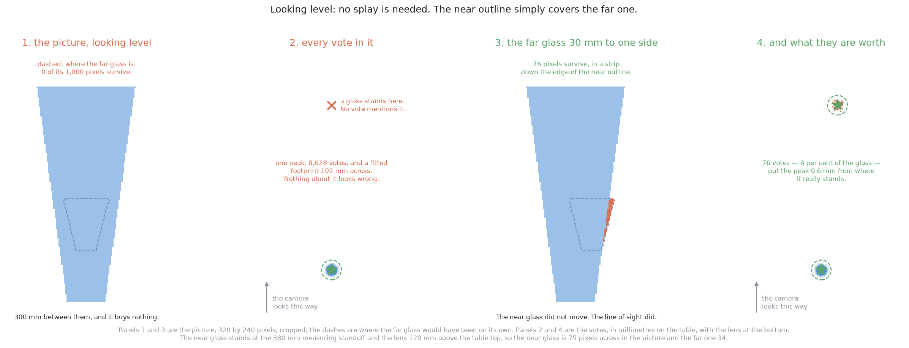

# Solution 8 — per-pixel votes for the centre

*Learned, as the decider. A network that says, at every object pixel, which way
that pixel's own object centre lies — so telling two objects apart becomes
counting the places the arrows point at.*

> **The cell is described once, in [the cell](../../the-cell.md)** — the layout,
> the two places the camera works from, from the top and from the side, all four
> sensors, and the words this project uses them with. What follows is only what
> is specific to this solution.

## Introduction

This document explains the one method on these pages that can separate two
glasses even when they are touching each other. The problem it addresses is that
every other method needs a gap of some kind — a gap in the picture, or a strip
of bare table — and when two glasses touch there is no gap anywhere to find. The
idea here is to stop looking for boundaries altogether and instead ask each
pixel a different question: **which way is the middle of your own glass?** By
the end you will understand why that question can be answered pixel by pixel,
why the answer must be given as a distance on the table rather than as a
distance in the picture, how a cloud of such answers turns into a count of
objects, and why the spread of that cloud is a confidence you get for nothing.

## The problem this solves

Four to six glasses stand on the table. They are all the same kind, the kind is
known, and they are solid, so the depth camera sees them. The job is to say
which pixels belong to which glass, to give each glass a position on the table,
and to give each a rough footprint width. Nothing is picked up and no shape is
measured here.

Two different things defeat the obvious methods, and this solution is aimed at
the second one.

### In the picture, outlines overlap

If the camera is roughly in line with two glasses, the near one covers part of
the far one and their two outlines join.

To see why that is fatal, two words are needed. A **mask** is a picture the same
size as the photograph in which every pixel is just yes or no, where yes means
"this is glass". The step that turns a mask into separate objects is called
**connected components**, or a flood fill: take a yes pixel nobody has visited,
spread out to every yes pixel touching it, call everything you reached one
object, and repeat.

The trouble is that a flood fill answers exactly one question, which is *are
these pixels joined?* And joined is precisely what the two overlapping outlines
are.

### On the table, the points can be too close to group

[Solution 2](02-cluster-on-the-table.md), *cluster on the table*, avoids the
picture entirely. Every pixel with a depth reading becomes a point in the room,
the points standing clear of the table are kept, and points closer together than
a chosen **grouping distance** go in the same group.

That one distance has to satisfy two demands at once. It must be **larger** than
the biggest hole inside one glass's own points, or one glass comes back as two.
And it must be **smaller** than the strip of bare table between two glasses, or
two come back as one.

At the spacing this problem guarantees, there is plenty of daylight between
those two limits and the choice barely matters. As the glasses close up, the
window narrows. And when two glasses touch, **the window shuts completely**: no
grouping distance keeps them apart while also keeping each of them whole.

The middle panel of that picture has no seam between the two outlines for
anything to find. The right panel shows what the next step is handed, which is
**a single object far wider than any glass of this kind can be**.

The range check notices that much. But noticing is all it can do, and the reason
is worth stating exactly, because it is what this solution exists to repair.
**Nothing in a class map says where to cut.** Every pixel carries the same
label, "glass", and a label that is the same everywhere cannot possibly mark a
boundary.

### More training does not rescue a class map

It is tempting to think a better-trained network would solve this, and it would
not, because the limitation is in the shape of the output rather than in the
quality of the fit.

**Semantic segmentation** labels every pixel with a class. **Instance
segmentation** labels every pixel with a class *and* with which object it
belongs to. This problem asks for the second. A perfectly trained class map
still merges touching glasses, because "glass" is the only value the answer has
room to hold.

So the fix is not a better network. **It is a different output.**

## The main idea

The main idea is to ask each pixel for an arrow instead of a label.

At every glass pixel, the network predicts a short arrow pointing towards the
middle of that pixel's own glass. Add the arrow to the pixel's own position, and
what you have is a **vote** for where that glass's centre is. One glass then
makes one pile of votes. Two glasses make two piles. Counting glasses becomes
counting piles.

Read those five panels left to right. The network is involved in one stage only,
and everything before and after it is arithmetic the project already has.

The rest of this document builds that up. First comes the fact that makes it
cheap, which is that every glass pixel already has a place on the table before
the network is asked anything. Then comes the single most important decision in
the design, which is what units the arrow is measured in. Then how a cloud of
votes becomes a count of objects, and finally what keeps the whole thing honest.

## Every glass pixel already has a place on the table

The first thing to notice is how much work has already been done before the
network is consulted, and it means the network is asked a much smaller question
than it might have been.

The table's height is known, and the glasses are opaque, so a depth reading
comes back for every glass pixel. Solution 2's arithmetic already turns each
such pixel into a point in the room and drops it onto the table. So **every
glass pixel already has a position on the table**, worked out from its depth
reading, the lens and the recorded camera pose.

That shrinks the network's job to one question: *how far, and in which
direction, to my own glass's footprint centre?*

There is a second thing that is free for the same reason. **The mask is free.**
Nothing has to be learned to decide *whether* a pixel is a glass pixel, because
the existing test — does the point behind it stand clear of the table and below
the tallest glass the cell accepts — already says so. The network therefore
needs only two output channels, one for each direction of the arrow, and it
never spends any capacity on the easy question.

## Voting in distances on the table, not in the picture

This is the decision the whole solution rests on, so it is worth going through
slowly.

The left panel shows the trouble with arrows measured in **pixels**. The same
glass, with the same real displacement, photographed from twice as far away, is
half as many pixels across. So a network predicting arrows in pixels has to
learn how that number shrinks with distance — which is to say, **it has to learn
the camera before it can learn anything about glasses.**

And it is not only a problem between one picture and the next, which is the part
people usually notice. Consider a single picture taken from the top. The table
is the full camera height away from the lens, while the rim of a tall glass has
climbed most of the way towards it. So the correct arrow in pixels varies by a
large factor **within one photograph**. Measured on the table, it does not vary
at all.

There is a second benefit, and it is the one that makes a small network
plausible. Measuring the arrow on the table puts a **hard limit** on what the
network ever has to predict. An arrow runs from a pixel to the centre of its own
glass, so the longest arrow that can ever occur is half the widest footprint the
cell handles — whatever the distance, whatever the angle. Every training target
is therefore a pair of numbers inside a small, known box. **A target that is
bounded and does not depend on the camera is far easier to fit than an unbounded
one.**

## What the votes look like, and why no boundary is needed

The right-hand panel of that picture is the whole argument, and it is worth
looking at carefully.

The two sets of pixels **touch**. There is no gap anywhere along the dashed
line. And it does not matter, because what changes at the seam is not the pixels
but the **direction the arrows point**. The pixels on the left half point left,
the pixels on the right half point right, and the seam between them is not
something anything has to find.

**Nothing has to find a boundary, so nothing can get one wrong.** That single
sentence is why this method survives touching glasses when nothing else here
does.

The method is also robust in a way that a boundary method is not. A glass seen
from the top casts one vote for every pixel of its outline, which is well over a
thousand votes. A handful of those pointing the wrong way are a handful of
strays among thousands, and a pile of thousands does not notice them. Compare
that with predicting a seam, where one missing pixel along the seam rejoins two
objects completely.

There is one more consequence of voting in table distances, and it pays off
later in this document. Because a vote is a place on the table rather than a
place in a picture, **votes from two photographs taken from two different places
land in the same frame**, and they can be pooled with no matching step at all.
That is what makes both the second picture of each pair and the feedback loop
cheap.

## Turning a cloud of votes into a count of objects

Each glass should make one tight pile of votes, so the remaining question is
simply where the votes pile up.

The method for that is called **mean shift**. Put a circular window down on one
vote, move the window to the average position of the votes inside it, and repeat
until it stops moving. Each move is a step uphill towards thicker votes. Run it
from every vote, and the votes whose windows stop in the same place belong to
one pile.

The left two panels of that picture are the raw signal: one thick patch of votes
for one glass, and two patches for two. The right panel shows several windows
started at several different votes, each walking uphill and stopping, with the
dashed circles marking each window where it came to rest.

So counting glasses has become counting distinct stopping places. The important
property of mean shift here is what it does **not** need to be told: unlike
other grouping methods, **nothing has to say how many piles to expect**. That
matters a great deal, because in this problem the count *is* the answer.

### Choosing the one window size

There is exactly one number to choose, which is the window radius, and it is
pinned at both ends before anything is run. This is the same shape of argument
used for the grouping distance in solution 2.

The **floor** is the spread of the votes themselves. The votes for one glass do
not land on a single point; they scatter around the true centre, and that
scatter can be measured on held-out renders where the truth is known. A window
much smaller than that scatter fits *inside* one pile, so it climbs some local
lump within the pile rather than the pile as a whole, and one glass then comes
back as several peaks.

The **ceiling** is the closest two centres can ever be. The worst case is two of
the narrowest glasses this kind allows, pressed rim to rim, and then their
centres are one footprint apart and nothing can bring them closer. A window
whose radius reaches much more than half of that covers **both** centres at
once, and the two piles merge into one.

There is comfortable room between those two limits, and the chosen radius sits
inside it. It is worth seeing what a careless choice would cost, because the
failure is quiet: a window large enough to span the narrowest possible centre
gap swallows two centres whole, so it would merge exactly the pairs this
solution exists to separate — and it would do so **silently**, because a merged
pile looks perfectly tight and complains about nothing.

One practical note. Running a window from every single vote means comparing
every vote with every other vote on every step, and with tens of thousands of
votes that is far more arithmetic than the job needs. Seeding the windows from a
few hundred votes drawn at random fixes it, because **a pile of thousands is
found just as reliably from a sample of it**, and every vote is still assigned
at the end by which peak it is nearest, so nothing is lost.

## The arithmetic still decides

One thing has not changed from solution 2, and it is deliberate.

Each pile's voters — the pixels, at their own positions on the table — are
fitted with a circle, which returns a centre, a width and a fit error. A pile
whose fitted width falls outside the range this kind of glass can be is **not
reported as a glass**, whatever the votes may say.

So the network proposes and the geometry disposes. That is what keeps this
solution inside the same safety argument as the programmed ones: a learned
component decides which pixels group together, and an arithmetic check decides
whether the result is believable.

## How the concepts fit together

Green marks what this solution adds, blue marks work the project already does,
and grey marks the network.

Notice how little of that chain is new. The new parts are the vote arithmetic
and the peak-finding, both of which are short. The network is a library call.
And everything that turns pixels into places on the table, and everything that
decides whether an answer is believable, was already written.

## The network and its training

The network takes four channels the size of the picture — the three colour
channels and the **height above the table** — and returns two channels the same
size, holding the two parts of the arrow.

Height is used rather than raw depth for the same reason the arrow is measured
on the table: height means the same thing from every viewpoint, and raw depth
does not.

Its shape is the same encoder-and-decoder design used in [solution
7](07-a-segmenter-trained-from-scratch.md), which halves the picture repeatedly
while widening it so that later layers see a large part of the scene, then
doubles it back to full size, with each level on the way down copied across to
the matching level on the way up so that fine detail is not lost.

Seeing a large part of the scene is exactly what this task needs, because **a
pixel cannot possibly know where its glass's middle is by looking only at
itself.** It has to see enough of the glass around it to tell which way the
middle lies.

For the same reason, the receptive-field warning in solution 7 applies here
**with more force rather than less**. That warning is that the deepest layer of
a shallow network may cover a smaller patch of table than the task needs, and
here the task needs each pixel to see the whole of its own glass. The size and
depth of this network are therefore **not settled**, and working out whether
they are sufficient is something to measure rather than to assert.

### The loss, and the two choices inside it

The network is scored by how far each predicted arrow is from the true one,
using a loss that behaves differently for small and large mistakes. It scores a
small mistake by its square, and a large one by its size. Squaring the small
errors makes the fit precise where it is nearly right, and not squaring the
large ones stops a handful of wild pixels dominating every update. Pixels near
an edge, where a pixel may genuinely belong to either glass, are exactly the
wild ones.

The second choice inside the loss is not a detail either. The loss is applied
**over glass pixels only**. Most pixels in a picture from the top are table, and
a table pixel has no correct arrow at all, because there is no object for it to
point at. So the loss is multiplied by the mask before it is added up, and the
network is scored only where the question has an answer.

### The labels are arithmetic, not annotation

The training labels cost nothing, and this is what makes the whole thing
practical.

The simulator already knows, for each object, which pixels are which and where
each object stands. So for a pixel inside one glass's mask, the target arrow is
that glass's footprint centre minus the pixel's own position on the table. It is
a subtraction rather than a judgement.

No annotator means no annotator's mistakes, and no limit on how many scenes can
be made beyond the time it takes to render them.

### Two things about the training set that decide whether it works

The first is to **spawn the hard case**. The cell's own rule keeps glasses a
comfortable distance apart, and a training set drawn only from that rule never
once shows the network a pair that a page of clustering code could not already
separate. So the teaching has to happen on pairs standing far closer than the
rule allows, and on pairs actually touching. But **keep the easy case too**, in
proportion, because otherwise the network quietly learns that there is always a
pair to find.

The second is to **randomise everything that is not shape**. A simulator will
render the same table under the same light for ever, and a network given a
constant will use it as a clue. Domain randomisation (Tobin and colleagues,
[arXiv:1703.06907](https://arxiv.org/abs/1703.06907)) varies the lighting, the
textures, the glass tint, the camera pose, the exposure, the picture noise, the
depth noise and dropout, and the number and placement of the glasses, so that
shape is the only thing left that predicts the answer. This matters even though
the system will only ever run inside one simulator, because this cell's own
lighting and table will change during the project's life.

## The feedback loop

**The doubt here is free**, which is unusual and is one of the best reasons to
prefer this design. How far a pile's votes sit from its own peak, on average, is
a per-glass confidence, and it costs one line to compute.

It needs calibrating once. Run the trained network over held-out renders where
the truth is known, and record what that spread looks like when the answer is
right. Every threshold below is then a multiple of that measured figure, rather
than a constant somebody chose.

There are three shapes of cloud and three actions, and the important point is
that the shape says not only *whether* to look again but *where*.

**A tight pile**, at or below the held-out figure, is one glass. Fit the circle,
check the width against the kind's range, report it, and move on.

**Two knots inside one pile** means the votes have split into two tight lumps.
That is two glasses, and it has already said where both of them are. So propose
the split, and then check it: accept it only if **both** fitted circles land
inside the kind's range. If only one of them does, the split is not believed,
and the pair is reported doubtful rather than guessed at.

**One broad smear**, with no lump sharper than the rest, is the network saying
it does not know. Re-running the grouping will not manufacture an answer that is
not in the data.

That last case is where the loop starts, and the smear says which picture to
take. A smear almost always has a long axis, and that axis is the direction
along which the evidence is thin. So look **across** it, square to the long
axis, from the side at the measuring standoff. Note that there is **no search
over candidate viewpoints** here at all: the vote cloud names the direction by
itself, and geometry the project already has turns a direction into a reachable
pose.

### Too few votes, whatever the spread

There is a fourth case, checked separately, because the spread does not catch
it.

A heavily hidden glass votes only from a crescent down its visible side, and
those votes can agree very closely with each other while being **wrong
together**. So a pile built from a small fraction of the votes a whole glass
should give is doubtful on count alone, however tight it looks.

This is the one check that catches confident agreement between witnesses who all
stood in the same wrong place, and it is worth having for exactly that reason.
The two curves in that picture are shapes to expect rather than measurements,
and both thresholds are figures to calibrate on held-out renders.

### What the second picture buys, and what it costs

Because the votes are places on the table and the camera pose is known, the new
picture's votes go into the same plane as the old ones. **There is no matching
problem to solve** and no pairing of regions between views. The piles simply
gain more voters from a better angle.

That is a direct consequence of voting in table coordinates, and it would not be
available at all if the arrows were measured in pixels.

The cost is arm motion, which is by far the most expensive resource in this
cell, so the loop is capped at a small number of extra looks per doubtful pile.
A pile still doubtful after that is **reported as an unseparated pair**, with
its position and its reason, and handed to problem 3.

That is a result rather than a failure. The rule the whole project runs on
applies here too: anything doubtful is reported, and never guessed.

## When the glasses are completely hidden

A glass can be missing from a picture altogether. It is standing on the table,
it is solid, the depth camera is pointed straight at the part of the table it
is on, and not one pixel of it comes back. This section works out what this
solution does about that. It is for anyone deciding how much of problem 2 this
solution can be asked to carry on its own, and the answer has two halves that
point in opposite directions, so it is worth going through both.

Start with what makes this solution's position unusual. Every other method on
these pages separates two glasses by finding something between them: a gap in
the picture, a strip of bare table, a seam. This one finds nothing between
them. Each glass pixel votes for where its own glass's centre is, and it casts
that vote whether or not anything can be told apart anywhere. So a glass that
is **partly** covered still speaks. Its surviving pixels vote for the right
centre, and they do not have to be joined to each other, or to make a
recognisable shape, or to lie on any particular part of the glass.

A large glass standing in front of a small one hides much more of it than a
glass of its own size would, so partly hidden glasses are the normal case here
rather than the exception. That is the case voting is unusually good at, and it
is worth putting a number on how good.

**The arithmetic needs very few votes.** A vote is the pixel's own place on the
table plus the arrow to its own glass's centre, so every vote is an estimate of
the same point, and averaging several of them shrinks the scatter. Against the
held-out spread of 6 mm this document calibrates everything else against, five
votes put the peak within 4.6 mm of the true centre nineteen times in twenty,
and twenty votes put it within 2.3 mm.

**Finding a pile that small is the harder half.** The windows are started from
a few hundred votes drawn at random, as [choosing the one window
size](#choosing-the-one-window-size) describes, and a pile only gets a window
started in it if one of those seeds lands in it. In a picture holding about
seventeen thousand votes, a pile of twenty is found by three hundred seeds
thirty per cent of the time, a pile of a hundred eighty-three per cent of the
time, and a pile of three hundred, which is under two per cent of the picture,
ninety-nine and a half per cent of the time. That floor is a choice rather than
a law: seeding a window at every vote removes it entirely, at the price of the
arithmetic that made the sampling worth doing.

**And the vote count check refuses to believe a pile that small anyway.** That
is deliberate and it is argued in [too few votes, whatever the
spread](#too-few-votes-whatever-the-spread): a crescent's votes agree with each
other and are wrong together.

So the honest figure is a few hundred pixels — well under a tenth of a glass —
for voting to find a hidden glass and place it to a millimetre or two.

**None of which helps when the number is nought.** A glass that is covered
completely owns no pixels, so it casts no votes, so there is no pile to find,
no spread to be loose and no count to be short. The vote map simply has one
peak where two glasses are standing, and **nothing in it is wrong**. Both of
this solution's own alarms are measurements of votes, and there are no votes to
measure.

That is a limit rather than a bug, and it is the same limit every method here
that works from pixels runs into. This solution cannot handle the completely
hidden case and must hand it on. What it hands on is not a glass but a region:
the part of the table it could not have seen. Working out that region is
arithmetic on splay and on the glasses that *were* found, and it belongs to
[cluster on the table](02-cluster-on-the-table.md). Deciding which of those
places is worth spending a picture on belongs to [is anything hiding
there](05-is-anything-hiding-there.md). Moving the camera and taking that
picture belongs to [move the camera](03-move-the-camera.md).

The two subsections below work out how a glass comes to be covered in each of
the cell's two views, because the geometry is different in each and so is the
handful of pixels that survives when the covering is not quite complete.

### When the camera is looking straight down

The survey looks straight down from 450 mm above the table top. The table is
the furthest thing from the lens and a glass's rim is the nearest, because the
rim has climbed most of the way from the table towards the camera, and anything
nearer the lens is drawn larger and further out from the middle of the picture.

The arithmetic is exact. A slice of a standing glass at height *z* is drawn as
though it had been scaled about the point directly below the camera by

    k = H / (H - z)

where *H* is the camera's height above the table top. At the survey height a
slice 225 mm up has k = 450 / 225 = **2.00**: its circle is drawn at twice its
real distance out from that point, and at twice its real radius. This project
calls that outward stretch **splay**.

Now take two glasses of the one kind, both drawn from the project's own range.
One is 223.8 mm tall with a rim 102.9 mm across, so its rim is scaled by 1.99.
The other is 93.8 mm tall with a rim 83.6 mm across, so its rim is scaled by
1.26. Stand the tall one 205 mm out from the point below the camera and the
short one 150 mm further out along the same line — and 150 mm is the closest
two glasses ever stand, so this is an ordinary arrangement rather than a
contrived one.

The tall glass's splayed outline then contains the short glass's outline
entirely. **Nought of the short glass's 4,669 pixels reach the picture.**

What comes back is one patch of 16,781 pixels. Those pixels back-project to a
footprint 103 mm across, and the widest this kind of glass can be is 105 mm, so
the patch is an entirely legal width and nothing about it looks wrong. It is
worth being clear about why the patch measures 103 mm when its outline in the
picture spans 325 mm. Splay decides which pixels exist; it does not decide
where they land. Each pixel's depth reading puts it back at its own true place
on the table, so the tall glass's pixels come back as its own real footprint.

Hiding this way needs two things at once. The two glasses have to be close
together, and they have to differ a lot in height, because k grows with height
and it is the difference in k that lets one outline sweep over the other. The
hidden glass is therefore always the shorter one.

It also depends on where the pair is standing relative to the point below the
camera, because splay runs outwards from that point and nowhere else. Read the
next table as follows: keep the two glasses 150 mm apart and swing the short
one about the tall one, away from the line running out from the camera, and
count how many of the short glass's pixels reach the picture. The whole-glass
count changes a little from row to row because swinging the glass moves it
nearer to or further from that point, which changes how large it is drawn.

| the short glass, swung off the line out from the camera | its pixels that reach the picture |
| --- | --- |
| 0 degrees | 0 of 4,669 |
| 8 degrees | 0 of 4,687 |
| 12 degrees | 87 of 4,704 |
| 16 degrees | 324 of 4,716 |
| 20 degrees | 663 of 4,658 |
| 30 degrees | 2,107 of 4,653 |
| 90 degrees | 4,043 of 4,043 |

A pair lying along that line hides. The same pair lying across it does not hide
at all. And the change between the two is quick: the short glass goes from
invisible at eight degrees to keeping nearly half of itself at thirty.

The second panel is the case this section is about. One peak, where two glasses
are standing, and the peak that is there is in exactly the right place with an
entirely believable width behind it.

The fourth panel is the other half of the argument. Swung twelve degrees, the
short glass keeps 87 pixels — under two per cent of itself, a thin crescent
along one edge — and a window started in those votes comes to rest 1.1 mm from
where the glass really stands. A boundary method has nothing to work with
there, because there is no boundary between the two outlines to find. Voting
does not need one.

One measurement is worth recording about *which* pixels survive, because it
decides how hard the network's job is. Looking straight down, the mouth of the
glass is visible and it is the part nearest the lens, so it is the first thing
a covering outline takes. What is left is a strip of far wall and far rim. Those
survivors sit on average 41.7 mm out from their own glass's centre, on a rim
radius of 41.8 mm, against 29.4 mm averaged over the whole glass. They are the
most extreme pixels the glass has, which means their arrows are the longest the
network is ever asked to predict.

### When the camera is looking level

The measuring view is different in kind. The camera stands 120 mm above the
table top and 380 mm back from the glass it is looking at, and it looks level.
A level camera throws nothing outwards, so splay plays no part at all. What
happens here is plain line of sight: the near glass is in the way.

Put the short glass straight behind the tall one and it disappears, and the
distance between them buys nothing whatever. Nought of its pixels survive at
150 mm apart, nought at 300 mm, and nought at 600 mm. The reason is that the
near glass is nearer, so it is drawn larger: the tall glass, 102.9 mm across,
is 75 pixels wide in the picture at the standoff, while the short glass, 83.6 mm
across, is 34 pixels wide at 300 mm behind it.

So the hidden glass here is the further one, whatever its height. Swap the two
round and the magnification works the same way. The near short glass is
61 pixels wide in the picture against the far tall glass's 42, so it covers
26 per cent of that glass: the lower part of it, up to about the height of its
own rim.

Again the second panel has one peak where two glasses stand, and again there is
nothing wrong with it: 8,628 votes, a fitted footprint 102 mm across, a tight
pile. Step the far glass 30 mm to one side and 76 of its 1,000 pixels survive,
as a strip down the edge of the near glass's outline, and a window started in
those votes comes to rest 0.6 mm from the truth.

The survivors sit differently here, and the difference is smaller than it
sounds. Looking level, the lens is below the rim of anything tall, so there is
no mouth to lose in the first place, and the strip that survives sits 35.5 mm
out from its own centre against 31.8 mm over the whole glass. Looking straight
down, the surviving pixels were the most extreme the glass had; from the side
they are barely more extreme than average.

What the two cases share is the thing that matters to the network. Whichever
view it is, the pixels that survive are a crescent down one edge, and every
pixel of that crescent sees the same one-sided part of the glass. So their
arrow errors agree with each other rather than cancelling, which is exactly
what the count check in [too few votes, whatever the
spread](#too-few-votes-whatever-the-spread) exists to catch. The arithmetic
earlier in this section is therefore a floor on what is possible and not a
promise about what a trained network will do.

And when the crescent is empty, none of that applies. There is no strip, no
pile, no spread and no count. The only remaining question is a geometric one
about where a glass could have been standing unseen, and this solution does not
answer it.

## A worked example

Everything below follows from the cell's own constants and nothing else.

**The scale.** Seen from the top, one pixel covers a millimetre or two of table.
So a glass's footprint is a few tens of pixels across, and its outline covers a
disc of that width, which is well over a thousand pixels. **That is over a
thousand votes per glass**, and it is the number to keep in mind for everything
that follows.

**The case that defeats clustering.** Take two glasses of one kind standing much
closer together than the cell allows, so that the strip of bare table between
their rims is narrower than solution 2's grouping distance. The chain crosses
that strip, so the two sets of points come back as **one group**, spanning both
glasses plus the gap, which is far wider than any single glass of this kind can
be. So solution 2's range check fires correctly — but it fires on a blob it has
no way whatever to divide.

**What the votes do.** The *pixels* of the two glasses are exactly as merged as
before, because nothing has changed about them. Their *votes* are not. Each
glass's pixels point inwards at their own glass's centre, so the votes land in
two piles whose separation is the full centre-to-centre distance — comfortably
more than the mean-shift window can span, so the two piles stay two. Both piles
are tight, with a spread inside the held-out figure, and circle fits on the two
sets of voters come back inside the kind's range.

Two glasses, two positions, two masks, two widths, out of a picture in which the
pixels themselves never came apart. **That is the whole idea of this solution in
one example.**

**The case that defeats voting.** Now stand one glass mostly behind another, so
that only a crescent down one side of it is ever visible.

It contributes a small fraction of the votes it should, and worse, every one of
them comes from that same crescent. So the votes **agree with each other and are
wrong in the same direction**, which is exactly what a one-sided view does. The
pile lands noticeably off the true centre, and its spread comes out several
times the held-out figure.

Notice that the vote count and the spread both complain, independently, and that
neither of them is the network's own opinion of itself. They are measurements of
the votes.

**What that costs to fix.** The spread is over the threshold, so the arm takes
one more picture: from the side, standing back at the measuring standoff,
looking level, across the line joining the two glasses. Standing that much
closer, each pixel covers far less, so the glass fills more of the frame than it
did from the top — more pixels on the glass, from a direction where nothing is
in front of it. Its votes come back to a normal spread, and the peak lands where
it should.

**What that costs in time.** Running the network on a picture costs
milliseconds. Moving the arm to the new pose and letting it settle costs
seconds. The whole design of the loop follows from that ratio: **compute freely,
and move rarely.**

## What it needs

**From the cell**, all of which already exists: the wrist depth camera, the
known table height, and the camera pose read from the arm's joint angles.

**Data.** Rendered scenes with per-object masks and positions, weighted towards
close and touching pairs. A few thousand is the order of magnitude to aim at,
and **how many is actually enough is not known**. It is the first thing to
measure.

**Time.** Not known either, and to be measured rather than estimated: time one
pass over the data on this machine and multiply. The target is hours rather than
days, because a method that cannot be retrained in an afternoon will not be
iterated on.

**To build, on top of *cluster on the table*:** a label generator, a training
script, a version-pinned weights file, and the peak-finding.

## Where it is strong and where it breaks

The strengths come from the choice of output.

**It separates glasses that touch**, because no gap is needed, only some pixels
on each. It is the one method on these pages that survives this problem's
spacing rule being withdrawn altogether, which is [problem
3](../../problem-3/problem.md)'s input. **Arithmetic still decides**, because
every pile still faces solution 2's circle fit and the range of widths the kind
allows. **The mask is free**, because the table height is known, so the network
never has to spend capacity on the easy question. **It degrades by votes rather
than by pixels**, since a handful of wrong votes are strays among thousands and
change nothing, whereas one badly placed seam rejoins two objects completely.
The **confidence is free, and it points somewhere**, being the pile's spread
together with the smear's long axis. And **votes from several pictures pool**
with no matching step at all.

The weaknesses divide into where it is the wrong tool, what it quietly assumes,
and how it fails.

Where it is the wrong tool comes first, and it is the most important caution.
**At the spacing this problem actually guarantees, a page of clustering code
does the job**, with no weights file to maintain. This solution earns its place
only where that spacing rule no longer holds.

Two things are worth adding now that one kind spans a shot glass to a large
tapered glass, and they pull in opposite directions. The wide range of sizes
makes partly hidden glasses the normal case, which is where voting is at its
best, and it also lets one glass cover another completely, which is where
voting has nothing whatever to offer. Both are worked out in [when the glasses
are completely hidden](#when-the-glasses-are-completely-hidden) above.

What it quietly assumes comes second. **It learns the renderer**, and
randomisation narrows that gap without closing it, and with no real data nothing
checks whether it closed. **A wrong table height is silent**, because it moves
the votes and the peak together, so nothing disagrees with anything. **The
weights hold a size-shaped prior**, being one kind's radius measured on the
table, which sits uncomfortably beside the repository's rule that no glass size
is written down. And **no depth means no votes**, so real glassware ends it,
while naming the kind is problem 4's business.

How it fails comes third. **A merge is the quiet failure**, caught only by the
arithmetic afterwards, through a fitted width past the kind's cap and roughly
twice as many votes as one glass should give. A split, by contrast, is loud,
because both circles come out far too small to be glasses. And **the count is
checked separately from the spread**, on purpose, because a crescent's votes
agree with each other and are wrong together, so a pile short of votes is
disbelieved however tight it looks.

## The general ideas behind this

Voting for a centre is one of the oldest ideas in computer vision, and the
learned version changes only where the votes come from. The other half of this
solution, turning a cloud of votes into objects, is a standard grouping method
with one useful property.

### The Hough transform — local evidence for a global claim

A single edge pixel cannot say where a shape is, but it can vote for every shape
that would explain it. Add up the votes, and the peaks are the shapes really
present. Hough's 1962 patent did this for straight lines in bubble-chamber
photographs, and the **generalised Hough transform** (Ballard, *Pattern
Recognition*, 1981) extended it to any shape at all, by replacing the equation
with a lookup table of offsets.

It is used for finding shapes in noisy, cluttered pictures where much of the
outline is missing, such as lines, circles and ellipses in inspection, document
analysis and lane finding. Voting is naturally robust to things being hidden,
because the visible part still votes correctly. It is rarely right for shapes
with many parameters, because the table of votes grows explosively with them,
and it is also poor when a learned detector is available and the shape has no
clean equation.

For more, see the [Hough
transform](https://en.wikipedia.org/wiki/Hough_transform) and the [generalised
Hough transform](https://en.wikipedia.org/wiki/Generalised_Hough_transform).

### Learned voting — replacing the lookup table with a model

**Hough forests** (Gall and Lempitsky, CVPR 2009) first replaced the hand-built
table of offsets with a learned one, so that patches vote for an object centre
and a fitted model decides how. The neural descendants apply the same structure
to points and pixels. **VoteNet**
([arXiv:1904.09664](https://arxiv.org/abs/1904.09664)) has points from a depth
sensor vote for object centres, and **PVNet**
([arXiv:1812.11788](https://arxiv.org/abs/1812.11788)) has pixels vote for
landmark points when working out an object's orientation — specifically because
voting survives things being hidden.

These are used for finding objects and their orientation when much is hidden and
the scene is cluttered, such as bin picking and crowded scenes, because a method
needing the whole object visible fails there while a method needing only a
fraction does not. They are rarely right for objects with no well-defined
centre, or where the offsets are large compared with the picture, because then
the number the network has to predict grows and the votes scatter.

### Per-pixel offsets as a way to separate objects

The general problem this solves is that a class map has nowhere to record
*which* object a pixel belongs to. Predicting an arrow per pixel, towards its
own object's centre, is one of two standard answers. The other is to have the
network give each pixel a made-up identity code and group those codes instead,
which is called **associative embedding** (Newell and colleagues,
[arXiv:1611.05424](https://arxiv.org/abs/1611.05424)).

Offsets fail more gently than predicting boundaries, and the comparison is worth
remembering as a general principle: one bad pixel in a seam rejoins two objects,
whereas one bad vote is simply outvoted.

### Mean shift — finding peaks without being told how many

Slide a window to the average of the points inside it, and repeat until it stops
moving. Every starting point that ends in the same place belongs to one peak
(Comaniciu and Meer, *PAMI*, 2002). Unlike methods that divide data into a fixed
number of groups, it does not need the count in advance, which is the whole
point here, because **the number of groups is the answer**.

It is used for finding peaks when the count is unknown, such as tracking, colour
segmentation, and exactly this job of turning a cloud of votes into objects. It
is rarely right for data with many dimensions, where it is slow and the window
size becomes impossible to choose, and it is poor for groups of very different
densities, where one window size cannot serve both.

For more, see [mean shift](https://en.wikipedia.org/wiki/Mean_shift).

## Where it sits among the other solutions

This solution is the second half of the learned answer that [solution
7](07-a-segmenter-trained-from-scratch.md) begins. Solution 7 produces a good
class map and then stops exactly where the problem starts asking which glass is
which. This solution keeps that network's shape and its training recipe almost
unchanged, and replaces the single output channel with a pair that vote for each
object's centre.

Against the programmed methods, the comparison is sharper than it looks. On any
day the depth readings work and the glasses stand a legal distance apart,
[cluster on the table](02-cluster-on-the-table.md) answers the whole problem
with no weights file at all, and this solution earns nothing. The case where
this one is worth its weight is the case the others cannot reach: **glasses that
genuinely touch**, which is where solution 2 stops and [problem
3](../../problem-3/problem.md) begins.
