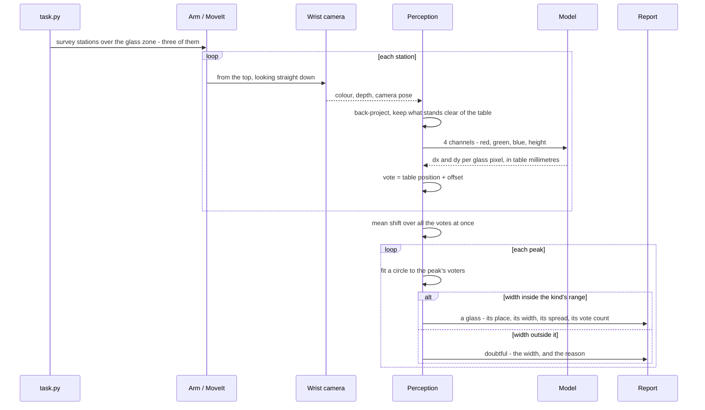
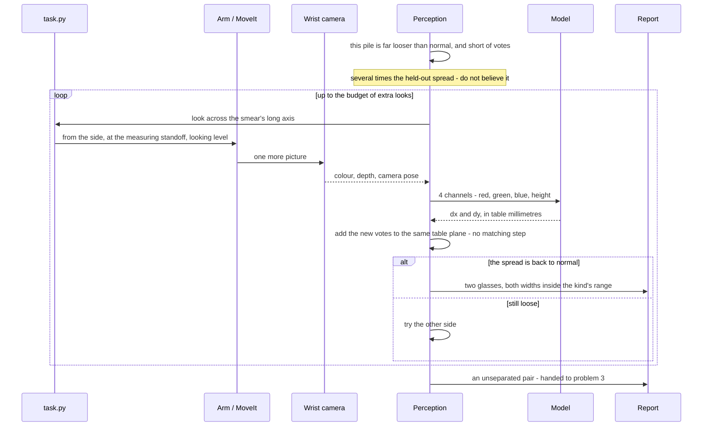

# Solution 8 — per-pixel votes for the centre

*Learned, as the decider. A network that says, at every object pixel, which way
that pixel's own object centre lies — so telling two objects apart becomes
counting the places the arrows point at.*

> **The cell is described once, in [the cell](../../the-cell.md)** — the layout,
> the two places the camera works from, from the top and from the side, all four
> sensors, and the words this project uses them with. What follows is only what
> is specific to this solution.

## In one paragraph

A network that labels each pixel "glass" or "not glass" cannot separate two
glasses that touch. A class label has nowhere to record *which* glass. So ask
for a different output: at each glass pixel, a short arrow pointing to the
middle of its own glass. Add that arrow to the pixel's own position and you have
a vote. One glass makes one pile of votes; two glasses make two. Predict the
arrow **in table millimetres** rather than image pixels, and the camera drops
out of the problem. The spread of a pile is a confidence, and a loose pile is a
reason to look again.

## The problem this solves

Four to six glasses stand on the table. They are all the same kind, the kind is
known, and they are solid, so the depth camera sees them. The job is to say
**which pixels belong to which glass**, give each glass a position on the table
in millimetres, and give each a rough footprint width. Nothing is picked up and
no profile is measured here.

Two different things defeat the obvious methods, and this solution is aimed at
the second.

**In the picture, outlines overlap.** If the camera is roughly in line with two
glasses, the near one covers part of the far one and the two outlines join.

A **mask** — a picture the same size as the photograph, where every pixel is
just yes or no, yes meaning "this is glass" — then shows one joined patch. The
step that turns a mask into separate objects is **connected components**, also
called a flood fill: take a yes pixel nobody has visited, spread out to every
yes pixel touching it, call that patch one object, and repeat. It answers
exactly one question, *are these pixels joined?* And joined is what the two
outlines are.

**On the table, the points can be too close to group.**
[Solution 2](02-cluster-on-the-table.md), *cluster on the table*, avoids the
picture entirely. Every pixel with a depth reading becomes a point in the room,
the points standing clear of the table but below the tallest glass the cell
accepts are kept, and points closer together than a chosen **grouping distance**
go in the same group.

That distance has to satisfy two demands at once. It must be **larger** than the
biggest hole inside one glass's own points, or one glass comes back as two. And
it must be **smaller** than the strip of bare table between two glasses, or two
come back as one. At the spacing problem 2 guarantees, there is plenty of
daylight between those two limits and the choice barely matters. As the glasses
close up, the window narrows. When two glasses touch, it shuts completely:
**no** grouping distance keeps them apart and keeps each of them whole.


The middle panel has no seam between the two outlines for anything to find. The
right panel shows what the next step is handed: **a single object far wider than
any glass of this kind can be**. The range check notices that much. But noticing
is all it can do, because nothing in a class map says *where* to cut — every
pixel carries the same label, "glass", and a label that is the same everywhere
cannot mark a boundary.

More training does not rescue a class map.

**Semantic segmentation** labels every pixel with a class. **Instance
segmentation** labels every pixel with a class *and* with which object it
belongs to. Problem 2 asks for the second. A perfectly trained class map still
merges touching glasses, because "glass" is the only value the answer has room
to hold.

The fix is not a better network. It is a **different output**.

## How it works, end to end


Read it left to right. The network is involved in one stage only, and everything
before and after it is arithmetic the project already has.

### The setup

The table top's height is a constant, and every height in this cell is measured
up from it. The arm is bolted to the table's near edge and reaches out across
it.

The glasses stand in the **glass zone**, a rectangle of table a little wider
than it is deep, on the far side of the table from the rack — which is
deliberate, so that a picture of the glasses never has the rack in the back of
it.

Four to six glasses stand there, all of one kind, upright, solid, and never
closer than the smallest gap problem 2 promises. The camera is on the wrist,
offset a little to one side of the tool flange so that the fingers stay out of
shot — which also means that aiming the camera means moving the whole arm.

**Known in advance:** the table's height, the camera's lens, the camera's pose
at any instant from the arm's joint angles, and the kind, which carries a range
of footprint diameters. **Not known:** how many glasses there are, where they
stand, or where in its kind's range each one falls.

The rule that governs this repository is why that last one is unknown. No
glass's size is written down anywhere, so every size is measured during the run.

### The pictures

The survey works **from the top**: the camera high above the table top, looking
straight down. The lens spreads a fixed angle over a fixed number of pixels, so
how much table one picture covers, and how much table one pixel covers, both
follow from the height and nothing else.

That height is where two pressures balance. Go lower and a pixel is finer, but
each picture covers less table, so the survey needs more stations and the arm
makes more moves. Go higher and the whole zone fits into fewer pictures, but a
footprint is then measured in coarser steps.

The cell only trusts the part of a station's picture that **both** halves of its
pair share, and that shared part is smaller than a whole picture in both
directions — the sideways slide takes some off one axis, and the gripper's
widest opening eats into both. Spread what is left over the glass zone with
enough overlap that nothing lands only on an edge, and it comes to **three
stations**, two pictures each. All of that is computed from the cell's own
constants, and the code logs the same figures when it runs.

This solution needs only one picture per station, because depth already gives it
the range that the pair exists to supply. But the second picture of each pair is
taken anyway, so it is a free extra viewpoint for no extra arm motion, and it is
used rather than thrown away. The reason it can be used so easily is under *Cast
the vote* below: votes from different pictures pool together with no matching
step at all.

One further pose appears, and only when the solution is unsure: **from the
side**, standing back from a glass at the measuring standoff and looking level.
That is the pose problem 1's step 2 already uses to measure a profile, so
nothing new has to be built to get there.

### What each picture captures

The wrist sensor is an RGB-D camera, colour and depth through one lens, several
frames a second. Each capture returns three things:

- **a colour picture**, small, three channels;
- **a depth picture** the same size, one number per pixel, with a near limit and
  a far limit. Note that it is the distance measured *along the lens axis*, not
  along the slanted ray to that particular pixel, which matters for a pixel well
  off the middle of the frame;
- **the camera's pose** when the shutter fired, worked out from the joint
  angles, in the same frame the table is in.

The **mask is not captured — it is computed.** Back-project every pixel that has
a depth reading, subtract the table height, and keep the pixels that stand clear
of the table but below the tallest glass this cell handles. The lower limit
clears the table's own depth noise; the upper one is a limit on what the cell
will accept, not the size of any glass.

So the mask costs nothing and learns nothing. That is worth pausing on. Solution
7, *a segmenter trained from scratch*, spends a whole network deciding
glass-or-not, and gets back a class map that cannot separate. Here the geometry
answers the easy question for free, and the network is left with only the hard
one.

### What is interpreted, and how

Seven steps, in order.

**1. Back-project.** For a pixel at column u, row v with depth Z, the point in
the camera's own frame is X = (u − cx) Z / fx, Y = (v − cy) Z / fy, Z. The
camera pose then turns those three numbers into a point in the room.

Every masked pixel now has a position on the table, in millimetres from the
arm's base, before the network has been asked anything at all.

**2. Build the input.** Four channels the size of the picture: red, green, blue,
and **height above the table**. Height rather than raw depth, because height
means the same thing from every viewpoint, and raw depth does not.

**3. Predict the offset.** A small U-Net returns two channels the same size: dx
and dy, **in table millimetres**, being the step from this pixel's own table
position to the footprint centre of the glass it belongs to.

That one decision — millimetres on the table rather than pixels in the picture —
is what the rest of the solution is built on.


The left panel is the trouble with offsets measured in pixels. **The same glass,
the same real displacement, photographed from twice as far away, is half as many
pixels.** So a network predicting pixel offsets has to learn how that number
shrinks with distance — which is to say, it has to learn the camera before it
can learn anything about glasses.

And it is not only a problem between one picture and the next. **Inside a single
picture from the top**, the table is the full camera height away from the lens
while the rim of a tall glass has climbed most of the way towards it. So the
correct pixel offset varies by a large factor *within one photograph*. Measured
on the table, it does not vary at all.

Millimetres also put a hard limit on what the network ever has to predict. An
offset runs from a pixel to the centre of its own glass, so **the longest offset
that can ever occur is half the widest footprint the kind allows**. Every
training target is therefore a pair of numbers inside a small, known box. A
target that is bounded and does not depend on the camera is far easier to fit
than an unbounded one, and it is the main reason a small network is plausible
here at all.

**4. Cast the vote.** Add the offset to the pixel's own table position. Two
numbers per pixel become one dot on the table: where that pixel thinks its
glass's middle is.


The right-hand panel is the whole argument. The two sets of pixels touch — there
is no gap anywhere along the dashed line — and it does not matter, because what
changes at the seam is not the pixels but the **direction** the arrows point.

**Nothing has to find a boundary, so nothing can get one wrong.** A glass seen
from the top casts one vote for every pixel of its outline — well over a
thousand of them. A handful of those pointing the wrong way are a handful of
strays among thousands, and a pile of thousands does not care.

And because a vote is a place on the table rather than a place in a picture,
votes from two photographs taken from two positions land in the same frame, and
are grouped together with no matching step at all. That is what makes both the
second picture of each pair and the feedback loop below cheap.

**5. Find the piles.** Each glass should make one tight pile of dots, so the
question is where the dots pile up.

The method is **mean shift**. Put a circular window of fixed radius down on a
dot, move the window to the average position of the dots inside it, and repeat
until it stops moving. Each move is a step uphill towards thicker dots. Run it
from every dot, and dots whose windows stop in the same place are one pile.

Counting glasses has become counting distinct stopping places. And, unlike
k-means, nothing has to be told how many to expect — which matters, because the
count is the answer.


The left two panels are the raw signal: one thick patch of votes for one glass,
two for two. The right panel shows eight windows started at eight different
votes, each walking uphill and stopping, with the dashed circles marking each
window at its resting place.

There is exactly **one number to choose**, the window radius, and it can be
pinned from both ends before anything is run.

*The floor is the spread of the votes themselves.* The votes for one glass do
not land on a single point; they scatter around the true centre, and that
scatter can be measured on held-out renders where the truth is known. A window
much smaller than that scatter fits *inside* one pile, so it climbs some local
lump within the pile rather than the pile as a whole — and one glass comes back
as several peaks.

*The ceiling is how close two centres can ever be.* The worst case is two of the
narrowest glasses this kind allows, pressed rim to rim: then their centres are
one footprint apart, and nothing can bring them closer. A window whose radius
reaches much more than half of that covers **both** centres at once, and the two
piles merge into one.

So the workable band runs from a little above the vote scatter to a little below
half the narrowest possible centre gap, and there is comfortable room between
the two. The chosen radius sits inside that band with room on either side.

It is worth seeing what a careless choice would cost. A window large enough to
span the narrowest possible centre gap swallows two centres whole. It would
merge exactly the pairs this solution exists to separate — and it would do it
**silently**, because a merged pile looks perfectly tight and complains about
nothing.

Unlike solution 2's grouping distance, this number compares **centre-to-centre**
distances rather than edge-to-edge gaps. That is the only reason a workable
value exists when the glasses touch. The gap between two edges can be zero. The
distance between two centres cannot.

One practical note. Six glasses, each seen from three stations with two pictures
at each, cast tens of thousands of votes between them. Running a window from
every one of them means comparing every vote with every other vote on every
step, which is far more arithmetic than the job actually needs. Seed the windows
from a few hundred votes drawn at random instead. **A pile of thousands is found
just as reliably from a sample of it**, and every vote is still assigned at the
end by which peak it is nearest — so nothing is lost.

**6. Fit a circle, and let the arithmetic decide.** Each pile's voters — the
pixels, at their own table positions — are fitted with solution 2's
least-squares circle, which returns a centre, a diameter and a residual. A pile
whose fitted width falls outside the range this kind of glass can be is not
reported as a glass, whatever the votes may say.

The network proposes; the geometry disposes.

**7. Hand each pile its pixels.** Every vote came from a pixel, so the pixels
whose votes climbed to one peak are that glass's mask. The separation of one
object from another falls out of the grouping, rather than being a separate
step.

A vote that reaches no peak with enough voters behind it belongs to no glass,
and its pixel is dropped rather than forced into the nearest mask. A pixel the
network could not place is exactly the pixel a nearest-peak rule would place
wrongly.

### What comes out

For each glass the solution is willing to report:

- **a mask** — which pixels of which picture are that glass and not another;
- **a position** on the table, in millimetres from the arm's base: the x and y
  of the pile's peak;
- **a footprint diameter**, in millimetres, from the circle fitted to its
  voters;
- **two numbers saying how much to believe it** — the pile's vote count, and how
  far its votes sit from its own peak on average.

And for each pile it is not willing to report: the position, the reason, and
whether another look would help.

Units are worth stating once. The code carries metres, because that is what ROS,
the robot model and the depth frames use. The report converts to millimetres,
because that is the resolution the answers are meaningful to. Every figure in
this document is in millimetres unless it is written with a decimal point and an
m after it.

The report receives all of it. Problem 1's step 2 receives the positions and
widths and measures each glass's profile from the side. Anything still
unseparated once the loop below has run is handed to [problem
3](../../problem-3/problem.md), which is allowed to move things — in the same
form every other solution here uses to report an unseparated pair.

## The sequence

The normal path: three stations, one network pass per picture, one mean shift
over every vote from every picture, and a circle fit that has the last word.



The interesting path: a pile too loose or too thin to believe, the extra look it
asks for, and the refusal if that does not settle it.



## In pseudocode


Green is new code written for this solution — the network, the vote arithmetic
and the peak-finding. Blue is code the project already has. Grey is a
third-party library.

```text
stations = survey_stations(GLASS_ZONE, shared)           # have  · work_cell.arm.dimensions
votes, stood, source = [], [], []                        # NEW   · python
for station in stations:                                 # have  · work_cell.task
    rgb, depth, pose = arm.look_down_from(station)       # have  · work_cell.task
    points = backproject(depth, pose, K)                 # have  · work_cell.glasses.perception
    height = points[:, 2] - TABLE_TOP_Z                  # have  · work_cell.table.layout
    mask = standing_on_the_table(height)                 # have  · work_cell.glasses.detect
    dx, dy = unet(stack(rgb, height))                    # NEW   · torch, ~200 lines
    stood += points[mask, :2]                            # NEW   · numpy
    votes += points[mask, :2] + stack(dx, dy)[mask]      # NEW   · numpy
    source += pixels_of(mask, station)                   # NEW   · numpy
peaks, members = mean_shift(votes, radius=WINDOW)        # NEW   · ~40 lines, numpy only
for peak, voters in zip(peaks, members):                 # NEW   · python
    centre, diameter, rms = fit_circle(stood[voters])    # have  · numpy.linalg.lstsq
    spread = rms_distance(votes[voters], peak)           # NEW   · numpy
    if not kind.accepts(diameter) or too_few(voters):    # have  · work_cell.glasses.spec
        report.doubtful(peak, diameter, spread)          # have  · work_cell.report
    elif spread > LOOSE * HELD_OUT_SPREAD:               # NEW   · calibrated once
        look_again(across=long_axis(votes[voters]))      # have  · work_cell.task
    else:
        report.glass(peak, diameter, source[voters])     # have  · work_cell.report
```

The libraries, and whether adding one is a decision that has to be taken:

| Library | What it does here | Licence | In the pixi environment? |
| --- | --- | --- | --- |
| [NumPy](https://numpy.org/) | back-projection, the vote arithmetic, mean shift, the circle fit | BSD-3-Clause | **Yes** |
| [OpenCV](https://opencv.org/) | frames into arrays, and the report's annotated pictures | Apache-2.0 from 4.5 | **Yes** |
| [Matplotlib](https://matplotlib.org/) | the diagram scripts beside this document | PSF-style, BSD-compatible | **Yes** |
| [Gazebo Harmonic](https://gazebosim.org/) | renders every training scene, with its per-object masks and positions | Apache-2.0 | **Yes** |
| [PyTorch](https://pytorch.org/) | trains and runs the U-Net, on the **MPS** backend, which is its route to Apple's GPU — there is no NVIDIA card here and nothing needs one | BSD-3-style ([licence](https://github.com/pytorch/pytorch/blob/main/LICENSE)) | **No** — it would have to be added to `pixi.toml` |
| [scikit-learn](https://scikit-learn.org/) | [`sklearn.cluster.MeanShift`](https://scikit-learn.org/stable/modules/generated/sklearn.cluster.MeanShift.html), if we choose not to write our own | BSD-3-Clause | **No** — and avoidable: mean shift over a few thousand points in two dimensions is about forty lines of NumPy, which the diagram script beside this document demonstrates |

[SciPy](https://scipy.org/) is not in the environment either, and nothing here
needs it.

## A worked example

Everything below follows from the cell's own constants and nothing else.

**The scale.** Seen from the top at the survey height, one pixel covers a
millimetre or two of table. So a glass's footprint is a few tens of pixels
across, and its outline covers a disc of that width — well over a thousand
pixels. **That is over a thousand votes per glass**, which is the number to keep
in mind for everything that follows.

**The case that defeats clustering.** Take two glasses of one kind standing much
closer together than the cell allows, so that the strip of bare table between
their rims is narrower than solution 2's grouping distance.

The chain crosses that strip, so the two sets of points come back as **one
group**. The merged group spans both glasses plus the gap, which is far wider
than any single glass of this kind can be. So solution 2's range check fires
correctly — but it fires on a blob it has no way whatever to divide.

**What the votes do.** The *pixels* of the two glasses are exactly as merged as
before; nothing has changed about them. Their *votes* are not. Each glass's
pixels point inwards at their own glass's centre, so the votes land in two piles
whose separation is the full centre-to-centre distance — comfortably more than
the mean-shift window can span, so the two piles stay two. Both piles are tight,
with a spread inside the held-out figure. Circle fits on the two sets of voters
come back inside the kind's range.

Two glasses, two positions, two masks, two widths, from a picture in which the
pixels themselves never came apart. **That is the whole idea of this solution in
one example.**

**The case that defeats voting.** Now stand one glass mostly behind another, so
that only a crescent down one side of it is ever visible.

It contributes a small fraction of the votes it should, and — worse — every one
of them comes from that same crescent. So the votes **agree with each other and
are wrong in the same direction**, which is exactly what a one-sided view does.
The pile lands noticeably off the true centre, and its spread comes out several
times the held-out figure.

Notice that the vote count and the spread both complain, independently, and that
neither of them is the network's own opinion of itself. They are measurements of
the votes.

**What that costs to fix.** The spread is over the threshold, so the arm takes
one more picture: **from the side**, standing back at the measuring standoff,
looking level, across the line joining the two glasses. Standing that much
closer, each pixel covers far less, so the glass fills more of the frame than it
did from the top — more pixels on the glass, from a direction where nothing is
in front of it. Its votes come back to a normal spread, and the peak lands where
it should.

**What that costs in time.** Running the network on a picture costs
milliseconds. Moving the arm to the new pose and letting it settle costs
seconds. The whole design of the loop follows from that ratio: compute freely,
move rarely.

## The network and the training data

**In:** four channels the size of the picture — red, green, blue, and height
above the table. **Out:** two channels the same size, dx and dy, in table
millimetres.

**Shape:** a small U-Net (Ronneberger, Fischer and Brox,
[arXiv:1505.04597](https://arxiv.org/abs/1505.04597)). A U-Net halves the
picture repeatedly while widening it, so that later layers see a large part of
the scene, then doubles it back to full size, with each level on the way down
copied across to the matching level on the way up so that fine detail is not
lost.

Seeing a large part of the scene is exactly what this task needs: **a pixel
cannot possibly know where its glass's middle is by looking only at itself.** It
has to see enough of the glass around it to tell which way the middle lies.

**The size and depth of the network are not settled.** Solution 7 works out a
plausible size for a similar shape by arithmetic on the layer widths, but
whether that is the right size for *this* job is something to measure rather
than to assert. The receptive-field warning in solution 7 applies here with more
force, not less, because this network has to see the whole of a glass at once.

**Loss:** smooth L1 on dx and dy, in millimetres, **over object pixels only**.

*Smooth L1*, also called the Huber loss, scores a small mistake by its square
and a large one by its size. Squaring small errors makes the fit precise where
it is nearly right; not squaring large ones stops a handful of wild pixels
dominating every update. Pixels near an edge, where a pixel may genuinely belong
to either glass, are exactly the wild ones.

*Over object pixels only* is not a detail either. Most pixels in a survey
picture are table, and a table pixel has no correct offset — there is no object
for it to point at. So the loss is multiplied by the mask before it is added up,
and the network is scored only where the question has an answer.

**The labels are arithmetic, not annotation.** Gazebo already knows, per object,
which pixels are which and where each object stands. For a pixel inside glass
*k*'s mask, the target is *k*'s footprint centre minus that pixel's own table
position. No annotator means no annotator error, and no limit on how many scenes
can be made beyond the time it takes to render them.

**Spawn the hard case.** The cell's own rule keeps glasses a comfortable
distance apart, and a training set drawn only from that rule never once shows
the network a pair that a page of clustering code could not already separate.
The teaching has to happen on pairs standing far closer than the rule allows,
and on pairs actually touching. **Keep the easy case too**, in proportion —
otherwise the network quietly learns that there is always a pair to find.

**Randomise everything that is not shape.** A simulator will render the same
table under the same light for ever, and a network given a constant will use it
as a clue. Domain randomisation (Tobin et al.,
[arXiv:1703.06907](https://arxiv.org/abs/1703.06907)) varies lighting, textures,
glass tint, camera pose, exposure, image noise, depth noise and dropout, and the
number and placement of glasses, so that shape is the only thing left that
predicts the answer. This matters even though the system will only ever run in
Gazebo, because this cell's own lighting and table will change during the
project's life.

## The feedback loop

**The doubt is free.** How far a pile's votes sit from its own peak, averaged,
is a per-glass confidence that costs one line to compute.

It needs calibrating once: run the trained network over held-out renders where
the truth is known, and record what that spread looks like when the answer is
right. Every threshold below is a multiple of that figure, not a constant
somebody chose.


Three shapes, three actions — and the important point is that the shape says not
only *whether* to look again but *where*.

**Tight.** At or below the held-out figure. The pile is one glass: fit the
circle, check the diameter against the kind's range, report it, move on.

**Two knots inside one pile.** The votes have split into two tight lumps. That
is two glasses, and it has already said where both of them are. Propose the
split, then check it: accept it only if **both** fitted circles land inside the
kind's range. If only one does, the split is not believed, and the pair is
reported doubtful rather than guessed at.

**One broad smear, with no lump sharper than the rest.** This is the network
saying it does not know, and re-running the grouping will not manufacture an
answer that is not in the data.

**An unsure pile is a reason to take another picture**, and the smear says which
one. A smear almost always has a long axis, and that axis is the direction along
which the evidence is thin. Look **across** it, square to the long axis, from
the side at the measuring standoff. Note that there is **no search over
candidate viewpoints** here at all — the vote cloud names the direction by
itself, and geometry the project already has turns a direction into a reachable
pose.

**Too few votes, whatever the spread.** A fourth case, checked separately,
because the spread does not catch it.


The two curves are shapes to expect, not measurements. Only the two marked
points come from the worked example above, and both thresholds are figures to
calibrate on held-out renders.

A heavily hidden glass votes only from a crescent, and those votes can agree
very closely with each other while being **wrong together**. So a pile built
from a small fraction of the votes a whole glass should give is doubtful on
count alone, however tight it looks. This is the one check that catches
confident agreement between witnesses who all stood in the same wrong place.

**What the second picture buys.** Because the votes are places on the table and
the camera pose is known, the new picture's votes go into the same plane as the
old ones. There is no matching problem to solve and no pairing of regions
between views. The piles simply get more voters from a better angle. That is a
direct consequence of voting in table coordinates, and it would not be available
if the offsets were in pixels.

**The budget.** Arm motion is by far the most expensive resource in this cell,
so the loop is capped: two extra looks per doubtful pile, then stop. A pile
still doubtful after that is **reported as an unseparated pair**, with its
position and the reason, and handed to problem 3.

That is a result, not a failure. The rule the whole project runs on applies here
too: anything doubtful is reported, never guessed.

## What it needs

**From the cell**, all of which exists: the wrist depth camera, the known table
height, and the camera pose from the arm's joint angles.

**Software:** the table above. Two of the six entries, PyTorch and scikit-learn,
are not in this project's environment, and scikit-learn is avoidable.

**Data.** Rendered scenes with per-object masks and positions, weighted towards
close and touching pairs. A few thousand is the order of magnitude to aim at,
and **how many is actually enough is not known**. It is the first thing to
measure.

**Time.** Not known, and to be measured rather than estimated: time one pass
over the data on this machine and multiply, and expect some operations to fall
back to the CPU on MPS. The target is hours, not days, because a method that
cannot be retrained in an afternoon will not be iterated on.

**To build, on top of *cluster on the table*:** a label generator, a training
script, a version-pinned weights file, and the peak-finding.

## Where it is strong and where it breaks

**Strong**

- **It separates glasses that touch** — no gap is needed, only some pixels on
  each. It is the one method on these pages that survives problem 2's spacing
  rule being withdrawn altogether, which is [problem
  3](../../problem-3/problem.md)'s input.
- **Arithmetic still decides.** Every pile still faces solution 2's circle fit
  and the range of widths the kind allows.
- **The mask is free**, because the table height is known, so the network never
  has to spend capacity on the easy question.
- **It degrades by votes, not by pixels.** A handful of wrong votes are strays
  among thousands and change nothing, whereas one badly placed seam rejoins two
  objects completely.
- **Free confidence, and it points somewhere**: a pile's spread, and the smear's
  long axis.
- **Votes from several pictures pool** with no matching step.

**Breaks**

- **It is the wrong tool at the spacing problem 2 actually guarantees.** A page
  of clustering code does that job, with no weights file to maintain.
- **It learns the renderer.** Randomisation narrows the gap; with no real data,
  nothing checks that it closed.
- **A wrong table height is silent.** It moves the votes and the peak together.
- **The weights hold a size-shaped prior** — this kind's radius in millimetres —
  against the repository's rule that no size is written down.
- **No depth, no votes**, so real glassware ends it. Naming the kind is problem
  4.
- **A merge is the quiet failure**, caught only by the arithmetic afterwards: a
  fitted width past the kind's cap, and roughly twice as many votes as one glass
  should give. A split, by contrast, is loud — both circles come out far too
  small to be glasses.
- **The count is checked separately from the spread**, on purpose. A crescent's
  votes agree with each other and are wrong together, so a pile short of votes
  is disbelieved however tight it looks.

## The general methods behind this

Voting for a centre is one of the oldest ideas in computer vision, and the
learned version changes only where the votes come from. The other half of the
solution — turning a cloud of votes into objects — is a standard grouping method
with a useful property.

### The Hough transform — local evidence for a global claim

A single edge pixel cannot say where a shape is, but it can vote for every shape
that would explain it. Add up the votes, and the peaks are the shapes really
present. Hough's 1962 patent did it for straight lines in bubble-chamber
photographs, and the **generalised Hough transform** (D. H. Ballard, *Pattern
Recognition*, 1981) extended it to any shape at all, by replacing the equation
with a lookup table of offsets.

- **Mostly used for** finding shapes that can be written as an equation, in
  noisy cluttered pictures where much of the outline is missing: lines, circles
  and ellipses in inspection, document analysis, and lane finding. Voting is
  naturally robust to things being hidden, because the visible part still votes
  correctly.
- **Rarely right for** shapes with many parameters, because the table of votes
  grows explosively with them. Also poor when a learned detector is available
  and the shape has no clean equation.
- **More:** [Hough transform](https://en.wikipedia.org/wiki/Hough_transform);
  [generalised Hough
  transform](https://en.wikipedia.org/wiki/Generalised_Hough_transform).

### Learned voting — replacing the lookup table with a model

**Hough forests** (Gall and Lempitsky, CVPR 2009) first replaced the hand-built
offset table with a learned one: patches vote for an object centre, and a random
forest decides how. The neural descendants apply the same structure to points
and pixels. **VoteNet** ([arXiv:1904.09664](https://arxiv.org/abs/1904.09664))
has points from a depth sensor vote for object centres, and **PVNet**
([arXiv:1812.11788](https://arxiv.org/abs/1812.11788)) has pixels vote for
landmark points when working out an object's orientation — specifically because
voting survives things being hidden.

- **Mostly used for** finding objects and their orientation when much is hidden
  and the scene is cluttered: bin picking, crowded scenes. A method needing the
  whole object visible fails there, and a method needing only a fraction does
  not.
- **Rarely right for** objects with no well-defined centre, or where the offsets
  are large compared with the picture, since the number the network has to
  predict grows and the votes scatter.

### Per-pixel offsets as a way to separate objects

The general problem this solves: a class map has nowhere to record *which*
object a pixel belongs to. Predicting an arrow per pixel — towards its own
object's centre — is one of two standard answers. The other is to have the
network give each pixel a made-up identity code and group those instead
(**associative embedding**, Newell et al.,
[arXiv:1611.05424](https://arxiv.org/abs/1611.05424)).

Offsets fail more gently than predicting boundaries, because one bad pixel in a
seam rejoins two objects, whereas one bad vote is outvoted.

- **Mostly used for** separating objects and finding their orientation from the
  pixels up, and favoured where objects are numerous and overlapping, since
  nothing depends on a box round them.
- **Rarely right for** scenes with few, well-separated objects, where finding
  the objects first and then outlining each one — as Mask R-CNN does — is
  simpler and stronger.

### Mean shift — finding peaks without being told how many

Slide a window to the average of the points inside it, and repeat until it stops
moving. Every starting point that ends in the same place belongs to one peak
(Comaniciu and Meer, *PAMI*, 2002). Unlike k-means it does not need the number
of groups in advance, which is the whole point here: the number of groups *is*
the answer.

- **Mostly used for** finding peaks when the count is unknown: tracking, colour
  segmentation, and exactly this job of turning a cloud of votes into objects.
- **Rarely right for** data with many dimensions, where it is slow and the
  window size becomes impossible to choose, and for groups of very different
  densities, where one window size cannot serve both.
- **More:** [mean shift](https://en.wikipedia.org/wiki/Mean_shift);
  [`sklearn.cluster.MeanShift`](https://scikit-learn.org/stable/modules/generated/sklearn.cluster.MeanShift.html).
