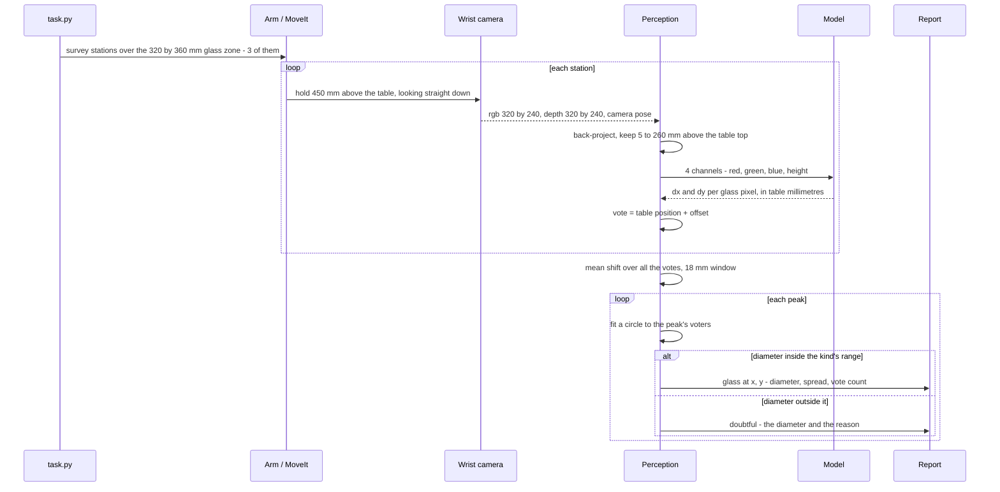
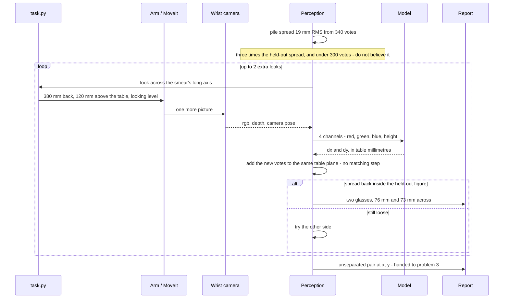
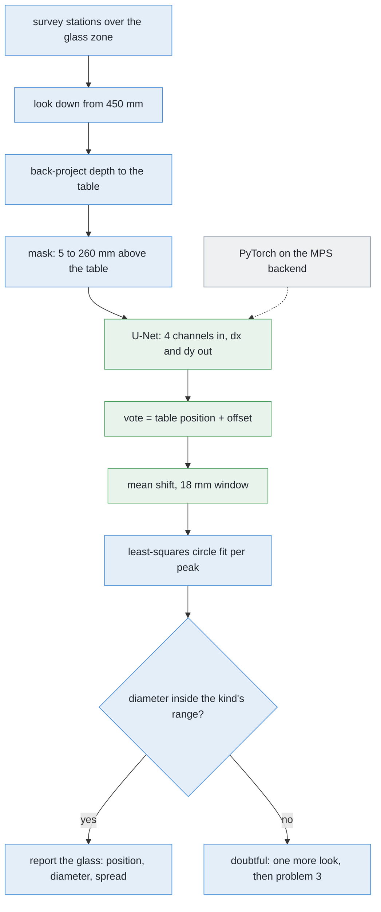

# Solution 8 — per-pixel votes for the centre

*Learned, as the decider. A network that says, at every object pixel, which way
that pixel's own object centre lies — so telling two objects apart becomes
counting the places the arrows point at.*

## In one paragraph

A network that labels each pixel "glass" or "not glass" cannot separate two
glasses that touch: a class label has nowhere to record *which* glass. So ask
for a different output: at each glass pixel, a short vector pointing to the
middle of its own glass. Add it to the pixel's position and you have a vote.
One glass makes one pile of votes, two make two. Predict the vector **in table
millimetres** rather than image pixels, and the camera drops out. The spread of
a pile is a confidence, and a loose pile is a reason to look again.


## The problem this solves

Four to six glasses stand on the table. They are all the same kind, the kind is
known, and they are opaque, so the depth camera sees them. The job is to say
**which pixels belong to which glass**, give each glass a position on the table
in millimetres, and give each a rough footprint width. Nothing is picked up and
no profile is measured here.

Two different things defeat the obvious methods, and this solution is aimed at
the second.

**In the picture, silhouettes overlap.** If the camera is roughly in line with
two glasses, the near one covers part of the far one and the two outlines join.
A **mask** — a picture the same size as the photograph where every pixel is
just yes or no, yes meaning "this is glass" — then shows one joined patch. The
step that turns a mask into separate objects is **connected components**, also
called a flood fill: take a yes pixel nobody has visited, spread out to every
yes pixel touching it, call that patch one object, repeat. It answers exactly
one question, *are these pixels joined?*, and joined is what the two
silhouettes are.

**On the table, the points can be too close to group.**
[Solution 2](02-cluster-on-the-table.md), *cluster on the table*, avoids the
picture entirely: every pixel with a depth reading becomes a point in the room,
points 5 to 260 mm above the table top are kept, and points closer together
than a chosen **grouping distance** go in the same group. That distance has to
satisfy two demands at once. It must be **larger** than the biggest hole inside
one glass's own points, or one glass comes back as two, and **smaller** than the
gap between two glasses, or two come back as one. With the glasses 150 mm
apart, anything between about 10 and 100 mm works and the choice does not
matter. As they close up the window of workable numbers narrows, and when two
glasses touch it shuts: no grouping distance keeps them apart and keeps each of
them whole.


The middle panel has no seam between the two silhouettes to find, and the right
panel shows what the next step is handed — a single object 164.5 mm across,
when this kind of glass is never more than 90 mm. The check notices. It cannot
fix anything, because nothing in a class map says *where* to cut.

More training does not rescue a class map. **Semantic segmentation** labels
every pixel with a class. **Instance segmentation** labels every pixel with a
class *and* with which object it belongs to. Problem 2 asks for the second. A
perfectly trained class map still merges touching glasses, because "glass" is
the only value the answer it was asked for has room to hold. The fix is not a
better network. It is a **different output**.

## How it works, end to end


Read it left to right. The network is involved in one stage only, and
everything before and after it is arithmetic the project already has.

### The setup

The table top is 750 mm off the floor and 1.60 by 1.40 m, and the arm is bolted
to its near edge and reaches out along +x. Every height in this cell is measured
from that top. The glasses stand in a zone 320 by 360 mm — from 320 to 640 mm
out along x, and from −440 to −80 mm along y — which is the far side of the
table from the rack, so a picture of the glasses does not have the rack in the
back of it.

Four to six glasses stand there, all of one kind, upright, opaque, and at least
150 mm apart. The camera is on the wrist, 85 mm to one side of the tool flange
so the fingers stay out of shot, which means that aiming the camera means moving
the whole arm.

**Known in advance:** the table's height, the camera's lens, the camera's pose
at any instant from the arm's joint angles, and the kind, which carries a range
of footprint diameters. **Not known:** how many glasses there are, where they
stand, or where in its kind's range each one falls. The rule that governs this
repo is why that last one is unknown — no glass's size is written down
anywhere, so every size is measured during the run.

### The pictures

The survey looks straight down from 450 mm above the table top. With
fx = fy = 277.1 pixels and a 320 by 240 frame, one picture from there covers
450 × 320 / 277.1 = **520 mm** by 450 × 240 / 277.1 = **390 mm** of table, and
one pixel covers 450 / 277.1 = **1.62 mm** of it.

That height is where two pressures balance. Lower, and a pixel is finer but each
picture covers less table, so the survey needs more stations and the arm makes
more moves. Higher, and the zone fits in fewer pictures but a footprint is
measured in coarser steps.

The cell only trusts the part of a station's picture that both halves of its
stereo pair share, which leaves 425 by 175 mm once the 120 mm baseline and the
widest opening the gripper has are taken off. Spread over the 320 by 360 mm
zone with 35 per cent overlap, that comes to **three stations**, two pictures
each: six pictures for the table. (All of that is computed from the cell's own
constants, and the code logs the same figures when it runs.)

This solution needs only one picture per station, because depth gives it the
range that the stereo pair exists to supply. The second picture of each pair is
taken anyway, so it is 120 mm of extra viewpoint for no extra arm motion, and it
is used rather than discarded — for the reason given under *Cast the vote*
below, votes from different pictures pool with no matching step.

One further pose appears, and only when the solution is unsure: 380 mm back from
a glass, looking level from 120 mm above the table. That is the pose problem 1's
step 2 already uses to measure a profile, so nothing new has to be built to get
there.

### What each picture captures

The wrist sensor is an RGBD camera with a 1.047 rad horizontal field of view,
running at 15 Hz. Each capture returns three things:

- **colour**, 320 by 240, eight bits a channel;
- **depth**, 320 by 240, one float a pixel, clipped at 50 mm and 3.0 m. It is
  the distance along the lens axis, not along the ray, which matters for a pixel
  well off the middle of the frame;
- **the camera's pose** when the shutter fired, read from the joint angles
  through the robot model, in the same frame the table is in.

The **mask is not captured — it is computed.** Back-project every pixel that has
a depth reading, subtract the table height, and keep the pixels between 5 and
260 mm above the top: 5 mm to clear the table's own depth noise, 260 mm because
that is the tallest glass this cell handles. So the mask costs nothing and
learns nothing. That is worth pausing on: solution 7, *a segmenter trained from
scratch*, spends a whole network deciding glass-or-not and gets back a class map
that cannot separate. Here the geometry answers the easy question for free, and
the network is left with only the hard one.

### What is interpreted, and how

Seven steps, in order.

**1. Back-project.** For a pixel at column u, row v with depth Z, the point in
the camera's own frame is X = (u − cx) Z / fx, Y = (v − cy) Z / fy, Z; the
camera pose then turns those three numbers into a point in the room. Every
masked pixel now has a position on the table, in millimetres from the arm's
base, before the network has been asked anything at all.

**2. Build the input.** Four channels at 320 by 240: red, green, blue, and
**height above the table**. Height rather than raw depth, because height is the
quantity that means the same thing from every viewpoint.

**3. Predict the offset.** A small U-Net returns two channels the same size: dx
and dy, **in table millimetres**, being the step from this pixel's own table
position to the footprint centre of the glass it belongs to. That one decision —
millimetres on the table rather than pixels in the picture — is what the rest of
the solution is built on.


The left panel is the trouble with image offsets: the same glass and the same
37.5 mm of real displacement is 35 pixels at 300 mm range and 17 pixels at
600 mm, because 300 / 277.1 = 1.083 mm per pixel against 600 / 277.1 = 2.166. A
network predicting pixel offsets has to learn that relationship, which is to say
it has to learn the camera. Nor is it only a between-pictures problem: inside
one survey picture the table is 450 mm from the lens while the rim of a 230 mm
glass is 220 mm from it, so the correct pixel offset varies by a factor of two
within a single photograph. On the table it does not vary at all.

Millimetres also bound the target. Footprints here run 45 to 105 mm across, so
no offset is longer than 105 / 2 = **52.5 mm**, and every training target is a
pair of numbers between −52.5 and +52.5. A bounded, camera-independent target is
a far easier thing to fit than an unbounded one, and it is the main reason a
small network is plausible here at all.

**4. Cast the vote.** Add the offset to the pixel's own table position. Two
numbers per pixel become one dot on the table plane: where that pixel thinks its
glass's middle is.


The right-hand panel is the whole argument. The two sets of pixels touch — there
is no gap anywhere along the dashed line — and it does not matter, because what
changes at the seam is not the pixels but the **direction** the arrows point.
Nothing has to find a boundary, so nothing can get one wrong. A glass 75 mm
across casts roughly 1,700 votes here, and a handful pointing the wrong way are
a handful of strays in 1,700.

Because a vote is a place on the table rather than a place in a picture, votes
from two photographs taken from two positions land in the same frame and are
clustered together with no matching step at all. That is what makes both the
second picture of each stereo pair and the feedback loop below cheap.

**5. Find the piles.** Each glass should make one tight pile of dots, so the
question is where the dots pile up. The method is **mean shift**: put a circular
window of fixed radius down on a dot, move the window to the average position of
the dots inside it, and repeat until it stops moving. Each move is a step uphill
towards thicker dots. Run it from every dot, and dots whose windows stop in the
same place are one pile. Counting glasses has become counting distinct stopping
places — and, unlike k-means, nothing has to be told how many to expect, which
matters because the count is the answer.


The left two panels are the raw signal: one thick patch of votes for one glass,
two for two. The right panel shows eight windows started at eight different
votes, each walking uphill and stopping, with the dashed circles the window at
its resting place.

There is exactly **one number to choose**, the window radius, and **18 mm** is
derivable at both ends.

*The floor is the spread of the votes themselves.* Measured on held-out renders
where the truth is known, a glass's votes sit 6 to 8 mm RMS from its true centre
when the network is right. A window much smaller than twice that fits inside one
pile, so it climbs a local lump rather than the pile as a whole and one glass
comes back as several peaks. That puts the floor at about 16 mm.

*The ceiling is how close two centres can be.* Two footprints of the smallest
diameter this kind allows, 45 mm, pressed edge to edge, have their centres 45 mm
apart. A window whose radius reaches more than about half of that — more than
roughly 22 mm — covers both centres at once, and two piles merge into one.

So the workable band is about 16 to 22 mm, and 18 mm sits inside it with room
either side. It is worth seeing what a careless choice costs. A 30 mm window
spans 60 mm, which swallows two centres 45 mm apart whole: it would merge
exactly the pairs this solution exists to separate, and it would do it silently,
because a merged pile looks perfectly tight.

Unlike solution 2's grouping distance, this number compares **centre-to-centre**
distances rather than edge-to-edge gaps. That is the only reason a workable
value exists when the glasses touch. The gap between two edges can be zero; the
distance between two centres cannot.

One practical note. Six glasses seen from three stations, two pictures each,
cast something like 6 × 6 × 1,700 ≈ 60,000 votes. Running a window from every
one of them compares every vote with every other vote on every iteration, which
is far more arithmetic than the job needs. Seed the windows from a few hundred
votes drawn at random instead: a pile of thousands is found just as reliably
from a sample of it, and every vote is still assigned at the end by which peak
it is nearest.

**6. Fit a circle, and let the arithmetic decide.** Each pile's voters — the
pixels, at their own table positions — are fitted with solution 2's
least-squares circle, which returns a centre, a diameter and an RMS residual. A
pile whose fitted diameter falls outside this kind's range is not reported as a
glass, whatever the votes say. The network proposes; the geometry disposes.

**7. Hand each pile its pixels.** Every vote came from a pixel, so the pixels
whose votes climbed to one peak are that glass's mask. The instance
segmentation falls out of the clustering rather than being a separate step. A
vote that reaches no peak with enough voters behind it belongs to no glass, and
its pixel is dropped rather than forced into the nearest mask — a pixel the
network could not place is exactly the pixel a nearest-peak rule would place
wrongly.

### What comes out

For each glass the solution is willing to report:

- **a mask** — which pixels of which picture are that glass and not another;
- **a position** on the table, in millimetres from the arm's base: the x and y
  of the pile's peak;
- **a footprint diameter**, in millimetres, from the circle fitted to its
  voters;
- **two numbers saying how much to believe it** — the pile's vote count, and its
  RMS spread in millimetres about its own peak.

And for each pile it is not willing to report: the position, the reason, and
whether another look would help.

Units are worth stating once. The code carries metres, because that is what ROS,
the robot model and the depth frames use; the report converts to millimetres,
because that is the resolution the answers are meaningful to. Every figure in
this document is in millimetres unless it is written with a decimal point and an
m after it.

The report receives all of it. Problem 1's step 2 receives the positions and
widths and measures each glass's profile from the side. Anything still
unseparated once the loop below has run is handed to
[problem 3](../../problem-3/problem.md), which is allowed to move things — in
the same form every other solution here uses to report an unseparated pair.

## The sequence

The normal path: three stations, one network pass per picture, one mean shift
over every vote from every picture, and a circle fit that has the last word.



The interesting path: a pile too loose or too thin to believe, the extra look it
asks for, and the abstention if that does not settle it.



## In pseudocode



Green is new code written for this solution — the network, the vote arithmetic
and the peak-finding. Blue is code the project already has. Grey is a
third-party library.

```text
stations = survey_stations(GLASS_ZONE, shared)           # have  · work_cell.arm.dimensions
votes, stood, source = [], [], []                        # NEW   · python
for station in stations:                                 # have  · work_cell.task
    rgb, depth, pose = arm.look_down_from(station)       # have  · work_cell.task
    points = backproject(depth, pose, K)                 # have  · work_cell.glasses.perception
    height = points[:, 2] - TABLE_TOP_Z                  # have  · work_cell.table.layout
    mask = (height > 0.005) & (height < 0.260)           # have  · work_cell.glasses.detect
    dx, dy = unet(stack(rgb, height))                    # NEW   · torch, ~200 lines
    stood += points[mask, :2]                            # NEW   · numpy
    votes += points[mask, :2] + stack(dx, dy)[mask]      # NEW   · numpy
    source += pixels_of(mask, station)                   # NEW   · numpy
peaks, members = mean_shift(votes, radius=0.018)         # NEW   · ~40 lines, numpy only
for peak, voters in zip(peaks, members):                 # NEW   · python
    centre, diameter, rms = fit_circle(stood[voters])    # have  · numpy.linalg.lstsq
    spread = rms_distance(votes[voters], peak)           # NEW   · numpy
    if not kind.accepts(diameter) or len(voters) < 300:  # have  · work_cell.glasses.spec
        report.doubtful(peak, diameter, spread)          # have  · work_cell.report
    elif spread > 3 * HELD_OUT_SPREAD:                   # NEW   · calibrated once
        look_again(across=long_axis(votes[voters]))      # have  · work_cell.task
    else:
        report.glass(peak, diameter, source[voters])     # have  · work_cell.report
```

The libraries, and whether adding one is a decision that has to be taken:

| Library | What it does here | Licence | In the pixi environment? |
| --- | --- | --- | --- |
| [NumPy](https://numpy.org/) | back-projection, the vote arithmetic, mean shift, the circle fit | BSD-3-Clause | **Yes** |
| [OpenCV](https://opencv.org/) | frames into arrays, and the report's annotated pictures | Apache-2.0 from 4.5 | **Yes** |
| [Matplotlib](https://matplotlib.org/) | the diagram scripts beside this document | PSF-style, BSD-compatible | **Yes** |
| [Gazebo Harmonic](https://gazebosim.org/) | renders every training scene, with its per-object masks and positions | Apache-2.0 | **Yes** |
| [PyTorch](https://pytorch.org/) | trains and runs the U-Net, on the **MPS** backend, which is its route to Apple's GPU — there is no NVIDIA card here and nothing needs one | BSD-3-style ([licence](https://github.com/pytorch/pytorch/blob/main/LICENSE)) | **No** — it would have to be added to `pixi.toml` |
| [scikit-learn](https://scikit-learn.org/) | [`sklearn.cluster.MeanShift`](https://scikit-learn.org/stable/modules/generated/sklearn.cluster.MeanShift.html), if we choose not to write our own | BSD-3-Clause | **No** — and avoidable: mean shift over a few thousand two-dimensional points is about forty lines of NumPy, which the diagram script beside this document demonstrates |

[SciPy](https://scipy.org/) is not in the environment either, and nothing here
needs it.

## A worked example

All of the arithmetic below uses only the cell's published numbers.

**The scale.** At 450 mm one pixel covers 1.62 mm of table, so a glass 75 mm
across is 75 / 1.62 = **46 pixels** wide and its silhouette covers roughly a
disc of that width — π × 23² ≈ 1,660 pixels. Call it **about 1,700 votes per
glass**.

**The case that defeats clustering.** Two glasses of a kind whose footprint runs
60 to 90 mm stand 90 mm apart, centre to centre. Their footprints measure 76 and
73 mm, so the gap between their edges is 90 − 38 − 36.5 = **15.5 mm**. At
solution 2's 25 mm grouping distance the two sets of points are one group. The
merged group spans 90 + 38 + 36.5 = **164.5 mm**, or 101 pixels. The kind's
range tops out at 90 mm, so the check fires — but it fires on a blob it has no
way to divide.

**What the votes do.** The pixels of the two glasses are as merged as before;
their votes are not. The piles land at (0.42, −0.31) m and (0.51, −0.30) m from
the arm's base, which is √(90² + 10²) = **90.6 mm** apart — a comfortable
distance for an 18 mm window. Their spreads are 6 and 8 mm RMS, both inside the
held-out figure. Circle fits on the two sets of voters give 76 and 73 mm, both
inside the kind's 60 to 90 mm range. Two glasses, two positions, two masks, two
widths.

**The case that defeats voting.** One glass stands mostly behind another and is
80 per cent hidden. It contributes 0.2 × 1,700 = **340 votes**, and they all
come from one crescent down its visible side. Its pile's centre lands 9 mm from
the truth — the votes agree with each other and are wrong in the same direction,
which is what a one-sided view does — and the pile's spread is 19 mm RMS, about
three times the held-out figure.

**What that costs to fix.** The spread is over the threshold, so the arm takes
one more picture: 380 mm back, looking level from 120 mm above the table, across
the line joining the two glasses. At 380 mm one pixel covers
380 / 277.1 = **1.37 mm**, so the 75 mm glass is now 75 / 1.37 = **55 pixels**
wide — more pixels on a glass than the survey picture gave, from a direction
where nothing is in front of it. Its votes come back to a 6 mm spread.

**What that costs in time.** Running the network on a picture costs
milliseconds. Moving the arm to the new pose and letting it settle costs
seconds. The whole design of the loop follows from that ratio: compute freely,
move rarely.

## The network and the training data

**In:** four channels at 320 by 240 — red, green, blue, and height above the
table. **Out:** two channels the same size, dx and dy, in table millimetres.

**Shape:** a small U-Net (Ronneberger, Fischer and Brox,
[arXiv:1505.04597](https://arxiv.org/abs/1505.04597)). A U-Net halves the
picture repeatedly while widening it, so later layers see a large part of the
scene, then doubles it back to full size, with each level on the way down copied
across to the matching level on the way up so fine detail is not lost. Seeing a
large part of the scene is exactly what this task needs: a pixel cannot know
where its glass's middle is by looking only at itself. **The parameter count and
the depth of the network are uncertain** — solution 7 arrives at roughly 480,000
weights for a similar shape by arithmetic on the layer widths, and whether that
is the right size for this job is something to measure, not to assert.

**Loss:** smooth L1 on dx and dy, in millimetres, **over object pixels only**.
*Smooth L1*, also called the Huber loss, scores a small mistake by its square
and a large one by its size: squaring small errors makes the fit precise where
it is nearly right, and not squaring large ones stops a handful of wild pixels
dominating every update. Pixels near an edge, where a pixel may genuinely belong
to either glass, are exactly the wild ones. *Over object pixels only* is not a
detail either. Most pixels in a survey picture are table, and a table pixel has
no correct offset — there is no object for it to point at — so the loss is
multiplied by the mask before it is summed, and the network is scored only where
the question has an answer.

**The labels are arithmetic, not annotation.** Gazebo already knows, per object,
which pixels are which and where each object stands. For a pixel inside glass
*k*'s mask, the target is *k*'s footprint centre minus that pixel's own table
position. No annotator means no annotator error, and no limit on how many scenes
can be made beyond the time it takes to render them.

**Spawn the hard case.** The cell's own rule puts glasses at least 150 mm apart,
and a training set drawn only from that rule never shows the network a pair it
cannot already separate with 25 lines of clustering. Pairs 60 to 120 mm apart,
and pairs actually touching, are where the network has to be taught. **Keep the
easy case too**, in proportion, or the network learns that there is always a
pair.

**Randomise everything that is not shape.** A simulator will render the same
table under the same light for ever, and a network given a constant will use it
as a clue. Domain randomisation (Tobin et al.,
[arXiv:1703.06907](https://arxiv.org/abs/1703.06907)) varies lighting, textures,
glass tint, camera pose, exposure, image noise, depth noise and dropout, and the
number and placement of glasses, so that shape is the only thing left that
predicts the answer. This matters even though the system will only ever run in
Gazebo, because this cell's own lighting and table will change during the
project's life.

## The feedback loop

**The doubt is free.** The spread of a pile of votes about its own peak, as an
RMS distance in millimetres, is a per-glass confidence that costs one line to
compute. It needs calibrating once: run the trained network over held-out
renders where the truth is known, and record what the spread looks like when the
answer is right. Every threshold below is a multiple of that figure, not a
constant somebody chose.


Three shapes, three actions — and the important point is that the shape says not
only *whether* to look again but *where*.

**Tight.** At or below the held-out figure. The pile is one glass: fit the
circle, check the diameter against the kind's range, report it, move on.

**Two knots inside one pile.** The votes have split into two tight lumps. That
is two glasses, and it has already said where both of them are. Propose the
split, then check it: accept it only if **both** fitted circles land inside the
kind's range. If only one does, the split is not believed and the pair is
reported doubtful rather than guessed at.

**One broad smear, with no lump sharper than the rest.** This is the network
saying it does not know, and re-running the clustering will not manufacture an
answer that is not in the data. **An unsure pile is a reason to take another
picture**, and the smear says which one: a smear almost always has a long axis,
and that axis is the direction along which the evidence is thin. Look **across**
it, perpendicular to the long axis, from 380 mm back. There is no search over
candidate viewpoints — the cloud names the direction, and geometry that already
exists turns a direction into a reachable pose.

**Too few votes, whatever the spread.** A fourth case, checked separately,
because the spread does not catch it.


The two curves are shapes to expect, not measurements: only the two marked
points come from the worked example above, and both thresholds are figures to
calibrate on held-out renders. A heavily occluded glass votes from a crescent,
and those votes can agree closely with each other while being wrong together.
Below roughly 300 votes — under a fifth of a whole glass — a pile is doubtful on
count alone, however tight it looks.

**What the second picture buys.** Because the votes are places on the table and
the camera pose is known, the new picture's votes go into the same plane as the
old ones. There is no correspondence problem to solve and no matching of regions
between views; the piles simply get more voters from a better angle. That is a
direct consequence of voting in table coordinates and would not be available if
the offsets were in pixels.

**The budget.** Arm motion is by far the most expensive resource in this cell,
so the loop is capped: two extra looks per doubtful pile, then stop. A pile still
doubtful after that is **reported as an unseparated pair**, with its position and
the reason, and handed to problem 3. That is a result, not a failure. The rule
the whole project runs on applies here too: anything doubtful is reported, never
guessed.

## What it needs

**From the cell**, all of which exists: the wrist depth camera, the known table
height, and the camera pose from the arm's joint angles.

**Software:** the table above. Two of the six entries, PyTorch and
scikit-learn, are not in this project's environment, and scikit-learn is
avoidable.

**Data.** Rendered scenes with per-object masks and positions, weighted towards
close and touching pairs. A few thousand is the order of magnitude to aim at;
**how many is actually enough is uncertain** and is the first thing to measure.

**Time.** Uncertain, and to be measured rather than estimated: time one epoch on
this machine and multiply, and expect some operations to fall back to the CPU on
MPS. The target is hours, not days, because a method that cannot be retrained in
an afternoon will not be iterated on.

**To build, on top of *cluster on the table*:** a label generator, a training
script, a version-pinned weights file, and the peak-finding.

## Where it is strong and where it breaks

**Strong**

- **It separates glasses that touch** — no gap needed, only pixels on each. The
  one method here that survives problem 2's 150 mm spacing rule being
  withdrawn, which is [problem 3](../../problem-3/problem.md)'s input.
- **Arithmetic still decides**: every pile faces solution 2's circle fit and the
  kind's diameter range.
- **The mask is free**, from the known table height, so the network can be
  small.
- **It degrades by votes, not pixels**: wrong pixels are strays in 1,700, where
  a bad seam rejoins two objects.
- **Free, directional confidence**: a pile's RMS spread and the smear's long
  axis.
- **Votes from several pictures pool** with no matching step.

**Breaks**

- **Wrong at 150 mm spacing**: 25 lines of clustering do it, with no weights
  file to maintain.
- **It learns the renderer.** Randomisation narrows the gap; with no real data
  nothing checks it closed.
- **A wrong table height is silent**: it moves the votes and the peak together.
- **The weights hold a size-shaped prior** — this kind's radius in
  millimetres — against the repo's rule that no size is written down.
- **No depth, no votes**, so real glassware ends it. Naming the kind is problem
  4.
- **A merge is the quiet failure**, caught only by arithmetic: 164.5 mm against
  a 90 mm cap, and twice a glass's votes. A split is loud, both circles too
  small.
- **Count is checked apart from spread**: a crescent's votes agree and are wrong
  together, so under 300 votes nothing is believed.

## The general methods behind this

Voting for a centre is one of the oldest ideas in computer vision, and the
learned version changes only where the votes come from. The other half of the
solution — turning a cloud of votes into objects — is a standard clustering
method with a useful property.

### The Hough transform — local evidence for a global claim

A single edge pixel cannot say where a shape is, but it can vote for every shape
that would explain it; accumulate the votes and the peaks are the shapes really
present. Hough's 1962 patent did it for straight lines in bubble-chamber
photographs, and the **generalised Hough transform** (D. H. Ballard, *Pattern
Recognition*, 1981) extended it to arbitrary shapes by replacing the equation
with a lookup table of offsets.

- **Mostly used for** finding parametric shapes in noisy, cluttered images where
  much of the outline is missing: lines, circles and ellipses in inspection,
  document analysis, and lane finding. Voting is naturally robust to occlusion,
  because the visible part still votes correctly.
- **Rarely right for** shapes with many parameters, since the accumulator grows
  exponentially with them, and for scenes where a learned detector is available
  and the shape is not cleanly parametric.
- **More:** [Hough transform](https://en.wikipedia.org/wiki/Hough_transform);
  [generalised Hough transform](https://en.wikipedia.org/wiki/Generalised_Hough_transform).

### Learned voting — replacing the lookup table with a model

**Hough forests** (Gall and Lempitsky, CVPR 2009) first replaced the hand-built
offset table with a learned one: patches vote for an object centre, and a random
forest decides how. The neural descendants apply the same structure to points
and pixels — **VoteNet** ([arXiv:1904.09664](https://arxiv.org/abs/1904.09664))
has point-cloud points vote for object centres, and **PVNet**
([arXiv:1812.11788](https://arxiv.org/abs/1812.11788)) has pixels vote for
keypoints in pose estimation, specifically because voting survives occlusion.

- **Mostly used for** detection and pose estimation under heavy occlusion and
  clutter — bin picking, 6D pose, crowded scenes — where a method needing the
  whole object visible fails and a method needing only a fraction does not.
- **Rarely right for** objects with no well-defined centre, or where the
  offsets are large relative to the image, since the regression target grows and
  the votes scatter.

### Per-pixel offsets as instance segmentation

The general problem this solves: a class map has nowhere to record *which*
object a pixel belongs to. Predicting a vector per pixel — towards its own
object's centre — is one of two standard answers, the other being to learn an
embedding per pixel and cluster those instead (**associative embedding**, Newell
et al., [arXiv:1611.05424](https://arxiv.org/abs/1611.05424)). Offsets fail more
gently than boundary prediction, because one bad pixel in a seam rejoins two
objects whereas one bad vote is outvoted.

- **Mostly used for** bottom-up instance segmentation and pose estimation, and
  favoured where objects are numerous and overlapping, since nothing depends on
  a box.
- **Rarely right for** scenes with few, well-separated objects, where a
  detect-then-segment approach like Mask R-CNN is simpler and stronger.

### Mean shift — finding peaks without being told how many

Slide a window to the mean of the points inside it, repeat until it stops
moving; every starting point that ends in the same place belongs to one mode
(Comaniciu and Meer, *PAMI*, 2002). Unlike k-means it does not need the number
of clusters in advance, which is the whole point here — the number of clusters
*is* the answer.

- **Mostly used for** mode finding where the count is unknown: tracking, colour
  segmentation, and exactly this job of turning a vote cloud into objects.
- **Rarely right for** high-dimensional data, where it is slow and the bandwidth
  becomes impossible to choose, and for clusters of very different densities,
  where one bandwidth cannot serve both.
- **More:** [mean shift](https://en.wikipedia.org/wiki/Mean_shift);
  [`sklearn.cluster.MeanShift`](https://scikit-learn.org/stable/modules/generated/sklearn.cluster.MeanShift.html).
