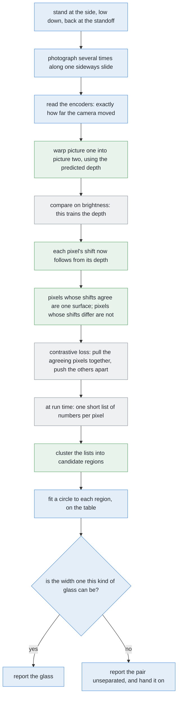

# Solution 9 — self-supervised from the arm's own movement

*Learned, as the decider. The arm knows exactly how it moved the camera, so the
geometry between two pictures of a still scene is a free training signal.*

> **The cell is described once, in [the cell](../../the-cell.md)** — the layout,
> the two places the camera works from, from the top and from the side, all four
> sensors, and the words this project uses them with. What follows is only what
> is specific to this solution.

## Introduction

This document explains the one learned method here whose training would survive
being moved to a real robot. The problem it addresses is that teaching a network
which pixels belong to which glass normally needs somebody to draw round every
glass in every picture, and that cost is where most of the expense of a learned
method lives. The idea here is that **the arm already knows exactly how it moved
the camera**, and that knowledge is enough to supervise the training by itself.
By the end you will understand how movement becomes a label, why the camera has
to work from the side rather than the top for this to work at all, how the arm
can calculate in advance exactly how far it must move to settle a particular
doubt, and why this solution is nevertheless not the one to build for this cell.

## The problem this solves

Four to six glasses stand on the table. They are all one kind, and the kind is
known. The arm has to say which pixels belong to which glass, give each glass a
position on the table, and name honestly any pair it could not separate.

The difficulty is not seeing the glasses. **It is telling one from another.**

Two glasses standing a legal distance apart on the table still land on top of
each other in a photograph, whenever the camera happens to be in line with both.
The usual method, which takes every pixel standing above the table top and
groups the ones that touch, then returns a single blob. One blob means one glass
to everything downstream, and that mistake does not announce itself.

A learned method could draw the boundary that the touching-pixels rule cannot.
But it has to be trained, and training needs the right answer written beside
each example. Those right answers are called the **labels**, and getting them is
where most of the cost of a learned method lives.

There are three ways to obtain labels, and that picture puts them side by side.

The first column is the usual recipe: a person draws round every object,
thousands of times over.

The second column is what the other two learned solutions here do. The simulator
already knows which object each rendered pixel came from, so the labels are
free.

The third column is this solution, and the difference is the point of the whole
document. **Its supervision does not come from inside the simulator at all.** It
comes from the joint encoders, which a real arm also has. Everything else
learned in this project would have to be retrained from scratch, with new
labels, on the day the code met a real camera. This one would not.

## The main idea

The main idea rests on one fact about this cell that is easy to pass over.

The camera sits on the wrist, so the arm knows exactly how far it moved the
camera between two pictures. It is not estimated from the pictures. It is
**commanded**, and then read back from the joint encoders to a fraction of a
millimetre.

Once the movement is known, geometry says where each surface point must land in
the second picture, given how far away it is. So points on one glass move
together, and points on the glass behind move by a different amount. **That
agreement is the label.**

The sections below build that up: first the effect the whole method depends on,
then why the camera must be positioned in one particular way for the effect to
exist at all, then how the arm can turn the effect into a dial it controls, then
how the agreement becomes something a network can output, and finally what keeps
the answer honest.

## Parallax: the shift is one divided by the depth

The effect is called **parallax**, and you have seen it from a moving train,
where the near fence races past the window while the far hills barely move at
all.

When the camera slides sideways, a surface moves across the picture by an amount
that is the slide divided by the depth. That formula is easier to remember as a
shape than as arithmetic: **the shift goes as one divided by the depth**. Near
things move a lot, far things move a little, and things at infinity do not move
at all.

The left-hand plot is that formula drawn. Because it is one over the depth, the
curve is **steep close up and nearly flat far away**. So the same small
difference in depth is worth a great deal of separation near the camera, and
almost nothing far from it. The marked pair on the plot is the hard case: two
glasses whose depths differ only slightly, sitting out where the curve has gone
flat, separating by barely more than the noise in the matching.

The right-hand plot is what makes this a method rather than just an observation,
and it is covered in its own section below.

## Why the camera must work from the side

This is the condition the whole solution depends on, and it is worth being exact
about, because getting it wrong would produce a method that cannot work at all.

Parallax separates two surfaces by how far apart **in depth** they are. So it
can only separate two glasses if the gap between them is much larger than the
range of depths each glass covers by itself.

**Working from the top fails that test outright**, and for two separate reasons.

The first is that two glasses **of one kind** have their rims at nearly the same
height, and therefore at nearly the same distance from a camera looking down at
them. There is almost no depth gap between the two objects to work with.

The second reason is worse. *Each glass on its own* runs all the way from its
rim, well up towards the camera, down to the table far below it. So each glass
by itself covers a wide range of depths, and therefore a wide range of shifts.
And both glasses cover **the same** wide range. Two groups of shifts lying
exactly on top of each other cannot be told apart at any slide whatsoever.

It is also worth saying that working from the top does not produce the merge in
the first place. We checked that against every legal arrangement the cell's
scene generator can make, and with both glasses wholly inside one frame, none
merged.

**Turn the camera on its side and the whole geometry turns with it.** The
station is the same one the shape measurement uses: from the side, low down,
standing back at the measuring standoff.

Now look at what changed. A second glass standing in line behind the first is a
long way further back, much further than the width of either glass. So the gap
**between** the two objects is now large, while the range of depths each glass
covers by itself is only its own width, which is small. The two groups of shifts
end up far apart, which is exactly the condition parallax needs.

The two frames on the right of that picture are the effect. The near glass moves
a long way across the picture, and the far one moves noticeably less. **The gap
between them grows**, and that growth is the only thing in the two pictures that
says they are two objects. They are the same kind, the same colour and the same
shape, so appearance says nothing at all here.

At each station the arm slides the camera sideways and photographs as it goes.
Because a picture costs milliseconds while an arm movement costs seconds, it
takes **several pictures along that slide rather than two**. That costs almost
nothing extra and gives many pairs per station instead of one, because every
picture can be paired with every other.

That slide turns out to buy something this problem needs, and it is worth
spelling out because it is free and easy to overlook. Sliding the camera
sideways moves the point directly below it. Every object's hidden region is a
wedge pointing away from that point, so **moving the point swings every wedge**.
An object hidden behind a taller one at one end of the slide may therefore be
plainly visible at the other end, without the arm going anywhere new.

This matters because one kind now spans a shot glass to a large tapered glass,
so a tall glass can cover a short one completely from a given camera position.
The slide does not solve that — the swing is small, because the slide is short —
but it is coverage the survey has already paid for, and any method that treats a
station's pictures as one viewpoint is throwing it away.

## The dial: separation grows in step with the slide

The right-hand plot of the earlier picture is what turns this from an
observation into a method. **The separation between the two groups of shifts
grows in step with the slide**: double the slide, and you double the separation.

That turns the arm into a dial. If the separation is not enough, you can go and
buy more of it, and you can work out in advance exactly how much you need to
buy.

Here is the calculation, and it is the most useful idea in this document. Each
millimetre of slide buys a fixed amount of extra separation — fixed, precisely
because the relationship is linear. So divide the separation you need by the
separation one millimetre buys, and **you have the exact slide that settles this
particular doubt, before the arm has moved at all.**

That is worth comparing with the alternative. A method whose answer to an
unclear case is *run a bigger network on the same picture* is trying to extract
information that was never in the picture. No amount of computing puts it there.
Moving does.

## How movement becomes a training signal

We now have the effect and the control. The remaining question is how a network
gets trained on it, and the answer has two halves.

### The first half: warp one picture into the other

The first half teaches the network to predict depth, with no depth labels at
all.

The network predicts a depth for every pixel of the first picture. Then that
predicted depth, together with the camera movement the encoders give, says where
each pixel should have landed in the second picture. So the first picture is
**warped** into the viewpoint of the second: every pixel is moved to where the
predicted depth says it should now be.

Then compare the warped picture with the real second picture, pixel by pixel, on
brightness. Where the warp lands on matching brightness, the predicted depth was
right. Where it does not, the mismatch is what training pushes down.

That comparison is called the **photometric loss**, and it is the whole of the
supervision: two pictures and two encoder readings. Nobody labels anything.

### The second half: turn agreement into groups

Once the depth is roughly right, the shift of each pixel follows from the
formula. So pixels can be sorted into pairs.

Two pixels whose shifts agree to within the measurement noise are a **positive
pair**, meaning they are on the same surface. Two whose shifts differ by clearly
more than the noise are a **negative pair**.

Now the network is asked for a second output. At every pixel it produces a short
list of numbers, which is called an **embedding**, and the list is arranged so
that **two lists being close together means the two pixels belong together**.

Training that is called a **contrastive loss**, and its shape is simple. Pick a
pixel, take its positive partner and a handful of negatives, and the loss is low
only when the partner is closer than every one of the negatives. So it **pulls**
a pixel and its partner together, and **pushes** it and its negatives apart.

In the right-hand panel of that picture, every pixel has become one point, and
the pixels of the two glasses have landed in two clumps.

Note carefully what that picture does *not* contain, because it is the honest
limit of the method. **Nothing in it names a glass and nothing counts them.**
The embedding says which pixels belong together, and something else has to
decide how many groups there are.

At run time only the embedding runs: one picture in, one short list of numbers
per pixel out. Those lists are clustered, and each cluster is a candidate
region.

## The arithmetic still decides

Every candidate region then goes through the ordinary arithmetic, unchanged from
[solution 2](02-cluster-on-the-table.md). Its pixels become points on the table
using the depth frame, a circle is fitted to them, and the region is kept only
if its width is one this kind of glass could have.

So the network proposes and the arithmetic disposes. That keeps this solution
inside the same safety argument as the programmed ones, which matters here more
than usual, because a merged pair comes back from the embedding as one tidy
region with no complaint at all.

## How the concepts fit together

Green marks what this solution adds, blue marks work the project already does,
and grey marks the network and its two training losses.

Two things about that chain are worth noticing. The first is that everything
above the dashed line of training happens **offline**, and at run time only the
embedding survives. The second is that the boundary the embedding draws runs
where the **shift** changes, which is to say where the depth jumps — and not
where the brightness changes. That is why two identical glasses are no harder
for this method than two different ones.

## The feedback loop

Most learned components answer whatever they are asked and give no useful sign
when they should not have. This one gives a sign, because **the doubt has a
number attached**: how wide the clear air is between the two groups of shifts.
Wide, and the answer is settled. Narrower than the noise in the matching, and it
is not — and the method can say so rather than guessing.

That doubt is unusually actionable, because of the dial described earlier. The
arm can divide the separation it needs by the separation one millimetre of slide
buys, and go exactly that far. It has **priced the answer before moving**.

But the dial does not turn for ever, and three limits stop it. All three are
arithmetic rather than opinion.

**The frame is the first limit.** A long slide moves everything a long way
across a picture that is only so wide. The ordinary slide moves the near glass
by a fraction of the frame, so the pair still shares most of it. A slide several
times longer moves the near glass most of the way across, and eventually **out
of the picture altogether** — at which point there is nothing left to compare. A
glass starting in the middle of the picture reaches the edge after half a frame
width of shift, and the formula says exactly how much slide that is. Past that,
the camera has to be re-aimed and the rotation warped out afterwards, which is
exact because the rotation is commanded too, but it is extra machinery.

**The reach is the second limit.** The glasses stand in a zone only so large,
and the arm works comfortably only within a band of distances from its base, so
a slide much wider than the zone itself simply cannot be made from some places
on the table. Past a certain length this has stopped being one station with a
long slide and become **a second station somewhere else**, which is the job of
the *move the camera* solution rather than this one.

**The budget is the third limit.** An arm movement costs seconds while running
the network costs milliseconds, so the loop has to stop: when nothing is
unclear, or when the budget is spent. A pair the arm could not separate is a
result this problem asks for, and not a failure.

## A worked example

This example follows one pair through the method.

The camera stands at the side: low down, level, standing back from the near
glass at the measuring standoff. A second glass of the same kind stands a good
distance further back along the same line of sight, and slightly to one side, so
it is not perfectly hidden.

**The first picture.** The near glass is closer to the lens, so it is drawn
noticeably wider than the far one, even though the two are the same size in the
room. The far one's centre sits only a little to the side of the near one's,
because the sideways offset is small and it too shrinks with distance. So the
two silhouettes **overlap**, and the mask comes back as one blob.

Measure that blob against the near glass's scale and it is wider than any glass
of this kind can be. So the arithmetic already knows the blob is not one glass.
What it does not know is where to cut, which is the whole difficulty.

**The second picture**, taken at the other end of the slide. Now run both
pictures through the network and look at how far each pixel moved.

The **near** glass's pixels all moved a lot, because the shift goes as one over
the depth and the near glass is close. They do not all move by exactly the same
amount, because the front face of the glass is nearer than its axis and so moves
a little more, which means they occupy a narrow *band* of shifts rather than a
single value.

The **far** glass's pixels all moved much less, and likewise occupy their own
narrow band.

**And the two bands do not touch.** There is clear air between them, because the
depth gap between the two glasses is much larger than the depth spread within
either one — which is exactly the condition that working from the side was
chosen to create. So every pixel in the blob belongs unambiguously to one band
or the other.

The network was fitted so that pixels whose shift agrees share a direction in
the embedding, so the two bands land in two separate places there, and
clustering hands back two regions.

The boundary between them runs along the silhouette of the near glass, where it
crosses in front of the far one. **That is an occlusion edge, and not a
brightness edge.** So the fact that the two glasses are identical in colour,
shape and material costs nothing at all. This is the point of the whole method:
it draws a line that no brightness-based rule could ever see.

Both regions then go through the ordinary check, and are accepted only if both
fitted widths land inside the kind's range. Two plausible circles means two
glasses, reported. One implausible circle means the region is rejected and the
pair is reported as unseparated — which is a result the problem explicitly asks
for, and not a failure.

## What it needs

**From the cell**, all of which already exists: the wrist camera, and the camera
pose read from the joint encoders through the robot's own description of itself.

**Data.** Pairs of pictures from each station, with the encoder reading logged
beside every one. No masks, no per-object labels, and **no spawn record**. That
last absence is the point of the solution.

**No borrowed weights.** Nothing is downloaded and nothing was fitted to
photographs of the real world, so the whole thing is buildable inside the
simulator, on a machine with no dedicated graphics card.

**Time.** Hours rather than days, for a small network on small pictures of one
kind of object under one lighting setup. That is uncertain until it is actually
run, and should be measured rather than believed.

One distinction is worth stating plainly, because it is easy to lose. The
simulator's record of what it spawned is used to **score** the result. It is
never used to train it. That distinction is the whole point of this solution.

## Where the idea comes from

Several lines of work meet here, and the nearest relative is worth knowing
because it shows what this cell gets for free.

**Learning depth and camera motion together, with no labels**, is the closest
living relative. SfMLearner (Zhou and colleagues, CVPR 2017) trains two networks
at once from ordinary video: one guesses the depth, the other guesses how the
camera moved, and both are checked by warping one frame into the next and
comparing the brightness. Monodepth2 (Godard and colleagues, ICCV 2019) improves
the recipe, though under a licence that allows reading and research rather than
use in a product.

Both of those have to **estimate** the camera motion, and that estimate is where
a large part of their error lives. **Here the motion is not estimated. It is
commanded.** So half of the hard problem in that literature does not exist in
this cell.

**Motion segmentation** is the classical form of the grouping idea, with layered
models going back at least to Wang and Adelson's *Representing Moving Images
with Layers* (1994). It assumes the *objects* move. Here they do not; the camera
does. But relative motion is relative motion, so the same reasoning applies.

The Gestalt psychologists called grouping by shared motion **common fate**: a
flock of birds is one flock because the birds turn together.

**Contrastive learning** is how that grouping becomes something a network can
output. SimCLR (Chen and colleagues,
[arXiv:2002.05709](https://arxiv.org/abs/2002.05709)) and MoCo (He and
colleagues, [arXiv:1911.05722](https://arxiv.org/abs/1911.05722)) are the
standard references. Both train on whole pictures rather than on pixels, but the
loss has the same shape, and it is a dozen lines of code rather than a library.

## Where it is strong and where it breaks

The strengths come from where the supervision comes from.

**It learns a boundary nobody can write down**, because the line it draws is
where the depth jumps rather than where the brightness changes. **Labels are
free and endless**, since every pair of pictures the arm ever took is one.
**Colour does not matter**, so two identical glasses are no harder than two
different ones. **The doubt carries a number**, and because the separation grows
in step with the slide, the arm can work out how far it must move to settle a
question.

And the strength that no other learned solution here can claim: **it transfers
to real hardware unchanged.** A real arm has joint encoders and a wrist camera,
which is all this method needs.

The weaknesses divide into what the signal cannot reach, what the method cannot
say, and why it is nevertheless not the thing to build here.

What the signal cannot reach comes first. **Only the camera moves, so parallax
is the only signal**, which means that underneath, this is a detector for sudden
changes in depth dressed up as a learned model. **Two glasses at the same
distance from the camera separate by nothing at all**, and a small difference in
depth out where the one-over-depth curve has gone flat buys almost no separation
however far the camera slides — and because the two are the same kind, there is
no clue in how they look either. The brightness comparison also **needs
variation in brightness**, and it is weakest exactly where the glasses are
plainest.

What the method cannot say comes second. **It says which pixels go together, and
not how many glasses there are.** Something still has to choose the number of
groups, and choosing too few is exactly the merge this problem fears. And as
with every other pixel-based method here, a glass covered completely by a taller
one contributes no pixels to group, so this method is silent about it — the
geometric argument in [solution 2](02-cluster-on-the-table.md) is what speaks to
that case. A merged pair comes back as one tidy region with no complaint, so the
circle-fit check afterwards is not optional. And changing the lighting or the
kind of glass leaves the learned embedding describing a cell that no longer
exists.

Why it is not the thing to build here comes third, and it is the honest
conclusion. **The cell already has a depth camera**, which measures directly
what parallax is being trained to infer. So this solution does not earn its
place in this problem. It earns it at [problem 4](../../problem-4/problem.md),
where the kinds of glass are open, or on the day depth readings fail on real
glassware.

## The general ideas behind this

This solution's distinguishing feature is where the supervision comes from: not
a human, and not the simulator's spawn record, but geometry the arm already
knows. That places it in a well-developed literature, with four ideas worth
knowing separately.

### Self-supervised learning — labels from the structure of the data

Rather than annotate anything, construct a task whose answer is already implied
by the data: predict a held-out part from the rest, or require two views of the
same thing to agree. The supervision is then free and unlimited, and the model
learns representations useful for the task you actually cared about.

It is used in domains where unlabelled data is abundant and labels are
expensive, such as language, audio and video, and in robotics, where the robot's
own sense of its own position is a label generator that never tires. It is
rarely right for problems where the invented task can be solved by a shortcut
that does not require the understanding you wanted, and **designing a task with
no shortcut is the hard part of the field**.

For more, see [self-supervised
learning](https://en.wikipedia.org/wiki/Self-supervised_learning).

### Geometry as supervision — the epipolar constraint

If a camera's movement between two pictures is known, then the position of a
surface point in the first picture determines where it must appear in the
second, given its depth. That is the **epipolar constraint**, and it converts a
depth guess into a checkable prediction: warp one picture into the other using
the guess, and see how well they match.

It is used for three-dimensional reconstruction, visual odometry and mapping —
anywhere a moving camera has to recover the scene, which is most of mobile
robotics and all of photogrammetry. It is rarely right for textureless,
transparent or reflective surfaces, where matching has nothing to lock onto, and
for scenes where the objects move between the two pictures, which breaks the
still-scene assumption entirely.

For more, see [structure from
motion](https://en.wikipedia.org/wiki/Structure_from_motion) and [epipolar
geometry](https://en.wikipedia.org/wiki/Epipolar_geometry).

### Self-supervised depth from one camera — the photometric loss

Train a network to predict depth with no depth labels at all: use the predicted
depth and the known camera motion to warp one frame into another, and make the
difference between the warped frame and the real one the loss. **SfMLearner**
(Zhou and colleagues, [arXiv:1704.07813](https://arxiv.org/abs/1704.07813))
introduced the form, and **Monodepth2** (Godard and colleagues,
[arXiv:1806.01260](https://arxiv.org/abs/1806.01260)) fixed most of its
practical failures.

It is used for driving and drone footage, where hours of video with known or
estimable motion exist and depth sensors are absent or expensive. **This cell
has the easy version of it**, because the camera motion is not estimated from
the pictures but read from the joint encoders, exactly. It is rarely right for
scenes without texture or with independently moving objects, and for cases
needing absolute scale from a single camera — the classic version recovers depth
only up to an unknown scale factor, which an arm's known slide removes.

### Optical flow and motion segmentation — common fate

Points on one rigid object move together in the picture, and points on a
different object at a different distance do not. That is the Gestalt principle
of **common fate**, and it is one of the very few segmentation cues that needs
no appearance model at all. It works on two identical objects, which is the
whole reason it is here. Measuring the per-pixel motion is called **optical
flow**, running from Lucas and Kanade (1981) to modern learned methods such as
RAFT ([arXiv:2003.12039](https://arxiv.org/abs/2003.12039)).

It is used for video segmentation, tracking, and any case where objects are hard
to tell apart by appearance. It is rarely right where nothing moves relative to
anything else, which is exactly the failure case described earlier: two glasses
at the same distance from the camera have no relative motion to group by.

## Where it sits among the other solutions

This solution competes with the other two learned deciders, leans on [cluster on
the table](02-cluster-on-the-table.md) for the arithmetic that checks its
answers, and loops the way [move the camera](03-move-the-camera.md) does.

What separates it from all of them is one property, and it is worth being clear
that the property is about the *future* rather than about this problem. Every
other learned solution here is trained on labels the simulator provides, so
every one of them would have to be retrained from scratch on the day the code
met real hardware. **This one would not**, because its supervision comes from
the joint encoders, which a real arm also has.

So the honest place for this solution is as the learned method to reach for when
the project leaves the simulator, and not as the method to reach for now.
