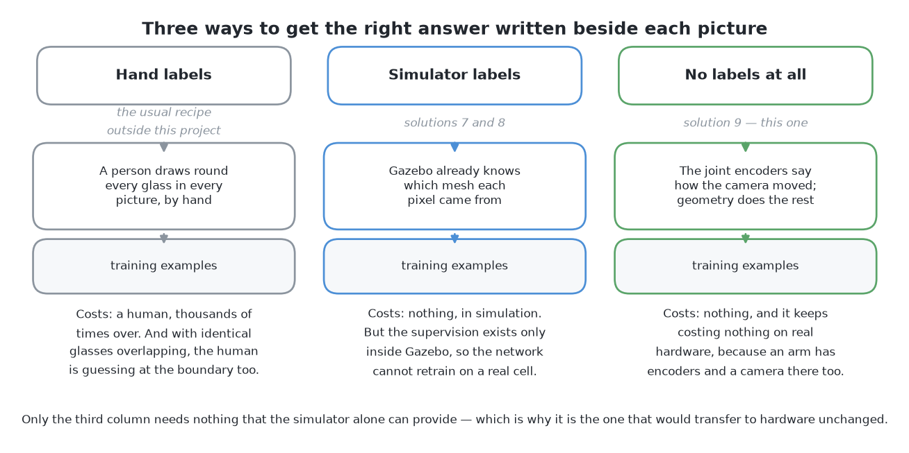
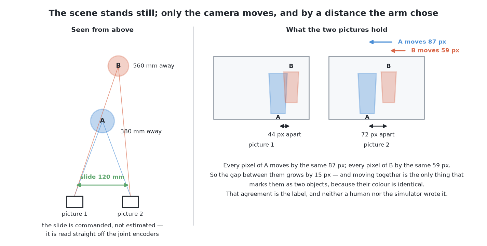
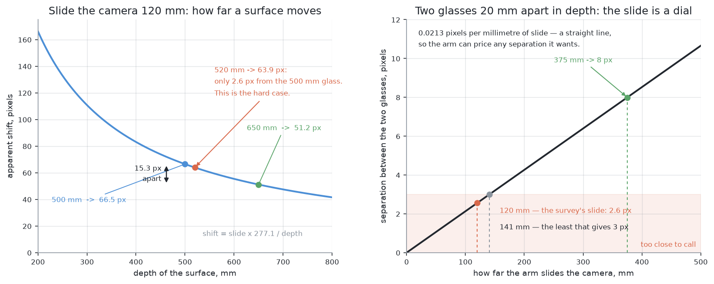
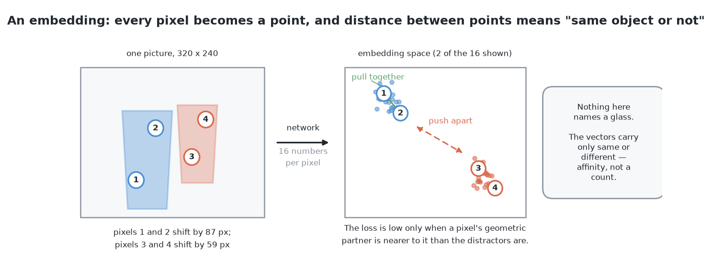
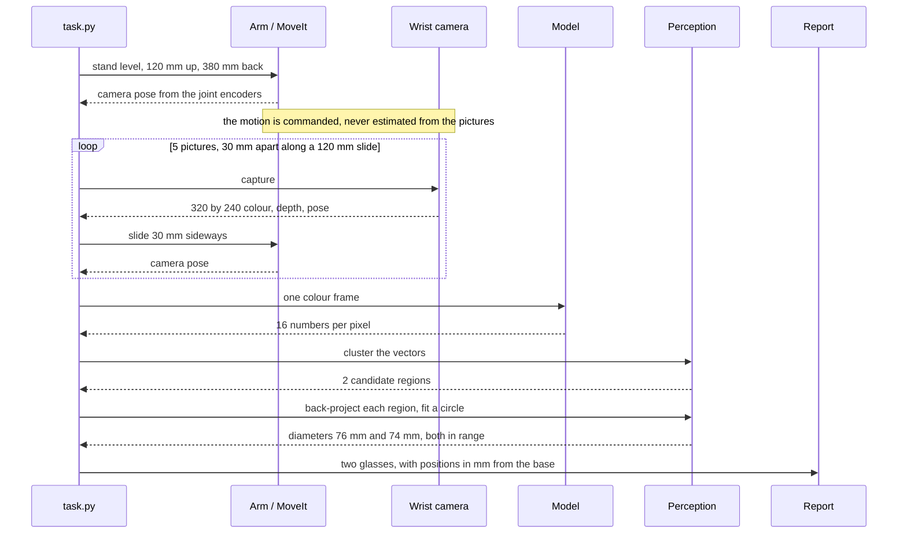
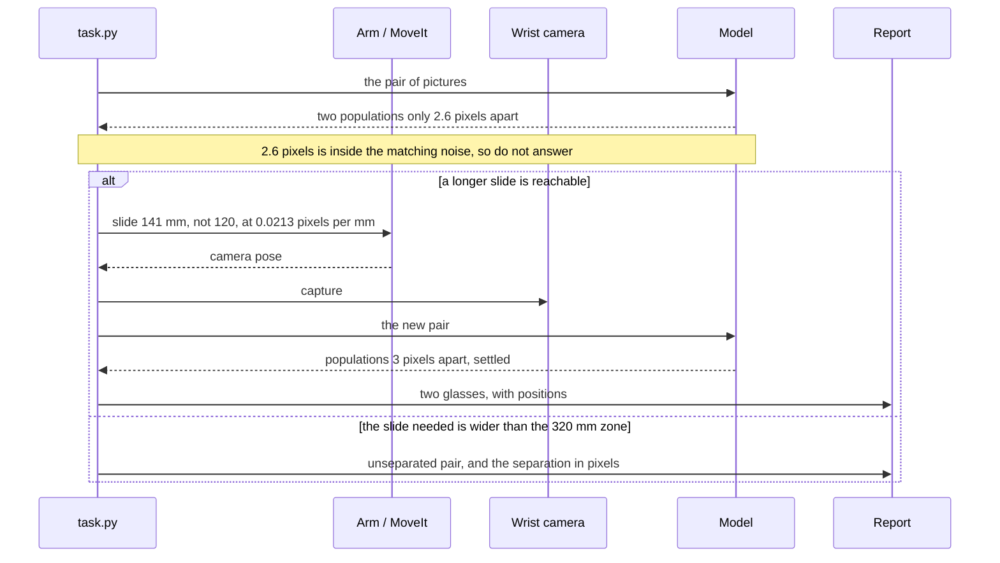
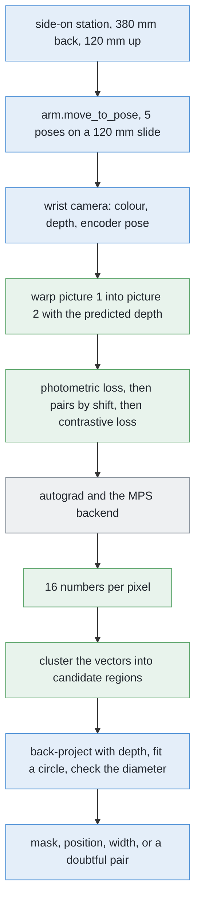
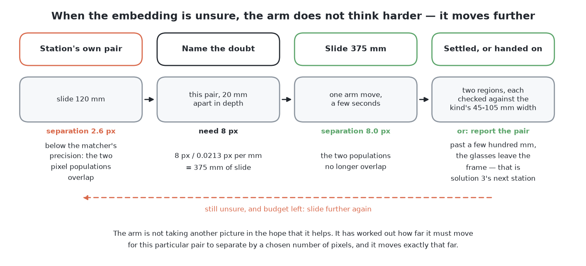
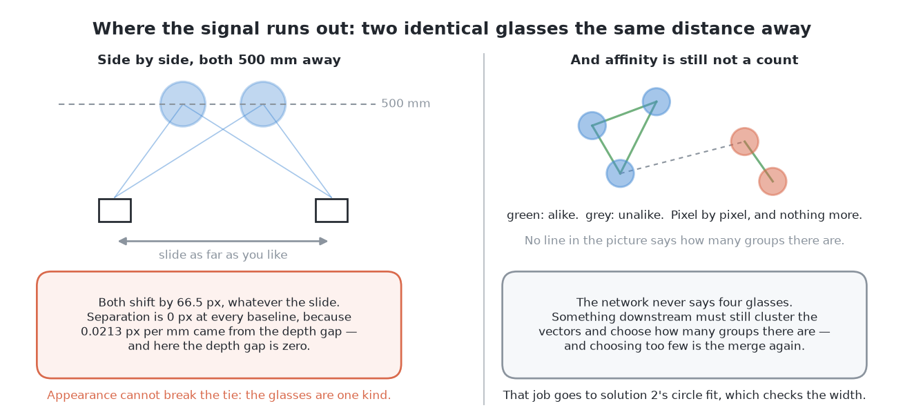

# Solution 9 — self-supervised from the arm's own movement

*Learned, as the decider. The arm knows exactly how it moved the camera, so the
geometry between two pictures of a still scene is a free training signal.*

> **The cell is described once, in [the cell](../../the-cell.md)** — the layout,
> the two camera poses, all four sensors, and the words this project uses them
> with. What follows is only what is specific to this solution.

## In one paragraph

Teaching a network which pixels belong to which glass normally needs somebody
to draw round every glass in every picture. This solution needs nobody. The
camera sits on the wrist, so the arm knows exactly how far it moved between two
pictures, and geometry then says where each surface point must land in the
second. Points on one glass move together; points on the glass behind move by a
different amount. That agreement is the label. It comes from the joint
encoders, not from a human and not from the simulator, so the same training
would run on real hardware.

## The problem this solves

Four to six glasses stand on the table. They are all one kind, and the kind is
known. The arm has to say which pixels belong to which glass, give each glass a
position on the table, and name honestly any pair it could not separate.

The difficulty is not seeing the glasses. It is telling one from another.

Two glasses standing 150 mm apart on the table land on top of each other in a
photograph whenever the camera is in line with both. The usual method — take
every pixel standing above the table top, and group the ones that touch — then
returns a single blob. One blob means one glass to everything downstream, and
that mistake does not announce itself.

A learned method could draw the boundary the touching-pixels rule cannot. But it
has to be trained, and training needs the right answer written beside each
example. Those right answers are the **labels**, and getting them is where most
of the cost of a learned method lives.



The first column is the usual recipe: a person draws round every object,
thousands of times.

The second is what the other two learned solutions here do. Gazebo already knows
which object each rendered pixel came from, so the labels are free.

The third is this solution. Its supervision does not come from inside the
simulator at all. It comes from the joint encoders, which a real arm also has.
Everything else learned here would have to be retrained from scratch, with new
labels, the day the code met a real camera. This one would not.

## How it works, end to end

### The setup

The table top is at 750 mm above the floor, and every height in this cell is
measured from it. Four to six glasses of one known kind stand upright and
opaque in a zone 320 by 360 mm across (`GLASS_ZONE` in `rack/layout.py`), at
least 150 mm from each other.

The camera is bolted to the wrist, 85 mm off to one side of the tool
(`CAMERA_OFFSET` in `arm/dimensions.py`). Two consequences, and both matter
here. Moving the camera means moving the whole arm, so a picture from a new
place costs seconds. And the joint encoders report where the camera was for
every picture, to a fraction of a millimetre, without anything having to be
estimated from the pictures themselves.

It is an RGBD camera: 320 by 240 pixels, 60 degrees across, which makes its
focal length fx = fy = **277.1 pixels**.

Known in advance: the table's height, the lens, the kind of glass and the
diameter range that kind is drawn from. Not known: how many glasses there are,
where they stand, or which pixels are which. And not used at any point in
training: the simulator's record of what it spawned.

### The pictures

**The station has to be side-on, not overhead, and that is the single most
important fact about this solution.** Parallax separates two surfaces by how
far apart in depth they are. It can only split two glasses if the gap between
them is much bigger than the range of depths each glass covers by itself.

Looking straight down from the survey height of 450 mm fails that test
outright, for two reasons.

First, two glasses **of one kind** have their rims at nearly the same height, so
at nearly the same distance from an overhead camera.

Second, and worse, each glass on its own runs from its rim — 250 mm below the
camera, for a 200 mm glass — down to the table at 450 mm. So both glasses cover
the same range of depths, and therefore the same range of shifts: 133 pixels at
the rim falling to 74 at the table, for each of them. Two groups lying on top of
each other cannot be told apart at any baseline.

And the overhead view does not produce the merge anyway. Across 4320 legal
arrangements, with both glasses wholly inside one 320 by 240 frame, none
merged.

Turn the camera on its side and the geometry turns with it. The station is the
same one problem 1 measures a glass from: **level, 120 mm above the table
(`MEASURE_VIEW_HEIGHT`), 380 mm back from the glass.** The 380 mm is not a
constant — `_measuring_distance()` works it out from the lens and the 260 mm
tallest glass the cell handles, and gets 380 mm for this camera. A second glass
in line behind the first stands 180 mm further back, at 560 mm. Now the depth
gap between the two glasses is 180 mm while each glass covers only its own
75 mm of width, and the two populations of shifts are far apart.



The two frames on the right are the effect. Glass A, the nearer one at 380 mm,
moves 87 pixels. Glass B, 180 mm further away, moves 59. The gap between them
grows by 28 pixels, and that growth is the only thing in the two pictures that
says they are two objects. Same kind, same colour, same shape — so appearance
says nothing at all.

At each station the arm slides the camera sideways by 120 mm — the survey's own
baseline, `SURVEY_BASELINE` — and photographs as it goes. A picture costs
milliseconds and an arm move costs seconds, so it takes **five pictures along
that slide instead of two**, which costs almost nothing and gives ten pairs per
station rather than one. A few hundred spawned scenes then give tens of
thousands of training pairs, every one labelled by the encoders.

### What each picture captures

Four things, recorded together:

- a **320 by 240 colour frame**, which is all the training ever uses as input;
- a **320 by 240 depth frame** from the same sensor, used at run time to turn
  accepted pixels into millimetres on the table, and never used to train;
- the **mask** of what stands on the table — `standing_on_the_table()` keeps
  the pixels whose depth puts them above the 750 mm table top and no more than
  260 mm above it, which is also what keeps the arm's own fingers out of shot;
- the **pose** of the camera at the instant of capture, read from the joint
  encoders through the URDF. Where the camera *really was*, not where it was
  sent: the camera is off to one side of the wrist, and a centimetre of error
  would go straight into every distance measured from the pair.

Nothing else. No per-object mask, no class, no spawn record.

### What is interpreted, and how

One formula carries the whole solution. A surface at depth *z* moves across the
image by

    shift in pixels = slide in millimetres x 277.1 / depth in millimetres

so for the 120 mm slide the numerator is a fixed 120 x 277.1 = **33,252**, and
the shift is 33,252 divided by the depth in millimetres.



The left-hand plot is that formula drawn. The curve is steep close up and flat
far away. So the same 20 mm of depth difference is worth far more separation
near the camera than far from it. The marked pair at 500 and 520 mm is the hard
case, only 2.6 pixels apart.

The right-hand plot is what makes this a method rather than an observation. The
separation grows **in step with the slide**: double the slide, double the
separation. That turns the arm into a dial.

The chain from pixels to answer, in order:

1. **Predict a depth** for every pixel of picture 1, with the network.
2. **Warp** picture 1 into the viewpoint of picture 2, using that depth and the
   camera motion the encoders give. Every pixel is moved to where the predicted
   depth says it should now be.
3. **Photometric loss.** Compare the warped picture with picture 2, pixel by
   pixel, on brightness. Where the warp lands on matching brightness the depth
   was right. Where it does not, the mismatch is what training pushes down. This
   is the whole of the supervision: two pictures and two encoder readings.
4. **Make pairs.** Once the depth is roughly right, the shift of each pixel
   follows from the formula. Two pixels whose shifts agree to within the
   measurement noise are a **positive pair** — the same surface. Two whose
   shifts differ by clearly more than the noise are a **negative pair**.
5. **Contrastive loss.** The network's second output is, for every pixel, a
   list of perhaps 16 numbers. That list is called an **embedding**, and it is
   arranged so that *two lists being close together means the two pixels belong
   together*. Pick a pixel, take its positive partner and a handful of
   negatives, and the loss is low only when the partner is closer than every
   negative. So it **pulls** a pixel and its partner together, and **pushes** it
   and its negatives apart.



In the right-hand panel every pixel has become one point, and the pixels of the
two glasses have landed in two clumps. Nothing in that picture names a glass
and nothing counts them, which is the honest limit of the method.

At run time only the embedding runs: one picture in, 16 numbers per pixel out.
Those vectors are clustered, and each cluster is a candidate region.

### What comes out

Every candidate region goes through the ordinary arithmetic: its pixels become
points on the table using the depth frame, a circle is fitted, and the region is
kept only if the diameter is one this kind of glass could have. The network
proposes; the arithmetic decides.

What leaves the solution, per accepted region, is what `problem.md` asks for: a
**mask** naming the pixels in a named picture, a **position** on the table in
millimetres from the arm's base, and a **rough footprint width** in millimetres.
Alongside it goes a list of pairs that could not be separated, each carrying the
number that made it doubtful — the separation, in pixels, between the two
populations of shifts.

`task.py` takes the positions and drives the rest of the run from them;
`report.py` writes the doubtful pairs down; an unseparated pair is the handover
to [problem 3](../../problem-3/problem.md).

## The sequence

The normal path: one side-on station, five pictures along the slide, one
embedding, two regions confirmed by circle fits.



The interesting path: the two populations of shifts are too close to call, so
the arm prices a longer slide in millimetres before it moves, and abstains when
it cannot afford one.



## In pseudocode



Green is new code written for this solution, blue is code the project already
has, grey is a third-party library.

```text
standoff  = measuring_distance(lens, TALLEST_GLASS)   # have · work_cell.task
eye, look = side_on_station(target, others, standoff) # have · work_cell.task
frames = []                                           # NEW  · python
for offset in linspace(0.0, 120.0, 5):                # NEW  · numpy
    arm.move_to_pose(eye + offset * sideways, look)   # have · work_cell.arm.motion
    view = camera.capture()                           # have · work_cell.arm.camera
    frames.append((view.rgb, view.camera_to_world))   # NEW  · python

# Training, offline. No labels: only pictures and encoder poses.
for (rgb1, pose1), (rgb2, pose2) in every_pair(frames):
    depth = net.depth(rgb1)                           # NEW  · torch
    moved = relative(pose1, pose2)                    # NEW  · numpy
    warped = warp(rgb1, depth, moved, K)              # NEW  · ~40 lines, torch
    loss = photometric(warped, rgb2)                  # NEW  · torch
    shift = 277.1 * slide_mm / depth                  # NEW  · torch
    same, other = pairs_by_shift(shift, noise=1.0)    # NEW  · ~25 lines, torch
    loss += contrastive(net.embed(rgb1), same, other) # NEW  · ~20 lines, torch
    loss.backward()                                   # NEW  · torch

# Run time. One picture in; the arithmetic still decides.
vectors = net.embed(view.rgb)                         # NEW  · torch
regions = cluster(vectors)                            # NEW  · ~20 lines, numpy
for region in regions:                                #
    points = backproject(view.depth, region, pose, K) # have · work_cell.glasses.perception
    centre, diameter = fit_circle(points)             # NEW  · numpy.linalg.lstsq
    if kind_accepts(diameter):                        # have · work_cell.glasses.spec
        report.found(centre, diameter)                # have · work_cell.report
    else:                                             #
        report.doubtful(region, separation_px)        # have · work_cell.report
```

| Library | Used for | Licence | In the pixi environment? |
| --- | --- | --- | --- |
| [NumPy](https://numpy.org/) | the projection arithmetic, clustering, the circle fit | BSD-3 | **yes** |
| [OpenCV](https://opencv.org/) | frames in and out, and the report pictures | Apache-2.0 | **yes** |
| [Gazebo Harmonic](https://gazebosim.org/) | rendering a few hundred scenes to train on | Apache-2.0 | **yes**, it is the simulator |
| [PyTorch](https://pytorch.org/) | the network, the warp, both losses, on the MPS backend | [BSD-3-style](https://github.com/pytorch/pytorch/blob/main/LICENSE) | **no — adding it is a real decision** |

SciPy and scikit-learn are not needed and are not added: the clustering is
about twenty lines over NumPy, and the circle fit is one least-squares solve.

## A worked example

The camera stands level, 120 mm above the table, 380 mm back from the near
glass. A second glass of the same kind stands 180 mm further back and 60 mm to
one side, so it is 560 mm away.

**The first picture.** A 75 mm glass at 380 mm images 75 x 277.1 / 380 = **55
pixels** wide; the same glass at 560 mm images **37**. The far one's centre sits
60 x 277.1 / 560 = 30 pixels to the side of the near one's, so the two
silhouettes overlap and the mask comes back as one blob **76 pixels** across. At
the near glass's scale of 380 / 277.1 = 1.37 mm a pixel that is **104 mm**, and
no straight glass in this cell is drawn wider than the 90 mm top of its range in
`glasses/shapes.py`. So the blob is not one glass.

**The second picture**, 120 mm along the slide. Run both through the network:

- the near glass's pixels shift 33,252 / 380 = **87 pixels** at its axis, and
  97 at its front face, which is 37 mm nearer;
- the far glass's shift 33,252 / 560 = **59 pixels** at its axis, and 64 at its
  front face at 523 mm.

So the near glass's pixels all shift between 87 and 97, the far glass's between
59 and 64, and **23 pixels of clear air lie between the two populations**. Every
pixel in the blob belongs unambiguously to one of them. The network was fitted
so that pixels whose shift agrees share an embedding direction, so the two
populations land in two places in the embedding space and clustering returns two
regions.

The boundary between them runs where the shift changes — along the silhouette of
the near glass where it crosses the far one. That is an **occlusion edge**, not a
brightness edge, so the fact that the two glasses are identical in colour costs
nothing at all. This is the point of the whole method: it draws a line no
brightness-based rule could see.

Both regions then go through the ordinary check. Their pixels become points on
the table, a circle is fitted to each, and each is accepted only if its diameter
lands inside the range this kind can have. Two plausible circles: two glasses,
reported. One implausible circle: the region is rejected and the pair is
reported as unseparated, which is a result the problem explicitly asks for.

## The feedback loop

Most learned components answer whatever they are asked, and give no useful sign
when they should not have. This one does, because the doubt has a number
attached: **the gap, in pixels, between the two groups of shifts.** If that
number is 23, the answer is settled. If it is 2.6, it is not.

And because separation is linear in the slide, the arm can work out exactly how
far it must move to make a named doubtful pair unambiguous.



The arithmetic in the second box is the whole idea. For the 500 and 520 mm pair,
each millimetre of slide buys

    277.1 x (1/500 - 1/520) = 277.1 x 0.0000769 = 0.0213 pixels

so three pixels of separation needs 3 / 0.0213 = **141 mm** of slide, and eight
pixels needs 8 / 0.0213 = **375 mm**. That is a measurement chosen to settle one
named doubt. The arm has priced the answer, in millimetres, before it moves.
Compare a method whose response to an unclear case is to run a bigger network on
the same picture: the information was not in the picture, and no amount of
computing will put it there.

Three limits on the loop, all arithmetic rather than opinion:

- **The frame.** A big slide moves everything a long way across a 320-pixel
  width. The 120 mm slide moves the near glass 87 pixels, so the pair still
  shares three quarters of the frame; a 375 mm slide moves it
  277.1 x 375 / 380 = 273 pixels and leaves 47, and the glass is gone. A glass
  centred in the picture reaches its edge after 160 pixels, which takes
  160 x 380 / 277.1 = 219 mm at the near glass and 289 mm at 500 mm. Past that
  the camera has to be re-aimed and the rotation warped out afterwards — exact,
  because the rotation is commanded too, but extra machinery.
- **The reach.** The glasses stand in a zone 320 by 360 mm and the arm's
  comfortable reach is 300 to 780 mm from its base. A 375 mm slide is wider than
  the object zone, and there are places on the table from which it cannot be
  made at all. Past a few hundred millimetres this has stopped being one station
  with a long slide and become a second station somewhere else, which is the job
  of the *move the camera* solution.
- **The budget.** An arm move costs seconds and running the network costs
  milliseconds, so the loop must stop: when nothing is unclear, or when the
  budget is spent. A pair the arm could not separate is a result this problem
  asks for, not a failure.

## Where it comes from

**Learning depth and camera motion together, with no labels**, is the nearest
living relative. SfMLearner
([Zhou et al., CVPR 2017](https://github.com/tinghuiz/SfMLearner), MIT licence)
trains two networks at once from ordinary video. One guesses depth, the other
guesses how the camera moved. It checks both by warping one frame into the next
and comparing the brightness. Monodepth2
([Godard et al., ICCV 2019](https://github.com/nianticlabs/monodepth2)) improves
the recipe, under **Niantic's own non-commercial licence** — usable for reading
and research, not for a product.

Both of those have to *estimate* the camera motion, and that estimate is where a
large part of their error lives. **Here the motion is not estimated. It is
commanded.** So half of the hard problem in that literature does not exist in
this cell.

**Motion segmentation** is the classical form of the grouping idea. Layered
models go back at least to Wang and Adelson's *Representing Moving Images with
Layers* (1994 — I am confident of the paper and its subject, less so of its
details). It assumes the *objects* move. Here they do not; the camera does. But
relative motion is relative motion, so the same reasoning applies.

The Gestalt psychologists called grouping by shared motion **common fate**: a
flock of birds is one flock because the birds turn together.

**Contrastive learning** is how that grouping becomes something a network can
output. SimCLR ([Chen et al., 2020](https://arxiv.org/abs/2002.05709)) and MoCo
([He et al., 2019](https://arxiv.org/abs/1911.05722)) are the standard
references. Both train on whole pictures rather than on pixels, but the loss has
the same shape, and it is a dozen lines of code rather than a library.

## What it needs

- **[PyTorch](https://pytorch.org/)**, BSD-3-style licence
  ([text](https://github.com/pytorch/pytorch/blob/main/LICENSE)), on Apple's MPS
  backend. No CUDA, no compiled custom kernels.
- **[Gazebo Harmonic](https://gazebosim.org/)**, Apache-2.0, to render a few
  hundred scenes, and **[NumPy](https://numpy.org/)**, BSD-3, for the projection
  arithmetic.
- **Data**: pairs of pictures from each station with the joint encoder reading
  logged beside every one. No masks, no per-object labels, no spawn record.
- **No pretrained weights.** Nothing is downloaded and nothing was fitted to
  real photographs, so the whole thing is buildable inside the simulator on a
  machine with no NVIDIA card.
- **Time**: hours rather than days, for a small network on 320 by 240 pictures
  of one kind of object under one lighting setup. Uncertain until it is run.

The simulator's record of what it spawned **scores** the result. It never trains
it. That distinction is the whole point of this solution.

## Where it is strong and where it breaks



**Strong**

- **It learns a boundary nobody can write down.** The line it draws is where the
  depth jumps, not where the brightness changes.
- **Labels are free and endless.** Every pair of pictures the arm took is one.
- **Colour does not matter**, so two identical glasses are no harder than two
  different ones.
- **It transfers to real hardware unchanged.** A real UR5e has joint encoders
  and a wrist camera, which is all this needs. No other learned solution here
  can say that.
- **The doubt carries a number**, and the separation grows in step with the
  slide, so the arm can work out in millimetres how far it must move to settle a
  question.

**Breaks**

- **Only the camera moves, so parallax is the only signal.** Underneath, this is
  a detector for sudden changes in depth, dressed up as a learned model.
- **Two glasses at the same distance separate by nothing.** Twenty millimetres
  apart they separate by 2.6 pixels. They are the same kind, so there is no clue
  in how they look either.
- **It says which pixels go together, not how many glasses there are.**
  Something still has to choose the number of groups, and choosing too few is
  the merge this problem fears.
- **The photometric loss needs variation in brightness**, and it is weakest
  exactly where the glasses are plainest.
- **Change the lighting or the kind** and the learned embedding describes a cell
  that no longer exists.
- **A merged pair comes back as one tidy region with no complaint**, so the
  circle-fit check afterwards is not optional.
- **The cell already has a depth camera**, which measures directly what parallax
  is being trained to infer. So this does not earn its place here. It earns it
  on problem 4, where the kinds are open, or on the day depth fails on real
  glassware.
- It competes with the other two learned deciders, leans on *cluster on the
  table*, and loops the way *move the camera* does.

## The general methods behind this

This solution's distinguishing feature is where the supervision comes from: not
a human, not the simulator's spawn record, but geometry the arm already knows.
That places it in a well-developed literature.

### Self-supervised learning — labels from the structure of the data

Rather than annotate, construct a task whose answer is already implied by the
data: predict a held-out part from the rest, or require two views of the same
thing to agree. The supervision is free and unlimited, and the model learns
representations useful for the task you actually cared about.

- **Mostly used for** domains where unlabelled data is abundant and labels are
  expensive — language, audio, video, and robotics, where the robot's own
  proprioception is a label generator that never tires.
- **Rarely right for** problems where the pretext task can be solved by a
  shortcut that does not require the understanding you wanted. Designing a task
  with no shortcut is the hard part of the field.
- **More:** [self-supervised learning](https://en.wikipedia.org/wiki/Self-supervised_learning).

### Structure from motion and the epipolar constraint — geometry as supervision

If a camera's movement between two pictures is known, the position of a surface
point in the first picture determines where it must appear in the second, given
its depth. That is the **epipolar constraint**, and it converts a depth guess
into a checkable prediction: warp one image into the other using the guess and
see how well they match.

- **Mostly used for** 3D reconstruction, visual odometry and SLAM — anywhere a
  moving camera has to recover the scene, which is most of mobile robotics and
  all of photogrammetry.
- **Rarely right for** textureless, transparent or specular surfaces, where
  matching has nothing to lock onto, and for scenes where the objects move
  between the two pictures, which breaks the static-scene assumption entirely.
- **More:** [structure from motion](https://en.wikipedia.org/wiki/Structure_from_motion);
  [epipolar geometry](https://en.wikipedia.org/wiki/Epipolar_geometry);
  Hartley and Zisserman, [Multiple View Geometry](https://www.robots.ox.ac.uk/~vgg/hzbook/).

### Self-supervised monocular depth — the photometric reprojection loss

Train a network to predict depth with no depth labels at all: use the predicted
depth and the known camera motion to warp one frame into another, and make the
difference between the warped frame and the real one the loss. **SfMLearner**
(Zhou et al., [arXiv:1704.07813](https://arxiv.org/abs/1704.07813)) introduced
the form, and **Monodepth2** (Godard et al.,
[arXiv:1806.01260](https://arxiv.org/abs/1806.01260)) fixed most of its
practical failures — occlusion handling, moving objects, scale.

- **Mostly used for** driving and drone footage, where hours of video with known
  or estimable motion exist and depth sensors are absent or expensive. *This
  cell has the easy version of it:* the camera motion is not estimated from the
  images but read from the joint encoders, exactly.
- **Rarely right for** scenes without texture or with independently moving
  objects, and for cases needing absolute scale from a single camera — the
  classic monocular version recovers depth only up to a scale factor, which an
  arm's known baseline removes.

### Optical flow and motion segmentation — common fate

Points on one rigid object move together in the image; points on a different
object at a different distance do not. That is the Gestalt principle of **common
fate**, and it is one of the few segmentation cues that needs no appearance
model at all — it works on two identical objects, which is the whole reason it
is here. Measuring the per-pixel motion is **optical flow**, from Lucas–Kanade
(1981) to **RAFT** ([arXiv:2003.12039](https://arxiv.org/abs/2003.12039)).

- **Mostly used for** video segmentation, tracking, and any case where objects
  are distinguishable by how they move rather than how they look — which
  includes camouflage, and identical parts in a bin.
- **Rarely right for** static scenes with a static camera, where there is no
  motion to segment by, and for objects at the same distance moving identically,
  which is precisely this solution's stated failure case.
- **More:** [optical flow](https://en.wikipedia.org/wiki/Optical_flow);
  [principles of grouping](https://en.wikipedia.org/wiki/Principles_of_grouping)
  for common fate.
