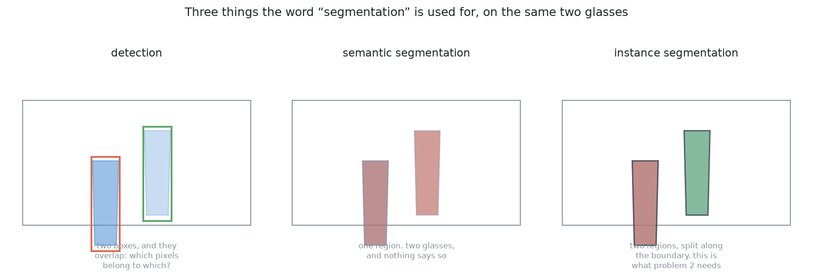
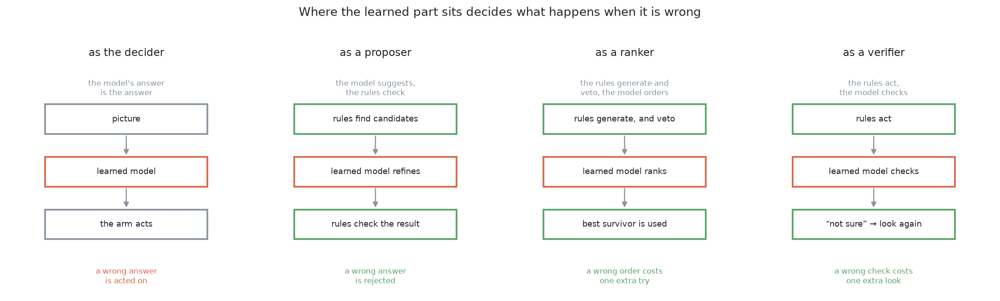
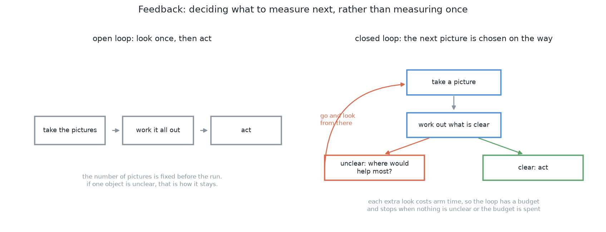
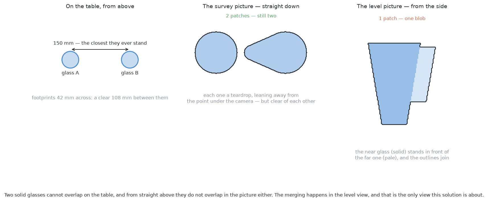
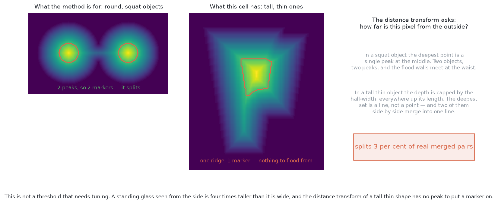
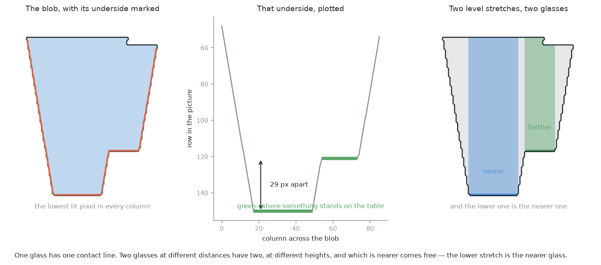
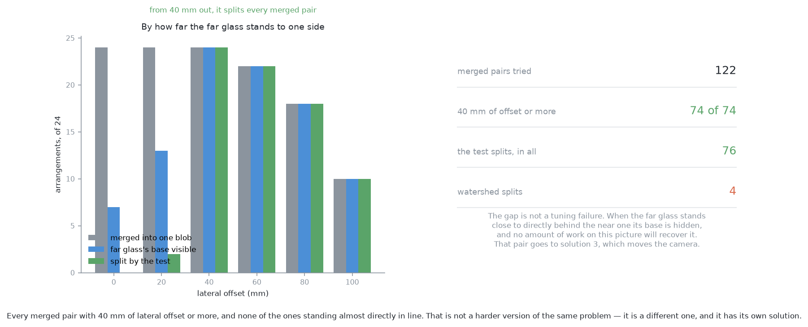
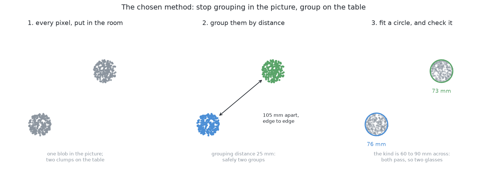

# Problem 2 — how it would be solved

[`problem.md`](../problem.md) says what is being asked for. This document says how
it would be answered. It is long, because the point of it is to compare five
ways of doing the job properly rather than to announce one.

> **The cell is described once, in [the cell](../../the-cell.md)** — the layout, the
> two camera poses, all four sensors, and the words this project uses them with.

## Where we are

The arm has photographed a table with four to six glasses on it. They are all
the same kind, the kind is known, and they are opaque, so the depth camera sees
them perfectly well.

What it has to produce is one set of pixels per glass, a place on the table for
each, and an honest list of the ones it could not separate. It does not pick
anything up. It does not measure a profile. Those come later, and they depend
on this being right, which is why a wrong answer here is expensive.

Two things stand in the way, and they are different problems wearing the same
coat.

**Glasses merge in the picture even when they are far apart on the table.** The
method problem 1 uses returns them as a single object. Two different geometries
cause it, and it is worth keeping them apart, because the documents below use
both.

*Looking along the line.* The camera stands level with the glasses and two of
them line up with it. The near one hides the far one. This is the measurement
view — the side-on picture problem 1 takes from 380 mm away — and the picture
in [`problem.md`](../problem.md) shows this case.

*Looking down.* The survey camera is 450 mm above the table looking straight
down. Here a glass does not hide another — but it does **splay**: the ray from
the camera through its rim carries on to the table further out than its base,
so the silhouette is a teardrop leaning away from the point under the camera,
and a 42 mm footprint comes back 156 mm wide. Every position the survey reports
carries that bias, which is why problem 1 measured a glass 157 mm away at
244 mm.

**Splay does not, however, merge two legal glasses.** This was worth checking
rather than assuming, and the answer is clean: across 4320 legal arrangements —
four kinds, six sizes each, separations from 150 to 300 mm, every angle — with
both glasses wholly inside one 320×240 frame, **not one came back as a single
patch**. The frame holds 520 mm of table but only about 358 mm at the height of
a rim, so two glasses far enough apart to be legal are either both in frame and
clearly separate, or one of them is falling off the edge. A glass half out of
the picture is a real problem, and it is the one the overlapping stations and
[solution 3](#solution-3--move-the-camera) exist for — but it is not a merge.

So the two views fail differently, and the fixes do not transfer. The level
view merges constantly and has [solution 1](#solution-1--split-the-blob-in-the-picture)
to unpick it. The survey view never merges, and its difficulty is the second
one below.

**The camera can no longer stand wherever it likes.** Problem 1 measures a
glass from whichever of nine directions the arm can reach, and with a bare
table several always work. With five glasses, a direction has to clear the line
of sight, the arm's own path, and the edge of its reach at the same time.

## The words, first

Five terms are used throughout, and three of them are used loosely almost
everywhere else. It is worth fixing them before the solutions start.

A **pixel** is one dot in a picture. This camera takes pictures 320 dots wide
and 240 tall.

A **mask** is a picture the same size where every pixel is just yes or no. Here,
yes means "this pixel is part of a glass".

**Connected components**, also called a flood fill, is the step that turns a
mask into separate objects. Take a yes pixel nobody has visited, spread out to
every yes pixel touching it, and call that patch one object. Repeat. It answers
exactly one question — *are these pixels joined?* — and it never asks anything
else, which is the root of the first difficulty above.

A **point cloud** is what you get when every pixel with a depth reading is
turned into a point in the room. The pixel says which direction the camera was
looking, the depth says how far along that direction to go, and the camera's
pose says where the direction starts. Problem 1 already does this.

**Segmentation** is the word that carries three different jobs, and only one of
them answers this problem.

- **Detection** puts a rectangle round each object. Two overlapping glasses get
  two overlapping rectangles, and the pixels in the overlap belong to both.
- **Semantic segmentation** labels every pixel with a class. Every glass pixel
  comes back labelled "glass", and nothing says which glass. Two overlapping
  glasses are one region — which is the merge this problem exists to prevent.
- **Instance segmentation** labels every pixel with a class *and* with which
  object it belongs to. Five glasses come back as five separate masks.

Problem 2 asks for instance segmentation. Anything that gives less than that
has not answered it.

## Three families, and what "hybrid" means

Every solution below belongs to one of three families. The difference is worth
setting out before the list, because it is not quite the difference most people
expect.

**Programmed.** You state the rule and the computer applies it. No training
data, no model file, no graphics card. It runs in about a millisecond, it works
on an object it has never seen, and when it fails you can usually find out why
by printing one number. Its limit is that somebody has to be able to write the
rule down, and for some questions nobody can.

**Learned.** The behaviour comes from numbers fitted to examples rather than
from a rule anybody wrote. It can do things nobody knows how to state — telling
one object from another in a cluttered photograph, for one — and it pays for
that with a training set, a file of weights that has to be kept in step with
the world, hardware to run it on, and an answer that cannot explain itself.

**Hybrid.** Both, arranged so that the learned part sits inside something
checkable.

The interesting question about a hybrid is not how much of it is learned. It is
**where the learned part sits**, because that is what decides what happens when
the model is wrong — and a model is wrong sometimes, by construction.

There are four positions, and only the first is what most people picture when
they hear "we used a model".

**As the decider.** The model takes the input and its answer is the answer. A
wrong answer is acted on, because nothing downstream is in a position to
disagree.

**As a proposer.** The rules find candidates and hand the hard ones to the
model; the model suggests something better; the rules then check the
suggestion. A wrong suggestion is rejected by arithmetic, and the system falls
back to what it had.

**As a ranker.** The rules generate every candidate *and* veto the unsafe ones.
The model only puts the survivors in order. A bad ordering costs one wasted
attempt. It cannot cost anything worse, because every candidate had already
passed the safety checks before the model saw it.

**As a verifier.** The rules act, and the model's job is to check what actually
happened. A wrong check costs one extra measurement.

The last three share a property worth naming, because it is the whole argument
for hybrids in a physical system: **the learned part's mistakes are bounded by
something that does not need the model to be right.** That is not a statement
about model quality. A better model narrows the failures; only the arrangement
caps them.

One practical consequence is worth having in mind while reading. A hybrid is
usually *cheaper* than a full learned solution, not more expensive, because the
learned piece has one narrow job. Learning "is this one object or two, given
this crop" needs a fraction of the data of learning "find all the objects", and
it trains on a laptop.

## Feedback: choosing what to measure next

The second theme running through what follows is that **the number of
measurements does not have to be decided in advance.**

Most pipelines are open loop. Take the pictures, work everything out, act. The
number of pictures is fixed before the run starts, so if one object turns out
to be unclear, unclear is how it stays. Everything downstream inherits the
doubt without being told there was one.

A closed loop spends its measurements where they are needed. It takes a
picture, works out what is settled and what is not, and if something is not, it
asks a different question: *where would I have to look for this to become
clear?* Then it goes and looks there, and repeats.

Three things are needed to make that work, and a solution that has only two of
them is not really a loop:

1. **A measure of doubt.** Something that distinguishes "settled" from "not
   sure", rather than always producing an answer. A method that cannot be
   unsure has nothing to drive the loop with.
2. **Actions that could reduce it.** A set of measurements the arm could
   actually take — reachable camera poses, a touch, a different angle — and
   some way of guessing which would help.
3. **A budget.** Every extra look costs arm time, which is by far the most
   expensive resource here. Moving the camera and letting it settle costs
   seconds; running any of the models below costs milliseconds. So the loop has
   to stop, and the sensible rule is to stop when nothing is unclear *or* the
   budget is spent, reporting whatever is still doubtful rather than guessing
   at it.

That third point reverses an instinct most developers bring with them. The
thing to economise on is not computation. It is the number of times the arm has
to move.

## Everything here runs in simulation

One rule has been applied to every solution below, and it is worth stating
before the list because it removed some obvious candidates.

**A solution is in this document only if everything it needs can be produced by
Gazebo on the machine this project runs on** — an Apple Silicon Mac with no
NVIDIA graphics card, no robot on a bench, and no real-world data. Four
conditions:

1. **No artefact from outside.** Any model has to be trainable from what the
   simulator renders. A downloaded file of weights fitted to photographs of the
   real world is not reproducible here, however good it is.
2. **No sensor the simulator does not have.** This cell has a depth camera, pad
   contact sensors and a wrist force-torque sensor. Anything else is a purchase
   order.
3. **No graphics card it has not got.** Anything needing compiled CUDA kernels
   is out.
4. **Hours, not days.** A method needing a week of continuous simulation to
   train cannot be iterated on, and a method you cannot iterate on will not get
   debugged.

That rule is not a view about learned methods. Several good answers fail it,
and they are written up in full in
[`learned-with-hardware.md`](learned-with-hardware.md) beside the condition
each one fails — a promptable foundation model, a fine-tuned instance
segmenter, and the rest. None of them needs a different *algorithm* to become
usable. They need a different *setup*.

The rule does have one consequence worth seeing coming. It pushes the learned
solutions towards **small models trained from scratch on synthetic data**, and
away from the fine-tune-a-big-model recipe that is the default advice
everywhere else. For a cell that handles one kind of object, under one lighting
setup, through one camera, that turns out to be less of a sacrifice than it
sounds — and the sections below say where it does cost something.

### What is actually installed

"Runs in simulation" is not the same as "runs today", and the difference is one
line of `pixi.toml` for some solutions and a real decision for others. What the
environment holds right now:

| Package | Installed? | Which solutions need it |
|---|---|---|
| NumPy | **yes** | all of them |
| OpenCV | **yes** | 1, 3 |
| Matplotlib | **yes** | the diagrams only |
| SciPy | no | 4, 7 |
| scikit-learn | no | 5, 8 |
| PyTorch | no | 4, 5 (optional), 7, 8, 9 |

Solutions 1, 2 and 3 need nothing added. Everything from 4 down starts by
adding a dependency, and PyTorch in particular is a large one to take on for a
cell whose chosen method is 25 lines of NumPy. That is not an argument against
the learned solutions — it is part of their cost, and it belongs in the
comparison rather than being discovered later.

## The nine solutions, at a glance

Three programmed, three hybrid, three learned — and every one of them buildable
inside the simulator.

| | Solution | Family | Where the learned part sits | Closed loop? | Verdict |
| --- | --- | --- | --- | --- | --- |
| 1 | [Split the blob in the picture](#solution-1--split-the-blob-in-the-picture) | programmed | — | no | free, and the right first pass in the level view |
| 2 | [Cluster on the table](#solution-2--cluster-on-the-table) | programmed | — | no | **chosen — the core** |
| 3 | [Move the camera](#solution-3--move-the-camera) | programmed | — | **yes** | **chosen — the loop** |
| 4 | [Learned doubt steers the next picture](#solution-4--learned-doubt-steers-the-next-picture) | hybrid | ranker | **yes** | the richest version of solution 3 |
| 5 | [A learned verifier over the clusters](#solution-5--a-learned-verifier-over-the-clusters) | hybrid | verifier | **yes** | **the first learned thing worth adding** |
| 6 | [Learn which viewpoints pay off](#solution-6--learn-which-viewpoints-pay-off) | hybrid | ranker | **yes** | supervised, where solution 3 is a rule |
| 7 | [A segmenter trained from scratch](#solution-7--a-segmenter-trained-from-scratch) | learned | decider | partly | one class, one camera, one afternoon |
| 8 | [Per-pixel votes for the centre](#solution-8--per-pixel-votes-for-the-centre) | learned | decider | partly | the learned answer that actually separates |
| 9 | [Self-supervised from the arm's own movement](#solution-9--self-supervised-from-the-arms-own-movement) | learned | decider | **yes** | needs no labels at all, not even the simulator's |

Each is written the same way: what it is, why anyone does it like that, how it
would work in this cell, **the feedback loop** if it has one, a worked example
with real numbers, what it needs, what it is good and bad at, how it fails, and
when it would be the right choice.

---

## Solution 1 — split the blob in the picture

*Programmed. Keep the mask the detector already builds. When one patch is too
wide to be a single object, cut it in two, using nothing but the picture.*

Sometimes two glasses line up with the camera. The near one stands in front of
the far one, so in the picture they touch and look like one object. This
solution separates them. It does not need depth, a trained model, or a second
photograph. It works because the camera looks straight ahead from 120 mm above
the table. The table then stretches away to a horizon, and **a glass that is
further away has its base drawn higher up in the picture**. So we look along the
bottom edge of the shape and find the flat parts. One glass gives one flat part.
Two glasses at different distances give two flat parts at different heights. The
lower one is the nearer glass. The method takes less than a millisecond, it
never cuts a single glass in two by mistake, and it says "I cannot tell" when
the far glass's base is hidden.

**The long version:** [01-split-the-blob-in-the-picture.md](01-split-the-blob-in-the-picture.md) — this solution explained
from the beginning, with diagrams.

### Which view this is about

This matters more than anything else in the section, because the obvious answer
is wrong.

**The survey never produces the case.** Two solid glasses cannot interpenetrate,
and problem 2 guarantees 150 mm between centres, so their footprints are never
closer than about 45 mm. Looking straight down from 450 mm, their silhouettes
do not touch either. Across 4320 legal arrangements — four kinds, six sizes,
every separation from 150 to 300 mm, every angle — with both glasses wholly
inside one 320×240 frame, **none merged**. A survey picture holds 520 mm of
table but only 358 mm at the height of a rim, so two legal glasses are either
both in frame and clearly separate, or one is falling off the edge, which the
overlapping stations already handle.

**The level view produces it constantly.** With the camera 380 mm from a glass
and looking level, a glass 180 mm further back really is behind it. Of 168
in-line pairs across the four kinds, 132 came back as one patch.

So this solution belongs to the level view — the one
[solution 3](#solution-3--move-the-camera) sends the camera to — and nowhere
else.

### What it is

Problem 1 builds a **mask**: each pixel marked yes where the point there stands
above the table top. It then runs **connected components**: take an unvisited
yes pixel, spread to every yes pixel touching it, call that patch one object.

That answers one question — *are these pixels joined?* It never asks how wide
the patch is. Two glasses whose silhouettes touch come back as one patch, and
one patch means one glass downstream.

This solution adds a step: when a patch is too wide to be one glass, cut it,
using only the picture.

### Why anyone does it this way

Because the information is already there and costs nothing to read. The camera
sits 120 mm above the table and points level, so the table recedes to a horizon
and depth is written into the picture as height. A glass 380 mm away has its
base 87 pixels below the horizon; one 560 mm away has its base 59 pixels below
it. Twenty-eight pixels, from geometry that is fixed and known.

It is the same reasoning a **ground-plane assumption** does in a driving
pipeline, where the row at which an object meets the road gives its distance.
Robotics-basics sets out the general form in
[what a single camera can and cannot tell you](https://github.com/RobinNagpal/robotics-basics/blob/main/docs/06_object-perception/02_sensors.md).
This cell has an unusually clean version: a flat, level table at a known
height, and objects that all stand on it.

### The method the textbooks would reach for, and why it fails here

The standard tool for splitting a clump is **watershed on the distance
transform** — treat the patch as a landscape whose depth is each pixel's
distance from the outside, find the deepest points, flood outwards from each
until the floods collide. Robotics-basics sets it out under
[watershed and GrabCut](https://github.com/RobinNagpal/robotics-basics/blob/main/docs/06_object-perception/03_programmed-methods.md#15-watershed-and-grabcut).

It does not work on this cell's objects, and the reason is structural rather
than a threshold to tune. The distance transform of a **squat, round** object
has a single peak at the middle, and two of them give two peaks with a clean
waist between. A standing glass seen from the side is four times taller than it
is wide, so its distance from the outside is capped by its half-width all the
way up: the deepest set is a **ridge, not a peak**. Two overlapping ridges merge
into one, one marker survives, and there is nothing to flood from.

Measured across the four kinds: of 122 merged pairs, watershed split **four**.

**GrabCut** refines an outline and never decides how many objects there are, so
it belongs downstream of a split rather than in place of one.

### How it would work here

**1. Notice the patch is too wide.** The one number from outside the picture is
the widest the known kind can be. At 380 mm one pixel covers 1.37 mm, so a
90 mm rim is 66 pixels; allow two more for a rasterised edge, which rounds
outward on both sides. Anything up to 68 pixels is left alone.

**2. Take the underside.** For every lit column, the lowest lit row.

**3. Find the level stretches.** Maximal runs of columns whose row stays
constant to within a pixel, at least five columns long. Each is a place where
something stands on the table.

**4. Two stretches eight pixels apart or more means two glasses,** and the lower
one is the nearer one. Eight is derivable: 150 mm of depth separation is about
22 pixels here, and a rasterised edge is worth one or two.

**Why level stretches and not steps.** The obvious test — *is there a step in
the underside?* — catches 93 per cent of merged pairs and also splits **69 per
cent of single glasses**, because a stemmed glass's bowl overhangs its foot and
produces a 96-pixel step all by itself. Counting level stretches is immune:
however odd its shape, a glass rests on the table in exactly one place. Across
120 single glasses of all four kinds, it split none.

**Licence.** Nothing beyond NumPy: the underside is one `argmax` per column and
the runs are a single pass. `cv2.grabCut`, if used to tidy afterwards, is
OpenCV, Apache-2.0.

### A worked example

Camera level, 120 mm above the table. Two glasses of a kind whose rim is 90 mm
and base 43 mm, standing 140 mm tall. Glass A is 380 mm away, glass B 180 mm
further back and 60 mm to one side. One pixel covers 1.37 mm at A.

**What comes back.** One patch, 86 pixels wide — 118 mm, against the 68-pixel
limit the kind allows. Flagged.

**The underside.** Two level runs survive: columns 18–49 at row 148, and
columns 55–74 at row 119. **29 pixels apart**, against the 28 the geometry
predicts; the extra pixel is the rasterised edge.

**The answer.** Two glasses. The cut goes at column 52, and the lower run is the
nearer one, so the left piece is A and the right piece is B. Two masks and an
ordering, from one photograph and a third of a millisecond.

**What it has not produced.** Any position in millimetres. Both pieces are still
silhouettes, and a silhouette does not sit where its glass does — problem 1
measured what that costs: a glass 157 mm away reported at 244 mm.

### What it needs

The mask problem 1 already builds. One number from outside the picture, the
widest the kind can be, which its specification holds. The standoff the camera
used, to turn that number into pixels — which the arm knows, because it chose
it. NumPy; not even OpenCV, strictly. About thirty lines.

### What it is good at

It is nearly free — a third of a millisecond — and it adds no dependency, which
everything from solution 4 onward does. **It never invents a glass:** zero false
splits across 120 single glasses of all four kinds, and the method is built
round that asymmetry, because two wrong positions are worse downstream than one
patch honestly reported as unresolved. It returns the **ordering** as well as
the split, which is a genuine extra. Every step prints. And it **needs no
depth**: if the glasses become real glass and the depth camera returns a
glass-shaped hole, every method that clusters points in the room stops and this
one carries on, given a mask from colour.

### What it is bad at

**It cannot see a base that is hidden.** Of 122 merged pairs it split 76, and
the breakdown is sharp rather than gradual: from 40 mm of lateral offset onward
it split **74 of 74**; below that, two of 48. There is no middle ground to tune
into, because the question is only whether any of the far glass's base is
exposed.

**It gives no position.** Both pieces are silhouettes carrying the same bias
they started with.

**It assumes the table is flat, level and at a known height.** True here, and
still three assumptions. Five millimetres out of level costs about a pixel at
this standoff, which is tolerable; a sloping table would not be.

**It only works from a level camera** — which is consistent, since from the
survey view there is nothing to split.

### How it fails

**Silently, when the far base is hidden,** and the width check is what catches
it. The method fails to a flag rather than to a wrong answer, which is the whole
design.

**A glass cut off by the frame edge** has an underside that ends at the
boundary. The level-run test survives it, but the width check does not, because
a cut-off silhouette is narrower than its glass. A patch touching the edge
should be reported as cut off rather than measured.

**Something else standing in the patch.** The method finds level stretches, not
glasses. The rack's foot inside the same patch is a level stretch. The circle
fit in solution 2 is the guard.

**The standing objection, answered.** An earlier version of this section argued
that a method reasoning inside the picture cannot tell a projection accident
from two objects genuinely side by side. That is still true of the *width*
trigger, and it is no longer true of the split: the contact rows are a
measurement of depth, read off the picture. What remains true is that the method
cannot choose a better viewpoint, and when the base it needs is hidden that is
exactly what is wanted.

### When it would be the right choice

**First, in the level view**, because it is free and resolves most in-line
pairs. **Whenever there is no depth** — on real glassware, where clustering has
nothing to cluster. **As a second opinion**, because it fails in different
circumstances from the geometric methods, and two independent methods agreeing
is worth more than either alone.

Not in the survey, because there the case does not arise.
---

## Solution 2 — cluster on the table

*Programmed. Stop deciding which pixels go together by looking at the
picture. Decide it by looking at where they are in the room.*

A depth camera gives a distance for every pixel. That is enough to turn each
pixel into a point in the room: the pixel tells you the direction, the depth
tells you how far along that direction to go, and the camera's pose tells you
where the direction starts. Once the pixels are points, the question "which
glass is this?" stops being about the picture and becomes about distance on the
table. So we flatten the points down onto the table, group the ones that are
close together, fit a circle to each group, and check that circle against the
sizes this kind of glass can be. Two glasses that touch in a photograph are
still 150 mm apart in the room.

**The long version:** [02-cluster-on-the-table.md](02-cluster-on-the-table.md) — this solution explained
from the beginning, with diagrams.

### What it is

Stop deciding which pixels go together by looking at the picture. Decide it by
looking at the table.

Every pixel in a depth picture can be turned into a point in the room — the
pixel says which direction the camera was looking, the depth says how far along
that direction to go, and the camera's pose says where that direction starts.
Problem 1 already does this, to find out which points are above the table top.

Once the pixels are points, "which glass is this?" becomes a question about
distance in the room rather than about neighbouring pixels. Points that are
close together in the room are one glass. Points that are far apart are two,
**even when they were next to each other in the picture.**

Grouping points by how close they are is called **clustering**. The version
used here is the simplest one: start with a point, take everything within a few
millimetres of it, take everything within a few millimetres of those, and carry
on until nothing new is added. That clump is one object. Then start again with
a point that has not been used. It has a name — Euclidean cluster extraction —
and one parameter, the distance that counts as "close".

### Why anyone does it this way

Because it is the standard recipe for a robot arm over a table, and it has been
for twenty years. Robotics-basics sets it out as
[point clouds: remove the plane, then cluster](https://github.com/RobinNagpal/robotics-basics/blob/main/docs/06_object-perception/03_programmed-methods.md#16-point-clouds-remove-the-plane-then-cluster):
take the depth picture as a cloud of points, find the biggest flat surface and
delete it — that is the table — and group what is left into clumps. Each clump
is an object.

It is the default because of what it does *not* need. No training data. No
model file. No idea what the objects are. It works on an object the robot has
never seen, which no model trained on fixed classes does, and it gives 3-D
positions in metres directly, which is what the arm needs anyway.

This cell gets one simplification for free. The standard recipe finds the table
with RANSAC, a search that picks three points at random, makes the plane through
them, counts how many other points lie on it, and keeps the best after a few
hundred tries. Here the table is bolted to the same frame as the arm and its
height was measured at startup, so the plane is a constant and finding it is a
comparison rather than a search.

### How it would work here

Four steps, and the project already has the first.

**1. Points above the table.** Unchanged from problem 1. Every pixel with a
depth becomes a point; keep the ones more than 5 mm above the table top and
less than 260 mm above it, which is the tallest glass the cell handles.

**2. Group them by distance on the table.** Project each point straight down
onto the table and group the resulting dots. Two glasses 150 mm apart are two
groups of dots 150 mm apart, whatever the camera was doing. The grouping
distance has to be smaller than the gap between glasses and larger than the gap
between two points on one glass. Both ends are derivable. At survey height one
pixel is about 1.6 mm on the table, so a few millimetres clears the noise; call
the floor 10 mm. The ceiling is not the 150 mm the glasses stand apart, because
that is measured centre to centre and clustering sees *edge to edge*: subtract
the two radii and the widest glasses of one kind leave 60 mm, and across all
four kinds 45 mm. So the real window is about 10 to 60 mm. Take 25 mm:
comfortably above the noise, and comfortably below the smallest real gap.

Projecting down rather than clustering in full 3-D is worth doing on purpose.
A glass is a tall thin thing, and in 3-D its top and its bottom are 200 mm
apart, which is further than the gap to its neighbour. Flattened onto the table
it is a disc 75 mm across, and the ambiguity disappears.

**3. Fit a circle to each footprint.** A glass seen from above is a circle.
Fit one to each group's dots and you get a middle and a diameter, both better
than the bounding box the current code uses, because a fit uses every dot
rather than the two extreme ones.

Then check the diameter. **This is the step that makes the whole thing safe,
and it is only available because problem 2 says every glass is one known kind.**
The kind's own specification holds the range its rim can be.

Two ranges get used below and they are not the same number, so it is worth
naming them once. **Across all four kinds** a footprint runs 45 to 105 mm —
that is the widest the cell ever sees, and it is the bound anything
kind-agnostic has to cover. **Within one kind** it is much narrower; the kind
used in the worked examples here runs 60 to 90 mm. Problem 2 says every glass
on the table is one known kind, so the check is against the narrow range, and
that is exactly why this test is strong here and why problem 4 takes it away.

A footprint outside the kind's range is not one glass. Try two circles instead.
If two circles fit and both are in range, there were two glasses; if they are
not, say so and move on rather than guess.

#### When can a cluster actually be wrong?

This is worth settling now, because it decides what the six solutions after
this one are *for*, and it is easy to assume the wrong answer.

**Two glasses cannot merge into one cluster in problem 2.** The problem
guarantees the glasses stand at least 150 mm apart, centre to centre. Clustering
works edge to edge, so the closest two footprints can ever come is 150 mm minus
two radii: 60 mm for the widest glasses of one kind, 45 mm across all four.
Both are far outside a 25 mm grouping distance. Grouping in the room does not
merely usually work here — given clean points, it cannot fail. A pair closer
than 150 mm is [problem 3](../../problem-3/problem.md)'s input, and these same
methods will meet that case there.

So the ambiguity in problem 2 is not a merge. It is an **under-observed glass**,
and it is quieter and more dangerous. A glass standing behind a neighbour shows
the camera only the arc of its footprint that is not blocked. Fit a circle to
that arc and this is what comes back, at 1.6 mm of depth noise and a 75 mm
glass:

| visible arc | fitted diameter | centre off by | RMS residual | passes the 60–90 mm check |
|---|---|---|---|---|
| 300° | 75.3 mm | 0.4 mm | 1.48 mm | yes — and correctly |
| 130° | 72.7 mm | 1.6 mm | 1.61 mm | yes |
| 95° | 66.5 mm | **4.9 mm** | 1.67 mm | **yes — and wrongly** |
| 85° | 62.0 mm | **7.4 mm** | 1.73 mm | yes, 82 per cent of the time |
| 70° | 51.6 mm | 13.0 mm | 1.89 mm | no — caught |

Read the third row. A glass showing a 95-degree arc fits a circle of 66.5 mm,
which is comfortably inside the kind's range, so the range check passes and the
run reports a glass — standing 5 mm from where it really is. Nothing errors.
And notice the residual column: it barely moves, 1.48 mm to 1.89 mm, so the
quality of the fit does **not** betray the problem. The range check only starts
catching it once the arc is under about 80 degrees, by which point the position
is already 9 mm out.

Two things do detect it, and neither is clever: the **angular span of the arc**,
which is a number you can compute from the points you have, and **disagreement
between stations**, since a glass blocked from one station is rarely blocked
from another. Both are in step 4 below.

That is the real question problem 2 has to answer — not *split this blob*, but
*which glass have I not seen enough of, and where should I stand to see more of
it?* Solutions 3 through 6 are four answers to it.

**4. Agree across stations.** The survey already visits several stations and
merges what they saw. Ask more of it: a glass should be found in about the same
place from more than one station, and a group seen from one station only should
be reported as doubtful rather than as a glass. Two glasses that merge from one
station will almost never merge from another 200 mm away.

### A worked example

Two glasses, 75 mm across, standing 180 mm apart, with the camera in line with
both.

*In the picture:* one blob. Laid down on the table its edges are 260 mm apart —
the far glass's ray lands beyond the near one. Connected components returns a
single object 260 mm wide. No glass in the cell is wider than 105 mm, so
something is wrong, but the picture cannot say what.

*On the table:* the near glass's points land in a disc round (0.42, −0.31). The
far glass's points land in a disc round (0.55, −0.19). The nearest dot of one
group is 105 mm from the nearest dot of the other. At a 25 mm grouping distance
they are two groups, not one.

*The circle fit:* 76 mm and 73 mm. Both inside the kind's 60–90 mm range. Two
glasses, at those two places, with a width each. Done.

Now the awkward case — and by the note above, it is not the one you would
expect. The far glass is not merged with the near one; it is **hidden behind
it**. Only 95 degrees of its footprint reaches the camera. Those points cluster
on their own, 105 mm from the near glass's, and the circle fit returns 66 mm,
inside the kind's 60–90 mm range. The run would report two glasses and be
quietly wrong about where the second one stands, by about 5 mm.

What catches it is step 4. The arc spans 95 degrees where a clear glass spans
close to 300, and the second station, 200 mm away along the table, sees the same
glass through 240 degrees and puts its middle 5 mm from where the first station
did. The two stations disagree by more than depth noise allows, so the glass is
reported with the second station's fit and a note, not the average of the two.

For completeness, the case everyone expects: two glasses 90 mm apart, footprints
15 mm from touching, one group at 25 mm grouping, one circle fitted at 165 mm,
which no glass of this kind can be, and two circles of 74 and 72 mm that both
fit. That pair is real — but it is below problem 2's 150 mm floor, so it belongs
to [problem 3](../../problem-3/problem.md), which exists to move it.

### What it needs

Nothing that is not already installed. NumPy for the arithmetic. The depth
camera the cell already has. No model, no weights, no graphics card, no training
set, and no licence question.

About 25 lines of new code: the projection to the table, the grouping, and the
circle fit. Everything else exists.

### What it is good at

**It works on an object nobody has described.** The clustering knows nothing
about glasses. It groups points.

**It is fast and it is exact.** No inference, no sampling. On a 320×240 picture
this is a few milliseconds.

**It fails legibly.** Every step is a number you can print. A merged pair is a
diameter outside a range, and the report can say which range and by how much.

**The circle fit turns a guess into arithmetic.** "That is too wide to be one
glass" is a sentence with two numbers in it, and both are known.

### What it is bad at

**It cannot separate glasses that genuinely touch.** Distance separates them
only where there is distance. This is the limit that problem 3 exists to remove,
and it is a real one.

**The circle fit depends on knowing the kind.** That is what makes it strong in
problem 2 and it is exactly what problem 4 takes back. With four kinds on the
table the range is the union of four ranges, and a footprint too wide for a
tumbler is an ordinary wine glass foot.

**It needs depth.** Everything here begins with "turn the pixel into a point in
the room". Real glassware returns no depth at all, and then none of this runs.

### How it fails

**Two glasses one behind the other at almost the same distance** stay one
group, because on the table their discs overlap. The circle fit is the only
thing that notices.

**A glass at the edge of the picture** has half its points missing, and a circle
fitted to half a disc is biased towards the half you have.

**A reflection or a stray depth reading** adds dots where there is no glass. One
stray dot inside the grouping distance joins two groups into one. Dropping
groups below a minimum size handles most of this.

**The grouping distance is a chosen number.** 25 mm works for glasses 150 mm
apart. It will not work for glasses 20 mm apart, and problem 3's whole job is to
produce glasses that are further apart than that.

### When it would be the right choice

Whenever the objects are opaque, standing on a known surface, and mostly not
touching — which is to say, almost every table-top cell. It should be the first
thing tried, and the other four solutions in this document are what to reach
for when it is not enough: when the objects touch, when there is no depth, or
when the viewpoint itself is the problem.

---

## Solution 3 — move the camera

*Programmed, and a closed loop. Instead of working harder on the pictures
you happen to have, go and take better ones — choosing where to stand by a
rule you can print.*

A camera that can move is a different instrument from one that cannot, and this
solution treats it that way. Separating objects and finding a viewpoint are two
different problems. If one object stands behind another, no amount of processing
will produce the side-on outline the next step needs. The information was never
captured. So the arm goes and stands somewhere better. Three separate tests
decide where: a clear line of sight, a standoff point inside the arm's 300 to
780 mm working reach, and a path the arm can actually fly. The first two are
arithmetic, so they run before the motion planner is asked anything. An object
with no viewpoint left is not an error. It is the handover to problem 3.

**The long version:** [03-move-the-camera.md](03-move-the-camera.md) — this solution explained
from the beginning, with diagrams.

### What it is

Every other approach here takes the pictures as given and works harder on them.
This one changes the pictures.

**Active perception** is the idea that a camera which can move is not the same
instrument as one that cannot. A fixed camera receives whatever the scene sends
it. A camera on a wrist can be *aimed*, and the aiming is part of the
measurement. The name is from Ruzena Bajcsy's *Active Perception* (Proceedings
of the IEEE, 1988), and the claim is that a problem unsolvable from one
viewpoint, however clever the maths, is often easy once the camera may move.

**Next best view**, usually NBV, is the loop that follows. Given what has been
seen, and the viewpoints the camera could reach, which one next? The term is
Connolly's, from *The Determination of Next Best Views* (ICRA, 1985).

### Why anyone does it this way

Because projection throws information away and only some of it can be
recovered. [`problem.md`](../problem.md) says it plainly: two glasses in line
with the camera land on top of each other, and the picture no longer holds
which pixels were near and which far.

*Some* of it comes back without moving. [Solution 1](#solution-1--split-the-blob-in-the-picture)
reads the contact rows and recovers the split in three cases out of four. But
it recovers nothing at all when the far glass's base is hidden behind the near
one, and that is precisely the arrangement most in need of an answer. A camera
200 mm to the left simply has the fact.

It is also cheap. A trained instance model wants a labelled set, weights and a
graphics card this cell has not got. An extra viewpoint costs seconds of arm
motion.

### How it would work here

An NBV loop has four parts: a **belief** about what is out there, a set of
**candidate viewpoints**, a **score** for how much each would help, and a
**cost** to reach it.

*Belief.* The survey already builds one: every cluster has a position, a
footprint circle and a confidence.

*Candidates.* Problem 1's `_standoffs()` already makes nine directions round a
glass at 380 mm, level, 120 mm above the table, and making that finer is free.

*Score.* The textbook score is **information gain**: mark the room in small
cubes as free, occupied or unknown, cast a ray per pixel from the candidate
pose, and count the unknown volume it would resolve.
[OctoMap](https://octomap.github.io/) (Hornung et al., *Autonomous Robots*,
2013; BSD licence) is the standard implementation, and MoveIt 2 keeps one
already, through its occupancy map monitor. Isler et al. (ICRA 2016) and
Delmerico et al. (*Autonomous Robots*, 2018) work the variants through, and it
is all CPU ray casting, so none of it wants CUDA.

It is also more than this cell needs. With one known kind and five glasses the
doubt is a short list of questions, mostly *have I seen enough of that glass to
believe where it is?* So the score becomes a heuristic: prefer the viewpoint
whose wedge holds the doubtful cluster and no other glass, then the one needing
least reach.

That tie-break has a blind spot worth naming, because it is structural rather
than an oversight. Reach depends only on the angle between the standoff
direction and the line out from the arm's base — so **every viewpoint has a
mirror image with identical reach**. Whenever two candidates sit either side of
that line, least-reach cannot separate them, however different what they would
see. One of the two may look straight along the direction that is hiding the
glass and learn nothing. This is the specific gap
[solution 6](#solution-6--learn-which-viewpoints-pay-off) exists to fill, and it
is also fixable without a model, by preferring the candidate perpendicular to
the line joining the doubtful glass and whatever is blocking it.

*How many candidates.* This turns out to matter more than anything else in the
solution. The cell's `_standoffs()` offers nine directions, 40 degrees apart.
Over 600 drawn arrangements, **45 per cent of glasses have no usable viewpoint
on that grid — and only 14 per cent on a 5-degree one.** The clear arcs in a
typical five-glass scene run 34, 16, 110, 7 and 10 degrees wide, so only one of
the five is wider than a single 40-degree step. Most of what this cell reports
as "no viewpoint" is the grid running out, not the geometry. Refining the
candidate set costs arithmetic and nothing else, and it is the cheapest real
improvement available here.

*Cost.* The camera is on the wrist, so every viewpoint is an arm pose, and can
be unreachable or unplannable. Test reach with inverse kinematics first —
MoveIt 2's `setFromIK`, milliseconds — then call the planner on the survivors,
best first.

### A worked example

Glass A stands at x = 0.40, y = −0.30, so 500 mm from the base. Glass B is at
x = 0.52, y = −0.39: 650 mm out, 150 mm from A. The unit vector A→B is
(0.8, −0.6).

Two of the nine directions lie along that line, and both die on reach alone.
Standing 380 mm back from A on the far side from B puts the camera at
(0.096, −0.072) — **120 mm from the base**, inside the 300 mm minimum. On B's
side it lands at (0.704, −0.528) — **880 mm**, past the 780 mm limit.

The first was blocked as well. From there B is 530 mm away, and at fx = 277.1 a
105 mm footprint spans 105 × 277.1 / 530 ≈ **55 pixels** of the 320 across,
directly behind A. Two glasses, one silhouette.

Now the perpendicular direction, unit (0.6, 0.8). The camera goes to
(0.628, 0.004) — **628 mm from the base**, inside 300 to 780 — with B 90
degrees off the line of sight. At 380 mm one pixel covers 380 / 277.1 =
**1.37 mm**. That is the next best view, and arithmetic found it before the
planner was asked anything.

### What it needs

A belief to start from, which is the chicken and egg: you cannot predict what a
viewpoint would show without knowing roughly what is on the table, and that is
the job.

Two ways out. One is to score unknown volume rather than objects: at the start
everything is unknown, so a volumetric score works from nothing, which is what
exploration planners such as Bircher et al.'s open-source receding-horizon NBV
planner (ICRA 2016) do. The other is to keep the fixed opening sweep and go
adaptive afterwards, and that is the one to use here, because the sweep exists.
The three stations assume nothing, cover the 320 × 360 mm zone at 35% overlap,
and hand back a coarse map; NBV then runs on the doubtful clusters only. It is
the tail of the survey, not a replacement.

Last, a cost model. One extra look is a plan, a move, a settle and the two
pictures 120 mm apart that parallax wants — about what one more station costs,
and the figure should be timed from `_survey()` rather than guessed here. With
it goes a cap: two extra looks per cluster, stopping when the circle fit
passes.

### What it is good at

Merges caused by where the camera happened to be, which is most of them. A
merge is an accident of geometry, and geometry is what an arm can change. The
loop stops when the doubt is gone, so a run that stops early names the cluster
it stopped on.

### What it is bad at

It is heavier than the problem needs, which is why the overview marks it *the
right idea, more than is needed*: a bounded search with a fixed scoring rule
gets most of the benefit and no loop. It also spends arm time to buy certainty,
and six glasses each wanting a confirming look is six extra stations.

### How it fails

**No candidate survives.** If all nine directions round a glass are out of
reach, blocked or unplannable, the search returns nothing. That is not a
perception failure but a fact about where the glasses stand, and the only
remedy is to move one — the handover to
[problem 3](../../problem-3/problem.md).

**The belief is wrong where the score cannot see it.** Occlusion is predicted
from footprint circles, so a merged pair modelled as one wide circle predicts
its own occlusions wrongly, and the loop chooses a viewpoint that is blocked.

**It thrashes.** Without the cap, a doubtful cluster pulls look after look and
the run never ends.

**Real glassware removes the belief**, which starts from depth readings that
real glass does not give.

### When it would be the right choice

When scoring a viewpoint is cheap next to moving to it, and there is a
specific, nameable doubt to settle. Here: run the fixed survey, fit circles,
then invoke the loop only on clusters that failed the fit or were seen from one
station. Full information gain earns its weight at problem 4, where several
unknown kinds mean the doubt stops being a short list.

---

## Solution 4 — learned doubt steers the next picture

*Hybrid, with the model as a ranker. The fixed sweep happens first. Then a
learned estimate of how unsure each object is decides which extra picture is
worth taking, from candidate poses the geometry has already filtered.*

The arm cannot look everywhere, so it has to choose. This solution leaves the
geometry in charge of where the camera is allowed to stand — it must be
reachable, not blocked, and the planner must accept it. A learned number then
does the smaller job of saying which of the survivors is worth the seconds. That
number estimates how much doubt a look would remove. It can never let in a pose
the arithmetic rejected, and it can never declare an object settled. That
ordering is what makes this a hybrid, and it is what limits the damage when the
estimate is wrong — which is the failure the whole design is arranged around.

**The long version:** [04-learned-doubt-steers-the-next-picture.md](04-learned-doubt-steers-the-next-picture.md) — this solution explained
from the beginning, with diagrams.

### What it is

Solution 3 moves the camera by a rule somebody wrote. This one moves it by a
number the machine learned.

**Uncertainty** is a number the perception step returns beside its answer,
saying how far to trust it. A **detection** — a rectangle round an object —
gets one number. A **segmentation** — a yes-or-no label per pixel — gets one
per pixel, so the doubt is itself a picture: a map of where the model is
guessing.

**Aleatoric** doubt is noise in the picture; another picture from the same place
will not remove it. **Epistemic** doubt is the model not knowing, and a better
picture will ([Kendall and Gal](https://arxiv.org/abs/1703.04977)). Only
epistemic doubt is worth an arm move.

The survey runs first and is not learned. Then a loop: score the reachable
viewpoints by how much each should cut the doubt, take that picture, run the
geometry again.

### Why anyone does it this way

A hand-written score can only be suspicious of what its author knew to distrust.
A fitted score is not.

The real ways to get the number:

- **Predictive entropy.** A segmentation model ends in a softmax — a
  probability per class per pixel. Entropy over those is near zero when one
  class wins, high when two are level. One pass. But softmax scores are badly
  calibrated ([Guo et al.](https://arxiv.org/abs/1706.04599)): a confident wrong
  answer gets a confident low entropy.
- **Monte Carlo dropout.** Dropout switches random units off during training.
  Leave it on at inference, run the picture ten times, and measure the spread
  ([Gal and Ghahramani](https://arxiv.org/abs/1506.02142);
  [Bayesian SegNet](https://arxiv.org/abs/1511.02680) is the per-pixel version).
- **Ensembles.** Train five copies with different seeds and take their
  disagreement. [Deep ensembles](https://arxiv.org/abs/1612.01474) win most
  published comparisons and cost the most.
- **Evidential deep learning.** The network predicts a distribution *over* the
  class probabilities, so in one pass it can say "I have seen little like this"
  ([Sensoy et al.](https://arxiv.org/abs/1806.01768);
  [Amini et al.](https://arxiv.org/abs/1910.02600) for regression).
- **Disagreement between two views.** No model. Segment both pictures of a
  station, project each onto the table, and measure how far apart they put the
  same glass. The survey already takes two pictures 120 mm apart, so it is free.

[PyTorch](https://github.com/pytorch/pytorch) (BSD-3-Clause) gives dropout and
ensembles alone; [TorchUncertainty](https://github.com/ENSTA-U2IS-AI/torch-uncertainty)
and [Laplace](https://github.com/aleximmer/Laplace) package the rest. Both look
permissive, but I have not read their licence files.

### How it would work here

**The classical half.** The textbook score is **information gain**. Cut the room
into cubes, each holding a probability it is occupied: a cube at 0.5 is one bit
of doubt, a cube at 0.02 almost none. Cast a ray per pixel from a candidate pose
and add the entropy of every cube it crosses.
[OctoMap](https://octomap.github.io/) (BSD-3) is the usual store.

CPU-feasible? Comfortably. At 5 mm cubes the 320 x 360 mm zone, 230 mm tall, is
64 x 72 x 46 — about 212,000 cubes. One candidate casts 76,800 rays across tens
of cubes each: milliseconds, and two dozen stay under a second, with nothing
wanting CUDA on this Apple Silicon Mac. But occupancy entropy answers *where is
the room unmapped*, and the doubt here is *one glass or two*.

**The ordering is the whole point.** Candidates are generated and filtered
geometrically *before* anything learned runs.

1. **Generate.** `_standoffs()` makes nine directions round a target at 380 mm,
   level, 120 mm above the table. Make it 24 at 15-degree spacing.
2. **Reach.** The camera lands at the cluster plus 380 mm along the direction,
   and must be 300 to 780 mm from the base.
3. **Occlusion.** Reject any line of sight passing through another cluster's
   fitted footprint circle.
4. **Plannability.** Inverse kinematics on the survivors — MoveIt 2's
   `setFromIK`, milliseconds each.

The model scores only what is left. It never proposes a pose, only ranks ones the
arm is known to reach — the ordering that makes this hybrid.

**Training.** In: the picture, the belief, one candidate pose. Out: the expected
drop in that object's uncertainty. Labels are free — render the view, run the
geometry, measure the drop. [Gazebo](https://gazebosim.org/) is Apache-2.0 and
already running, so a few thousand examples is an overnight job.

### The feedback loop

1. **Survey.** Three fixed stations, two pictures each. Not learned: it assumes
   nothing, which an adaptive method cannot do from a standing start.
2. **Geometry and doubt.** Cluster, fit a circle, check the diameter. A cluster
   is doubtful on an out-of-range circle, on two circles fitting no better, or on
   one station only.
3. **Choose.** Generate, filter, score, take the best.
4. **Move, photograph, back to step 2.**

It stops on no doubt left, the budget spent, or no candidate surviving — the
handover to problem 3.

### A worked example

The survey finishes with five clusters. All five fit circles inside the kind's
range — four between 71 and 78 mm, the fifth at **66 mm**. The range check is
content. What is not content is the fifth cluster's shape: its dots span only
**95 degrees** of that circle, and there are **115** of them where a 66 mm
footprint at this range should return about 340. It is a clean fit to a third
of a glass, and by the table in [solution 2](#when-can-a-cluster-actually-be-wrong)
its middle is about 5 mm from the truth. It stands 530 mm from the base;
budget, four extra looks.

**Reach.** The camera lands sqrt(530² + 380² + 2·530·380·cos θ) from the base,
where θ is the angle between the standoff direction and the line out from the
base. The 780 mm ceiling needs θ ≥ 63 degrees and the 300 mm floor θ ≤ 146, so
**ten of 24 survive.**

**Occlusion.** Two look through a neighbour: at 480 mm and fx = 277.1 its 105 mm
footprint spans 105 × 277.1 / 480 ≈ **61 pixels** of the 320, on top of the
target. **Eight left.**

**Score.** `setFromIK` fails on one, so **seven are scored**, milliseconds each.
The best predicts a 0.41 drop in mean per-pixel entropy, the runner-up 0.12.

**Move and re-run.** Plan, move, settle: seconds, then five pictures along the
120 mm slide rather than two, because a picture costs milliseconds. From the new
station the glass that was showing a 95-degree arc shows 250 degrees, and its
circle fits at **76 mm** with its middle **6 mm** from where the first station
put it — the error the first fit was hiding. Its neighbour, unblocked from both,
fits at 74 mm in the same place twice. Two glasses, 155 mm apart, both in range
and both now believed. One look spent of four.

### What it needs

One of the five uncertainty methods, bolted onto the segmenter in use. A scoring
model and the simulator run behind it. The geometric filter, needed anyway. And a
budget with arithmetic behind it: three stations at a few seconds each is the
run's cost today, and the whole run should take tens of seconds, so **two extra
looks per cluster and four per run** roughly doubles the survey. Six does not
fit.

### What it is good at

It spends arm time in proportion to the doubt, which a fixed rule cannot. And it
degrades gracefully: strip the model out and the filter still returns reachable,
unoccluded viewpoints — the first of which is solution 3.

### What it is bad at

It buys a better *ordering* where the cheap rule already picks an acceptable
viewpoint most of the time. With one known kind the doubt is a short list of
near-identical questions, which is not where learning earns its keep.

### How it fails

**Confidently wrong, which is worse than uncertain.** A merged pair comes back as
one clean mask with low entropy everywhere. Nothing is flagged, no look is taken,
and the run reports one large glass — the failure `problem.md` watches hardest.

Four guards, and none of them is the model:

- **The geometry decides; the model only orders.** Whether a cluster is resolved
  is the circle fit against the kind's own range, never the entropy.
- **A floor that ignores the score.** A cluster seen from one station only gets a
  look regardless.
- **The model-free cross-check.** If a station's two views disagree about a glass
  by more than depth noise allows, believe the disagreement.
- **Calibration, measured.** Against the simulator's record of what it spawned,
  check that the 90-per-cent-confident predictions are right 90 per cent of the
  time. If not, this is a heuristic wearing a weights file.

**Out of distribution.** The model is trained on one kind, and problem 4 puts
four on the table — an unfamiliar shape is where a miscalibrated model is most
confident. Without the cap on extra looks, a cluster resolvable from nowhere
pulls look after look, each scoring well and none helping.

### When it would be the right choice

When the doubt stops being a short list. Here it is *one glass or two*, asked
five times, and a fixed rule answers it. At problem 4 the kind is unknown, the
allowed diameter becomes the union of four ranges, and the doubt turns graded
rather than binary — which is when a per-pixel map says what a threshold cannot.
Build the filter now, and fit the model once a scored run shows where the cheap
rule chooses wrongly.

---

## Solution 5 — a learned verifier over the clusters

*Hybrid, with the model as a verifier. Do not learn the perception. Learn the
one question the rules are worst at — is this one object or two — on the crop
the rules have already isolated.*

Do not learn the perception. The geometry already separates almost every glass
on the table, in millimetres you can print. What it cannot settle is the handful
of groups on the boundary: one object, or two? So learn that one decision, from
the thirteen numbers the circle fit has already produced. The input is small, so
the model trains in minutes on a laptop. Its most useful answer is "I cannot
tell", which asks the arm for one more picture. Delete the weights file and the
geometry answers exactly as it did before.

**The long version:** [05-a-learned-verifier-over-the-clusters.md](05-a-learned-verifier-over-the-clusters.md) — this solution explained
from the beginning, with diagrams.

### What it is

Solution 2 groups points on the table and fits a circle to each footprint. The
residue is a narrow band where the fit is *ambiguous*: one circle slightly too
wide for the kind, or two circles that both fit badly.

This does not replace the geometry. It adds a **small learned classifier** with
one job: *is this group one object or two?* It is asked only about groups the
geometry could not settle, using numbers it already computed.

The pattern has no settled name. **Verifier**, when a cheap stage proposes and a
second checks. **Cascade**, when cheap tests run first and the costly one only on
survivors, as in
[OpenCV's cascade classifier](https://docs.opencv.org/4.x/db/d28/tutorial_cascade_classifier.html).
**Learned gating**, when a model picks a rule-based system's branch. "Residual
learning" is used this way in talk, but in papers it means a ResNet's skip
connections. In one sentence: **do not learn the whole task, learn the one
decision the rules are worst at.**

### Why anyone does it this way

The geometry is exact, fast and inspectable, and needs no data. Its weakness is
the threshold it must commit to — 90 mm is one glass, 91 mm is not — when reality
has no step in it there. A model gives a soft boundary instead, learned from
examples.

A model's weaknesses are data, opacity and going stale. Ask it one binary
question on a dozen numbers and all three shrink. Size matters too: **this is an
Apple Silicon Mac with no NVIDIA GPU**, where a full instance model costs a day
of fine-tuning and this forest costs seconds.

### How it would work here

**The input is features, not pixels.** A dozen numbers per doubtful group:

- fitted diameter over the kind's mean diameter;
- RMS residual of the one-circle fit, its worst single residual, the same for the
  best two-circle fit, and the ratio of the two;
- gap between the two candidate centres, in fitted radii;
- **angular span of the dots around the fitted centre**, which is what tells a
  whole footprint from an arc of one, and which nothing else in the pipeline
  looks at;
- dot count, and dots per square millimetre against what the camera predicts at
  that range — at 450 mm one pixel is 1.6 mm, so that is arithmetic;
- stations that saw it, how far its centre moved between them, and its height,
  inside the cell's 65–230 mm.

Features beat raw pixels here. They are in millimetres, so the model never
relearns the camera, and they do not change with where the arm stood. A dozen
numbers need hundreds of examples where a 320×240 crop needs tens of thousands.
And each prints beside the answer, so a wrong call is readable.

**The model.** A gradient-boosted tree or random forest from
[scikit-learn](https://scikit-learn.org/stable/modules/generated/sklearn.ensemble.HistGradientBoostingClassifier.html)
(BSD-3-Clause,
[licence](https://github.com/scikit-learn/scikit-learn/blob/main/COPYING)): a few
hundred shallow trees, seconds to train on the CPU. To use a 32×32 crop of the
mask as well, a tiny convolutional network in [PyTorch](https://pytorch.org/)
(BSD-3-style,
[licence](https://github.com/pytorch/pytorch/blob/main/LICENSE)) trains in minutes
on the Mac's MPS backend. Start with the trees.

**The data.** [Gazebo](https://gazebosim.org/) (Apache-2.0) knows what it spawned,
so every group comes labelled for nothing. Do not sample uniformly: spawn
layouts that put one glass **behind another from a survey station** — legal
separations of 150 mm and up, arranged so the arc the camera gets runs from a
full circle down to a sliver. That is where problem 2's ambiguity lives, not in
close pairs, which the problem does not allow. A few thousand rows is the order
to aim for, settled on a held-out set.

### The feedback loop

**The most useful output is not yes or no. It is "I cannot tell".**

The model returns a probability, calibrated on held-out data
([scikit-learn's calibration guide](https://scikit-learn.org/stable/modules/calibration.html)).
Two thresholds give three answers: one glass, two glasses, or abstain — Chow's
**reject option** (IEEE Transactions on Information Theory, 1970,
[IEEE Xplore](https://ieeexplore.ieee.org/document/1054406)).

An abstention is a request with an address: solution 3. The two-circle fit gives
two candidate centres, so the viewpoint that resolves them is the one
perpendicular to the line between them — a next-best-view with no search. Take
that picture, re-cluster, re-fit and ask again, capped at two extra looks. If it
still abstains, the pair is reported unseparated and handed to problem 3. The band
is a dial: wide buys certainty with arm time, narrow merges more.

### A worked example

The kind's footprint range is 60 to 90 mm. A group comes back with **115 dots**.
One circle fits at **66 mm**, RMS residual **1.67 mm**. Every number the
geometry looks at is content: the diameter is mid-range, the residual is one
pixel's worth, the fit is clean. Solution 2 would report a glass here and be
5 mm wrong about where it stands.

What the verifier sees that the range check does not: the dots span **95
degrees** of the fitted circle where an unblocked glass spans close to 300, and
115 dots is **a third** of the 340 a 66 mm footprint should return at this
range. A clean fit to a third of a glass.

The row: fitted diameter 66 mm, residual 1.67 mm, arc span 95 degrees, 115 dots
against 340 expected, one station, no second fit worth trying. It returns
**0.38** — inside the 0.25 to 0.75 band, so it abstains.

The arm takes one more picture, 380 mm back and 90 degrees round from the
blocked direction. The same glass now shows **250 degrees** and fits at **76
mm**, with its middle **6 mm** from where the first station put it. The
geometry answers on its own, and the answer is different from the one that
looked fine. The model's contribution was not the measurement. It was knowing
the first measurement was not to be trusted, and where to stand instead.

### What it needs

NumPy and scikit-learn, both BSD-3. One version-pinned weights file of a few
hundred kilobytes, checked in beside its loader. A feature extractor,
about thirty lines on solution 2's clustering. No GPU and no CUDA. And a hash of
the feature list inside the model file, so adding a feature makes the loader
refuse the old model rather than misread it.

### What it is good at

**It is small enough to trust, and cheap to retrain:** one binary question, a
dozen inputs, a training set you can look at.

**It degrades to the geometry.** Missing file, corrupt file, wrong feature list,
failed import — the caller catches it and abstains on every doubtful group, which
is what solutions 2 and 3 do today. A few more pictures, a few more unseparated
pairs, and nothing downstream notices but the timing. A learned component whose
worst case is the previous behaviour is a rare and valuable thing.

**Its failures are bounded.** It cannot invent a glass, move a position or report
a width. Those come from depth measured during the run.

### What it is bad at

**It is only as good as the band it is asked about.** Draw that band wrong and it
never sees the cases that matter.

**It holds a size-shaped prior.** Ratios help, but a model trained on one kind has
learned that kind's proportions — knowledge about glass sizes in a file nobody can
read, which the report should admit. And it does not carry into problem 4, where
the allowed range becomes a union of ranges and the question changes.

### How it fails

**Confidently and wrongly.** A merged pair scored 0.95 for "one glass" is the
failure to watch hardest. Miscalibration is how it arrives: a probability that
looks decisive because the training set held too few hard cases.

**It abstains on everything.** A change in the camera, the table height or the
lighting shifts the features away from what it saw, every group lands in the band,
and the arm thrashes. Loud, which is the good news.

**It goes stale silently.** Change the spawner's proportion ranges and the model
describes glasses that no longer exist. The tests still pass.

### When it would be the right choice

When a programmed method already gets most of the way, the residual failure is one
nameable decision, and truth for it is cheap to generate. All three hold here, and
that is why this beats replacing the whole perception step: a model owning every
pixel costs thousands of labelled pictures and a day of training, cannot be
checked, and buys an answer the geometry already gives in millimetres.

It is wrong when the rules are not already close: a tie-breaker in front of a bad
answer is still a bad answer. And it is wrong on real glassware, where there is no
depth, no cluster and no circle to verify. That is solution 5's day.

---

## Solution 6 — learn which viewpoints pay off

*Hybrid, with the model as a ranker. Solution 3 scores a viewpoint with a rule
somebody wrote. This predicts, from an experiment the simulator can run
exhaustively, whether taking that picture will actually change the answer.*

Three solutions here choose where to look next. They differ in what they score.
This one scores the thing actually wanted: the chance that a picture from a given
pose splits an ambiguous group into two glasses. That question has an exact
answer the simulator can look up — spawn an arrangement, render from the pose,
see whether the ambiguity went away. So choosing a viewpoint becomes ordinary
supervised learning, on labels that are free and exact. The geometry still
generates the candidates and still holds the veto. The model only orders what
survives, so a bad prediction costs one wasted look.

**The long version:** [06-learn-which-viewpoints-pay-off.md](06-learn-which-viewpoints-pay-off.md) — this solution explained
from the beginning, with diagrams.

### What it is

Solutions 3 and 5 also pick where to look next, so the difference is what gets
scored. Solution 3 scores a candidate viewpoint with a rule somebody wrote:
prefer a clear line of sight, then least reach. Solution 4 scores it by how far
the perception step's **uncertainty** — the number it returns beside its answer
— should fall. This one scores neither. It predicts, directly, **whether the
picture would change the answer**: the probability that a picture from this pose
splits this ambiguous cluster into two circles the kind's range accepts.

A simulator can look that up. Spawn an arrangement, note the ambiguous clusters,
render from pose P, re-cluster, record whether the ambiguity went. That is the
label: free, exact, generated overnight.

### Why anyone does it this way

It makes choosing a viewpoint **supervised learning** — fitting a function from
inputs to known answers — which is the cheapest learning there is. Compare
[an active-vision policy](learned-with-hardware.md#an-active-vision-policy). A policy trained by reinforcement learning must work out which look
was the good one from a single reward at the end of an episode, and an episode
means the arm moving several times before anything is learned: days of machine
time, and a reward somebody must design and can get wrong. Here there is no
episode and no reward, because the label for one look does not depend on what
follows it — and Gazebo renders from any pose without the arm going there.

### How it would work here

**The target.** Binary: did the cluster become two in-range circles, yes or no.
A scalar version — the drop in the one-circle fit's RMS residual — trains the
same way, but an ordering needs only a ranking.

**The features are geometry, not pixels.** About twenty numbers per candidate,
all computable before the picture exists: the angle between the line of sight
and the line joining the two centres the two-circle fit proposed, ninety degrees
being the separating angle, and their separation in fitted radii; predicted
occlusion — how close the ray passes to each other cluster's centre, in that
cluster's radii; the standoff, and the reach, the camera's distance from the
base against the 300 to 780 mm limits; the angle from the nearest view
already taken, since a picture ten degrees from one in hand adds nothing; and
the cluster's own diameter.

Why not raw pixels? Decisively, **the picture does not exist yet**: there is
nothing to feed but predicted geometry. Twenty numbers also need far fewer rows
than a 320 by 240 input, and millimetres transfer where appearance will not.

**The model and the data.** A gradient-boosted tree,
[`HistGradientBoostingClassifier`](https://scikit-learn.org/stable/modules/generated/sklearn.ensemble.HistGradientBoostingClassifier.html)
from scikit-learn (BSD-3-Clause,
[licence](https://github.com/scikit-learn/scikit-learn/blob/main/COPYING)),
trains on the CPU in seconds; a small network in
[PyTorch](https://pytorch.org/) (BSD-3-style,
[licence](https://github.com/pytorch/pytorch/blob/main/LICENSE)) handles the
scalar target in minutes on the Mac's MPS backend.

[Gazebo](https://gazebosim.org/) (Apache-2.0) knows what it spawned, so the
label is read, not judged. Two thousand arrangements, each sweeping its
ambiguous cluster against the ten or so poses that survive the veto, is tens of
thousands of rows: a few hours unattended, nothing wanting CUDA.

**The ordering, which is the safety argument.** The geometry runs first and
holds the veto: 24 directions at 15-degree spacing, 380 mm back and 120 mm above
the table; reach rejects poses outside 300 to 780 mm; the line-of-sight test
rejects rays through another cluster's footprint; `setFromIK` from
[MoveIt 2](https://moveit.ai/) (BSD-3-Clause) rejects what the arm cannot hold.
**The model sees only the survivors, and only orders them**, so a bad
prediction costs one wasted look, never an unsafe move.

### The feedback loop

Predict, look, and then — the part worth being concrete about — **write down
what happened.**

1. **Fit.** A cluster failing the kind's range is ambiguous.
2. **Generate and veto.** 24 candidates, filtered for reach, occlusion and IK.
3. **Predict and order.** Score each survivor; take the highest.
4. **Move and photograph.** Seconds for the move, then five pictures along the
   120 mm parallax slide, since a picture costs milliseconds.
5. **Observe.** Re-fit. Two in-range circles, or not?
6. **Record.** One row: step 3's features, step 5's outcome.

Step 6 separates this from a model trained once. **The run-time label needs no
ground truth.** It is not *was the answer right* but *did the answer change*,
observable in normal running. So every look the arm takes is another labelled
example, and the predictor improves with use.

Two guards. Retrain offline, never mid-run, against a held-out set and a
calibration check
([scikit-learn's guide](https://scikit-learn.org/stable/modules/calibration.html)):
of the looks predicted at 0.9, do nine in ten resolve? And take the second-ranked
candidate one look in twenty, since a log of only the poses the model liked
teaches it nothing about the rest.

### A worked example

An ambiguous cluster stands 470 mm from the base. One circle fits at 158 mm,
outside the kind's 60 to 90 mm range; two fit at 76 and 71 mm, centres only
54 mm apart.

The camera lands 380 mm out, so its distance from the base is
sqrt(470² + 380² + 2·470·380·cos θ). The 780 mm ceiling needs θ ≥ 47 degrees and
the 300 mm floor θ ≤ 140: **twelve of the 24 survive**. Three look through a
neighbour, whose 105 mm footprint at 520 mm spans 105 × 277.1 / 520 ≈ **56
pixels** of the 320 across; `setFromIK` fails on one. **Eight are scored.**

The best scores **0.88**: near perpendicular to the 54 mm line, clear of every
footprint, 71 degrees from any view already taken. The runner-up scores **0.31**,
being 18 degrees from a station already visited — the feature a hand-written
rule has not got.

One move, three seconds. At 380 mm one pixel covers 1.37 mm, and the cluster
resolves into circles of 74 and 70 mm — **168 mm apart**, not the 54 mm the
merged view proposed. That under-estimate is not a mistake in the first fit; it
is what a two-circle fit must return when the far glass is mostly hidden, since
the only points it has to work with are on the near side. Which is the lesson
this solution's features carry: *separation in fitted radii* is a real signal
and a systematically biased one, and how much to trust it is exactly the kind
of thing a model can learn and a hand-written rule cannot. A row is appended,
outcome 1.

### What it needs

NumPy and scikit-learn, both BSD-3-Clause. A weights file of a few hundred
kilobytes, holding a hash of the feature list so a changed feature makes the
loader refuse rather than misread. The geometric filter, needed anyway. A log
file. And a sweep harness over Gazebo, which is the real work.

### What it is good at

It optimises the thing actually wanted — a look that changes the answer —
rather than a proxy for it, and gets most of what such a policy offers
with no episodes, no rewards and no days of machine time. Strip it out and the
order falls back to solution 3's rule.

### What it is bad at

It buys an ordering where the cheap rule already picks an acceptable viewpoint,
which with one known kind is often. It is useless when no candidate survives the
veto, which is what problem 3 exists for. And it needs the two-circle fit to
state the ambiguity, so a degenerate cluster arrives half described.

### How it fails

**It predicts a payoff that never arrives.** One look wasted, the pair reported
unseparated. Bounded and cheap.

**It predicts no payoff anywhere**, no look is taken, and a merged pair is
reported as one large glass — the failure `problem.md` watches hardest. The
guard is not the model: any cluster failing the circle fit gets one look whatever
the score.

**The log is a biased sample**, holding outcomes only for poses the model
already favoured, so retraining on it can entrench an early mistake.

**It goes stale silently** when the standoff list or the spawner's ranges
change. And real glassware removes its input altogether.

### When it would be the right choice

When the candidate list is long enough that the order matters, a wasted look is
the worst outcome, and the label is exact and free. All three hold here. Even
so, build solution 3 first and score a run: if its first choice usually resolves
the cluster, this earns nothing — and if it does not, the data for fixing that
is in the log already.

---

## Solution 7 — a segmenter trained from scratch

*Learned, as the decider, and trained from random initialisation on renders
alone. One class, one kind of object, one camera — a network that only has to
work in this cell can be small enough to train in an afternoon.*

This cell does not need a general-purpose model. One class, one kind of object,
one camera, one lighting setup, pictures 320 by 240. A small network — a U-Net of
about 482,000 weights, which is arithmetic on its channel widths and not a
measurement — can be trained from a random start on Gazebo renders alone, because
the simulator labels every picture exactly and for nothing. It returns a
probability at every pixel, and the pixels it is unsure about are a reason to
take another picture. It tells you *which pixels are glass*, but not *which
glass*, and it learns Gazebo rather than the world.

**The long version:** [07-a-segmenter-trained-from-scratch.md](07-a-segmenter-trained-from-scratch.md) — this solution explained
from the beginning, with diagrams.

### What it is

A **neural network** is a program whose behaviour comes from numbers fitted to
examples rather than rules anybody wrote. The numbers are **weights**: they
start as random noise, and **training** nudges each towards the answer wanted.

This one is trained from that random start on simulator renders and nothing
else, because **this cell does not need a general-purpose model**: one kind of
object, one camera, one lighting setup, 320 by 240 pixels. A network that only
has to work here can be small, and a small one with free labels trains in an
afternoon.

### Why anyone does it this way

**Fine-tuning** means taking a network somebody else trained on a large
collection of photographs and continuing its training on your own small set. It
is the default advice because **labelled real pictures are scarce**: somebody
must draw round every object by hand. That does not hold here: Gazebo renders
unlimited pictures with an exact mask per object, and with no annotator there
is no annotator error.

The borrowed weights are ruled out anyway. **Every backbone worth borrowing was
trained on real photographs** — ImageNet and COCO classifiers, Segment
Anything, any downloadable foundation model — and this cell has none, nor any
real-world data. Most want CUDA too, and this is an Apple Silicon Mac with no
NVIDIA card.

### How it would work here

**The architecture.** A **U-Net** (Ronneberger et al.,
[arXiv:1505.04597](https://arxiv.org/abs/1505.04597)) is an encoder-decoder:
the **encoder** halves the picture repeatedly while widening it — 320×240,
160×120, 80×60, 40×30 — so later layers see much of the scene, and the
**decoder** doubles it back. Its crossbars are **skip connections**: each
encoder level is copied to the decoder, so detail lost on the way down is there
on the way back.

Four channels in (red, green, blue, depth), two 3×3 convolutions per level at
widths 16, 32, 64 and 128, a mirrored decoder, a 1×1 convolution on top:
**about 480,000 weights**. That is arithmetic on those widths, not a
measurement, and whether they are *enough* is uncertain.

**Why that is enough.** Capacity is needed for variety, and there is almost
none here: one class, one camera, one lighting rig, and objects 65 to 230 mm
tall with footprints 45 to 105 mm, always upright and opaque. A borrowed
backbone spends most of its weights on the thousand things this cell never
contains.

**What it gives, and what it does not.** A per-pixel class map is **semantic**
segmentation: every glass pixel labelled "glass", and nothing saying which
glass. Problem 2 wants **instance** segmentation, so the separating has to come
from somewhere. The two cheap places to put it are a second channel predicting
the object **boundary**, or a per-pixel **offset towards its own object's
centre** — and offsets fail more gently, because one bad pixel in a seam
rejoins two objects. [Solution 8](#solution-8--per-pixel-votes-for-the-centre)
is that idea in full.

**The data and the recipe.** Gazebo spawns a random scene and writes the render
with the per-object masks it already holds. A few thousand scenes is the order
to aim for; how many is enough is uncertain. Loss is binary cross-entropy plus
Dice ([arXiv:1606.04797](https://arxiv.org/abs/1606.04797)), which scores
overlap, not pixel counts. Adam, batches of 16, epochs until the held-out loss
stops falling. [PyTorch](https://pytorch.org/) (BSD-3-style
[licence](https://github.com/pytorch/pytorch/blob/main/LICENSE)) with
[NumPy](https://numpy.org/) and [SciPy](https://scipy.org/) (both BSD-3) is all
it takes. Any ready-made U-Net defaults to an ImageNet encoder; that switch has
to be off. Time on **MPS**, PyTorch's route to Apple's GPU, is **uncertain**:
time one epoch and multiply, and expect CPU fallbacks.

**Domain randomisation.** [Gazebo](https://gazebosim.org/) (Apache-2.0) will
render the same table under the same light for ever, and a network given a
constant will use it. Randomising (Tobin et al.,
[arXiv:1703.06907](https://arxiv.org/abs/1703.06907)) varies everything you are
not teaching — light, textures, glass tint, camera pose, exposure, noise, how
many glasses and where — so shape is all that is left to learn. It matters
**inside one simulator**, because this cell's own lighting and table will
change during the project's life.

### The feedback loop

A per-pixel model returns a **confidence map** rather than a mask: a
probability at every pixel, near 1 where it is sure the pixel is glass, near 0
where it is sure it is not, and near 0.5 where it cannot tell.

Two things read off it: **how much** doubt surrounds an object and **where** it
sits.

"How much" needs care, because the obvious statistic does not work. Counting
the fraction of a region's pixels between 0.3 and 0.7 measures the rim, not the
doubt: every region has an uncertain rim a pixel or two wide, and for a glass
48 by 126 pixels that rim is already about 12 per cent of its area. The
interesting doubt is drowned before you start.

So **erode the region by 3 pixels first**, throwing the rim away, and count
what is left. A glass the network is sure about has essentially nothing
uncertain inside it. Doubt in a band across a region's middle is the signature
of a second glass behind it, and after erosion it is the only thing there.

So a region far more doubtful than its neighbours is one to photograph again,
and
the band gives the direction: look along it, not across. Cap it at two extra
looks, then report the object doubtful rather than guess.

### A worked example

At survey height, 450 mm up, fx = 277.1, so one pixel covers 450 / 277.1 =
**1.62 mm**. Two glasses of a kind whose footprint runs 60 to 90 mm stand
180 mm apart, in line with the camera. Each is 78 mm across, or **48 pixels**,
and their centres land **30 pixels** apart, so the silhouettes overlap and the
class map returns one region **79 pixels** wide.

The confidence map says more, once the rim is out of the way. Each glass stands
about **126 pixels** tall, so eroding 3 pixels off every side leaves interiors
of roughly 42 by 120 pixels for a clean glass and 73 by 120 for the merged
region. Across the three unoccluded glasses **under 1 per cent** of interior
pixels fall between 0.3 and 0.7. In the merged region a band **4 pixels wide**
runs the full 120 down the middle, where the near glass's edge crosses the far
one: about 480 pixels of 8,760, or **5.5 per cent** — five times its
neighbours, and in a shape that points somewhere.

So the arm looks again along that band, from 380 mm back, where one pixel
covers 380 / 277.1 = **1.37 mm**. The second picture returns two regions, each
confident to its rim.

### What it needs

PyTorch on MPS, NumPy and SciPy. NumPy and OpenCV are in the pixi environment
today; **PyTorch, SciPy and scikit-learn are not**, so every solution from here
down starts with adding dependencies, which is a decision rather than a
detail — see [what is actually installed](#what-is-actually-installed) above.
Gazebo, plus a randomising
spawner and a script that dumps each render with its masks. A version-pinned
weights file of about **1.9 MB** — 480,000 weights at four bytes each — or half
that if it is saved at 16-bit. No CUDA, no downloaded weights, no annotator.

### What it is good at

**It can be made to survive without depth.** As described the network takes
depth as its fourth channel, so it does not get this for free — a model trained
that way leans on depth and fails with it. The fix costs one line of the
training loop: **drop the depth channel at random**, on a third of the examples,
so the network is forced to learn the shape from colour as well. Then the same
weights run on colour alone, less accurately, on the day the glasses become
real glass and clustering loses its input entirely. That is the one thing this
solution offers that nothing else in this document does, and it is worth the
accuracy it costs.

**It is small enough to retrain on a whim**: change the lighting or the kind,
regenerate and retrain in an afternoon, where a fine-tune costs most of a day.

### What it is bad at

**It does not separate instances on its own.** A class map is one region per
clump; the separating has to be bolted on — solution 8.

**It says nothing in millimetres.** Every number the arm acts on comes from
measured depth.

**It carries a size-shaped prior nobody can read.** Trained on one kind's
range, it has learned that range — glass sizes in a file, which the report
should admit.

### How it fails

**It learns Gazebo.** A network trained only on renders has fitted one
renderer's shading, so pointed at a real camera it will not work, and domain
randomisation narrows that gap without closing it. **That is an accepted trade
here**, because this cell only ever runs in Gazebo, and stops being acceptable
the moment a real arm is involved.

**It is confident and wrong.** A merged pair can come back as one region with a
clean edge and no doubt in it. Nothing fires the loop, and one large glass is
reported. The guard is not the model but the circle fit against the kind's
range.

### When it would be the right choice

When the labels are free and the problem is narrow — one class, one camera, one
cell, and a simulator that labels pictures while you sleep. Those two are the
condition under which training from scratch beats fine-tuning, and it is wrong
the moment either goes.

---

## Solution 8 — per-pixel votes for the centre

*Learned, as the decider. Predict, at every object pixel, a short vector
pointing to the middle of the object that pixel belongs to — and separation
becomes counting clusters of votes.*

A network that labels each pixel "glass" or "not glass" cannot separate two
glasses that touch. A class label has nowhere to record *which* glass. So ask for
a different output: at each glass pixel, a short arrow pointing to the middle of
its own glass. Add that arrow to the pixel's own position and you have a vote.
One glass makes one pile of votes; two glasses make two. Predict the arrow **in
table millimetres** rather than image pixels, and the camera drops out of the
problem. The spread of a pile is a confidence, and a loose pile is a reason to
look again.

**The long version:** [08-per-pixel-votes-for-the-centre.md](08-per-pixel-votes-for-the-centre.md) — this solution explained
from the beginning, with diagrams.

### What it is

A network that labels every pixel "glass" or "not glass" is doing **semantic
segmentation**. Every glass pixel comes back labelled "glass", and nothing says
*which* glass, so two glasses whose outlines touch come back as one region —
and one region means one glass downstream. Training does not fix it: a class
label has no field in it for which object.

So ask the network for something else. At every glass pixel, predict **a small
vector pointing to the middle of the glass that pixel belongs to**. Pixels on
the left glass point right, those on the right glass point left, and following
every arrow to its end lands all of one glass's arrows on one spot. Separation
becomes **counting clusters of votes**, which is easy.

### Why anyone does it this way

The idea predates neural networks. The **generalised Hough transform**
(Ballard, *Pattern Recognition*, 1981) lets every edge point vote for where the
object's centre would be, then looks for peaks — Hough circle detection,
generalised to shapes with no equation. The learned version replaces the hand-built vote table
with a network trained on examples: first, I believe, **Hough Forests** (Gall
and Lempitsky, CVPR 2009), though the neural descendants go under several names
and I am not confident which is canonical.

A vote is **local evidence for a global claim**. One pixel cannot count the
glasses on the table, but it can know which way the middle of its own glass
lies, and hundreds of votes per centre mean a few wrong ones do not move it.

### How it would work here

**Vote in millimetres on the table, not in pixels in the picture.** That is
what makes it work on a small budget.

The table height is known and the glasses are opaque, so depth comes back for
every glass pixel, and solution 2 already drops each one onto the table. So
**every glass pixel already has a position on the table in millimetres** before
the network is asked anything, and its job shrinks to one question: how far and
which way to my glass's footprint centre?

**The target is then bounded and scale-free.** Footprints are 45 to 105 mm
across, so the offset never exceeds about 53 mm, at any range or angle. A
network predicting *pixel* offsets would have to learn that the same glass at
300 mm needs twice the offset it needs at 600 mm — that is, learn the camera.
In table millimetres there is none left to learn.

**The votes land where the answer is obvious.** On the table a glass is a disc
45 to 105 mm across, and its votes collapse to a point at its centre, where
solution 2's circle fit and diameter check run on them unchanged.

**The mask is free.** Nothing need be learned to decide *whether* a pixel is a
glass pixel: the existing test, 5 to 260 mm above the table top, says so. So
the network needs **two output channels**, dx and dy.

*The network.* A small U-Net: in, 320x240 and four channels, three colour plus
height above the table; out, two channels the same size. Loss, smooth L1 on dx
and dy in millimetres, over glass pixels only. **Trained from scratch**, since
a torchvision ResNet backbone would be downloaded weights, so the substitute is
a smaller network, of uncertain parameter count. PyTorch (BSD-3,
https://github.com/pytorch/pytorch/blob/main/LICENSE) on Apple's MPS backend,
there being no NVIDIA GPU; a few hours is the target, uncertain, to be timed.

*The data.* Gazebo Harmonic (Apache-2.0, https://gazebosim.org/) renders
unlimited pictures with exact per-object masks and positions, free, and the
label is arithmetic: for a pixel in glass *k*'s mask, target = *k*'s footprint
centre minus that pixel's own table position. Spawn pairs 60 to 120 mm apart,
where the ambiguity is.

*Votes to objects.* Put every vote down as a dot on the table. Slide a circular
window to the average of the dots inside it until it stops moving;
**radius 18 mm**, and the number is derivable at both ends. The floor is the
spread of the votes themselves, 6 to 8 mm when the network is right, so the
window has to be at least twice that or one glass breaks into several peaks.
The ceiling is the closest two centres can be: two 45 mm footprints touching
put their centres 45 mm apart, so a window reaching more than about 22 mm
swallows both. A 30 mm window spans 60 mm and merges exactly the pairs this
solution exists to separate. 18 mm sits between the two with room either side; every start ending in the same place is one peak. That is **mean
shift**, in scikit-learn as `sklearn.cluster.MeanShift` (BSD-3,
https://scikit-learn.org/stable/modules/generated/sklearn.cluster.MeanShift.html).
One peak is one glass; its voters are its mask.

### The feedback loop

**The spread of the votes is a confidence, and it comes free.** Measure the RMS
distance of votes from their peak on held-out renders: that is the spread when
the answer is right.

**Bimodal.** Two tight knots inside one cluster means two glasses, and the
peaks say where both are. Accept the split only if both circle fits land in the
kind's range.

**Smeared.** One broad cloud, no peak sharper than the rest, is the network
unsure, and re-clustering will not manufacture an answer. **An unsure cluster
is a reason to take another picture from a different angle**, and the cloud
says which: if the smear has an axis, look perpendicular to it, 380 mm back — a
next-best-view with no search in it. Cap at two extra looks, then report the
pair unseparated for problem 3.

### A worked example

At 450 mm up one pixel covers 1.6 mm, so a glass 75 mm across is 47 pixels
wide and holds roughly 1,700 votes.

*Where solution 2 fails.* Two such glasses stand 90 mm apart, footprints 15 mm
from touching, so at a 25 mm grouping distance they are one group, and one
circle fitted to it comes back at 90 + 38 + 36.5 = **164.5 mm**, 101 pixels,
which no glass of this kind can be. The votes do not care: peaks at (0.42,
−0.31) and (0.51, −0.30), RMS 6 and 8 mm, both inside the held-out spread.
Circle fits 76 and 73 mm, inside the kind's 60 to 90 mm range.

Note what this example is. Problem 2 guarantees 150 mm between centres, so a
90 mm pair is not something problem 2 will hand this solution — it is
[problem 3](../../problem-3/problem.md)'s input. That is the honest case for
building this: it is the one method here that keeps working after problem 2's
spacing guarantee is withdrawn, and the only one that separates glasses which
genuinely touch.

*Unsure.* A glass 80 per cent hidden leaves about 340 votes, all from one
crescent. Its peak sits 9 mm from the truth — the votes agree with each other
and are wrong the same way — and its RMS is 19 mm, three times the held-out
figure. One look perpendicular to the line joining it and its occluder brings
its votes back to 6 mm.

### What it needs

The depth camera, the known table height and the camera pose, which the cell
has. PyTorch on MPS, scikit-learn and Gazebo — licences above, none needing
CUDA or downloaded weights. On top of solution 2: a label generator, a training
script, a version-pinned weights file, and forty lines of peak-finding.

### What it is good at

**It separates glasses that touch**, which solution 2 cannot, because votes
need no gap — only enough pixels on each glass. And **its output is in
millimetres**, so the arithmetic still decides: every peak still goes through
the circle fit and the kind's diameter range.

### What it is bad at

**It learns the renderer.** Trained only on Gazebo output, it has learned this
simulator's depth noise, dropout and lighting. Domain randomisation mitigates
that, and with no real-world data nothing checks whether it worked.

**It inherits the table assumption.** A table height 5 mm out moves every
vote, quietly.

**It holds a size-shaped prior**, the offsets being millimetres of one kind's
radius, which is glass sizes in a file nobody can read.

### How it fails

**Too few votes.** A heavily occluded glass votes from a crescent, biased
towards its visible side, and below a few hundred votes it is doubtful on count
alone.

**Two peaks on one glass**, splitting it. Loud: both fits come out too small
for the kind.

**One peak on two glasses**, merging them — quiet, and the failure to watch
hardest. The circle fit is the guard: pixels fitting a 165 mm circle are not
one glass, whatever the votes say.

### When it would be the right choice

When glasses genuinely touch. Solution 2 stops there, and this is the cheapest
learned thing past that line: the mask free from the table height, the labels
free from the simulator.

It is wrong while the glasses stand 150 mm apart, which 25 lines of clustering
answer with no training. And it stops existing on real glassware, where there
is no depth and so nothing to vote with.

---

## Solution 9 — self-supervised from the arm's own movement

*Learned, as the decider, with no labels at all. The arm knows exactly how it
moved the camera, so the geometry between two pictures of a still scene is a
free training signal — one that needs neither a human nor the simulator's
ground truth.*

Teaching a network which pixels belong to which glass normally needs somebody
to draw round every glass in every picture. This solution needs nobody. The
camera sits on the wrist, so the arm knows exactly how far it moved between two
pictures, and geometry then says where each surface point must land in the
second. Points on one glass move together; points on the glass behind move by a
different amount. That agreement is the label. It comes from the joint
encoders, not from a human and not from the simulator, so the same training
would run on real hardware.

**The long version:** [09-self-supervised-from-the-arms-own-movement.md](09-self-supervised-from-the-arms-own-movement.md) — this solution explained
from the beginning, with diagrams.

### What it is

**Supervised learning** needs a right answer written beside each example. Those
answers are the **labels**, and they are the expensive part. Here a label is a
picture with every pixel marked "glass 3" or "glass 4", drawn by hand thousands
of times. **Self-supervised learning** removes the human. The labels are
computed from the data itself, by something already known to be true, and here
that is geometry.

The camera is on the wrist, so its pose comes from the joint encoders, exact to
a fraction of a millimetre. Two pictures of a still scene from two known poses
are not two unrelated pictures. Every surface point in the first has one
correct place in the second, and where it lands depends only on how far away it
is. Near points shift a long way across the image, far points less. That is
**parallax**: a constraint, not a guess.

The constraint is the training signal. It needs no human and — the part worth
noticing — **no simulator ground truth either**: only the encoders and the
pictures, which a real arm also has. So the same loop trains on hardware.

What it learns is which pixels belong together. Points on one glass shift by
one amount, points on the glass behind by a different amount, and pixels that
move together are one thing. The Gestalt psychologists called that **common
fate**.

### Why anyone does it this way

Because labelling is the bottleneck, and here it is hopeless: with identical
glasses overlapping, the boundary between two of them is a human's guess too.

Two named neighbours. **Motion segmentation** groups pixels by common motion,
and is the classical form of this idea; layered models go back to Wang and
Adelson's *Representing Moving Images with Layers* (1994 — confident of the
paper, less so of its details). It assumes the *objects* move. Here they do
not.

**Self-supervised depth and ego-motion learning** is closer. SfMLearner ([Zhou
et al., CVPR 2017](https://github.com/tinghuiz/SfMLearner), MIT) trains depth
and pose networks together, unlabelled; Monodepth2 ([Godard et al., ICCV
2019](https://github.com/nianticlabs/monodepth2)) refines it under **Niantic's
own non-commercial licence**. Both must *estimate* the camera motion, and that
estimate is where most of their error lives. Here it is not estimated but
**commanded**.

### How it would work here

**The data already exists.** Each station takes two pictures 120 mm apart; a
picture costs milliseconds and an arm move seconds, so take five along that
slide. A few hundred scenes give tens of thousands of pairs.

**An embedding** is a short list of numbers attached to something, arranged so
that distance between lists means similarity. The network returns, per pixel of
the 320×240 picture, a vector of perhaps 16 numbers. Two pixels on one glass
point nearly the same way; two on different glasses do not. Nothing names a
glass — the vectors carry only *same* or *different*.

**Contrastive learning** fits them. The loss has two halves: pull together, so
a pixel and another the geometry says belongs with it move closer; push apart,
so pixels on different surfaces move further. It is low only when the true
partner is nearer than the distractors. SimCLR ([Chen et
al.](https://arxiv.org/abs/2002.05709)) and MoCo ([He et
al.](https://arxiv.org/abs/1911.05722)) are the whole-image references.

**Where the pairs come from.** Warp the first picture into the second using a
predicted depth and the known pose. Where the warp lands on the right
brightness, the depth was right — trained by pictures and encoders alone.
Pixels whose shifts then agree are positives; those differing by more than the
noise are negatives.

**Licences.** [PyTorch](https://pytorch.org/) (BSD-3-style,
[licence](https://github.com/pytorch/pytorch/blob/main/LICENSE)) on MPS;
[Gazebo Harmonic](https://gazebosim.org/) (Apache-2.0) for renders;
[NumPy](https://numpy.org/) (BSD-3) for geometry. **No pretrained weights are
downloaded** — it trains from scratch on this cell's pictures. No CUDA.

### The feedback loop

When the embedding cannot separate two pixels, the arm buys a clearer answer by
moving further.

A surface at distance *z* shifts by *b*·fx/*z* pixels when the camera slides
sideways by *b*, so two surfaces at *z₁* and *z₂* differ by *b*·fx·(1/*z₁* −
1/*z₂*). That difference is the separation the embedding needs. With fx = 277.1
and the survey's b = 120 mm, *b*·fx = 33,252.

- Glasses at 500 and 650 mm: 66.5 − 51.2 = **15.3 pixels** apart, which at 1.6
  mm per pixel is 24 mm of image motion between them. Settled.
- Glasses at 500 and 520 mm: 66.5 − 63.9 = **2.6 pixels**, near whatever the
  matcher's precision turns out to be. The embedding may fairly be unsure.

Separation is **linear in the slide**, which makes it a dial. In that second
case each extra millimetre buys 0.0213 pixels: three pixels needs **141 mm**,
eight pixels **375 mm**. So the answer to an ambiguous pair is not a bigger
network. It is: slide 375 mm instead of 120 and ask again — a measurement
chosen to resolve one named doubt. Past a few hundred millimetres the glasses
leave the frame, and it becomes solution 3's new station.

### A worked example

This one needs a **side-on** station, not the overhead survey, and the reason
is worth stating: parallax separates things by how far away they are, and from
directly above two glasses of the same kind have their tops at the same
distance. Overhead, the shift is identical and the method has nothing to work
with. Side-on it has everything.

So: a station 380 mm from the near glass, level, with a second glass 180 mm
further back and 60 mm to one side. At fx = 277.1 the near glass images
**55 pixels** wide and the far one, at 560 mm, **37**. They overlap, and the
blob spans **76 pixels** — 104 mm at the near glass's scale of 1.37 mm a pixel,
against the kind's 60–90 mm range. Flagged. Two glasses, in line.

Now slide the camera 120 mm and take the second picture. The near glass's
pixels shift 277.1 × 120 / 380 = **87 pixels**; the far glass's shift
277.1 × 120 / 560 = **59**. Nearer things shift more, which is the whole of the
signal, and 28 pixels between the two populations is far more than the
network needs. The network was fitted so that pixels
whose shift agrees share a vector, so the two populations land in different
directions in the embedding space. Clustering returns two regions, and the
boundary runs where the shift changes — an occlusion edge, not a brightness
edge, so the identical colour costs nothing.

Both regions go through solution 2's arithmetic, accepted only if both fitted
diameters land in range. The embedding proposes; the circle fit decides.

### What it needs

PyTorch on MPS, and Gazebo renders of a few hundred scenes with the joint
encoders logged beside every picture. No labels, no pretrained weights, no
NVIDIA card. The spawn record scores the result; it never trains it.

### What it is good at

It learns a boundary nobody can write down, from free data, and is indifferent
to colour. Because the signal is the encoders rather than the simulator, the
same code retrains itself on a real cell.

### What it is bad at

**Nothing moves in this scene except the camera.** The only differential signal
is parallax, so what the network learns is a depth-discontinuity detector
wearing an embedding's clothes.

**It returns affinity, not a count.** It says two pixels are alike or unalike;
it never says "four glasses". Something must still cluster the vectors and
decide how many groups there are — the merged pair again.

### How it fails

**Identical objects at equal range.** Two glasses 20 mm apart in depth separate
by 2.6 pixels, and by nothing if they are equidistant. Appearance cannot break
the tie, because the kind is one kind.

**Textureless surfaces.** The photometric loss needs brightness variation to
match on; flat lighting gives the warp nothing to grip.

**Staleness.** Change the lighting or the kind and the embedding describes a
cell that no longer exists, while the tests still pass.

**Confidence where it is wrong.** A merged pair returns one tidy region with no
complaint — the failure `problem.md` watches hardest.

### When it would be the right choice

When labels are impossible and the objects are not one known kind — problem 4
rather than this one. Here the depth camera measures the parallax directly and
solution 2 clusters it in millimetres.

It earns its place the day the depth fails. On real glassware there is nothing
to cluster, and this is one of the few methods here that could still be
trained, because its supervision is the arm's own motion — though whether a
photometric loss survives a transparent surface is uncertain.

## The decision

**Solutions 2 and 3 are the core. Solution 5 is the first learned thing worth
adding, and solution 6 is the second. Solutions 7, 8 and 9 are the sim-only
learned answers, and it is worth being exact about when each would earn its
place.**

### Why the core is programmed

Problem 2 gives away two things for free, and together they make the separation
arithmetic rather than inference. **Every object is one known kind**, so its
footprint is a circle whose diameter sits inside a range the project already
holds. **And they are opaque**, so the depth camera can see them. Group the
points on the table, fit a circle, check it against the range.

Nothing learned improves on that, because there is nothing left to infer.

### Why one loop is chosen with it

Separation cannot fix a viewpoint. No cleverness applied to a picture of an
object standing behind another object produces the side-on measurement the next
step needs. Solution 3 answers the *other* difficulty, and the two barely
overlap.

Solutions 3, 4 and 6 are the same loop with three different scores: a rule, an
uncertainty estimate, and a prediction of whether the picture will change the
answer. Start with the rule. It is auditable, needs no data, and is the
baseline that decides whether either of the others is worth its cost.

### Why the verifier comes first, and the viewpoint predictor second

**Solution 5** learns the one thing the rules are worst at — the ambiguous
cluster — on an input small enough that a gradient-boosted tree trains in
minutes. Its mistakes cost one extra picture. It degrades to the pure-geometry
answer if the weights go missing. And its most useful output is "I cannot
tell", which is what makes the thing a loop.

**Solution 6** is the cheapest real upgrade to solution 3, and the reason is
the shape of its training problem rather than its cleverness. Predicting
whether a viewpoint will resolve an ambiguity is *supervised learning on a
label the simulator can produce exhaustively*. Spawn an arrangement, note what
is ambiguous, take the picture, record whether it helped. No episodes, no
reward design, no policy — and it gets most of what an active-vision policy
offers at a fraction of the cost. That comparison is the single clearest case
in this document for asking what shape a learning problem really has before
reaching for the heaviest tool that fits it.

### What the three learned solutions are for

All three are sim-buildable, and none is currently needed — because the
geometry works. They become the answer when it stops working.

**Solution 7**, a segmenter trained from scratch, is what to reach for if the
depth reading degrades — a noisier sensor, a shinier object, a surface the
camera reads badly. It needs only colour.

**Solution 8**, per-pixel centre votes, is the learned answer that actually
*separates*, rather than labelling pixels and leaving the separation to
something else. If a learned perception step is ever going to replace solution
2, this is its shape, and the detail that makes it fit here is predicting the
offset in table millimetres rather than in pixels.

**Solution 9**, self-supervision from the arm's own movement, is the one with a
property the others lack: it needs no labels at all, **not even the
simulator's**. That means it is the only learned solution here that would
transfer to a real table unchanged. On a project whose simulator is a stand-in
for a real cell, that is worth more than its accuracy.

### What would be built, in order

1. **The clustering and the circle fit** — solution 2. About 25 lines on top of
   what exists, and it fixes the failure that does not announce itself.
2. **The viewpoint filter** — the safety half of solution 3. Reject occluded
   and unreachable poses before asking the planner, and report objects with no
   viewpoint left.
3. **The extra look** — the loop half of solution 3, with a rule for the score
   and a budget of one or two extra looks.
4. **The verifier** — solution 5, once a run has been scored and the numbers
   say the ambiguous cluster is a real share of the failures. Not before.
5. **The viewpoint predictor** — solution 6, once step 3 has produced enough
   looks to learn from, which it does in the course of ordinary running.

Steps 1 to 3 are programmed. Steps 4 and 5 are where a model earns its place,
and the ordering is the argument: **measure which failure you actually have
before choosing a component to fix it.**

### How it would be known to work

The simulator writes down every object it spawned — a file the report may read
and the arm may not:

- **merged**: two real objects reported as one. Watch this hardest; it is the
  failure that looks plausible downstream.
- **split**: one real object reported as two. It looks wrong immediately, so it
  is the safe direction to be wrong in.
- **position error** per object, against the truth.
- **extra looks spent**, and how many changed the answer. A loop whose extra
  looks never change anything is a loop worth deleting.
- **no viewpoint**: objects handed on to problem 3, which is a result rather
  than a failure.
## Where the chosen solution can fail

**Glasses that genuinely touch still cluster into one.** Distance separates them
only where there is distance. The circle fit notices — a footprint too wide for
one glass and not resolvable into two — and then there is nothing more this
problem can do. That is the handover to [problem 3](../../problem-3).

**The circle fit assumes the kind, and problem 4 takes that back.** Across four
kinds the allowed diameter is the union of four ranges, wide enough that a
footprint too wide for a tumbler is an ordinary wine glass foot.

**A glass seen from one station only is reported as doubtful, and may be real.**
Safe direction, and it will sometimes mean a real glass left out of a run.

**Pairing the two pictures of a station gets harder with every glass added.** A
wrong pairing gives a confident position for a glass that is not there. The
height check catches the impossible pairings and not the plausible ones.

**None of it runs on real glassware**, for the reason the decision gives.

← [The problem](../problem.md) · [The ones that need more than a simulator](learned-with-hardware.md) · [Problem 3 — moving them apart](../../problem-3) →
