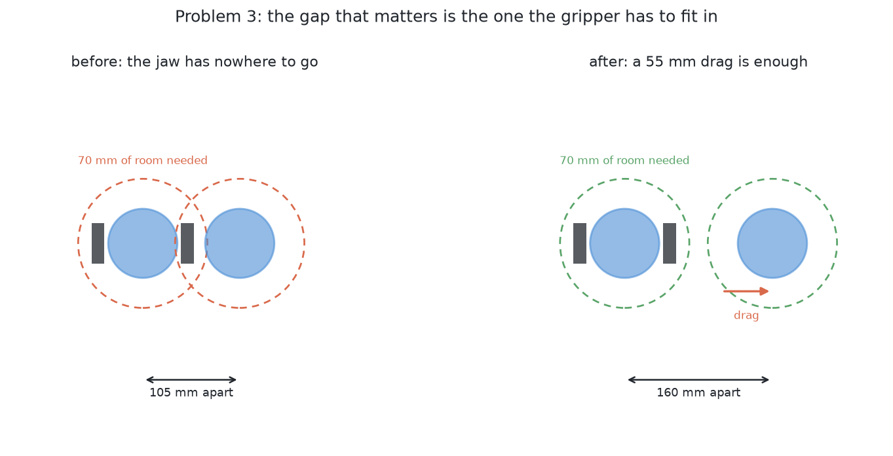
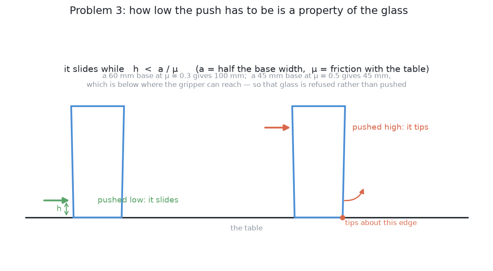

# Problem 3 — glasses too close together, moved apart by dragging

[Problem 2](../problem-2/problem.md) has ended. The arm knows which pixels are
which glass and where each one stands. Some of them are standing too close
together for the gripper to get round one without fouling its neighbour.

The arm has to **move them apart by dragging them across the table**. Not by
lifting them. Dragging is the whole point of the problem.

## Why dragging and not lifting

Because lifting is the thing that is not available yet, and the reason is
circular:

- To lift a glass, the fingers have to close on it in a chosen place.
- To choose that place, the arm needs the glass's profile.
- To measure the profile, it needs a side-on photograph from 380 mm away.
- To take that photograph, it needs a viewpoint that is not blocked — which is
  exactly what the crowding has taken away.

Dragging breaks the circle because it needs almost nothing. A push needs a
contact and a direction. It does not need to know the glass's height, its shape,
its weight, or where its stem is. All it needs is where the glass stands and
how wide its base is, and problem 2 already produced both.

## What is on the table

The same glasses as problem 2 — four to six, one known kind, upright and opaque
— except that some of them are close together. Close enough that the numbers in
the next section bite.

## The gap that matters is not the gap between the glasses

Two glasses 105 mm apart are not touching. A person would call them separate.
The gripper cannot pick up either of them, and the reason is that the gripper is
not a point.

To close on a glass, the open jaw has to be **around** it: a finger either side,
each finger a little thicker than nothing, with the jaw opened wider than the
glass before it closes. Add that up from the glass's middle outwards and it
comes to about **70 mm of clear room in every direction**. Two glasses need
140 mm between their middles before either can be gripped, and more if the
approach has to come in from the side they face each other on.

So there are three different distances in play and they are easy to confuse:

| | What it is | Roughly |
| --- | --- | --- |
| glasses touching | the failure problem 2 could not even see | 75 mm between middles |
| glasses grippable | the jaw fits round one of them | 140 mm between middles |
| glasses measurable | a clear line of sight from 380 mm back | depends on the angle |

Problem 3's job is to get every glass over the second line. The third is
problem 2's, and moving a glass changes it too.

## How low the push has to be, and why it is a property of the glass

A pushed object either slides or tips over, and which one happens is decided by
where it is pushed. Push near the base and it slides. Push near the rim and it
tips.

The dividing line is not a matter of taste. Pushing at height `h` on an object
whose base is `2a` across, standing on a table it rubs against with friction
`μ`, the object slides while

    h  <  a / μ

and tips above it. A 60 mm base at μ = 0.3 gives 100 mm of room to push in. A
45 mm base at μ = 0.5 gives 45 mm. That is below the lowest the gripper can
reach without fouling the table. So that glass cannot be pushed safely at all,
and the only correct answer for it is to refuse.

Three things follow, and they are the shape of the problem:

**The push height has to be worked out per glass**, from its measured base
width, not chosen once. This is the same pattern as everywhere else in the
project: compute what the measurement allows rather than assuming a tolerance.

**Some glasses cannot be pushed.** A tall glass on a narrow foot tips before it
slides. That has to be a refusal, not an attempt.

**μ is not known.** It is a property of the glass, the table and whatever is on
both, and nothing in the cell measures it. So the arithmetic above gives a
limit that is only as good as a guessed number. That is an argument for always
pushing as low as the gripper can reach, and for watching what actually happens
rather than trusting the prediction.

## What else makes this hard

**Where to push it *to*.** The destination has to be clear of every other
glass, clear of the rack, inside the arm's reach, and inside the part of the
table the glasses are allowed to be on. Moving one glass out of a crowd can
easily push it into a different crowd.

**A push does not go where you aimed it.** Friction under a glass is not
uniform, the contact is not a point, and the glass rotates as well as slides.
Planar pushing is a well-studied problem and the honest summary is that
predicting the outcome precisely needs numbers nobody here has. So the arm has
to look again after each push rather than assume.

**Which glass to move.** Moving the wrong one of a pair can make the situation
worse — into a third glass, or out of reach. The choice needs the whole
arrangement, not just the crowded pair.

**Pushing is contact, and contact is where things break.** The arm is touching
a glass with no idea how heavy it is. Too fast is a knock, and a knock on a
tall glass is the thing this problem exists to avoid.

## What is deliberately not in this problem

**Lifting anything.** No grasp, no weighing, no rack.

**Measuring a profile.** Problem 3 works from a footprint and a position.

**Deciding the kind.** Still one known kind.

**Tidying.** The glasses do not have to end up anywhere in particular. They have
to end up far enough apart.

## What "done" means

A run is **done** when every glass on the table has at least 70 mm of clear
room around it, at least one usable viewpoint for a side-on photograph, and
nothing has been knocked over.

A run is **correct but incomplete** when a glass could not be moved safely and
is reported with the reason — most often that it tips before it slides, or that
there is nowhere clear to push it to.

A run is **wrong** if a glass is toppled, pushed out of reach, pushed off the
table, or pushed into the rack. Toppling is the failure to watch, because a
toppled glass cannot be recovered by anything else in this project.

Scored against the simulator's record, the numbers worth watching are: how many
glasses ended up grippable, how many pushes it took, how far each glass ended
up from where the push aimed it, and how many were refused.

## How it would be solved

→ [Solution overview](solutions/solution-overview.md)
