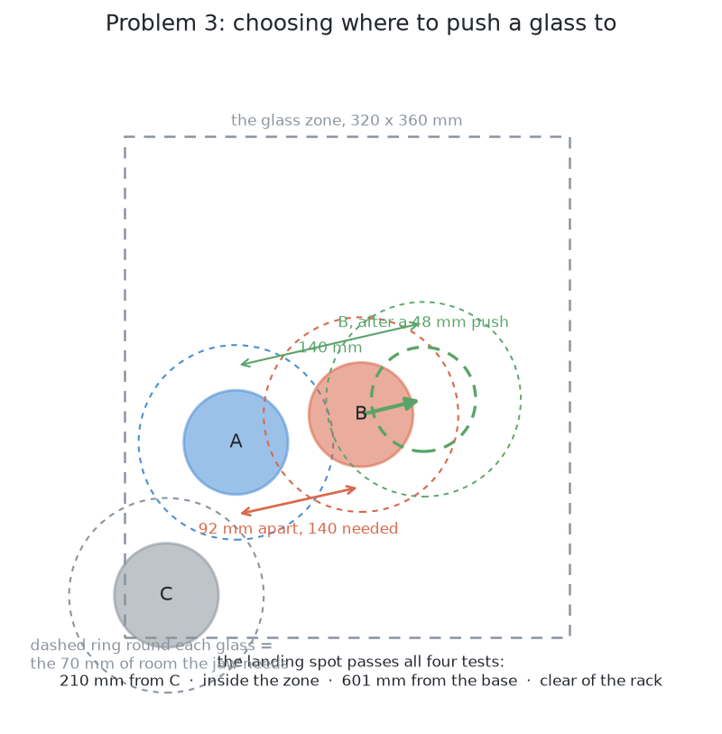

# Problem 3 — how it would be solved

[`problem.md`](problem.md) says what is being asked for. This document says how
it would be answered. It is long, because the point of it is to compare five
ways of doing the job properly rather than to announce one.

## Where we are

Problem 2 has finished. The arm knows which pixels are which glass and where
each one stands on the table. Some of those glasses are standing too close
together for the gripper to get round one without fouling its neighbour.

They have to be moved apart. Not by picking them up — **by dragging them across
the table.**

## Why dragging, and not lifting

This is worth restating, because the whole document rests on it.

To lift a glass, the fingers have to close on it in a chosen place. To choose
that place, the arm needs the glass's profile. To measure the profile, it needs
a side-on photograph from 380 mm away. To take that photograph, it needs a
viewpoint that is not blocked — which is exactly what the crowding has taken
away.

So lifting depends on measuring, measuring depends on seeing, and seeing is what
is broken. A push breaks the circle because it needs almost nothing: a position
and a base width, both of which problem 2 already produced. It does not need the
glass's height, its shape, its weight, or where its stem is.

## The words, first

Six terms, used throughout.

A **push** here means moving a glass across the table with the closed gripper,
in contact the whole way. **Dragging** and **pushing** are used
interchangeably.

**Singulation** is the name the robotics literature gives to this job:
separating objects that are touching or crowded so that they can be picked up
one at a time. It is worth knowing the word, because it is what to search for.

**Quasi-static** describes a push slow enough that momentum does not matter.
Let go of a glass mid-push and it stops rather than sliding on. Everything in
this document assumes it, and at the speed an arm pushes it is true.

The **friction cone** is the set of directions in which a finger can push a
surface without sliding across it. Push within the cone and the finger grips
and the object moves. Push outside it and the finger skids across the glass.

The **centre of the footprint** is where the glass's circular base sits on the
table. A push whose line passes through it slides the glass roughly straight. A
push that misses it spins the glass as well as moving it.

**Toppling** is the failure that cannot be undone. A pushed object slides while
the contact height is below `a / μ` — half the base width over the friction with
the table — and tips above it. Everything here has to stay below that line.

## The five solutions, at a glance

| | Solution | What it does about the crowding | Programmed or learned | Verdict |
| --- | --- | --- | --- | --- |
| 1 | [Do not drag at all](#solution-1--do-not-drag-at-all) | racks the easy glasses first, so the crowd thins | programmed | **chosen, as the first thing tried** |
| 2 | [One fixed nudge](#solution-2--one-fixed-nudge) | pushes one glass a computed distance away from the other | programmed | the right baseline |
| 3 | [Plan, feel, look again](#solution-3--plan-the-destination-feel-for-the-glass-look-again) | plans a clear landing spot, then measures what happened | programmed | **chosen** |
| 4 | [Predict the slide](#solution-4--predict-the-slide-with-pushing-mechanics) | works out in advance where the glass will end up | programmed | correct theory, missing inputs |
| 5 | [Learn to push](#solution-5--learn-to-push) | learns which push separates, by trying | learned | for a jumble, not for five discs |

They are in order of how much machinery they need. Each is written the same
way: what it is, why anyone does it like that, how it would work in this cell, a
worked example with real numbers, what it needs, what it is good and bad at, how
it fails, and when it would be the right choice.

---

## Solution 1 — do not drag at all

*Question the premise first. Every glass racked is a glass removed from the
table, so the crowding thins by itself. Take the ones that are already
reachable, and only drag what is left.*

### What it is

Every other answer here accepts the premise of problem 3: the glasses are too
close, so the arm shoves them apart. This one questions it, on one observation.

**A glass that has been picked up and racked is gone from the table.** The rack
is on the far side of the arm, and a glass standing in it is nobody's neighbour
any more. So the table never gets more crowded than it started. Every pick makes
it less crowded.

Some of the crowding therefore clears itself, and the method is to wait for it.
Find a glass that *already* has the room the gripper needs and a viewpoint the
camera can use. Pick it, rack it, look again. Repeat until the table is empty or
no glass qualifies. Only then is there anything to drag. Call it **peeling from
the outside**: take the ones at the edge, and the crowd shrinks inwards.

### Why anyone does it this way

When several things have to come out of a shared space, the *order* can decide
whether the job is possible at all. Getting a car off a full drive is the same
problem.

In manipulation the idea goes under names like **accessibility ordering** or
**reachability ordering**: take whatever is reachable now, and let the reachable
set grow as things leave. I am not sure either is *the* standard name, so treat
both as descriptions. The family is better established — rearrangement problems,
where feasibility depends on the sequence alone.

### How it would work here

The test runs on what problem 2 already produced: a position and a rough
footprint width per glass. The jaw needs about **70 mm of clear room measured out
from the glass's middle** in the direction it comes in — clear of *material*, not
of a middle. So a neighbour `n` is in the way of a target `t` when

    distance(t, n)  <  70 mm + (footprint of n) / 2

Footprints run 45 to 105 mm, so the threshold runs from 92.5 mm for the
narrowest neighbour to 122.5 mm for the widest. Two average glasses give the
**140 mm between middles** in [`problem.md`](problem.md), the symmetric case of
70 mm each.

**The formula is not symmetric.** A narrow glass beside a wide one is crowded
long before the wide one is. That asymmetry is the engine of the method, and it
is invisible if you only use 140 mm. Sightlines are not symmetric either: a glass
blocks the view of what is behind it, not in front.

So a glass qualifies when no remaining neighbour is in the way, a rack slot is
free, and one viewpoint 380 mm back is clear. Pick it, rack it, drop it from the
list, recompute.

### A worked example

Five glasses, millimetres from the arm's base, inside the 320 x 360 mm zone and
the 300 to 780 mm reach, footprints from the 45–105 mm range.

| Glass | Position | Footprint |
| --- | --- | --- |
| A | (330, −110) | 70 mm |
| B | (630, −110) | 80 mm |
| C | (330, −410) | 60 mm |
| D | (630, −410) | 105 mm |
| E | (530, −410) | 45 mm |

Every pair except D–E is at least 200 mm apart, clearing even the 122.5 mm
threshold. A, B and C qualify at once. D and E are 100 mm apart: the crowded pair.

**Racking A, B and C does nothing for D and E.** That is forced, not bad luck.
They were never in D or E's way — had they been, they would have been in each
other's way in turn, and would not have qualified. Their removal changes only the
line of sight. Now the pair on its own terms.

- D needs 70 + 45/2 = **92.5 mm** from E. It has 100. **D qualifies.**
- E needs 70 + 105/2 = **122.5 mm** from D. It has 100. **E does not.**

So D is racked. E is then alone, crowded by nothing, and goes too. No drag at
all.

Change one number and it ends differently. Make both glasses 75 mm across. Each
now needs 107.5 mm, both have 100, and **neither qualifies** — with A, B and C
already racked and nothing left whose removal would help.

### What it needs

Nothing the cell lacks: the survey and footprints from problem 2, the rack slot
bookkeeping that already exists, and a loop.

### What it is good at

It is free. No push means no toppling, no guessed friction, no glass shoved into
a third glass or out of reach, and no glass that tips before it slides. Every
failure mode of problem 3 is skipped for every glass that qualifies, and a glass
is only touched after its room has been checked.

### What it is bad at

**More surveys.** One survey at the start becomes one per pick, up to five. Each
is arm motion and camera frames, and the arm has to stand somewhere that does not
block its own camera. That cost is paid on every run, including the ones where no
drag was ever needed.

### How it fails

One condition, exactly: **a crowded pair with nothing else left to do.** Two
glasses inside each other's threshold, everything else racked, no third glass
whose removal could help. The recompute returns the same answer forever. A loop
that does not notice this spins; one that does reports a stall. The second case
above is that failure, and two equal glasses 100 mm apart is ordinary, not
contrived.

### When it would be the right choice

Always, and never alone. This is not an alternative to dragging. It is a
**prefix** to it. Peel first, take every glass already free, hand the residue to
the pushing logic. The residue is smaller, sometimes empty, and the pushes left
have more free table to aim into. Dragging is strictly easier after a peel than
before one, so there is no case for doing it first. The change is to sequencing
in `task.py`: survey, pick what qualifies, then decide what still needs moving.

---

**A variant: change the tool, or change the approach.** The 70 mm is not a fact
about glasses. It is a fact about *this* gripper — two fingers, coming in level,
unable to drop straight down. Change the gripper and the number changes, and so
does the list of glasses that are crowded at all.

A **tool changer** is a coupling at the wrist that lets one arm carry several end
effectors, so a paddle or hook could be fetched for pushes and swapped away for
picks. It costs payload, reach and stiffness at the wrist, and lighter ones are
rated for about five thousand changes — not many at one swap per glass. The other
form is a gripper that comes in **from directly above**: suction, or fingers with
vertical clearance. From above a glass needs room for its own footprint and
little more, and the 100 mm pair would not be a problem.

Either way this is a change to the cell, not to the code. It answers problem 3 by
arranging for problem 3 not to arise.

---

## Solution 2 — one fixed nudge

*For a pair that is too close, push one of them a computed distance directly
away from the other. The simplest thing that could work.*

*The simplest thing that could work. For a pair that is too close, push one of
them a computed distance straight along the line joining their middles, directly
away from the other. Then look again.*

### What it is

Take a pair of glasses that are too close. Draw the line joining their two
middles. Pick one of the two and push it along that line, away from the other,
by a distance worked out from the 140 mm figure. Then stop and look.

That is the whole method: no destination search, no map of the free table, no
score. A *middle* is the centre of the circle a glass stands on, and problem 2
gives a middle and a footprint width for every glass, so the nudge needs nothing
new from perception.

### Why anyone does it this way

The hard part of problem 3 is not choosing where a glass should go. It is
touching one at all without knocking it over: getting low enough that it slides
rather than tips, finding its wall when the camera's idea of it carries error,
and moving slowly enough that contact is a press and not a knock. A fixed nudge
exercises all of that in Gazebo Harmonic, and is simple enough that when a glass
falls over you know it was the contact and not the plan. It also gives the
cleverer methods a number to beat.

### How it would work here

**Which of the pair to move.** A pushed glass slides while the contact height
`h` stays below `a / μ`, where `a` is half its base width and `μ` its friction
with the table. The gripper body is a 90 mm box and cannot go below about 50 mm
above the table, so `h` is 50 mm and fixed. The wider base has the larger `a`,
so the most room under that limit. Push that one.

**How far.** Two glasses need 140 mm between their middles before the jaw fits
round either, so if the measured distance is `d`, the shortfall is `140 − d`.
That alone lands the pair exactly on the line, and a push never lands where it
was aimed, so add 20 mm:

    nudge = 140 − d + 20

**What the gripper does.** Close the fingers: a closed jaw is one stiff object
of known shape, where an open jaw is two thin fingers that catch on a rim. Drop
to 50 mm above the table, behind the glass on the push line. Creep forward in
2 mm steps until something fires — the pad contact sensors, or a sideways
reading at the wrist, which feels 9.5 N of gripper weight and nothing horizontal
until the pad meets glass. Push from there, slowly, in a straight line, with
`compute_cartesian_path` in MoveIt 2. Retreat backwards along that line before
lifting; lifting with the pad still against the wall drags it up the glass.

**Why feel forward rather than drive to a number.** The wall sits at the middle
minus half the footprint width, and both were measured, so the errors add. Drive
to that point and you either stop short and push air, or arrive past it at
speed, which is the knock. Creeping until a sensor fires is a guarded move, and
where it fired beats what the camera gave.

### A worked example

Three glasses, millimetres from the arm's base, all inside the 300 to 780 mm
reach.

| Glass | Position | Footprint |
| --- | --- | --- |
| P | (380, −380) | 90 mm |
| Q | (460, −320) | 90 mm |
| R | (560, −220) | 90 mm |

P to Q: dx = 80, dy = 60, so d = √(80² + 60²) = 100 mm. Under 140: crowded. The
unit vector from P towards Q is (0.8, 0.6), and the nudge is
140 − 100 + 20 = 60 mm.

Can Q be pushed? `a / μ` = 45 / 0.5 = 90 mm even on a pessimistic μ of 0.5, well
above the 50 mm the gripper is stuck at, so Q slides rather than tips. A 45 mm
footprint would give 45 mm and be refused.

Push Q 60 mm along (0.8, 0.6) — +48 in x, +36 in y — to (508, −284). New P–Q
distance: √(128² + 96²) = √25600 = 160 mm. Over 140. Fixed.

Now R. Before the push, Q was √(100² + 100²) = 141.4 mm from R, just over the
line; after it, √(52² + 64²) = 82.5 mm. The nudge fixed one pair and broke
another, worse. Push P instead, 60 mm along (−0.8, −0.6), to (332, −416):
160 mm from Q, 301 mm from R.

### What it needs

Middles and footprint widths from problem 2. A guessed μ. The 140 mm figure.
MoveIt 2 for the straight line, ros2_control for the pad sensors and the wrist
force broadcaster, and fresh overhead pictures after each push.

### What it is good at

A few dozen lines, running the whole contact sequence, so it finds the contact
faults early and cheaply. On two or three glasses that are merely close rather
than piled it is often simply correct. And the shortest push that works is the
safest, because every millimetre of travel is another millimetre in which
something can topple.

### What it is bad at

It sees two glasses and ignores the rest of the table — the zone's edges, the
rack, the arm's reach — so it will happily aim a glass off the table. It uses
the blunt symmetric 140 mm rather than the asymmetric threshold, so it over-
pushes narrow glasses and under-pushes wide ones. And its distance is the
minimum plus a margin, leaving the pair right on the line.

### How it fails

The headline failure is the one in the worked example: the nudge pushes one
glass into a third. Four guards, all arithmetic on numbers already in hand:

1. the destination at least 140 mm from every other middle;
2. the corridor the glass sweeps, and the wider one the 90 mm gripper body
   sweeps behind it, clear of every other glass;
3. the destination inside the zone, and 300 to 780 mm from the base;
4. if neither direction passes, refuse the pair and say why.

The first three ask whether one spot is clear, legal and reachable — most of
what solution 3 does, minus the search. The fully guarded baseline has grown
into the method that replaces it, which is an argument for that method, not
against the baseline.

Pushes are also not independent. Fixing P–Q can break Q–R, and fixing Q–R can
break P–Q again. Nothing notices the cycle, so it needs a cap: eight pushes,
after which the run refuses.

**How many pushes for five.** Three or four of a tight crowd of five have to
move, so three or four pushes is the floor. There is no ceiling from geometry,
because each nudge can create a pair it never considered. Five is near the limit
of the table anyway: the roomiest arrangement that fits is four in a 180 by
220 mm rectangle with one in the middle, √(90² + 110²) = 142 mm from each
corner. That is 2 mm of slack across the zone, and nudging by the minimum will
not find it.

### When it would be the right choice

It is genuinely sufficient when the crowd is small and the table is not. Two or
three glasses, one crowded pair, clear table all round: the nudge solves that on
the first push, and a planner would choose almost the same one. It is also the
right thing to build first — the cheapest way to get a real push happening
against a simulated glass, and afterwards the thing the cleverer methods are
scored against.

It stops being sufficient once the table is crowded rather than merely occupied:
four or five glasses, or a glass near the rack or the edge of the reach. There,
where a glass should go is no longer obvious from its nearest neighbour, and
something has to look at the whole table.

---

## Solution 3 — plan the destination, feel for the glass, look again

*Choose a landing spot by checking it against the whole table. Feel for the
glass on the way in rather than driving to it. Push once, then look again and
compare.*

### What it is

Three ideas joined together, and none of them is clever on its own.

**Plan where the glass should end up**, by treating the table as a map with
obstacles on it and looking for a clear spot. **Feel for the glass** on the way
in, rather than driving to where the camera said it was. **Push once, then look
again**, and compare what happened with what was intended.

The third is the one that carries the weight. This method does not try to
predict where a pushed glass will end up. It makes a short push, takes a fresh
picture, and measures. If the glass went where it was supposed to, carry on. If
it did not, push again from wherever it actually is.

### Why anyone does it this way

Because the alternative needs a number nobody has.

Predicting where a pushed object ends up is a solved problem in the sense that
the mathematics is written down and correct. It is an unsolved problem in the
sense that the mathematics needs the friction coefficient between the glass and
the table, and the way the glass's weight is spread across its base. Neither is
measured anywhere in this cell. A prediction built on two guesses is a confident
number with nothing behind it.

This project has met that shape of problem before and always answers it the same
way. The rim of a glass is not driven to a calculated height; the arm comes down
until it feels the rack. The squeeze is not computed and applied; it is
estimated, then the glass is lifted ten millimetres and weighed, and the
estimate is corrected. The gripping documents call this pattern
[the squeeze sequence](https://github.com/RobinNagpal/robotics-basics/blob/main/docs/07_gripping/05_holding-on.md#1-the-squeeze-sequence):
a cheap guess, checked by a measurement, with the measurement deciding.

A push is the same shape. Guess, push, measure, correct.

### How it would work here

**Choosing the destination.** The table is a rectangle. The glasses are discs
on it with known middles and widths, which problem 2 produced. The rack is a
box. The arm's reach is a ring between 300 and 780 mm from its base. That is a
small enough world to check exactly.

A destination has to pass four tests, and each is a comparison of numbers the
arm already holds:

1. at least 70 mm of clear room from every other glass's edge;
2. inside the zone the glasses may stand in;
3. inside the comfortable reach;
4. clear of the rack.

Check all four *before* scoring anything, not after. Generating pushes, ranking
them by how much they separate, and then discovering the planner will not
execute them is how a cell becomes slow and unreliable with nothing erroring.
The gripping documents name this reordering as the commonest structural mistake
in a grasp pipeline, in
[bounding the search by the gripper's own body](https://github.com/RobinNagpal/robotics-basics/blob/main/docs/07_gripping/03_choosing-a-grip.md#7-bounding-the-search-by-the-grippers-own-body),
and the fix is the same here: put the constraint in the search.

Score what survives by how far the glass has to travel. The shortest safe push
wins, because every millimetre of push is a millimetre of chance to knock
something.

**Choosing the push height.** From the glass's measured base width and the
tipping condition in [the problem](problem.md): it slides while the contact is
below `a / μ`. Work that out per glass. If the limit is below the lowest the
gripper can reach — about 50 mm above the table — refuse the glass and say so.
Do not push it gently instead. A push that tips a glass tips it whatever the
speed.

**Making the push.** Close the fingers first, so the jaw is one stiff object
rather than two thin ones that can catch on a rim. Move to the push height
behind the glass, on the line through its middle. Then feel forward slowly until
the pad contact sensors or the wrist force say the glass is there. That is
[the guarded move](https://github.com/RobinNagpal/robotics-basics/blob/main/docs/06_object-perception/02_sensors.md#21-what-you-can-actually-do-with-it),
and it is worth using for a second reason beyond safety: the place where contact
happens is a measurement of where the glass's surface actually is, which is a
better number than the camera's. It is the same trick as the width at first
contact in problem 1's step 5.

Push in a straight line to the destination. Retreat along the same line.

**Looking again.** Fresh overhead pictures, problem 2's separation run over
them, and a comparison:

- the glass moved about as far as intended — go on to the next crowded pair;
- it moved much less — friction is higher than assumed, or it is heavier; push
  again from the newly measured position;
- it is somewhere no glass should be, or there is one group of points where
  there were two — something has toppled or been knocked. Stop and report.

### A worked example

Two glasses, 75 mm across. Glass A at (0.40, −0.30), glass B at (0.49, −0.28).
Their middles are 92 mm apart. Each needs 70 mm of clear room from its middle,
so they need 140 mm. They are 48 mm short.

*Which one moves.* Both are the same kind and the same width, so the tie-break
is the shorter push. B is nearer the empty part of the zone, so B moves.

*How low.* B's base is 62 mm across, so `a` is 31 mm. Taking μ = 0.3 gives a
limit of 103 mm. The gripper can reach 50 mm. 50 is below 103, so the push is
safe with room to spare. At μ = 0.5 the limit would be 62 mm, still above 50.
It would take μ above about 0.62 for this glass to be unpushable, which is
higher than glass on wood is likely to be — but it is a guess, and the document
says so.

*Where to.* The line from A through B, extended. B needs to reach 140 mm from
A, so it must travel 48 mm along that line. Check the landing spot: (0.535,
−0.269). Nearest other glass, 210 mm. Inside the glass zone, which runs to
x = 0.64. Distance from the arm's base, 601 mm, inside the 300–780 mm ring.
Clear of the rack, which is at y = +0.35. All four pass.

*The push.* Close the fingers. Go to 50 mm above the table, on the line from A
through B, 60 mm short of B's edge. Feel forward at 10 mm/s. Contact at 57 mm
of travel — 3 mm further than the camera predicted, which is the measurement
the guarded move buys. Push 48 mm. Retreat.

*Look again.* B is now at (0.531, −0.271). It went 46 mm of the 48 asked for,
and 4 mm off the line. A and B are 138 mm apart, which is 2 mm short of the
140 needed. Push again, 10 mm this time, or accept it if the margin is within
the measurement error. Either is defensible and the report should say which was
chosen.

### What it needs

Nothing new in hardware. The pad contact sensors and the wrist force sensor are
already in the cell and already used by problem 1's set-down. MoveIt's
`compute_cartesian_path` already makes the straight lines. Problem 2's
separation is the "look again".

New code: the destination search, the tipping check, a sideways version of the
existing `descend_until_contact`, and the comparison after the push.

### What it is good at

**It needs no number nobody has.** μ appears once, in a safety check that is
deliberately conservative, and nowhere in the path.

**It degrades gently.** A push that falls short is a push that gets repeated.
Nothing depends on the first one being right.

**It refuses honestly.** A glass that tips before it slides, or has nowhere to
go, produces a sentence rather than an attempt.

**Every number in it can be printed.** The destination search is four
comparisons. The report can say which one a rejected spot failed.

### What it is bad at

**It is slow.** Every push costs a full survey afterwards. Five glasses with two
crowded pairs could be six or eight pushes and as many surveys.

**It does not plan ahead.** The destination is chosen against the arrangement as
it stands. Moving a second glass can undo the first, and the loop only notices
afterwards.

**It can run out of table.** Five glasses each needing 140 mm of separation in a
zone 320 by 360 mm is near what fits. With six it may not be solvable at all,
and the honest output is to name the glasses it could not separate.

**It assumes the glass slides rather than rolls or rocks.** A glass with a
slightly convex base can rock, and the guarded move will feel that as contact
without the glass having moved.

### How it fails

**A glass pushed into a place that is clear now and crowded later.** Replanning
after each push keeps this from compounding, at the cost of more pushes.

**A push that rotates the glass instead of sliding it,** because the contact was
not through the middle. The look afterwards catches it. The damage is a wasted
push.

**Contact felt on the wrong thing.** The jaw could touch a neighbouring glass
before the target. The wrist force cannot tell the difference. The picture
afterwards can.

**μ higher than assumed on one particular glass,** so the push that was checked
as safe tips it. This is the failure that cannot be recovered, and it is the
reason to push as low as the gripper reaches, always, rather than at the
computed limit.

### When it would be the right choice

When the objects are few, their positions are already measured, and knocking
one over is expensive. That is this cell exactly. It is the wrong choice for a
cluttered bin, where there are too many objects to plan against individually and
the value of any one of them is low enough to justify learning by trying.

---

## Solution 4 — predict the slide with pushing mechanics

*Use the classical theory of planar pushing to work out in advance where the
glass will end up, and plan a single push that puts it there.*

### What it is

Classical mechanics answers exactly the question this problem asks: push a
flat-bottomed object across a table, and where does it end up? The subject is
**quasi-static planar pushing**, and it is a set of theorems rather than a
heuristic. Three terms first.

**Quasi-static** means slow enough that momentum does not matter. Push a glass
and stop; it stops when you stop. It does not coast. So at every instant the
forces balance: push force equals friction from the table, push torque equals
friction torque. That turns a differential equation into algebra, and for a
250 g glass at the few centimetres a second this arm moves it holds easily.

**The friction cone at the contact** comes from
[friction cones and the antipodal test](https://github.com/RobinNagpal/robotics-basics/blob/main/docs/07_gripping/03_choosing-a-grip.md#3-friction-cones-and-the-antipodal-test).
The glass pushes back along the surface normal, friction adds at most `μ` times
that sideways, so the force the contact can transmit lies in a cone of
half-angle `arctan(μ)` about the normal. Here `μ` is silicone against glass —
the pair the grip already uses 0.6 for, giving 31 degrees either side.

**The limit surface** is the part nobody meets elsewhere. The table's friction
is limited, and that limit is not one number, because the glass can slide, spin,
or both at once. Take a space whose three axes are the two components of
horizontal force and the twisting moment about the glass's centre. Every load
the table can just sustain is a point on a closed surface around the origin:
the limit surface. Its decisive property is that **the glass's motion is
perpendicular to that surface where the load sits on it** — so it says not only
whether the glass moves but which way. Goyal, Ruina and Papadopoulos established
this in the early 1990s; in practice people use Howe and Cutkosky's ellipsoidal
approximation, which reduces it to a line of algebra.

### Why anyone does it this way

Because a push needs no grasp, and the naive alternative is plainly wrong: push
a glass off-centre and it turns rather than following the finger. Two results
earn their keep.

**Mason's voting theorem** (Matthew Mason, 1986) says which way a pushed object
rotates, by a vote between three lines: the line through the contact along the
**push direction**, and the **two edges of the friction cone** there. Each
passes to the left or the right of the object's centre of friction and votes
accordingly. **The majority wins.**

It is useful because of what it does not need: no mass, no pressure
distribution, no coefficient for the table. It gives a sign, not a magnitude —
but when all three lines pass the same side the direction is certain however
badly the other numbers are guessed, and a planner can choose pushes where that
holds.

**The motion cone** is the second. For a given contact there is a cone of push
directions for which the finger **sticks** and the object moves rigidly with it;
push outside it and the finger slides across the glass instead. Lynch and Mason
built stable pushing on this: keep the contact sticking and the object is, for
the duration, part of the arm.

### How it would work here

The glasses are round, and that is a large gift: closed-form limit surfaces
exist for very few pressure distributions, and a **uniform disc** is the best
known. For a disc of radius `R` carrying weight `mg` uniformly, the largest
friction moment is `M_max = (2/3) μ m g R` and the largest force is `μ m g`.
Their ratio is a length,

    c = M_max / (μ m g) = (2/3) * R

the characteristic length of the pressure distribution. It is the only thing
about the base the model needs, and `μ` cancels out of it.

The usable rule: if the push line misses the centre by a perpendicular distance
`d`, then under the ellipsoidal approximation with the contact sticking the
glass turns about a point `r = c² / d` from its centre, on the far side of the
push line. Large `r` is nearly straight sliding; small `r` is a spin. So you aim
through the footprint centre, which problem 2 already measures, making `d` zero
and the slide straight — and the theory tells you how much aiming error you can
afford.

### A worked example

A middling glass here: footprint 70 mm across, so `R` = 35 mm, mass 250 g,
pushed 60 mm to take a crowded pair from 105 mm apart past the 140 mm line.

Uniform disc: `c` = (2/3) × 35 = **23.3 mm**. Say the push line misses the
centre by 5 mm, about what problem 2's circle fit plus placement error gives.
Then `r` = 23.3² / 5 = 109 mm. Over 60 mm the glass turns 60/109 = 0.55 rad,
about **31 degrees**, and its centre drifts off the intended line by roughly
60²/(2 × 109) = **17 mm**. The 31 degrees does not matter — the glass is round.
The 17 mm does.

Now change one assumption. A drinking glass's base is usually slightly concave,
so the weight rests on its **rim**. For an annulus `c = R` = 35 mm, giving
`r` = 245 mm, 14 degrees of turn, and **7 mm** of drift.

Same glass, same push, same `μ`. Two plausible guesses about how the weight sits
on the base. Answers a factor of two apart.

### What it needs

- **The contact friction cone**, silicone on glass. This input exists.
- **`μ` between glass and table.** Not measured anywhere in this cell. Needed
  for the force the push must supply and for the tipping bound `h < a / μ`.
- **The pressure distribution over the base.** The real one. Uniform disc,
  supporting rim, three high spots where the glass rocks — all plausible, none
  visible from an overhead camera.
- **Straight-line execution**, which `compute_cartesian_path` gives, and contact
  that matches the model, which Gazebo Harmonic supplies with friction numbers
  that are plausible rather than measured.

### What it is good at

Signs, cheaply and robustly. The voting theorem survives bad inputs by
construction, and it identifies pushes that are *safe by geometry*: a push
through the centre of a round footprint is straight under every pressure
distribution, because `d` is zero and `c` drops out. That conclusion needs none
of the missing numbers. It is also fast — arithmetic, no search, no simulation —
and it explains its answers, which a learned forward model cannot.

### What it is bad at

Magnitudes. Every number it produces is sound mathematics fed guesses. It also
assumes a rigid object, a flat table and a point or line contact. A wet ring
under a glass is outside the model entirely, and a drying rack is where wet
glasses are guaranteed.

### How it fails

Quietly, and with a number attached. A planner built on this returns "the glass
finishes 62 mm along the push line and 7 mm to the left", and the 7 mm is a
guessed pressure distribution wearing a decimal point. The run places the glass
on that basis, does not look, and finds out later.

The specific failure here: a rim-supported base predicted with the uniform
model, drifting about 10 mm further sideways than planned on every push. Ten
millimetres is well inside the 70 mm clearance, so it is invisible once and
compounds over three.

Table `μ` enters the tipping bound directly too. Guess it low, `a / μ` comes out
generous, the planner authorises a push higher up the glass than it should, and
the result is the one failure this problem exists to prevent.

### When it would be the right choice

When the pressure distribution is known or controlled — a machined part on a
fixture, a puck with a ground flat base, a part on a conveyor — or when the
outcome is needed *before* acting, because the workspace is occluded or the push
cannot be undone. There the inputs are real and the theory earns what it claims.

This cell is the opposite. A fresh overhead pair after each push costs about a
second, and a measurement beats a prediction whose inputs are guessed. The
honest position is to keep the qualitative half and drop the numerical half:
push through the footprint centre, keep the contact inside the friction cone,
then look. That is what [decision 2](solution-overview.md) already does. What it
should not do is dress the guess up as a prediction.

Literature, naming only what is certain: Mason's 1986 work on the mechanics of
pushing, which contains the voting theorem; Goyal, Ruina and Papadopoulos on the
limit surface; Howe and Cutkosky's ellipsoidal approximation; and Lynch and
Mason on stable pushing. MIT also published a large empirical dataset of real
objects being pushed on real surfaces, whose headline finding is that outcomes
scatter more than the deterministic theory predicts — this section's objection
measured rather than argued. For tools, Drake models quasi-static planar pushing
directly, and Gazebo, Bullet and MuJoCo will simulate the contact with whatever
coefficients you supply.

---

## Solution 5 — learn to push

*Let the arm discover which pushes separate glasses, by trying them in
simulation and being rewarded when it works.*

### What it is

Three methods get called "learning to push".

**Reinforcement learning** is trial and reward. The arm is shown the table,
picks a push, and a single number — the **reward** — says how good it was. What
is trained is a **policy**: a function, usually a small neural network, from
what is seen to what to do. One attempt, fresh table to finish, is an
**episode**. Training runs episodes over and over, nudging the weights towards
whatever scored higher. There is no teacher; the only signal is the score.

**Imitation learning**, or behaviour cloning, has a teacher. Something does the
job many times — a person with a joystick, or another program — and each instant
is recorded as a pair: what was seen, what was done. Training is then ordinary
supervised learning. No reward, no exploration, and the ceiling is the teacher.

**Learning a forward model** learns what *happens* rather than what to do. Give
it the arrangement and a proposed push; it predicts the arrangement afterwards.
Deciding comes after, by trying candidate pushes against the model and keeping
the best. It is a learned stand-in for physics you do not have.

### Why anyone does it this way

Pushing is contact, contact is friction, and friction is the number nobody
measures. The classical alternative needs the friction under the object and how
its weight is spread over its base, and the second of those is statically
indeterminate — no unique answer exists even in principle. Learning samples
outcomes instead of deriving them.

The research line aimed at this exact task is called **singulation**: pushing
objects apart until one stands alone enough to be gripped. It goes back well
over a decade, first as hand-written push heuristics, later as learned push
proposals, and it is nearly always motivated by a pile where the segmenter
cannot say how many objects there are.

The best known work joining pushing and grasping is Zeng and colleagues'
*Learning Synergies between Pushing and Grasping with Self-supervised Deep
Reinforcement Learning* (2018), shortened to **VPG**. Both behaviours are
learned from one overhead picture: each pixel gets a score for "push here" and
one for "grasp here", and only grasp success is rewarded. Useful pushes appeared
anyway — it learned to shove a tight cluster apart so a grasp became possible,
without being told pushing had a purpose. I am confident of that paper, not of
its trial counts, so I quote none, and I name no singulation papers because I am
not confident of particular titles.

### How it would work here

**Observation:** the overhead picture, or — since problem 2 has measured it —
ten numbers: five glass centres plus each base width.

**Action:** a straight push, with a start point, a direction, a length and a
height.

**Reward:** a point when a pair crosses 140 mm apart, a large fine for a topple,
a small fine per push.

The reward is the hard part, not the training. A reward is a **score**, and what
this problem has are **constraints**. "Never topple a glass" is not a quantity;
written as a fine it becomes a price, and a price is a trade the policy may
make. The project also counts a refusal as a success, and nothing rewards an arm
for declining. And a shaped reward gets gamed: pay for increases in the minimum
pairwise distance, and shoving one glass to the far corner scores best every
time.

Nor can a policy be *told* not to topple a glass. It is a function from
observation to action; there is no field in it for a rule, so the reward is the
only channel. A run-time check can veto an unsafe push — but that check is the
geometry this project already has, and it, not the policy, is doing the safety
work.

### A worked example

Set the topple fine at ten points and a separation at one. Ten separations now
buy one broken glass, so a policy that topples one glass in twenty runs still
scores well and gets selected for. Raise the fine to a thousand: doing nothing
scores zero, which beats any push carrying risk, and the policy learns to stand
still. Between them lies a number that behaves, found by training again, and it
still means "a topple is worth this many separations", never "do not".

### What it needs

Gazebo Harmonic runs headless and resets, so episodes are possible in principle.
The cost is throughput. One episode — reset, spawn five glasses, let them
settle, push slowly, look — will not come in under about twenty seconds, or 180
an hour. Contact-rich policies are trained on tens of thousands of attempts at
the very least, so 50,000 episodes is about **eleven days of continuous
running**, or three days across four parallel instances. That is one reward
function, and the reward needs several attempts.

The usual escape is a GPU-batched simulator running thousands of worlds at once.
**This machine is an Apple Silicon Mac with no NVIDIA GPU**, which rules that
out specifically: Isaac Sim and Isaac Lab are CUDA-only with no macOS build at
all, and MuJoCo's batched version, MJX, wants JAX on an NVIDIA GPU or a TPU.
Plain MuJoCo runs natively, so rebuilding the cell there is possible, but it
buys single-world speed, not thousands of worlds. PyTorch's MPS backend trains a
small policy network happily; the network was never the bottleneck.

Licences need the same look the grasp models get in
[the licence picture](https://github.com/RobinNagpal/robotics-basics/blob/main/docs/07_gripping/04_models-that-grasp.md#5-the-licence-picture):
research pushing code ships without a licence file just as often, which grants
nothing.

### What it is good at

It never needs μ. It learns what pushes tend to produce, whatever the friction
happens to be.

It handles clutter with no geometry in it. When objects are a jumble of unknown
shapes, overlapping, and the segmenter cannot say how many there are, "which
push opens something up" has no closed form. That is the case singulation exists
for, and it is real.

It finds behaviours nobody would write down — pinning an object against a wall,
or moving one object with another.

### What it is bad at

The sample cost and the reward design, above.

Explaining itself. The rules refuse with "this glass tips before it slides,
because its base is 45 mm and the gripper cannot get below that". A policy that
does not push has nothing to say, and this project needs its refusals legible.

And the decisive one. This table holds five discs, one known kind, on a flat
surface, with centres and base widths already measured. The state is ten
numbers, and choosing which glass to move and where is a circle-packing check
against a rectangle — exact, instant, readable. A policy would spend a month of
wall-clock time rediscovering, approximately, what that check gives exactly.
Singulation policies earn their keep on a jumble of unknown shapes. This is not
a jumble, and the shapes are known.

### How it fails

**The sim-to-real gap, worse for pushing than for most tasks.** Most sim-to-real
trouble is appearance or timing. Pushing turns on friction, which in a simulator
is a configured constant in a contact solver, not a measurement, so a policy
trained in Gazebo learns that solver. And μ does not merely shift the outcome.
The line between sliding and tipping is `h < a / μ`, so μ moves the boundary
between a safe push and a broken glass: a height safe at μ = 0.3 topples the
same glass at μ = 0.5. Training across a range of μ is the standard answer; it
multiplies the episode count and yields a timid policy.

**A silent topple.** The method learns from failures it has experienced. Every
topple in simulation is free; every topple on a real table is unrecoverable,
because nothing in this project can stand a glass back up.

**A sixth glass.** The policy is trained on arrangements it saw. Change the
count, the zone or the kind, and there is no guarantee and no error message.

### When it would be the right choice

It is the right answer to the harder version of this problem, and that version
is real. Put a tote of mixed unknown objects on the table — different shapes,
some lying down, some on top of each other, the segmenter unsure how many there
are — and arithmetic has nothing to compute against. Then pushing to singulate
is a genuine answer and VPG's result is the relevant one. It is also right where
failures are cheap and plentiful: wooden blocks on a robot that runs all night,
or a lab with NVIDIA hardware where the episode budget is hours, not weeks.

Keep it on the list for the day the table stops holding five glasses of one
known kind.

---

## The decision

**Solution 1 first, then solution 3. Solution 2 is what solution 3 falls back
to. Solutions 4 and 5 are turned down, for different reasons.**

### Do the free thing before the risky thing

Solution 1 is chosen first because it costs nothing and it removes work. Every
glass racked is a glass off the table, so a crowd of five with one bad pair may
solve itself after three ordinary picks. Touching a glass is the riskiest thing
in this problem — it is the only step that can topple one — so doing it *fewer*
times is worth more than doing it better.

It is not an alternative to dragging. It is a prefix. When no glass qualifies
and the table is not clear, the glasses that remain are crowded and nothing but
a push will help.

### Then plan, feel, and look

Solution 3 is chosen over solution 2 for one reason that matters and one that
does not.

The one that matters: **a fixed nudge can push a glass into a third glass.**
Solution 2's own section is honest about this. Checking the landing spot against
every other glass, the zone, the reach and the rack costs four comparisons of
numbers already in hand, and turns a plausible push into a checked one.

The one that does not: solution 3 is not more *accurate* than solution 2.
Neither of them predicts anything. Both push and then look. Solution 3 simply
looks at more of the table before pushing.

When the arrangement is simple — one crowded pair with nothing else nearby —
the two are the same thing, and solution 2's arithmetic is what solution 3 runs.

### Why not predict the slide

Solution 4's mathematics is correct and well tested. The objection is entirely
about inputs.

Predicting where a pushed glass ends up needs two numbers this cell does not
have: the friction between the glass and the table, and how the glass's weight
is spread across its base. Neither is measured anywhere. That section's own
worked example makes the point better than an argument can — the same push, with
the same friction, drifts 17 mm sideways under one assumption about the base and
7 mm under another, and nothing in the cell can see which is true.

A prediction from two guesses is a confident number with nothing behind it. This
project has met that shape before and always answers it the same way: do not
drive to a calculated value, take a measurement. The rim is not driven to a
computed height, it is lowered until it touches. The squeeze is not computed and
applied, it is estimated and then corrected by weighing. A push is the same
shape, and looking again afterwards costs one picture and needs no coefficient
at all.

The theory is still worth having in this document, for one practical reason: it
is what says to push *through the footprint's centre*, and that is the one piece
of pushing mechanics solution 3 actually uses.

### Why not learn it

Solution 5 is aimed at a harder problem than this one. Singulation policies earn
their keep on a jumble of unknown shapes, where there is no geometry to reason
about. Here there are five discs of one known kind on a flat table, with their
positions already measured. There is very little for a policy to discover that
arithmetic does not already give.

It also costs what every learned component costs — a training loop, a file of
weights, and an answer that cannot say why — and it carries one risk the others
do not. A policy cannot be *told* not to topple a glass. It can only be rewarded
for not doing it, which means it has to topple glasses while learning, and it
will still sometimes topple one afterwards with no explanation available.

It belongs on the list for the day the table holds a tray of jumbled glassware
rather than five standing apart.

### What would be built, in order

1. **The reachability test.** For each glass, does it already have the room the
   jaw needs and a usable viewpoint? This is solution 1, it is a handful of
   comparisons, and on most runs it may remove the need for the rest.
2. **The tipping check.** `a / μ` from the measured base width, against the
   lowest the gripper can reach. This decides which glasses may be pushed at
   all, and it has to exist before anything touches a glass.
3. **The push itself**, as a sideways guarded move with the fingers closed.
4. **The destination search**, which is solution 3's four tests.
5. **The look-again comparison.** Re-run problem 2's separation and compare it
   with what the push aimed for.

Steps 1 and 2 are worth having even if nothing else is built, because between
them they say which glasses this problem can help and which it cannot.

### How it would be known to work

Against the simulator's own record of what it spawned:

- how many glasses ended up with the room they need and a usable viewpoint;
- how many pushes it took to get there;
- how far each glass ended up from where the push aimed it;
- how many were refused, and for which of the two reasons — it tips before it
  slides, or there is nowhere clear to push it to;
- **how many were toppled, which should be none.** This number matters more
  than all the others together, because a toppled glass cannot be recovered by
  anything else in this project.

## Where the chosen solution can fail

**μ is guessed, so the tipping check is guessed.** The arithmetic is sound and
one of its two inputs is not measured. Pushing as low as the gripper can reach,
always, is the mitigation. It is not a proof.

**A glass can be pushed somewhere that is clear now and crowded later.** The
destination is chosen against the arrangement as it stands. Replanning after
every push keeps this from compounding, at the cost of more pushes.

**The arm can run out of table.** Five glasses each needing 140 mm of separation
in a zone 320 by 360 mm is close to what fits. With six it may not be solvable
at all, and the honest output is to name the glasses that could not be separated
rather than to shuffle for ever.

**Pushing changes the viewpoints as well as the spacing.** A glass moved to make
room for the gripper can block the line of sight to another one. The loop
catches it, because it re-runs the whole separation each time — but it means the
number of pushes is not bounded by the number of crowded pairs.

**Nothing measures the glass's mass before touching it.** A push is applied to
an object of unknown weight. In the simulator that is harmless. On a real table
a heavy glass resists and a light one skates, and the difference is the same
factor of three that problem 1's step 5 has to weigh for.

← [The problem](problem.md) · [Problem 4 — several kinds at once](../problem-4/) →
