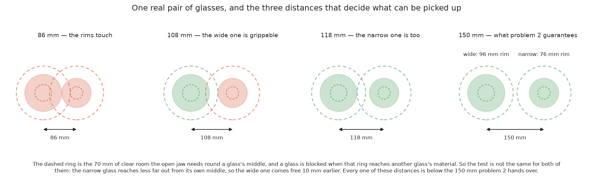
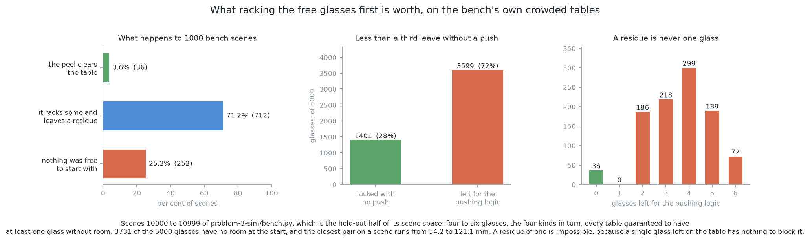
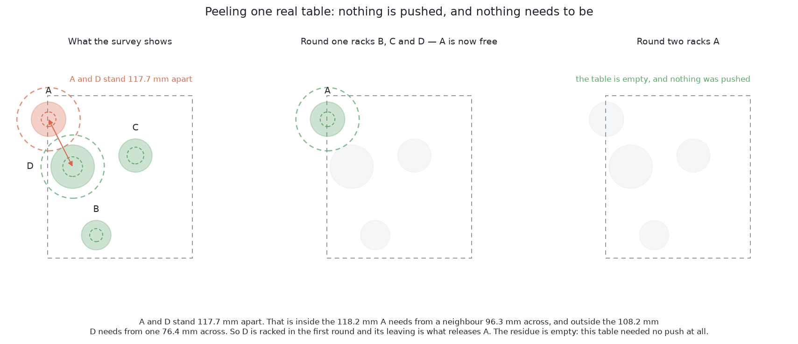
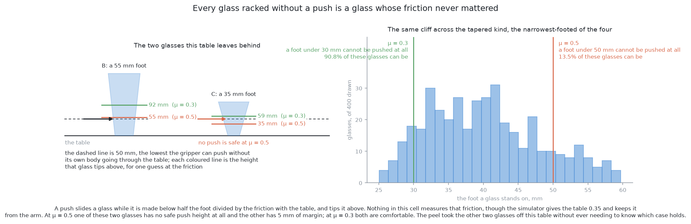

# Solution 1 — do not drag at all

*Programmed, and a loop of a simple kind. Question the premise before accepting
it. Every glass that leaves the table takes its crowding with it, so rack the
ones that are already grippable, look again, and only drag what is left.*

> **The cell is described once, in [the cell](../../the-cell.md)** — the layout,
> the two places the camera works from, all four sensors, and the words this
> project uses them with. What follows is only what is specific to this solution.

## Introduction

[Problem 3](../problem.md) asks the arm to move crowded glasses apart by dragging
them across the table. This document is about the step that comes before the
first drag, and about how much of the problem that step removes.

The step is simple to state. Some of the glasses on the table already have
enough room round them for the gripper to close on. Pick those up and put them
in the rack first. Every glass that goes to the rack is a glass that is no
longer anybody's neighbour, so the table gets emptier, and some of the glasses
that were crowded stop being crowded without anything being pushed.

This document answers three questions. How do you decide which glasses are
already grippable, given that the obvious test is wrong? How much of the
crowding does this dissolve, measured rather than asserted? And why is this
worth doing first rather than second, given that it does not replace pushing?

It is written for somebody deciding what order to build problem 3 in. The answer
it argues for is that this comes first, because it is the cheapest piece of work
in the problem and it makes every later piece smaller — and that anyone
expecting it to make the pushing unnecessary should look at the numbers first,
because on the tables this project actually tests against it clears fewer than
four tables in a hundred on its own.

Everything here is programmed. There is no model, no training set and no learned
component of any kind.

**Where the numbers come from** matters more in this document than in most,
because there are two different crowded tables in this repository and they give
different answers. The rates are measured on the tables problem 3 is tested
against, which come from
[`problem-3-sim/bench.py`](../../../problem-3-sim/bench.py), by
[`problem-3-programmed/measure_peel.py`](../../../problem-3-programmed/measure_peel.py).
The pictures, and the tables walked through beside them, are drawn by
[`images/generators/problem-3/make_01_images.py`](../../../images/generators/problem-3/make_01_images.py),
which measures every glass off the outline the spawner built rather than
quoting a size. [Two spawners, and why there are
two](#two-spawners-and-why-there-are-two) explains the split, which turns out to
be a deliberate piece of the project's design rather than an accident.

## The problem this solves

[Problem 2](../../problem-2/problem.md) has finished. The arm knows where every
glass stands and how wide each one is across its widest part. Some of the
glasses stand too close together for the gripper to get round one of them
without fouling the one beside it.

The natural reading of that sentence is that every glass on the table is stuck
until something moves. That reading is wrong, and the whole of this solution
follows from seeing why.

**Crowding is a property of a pair, not of the table.** Two glasses 112 mm apart
can block each other, and a pair on one of the tables below does. A third glass
300 mm away is not affected by either of them and never was. So a crowded table
is not necessarily a stuck table: some of the glasses on it may have all the
room they need, and those can be picked up right now.

**The rack is not on the table.** A glass that has been picked up, turned over
and stood on a peg is out of the glass zone entirely. It is on the far side of
the arm. So the table never gets more crowded during a run than it was at the
start, and every pick makes it less crowded.

Put those two together and there is an order of operations that costs nothing.
Take the glasses that are already free. Look at what is left. Repeat. Only when
nothing is free is there anything to drag.

### Touching a glass is the only step that can topple one

That ordering is worth more than it looks, and the reason is worth being precise
about.

Problem 3 names one failure that cannot be recovered from. A toppled glass
cannot be stood back up by anything in this project, and if it breaks, the arm
carries on moving through the shards. Every other failure in the problem is
recoverable: a glass pushed to a poor place can be pushed again, and a glass
that cannot be moved at all is a refusal and a line in the report.

Now ask what can topple a glass. Photographing it cannot. Computing a destination
for it cannot. Deciding it is too risky to move cannot. **The only step in the
whole problem that can put a glass on its side is the arm touching it.** A push
is contact with an object of unknown weight, and the arithmetic that says the
push will slide rather than tip needs a number this cell does not have.

So the count that matters is not how many pushes go well. It is how many times
the arm touches a glass at all. Doing that fewer times is worth more than doing
it better, because a push that never happens has no failure mode.

A pick is contact too, and it is fair to ask why a pick is safer than a push.
The answer is that a pick is contact the rest of the project has already been
built to make safe. The fingers close until the pads touch and then check the
width, the glass comes down until the rim touches and then checks the weight
transferred, and the grip height is worked out from the glass's own measured
profile. A push has none of that: it is a shove at a height chosen from a
guessed friction, and the arm finds out whether it was right by looking
afterwards.

## The main idea

The method needs one test, applied repeatedly.

A glass **qualifies** when no other glass still on the table is in the way of the
gripper closing on it. Pick every glass that qualifies, put it in the rack, and
work the test out again over what is left. Stop when the table is empty, or when
nothing qualifies. Whatever is still on the table when it stops is the
**residue**, and the residue is what the pushing solutions have to deal with.

The name for this is worth having: **peeling**. Take everything at the outside
of the crowd, and the crowd shrinks inwards. A peel that ends with an empty
table is a run where problem 3 never happened.

### Why the test is not "140 mm apart"

[The problem statement](../problem.md) gives 140 mm between middles as the
distance at which two glasses become grippable. That number is right and using
it as the test is wrong, and the difference is the engine of this method.

Here is where 140 mm comes from. To close on a glass, the open jaw has to be
around it: a finger either side, each finger a real thickness, and the jaw
opened wider than the glass before it closes. Measured out from the middle of
the glass, that comes to about **70 mm of clear room in every direction**. Two
glasses that each need 70 mm of room need 140 mm between their middles.

The hidden assumption is in the phrase *each need*. What the jaw needs is 70 mm
clear of **material**, measured out from the middle of the glass it is closing
on. A neighbour's material does not start at the neighbour's middle. It starts
half a rim out from it. So the test for whether a neighbour `n` is in the way of
a target `t` is

    distance(t, n)  <  70 mm + (widest part of n) / 2

and that is not the same number for the two glasses of a pair.

How far apart that puts the threshold depends on which glasses are on the table.
The widest part runs 45 to 105 mm over the project's four kinds, so the
threshold runs from **92.5 mm**, when the neighbour is the narrowest glass
anywhere in the ranges, to **122.5 mm**, when it is the widest. The 140 mm in
the problem statement is the symmetric case, two glasses of average width, and
it is the right thing to quote in a problem statement and the wrong thing to
program. The [next section](#two-spawners-and-why-there-are-two) shows that the
project's own implementation of this test agrees exactly, down to the
inequality.

The picture uses one real pair, drawn by the project's spawner: a wide glass
96.3 mm across and a narrow one 76.4 mm across. Three distances mean something
to that pair and they are all different. At 86.4 mm their rims touch. At
108.2 mm the wide one becomes grippable, because the narrow glass beside it is
narrow. At 118.2 mm the narrow one becomes grippable, because the wide glass
beside it is wide.

That 10 mm band between the two thresholds is where this method does its work.
In it, one glass of the pair can be picked up and the other cannot. Pick the one
that can, and the other is left alone on that part of the table with nothing
beside it. No push was needed and none was attempted.

**A method that used 140 mm for both glasses could not see that band at all.**
It would report the pair as crowded, hand both glasses to the pushing logic, and
the arm would shove a glass that it could simply have lifted.

The obvious alternative is to keep the symmetric test and accept the false
alarms, on the grounds that a push is not that expensive. That is the trade this
solution refuses, and the refusal is the whole point: a push is exactly as
expensive as the chance that it topples the glass, and that chance is a number
nobody in this cell can compute.

### The order does not matter, and that is what makes it useful

The peel racks glasses one at a time, so it is natural to ask whether racking
them in a different order would leave a different residue. It would not, and the
reason is a two-line argument that turns out to be worth a great deal.

Racking a glass removes it from the table. Removing a glass cannot put anything
in the way of anything else. So a glass that qualified before a pick still
qualifies after it, and the set of glasses that qualify only ever grows. Whatever
order the picks happen in, the process ends at the same place.

Over the 1000 bench scenes measured below, a peel that racked one glass at a
time in a random order left exactly the same residue as a peel that racked every
free glass at once, on **all 1000 of them**. That is a check on the argument
rather than evidence for it, which is the right way round.

Two things follow, and the second is the useful one.

**The implementation does not need a policy.** There is no "which glass first"
decision to get right, so there is no heuristic to tune and nothing to compare
against. Pick them in whatever order the arm's travel prefers.

**The residue can be worked out before the arm touches anything.** The peel needs
no new measurement: racking a glass does not move the others, so the arm already
knows, from the one survey problem 2 gave it, exactly which glasses will come
free and which will be left. So the run can decide *at the start* whether any
pushing will be needed at all, and how much. That turns this from a sequencing
tweak into a planning step, and it is the single most useful property the method
has.

## What the peel is worth, measured

Everything above is an argument. This section is a measurement, and it starts
with a table the arm will never see.

### Two spawners, and why there are two

Problem 2's spawner cannot produce a crowded table, and it is worth knowing why
before trusting any number below.

`glasses/spawn.py` places glasses at random inside the glass zone and refuses
any position closer than `MIN_SEPARATION`, which is **150 mm between middles**.
Every crowding threshold in this problem is below that. The symmetric line is
140 mm, and the asymmetric test tops out at 122.5 mm. So a table that spawner
draws has no crowded pair on it, by either test, and cannot have one.

That is measured, not assumed. Over 1500 tables — four, five and six glasses,
500 seeds at each count — the count is zero either way. Read the table below as
the same question asked twice, once with the symmetric test and once with the
asymmetric one.

| what was counted | how many of 1500 |
| --- | --- |
| tables with a pair inside 140 mm | **0** |
| tables where any glass is blocked by the asymmetric test | **0** |

The closest any two glasses came on any of those tables was 150.0 mm, the median
closest pair was 155.3 mm, and the widest was 242.0 mm. The floor binds almost
every time, which says the zone is small for six glasses, but it binds at a
distance that leaves every glass grippable.

**That is not a fault, and the project has already answered it.** Problem 2's
spawner guarantees 150 mm precisely so that problem 2 is about seeing rather
than about crowding, and problem 3 therefore has a scene generator of its own.
It is [`problem-3-sim/bench.py`](../../../problem-3-sim/bench.py), and
`scene(seed)` is the authoritative crowded table: four to six glasses, and
**every table guaranteed to have at least one glass without room**. Six of every
ten glasses it places go deliberately close to a glass already down, at a
distance drawn between touching and having room; the rest go anywhere they fit,
which crowds some of them too.

So there are two populations in this project, and every rate has to say which
one it describes. Problem 2 hands over tables at 150 mm apart, where nothing is
crowded. `bench.scene` draws tables where three quarters of the glasses are.

One more thing comes from the bench, and it is the test itself. `bench.has_room`
is the project's own room check, and it is the asymmetric rule set out above,
written the same way:

    dist((x, y), (ox, oy))  >=  GRIP_ROOM + width_of_the_other_glass / 2

with `GRIP_ROOM` at 70 mm, and a comment saying it is not symmetric for exactly
the reason given above. Deriving a rule and then finding the project had already
written it down is reassuring about both. Everything below calls
`bench.has_room` itself rather than a copy of it.

It also settles the range. `bench.scene` cycles **all four kinds** — 250 scenes
each of straight, tapered, stemmed and short-stemmed glasses over the thousand
measured below — and not the single kind [`problem.md`](../problem.md) describes.
Over four kinds the widest part runs 45 to 105 mm, so the threshold runs **92.5
to 122.5 mm**, which is what the [solution overview](solution-overview.md) says.
For the tapered kind alone it would be 102.5 to 122.5 mm. The mismatch between
the problem statement's one kind and the bench's four is worth someone
resolving; it does not change the method, and it widens the band the method
works in.

### What the peel removes

The sweep below is `bench.scene` over seeds 10,000 to 10,999, which is the
held-out half of the bench's scene space — `bench.TEST_SEEDS` says everything
from 10,000 on is for testing. That is 1000 scenes and 5000 glasses, of which
**3731, or 74.6 per cent, have no room at the start**. The closest pair on a
scene runs from 54.2 mm to 121.1 mm, with a median of 86.7 mm. These tables are
a great deal tighter than anything problem 2 produces.

The numbers come from
[`problem-3-programmed/measure_peel.py`](../../../problem-3-programmed/measure_peel.py),
which has to live beside the bench because the bench imports a physics engine
the documentation environment does not have. The diagram script holds them as
literals and names that script.

Read the table below as one row per outcome, over the 1000 scenes.

| what happened | scenes | share |
| --- | --- | --- |
| the peel cleared the table, and no push was needed | 36 | **3.6%** |
| the peel racked some glasses and left a residue | 712 | 71.2% |
| nothing qualified at the start, so the peel did nothing | 252 | **25.2%** |

**The peel almost never finishes the job.** On these tables it clears fewer than
four scenes in a hundred, and on a quarter of them it cannot even start, because
every glass on the table is blocked by another one.

What it does do is take work away from the pushing logic. **1401 of the 5000
glasses — 28.0 per cent — leave the table without a push ever being aimed at
them**, at a mean of 1.40 free picks a scene. The mean number of pairs inside
140 mm falls from 4.05 to 3.21.

That is a much smaller claim than the one this method is often made to carry,
and it is the honest one. Somewhat over a quarter of the glasses skip the risky
step entirely. The rest are handed to the pushing logic.

The reference implementation's own scorecard says the same thing from the other
end. [`problem-3-programmed`](../../../problem-3-programmed/README.md) runs this
peel inside its main loop — the comment in `run.py` above the step reads
*"Solution 1: every glass racked leaves more room for the rest"* — and over 50
held-out tables it reports 251 glasses, **190 of them without room at the
start**, 199 racked, 52 refused and none knocked over. The peel alone could not
have reached 199.

### The cascade, which is the part that is not obvious

It is tempting to summarise the method as "pick the free ones first", which
sounds like it needs no loop. The loop earns its place, and the measurement says
how often.

The peel took more than one round on **114 of the 1000 scenes, 11.4 per cent**.
A second round means at least one glass was blocked when the survey finished and
became grippable only because a neighbour had been racked. Rounds went as far as
three on 3 scenes.

That is the peeling proper, as opposed to the free picks. In one table in nine,
removing a glass releases another one, and the arm gets a glass it could not
have had at the start. It is a smaller share than a loosely crowded table would
give, and the reason is visible in the residue sizes below: when a glass has
three blockers rather than one, racking any single neighbour does not free it.

The picture walks a table through both rounds. It is not a bench scene, and the
reason is worth one sentence: every glass in these pictures has to be a real
outline measured as it is drawn, because this project does not let a glass's
size be written down anywhere, and the drawing script cannot import the bench,
because the bench imports a physics engine. So the pictures use problem 2's
spawner with its 150 mm floor lowered to 105 mm — the widest rim the tapered
kind is drawn at, so two glasses may end up touching and can never end up
overlapping. What that shows is the mechanism, which is the same on either
population. The rates above are the bench's.

### What a residue looks like

When the peel leaves something behind, it leaves it in a particular shape.

Read the table below as a count of how many glasses were left for the pushing
logic, over the same 1000 scenes.

| glasses left | scenes |
| --- | --- |
| none | 36 |
| one | **0** |
| two | 186 |
| three | 218 |
| four | 299 |
| five | 189 |
| six | 72 |

**A residue is never a single glass, and it cannot be.** A glass alone on the
table has no neighbour, so nothing is in its way, so it qualifies and is racked.
For a glass to survive the peel, something has to still be blocking it, and that
something has to have survived the peel too.

The commonest residue on these tables is four glasses, not two. That is the
clearest single sign of how much more adversarial the bench's tables are than
anything problem 2 draws: the usual case is not a crowded pair in an otherwise
clear zone, it is a knot.

## Why this belongs before every push: the number nobody has

Everything above is about saving arm time. This section is about the thing that
makes the saving matter.

A pushed object either slides or tips over, and which one happens is decided by
where it is pushed. Push at height `h` on an object whose base is `2a` across,
standing on a table it rubs against with friction `μ`, and it slides while

    h  <  a / μ

and tips above that. The gripper cannot get below 50 mm from the table without
its own body going through the table, so a glass whose topple height is below
50 mm has no safe push height at all, and the only correct answer for it is to
refuse.

**Nothing in this cell measures μ.** It is a property of the glass, the table,
and whatever is on either of them. There is no sensor for it, no calibration
step that produces it, and no way to infer it from a picture. Every number the
formula above produces is therefore a limit that depends on a guess.

The simulator does have a value. `bench.py` gives the table a friction of
**0.35**, with a comment saying that neither approach is told it, because
nothing in the cell measures it. So the answer exists and is deliberately
withheld, which is the right way to pose the question.

How much does the guess matter? The table below answers that over 400 glasses of
each kind, drawn from the project's own ranges. Read each row as one kind, and
each column as one guess at the friction; the figure is the share of those 400
glasses that have a safe push height at all when the jaw touches at the lowest
the gripper reaches.

| kind | the foot it stands on | μ = 0.3 | μ = 0.35 | μ = 0.5 |
| --- | --- | --- | --- | --- |
| straight | 41.1–85.3 mm | 100% | 100% | 66.0% |
| tapered | 25.1–59.7 mm | **90.8%** | **69.5%** | **13.5%** |
| stemmed | 43.5–91.5 mm | 100% | 100% | 92.2% |
| short stemmed | 45.0–63.7 mm | 100% | 100% | 67.8% |

Two things stand out. **The cliff is a tapered-glass problem.** That kind is
drawn on a foot between 38 and 58 per cent of its rim, so it stands on much less
than the others, and at the high guess seven of its glasses in eight cannot be
pushed at all. The other three kinds are comfortable until μ = 0.5.

**And the arm does not push at 50 mm.** The jaw is a box, and `bench.py` builds
it from the gripper's own declared finger height: the fingertips ride at 50 mm
and **the top edge of the jaw is at 65 mm**. A glass that flares outwards above
the fingertips meets that top edge first, so that, not 50 mm, is the height it
is pushed at. Recomputing the tapered row at 65 mm gives 53.2 per cent at
μ = 0.3, 25.5 per cent at μ = 0.35, and **nothing at all at μ = 0.5**. The kind
that is hardest to push is also the kind whose shape raises the contact.

**Nobody can say which of those worlds this cell is in**, and every solution in
problem 3 from [2](02-one-fixed-nudge.md) to
[11](11-search-a-push-strategy.md) sits somewhere on that cliff. The programmed
implementation measured what guessing costs: refusing any glass that would tip
at μ = 0.5 **refused 35 of its first 60 glasses**, which it reports as far too
many, and it replaced the guess with a 5 mm test push that finds out directly.
That is the right answer and it is a cousin of [identify the contact
parameters](09-identify-the-contact-parameters.md) — but note what it costs: a
test push is a push, and it is contact with a glass that might tip.

Here is where all of that bears on solution 1, and the bearing is direct. **A
glass racked without a push is a glass whose friction never mattered.** On the
bench's tables the peel takes 28.0 per cent of the glasses off without asking
the question, and no test push is made on any of them either. Whatever the
answer turns out to be, those 1401 glasses are unaffected by it.

It is not unaffected for the 3599 left behind. Read the figures below as the
share of the residue that has no safe push height at all, at each guess:
1.3 per cent at μ = 0.3, 5.1 per cent at the simulator's own 0.35, and
**36.4 per cent at μ = 0.5**. So the residue is not a random sample of the
table. It is where the unknown lands, and the peel has concentrated the problem
into it.

The left panel is the residue of one drawn table, two tapered glasses. One of
them stands on a 55.3 mm foot and tips above 55.3 mm at μ = 0.5, which leaves
5 mm of room above the lowest the gripper can reach. The other stands on a
35.1 mm foot and tips above 35.1 mm, which is below the lowest the gripper can
reach, so at that friction there is no safe push for it at all. At the
simulator's own 0.35 it tips above 50.2 mm, which is a margin of two tenths of a
millimetre. At μ = 0.3 both are comfortable. Nothing was chosen to make the
point: these are two ordinary glasses of the kind the bench spends a quarter of
its scenes on.

## The condition that is not about crowding

The peel's test asks whether the jaw has room. A glass also needs something else
before it can be picked up: a **level view**, which is the camera standing 380 mm
back from it at 120 mm above the table, looking level, so that the glass's
profile can be measured. The arm is offered nine places on the circle round the
glass, 40° apart, and needs one of them to be reachable and not to have another
glass sharing the frame.

The obvious move is to add that condition to the peel: a glass qualifies when the
jaw has room **and** the camera has somewhere to stand. That is what the
[solution overview](solution-overview.md) describes, and measuring it produced
the most surprising result in this document.

With a crude version of the sightline test — a direction fails if the arm cannot
comfortably stand there, or if another glass still on the table would share the
frame — **54.0 per cent of glasses on a crowded table have no clear direction of
the nine**. Measured on tables drawn at problem 2's own 150 mm floor, where
nothing is crowded at all, the figure is **45.6 per cent**. Nearly all of it is
there before any crowding is.

Two conclusions follow, and the first is about the test rather than the cell.

**The absolute level is not credible and should not be quoted.** A test this
crude, which treats any glass near the sight line as fatal and ignores that
problem 2 can stand further back, move to a different station, or separate two
glasses that share a frame, cannot be right about a cell where problem 2 works.
[Moving the camera](../../problem-2/solutions/03-move-the-camera.md) is the real
version of this test, and it is a good deal more careful. The bench sidesteps
the question entirely: its `look()` hands over a position, a height and two
widths for every standing glass, with problem 2's measured error on them, and
says nothing about where the camera had to go to get them.

**The comparison between the two populations is what the measurement licenses**,
and it says the sightline condition is mostly not about crowding. It is problem 2's
difficulty, it is already problem 2's job, and it is nearly as hard on an
uncrowded table as on a crowded one.

So the practical advice is to keep the two conditions apart. The peel decides
which glasses have room to be gripped. Problem 2's viewpoint search decides
whether each of those can be measured, and refuses the ones it cannot, as it
already does. Folding the second into the first makes the peel look like it
fails where in fact the cell has a separate difficulty that no amount of pushing
would fix.

## A worked example

One table, four glasses of the tapered kind. It is the table the peel picture
above draws, and every number below is printed by the diagram script. It is a
loosely crowded table rather than a bench scene, for the reason given above, and
that makes it the right table for showing the mechanism: one crowded pair, so
the arithmetic is visible. [How it fails](#how-it-fails) walks through two real
bench scenes afterwards, where the same arithmetic runs on a knot.

Read the table below as one row per glass: where it stands in millimetres from
the arm's base, how wide its widest part is, how wide the foot it stands on is,
and how tall it is.

| glass | stands at | widest part | foot | height |
| --- | --- | --- | --- | --- |
| A | (322, −133) | 76.4 mm | 32.5 mm | 155.7 mm |
| B | (427, −389) | 65.4 mm | 28.8 mm | 178.9 mm |
| C | (514, −213) | 73.8 mm | 36.9 mm | 93.1 mm |
| D | (375, −237) | 96.3 mm | 43.6 mm | 228.0 mm |

**The survey's verdict.** Of the six pairs, exactly one is inside 140 mm: A and
D, at 117.7 mm apart. The next closest is C and D at 141.0 mm, which clears the
symmetric line by a millimetre. So a method using 140 mm reports one crowded pair
and two candidate glasses to push.

**The asymmetric test disagrees about which glass is stuck.** A is 117.7 mm from
D. D's widest part is 96.3 mm across, so A needs 70 + 48.2 = 118.2 mm of
distance from it, and has 117.7. **A is blocked, by half a millimetre.** Turn it
round: D is 117.7 mm from A, A's widest part is 76.4 mm across, so D needs
70 + 38.2 = 108.2 mm, and has 117.7. **D is free.**

The half-millimetre is worth pausing on rather than glossing over, because the
project has already measured what it is worth. The bench hands over positions
with a standard deviation of 0.5 mm and widths with one of 2.5 mm, from what
problem 2 actually scored. Two positions and half a neighbour's width give
1.44 mm of error in the gap, so three standard deviations is 4.3 mm — and
`problem-3-programmed/run.py` therefore takes a glass only when it has **5 mm
more room than it needs**. A margin of half a millimetre is inside the noise and
means nothing.

Which way to err is decided by what each mistake costs. Reporting A as blocked
when it was grippable costs one push that was not needed. Reporting it as
grippable when it was not costs a jaw closing on a neighbour. So the margin goes
on the cautious side, and the next section says what that costs.

**Round one.** B, C and D have no blocker. All three are picked, measured, turned
over and racked. A is not touched.

**Round two.** A is now alone on the table. Its only blocker was D, and D is in
the rack. A qualifies, and is racked.

**The residue is empty. This table needed no push at all**, and the pushing logic
was never called.

The result turned on the order, and not on luck. D is the widest glass on the
table and A is one of the narrower ones, so D came free first and A was released
by D leaving. Had the arm picked in the order the survey listed them, or nearest
first, or largest first, it would have reached the same place — the residue does
not depend on the order — but it is the asymmetry that made the first pick
possible at all.

**Change one number and it ends differently.** Make A and D the same width, say
85 mm each. Each then needs 112.5 mm from the other, both have 117.7, and both
are free: the peel still empties the table, faster. Make them both 100 mm wide
instead. Each needs 120 mm, neither has it, and neither ever qualifies. The peel
racks B and C, and hands a pair of glasses 117.7 mm apart to the pushing logic
with the rest of the table now empty around them.

That last ending is the one the next section is about.

## What it needs

Nothing the cell does not already have.

**The survey's output**, which is a position and a width for every glass. Problem
2 produces both.

**The rack bookkeeping**, which already exists: the rack holds six slots, a glass
may consume a neighbouring slot if it is wide or tilted, and the code that works
that out is in `rack/layout.py`.

**A loop in the module that decides the order.** That is the whole change. In
the main project that is `task.py`, which is the only module that knows what
order things happen in; in the problem 3 code it is already written, as the
first step inside `problem-3-programmed/run.py`'s main loop. Look, rack
everything that is not in the residue, and only then decide what needs moving.

No new sensor, no new measurement, no model, no training data, and no parameter
to tune. The one constant it introduces is the 70 mm of room the jaw needs, and
that belongs to the gripper rather than to any glass, so it is the kind of number
this project allows itself to write down.

## What it costs

Four things, and the first one is not what you would expect.

**It does not cost extra surveys.** The natural assumption is that the cost of
this method is that one survey at the start becomes one per pick. It is not,
and the reason is the order-independence argument above: lifting a glass straight up and carrying it
away does not move the glasses left behind, so the arm can work out the whole
peel, including every later round, from the survey it already has. The residue is
known before the first pick.

What is true is that the arm should *check* rather than assume. A glass that is
knocked on the way out, or that turns out to have been two glasses, invalidates
the plan. The honest cost is therefore one confirming look after the picks, not
one survey per pick — and problem 2 already wants a look after anything moves.

**It spends arm time before it knows whether it was necessary.** On a table that
needs no push, the peel is the whole job and costs nothing extra. On a table
whose residue cannot be pushed at all, the arm will have racked a glass or two
before reporting that the rest are refused. That is not wasted work, because
those glasses are done, but it does mean the run's bad news arrives late.
Computing the residue first fixes this too: the arm can report at the start that
two glasses will need pushing and whether their feet are wide enough for it to be
possible.

**The measurement error costs it a quarter of its yield.** The 5 mm margin
`run.py` takes glasses at is not optional — without it the arm will sometimes
close a jaw on a neighbour — and it is a real cost. Running the same sweep with
that margin applied, the glasses racked without a push fall from 1401 to
**1073**, which is 28.0 per cent down to 21.5 per cent. Scenes cleared outright
fall from 36 to 8, scenes where nothing at all was free rise from 252 to 338,
and the cascade rate falls from 11.4 per cent to 3.6 per cent. So a quarter of
what this method appears to be worth is spent on being sure.

**It makes the residue harder than the average glass.** The peel removes the easy
cases by construction, so what is left is disproportionately the glasses that
were close to something, and, as the measurement above shows, disproportionately
the ones with narrow feet at high friction. Any later solution's success rate,
measured on the residue, will look worse than the same solution measured on a
whole table. That is an accounting effect and not a real deterioration, and it is
worth knowing before somebody compares two numbers that were measured on
different populations.

## How it fails

It fails in exactly one way: **a group of glasses that block each other, with
nothing left whose removal would help.** The recomputation then returns the same
answer forever. A loop that does not notice this spins; one that does reports a
stall and hands the residue on.

On the bench's tables that is the usual outcome rather than the exception: it
happens on 964 of the 1000 scenes, and on 252 of them there was never a single
free glass to start with. Two real scenes show the two shapes it takes.

### Two glasses, each inside the other's threshold

Scene 10,008 of the bench. Four straight glasses. Read the table as one row per
glass, with the last column naming whatever is in the way of gripping it.

| glass | stands at | widest part | foot | blocked by |
| --- | --- | --- | --- | --- |
| A | (604, −423) | 80.9 mm | 74.0 mm | B |
| B | (526, −399) | 71.2 mm | 64.5 mm | A |
| C | (412, −346) | 55.3 mm | 50.1 mm | — |
| D | (375, −181) | 46.3 mm | 42.3 mm | — |

Two pairs are inside 140 mm, and only one of them matters.

**The B–C pair is a false alarm.** They stand 125.6 mm apart. B needs 97.6 mm
from C, because C is narrow, and C needs 105.6 mm from B. Neither blocks the
other, and a method using the symmetric 140 mm line would have pushed one of
them for nothing.

**The A–B pair is real, and it is mutual.** They stand 81.8 mm apart, which is
less than a rim's width of daylight. A needs 105.6 mm from B and B needs
110.4 mm from A. Both are blocked, by each other.

So the peel racks C and D in its first round and stops. A and B are the residue,
and they are exactly the case [one fixed nudge](02-one-fixed-nudge.md) exists
for: one pair, a clear line between their middles, and — now that C and D are in
the rack — an empty table to push into. Both stand on feet over 60 mm across, so
both can be pushed even at μ = 0.5. This is the good ending of a stall.

### Nothing free at all

Scene 10,005. Four tapered glasses, and this is the quarter of the bench's
scenes where the peel contributes nothing whatever.

| glass | stands at | widest part | foot | blocked by |
| --- | --- | --- | --- | --- |
| A | (421, −100) | 86.3 mm | 40.6 mm | B, D |
| B | (519, −134) | 80.0 mm | 42.1 mm | A, C, D |
| C | (535, −241) | 85.5 mm | 38.0 mm | B, D |
| D | (454, −195) | 84.3 mm | 33.3 mm | A, B, C |

Every glass is blocked, most of them by more than one neighbour, and the five
crowded pairs run from 89.7 mm to 108.4 mm apart. There is no glass to rack, so
there is no first pick, so there is no cascade. The arm has to push before it
can do anything at all.

And this is the scene where the friction decides everything. The four feet are
33.3, 38.0, 40.6 and 42.1 mm across. At μ = 0.3 all four tip above 55.6 mm or
higher, so all four can be pushed from the fingertips at 50 mm. At the
simulator's own 0.35, D tips above 47.6 mm and cannot. At μ = 0.5 not one of the
four can be pushed at all, and the correct answer for the whole table is four
refusals.

The peel cannot fix any of that. What it can do, on the 71.2 per cent of scenes
where it racks something, is make sure the run's uncertainty is confined to
fewer glasses than it started with.

## Where the idea comes from

This is an old idea with several names, and none of the names is obviously the
right one to search for. Four bodies of work are worth knowing about.

### Removing whatever nothing points at

Draw one arrow from each blocked glass to whatever blocks it, and the peel is
exactly a standard graph procedure: repeatedly remove every vertex with no arrow
pointing at it, and see what is left. That is Kahn's algorithm for topological
sorting, published in 1962, and the property this document relies on is the one
Kahn's algorithm is usually used *for*: what remains when the removals stop is
the part with a cycle in it.

That gives the stall its precise description. The peel does not halt because the
arm has run out of patience. It halts because the blocking relation has a cycle
in it. The shortest cycle is a pair of glasses each standing inside the other's
threshold, and on a loosely crowded table that is nearly always what is left. On
the bench's tables it is not: of the 964 scenes that leave a residue, 186 leave
two glasses and 778 leave three or more.

Graph theory has a second name for the same shape of computation, the **k-core**,
where vertices with too few neighbours are stripped away repeatedly until
everything left has enough. Seidman introduced it in 1983 to describe the dense
middle of a social network. It is worth knowing because the vocabulary of
"peeling" and "core" comes from there, and because the same one-line argument
about order-independence is what makes it well defined.

Both are used wherever a dependency has to be resolved before the thing that
depends on it, and both are rarely the right tool when the removals change the
remaining structure — which is the reason they fit here, since taking a glass off
the table cannot put anything in anything's way.

### Rearrangement planning, and monotone plans

The robotics literature calls this family **rearrangement planning**: several
objects share a space, each has to end up somewhere, and the difficulty is that
moving one may require moving another first. Stilman and Kuffner's work on
navigation among movable obstacles, from around 2005, is the usual starting
point; the question there is which obstacles must be moved, and in what order,
for a path to exist at all.

The distinction that matters here is between a **monotone** plan, in which every
object is moved exactly once, to its final place, and a non-monotone one, in
which something has to be moved out of the way and moved again later. Krontiris
and Bekris studied instances that cannot be solved monotonically, around 2015,
and the general result in this area is that rearrangement is hard in the worst
case while most real instances are easy.

That is exactly the shape of the measurement in this document. **A peel is a
monotone plan**: every glass it racks is picked once and goes straight to the
rack. On the bench's tables only 36 scenes in a thousand are monotone all the
way through. The other 964 are not, and pushing is what this cell has instead of
a place to put something down temporarily — a push is exactly the "move it out
of the way and deal with it later" that makes a plan non-monotone.

It is worth being clear that this solution is a much weaker thing than a
rearrangement planner. It does not search, it does not consider moving a glass
to make room, and it gives up as soon as nothing is free. That is deliberate:
searching would mean pushing, and the point of the peel is to find out how much
can be had without pushing at all.

### Pushing and grasping as alternatives, not stages

The closest work in spirit comes from clutter manipulation, where the question
is when to push and when simply to pick.

Zeng and colleagues' *Learning Synergies between Pushing and Grasping with
Self-supervised Deep Reinforcement Learning*, from 2018, is the well known
example. It learns two policies, one that pushes and one that grasps, and the
interesting part is the arrangement rather than the learning: the system is
rewarded for grasping, and pushes only when pushing makes a later grasp
possible. Danielczuk and colleagues' *Linear Push Policies to Increase Grasp
Access in Dense Clutter*, also 2018, makes the same point with a simpler method
and measures it directly as grasp access gained per push.

Dogar and Srinivasa's push-grasping work, from around 2010, sits beside these:
there the push and the grasp are the same motion, the fingers sweeping clutter
aside as they close.

The lesson this document takes from all three is one sentence. **Pushing is an
enabler for grasping, not a stage before it**, so the first question to ask of
any crowded scene is which objects can be grasped right now. Where this cell
differs from that literature is in the cost of being wrong: those systems work
on tolerant objects in bins, and can afford to push and see. A tall glass on a
narrow foot cannot be stood back up.

### Accessibility ordering, which may not be a standard name

The overview calls this **accessibility ordering** or **reachability ordering**.
I have not been able to confirm that either is an established term, so treat both
as descriptions rather than as names to search for. The established terms are the
ones above: rearrangement planning for the family, monotone plans for the
property, and singulation for the specific job of separating crowded objects.

The everyday version of the idea needs no citation. Getting one car off a full
drive is a question of which car to move, and moving the wrong one first can make
the job impossible.

## Where it is strong and where it breaks

**It is free.** It needs no sensor the cell lacks, no model, no training data and
no parameter. The change is to the order things happen in.

**It cannot make anything worse.** Every glass it racks was checked for room
before it was touched, by the same test the gripper needs anyway. A glass that
does not qualify is not touched at all. There is no case where running the peel
first leaves the pushing logic with a harder problem than it would have had: the
residue is a subset of the table, and the table around it is emptier.

**It removes about a quarter of the contact.** On the bench's own scenes, 1401
of 5000 glasses — 28.0 per cent — leave without a push ever being aimed at them,
and so never depend on the friction nobody has measured. With the 5 mm margin
the real implementation takes them at, it is 21.5 per cent.

**It is entirely predictable.** The residue is computable from the survey before
the arm moves, and does not depend on the order of the picks. A run can therefore
say at the start what it is going to have to push, which is more than any other
solution in this problem can do.

Against that, three genuine limits, and the first one is larger than it looks.

**It hardly ever finishes the job.** On 3.6 per cent of bench scenes the peel
clears the table on its own. On 25.2 per cent of them nothing is free at the
start and it contributes nothing at all. The overview's verdict of "chosen — try
this first" is right, and the reason is not that it often suffices, because it
does not. It is that the picks it does get are free, and it is the only step
here that can be run before deciding anything else.

**It makes the residue unrepresentative.** The glasses it leaves behind are
harder than average, on every axis, including the one that decides whether a
push is possible: 36.4 per cent of the residue cannot be pushed at all at
μ = 0.5, against a much lower share of the table it came from. Measure any later
solution on the residue and it will score worse than the same solution measured
on whole tables.

**It depends on picks being safe.** The whole argument is that a pick is a safer
form of contact than a push, and that is true only because problem 1 built the
pick carefully — feeling for the width, feeling for the weight transfer, and
refusing anything doubtful. If a pick could topple a glass as easily as a push
can, the peel would be trading one risk for the same risk, and there would be no
argument for doing it first.

## Where it sits among the other solutions

It sits **before all of them**, and it replaces none of them.

Its relationship to the pushing solutions is the same in every case. [One fixed
nudge](02-one-fixed-nudge.md), [plan, feel, look
again](03-plan-feel-look-again.md), [predict the slide](04-predict-the-slide.md)
and the rest all take a set of crowded glasses and move them apart. The peel
decides what that set is, and on the bench's tables it is a little under three
quarters of them. Every one of those solutions is easier after a peel than
before one: fewer glasses to move, and more free table to move them into,
because the racked glasses are gone from it.

Solution [3](03-plan-feel-look-again.md) is the one it pairs with most naturally,
and the pairing is worth stating because it is how the problem is actually built.
Solution 3 is a loop — plan a push, feel for the glass, look again — and the peel
is the same loop with the push left out. `problem-3-programmed/run.py` runs them
as one loop, and its shape is worth copying: look, rack every glass that has
room, and only if none has room, choose one push, make it, and start again. A
push that works turns the residue back into a table with free glasses on it, and
the peel takes them. On the bench's tables that is where most of the peel's
value actually appears — not in the 1.40 glasses it takes before the first push,
but in the ones it takes after each push that works.

That reframes the method, and the reframing is the most useful thing in this
document. **The peel is not a prefix to pushing. It is the other half of a loop
that pushing drives.** Measured as a prefix it clears 3.6 per cent of tables and
looks marginal. Run as the loop's other half it is what turns every successful
push into racked glasses, and the implementation that does that racks 199 of 251
glasses with 212 pushes and topples none.

The hybrids sit on the same residue. [A learned residual on the push
model](05-a-learned-residual-on-the-push-model.md) corrects a push prediction
that the peel has already reduced the number of, and [geometry generates, a model
ranks](06-geometry-generates-a-model-ranks.md) orders candidate pushes that the
peel has already made fewer and more separated.

Against the learned solutions the comparison is about what each one is for. [A
learned change-verifier](07-a-learned-change-verifier.md) and [a learned early
abort](08-a-learned-early-abort.md) both make individual pushes safer. [Identify
the contact parameters](09-identify-the-contact-parameters.md) attacks the
missing friction directly, by measuring it from what pushes actually do — which
is what the programmed implementation's 5 mm test push already does in the
crudest possible way, one glass at a time. [Learn a forward model, then
plan](10-learn-a-forward-model-then-plan.md) and [search a push
strategy](11-search-a-push-strategy.md) try to make pushes land where they were
aimed. Every one of those is a way of doing pushes better, and every one of them
is applied to the residue.

This solution is the only one in the set that reduces the number of pushes rather
than improving them, and it does it with arithmetic that was already available.
That is the argument for building it first, and the measurement in this document
is the argument for not expecting it to be enough on its own.

One last thing is worth ending on, because it took a measurement to see. There
are two populations in this project. Problem 2 hands over tables with 150 mm
between every pair, where nothing is crowded and this method racks everything.
`bench.scene` draws tables where three quarters of the glasses have no room, and
there this method racks a quarter and hands over a knot. Both are real, both are
in the repository, and any number quoted about problem 3 — in this document or
any of the ten beside it — means nothing until it says which of the two it was
measured on.
