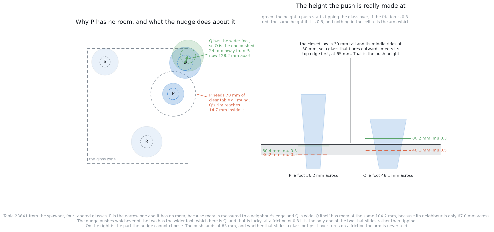
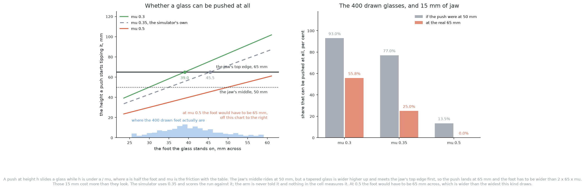
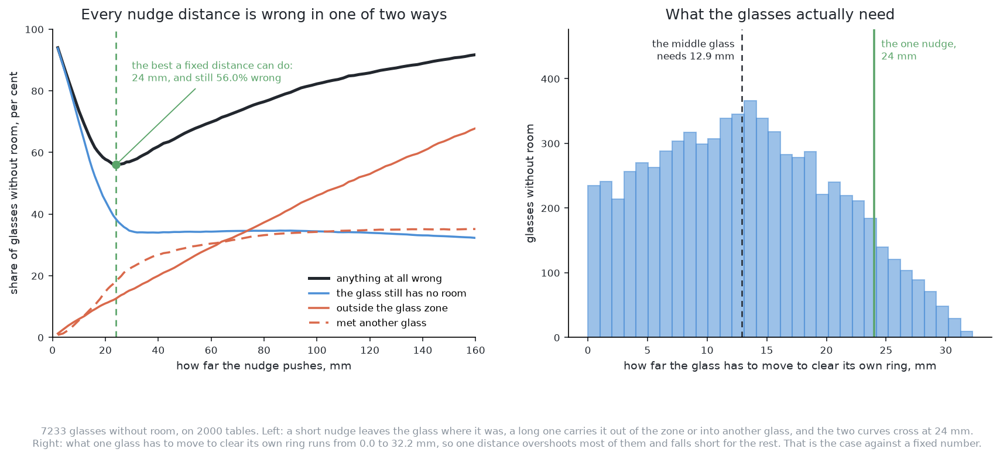
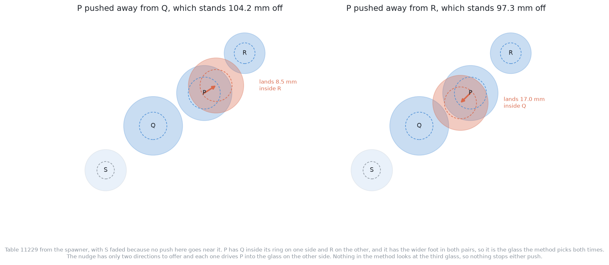
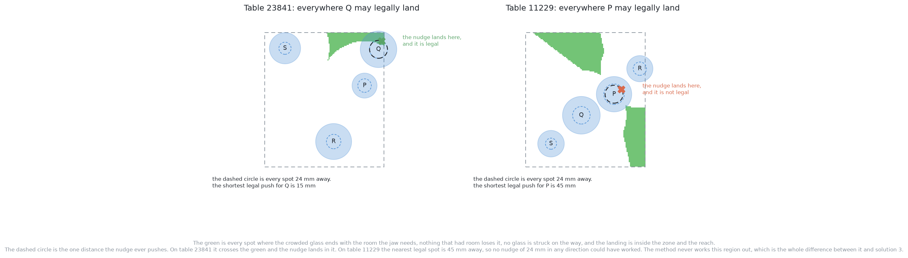

# Solution 2 — one fixed nudge

*Programmed. When a glass has no room to be gripped, push one of the two
glasses a fixed distance straight away from the other, and then look again.*

> **The cell is described once, in [the cell](../../the-cell.md)** — the layout,
> the two places the camera works from, all four sensors, and the words this
> project uses them with. What follows is only what is specific to this
> solution.

## Introduction

This document explains the simplest thing that could possibly move two crowded
glasses apart, and then measures how often it works. The method is one
subtraction and one multiplication: find the glass that has no room, find the
neighbour in its way, and push one of the two a fixed distance along the line
between them. There is no search, no map of the free table, and no model of
what a push does.

It is written for a reader who has finished [the problem
statement](../problem.md) and wants to know where to start building. The answer
is: build this one first. It exercises the whole contact sequence against a
real simulated glass, it is a few dozen lines, and when a glass falls over you
know the fault was in the contact rather than in the plan. It is also the
number every other solution in this folder has to beat, which is the other
reason it is worth measuring properly rather than waving at.

By the end you will know five things. What the room test really is, which is
not the symmetric distance most people assume. What the best fixed nudge
distance is, which is 24 mm and which was found by sweeping every distance from
2 to 160 mm over 7233 crowded glasses. Why even that best distance is wrong
56.0 per cent of the time. Which one of its failures is the one that rules it
out, which is that a fixed nudge pushes a glass into a third glass. And one
thing that goes further than any of those: once the arm's own body is put into
the arithmetic rather than treated as a point, a push straight away from a
neighbour cannot be made at all, because the arm would have to stand where the
neighbour is.

## Where the numbers in this document come from

Every figure below was measured rather than estimated, and it is worth saying
exactly what was measured before any of them appear.

The tables come from `scene(seed)` in
[`problem-3-sim/bench.py`](../../../problem-3-sim/bench.py), which is the
generator the real problem-3 runs are scored against. It lays out four to six
glasses of one kind and guarantees that at least one of them has no room. This
document uses the 2000 tables it produces from seeds 10001 to 17997 in steps of
four, which are the test seeds on which it draws the tapered kind. Those tables
hold **7233 glasses without room**, and that is the population every percentage
here is a share of.

Problem 2's own spawner cannot be used for this, and the reason is worth a
sentence because it is easy to get wrong. `random_glasses` in
[`glasses/spawn.py`](../../../src/work_cell/work_cell/glasses/spawn.py) keeps
`MIN_SEPARATION` = 150 mm between centres. That is more than any crowding
threshold in problem 3, so no table it draws has a glass without room, and the
problem never starts. Problem 3's tables are the same glasses stood closer.

The measurements are made by
[`images/generators/problem-3/make_02_images.py`](../../../images/generators/problem-3/make_02_images.py),
which draws the pictures below and prints every number this document quotes. It
carries its own copy of `bench.scene`, because `bench.py` imports MuJoCo and the
environment the diagram generators run in does not have it. The copy was checked
against the original over 2399 seeds and produced the same glasses in the same
places every time.

Two things are assumed rather than measured, and both flatter the method.

The first is that a glass lands exactly where the push aimed it. A real push
does not, for the reasons [the problem statement](../problem.md) gives.

The second is that **the arm is a point**. Every figure in this document tests
where the *glass* ends up and the corridor the *glass* travels down. None of
them asks whether the arm could have stood where the push required, and the arm
is 270 mm of tool at the height of the push. That assumption is normal — it is
how a push is scored in most of this set — and in this cell it turns out to
matter more than anything else on this page. [Where that ladder goes when the
arm has a body](#the-ladder-treats-the-arm-as-a-point) below gives the
measurement and says where it comes from.

So every success rate below is an upper bound, twice over.

## The problem this solves

Two glasses stand close together. Neither can be picked up, and the arm has to
move one of them without lifting it. That is the whole of problem 3. What makes
it a problem rather than an exercise is the exact shape of the room test, which
is the first thing to get right.

### What "no room" means, and why it is not symmetric

To close on a glass, the open jaw has to get around it: a finger on either
side, each finger thicker than nothing, opened wider than the glass before it
closes. Adding that up from the glass's middle outwards comes to about 70 mm of
clear table in every direction. The project holds that as `GRIP_ROOM` and the
bench applies it like this: **a glass has room when every other glass's edge is
at least 70 mm from its middle.**

Read that sentence twice. The word *edge* is what makes the test asymmetric,
because it measures from one glass's middle to another glass's edge, and a glass's
edge is half its own width out from its own middle. So what a glass needs from a
neighbour depends on how wide the neighbour is, not on how wide it is. A narrow
glass standing beside a wide one can have no room while the wide one, at exactly
the same distance, has room to spare.

The following table gives the three distances this problem keeps confusing, in
the order they are reached as two glasses are pushed together. Read the middle
column as what has just become impossible.

| distance between middles | what it means | for the tapered kind |
| --- | --- | --- |
| the glasses touch | the rims meet, and problem 2 could not even see this | 65 to 105 mm, depending on the two glasses |
| a glass loses its room | the jaw no longer fits round it | 70 mm plus half the neighbour's width, so 102.5 to 122.5 mm |
| the conservative bound | 70 mm each way, assuming the widest possible neighbour | 140 mm |

The last row is the number `GRIPPABLE_APART` holds, and several earlier
documents quote it. It is safe in the sense that anything past it certainly has
room, and it is wrong as a test, because it calls a glass crowded when its
neighbour is narrow and there is plenty of space. Everything measured below uses
the real test.

Here is that asymmetry on a real table, together with what the nudge does about
it.

Table 23841 holds four tapered glasses. P is 67.0 mm across and Q is 97.9 mm
across, and they stand 104.2 mm apart. P has no room, because Q's rim reaches
14.7 mm inside P's 70 mm ring. Q has room at the very same 104.2 mm, because P
is narrow and Q only needs 103.5 mm from it. One gap, two different answers.

### Why the arm pushes rather than lifts

[The problem statement](../problem.md) sets this out in full and it is only
restated here in one line. Lifting needs a measured profile, a profile needs a
side-on photograph, and a photograph is exactly what the crowding has taken
away. A push needs a position and a footprint width, and problem 2 produced
both.

## The main idea

The method makes four decisions and no others. Each one is a single line of
arithmetic on numbers the arm already has.

### Which two glasses

Take a glass that has no room. Of the glasses whose edges are inside its 70 mm
ring, take the one that reaches furthest in. That is the pair. On this
population the deepest intruder reaches between 0.0 and 32.2 mm inside the ring,
with 12.9 mm in the middle of the range, and the two glasses stand between 71.3
and 122.2 mm apart, with 100.1 mm in the middle.

A glass often has more than one neighbour inside its ring. **34.8 per cent of
the 7233 have two or more.** Taking only the deepest one is the first place the
method throws information away, and it is the place it later pays for.

### Which of the two to move

Moving either one opens the gap by the same amount, so the choice is decided by
something else: which of the two can be pushed at all without falling over. A
pushed object slides while the contact height stays below `a / μ`, where `a` is
half the width of the foot it stands on and `μ` is the friction between the
glass and the table. The wider foot has the larger `a` and therefore the more
room under that limit, so the nudge pushes the wider-footed of the two.

This has a consequence that surprises people the first time they see it. The
glass that gets pushed is often not the glass that had the problem. On this
population **the method pushes the neighbour rather than the crowded glass 54.3
per cent of the time**, and on the table in the picture above it pushes Q, which
had room, rather than P, which did not.

### How far to push it

A fixed distance, the same every time. Working out the right distance per glass
is the obvious alternative and it is what [solution
3](03-plan-feel-look-again.md) does; the whole point of this one is to find out
how much that costs by doing without it. [The sweep](#how-far-to-push-the-sweep)
below is how the fixed distance is chosen, and 24 mm is what it comes to.

### How the gripper finds the glass

The fingers close first. A closed jaw is one stiff object of a known shape,
where an open jaw is two thin fingers that catch on a rim. The jaw then drops to
its working height behind the glass, on the line of the push, and creeps
forward in small steps until a sensor fires — the pad contact sensors, or a
sideways reading at the wrist. It pushes from wherever that happened, slowly and
in a straight line, and retreats backwards along the same line before lifting.
Lifting with the pad still against the wall drags the pad up the glass.

Creeping forward until something fires is called a **guarded move**: a motion
commanded with a sensor condition that stops it early. It is used here rather
than driving to a computed point because the glass's wall sits at its measured
middle minus half its measured width, so the two errors add. Drive to that point
and the jaw either stops short and pushes air, or arrives past it at speed,
which is a knock. Where the sensor fired beats what the camera said.

## The height the push is really made at

This is the part of the method that nothing in the method chooses, and it is
where problem 3 either works or collapses.

The jaw's middle rides at `LOWEST_GRIP`, 50 mm above the table, because below
that the gripper's own body goes through the table. But the closed jaw is 30 mm
tall, so its top edge is at 65 mm. A tapered glass is wider higher up, by
definition, so it meets that top edge before it meets anything else. **The push
lands at 65 mm, not at 50 mm**, and `bench.py` says so in as many words.

Those 15 mm cost far more than they look, because the tipping condition is
`h < a / μ` and `h` is in the numerator of everything that follows. Rearranged,
a glass slides only if its foot is wider than `2 · h · μ`. At 50 mm and a
friction of 0.3 that is a 30 mm foot; at 65 mm it is a 39 mm foot; at 65 mm and
a friction of 0.5 it is a 65 mm foot.

The tapered kind draws feet from 25.5 to 59.1 mm across. The table below gives
the share of 400 drawn glasses of that kind that can be pushed at all, at each
of three frictions and at each of the two heights. Read the first column as the
answer a 50 mm push height would give, and the second as the true one.

| friction | can be pushed at 50 mm | can be pushed at the real 65 mm |
| --- | --- | --- |
| 0.3 | 93.0% | 55.8% |
| 0.35 | 77.0% | 25.0% |
| 0.5 | 13.5% | 0.0% |

At a friction of 0.5 the foot would have to be 65 mm across, which is wider than
the widest foot this kind draws, so **not one glass in 400 can be pushed
safely**. At 0.35, a quarter of them can.

**And nobody knows which column of that table the run is in.** Friction between
glass and table is a property of the glass, the table and whatever is on both,
and nothing in this cell measures it. The simulator picks 0.35 and scores the
run against it, but that number is ground truth rather than an input: it is
never handed to the arm, and no measurement the arm can take recovers it. So the
arm has to assume a range, and across the range usually quoted for glass on a
dry top the share of this kind it may touch at all runs from 55.8 per cent down
to nothing.

That bears on the fixed nudge in two ways, and neither is comfortable. The rule
that picks the wider-footed glass matters more than its one line suggests,
because it is the only part of the method that reduces the chance of toppling
something. And
the distance measured in the next section is the answer to "where should this
glass go", asked of a population in which, at the simulator's own friction, less
than half the glasses the method picks could be touched at all. On this
population 80.5 per cent of the glasses the nudge picks can be pushed at a
friction of 0.3, 46.4 per cent at 0.35, and none at 0.5.

## How far to push: the sweep

The only free number in the method is the distance. This section finds the best
one by trying all of them, which is the measurement this whole document is
built around.

### What counts as wrong

A push is judged on what it left behind, not on what it aimed at. Seven things
can be wrong with where it put the glass, and they are counted independently,
because one push can be guilty of several at once. The following list gives each
complaint and what it is checking.

1. **The glass still has no room.** The crowded glass is still inside some other
   glass's reach, so the push bought nothing.
2. **It took room from a glass that had it.** Some other glass on the table was
   grippable before the push and is not afterwards.
3. **It touches another glass.** The landing place physically overlaps a glass
   that is already standing there.
4. **It sweeps through another glass.** The corridor the glass travels down
   passes through a glass that is standing in it.
5. **It is outside the glass zone.** The landing place is outside the 320 by
   360 mm rectangle glasses are allowed to stand in.
6. **It is outside the arm's reach.** The landing place is nearer than 300 mm or
   further than 780 mm from the arm's base.
7. **It is in the rack.** The landing place is where the drying rack stands.

The seventh never happens, and it is worth saying why rather than leaving a zero
in a table unexplained. The rack sits at y between 340 and 380 mm and the glass
zone ends at y = −80 mm, so the nearest point of the rack is 420 mm from the
nearest a glass can start. No push of any length this method makes gets near it.

### What the sweep found

Every distance from 2 to 160 mm was applied to all 7233 crowded glasses, in
steps of 2 mm and then 1 mm around the best.

The table below gives the sweep at nine distances. The first column is the share
of crowded glasses where at least one of the seven complaints applies; the rest
break that down, and they sum to more than the first column because one push can
be wrong in several ways.

| nudge | anything wrong | still no room | met another glass | outside the zone | outside the reach |
| --- | --- | --- | --- | --- | --- |
| 4 mm | 88.7% | 88.2% | 1.3% | 2.5% | 0.0% |
| 10 mm | 73.5% | 69.8% | 5.6% | 5.9% | 0.0% |
| 16 mm | 61.6% | 52.3% | 10.5% | 9.1% | 0.0% |
| **24 mm** | **56.0%** | 38.4% | 18.1% | 12.6% | 0.1% |
| 30 mm | 57.3% | 34.4% | 22.7% | 15.5% | 0.2% |
| 40 mm | 61.9% | 34.0% | 26.7% | 20.0% | 0.5% |
| 60 mm | 69.8% | 34.3% | 30.4% | 29.2% | 1.9% |
| 90 mm | 79.5% | 34.6% | 33.8% | 41.7% | 4.3% |
| 120 mm | 85.8% | 33.9% | 34.9% | 53.0% | 8.2% |

**The best fixed nudge distance is 24 mm, and it is wrong 56.0 per cent of the
time.** That is the headline number of this document, and the one the other ten
solutions are scored against.

### Why there is a best distance at all

The curve has a minimum because two different failures pull in opposite
directions, and the picture above shows both.

A short nudge fails because it does not move the glass far enough. At 4 mm,
88.2 per cent of crowded glasses still have no room afterwards. That curve falls
steeply at first and then flattens out around 34 per cent, and the flat part is
not the distance's fault: those are the glasses crowded by a second neighbour,
which one push away from the first cannot help.

A long nudge fails because the table is small. The glass zone is 320 by 360 mm
and the push direction is whatever direction points away from the neighbour, so
about half of all pushes point outwards. At 120 mm, 53.0 per cent of landings
are outside the zone and 34.9 per cent have met another glass.

The two curves cross at 24 mm, and that is the whole of why the best distance
exists. It is not a property of glasses. It is the point where running out of
table starts costing more than not moving far enough.

### Why no fixed distance can be right

The right-hand panel of the picture says this more directly than the curve does.
Each crowded glass has a distance it actually needs, which is how far the
blocking neighbour reaches inside its ring. Across the 7233, that runs **from
0.0 to 32.2 mm, with 12.9 mm in the middle**.

So the one nudge of 24 mm is nearly twice what the middle glass needs, and still
not enough for the ones at the far end. Of the 6588 glasses for which 24 mm is
far enough on its own, **51.7 per cent still go wrong for some other reason**,
which is the clearest statement of the method's real problem: the distance is
not where most of the failure lives.

### The rule the overview wrote down

[The solution overview](solution-overview.md) gives an explicit formula for the
distance: take the shortfall against 140 mm and add 20 mm of margin, so
`nudge = 140 − d + 20`. It is worth pricing, because it is the obvious
improvement and it turns out to be worse.

Applied to this population it is **wrong 69.1 per cent of the time**, against
56.0 for a flat 24 mm. The reason is the 140 mm. Against the real test a glass
usually needs far less than the shortfall against 140 suggests, so the formula
overshoots: 28.9 per cent of its landings are outside the zone and 25.8 per cent
touch another glass.

Rewriting the same idea against the real test — take what the neighbour's edge
actually intrudes, and add the same 20 mm of margin — brings it to **57.4 per
cent wrong**, which is still slightly behind a flat 24 mm. Both figures are
worth keeping in mind. The overview's formula as written is a real mistake, and
fixing the mistake buys nothing, because the distance was never the difficulty.

## The failure that decides it

A fixed nudge can push a glass into a third glass. That single failure is what
separates this solution from [solution 3](03-plan-feel-look-again.md), and it
is not rare.

Table 11229 is an ordinary four-glass scene from the same spawner. P stands
104.2 mm from Q on one side and 97.3 mm from R on the other, and both of them
are inside its ring — Q by 16.3 mm and R by 7.8 mm. P has the wider foot in
both pairs, so it is the glass the method picks whichever pair it looks at.

Push P 24 mm away from Q and it lands **8.5 mm inside R**. Push it 24 mm away
from R instead and it lands **17.0 mm inside Q**. The method has exactly two
directions to offer and both of them drive the glass into a glass. Nothing in
the method looks at the third glass, so nothing stops either push.

This is not a rare case picked to make a point. Over the whole population, at
the best distance of 24 mm, **18.1 per cent of pushes meet another glass**, and
that figure climbs steadily with distance to 34.9 per cent at 120 mm. The 34.8 per
cent of crowded glasses that have two or more neighbours inside their rings are
where most of it comes from.

It matters more than the other complaints because of what it costs. Landing
outside the zone leaves a glass standing somewhere it was not supposed to be,
and the next look sees it and the run can carry on. Touching a standing glass is
a collision between two objects whose sizes were measured from half a metre
away, at a height chosen from a friction nobody has. [The problem
statement](../problem.md) calls a toppled glass the failure that cannot be
recovered, and this is the way this method produces one.

## What the method never works out

There is a region of the table where the glass could legally go, and the fixed
nudge never computes it. Drawing it is the quickest way to see what the method
is missing.

The green in that picture is every spot where all seven complaints come back
clear: the crowded glass ends with the room the jaw needs, no glass that had
room loses it, nothing is struck on the way, and the landing is inside the zone
and inside the reach. The dashed circle is the single distance the nudge ever
pushes.

On table 23841 the circle crosses the green and the nudge lands inside it. The
shortest legal push there is 14.9 mm, so 24 mm is an overshoot that happens to
survive. On table 11229 the nearest legal spot is **44.6 mm away**, so no nudge
of 24 mm in any direction whatever could have worked, and the method's failure
there was decided before it chose a direction.

The following table asks how much of the method's failure is the fixed distance,
how much is the fixed choice of glass, and how much is the fixed direction. Each
row gives the share of the 7233 crowded glasses that one push could give room to
if the method were allowed to choose the things named in the first column. The
second and third rows each loosen one constraint on its own, so their shares are
not in order; the rows below them loosen more than one.

| what the push may choose | gives room to |
| --- | --- |
| nothing: 24 mm, wider foot, straight away | 44.0% |
| either glass of the pair, still 24 mm | 62.1% |
| any distance, still the wider-footed glass | 60.8% |
| any distance and either glass | 78.5% |
| any distance, either glass, any direction | 97.2% |

The last row is the important one. **Almost every crowded glass can be fixed by
a single push, as long as the push may choose its direction.** The information
needed to find that push is already on the table — positions and widths, nothing
more — and it takes a search over directions and distances to use it. That
search is [solution 3](03-plan-feel-look-again.md), and this table is the
argument for it. Every figure in the table treats the arm as a point, which
matters a great deal and is [the subject of the next
section](#the-ladder-treats-the-arm-as-a-point).

The middle rows are worth reading too. Being allowed to choose the other glass
of the pair is worth more than being allowed to choose any distance (62.1
against 60.8 per cent), which says again that the distance was never where the
difficulty lay.

### The ladder treats the arm as a point

Every row of that table asks where the glass ends up. None of them asks whether
the arm could have got there, and that turns out to be the harder question.

To push a glass straight away from its neighbour, the jaw has to come in from
the far side of the glass, along the same line — **the push direction and the
approach direction are the same line.** So the tool has to stand where the
neighbour is. The tool is 270 mm long, 90 mm of it is the body and the wrist,
and all of it sits at the height the push is made at, so all of it has to miss
everything standing on the table.

[Solution 3](03-plan-feel-look-again.md) measured exactly this, on its own
population of 420 crowded glasses across 120 tables. Run with the arm treated as
a point it reproduces the table above: a best fixed nudge of 28 mm, wrong 52.6
per cent of the time, and a ladder of 47.4, 56.4, 64.5, 71.7 and 96.4 per cent.
Different population, different numbers, same shape and same conclusion. Then it
ran the same measurement again with the arm's body in the test. The table below
gives both. Read each row as the share of crowded glasses that some push of that
kind could free.

| what the push may choose | arm as a point | arm with its body |
| --- | --- | --- |
| a fixed nudge, straight away from the neighbour | 47.4% | 0.0% |
| either glass of the pair | 56.4% | 0.0% |
| any distance | 64.5% | 0.0% |
| any distance and either glass | 71.7% | 0.0% |
| any direction as well | 96.4% | 55.7% |

**Not one of the 420 could be pushed straight away from its neighbour at all**,
at any distance, on either glass of the pair, because there was nowhere for the
tool to stand. The fixed nudge is not merely unreliable in this cell. In the
form this document describes it, it is geometrically impossible, and the thing
that rescues a push is choosing a direction that is not straight away.

That does not undo anything measured above; it extends it. This document's
finding is that the distance was never the difficulty, and the body is the same
finding one level further in: **the approach is a harder constraint than the
departure.** It also fixes the reading of the last row of the earlier table.
Taken as written, 97.2 per cent is what a direction-choosing method could reach
if the arm were a point. With a real arm the honest ceiling is 55.7 per cent,
and that is the number any of the eleven solutions is ultimately working
against.

The practical consequence for this page is small and worth saying plainly. The
best fixed nudge distance is still 24 mm, because that is the answer to the
question this document asked. But a fixed nudge cannot be built as described
without at least giving up the "straight away" part, and once a method is
choosing a direction it is already doing the search that is
[solution 3](03-plan-feel-look-again.md).

## A worked example

Here is the method run twice, once where it works and once where it does not.
Both tables are ordinary scenes from the spawner and every number is measured
rather than chosen.

### Table 23841, where it works

Four tapered glasses stand in the zone. The arm has positions and widest widths
for all four, which is everything problem 2 produced and everything this method
uses.

| glass | where it stands | widest across | foot across |
| --- | --- | --- | --- |
| P | in the middle of the zone | 67.0 mm | 36.2 mm |
| Q | 104.2 mm from P | 97.9 mm | 48.1 mm |
| R | clear of both, low in the zone | 96.4 mm | 38.8 mm |
| S | clear of both, high in the zone | 83.7 mm | 32.7 mm |

**Which glass has no room.** P needs every other glass's edge to be at least
70 mm from P's middle. Q's middle is 104.2 mm away, and Q's rim reaches
48.95 mm out from Q's middle, so Q's edge is 55.25 mm from P's middle. That is
14.7 mm inside P's ring, so P has no room. Q, at the same 104.2 mm, needs only
103.5 mm, because P is narrow. Q has room. Only P is on the list.

**Which of the two to push.** Q's foot is 48.1 mm across against P's 36.2 mm, so
Q is pushed. Nothing about P being the glass with the problem enters into it.

**Can Q be pushed at all.** Q tips above `a / μ`, which is 80.2 mm at a friction
of 0.3 and 48.1 mm at 0.5. The push lands at 65 mm. So Q slides at 0.3 and at
the simulator's 0.35, where it tips above 68.8 mm, and it tips at 0.5. P, had
the method picked it, tips above 60.4 mm even at 0.3, so P could not have been
pushed at any of the three. Nor could R, at 64.7 mm, or S, at 54.4 mm: of the
four glasses on this table, Q is the only one the arm may touch at all.
Choosing the wider foot was what made this table possible.

**Where it goes.** Q is pushed 24 mm straight along the line from P, which
leaves the two of them **128.2 mm apart**. P now needs 70 + 48.95 = 118.95 mm
and has 128.2. P has room. Nothing else on the table lost room, the landing is
inside the zone and inside the reach, and no glass stands in the corridor. All
seven complaints come back clear.

**How lucky that was.** The shortest legal push for Q on this table is 14.9 mm,
and only 2.9 per cent of the area the picture draws is legal at all. The 24 mm
nudge landed in it without ever having worked out where it was.

### Table 11229, where it does not

Four tapered glasses again, but three of them are close to a line.

| glass | widest across | foot across | inside P's ring by |
| --- | --- | --- | --- |
| P | 94.8 mm | 54.8 mm | — |
| Q | 101.0 mm | 47.1 mm | 16.3 mm |
| R | 70.2 mm | 35.7 mm | 7.8 mm |
| S | 71.2 mm | 29.8 mm | not inside it |

**Which glass has no room.** P, twice over. Q reaches 16.3 mm inside its ring
and R reaches 7.8 mm inside it.

**Which of the two to push.** P's foot is 54.8 mm across, wider than Q's 47.1 mm
and wider than R's 35.7 mm, so P is pushed in either pair.

**Where it goes.** The method takes the deeper intruder, which is Q, and pushes
P 24 mm straight away from it. P lands 8.5 mm inside R. Had it taken R instead,
P would have landed 17.0 mm inside Q. Both landings also leave P still without
room, because moving away from one neighbour moved it towards the other.

**What the correct answer looks like.** The nearest spot where P would end up
with room, take nothing from anyone else, stay in the zone and in reach, and
get there without sweeping through a glass, is 44.6 mm away and not along either
of the two lines the method considers. 11.5 per cent of the drawn area is legal,
so there was plenty of room on this table. The method simply had no way to look
for it.

## What a whole run looks like

One push is not the job. The job is a table where every glass has room, so the
method is applied over and over until nothing is crowded or a budget of eight
pushes runs out. Two versions were run over all 2000 tables, and the difference
between them is the argument of this section.

The first is the method exactly as described: no checks, push and look again.
The second adds the four guards the overview lists — the landing clear of every
other glass, the corridor clear, the landing inside the zone and the reach, and
a refusal when neither direction passes. The table below gives what each one
does across the 2000 tables. Read the last column as how often the run broke the
rules problem 3 calls a wrong run.

| | every glass ends with room | refused | at least one push did harm | mean pushes |
| --- | --- | --- | --- | --- |
| as written, no guards | 84.7% | 0.0% | 47.3% | 4.12 |
| with the four guards | 60.1% | 39.9% | 0.0% | 2.12 |

The first row is the trap this document exists to point out. Judged on whether
the table ends up tidy, the fixed nudge looks excellent: it clears 84.7 per cent
of tables. Judged on whether it did anything it was not allowed to do, it is
wrong on nearly half of them. A score that only counts the final arrangement
would report this method as almost working.

The second row is what honesty costs. Add the guards and nothing is ever struck,
nothing leaves the zone, and the run refuses two tables in five. That is the
right trade under the project's own rule that **a refused glass is a result and
a broken one is not**, and it is also the moment the baseline stops being a
baseline. Three of those four guards are asking whether one particular spot is
clear, legal and reachable, which is most of what solution 3 does. The fully
guarded fixed nudge has grown into the method that replaces it.

## Where the idea comes from

Nothing here was invented for glassware. Knowing which older ideas are being
used tells you when the method travels and when it does not.

### Singulation

The job of separating crowded objects so that they can be picked up one at a
time is called **singulation**, and it is the word to search for. It comes out
of bin picking and warehouse work, where a pile of objects has to be turned into
a sequence of graspable ones. Chang, Smith and Fox's *Interactive Singulation of
Objects from a Pile* (ICRA 2012) is the paper that named the problem for
manipulation, and it already contains the structure this solution uses: act on
the pile, look again, repeat.

### Fixed push policies

Pushing a fixed distance along a fixed direction is a real method rather than a
straw man. Danielczuk and colleagues' *Linear Push Policies to Increase Grasp
Access in Dense Clutter* (IEEE CASE 2018) is the clearest statement of it: a
short straight push, chosen by a simple rule, that opens enough space for a
grasp to be planned. Their finding is the one this document reproduces, that
such pushes are cheap and often sufficient, and their setting is the one where
they work best — objects in a bin, where the walls stop anything being pushed
out of the workspace and nothing is standing up to be knocked over. Neither is
true here, which is why 12.6 per cent of pushes leave the zone and 18.1 per cent
meet a glass.

### Quasi-static planar pushing, which this solution deliberately does not use

There is a well-developed theory of what happens when you push an object across
a table. Mason's *Mechanics and Planning of Manipulator Pushing Operations*
(IJRR 1986) established the result the whole field rests on, usually called the
voting theorem: which way a pushed object rotates is decided by where the line
of pushing passes relative to the object's centre of friction, and it can be
worked out without knowing the pressure distribution in detail. Lynch and
Mason's *Stable Pushing: Mechanics, Controllability and Planning* (IJRR 1996)
turned that into planned pushes that carry an object along a chosen path.

**That theory is the obvious alternative to a fixed nudge, and this solution
rejects it.** The reason is not that it is wrong but that it needs numbers this
cell does not have. Every prediction it makes is a function of the friction
between the object and the table and of how the object's weight is distributed
over its foot. Nothing here measures either. Yu, Bauza, Fazeli and Rodriguez's
*More than a Million Ways to Be Pushed* (IROS 2016) is the honest measurement of
what that costs: they pushed the same objects the same way many thousands of
times and recorded how far the outcomes scatter. The scatter is not small, and
it is not noise that averages away.

So the choice is between a prediction that needs a number nobody has and no
prediction at all. This solution takes no prediction at all, pushes a fixed
distance, and looks again. What it costs is exactly what this document measured:
56.0 per cent of pushes are wrong, and the method cannot tell which. [Solution
4](04-predict-the-slide.md) takes the other branch and builds the model;
[solution 9](09-identify-the-contact-parameters.md) tries to measure the missing
numbers first.

### Guarded moves

Creeping forward until a sensor fires, rather than driving to a computed point,
is a **guarded move**, and it is one of the oldest ideas in robot assembly.
Lozano-Pérez, Mason and Taylor's *Automatic Synthesis of Fine-Motion Strategies
for Robots* (IJRR 1984) is the reference statement of why: when the position of
a thing is uncertain, a motion that ends on a sensed condition is reliable where
a motion that ends at a coordinate is not. Every contact in this project works
that way, and the squeeze in problem 1 is the same idea applied to a width.

### Baselines, as an idea

The last thing this solution is, is a baseline: the simplest method that does
the job at all, built first and kept as the number everything else is scored
against. The practice is not from robotics. It is what keeps a research claim
honest, because a clever method that beats nothing has not been shown to be
clever. The specific discipline worth copying is that the baseline is measured
on the same population, with the same scoring, as the thing meant to beat it —
which is why every number in this document comes from `bench.scene` rather than
from tables chosen to make a point.

## Where it is strong and where it breaks

The strengths all follow from how little the method needs.

It is a few dozen lines, and it runs the whole contact sequence. Closing the
jaw, dropping to height, creeping in until a sensor fires, pushing slowly along
a line, retreating before lifting: every one of those steps is where a real
glass gets knocked over, and this method exercises all of them without any
planning code in the way. When something falls over during the first week of
building problem 3, this method tells you it was the contact, because there was
no plan to be wrong.

It needs nothing that problem 2 did not already produce. A middle and a widest
width per glass, and the 70 mm the gripper wants. No friction, no profile, no
weight, no model file.

It picks the safer glass. The rule that pushes the wider-footed of the two is
one line and it is the only thing in the method that reduces the chance of
toppling something. On table 23841 it is the difference between a push that
works and one that could not have been made at all.

Its answer is auditable. Every step is a number you can print, so a wrong answer
is something you read rather than something you guess at.

And the shortest push that works is the safest push, because every millimetre of
travel is another millimetre in which something can be knocked. A method whose
whole instinct is to push as little as possible is not a bad instinct.

The weaknesses divide into two structural limits and several smaller ones, and
the first structural limit is the one that makes the rest academic.

**It has nowhere to stand.** The approach runs along the same line as the push,
so pushing a glass straight away from its neighbour asks the arm to put 270 mm
of tool where the neighbour is. On solution 3's population that rules out
**every one of 420 crowded glasses**. The sweep in this document could not see
it, because the sweep tests where the glass goes rather than where the arm
stands.

**The second is that it sees two glasses and ignores the table.** It never asks
whether the spot it is aiming at is occupied, legal or reachable, and
across 7233 crowded glasses that costs 18.1 per cent of pushes meeting another
glass and 12.6 per cent leaving the zone at the best distance. This cannot be
tuned away, because the information it would need is information it never looks
at.

**It cannot help a glass that is crowded from two sides.** 34.8 per cent of
crowded glasses have two or more neighbours inside their rings, and for those a
push away from one is a push towards the other. The floor this puts under the
"still has no room" curve is about 34 per cent, and no choice of distance moves
it.

**Its distance is fixed where the need is not.** The glasses need between 0.0
and 32.2 mm, and they all get 24. Half the failures at the best distance happen
to glasses for which 24 mm was already far enough.

**Pushes are not independent, and nothing notices.** Giving one glass room can
take room from another, which then needs a push of its own, which can take it
back. The budget of eight pushes is the only thing stopping that, and the
unguarded runs use 4.12 pushes on average against the guarded runs' 2.12. Some
of that difference is the guarded run refusing early, and the rest is pushes
undoing each other.

**Every number in this document is an upper bound, twice over.** The
measurements assume the glass lands exactly where the push aimed it, and they
assume the arm is a point. Neither is true, and the theory that would say how
far a push actually slides needs a friction nobody has.

## Where it sits among the other solutions

The right way to think about this method is as **the first thing to build and
the last thing to ship**.

Build it first because it is the cheapest way to get a real push happening
against a real glass, and because everything after it needs the same contact
sequence. Do not ship it, because on its own it is wrong on 56.0 per cent of
crowded glasses and half of those failures are a glass struck by another glass.

It sits directly below [solution 3](03-plan-feel-look-again.md), which is the
same push with the destination checked against the whole table first, and with
the arm's own body checked as well. The table of loosened constraints above is
the size of that gap: 44.0 per cent for the fixed nudge against 97.2 per cent
for a push allowed to choose direction and distance, with the arm treated as a
point throughout. Put the arm's body into the same arithmetic and the fixed
nudge scores nothing at all while a direction-choosing push still reaches 55.7
per cent, so the real gap between the two methods is not large — it is the
whole of it. If you add the four guards to this method you have already built
most of solution 3 minus the search, and if you then let it choose a direction
you have built the rest, so there is no sensible place to stop in between.

It sits above [solution 1](01-do-not-drag-at-all.md) in a different sense. That
solution's point is that some tables need no dragging at all, because the
glasses that already have room can be lifted and taken away, and what remains is
a smaller problem on an emptier table. That is strictly good for this method,
because fewer glasses mean more free table and fewer third glasses to be pushed
into, so peeling first and nudging afterwards is better than nudging first. The
two do not compete.

Against the solutions that model the push — [predict the
slide](04-predict-the-slide.md), [a learned residual on the push
model](05-a-learned-residual-on-the-push-model.md), [identify the contact
parameters](09-identify-the-contact-parameters.md) and [learn a forward model
then plan](10-learn-a-forward-model-then-plan.md) — this method is the control.
Each of those is buying a prediction, and the price of the prediction is
training data, a friction estimate, or both. This document is what they have to
beat, and 56.0 per cent wrong at 24 mm is the number to beat. The honest warning
for all four is that the distance was never where the failure was: at the best
distance, 51.7 per cent of the failures happened to glasses for which the
distance was already far enough. A better prediction of where a glass slides to
does not, by itself, fix a method that is aiming at an occupied spot.

Against the solutions that rank or verify — [geometry generates, a model
ranks](06-geometry-generates-a-model-ranks.md), [a learned change
verifier](07-a-learned-change-verifier.md) and [a learned early
abort](08-a-learned-early-abort.md) — this method is what they are ranking or
verifying for. A ranker needs candidates to rank and this method produces
exactly one, so it has nothing to offer them until the destination search exists.

And against [searching a push strategy](11-search-a-push-strategy.md), this
method is the single-step special case: one push, chosen greedily, with no
thought about what the table will look like afterwards. The unguarded run's mean
of 4.12 pushes, against three or four that a tight crowd of five actually needs,
is roughly what choosing greedily costs when one push undoes another.

The one case where it is genuinely sufficient is a small crowd on a large table:
two or three glasses, one crowded glass, clear table all round. There the
nearest legal spot is usually straight out from the neighbour and a search would
choose almost the same push. Table 23841 in the worked example is that case, and
the method solved it on the first push. It stops being sufficient the moment a
glass has two neighbours or stands near the edge of the zone, which on this
population is most of the time.

---

← [The solution overview](solution-overview.md) ·
[Problem 3](../problem.md) ·
[Problem 2, where this begins](../../problem-2/problem.md) ·
→ [Solution 3 — plan the destination, feel for the glass, look
again](03-plan-feel-look-again.md)
