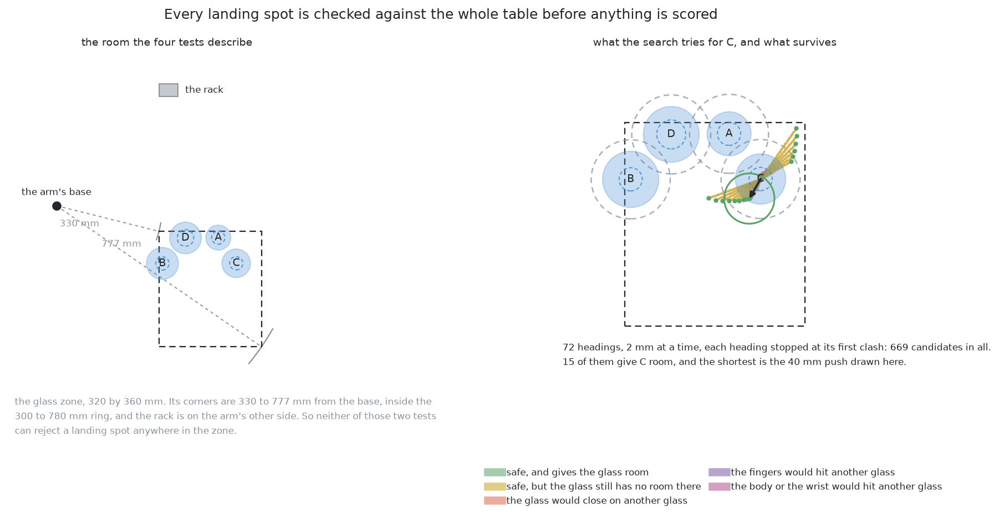
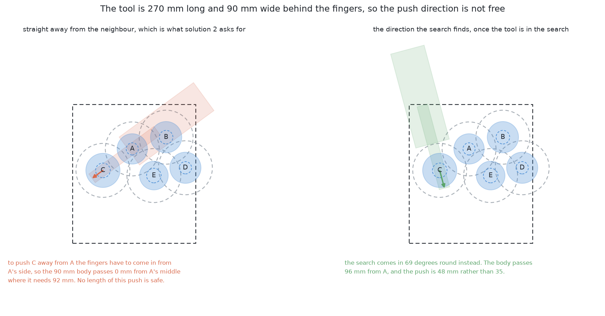
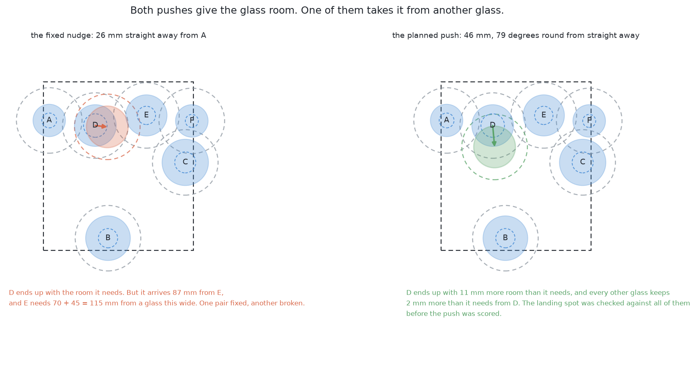
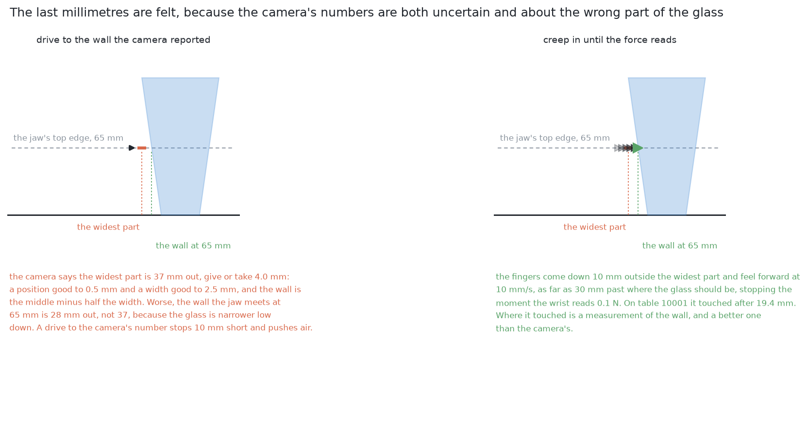
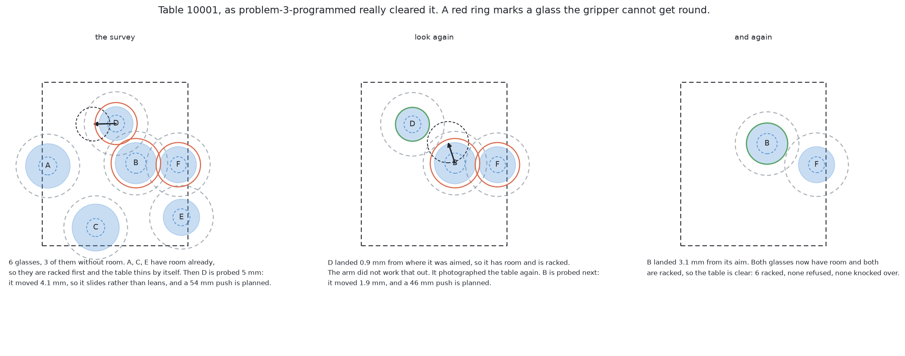
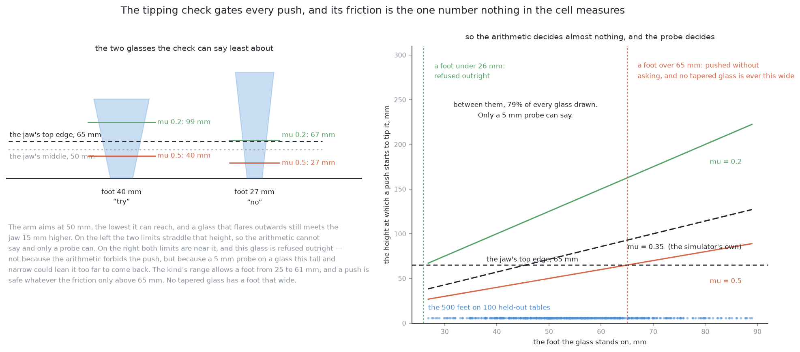
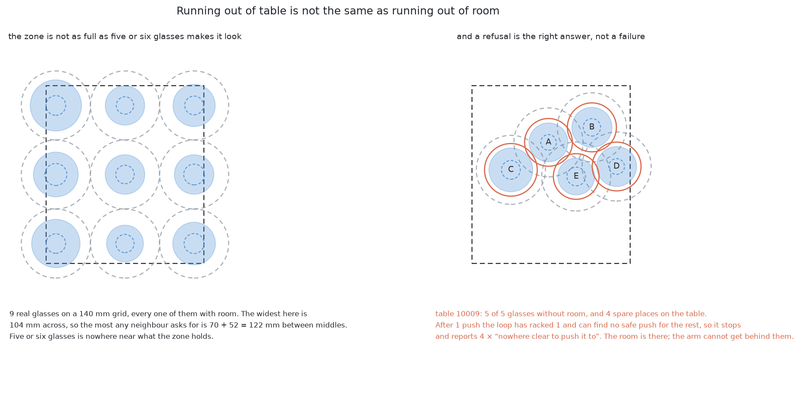

# Solution 3 — plan the destination, feel for the glass, look again

*Programmed, and the core loop. Choose where a glass should end up by checking
the spot against the whole table. Feel for the glass on the way in rather than
driving to where the camera said it was. Push once, then photograph the table
again and compare.*

> **The cell is described once, in [the cell](../../the-cell.md)** — the layout,
> the two places the camera works from, all four sensors, and the words this
> project uses them with. [The problem](../problem.md) says what is being asked
> for. What follows is only what is specific to this solution.

## Introduction

This document explains how the arm moves a glass out of a crowd without
knocking it over, when it cannot predict where the glass will go and cannot
measure the one number that would let it.

It is the longest of the eleven solution documents for two reasons. It is the
one the project chose, so it is the one that has to be right. And it is built:
`problem-3-programmed/plan.py` is this method, and it has been run and scored
against a physics engine on fifty tables it had never seen. So this document
can do something the other ten cannot, which is say what actually happened
rather than what ought to. Where the numbers come from is stated every time.

By the end you will know what a destination has to satisfy before the arm will
push a glass to it, why the shortest push is almost never in the direction that
seems obvious, why the last two centimetres of an approach are felt rather than
driven, and why a method that looks at the result beats a method that predicts
it — even though the prediction, in this simulator, turns out to be accurate to
about a millimetre. That last point is the interesting one, and the reason is
not the one the [solution overview](solution-overview.md) gives.

**Where the numbers in this document come from.** Three places, and each claim
says which.

- **The geometry** is computed by
  [`images/generators/problem-3/make_03_images.py`](../../../images/generators/problem-3/make_03_images.py),
  which draws the pictures below. It contains a copy of the table generator in
  `problem-3-sim/bench.py` and of the planner in `problem-3-programmed/plan.py`,
  written in millimetres instead of metres. The copy exists because `bench.py`
  imports MuJoCo, which the documentation environment does not have. A
  throwaway script run inside `problem-3-programmed`, where MuJoCo is
  available, compared the copy against the real `bench.scene` on eighty seeds
  and found the two produce the same glasses at the same places, to the last
  digit.
- **The physics** — what a push actually did — comes from that same throwaway
  script driving the real `bench.Bench`. One run of it, on table 10001, is
  quoted in full below and is the worked example.
- **The scored result** comes from `problem-3-programmed/results.json`, which
  is the record of the full held-out run of fifty tables.

## The problem this solves

Problem 2 has finished. The arm knows where each glass stands and how wide it
is. Some of those glasses are standing too close together for the gripper to
get round one without fouling its neighbour, and the way out is to drag them
apart across the table rather than lift them, because lifting needs a
measurement that the crowding is what prevents.

Three questions have to be answered before anything moves, and this solution is
the three answers joined together.

**Where should the glass end up?** Not anywhere; somewhere that is clear of
every other glass, inside the part of the table glasses are allowed to stand
on, inside the arm's reach, and reachable without the arm itself hitting
something on the way.

**How does the arm find the glass?** The camera gave a position and a width,
both with error in them, and the arm has to make contact gently. Driving to a
computed point is the way to knock a glass over.

**What does the arm believe afterwards?** Either it predicts where the glass
went, or it looks. This solution looks.

### The room a glass needs is not symmetric

One piece of arithmetic has to be got right before anything else makes sense,
and it is easy to get wrong in a way worth naming, because the wrong version is
the one most people write first.

The open jaw needs about **70 mm of clear room measured out from the middle of
the glass it is closing on**. That number is `GRIP_ROOM` in
`problem-3-sim/bench.py`, and it is half the widest opening plus a finger and a
pad on each side and a little to spare. Clear of *material*, though — not clear
of another glass's middle. So the test for whether a glass at a point can be
gripped is

    for every other glass:  distance  >=  70 mm  +  that other glass's width / 2

and that is `has_room` in `bench.py`, which `plan.py` and the scorer both call.

**The room a glass needs depends on how wide its neighbour is, not on how wide
it is.** Two consequences follow and both matter.

The first is that the test is **not symmetric**. A narrow glass standing beside
a wide one is crowded long before the wide one is crowded by it, because the
narrow glass has to keep clear of a wide obstacle and the wide one only has to
keep clear of a narrow one. A single centre-to-centre threshold cannot express
that, and using one gets the count of crowded glasses wrong in both directions.

The second is that the familiar **140 mm** figure is the symmetric worst case
and nothing more: two glasses of the widest size the cell handles, each needing
70 mm from the other's edge. It is a safe number to quote and the wrong number
to compute with. On one real tapered table the asymmetric thresholds run from
107 mm to 122 mm depending on which neighbour is being cleared, and never reach
140.

This document uses the asymmetric test throughout, because that is what the
code uses.

### What a crowded table actually looks like

`bench.scene(seed)` builds the tables. It draws four, five or six glasses of one
kind at sizes from that kind's own range, stands six out of ten of them
deliberately close to a glass already down — closer than `has_room` allows but
never touching — and scatters the rest. It then throws the whole arrangement
away and starts again unless at least one glass ends up without room, so every
table has something to do.

Over the sixty held-out tables starting at seed 10000, measured by the copy of
that generator in this document's own script:

| | |
| --- | --- |
| tables | 60: twenty of four glasses, twenty of five, twenty of six |
| glasses | 300 |
| without room at the start | 234, which is 78.0 per cent |
| distance between two middles | 57 to 388 mm over 620 pairs, median 160 mm |
| the foot each glass stands on | 27.8 to 88.6 mm, median 53.3 mm |

Read that table as a description of the input, not of the method. The
important line is the third: nearly four glasses in five start out ungrippable.
This is not a problem that arises occasionally.

Of those sixty tables, forty are of the tapered kind, which is the kind every
picture in this document uses. On those, 145 glasses of 201 start without room,
the feet run 26.8 to 59.1 mm, and the closest two middles come within 82 mm.

## The main idea

Three steps, repeated until the table is clear or nothing is left to try.

**Plan the destination.** Treat the table as a map with obstacles on it, and
search it for a spot the glass could be at and be better off at. Check every
spot against the whole table before scoring any of them.

**Feel for the glass.** Do not drive the fingers to where the camera said the
glass's wall is. Bring them in slowly and stop when the wrist force says they
have touched something.

**Look again.** Do not work out where the glass went. Photograph the table,
measure it again, and decide what to do next from that.

The third step is the one that decides whether the method works, and it is
worth being precise about why, because the usual reason given for it is not the reason that
holds up here. It is not that a push in this cell is wildly inaccurate. Over
the 212 pushes of the scored run the glass stopped a **median of 1.0 mm** from
where it was aimed and 3.9 mm from it at worst. The reason is that the things
that go wrong with a push are not errors in its length. They are a glass that
leaned instead of sliding, a glass that was never touched at all, a glass whose
new position takes the room away from a different glass, and a table that has
run out of safe pushes. None of those is a number the planner could have
computed beforehand, and all four are obvious in the next photograph.

## Step one: planning the destination

The left half of that picture is the world the tests describe. The right half is
the search running on one real table.

### The four tests, and which two of them can ever fire

The [overview](solution-overview.md) lists four tests a destination has to pass,
and they are the right four:

1. at least 70 mm of clear room from every other glass's edge;
2. inside the zone the glasses may stand in;
3. inside the arm's comfortable reach;
4. clear of the rack.

Each is a comparison of numbers the arm already holds, which is the whole appeal
of the method: no search over anything unknown, no tuning, and a rejected spot
can always be explained by naming the comparison that rejected it.

What the overview does not say is that **two of the four cannot reject anything,
given the cell's current numbers**. The glass zone runs from 320 to 640 mm in x
and from −80 to −440 mm in y. Its nearest corner is 330 mm from the arm's base
and its furthest is 777 mm, and the comfortable reach is 300 to 780 mm, so every
point of the zone is already inside the ring. The rack sits at positive y, on the
other side of the arm from the zone entirely. So the zone test subsumes both of
them.

That is not an argument for deleting them. The zone and the reach are separate
constants in separate files, `rack/layout.py` and `arm/dimensions.py`, and
either could move without the other. A test that never fires today but would
fire the day somebody widens the zone is worth its three lines. It is an
argument for knowing which of your checks is doing the work, because the two
that are doing the work are the two the overview treats as the easy ones.

### A fifth test the overview does not have: the arm itself

The four tests ask whether the *destination* is a good place for a glass. They
do not ask whether the arm can get the glass there, and that turns out to be the
constraint that decides nearly everything.

`plan.py` checks three swept shapes rather than one, and it checks them at every
length of every push it considers:

- **the glass's own corridor**, from where it stands to where it lands. A glass
  may already be standing closer to a neighbour than the planner's 8 mm
  clearance, so the rule is not "keep 8 mm" but "come no closer than you already
  are, and keep 8 mm if you can";
- **the fingers**, a strip 28 mm thick — two 10 mm fingers and two 4 mm pads —
  running from where the fingertips come down to where they finish;
- **the body and the wrist behind them**, a strip 90 mm wide, starting 120 mm
  behind the fingertips and running back another 150 mm.

Those numbers are the gripper's own, read by `bench.py` out of
`arm/gripper.urdf.xacro`. The tool is 270 mm long in all and 90 mm of it is
three times as wide as the fingers, and all of it sits at the height the push
is made at, so all of it has to miss everything standing on the table.

The reach test appears here too, and here it can fire, because the reach that
matters is the **flange's**, not the fingertips'. The fingertips stand 170 mm
ahead of the flange, so a push that sends the glass to a spot well inside the
ring can still ask the arm to put its wrist outside it.

### Why the obvious direction is the one direction that never works

Take a pair of glasses that are too close, and ask which way to push one of
them. The answer everybody gives, and the answer
[solution 2](02-one-fixed-nudge.md) is built on, is: straight away from the
other one. It is the shortest push that solves the pair, and by a long way.

It is also the one direction the arm cannot use, and the reason is not subtle
once it is said. **To push a glass away from its neighbour, the fingers have to
come in from the neighbour's side.** The push direction and the approach
direction are the same direction. So the arm has to stand 270 mm of tool in a
line that starts at the neighbour and ends at the glass, and the neighbour is
between 57 and 140 mm away.

The left half of the picture above is table 10009. Glass C is 94 mm from glass A
and the fixed nudge would push it straight away from A. The 90 mm body would
then pass **0 mm** from A's middle — straight through it — where the planner
needs 92 mm, which is half the body plus half A's width plus the clearance. No
length of that push is safe, so the whole heading is dead at its first
millimetre.

This is not a corner case. Over the fifty held-out tables, of the **193 glasses
that start without room, not one of them — zero — has any safe push at all in
the direction straight away from its nearest neighbour.** Not a short one, not a
long one, none. The same measurement on a larger sample of 420 crowded glasses
gives the same answer: zero.

What the planner does instead is come in from the side. Over those same tables,
the direction it picks is between 51 and 112 degrees away from straight-away,
with a median of 69 degrees, and **not one of them is less than 51 degrees
round**. In the picture, the chosen heading is 69 degrees round; the
body passes 96 mm from A instead of 0; and the push is 48 mm instead of 35,
which is the price.

Two things follow. The first is that the fixed nudge of
[solution 2](02-one-fixed-nudge.md) is not merely risky in this cell — it is
geometrically impossible, on every crowded glass, before any question of where
it would land. The second is that **the shape of the arm belongs in the search
and not in a check afterwards**. A planner that proposes pushes and then asks
the motion planner whether they can be executed will have every one of its
first choices refused, and will look like a slow, unreliable system that is not
erroring anywhere. The gripping notes call this reordering the commonest
structural mistake in a grasp pipeline, in [bounding the search by the gripper's
own body](https://github.com/RobinNagpal/robotics-basics/blob/main/docs/07_gripping/03_choosing-a-grip.md#7-bounding-the-search-by-the-grippers-own-body),
and it is the same mistake here.

### What each freedom is worth, measured

The planner has three freedoms a fixed nudge does not: it may push either glass
of a crowded pair, it may choose how far, and it may choose which way. It is
worth knowing which of the three is doing the work, because the answer is not
the obvious one.

Here is how that was measured. Take every glass without room on 120 tapered
held-out tables — 420 of them. For each, count a push as **wrong** if any of
seven independent things is true of it: the glass still has no room where it
lands; it takes the room away from a glass that had it; the glass sweeps
through another glass on the way; the tool meets another glass; the landing
spot leaves the glass zone; the push leaves the arm's comfortable reach; or it
puts the glass in the rack. Then allow one freedom at a time and count how
often *some* option is right.

Run it first with **the arm treated as a point**, which is how a push is
normally scored and how every other document in this set scores one. The best
single nudge distance is then 28 mm, and it is still wrong 52.6 per cent of the
time. Short nudges fail by not moving the glass far enough — at 4 mm, 86.2 per
cent of glasses still have no room. Long ones fail by leaving the table: at
120 mm, 56.7 per cent land outside the zone and 26.2 per cent drive the glass
through another glass. At the best distance the failures are spread: 33.6 per
cent still without room, 17.1 per cent outside the zone, 14.3 per cent through
another glass, 9.5 per cent out of reach, and 5.7 per cent taking the room from
a glass that had it.

Worth noting in passing: the overview's own nudge formula, `140 − d + 20`, is
**worse than a flat 28 mm** — wrong 64.8 per cent of the time against 52.6 —
because the symmetric 140 mm makes it overshoot.

Now the ladder. Read each row as: given this much freedom, how often does the
arm have at least one push that is right in every one of the seven ways.

| what the arm is free to choose | right |
| --- | --- |
| nothing: a fixed 28 mm nudge, straight away from the neighbour | 47.4% |
| which glass of the pair to move | 56.4% |
| how far to push | 64.5% |
| both of those | 71.7% |
| **and which direction to push in** | **96.4%** |

**Choosing the direction is worth more than everything else put together.** The
distance, which is the only thing solution 2 computes, is worth 17 points; the
direction is worth another 25 on top of everything. The overview's objection to
the fixed nudge — that it can push a glass into a third glass — is true and
understates the case. The distance was never the difficulty.

Now run the same measurement again with **the arm's own body in the test**, which
is what `plan.py` actually does and what the picture above showed. Every row of
the ladder below the last one collapses to **zero**. Not a single one of the 420
glasses can be freed by any fixed nudge straight away from its neighbour, at any
distance, on either glass of the pair, because the tool has nowhere to stand.
The bottom row falls too, from 96.4 per cent to 55.7 per cent, which is the
honest price of putting a real arm into the arithmetic.

### What the search actually is

`plan.py` tries **72 headings**, five degrees apart, and along each heading it
tries lengths from 2 mm up to 150 mm in 2 mm steps. At each length it applies
the tests above. Two rules make that cheap.

**A heading stops at its first clash.** If the tool fouls a glass when the push
is 40 mm long, it fouls it at 42 mm and at every length beyond, because the
swept shapes only grow. So the first clash ends the heading, and nothing longer
is considered.

**A heading stops as soon as it works.** The moment a length gives the glass
room, with 10 mm to spare, that heading is done. Anything longer along the same
line is a longer push to the same end, and the shortest safe push is the one
worth having, because every millimetre travelled is another millimetre in which
something can be knocked over.

Over the forty tapered tables the search tried 42,529 candidate pushes in all.
The table below says how each of them ended. Read it as a breakdown of one
number — every candidate the search looked at — into the outcome the planner
recorded for it.

| what happened to the candidate | how many | share |
| --- | --- | --- |
| safe, and gives the glass room | 327 | 0.8% |
| safe, but the glass still has no room there | 34,268 | 80.6% |
| the fingers would hit another glass | 3,418 | 8.0% |
| the glass would close on another glass | 2,356 | 5.5% |
| the body or the wrist would hit another glass | 1,930 | 4.5% |
| outside the glass zone | 230 | 0.5% |
| the flange would be outside the comfortable reach | 0 | 0.0% |

Three readings of that table are worth having. **Most candidates are perfectly
safe and simply do not help** — four in five. The search is not mostly a safety
filter; it is mostly a search. **The arm is what rejects almost everything that
is rejected**: 12.5 per cent of candidates die on the fingers or the body,
against 5.5 per cent on the glass's own path and 0.5 per cent on the zone.
**And the reach never fired once**, which is the same finding as before, now
measured rather than argued.

### Choosing among what survives, and what to do when nothing does

Of the pushes that give a glass room, the planner takes **the shortest**. Over
the forty tapered tables the first push it chooses runs from 2 mm to 112 mm,
with a **median of 2 mm**, which is the shortest the search can propose. That is
surprising until you look at the distances: a glass that is 3 mm short of the
room it needs is as crowded as one that is 40 mm short, and on a table of five
or six glasses there is usually one of the former.

When no push frees any glass, the planner does not give up. It falls back on a
second score: the push that most reduces the **shortfall**, which is the total
of how much room every glass on the table is short of, added up. A push that
frees nobody but takes 12 mm off the total leaves the next look with a looser
table to work on. It has to buy at least 10 mm to be worth making. Over the
forty tapered tables the first decision was a freeing push on thirty-eight of
them and a loosening push on the other two.

That fallback is the second of the two places
[`problem-3-programmed/README.md`](../../../problem-3-programmed/README.md)
says the implementation departs from the overview, and it says what it bought:
without it, 107 glasses were left stuck; with it, 50.

### A destination that is clear for the glass being moved is not clear for everyone

The four tests ask whether the *moved* glass will have room where it lands. They
do not ask whether every other glass still has room afterwards, and because the
room test is asymmetric those are different questions. A glass that lands 100 mm
from a narrow neighbour has room from it; the narrow neighbour, which has to
clear a wider obstacle, may not.

Measured over the forty tapered tables, with the push assumed to land where it
was aimed, **11 of 84 pushes — 13.1 per cent — took the room away from a glass
that had it before.** The loop recovers, because it looks again and the newly
crowded glass simply becomes the next one to move, but it costs a push, and it
is a gap in the destination test rather than an accident. Adding the reverse
check to `plan.py` is four lines and it is the clearest small improvement this
document can point at.

What the picture above compares is a different and larger failure, and it is the
one that separates this solution from [solution 2](02-one-fixed-nudge.md). On
table 10013, glass D is crowded by A. The fixed nudge sends D 26 mm straight away
from A, which gives D the room it needs and lands it 87 mm from E, which needs
115 mm from a glass as wide as D. One pair fixed, another broken, and nothing in
the method notices. The planned push takes D 46 mm in a direction 79 degrees
round, and arrives with 11 mm more room than it needs from every other glass on
the table, because the landing spot was compared with all of them before it was
scored.

## Step two: feeling for the glass

### Why the camera's wall is both uncertain and the wrong wall

The arm has to bring the closed fingers up against the side of a glass without
hitting it. It knows where the glass is, roughly. There are two separate reasons
not to drive to that number, and only the first is the one people expect.

**The number is uncertain.** The bench hands the arm what problem 2's perception
would hand it, with problem 2's own measured error on it: a position good to
0.5 mm and a width good to 2.5 mm, each one standard deviation. The wall is the
middle minus half the width, so the two errors add in quadrature and the wall is
good to `hypot(0.5, 1.25) = 1.35 mm`, or about 4.0 mm if you want three standard
deviations of it. Drive to the near end of that and the fingers stop short and
push nothing. Drive to the far end and they arrive at the glass at speed, and
arriving at a tall glass at speed is the failure this whole problem exists to
avoid.

**The number is about the wrong part of the glass.** This is the larger error
and it is not statistical at all. The camera reports the glass's *widest* width,
which on a tapered glass is at the rim. The jaw pushes down at the table, where
the glass is much narrower. On glass D of table 10001 the widest part is 37.3 mm
out from the middle and the wall the jaw's top edge meets is 27.7 mm out, so a
finger driven to the camera's number stops **9.6 mm short of the glass** and
pushes air. No amount of care with the statistics fixes that, because it is not
noise; it is the shape of the object.

### The guarded move, and what it buys beyond safety

So the fingers are not driven. They come down 10 mm outside the widest part —
clear of the glass by construction — and then creep forward at 10 mm/s, as far
as 30 mm past where the glass should be, stopping the instant the wrist's force
sensor reads more than 0.1 N. That threshold is low on purpose: the lightest
glass on the table starts sliding under about a quarter of a newton, and a
threshold above that would push the glass along without ever noticing it was
there.

This is [the guarded move](https://github.com/RobinNagpal/robotics-basics/blob/main/docs/06_object-perception/02_sensors.md#21-what-you-can-actually-do-with-it),
and it is the same pattern the rest of the project uses everywhere it has to
touch something: the rim is not lowered to a computed height, it is lowered
until the rack is felt; the squeeze is not computed and applied, it is guessed
and then corrected by weighing the glass.

It buys two things. The obvious one is that contact is a press rather than a
knock. The less obvious one is that **where the fingers stopped is a
measurement**, and a better one than the camera's, because it was taken by
touching the thing. On table 10001 the fingers found glass D after 19.4 mm of
creeping and glass B after 24.5 mm. Neither number could have been worked out
beforehand.

What it costs is time. The feel run is up to 40 mm at 10 mm/s, so four seconds
of arm motion per push that would otherwise be one. On a task where arm time is
the expensive resource and computation is free, that is the right trade, but it
is a real one.

## Step three: looking again

### Why planar pushing is genuinely unpredictable

The mathematics of pushing a flat-bottomed object across a table is written down
and correct. [Solution 4](04-predict-the-slide.md) sets it out properly. Three
things make it unpredictable here, and they are worth separating, because two of
them are about missing inputs and one is about the phenomenon itself.

**The friction between the glass and the table is not measured.** Nothing in the
cell measures it. It enters both the prediction of how far the glass goes and
the check on whether it slides at all.

**How the glass's weight sits on its base is not measured either, and cannot
be.** A drinking glass's base is usually slightly concave, so the weight rests on
a rim rather than on a disc. Which of those two it is changes the predicted
sideways drift of a 60 mm push by a factor of two — 17 mm against 7 mm, in
solution 4's own arithmetic — and no overhead camera can tell them apart.

**The contact is not a point and the glass rotates as well as slides.** A push
whose line misses the middle of the footprint turns the glass, and the amount it
turns by depends on the same pressure distribution nobody has. Since the glasses
here are round, the turning does not matter in itself; the sideways drift it
causes does.

### Why that argues for looking rather than for predicting better

[Solution 4](04-predict-the-slide.md) takes the same three facts and draws the
opposite conclusion: work harder on the model, and plan a single push that puts
the glass where it should be. It loses, and the honest reason is not the one the
overview gives.

The overview says the prediction would be inaccurate. **In this simulator it is
not.** The pushes in the scored run landed a median of 1.0 mm from their aim and
3.9 mm at worst, over 212 of them. A model with the right inputs would have
predicted them well, and the planner's own 10 mm aiming margin is wider than
the error by a factor of ten.

The reason solution 4 loses is different, and it is about what the prediction
would be *for*. A prediction is only worth having if acting on it is cheaper than
measuring. Here the measurement costs about a second of overhead photography and
the prediction costs two numbers nobody has, so the trade is already poor. But
the decisive point is that **the things that actually go wrong are not errors in
the push's length, and a better push model would not see any of them**:

- a glass that leaned instead of sliding, which is a topple and cannot be undone;
- a glass the fingers never touched, because it was not where the camera said;
- a glass whose new position takes the room away from a different glass, which
  happened on 13 per cent of pushes;
- a table with no safe push left, which is a refusal and not a failure.

Every one of those is plain in the next photograph and invisible to a forward
model. So the argument for looking is not that the prediction would be wrong.
It is that **the prediction would answer a question that is not the one
stopping the run**.

Solution 4's qualitative half survives all of this and is worth keeping: push
through the middle of the footprint, keep the contact inside the friction cone,
and the glass goes roughly straight whatever the pressure distribution is. That
costs nothing and needs none of the missing numbers. What should not survive is the
numerical half, which reports a guessed number to three significant figures.

### What the loop compares, and when it stops

After each push the arm photographs the table again and re-runs problem 2's
measurement over it. Then:

- **any glass not standing** — stop the whole table and report it. Nothing in
  this project stands a glass back up, and the arm does not reach near one lying
  on the table;
- **any glass that now has room** — pick it up and rack it, which takes it off
  the table and leaves more room for the rest. This is
  [solution 1](01-do-not-drag-at-all.md), used as a prefix, and it is why some
  tables need no pushing at all;
- **otherwise** — plan the next push from the arrangement as it now is.

The arm is allowed three pushes on any one glass and fifteen on any one table.
Past either, the glasses still on the table are refused with a reason. The caps
exist because pushes are not independent: freeing one glass can crowd another,
and freeing that one can crowd the first again, and nothing in the loop would
notice the cycle.

Two simplifications have to be admitted about the picture above and about every
loop measurement in this document that is not from `results.json`. The loop as
this document's script runs it assumes **the glass lands where it was aimed**,
which the scored run justifies to within a millimetre but is still an
assumption; and it treats every glass as sliding, because deciding that properly
needs the probe of the next section, and the probe needs physics.

With those two simplifications, over forty tapered tables the loop cleared 29
and refused 11. When it cleared a table it took a mean of 2.24 pushes, a median
of 2, and never more than 4.

## The check that gates every push

### The arithmetic, and the number nobody has

A pushed object either slides or tips over, and which one happens is decided by
how high up it is pushed. Pushing at height `h` on an object standing on a foot
`2a` across, on a table it rubs against with friction `μ`, the object slides
while

    h  <  a / μ

and tips above it. Half the foot over the friction: that is the whole rule, and
every solution in problem 3 has to respect it.

**`μ` is not measured anywhere in this cell**, and the distinction that matters
is not between known and unknown but between two different parties. The
simulator uses `TABLE_FRICTION = 0.35` and it is right there in
`problem-3-sim/bench.py`. **The arm is never told it.** It is ground truth that a
run is scored against, not an input to any decision, and every figure below says
which of the two it assumes. `plan.py` brackets it instead, at 0.2 to 0.5, which
is the range usually quoted for glass on a dry wooden top.

### The height that is pushed is not the height the arm aims at

Here is the part that changes the numbers, and it is easy to miss.

The gripper cannot get below `LOWEST_GRIP`, which is 50 mm above the table,
because below that its own body is through the table. So the arm pushes as low
as it can reach, and the middle of the jaw rides at 50 mm. But **the jaw is
30 mm tall**, so its top edge is at 65 mm. A glass that is wider higher up meets
that top edge first, and every tapered glass is wider higher up by definition.
So the height the tipping rule has to be evaluated at is 65 mm, not 50.
`bench.py` says so in as many words, and `plan.py` uses `JAW_TOP`.

Fifteen millimetres sounds small. The table below says what it does. Read each
row as: of 500 real feet drawn over 100 held-out tables, what share could be
pushed at that height without tipping, if the friction were the value in that
column.

| pushed at | μ = 0.2 | μ = 0.3 | μ = 0.35 | μ = 0.4 | μ = 0.5 |
| --- | --- | --- | --- | --- | --- |
| 50 mm, where the arm aims | 100.0% | 98.6% | 95.2% | 88.8% | 63.6% |
| 65 mm, where a flaring glass is met | 100.0% | 90.6% | 77.0% | 56.6% | 20.6% |

And on 501 feet drawn over 100 tapered tables, which is the kind every picture
here uses:

| pushed at | μ = 0.2 | μ = 0.3 | μ = 0.35 | μ = 0.4 | μ = 0.5 |
| --- | --- | --- | --- | --- | --- |
| 50 mm, where the arm aims | 100.0% | 94.8% | 75.8% | 50.5% | 12.0% |
| 65 mm, where a flaring glass is met | 99.8% | 56.5% | 25.1% | 8.0% | 0.0% |

**So the whole problem either works or collapses on a number nobody has.** At
the low end of the plausible friction range every glass can be pushed. At the
high end none of them can. The mitigation — always push as low as the gripper
can reach — is a mitigation and not a proof, and it is a weaker mitigation than
it looks, because the arm pushes as low as it can and the glass still meets the
jaw 15 mm higher, since the glass flares out over it. That part cannot be
planned around. It is the shape of the object.

### What the check can decide, which is almost nothing

`plan.slides` in `plan.py` answers with one of three words, by putting both ends
of the friction bracket into the rule at 65 mm.

- **"yes"** — it slides even at μ = 0.5, so push it. This needs a foot wider
  than 65 mm.
- **"no"** — it tips even at μ = 0.2, so refuse it. This needs a foot narrower
  than 26 mm.
- **"try"** — the answer depends on the friction, so neither word is available.

The tapered kind's own declared range allows a foot from 24.7 mm to 60.9 mm.
**A tapered glass therefore cannot reach "yes", ever.** Over the forty tapered
tables the verdicts were 199 "try" and 2 "no", and not one "yes". Over 100 tables of all
four kinds they were 396 "try", 103 "yes" and 1 "no".

That is the sharpest statement of what the gate is worth. On four glasses in
five, on the kind this document is about on essentially all of them, **the
arithmetic cannot decide and something else has to.**

### The probe, which is the first of the two departures from the overview

The [overview](solution-overview.md) says to take the pessimistic end of the
bracket and refuse anything that would tip at μ = 0.5. The implementation tried
that and it refused 35 of the first 60 glasses, which is not a working system.
The README records the change and the reason.

What `plan.py` does instead is **push the glass 5 mm and look**. If it moved, it
slid, so it can be pushed properly. If it did not move, it leaned and came back,
so it is refused. This is the same shape as every other decision in the project:
a cheap guess, checked by a measurement, with the measurement deciding — the
pattern the gripping notes call
[the squeeze sequence](https://github.com/RobinNagpal/robotics-basics/blob/main/docs/07_gripping/05_holding-on.md#1-the-squeeze-sequence).

Three details of it are worth having, because each was learned by the thing
failing.

**Five millimetres, not three.** The first version probed 3 mm and wrongly
refused 24 glasses. The reason is that the first half to two and a half
millimetres of any push is lost before the glass moves at all, taken up by the
contact settling and the glass rocking onto its far edge — up to 6 mm on a thin
stem. A 3 mm probe is inside the noise. A 5 mm one is not, and the threshold for
"it moved" is 1.5 mm.

**Three looks averaged, before and after.** A single position reading is good to
0.5 mm, and the question being asked is whether the glass moved about 1.5 mm.
Averaging three brings the noise on the comparison to about 0.4 mm, which leaves
the decision comfortable.

**The probe is only made when it is safe to make.** Before probing, `plan.py`
works out how far a 5 mm push at 65 mm could lean the glass, and how far the
glass would have to lean to pass its balance point — which needs the height of
its centre of mass, taken as two thirds of its own height, a bound the project's
family tests check. The probe is made only if the first is under 70 per cent of
the second. That is why the narrow glass in the picture above is refused
outright rather than probed: not because the arithmetic forbids the push, but
because the test that would settle the question is itself too dangerous on a
glass that tall and that narrow.

### What the probe costs

Pushes. In the scored run, 212 pushes were made and 92 of them were 5 mm probes.
Nearly half the arm's pushing was spent finding out whether a glass slides.
That is the price of not knowing `μ`, and it is what
[solution 9](09-identify-the-contact-parameters.md) would remove: estimate the
friction once from the pushes the arm is making anyway, and the gate starts
deciding things again.

## Running out of table, and what a refusal means

It would be natural to think that five glasses each needing 140 mm of
separation in a zone 320 by 360 mm is close to what fits, and that six may not
be solvable at all. **That is not so, and the picture above shows why.** Nine glasses fit in the zone on a 140 mm grid with every one of
them having room, and 140 mm is the symmetric worst case — the widest glass in
that picture is 104 mm across, so the most any neighbour actually asks for is
122 mm between middles. Five or six glasses is nowhere near full.

The loop still gets stuck, and the right half of the picture is why. On table
10009 there are five glasses, all five without room, and four spare places on the
table. After one push the arm has racked one glass and can find no safe push for
any of the other four, so it stops and reports four refusals, all of them
"nowhere clear to push it to". **The room is there. The arm cannot get behind
them.** That is the same finding as the tool corridor, arriving as an outcome
rather than as a count.

This is worth being clear about, because it changes what "unsolvable" means. The
constraint is not the area of the table. It is that moving a glass out of a tight
group needs the arm to stand somewhere, and in a tight group there is nowhere to
stand. A run of the real thing on table 10009 ends the same way: one glass
racked, four refused with that reason.

A refusal is a result. The scored run refused 52 glasses of 251, every one of
them for that reason, and got **zero wrong**: nothing toppled, nothing pushed out
of the zone, nothing picked up that did not really have room. Fifteen of the
fifty tables finished incomplete. That is the shape of answer this project wants:
the arm stops and says which glasses it could not separate and why, rather than
trying anyway.

## A worked example

This is table 10001, run by `problem-3-programmed` against the real physics. The
numbers are the simulator's own record, not a reconstruction.

Six tapered glasses are on the table. Their sizes, as the spawner drew them:

| glass | widest | foot | height |
| --- | --- | --- | --- |
| A | 98.0 mm | 39.6 mm | 139.9 mm |
| B | 90.8 mm | 44.6 mm | 171.3 mm |
| C | 103.7 mm | 39.9 mm | 108.7 mm |
| D | 74.6 mm | 37.0 mm | 132.7 mm |
| E | 80.1 mm | 37.5 mm | 211.0 mm |
| F | 79.7 mm | 35.2 mm | 197.5 mm |

Read the widths against the room test: a glass standing next to C has to keep
`70 + 103.7/2 = 121.9 mm` from it, and a glass standing next to D only has to
keep `70 + 74.6/2 = 107.3 mm`. Three of the six start without room.

**The survey, and the three glasses that cost nothing.** A, C and E already have
room. They are
picked up and racked before anything is pushed, and the table is now three
glasses instead of six. This is [solution 1](01-do-not-drag-at-all.md) doing its
work: every glass racked is a glass that is nobody's neighbour any more.

**D is chosen.** Of the three still standing, the shortest safe push that frees
a glass is a 54 mm push on D.

**D is probed first.** D's foot is 37.0 mm, so half of it over the low end of
the friction bracket is `18.5 / 0.2 = 92 mm`, above the jaw's top edge, and over
the high end it is `18.5 / 0.5 = 37 mm`, below it. The rule cannot decide, so
the verdict is "try". The arm pushes D five millimetres and looks. **It moved
4.08 mm**, which is well past the 1.5 mm threshold, so D slides rather than
leans and the real push is allowed.

**D is pushed.** The fingers come down 10 mm outside D's widest part and creep
forward. They meet the glass after **19.4 mm**, which is where D's wall really
is at 65 mm above the table and not where the camera's widest-width reading
would have put it. The push travels 54 mm. The peak force the wrist reads is
**0.95 N**, which is the whole of what it takes to slide a glass of this size.

**The arm looks again.** D has landed at (432.1, −172.3) mm, which is **0.95 mm**
from where it was aimed. It now has room, so it is picked up and racked. Two
glasses left.

**B is probed and pushed.** B's foot is 44.6 mm, the widest on the table, and it
is still a "try". The probe moves it **1.93 mm** — past the threshold, but not by
much, which is exactly the case the 3 mm probe used to get wrong. The push is
46 mm, contact comes after 24.5 mm of creeping, the peak force is 1.82 N, and B
lands **3.11 mm** from its aim, the worst miss of the two.

**The arm looks again.** B and F both have room now. Both are racked. The table
is clear: **six racked, none refused, none knocked over, two pushes and two
probes.**

One detail of that run is worth stopping on. The arm never once computed where a
glass would end up. It computed where a glass *should* end up, felt its way to
the glass, pushed, and then asked the camera what had happened. The two pushes
happened to land within 1 mm and 3 mm of their aims, and **nothing in the method
depended on that being true.**

## What it needs

Nothing the cell does not have.

**From problem 2**, a position and two widths per glass, with error on them.
That is what `bench.look()` hands over and it is all the planner ever sees.

**From the arm**, the wrist force-torque sensor to feel contact and the
gripper's own dimensions to plan around. Both were already in the cell and the
force sensor is already used by problem 1's set-down.

**From the motion planner**, straight-line Cartesian moves, which
`compute_cartesian_path` already provides.

**New code**, which is `plan.py` at 232 lines: the tipping check, the
probe, the search over headings and lengths with the three swept shapes in it,
the shortfall score, and the comparison after the push. There is no model file,
no training set, no graphics card, and no number that had to be tuned until the
tests passed.

## Where the idea comes from

None of the three pieces was invented here, and each has a name worth knowing.

**Singulation** is the name the manipulation literature gives to the whole job:
separating objects that are touching or crowded so that they can be picked up one
at a time. It is the word to search for, and most of the published work on it is
about cluttered bins rather than tables, which is why most of it reaches for
learning where this does not.

**Prehensile and non-prehensile manipulation** is the distinction underneath the
choice to push at all. A prehensile action holds the object; a non-prehensile one
moves it without holding it — pushing, toppling, rolling, throwing. The reason
this problem exists is that the prehensile action is unavailable until the
non-prehensile one has been done.

**The guarded move** is the oldest idea here by a long way. It is standard in
assembly robotics and predates most of the rest of this project's machinery: move
until a sensor says stop, rather than move to a computed place. Its cousin is
**compliant motion**, where the arm stays in contact and lets the contact steer
it. This solution uses the first and not the second.

**Sense-plan-act, and why this is not that.** The classical robot architecture
takes a picture, plans the whole job, and executes the plan. What this solution
does instead is plan one step, act, and sense again — which in the mobile robot
literature is the distinction between an open-loop plan and a **closed loop**,
and in manipulation is sometimes called **interleaved planning and execution**.
The whole argument of this document is about which of those two a push belongs
in.

**Quasi-static planar pushing** is the theory this solution declines to use
numerically, and [solution 4](04-predict-the-slide.md) covers it properly:
Mason's voting theorem for which way a pushed object rotates, the limit surface
of Goyal, Ruina and Papadopoulos for how a loaded object moves, Howe and
Cutkosky's ellipsoidal approximation of it, and Lynch and Mason on stable
pushing. The qualitative results are used here — push through the middle of a
round footprint and it goes roughly straight — and the quantitative ones are not,
for the reason given above.

**The tipping condition** `h < a / μ` is elementary statics and appears in every
mechanics textbook as the block-on-an-incline problem turned on its side. Its
appearance here is unusual only in that one of its two inputs is missing, which
is the ordinary condition of a real robot and the abnormal condition of a
textbook.

## Where it is strong and where it breaks

### What it is good at

**It needs no number nobody has, except in one place, and it says so.** The
friction appears in the tipping check and nowhere else. It is not in the search,
not in the aim, and not in the comparison afterwards.

**It refuses honestly.** A glass with nowhere clear to push it to, or one that
leans when it is probed, produces a sentence in the report rather than an
attempt. The scored run refused 52 glasses of 251 and got none of them wrong.

**It degrades gently.** A push that falls short is a push that gets repeated,
because the loop compares rather than assumes. Nothing depends on the first push
being right, which is why the aim error being 1.0 mm rather than 10 mm changes
nothing about whether the method works.

**Every number in it can be printed.** A rejected destination can always be
attributed to one comparison. That is how the table of 42,529 candidates in this
document was produced at all, and a system that cannot produce such a table is a
system whose failures you will be guessing at.

**It puts the arm's own shape in the search rather than after it.** Measured,
that is 12.5 per cent of all candidates rejected by the fingers or the body, and
zero of 193 crowded glasses pushable in the direction that looks obvious. A
planner that checked afterwards would propose the impossible push first, every
time.

### Where it breaks

**The gate rests on two inputs it cannot check, and both are wrong in the same
direction.** This is the most serious thing in this document and it deserves its
own arithmetic. Take 400 drawn tapered glasses. An arm that guesses μ = 0.3 and
applies the tipping rule at the 50 mm the jaw *aims* at declares **379 of the
400 safe to push**. Now score those 379 against the truth: the simulator's own
friction of 0.35, and the 65 mm at which a flaring glass really meets the jaw.
**282 of them go over.** That is 74 per cent of the glasses the check allowed,
and 70 per cent of the whole population, toppled by a check that looked correct
and printed a number.

The two errors compound rather than cancel. An optimistic friction raises the
height at which tipping is believed to start, and taking the contact at the
jaw's middle understates how high the push really is. Neither announces itself.
A run that toppled a glass because the check was wrong looks exactly like a run
that toppled one for any other reason, and the check prints the same confident
number either way.

The implementation avoids both errors — it uses 65 mm and it brackets the
friction — which is why the scored run toppled nothing. But avoiding them left
the check unable to decide anything, which is what the probe is for. **So the
safety of this solution rests on a five-millimetre experiment, not on the
arithmetic.** And a probe answers a narrower question than the one being asked:
it says how the glass *starts* to move, not what a 54 mm push will do to it. On
100 further tables beyond the scored fifty, that difference showed up exactly
once: a tapered glass passed its probe and then tipped about 40 mm into the real
push. The README reports it and leaves it, which is the right call and not a
comfortable one.

That is the single clearest argument for the two solutions the overview puts
next in line. [Solution 9](09-identify-the-contact-parameters.md) would replace
the guessed friction with an estimate and an interval, so the gate could decide
things again. [Solution 8](08-a-learned-early-abort.md) would watch the force
during the push and stop it, which is the only thing in the whole document that
can *prevent* a topple rather than report one.

**Pushing as low as possible is partly defeated by the shape of the glass.** The
arm already pushes as low as it can reach and the contact is still 15 mm higher,
because the glass flares out over the jaw. There is no planner change that
recovers those 15 mm. A thinner jaw would, and that is a purchase order.

**The destination test is one-sided.** It checks that the moved glass will have
room and not that everyone else keeps theirs, and because the room test is
asymmetric those differ. Measured: 13.1 per cent of pushes take the room away
from a glass that had it. The loop recovers at the cost of a push.

**It does not plan ahead.** Each destination is chosen against the arrangement
as it stands, so a sequence of individually sensible pushes can end with nothing
left to try. The caps — three pushes per glass, fifteen per table — are what stop
that becoming a loop rather than a report, and they are arbitrary numbers.

**It is slow.** Every push costs a full survey afterwards, and half the pushes
are probes. The scored run spent 212 pushes on 251 glasses, and 90 of those were
repeats on a glass that had already been pushed once.

**It can be stuck with the room right there.** Four glasses of table 10009 were
refused with free table all around them, because the arm could not get behind
any of them. More free space does not help; only a smaller tool would.

**Nothing measures the glass's weight before touching it.** The arm presses an
object of unknown mass. In the simulator that is harmless, and the peak forces
observed were under 2 N. On a real table a heavy glass resists and a light one
skates.

## Where it sits among the other solutions

**It is chosen, and it is chosen second.** [Solution
1](01-do-not-drag-at-all.md) runs first, on every pass of the loop, because
every glass racked is a glass off the table and touching a glass is the only
step that can topple one. On table 10001 that alone removed half the work before
any push was planned. Solution 1 is a prefix to this method and not an
alternative to it.

**It replaces [solution 2](02-one-fixed-nudge.md) outright,** and the reason is
stronger than the overview claims. The overview says a fixed nudge can push a
glass into a third glass, which is true and was measured: with the arm treated
as a point, the best fixed nudge is wrong 52.6 per cent of the time, and the
freedom that fixes that is the **direction**, not the distance. But the fatal
objection is the other one. The nudge pushes straight away from the neighbour,
and **not one of 420 crowded glasses has any safe push in that direction at
all**, because that is where the arm would have to stand. The baseline is not
risky. It is impossible.

**It declines [solution 4](04-predict-the-slide.md)'s numerical half and keeps
its qualitative half.** Push through the middle of a round footprint; do not
predict where the glass stops.

**It is what every learned solution here is bolted onto.** [Solution
5](05-a-learned-residual-on-the-push-model.md) learns the error in a push model
this solution does not use. [Solution
6](06-geometry-generates-a-model-ranks.md) reorders the candidates this
solution's search generates, and would have 42,529 of them to rank on forty
tables. [Solution 7](07-a-learned-change-verifier.md) replaces the geometric
comparison this solution makes after each push, which is the first learned thing
worth adding because that comparison is the part most likely to be quietly
wrong. [Solution 8](08-a-learned-early-abort.md) watches the force during the
push that this solution's gate authorised.
[Solution 9](09-identify-the-contact-parameters.md) supplies the friction the
gate is missing, from the pushes this solution is already making.
[Solution 10](10-learn-a-forward-model-then-plan.md) would replace the whole
planning step with a learned model of the table, and
[solution 11](11-search-a-push-strategy.md) would tune this solution's own
constants — the 8 mm clearance, the 10 mm aiming margin, the 5 mm probe — by
searching over them, inside the vetoes, which is the cheapest way to find out
whether they are anywhere near right.

Read as a whole, the ordering is one argument: **do the free thing, then the
geometric thing, then measure which failure you actually have before adding
anything learned to fix it.** This document is the middle term, and the measured
case for it is that it cleared 35 of 50 tables and racked 199 of 251 glasses
without knocking a single one over, using no model, no training data and no
number that was tuned rather than derived.

---

← [The problem](../problem.md) ·
[Problem 2, where the crowding was first seen](../../problem-2/problem.md) ·
[All eleven solutions](solution-overview.md) ·
[Solution 4 — predict the slide](04-predict-the-slide.md) →
