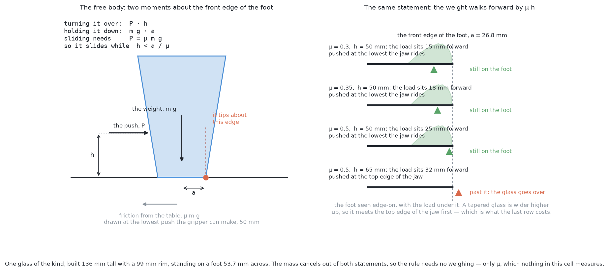
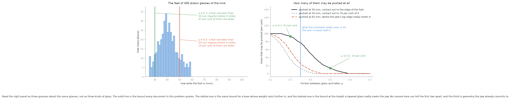
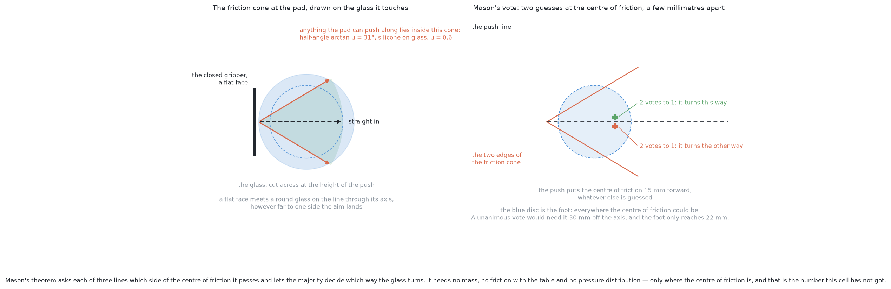
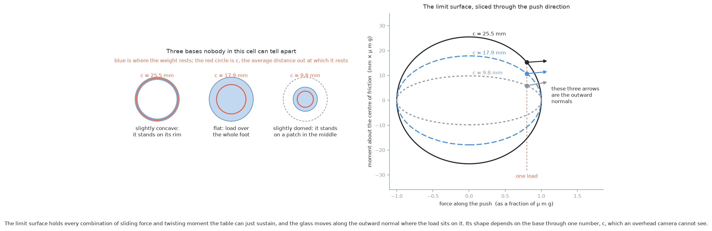
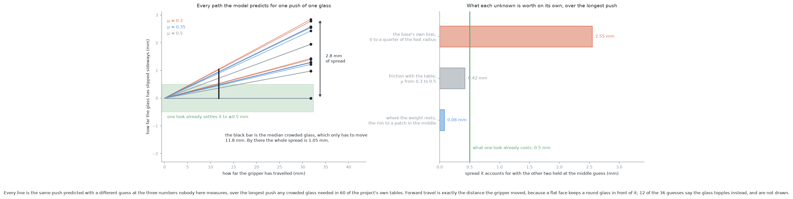
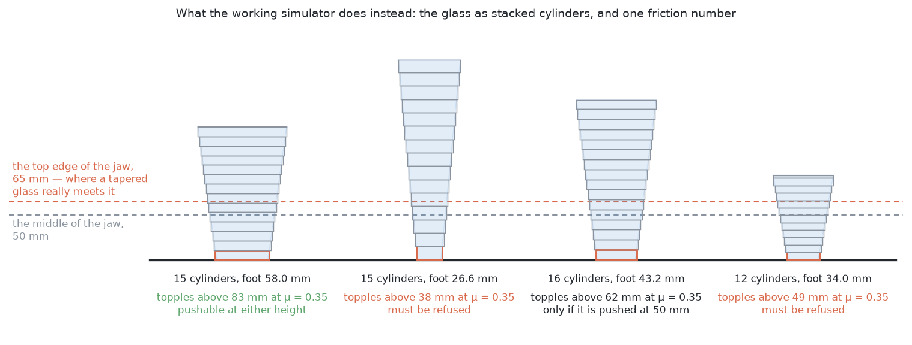

# Solution 4 — predict the slide with pushing mechanics

*Programmed, and open loop. Use the classical theory of planar pushing to work
out in advance where the glass will end up, and plan a single push that puts it
there.*

> **The cell is described once, in [the cell](../../the-cell.md)** — the layout,
> the two places the camera works from, all four sensors, and the words this
> project uses them with. [The problem](../problem.md) says what is being asked
> for. What follows is only what is specific to this solution.

## Introduction

This document explains the mechanics of pushing a flat-bottomed object across a
table, and then explains why this cell cannot use the half of that mechanics
which produces numbers.

It is the document the rest of problem 3 leans on for its arithmetic. Every
other solution quotes the rule that a pushed glass slides while the push height
is below `a / μ`, where `a` is half the width of its foot and `μ` is the
friction between the glass and the table. This is the document that derives
that rule, shows what it does to four hundred glasses of the kind, and says
exactly which of its inputs the cell has and which it has not.

By the end you will understand where `h < a / μ` comes from and why the glass's
mass drops out of it; what the friction cone, the limit surface and the centre
of friction are, in ordinary words; what Matthew Mason's voting theorem gives
you for free and what it still demands; and why a numerical prediction of where
a pushed glass lands is, in this cell, worth less than the photograph it would
replace.

The verdict at the end is *correct theory, missing inputs*, and the point of the
document is to reach that verdict by measurement rather than by assertion. The
measurement produces one surprise. The missing inputs turn out to cost very
little where everybody expects them to cost a lot — in the predicted landing
place — and a great deal where the overview did not press: in deciding whether
the glass may be touched at all.

Throughout, "the glass" means one of the tapered kind, because that is the kind
problem 3's own tables are built from. Nothing in the mechanics is specific to
glassware.

## The problem this solves

[The problem](../problem.md) asks for every glass on the table to end up with
enough clear room around it to be gripped, without anything being knocked over.
The only tool available is a push with the closed gripper.

A push raises two separate questions, and it is worth keeping them apart from
the first paragraph, because this document's conclusion is that the theory
answers one of them well and the other badly.

The first question is **may I push this glass at all?** A pushed object either
slides or tips over. Tipping cannot be undone: a toppled glass is out of the
run, and a broken one leaves shards the arm will go on moving through. So every
push has to be cleared before it is made.

The second question is **where will it end up?** If you could answer that, you
could plan one push that carries the glass to a clear spot, make it, and go on
to the next glass without looking again. That is the prize. A look from the
survey view costs seconds of arm time, which is by far the most expensive
resource in this cell, and [solution 3](03-plan-feel-look-again.md) spends one
after every single push.

Classical pushing mechanics claims to answer both. It is not a heuristic; it is
a small set of theorems with proofs, and they are correct. The whole of this
document's objection is about what you have to feed them.

## The words, first

Four terms, each explained where it first matters and then used.

**Quasi-static** means slow enough that momentum does not matter. Push a glass
and stop; it stops when you stop, rather than coasting on. At every instant the
forces therefore balance, which turns a differential equation into algebra. The
project's own bench pushes at 20 millimetres a second, and at that speed the
assumption holds comfortably.

**The friction cone at a contact** is the set of directions in which a finger
can push a surface without skidding across it. The surface can only push back
along its own normal, and friction can add at most `μ` times that sideways, so
the force the contact can carry lies inside a cone whose half-angle is
`arctan(μ)` about the normal. The pads here are silicone on glass, for which
the project uses 0.6, and that gives a half-angle of **31.0 degrees** either
side. The same idea, in more detail, is in [friction cones and the antipodal
test](https://github.com/RobinNagpal/robotics-basics/blob/main/docs/07_gripping/03_choosing-a-grip.md#3-friction-cones-and-the-antipodal-test).

**The centre of friction** is the point on the table about which a sliding
object's friction produces no twist. For an object sliding without turning, the
friction on every little patch of its foot pulls the same way, so the resultant
passes through the *centre of the load* — the point you would balance the
pressure distribution on. That point is the centre of friction. It is not the
middle of the glass, it is not what the camera measures, and this document's
main argument is about the difference.

**The limit surface** is the part nobody meets elsewhere, and it gets its own
section below. In one sentence: it is the boundary of the set of horizontal
forces and twisting moments the table can sustain before the glass starts to
slide, and its decisive property is that the glass's motion is perpendicular to
it.

## Where `h < a / μ` comes from

This is the one piece of arithmetic every solution in problem 3 shares, so it is
worth deriving rather than quoting.

The glass in that picture is not a rectangle standing in for a glass. It is
built by the project's own builder from proportions inside the tapered kind's
declared range: **136 mm tall, a 99 mm rim, standing on a foot 53.7 mm across**,
and weighing 244 grams as the project's own shell sum computes it.

### The free body

Four forces act on a glass being pushed. Its weight, `m g`, acts down through
the middle. The table pushes up with the same total, `m g`, spread somehow over
the foot. The finger pushes sideways with `P` at height `h`. Friction from the
table resists, at table level.

While the glass is sliding rather than sticking, the friction is as large as it
can be, so the push has to supply exactly that much:

    P = μ m g

Now take moments about the **front edge of the foot** — the edge the glass would
tip over. The friction acts at table level, through that edge, so it contributes
nothing. That leaves two terms:

    turning it over:   P · h
    holding it down:   m g · a

where `a` is half the width of the foot. Substitute `P = μ m g` and the mass
appears on both sides and cancels:

    μ m g h  <  m g a        →        h  <  a / μ

**The mass cancels.** That is worth pausing on, because the arm never weighs a
glass before touching it. The rule needs the width of the foot, which problem 2
measures, and `μ`, which nothing in this cell measures — and nothing else.

### The same statement, read the other way round

The right-hand panel says the same thing in a form that will matter later.

Ask where the table's upward force acts. It is the only thing available to
cancel the push's moment, so it cannot act through the middle of the foot: it
has to sit forward of it, towards the direction of the push. Take moments about
the middle of the foot instead of the front edge and the answer falls out
immediately. The upward force is the whole weight, so its centre has to be

    μ h

forward of the middle. The mass cancels again.

So the effect of a push is to walk the load forward across the foot by `μ h`
millimetres, and the glass goes over when that walk reaches the front edge —
which is the same condition as before, `μ h = a`. The two statements are one
statement.

Three things follow, and all three are used later in this document.

The walk is **large**. On the worked glass, half the foot is 26.8 mm, and at
`μ = 0.3` a push at 50 mm puts the load 15 mm forward — over half way to the
edge. At `μ = 0.5` it is 25 mm forward, 1.5 mm short of tipping.

The walk **depends on `μ`**, and so the centre of friction is not a property of
the glass alone. It moves when the push starts, by an amount nobody here knows.

The walk is stopped by **the front of the contact, not the front of the foot**.
If the glass is not touching the table right out to the edge of its own base —
because the base is slightly domed, say — then it goes over sooner than `a / μ`
says. That is the first of the rule's two hidden assumptions, and section
[what the rule does to four hundred glasses](#what-the-rule-does-to-four-hundred-glasses)
measures how wide it is.

### The height the push is really made at

There is a detail here that the reference implementation gets right and a
first reading of the rule gets wrong.

`problem-3-sim/bench.py` builds the closed jaw as a box 28 mm wide and 30 mm
tall, with its middle at the lowest height the gripper can reach, 50 mm. So the
face that meets the glass runs from 35 to 65 mm. A tapered glass is **wider
higher up**, so it touches the top edge of that face first, and bench's own
constant says so in as many words: `JAW_TOP`, not `PUSH_HEIGHT`, is how high the
glass is really pushed.

That is 65 mm rather than 50, and it costs a great deal. The section after next
puts numbers on it.

## What the rule does to four hundred glasses

The rule is a statement about one glass. To see what it means for the cell, run
it over the whole kind.

The left panel is the feet of four hundred tapered glasses drawn by the
project's own spawner. They run from **25.5 to 59.1 mm across, with a median of
40.2 mm**. Nothing in that range is written down anywhere; the spawner draws a
rim and a base fraction for each glass from the kind's declared ranges, and this
is what comes out.

Rearranging `h < a / μ` for a push at the lowest height the gripper reaches, a
glass may be pushed only if its foot is wider than `2 μ h`. The right panel is
that condition, swept across `μ`.

The table below is the headline result, and it is the number the rest of problem
3 quotes. Read each row as: if the friction between glass and table really were
this, then this share of the kind could be pushed at all, and the rest would
have to be refused.

| friction with the table | the foot has to be wider than | share that may be pushed |
| --- | --- | --- |
| `μ` = 0.3 | 30 mm | **93 per cent** |
| `μ` = 0.35 | 35 mm | 77 per cent |
| `μ` = 0.5 | 50 mm | **14 per cent** |

Those two ends are the argument. Across a friction bracket nobody in this cell
can narrow, the number of glasses the arm is permitted to touch swings from
almost all of them to almost none. Put the other way round: each glass has a
friction value at which it stops being pushable, and over these four hundred
glasses that value runs from **0.26 to 0.59, with a median of 0.40** — right
through the middle of the plausible range.

The dashed lines in the right panel are the two ways the solid line is
optimistic.

**A base that does not touch out to its own edge tips sooner.** The load walks
forward until it reaches the front of the *contact*. If the contact only reaches
70 per cent of the way out, the bound is 70 per cent as generous. At `μ` = 0.3
that takes the pushable share from 93 per cent down to 65 per cent; at `μ` = 0.5
it takes 14 per cent down to none at all.

**The jaw meets a tapered glass 15 mm higher than its middle rides.** At the
real contact height of 65 mm, the shares become 56 per cent at `μ` = 0.3, 25 per
cent at 0.35, and **none at all** at 0.5.

There is a third erosion that is not drawn, because it is an error bar rather
than a line. The foot width that the rule takes as its input is itself measured.
`bench.py` models problem 2's handover as carrying 2.5 mm of width error, one
standard deviation, which at `μ` = 0.35 is **3.6 mm on the topple height**.

### The one number the simulator does know

It is important not to muddle two different friction numbers, and this is the
place to separate them.

`problem-3-sim/bench.py` sets `TABLE_FRICTION = 0.35`. That is ground truth: it
is what the physics engine uses when it decides whether a glass slides or goes
over, and it is what a run is scored against. **The arm is never told it.**
Nothing in the cell measures friction, so every decision the arm makes has to be
made on a guess, and the guess is then graded against 0.35.

So when this document says 0.35, it means the answer. When it says "0.3 to 0.5",
it means the width of the arm's ignorance. Replacing the second with an estimate
and an interval is exactly what
[solution 9](09-identify-the-contact-parameters.md) is for, and it is the reason
that solution matters more than its modest description suggests.

## The friction cone, and what it buys

The left panel is the cone at the pad, drawn on a cut across the glass at the
height the push is made. Anything the pad can push along lies inside it, with a
half-angle of 31.0 degrees. Push outside the cone and the pad skids across the
glass instead of carrying it.

One thing in that panel is not obvious and turns out to matter more than the
cone does. **A flat face meets a round glass on the line through the glass's
axis, however far to one side the aim lands.** The point of a circle whose
outward normal points back along the face is always the point nearest the face,
and that point lies on the centre line. Aim 10 mm off and the contact does not
move 10 mm; it does not move at all. The jaw's face is 28 mm wide, so the
property holds until the aim is 14 mm out, and problem 2 hands over positions
good to half a millimetre.

The consequence is a small but real correction to the way the overview describes
this solution. Aiming error does **not** put a moment arm on the push. Something
else does, and it is not measurable.

## Mason's voting theorem

The right-hand panel is the classical result about which way a pushed object
turns.

Matthew Mason's 1986 paper proves that the sense of rotation is decided by a
vote among three lines, all drawn through the contact: the **line of pushing**,
along the direction the finger moves, and the **two edges of the friction cone**
there. Each line passes to one side of the centre of friction and votes
accordingly. The majority wins.

What makes the result valuable is what it does not need. No mass. No friction
between glass and table. No pressure distribution under the foot. Three lines
and one point, and the answer is a sign.

It is also the classical answer to the obvious alternative, which is to guess.
Push an object off its middle and most people's first instinct — that it follows
the finger — is simply wrong; it turns, and the theorem says which way without
any of the numbers a simulation would demand.

### The peg-and-slot picture

The theorem is easier to hold on to with a picture of what is happening
underneath it.

At any instant, a rigid object sliding on a table is turning about exactly one
point of the table. Think of that point as a peg driven through the object into
the table. For that instant the object can only rotate about the peg, the way a
plate with a pin through it can only rotate about the pin. If you knew where the
peg was you would know the whole motion — which way the object goes and how fast it
turns — because everything else follows from the geometry.

The peg's position depends on all the numbers nobody has. Mason's theorem is the
statement that you do not need it. Whichever side of the centre of friction the
force line passes, the peg lies on the other side, and that fixes the sense of
the turn. The two cone edges are in the vote because the direction of the
contact force inside the cone is itself unknown, and testing the extremes covers
every case in between.

### What it still demands

The vote needs one thing, and this cell has not got it: **where the centre of
friction is.**

For a flat face on a round glass the push line passes through the glass's axis,
so the vote turns entirely on which side of that line the centre of the load
falls. That is a few millimetres of base geometry. A pressed glass base stands
on three high spots; the three unit vectors to them add to nothing, so if one
spot carries twice its share the centre of the load lands a **quarter of the
foot's radius** off the axis — 6.71 mm on the worked glass. Nothing in this cell
can see it, and the sign of the answer flips with it.

The usual defence of the voting theorem is that when all three lines agree the
answer is certain however badly everything else is guessed. That defence does
not apply to this geometry. A unanimous vote here needs the centre
of friction to sit **30.0 mm** off the axis at `μ` = 0.3, and the foot only
reaches **22.2 mm** at the place the push puts the load. At `μ` = 0.5 it needs
36.0 mm against 9.7 mm. Unanimity is not merely unlikely; it is geometrically
impossible for this glass, at both ends of the friction bracket. Every vote here
is 2 to 1, and every vote here can be flipped by a millimetre of unmeasured
base.

## The limit surface

The vote gives a sign. To get a magnitude you need the limit surface, which is
the part of the theory that does the real work and the part that needs the real
numbers.

Take a space with three axes: the two components of horizontal force on the
glass, and the twisting moment about its centre of friction. Some combinations
of force and moment the table can absorb without the glass moving. Push harder
and it slides. The boundary between the two is a closed surface around the
origin, and that is **the limit surface**.

Its decisive property, established by Suresh Goyal, Andy Ruina and Jim
Papadopoulos in the early 1990s, is that **the glass's motion is along the
outward normal to the surface at the point where the load sits**. That is what
makes the surface useful rather than merely descriptive: it says not only
whether the glass moves but exactly how the motion divides between sliding and
turning.

The exact surface has no closed form for most pressure distributions. In
practice people use Robert Howe and Mark Cutkosky's ellipsoidal approximation,
which replaces it with an ellipsoid and reduces everything to a line of algebra:
the glass slides parallel to the force, and turns at `moment / c²` times its
sliding speed.

### What `c` is

That single number `c` is the whole of what the limit surface needs to know
about the base. It is a length, and it has a plain meaning: **the average
distance from the centre of friction at which the weight rests.**

The left panel of the picture is three bases, all the same width, all of them
ordinary. Under each is the value of `c` computed from its load, for the worked
glass's foot:

| how the base sits on the table | `c` |
| --- | --- |
| slightly concave, standing on its rim | 25.5 mm |
| flat, load over the whole foot | 17.9 mm |
| slightly domed, standing on a patch in the middle | 9.8 mm |

Read that table as three guesses about one glass rather than three kinds of
glass. All three are plausible for a pressed drinking glass, the widest and the
narrowest differ by a **factor of 2.6**, and no camera in this cell can tell
them apart, because they differ only in which parts of a flat-looking disc are
carrying load.

The right panel shows what that does. Three glasses, three ellipses, one
load — and three different outward normals, which is to say three different
mixtures of sliding and turning from the same push.

### The motion cone, and stable pushing

One more classical result is worth naming, because it is the reason the pushes
in this document behave as predictably as they do.

For a given contact there is a cone of push directions for which the finger
**sticks** to the object and the object moves rigidly with it. Push outside that
cone and the finger slides across the object's surface instead. Kevin Lynch and
Matthew Mason built *stable pushing* on this: keep the contact sticking and the
object is, for the duration of the push, effectively part of the arm.

Across every push simulated for this document — thirty-six combinations of the
unknowns — **the pad never skidded once**. A 28 mm flat face pressed against a
round glass with a silicone pad is deep inside its motion cone. That is good
news for the method, and it is the reason the numbers in the next section come
out as small as they do.

## Putting it together: what the model actually predicts

With those pieces the prediction is mechanical. Give it a glass, a push height,
a friction value, a guess at how the weight rests on the base and a guess at
where the centre of the load sits, and it returns where the glass ends up.

The pushes in this document are integrated rather than drawn as arcs. At each
step the pusher's velocity is known, the contact is required to stick, and the
limit surface's normality rule turns that into the glass's sliding and turning
rate; the glass is advanced and the geometry recomputed. The pad's friction cone
is checked every step, so a skid would show up rather than being assumed away.

Two results come out of that before any unknown is varied, and both are worth
stating because they are the parts of the prediction that are actually solid.

**Forward travel is exact.** Over every one of the thirty-six predictions, the
glass's axis advanced **31.800 mm** against a commanded 31.8 mm — not
approximately, exactly. A flat face keeps a round glass directly in front of it,
so however much the glass turns or drifts, the distance it travels along the
push is the distance the gripper travelled. Nothing needs to be predicted here
at all; it is geometry.

**The glass turns towards the push line.** Over the longest push, the centre of
friction's offset from the push line fell from 6.71 mm to 6.68 mm. So the glass
does rotate in the direction that reduces the offset. But a thirtieth of a
millimetre over 32 mm of travel is far too slow to be of any use.

So the only thing left in doubt is the sideways drift, and that is what the
sweep measures.

## A worked example

### The glass, and the push it is asked to make

The glass is the middle one of the **54** glasses, out of four hundred drawn,
that pass the tipping test even at the grippy end of the friction bracket. It
has to be one of those, because a glass that may not be pushed at all is a glass
with nothing to predict. It is 136.2 mm tall, its rim is 98.6 mm across, it
stands on a foot 53.7 mm wide, and it weighs 244 grams.

At `μ` = 0.3 it topples above 89.4 mm, which leaves 39.4 mm of headroom over the
lowest push. At `μ` = 0.5 it topples above 53.7 mm, which leaves **3.7 mm**.
The same glass, the same gripper, and a safety margin that is either
comfortable or almost gone depending on a number nobody has.

How far does it have to go? Not far, and this is the measurement that most
changes the shape of the argument.

The project's own crowded tables were built by `scene(seed)` in
`problem-3-sim/bench.py` for the sixty tapered-kind seeds below 400. Across
those sixty tables, **210 of 300 glasses lack the room to be gripped**. For each
one, the distance it has to travel to gain that room is how far the nearest
offending neighbour's edge reaches inside the 70 mm the open jaw needs. The
median is **11.8 mm** and the worst in sixty tables is **31.8 mm**.

One detail of that room test is easy to get wrong and worth stating, because it
changes which glass is crowded. The test is **not symmetric**. A glass needs
clearance from its neighbour's *edge*, so the room it needs depends on how wide
the neighbour is, not on how wide it is. Against the widest tapered glass the
middles have to be 122.5 mm apart; against the narrowest, 102.5 mm. A narrow
glass standing beside a wide one is crowded while the wide one beside it is not.

### The three numbers nobody measures

The sweep varies exactly three things, and each one is a thing the arm cannot
find out.

**Friction with the table**, from 0.3 to 0.5. It decides whether the push is
legal at all, and it moves the centre of the load forward by `μ h`.

**Where the weight rests on the base**, from a rim-supported base through a flat
one to a domed one standing on the inner 55 per cent. It sets `c`, and it also
sets how far the load can walk before the glass goes over.

**The base's own sideways bias**, from zero to a quarter of the foot's radius,
which is 6.71 mm. This is the offset between the glass's axis, which the camera
measures, and the centre of the load, which decides the mechanics. The bracket
is a derivation from an assumed imbalance — one of three supports carrying twice
its share — and not a measurement, and this document does not pretend otherwise.

### The sweep

Twelve of the thirty-six guesses say the glass topples rather than slides. The
other twenty-four are drawn, and the results are these.

Read the table as the whole quantity of doubt the three missing numbers inject
into one push, at the two push distances the cell actually asks for.

| | over the longest push, 31.8 mm | over the typical push, 11.8 mm |
| --- | --- | --- |
| forward travel | exact | exact |
| sideways drift, across every guess | 0 to 2.85 mm | spread of 1.05 mm |
| largest turn | 4.7° | 1.7° |
| what one look already gives | ±0.5 mm | ±0.5 mm |

And the right-hand panel separates the three unknowns by holding two of them at
a middle guess and sweeping the third, over the longest push:

| the unknown | what it is worth, sideways |
| --- | --- |
| the base's sideways bias | 2.55 mm |
| friction with the table | 0.42 mm |
| where the weight rests on the base | 0.08 mm |

### What the sweep says

Three conclusions, and the third is the one that decides the verdict.

**The prediction of the landing place is not worth having, but not by much.**
The spread is 2.85 mm over the longest push in sixty tables and 1.05 mm over the
typical one. Against the ±0.5 mm a single overhead look already gives, that is
5.7 times wider at the worst and 2.1 times at the typical. It is a loss, and it
is a small one. Anybody who expected the missing numbers to ruin the trajectory
by a centimetre was wrong; a first estimate of this, made before the integration
was written, put the drift at 7 to 17 mm and was an order of magnitude out.

**The pressure distribution barely touches the trajectory.** Eight hundredths of
a millimetre, over a range of `c` that spans a factor of 2.6. The reason is the
flat pusher. The contact sits 35 mm out from the axis, and that lever arm is
larger than `c` by enough that `c` hardly enters the result, so the glass is
held straight by the geometry of the face rather than by anything about its
base. That is the opposite of what the overview predicted, and it is the most
useful thing the simulation turned up.

**What the missing numbers really cost is permission.** A third of the guesses
say the glass goes over. That is not a 2.85 mm error in a landing place; it is
the difference between a push and a broken glass, and it is decided by the same
friction figure and the same pressure distribution that turned out to be almost
irrelevant to the trajectory. Across the whole kind the same swing appears as
93 per cent of glasses pushable against 14 per cent.

So the theory is not wrong and its numerical half is not even very inaccurate.
It is that the cell is asking the model the easy question and the model needs
the numbers for the hard one.

## What the working simulator does instead

The most useful evidence about what you do when the limit surface needs numbers
nobody has is not an argument. It is the fact that somebody on this project
already had to answer it, in code that runs.

`problem-3-sim/bench.py` is a working MuJoCo model of exactly this push, and its
choices are worth reading as answers.

**It picks one friction number rather than a pressure distribution.**
`TABLE_FRICTION = 0.35`, one figure for every glass on every table. There is no
`c`, no support ring, no centre-of-load offset. The engine's contact solver works
out the distribution for itself from the geometry, and the geometry is where the
modelling effort went instead.

**It models the glass as a stack of cylinders.** `slices()` cuts the outline
into cylinders, each as wide as the glass is at its widest anywhere inside it,
so the collision shape is never thinner than the glass. The four glasses above
come out as 12 to 16 cylinders each. The docstring is explicit about the one
that matters: the bottom cylinder is the foot, "the edge a glass tips over". The
tipping rule this document derived is, in the simulator, a property of one
cylinder's radius.

**It puts the push height where the hardware puts it**, at the lowest the
gripper reaches, and then records separately that a tapered glass meets the top
edge of the jaw 15 mm higher.

**It feels rather than computes.** The jaw comes down, creeps forward at 10 mm a
second until the force passes a tenth of a newton, then pushes at 20 mm a second
and stops if the force passes 20 newtons. Nothing about the glass's position is
trusted at the last millimetre.

That is the engineering answer in full: **put the effort into the shape and the
contact solver, keep one honest friction number, and feel for the glass instead
of predicting it.** It is not a rejection of the theory in this document. The
theory is what tells you which cylinder's radius to care about and why the push
height decides everything. It is a rejection of the theory's *numerical* half,
by somebody who had to make it work.

The one thing worth flagging about that model is that a cylinder standing on a
plane touches it around the edge of its flat end. So the support the engine
resolves sits at the rim of the foot — the most generous of the three bases in
the limit-surface picture, and the one that tips latest. A real glass with a
slightly domed base would go over sooner than this bench says.

## What it needs

Four inputs, and the cell has one and a half of them.

**The friction cone at the pad.** Silicone on glass, 0.6, which the grip rules
already use. This input exists.

**Straight-line execution and a known contact.** `arm/motion.py` already calls
MoveIt's `compute_cartesian_path`, which gives the first, and the simulator
supplies the second with friction numbers that are plausible rather than
measured. Call this half an input.

**`μ` between glass and table.** Not measured anywhere in this cell. Needed for
the tipping bound, for the force the push has to supply, and for how far forward
the load walks.

**The pressure distribution over the base.** The real one. Uniform,
rim-supported, three high spots — all plausible, none visible from an overhead
camera, and the last of them decides which way the vote goes.

There is a fifth input the model does not need and it is worth saying so,
because it is the one people expect it to need. **It does not need the glass's
mass.** The mass cancels out of the tipping rule and out of the load's forward
walk. It is needed only to say how hard to push, and there the spread is real:
over both ends of the friction bracket and the whole range of drawn glasses, the
force a push has to supply runs from **0.30 to 2.01 newtons**, a factor of 6.7.
That matters for a force threshold, not for a trajectory.

## Where the idea comes from

Six pieces of published work, and what each one buys.

### Mason, 1986 — the mechanics of pushing

Matthew Mason, *Mechanics and Planning of Manipulator Pushing Operations*, The
International Journal of Robotics Research, 1986. This is the paper that made
pushing a subject rather than a trick, and it contains the voting theorem.

What it buys is a **qualitative answer that survives ignorance**. It tells you
the sense of the rotation from three lines and a point, with no mass, no
friction coefficient and no pressure distribution. What it costs is that it
gives you a sign and nothing else, and that it still needs the centre of
friction — which, as measured above, is precisely the thing this cell cannot
supply.

### Goyal, Ruina and Papadopoulos — the limit surface

Suresh Goyal, Andy Ruina and Jim Papadopoulos, *Planar sliding with dry
friction*, Wear, 1991. This is where the limit surface is put on a proper
footing, including the normality property that makes it predictive rather than
merely descriptive.

What it buys is **the step from a sign to a magnitude**. What it costs is that
the surface is defined by the pressure distribution, so using it means committing
to one.

### Howe and Cutkosky — the ellipsoidal approximation

Robert Howe and Mark Cutkosky, *Practical Force-Motion Models for Sliding
Manipulation*, The International Journal of Robotics Research, 1996.

What it buys is **tractability**: the exact limit surface becomes an ellipsoid,
the normality rule becomes a line of algebra, and the whole base collapses into
the single length `c`. What it costs is an approximation error that nobody in
this cell is in a position to notice, because it is far smaller than the error in
`c` itself.

### Lynch and Mason — stable pushing

Kevin Lynch and Matthew Mason, *Stable Pushing: Mechanics, Controllability, and
Planning*, The International Journal of Robotics Research, 1996.

What it buys is **the motion cone**, and with it the design rule that a push kept
inside that cone carries the object rigidly. That is why a wide flat face is the
right pusher and a single fingertip is not, and it is why no push simulated for
this document skidded.

### Yu, Bauza, Fazeli and Rodriguez — the objection, measured

*[More than a Million Ways to Be Pushed: A High-Fidelity Experimental Dataset of
Planar Pushing](https://arxiv.org/abs/1604.04038)*, presented at the
International Conference on Intelligent Robots and Systems in 2016, with the
data at
[mcube.mit.edu/push-dataset](https://mcube.mit.edu/push-dataset/). A million
recorded pushes of real objects across real surfaces, varying the surface
material, the object's shape, the contact position, the direction, the speed and
the acceleration.

What it buys is **this document's objection as a measurement rather than an
argument**: real outcomes scatter more than the deterministic theory predicts,
and the scatter does not go away when you look harder. What it costs is that it
is a dataset of somebody else's objects on somebody else's surfaces, which is
why it informs this document rather than feeding a model in it.

### Bauza and Rodriguez — predicting the scatter instead of the mean

*[A probabilistic data-driven model for planar
pushing](https://arxiv.org/abs/1704.03033)*, presented at the International
Conference on Robotics and Automation in 2017. The follow-up, which
fits a model that returns a distribution rather than a point, and finds it beats
the analytical model on under a hundred samples.

What it buys is the **right shape of answer** for a problem like this one: a
prediction that comes with its own spread, so a planner can ask whether the
spread is small enough to act on. What it costs is training data from the thing
you are going to push — which is exactly what
[solution 5](05-a-learned-residual-on-the-push-model.md) proposes to collect for
free, and exactly what this solution has none of.

### Tools

[Drake](https://drake.mit.edu/) models quasi-static planar pushing directly and
is the right thing to reach for if you want this theory as a library rather than
as a page of algebra. MuJoCo, which this project's own bench uses, will simulate
the contact with whatever coefficients you supply, and with an elliptic friction
cone that is the same idea as the one drawn above.

## Where it is strong and where it breaks

The strengths are real and they are not the ones usually claimed for it.

**It produces the safety rule the whole problem runs on.** `h < a / μ` is this
theory, and every other solution in problem 3 uses it. The derivation is four
lines and the mass cancels, which is why the arm can apply it to a glass it has
never weighed.

**It identifies pushes that are safe by geometry.** A flat face on a round glass
travels exactly as far as the gripper does, whatever the base is doing
underneath. That conclusion needs none of the missing numbers, and it is why the
forward half of a push needs no prediction at all.

**It is free.** Arithmetic, no search, no simulation, milliseconds. And it
explains its answers, which a learned forward model cannot.

**It degrades honestly in one direction.** The voting theorem gives a sign, and a
sign is cheap to act on conservatively.

The weaknesses divide into what it assumes, what it needs and where it stops.

**What it assumes** is a rigid object on a flat table, sliding rather than
rocking or rolling. A glass with a slightly convex base rocks, and a rocking
glass is outside the model entirely. A wet ring under a glass is outside it too,
and a drying rack is where wet glasses are guaranteed.

**What it needs** is two numbers nobody here has, and the measurement above says
which of the two hurts. The pressure distribution costs almost nothing in the
trajectory and a great deal in the tipping decision. `μ` costs half a millimetre
in the trajectory and the difference between 93 per cent and 14 per cent in the
tipping decision. Both of the expensive costs land on the one failure that
cannot be undone.

**Where it stops** is at the point where a measurement is available and cheap. It
predicts the landing place to about 1 mm over a typical push; a photograph
settles it to half that, and the photograph also catches the four things the
model cannot represent at all — a glass that was knocked by a neighbour, a glass
that rocked instead of sliding, a contact made on the wrong object, and a glass
that went over.

**How it fails** is the last thing to name, and it fails quietly. A planner built
on this returns "the glass finishes 32 mm along the push line and 2 mm to the
left", and the 2 mm is a guessed base printed to two figures. The run acts on
it, does not look, and finds out later. Worse, the same planner returns "this
push is safe" from a guessed `μ`, and that one does not get found out later; it
gets found out immediately and permanently.

## Where it sits among the other solutions

This document is the arithmetic the rest of problem 3 stands on, and then it
declines to be a solution.

[Solutions 1](01-do-not-drag-at-all.md),
[2](02-one-fixed-nudge.md) and [3](03-plan-feel-look-again.md) all use the
tipping rule derived here, and all three then push and look rather than
predicting. [Solution 3](03-plan-feel-look-again.md) is the direct comparison:
it plans the destination geometrically, feels for the glass with a guarded move,
and takes a fresh overhead look afterwards. The measurement in this document is
the justification for that choice. A look costs about a second and returns half
a millimetre; the prediction costs nothing and returns one to three, and it
cannot see a topple at all.

[Solution 5](05-a-learned-residual-on-the-push-model.md) is the natural repair.
It keeps this document's mathematics and learns only the error the physics
makes. What the sweep above says about it is that its target is small — a couple
of millimetres of drift — so the residual it learns will be small too. Its value
is more likely to lie in catching the cases where this model is qualitatively
wrong than in improving its arithmetic.

[Solution 9](09-identify-the-contact-parameters.md) is the repair that matters
more, and this document is its argument. It estimates `μ` from the pushes the
arm makes anyway and hands back an interval. Feed the pessimistic end of that
interval into `h < a / μ` and the tipping check stops being a guess. That is the
only entry in problem 3 that improves a **safety** decision rather than a
performance one, and the 93-against-14 swing measured here is the size of the
prize.

[Solution 10](10-learn-a-forward-model-then-plan.md) is this solution with the
physics replaced by a fitted model, and
[solution 11](11-search-a-push-strategy.md) skips the model and searches the
strategy directly. Both inherit the finding that the forward half of a push
needs no model at all.

The verifiers, [solution 7](07-a-learned-change-verifier.md) and
[solution 8](08-a-learned-early-abort.md), are what this document's failure mode
argues for. If the prediction cannot tell you whether a glass is about to go
over, something that watches the force during the push can, and that is the only
thing in problem 3 that can prevent a topple rather than report one.

Finally, [solution 6](06-geometry-generates-a-model-ranks.md) is the one this
solution has least to say to. It ranks candidate pushes that the geometry has
already vetoed the unsafe half of, and the vetoing is this document's arithmetic
doing its one reliable job.

The honest position, stated once: **keep the qualitative half of this theory and
drop the numerical half.** Push as low as the gripper can reach, always, rather
than at the computed limit. Push through the middle of the footprint, because a
flat face on a round glass is straight under every pressure distribution. Keep
the contact inside the pad's friction cone, which a flat face on a round glass
is by a wide margin. Then look. What this solution should not do is print a guessed base to two
figures and call the result a prediction.

---

← [The problem](../problem.md) · [Solution overview](solution-overview.md) ·
[Solution 3 — plan, feel, look again](03-plan-feel-look-again.md) ·
[Solution 5 — a learned residual](05-a-learned-residual-on-the-push-model.md) →
