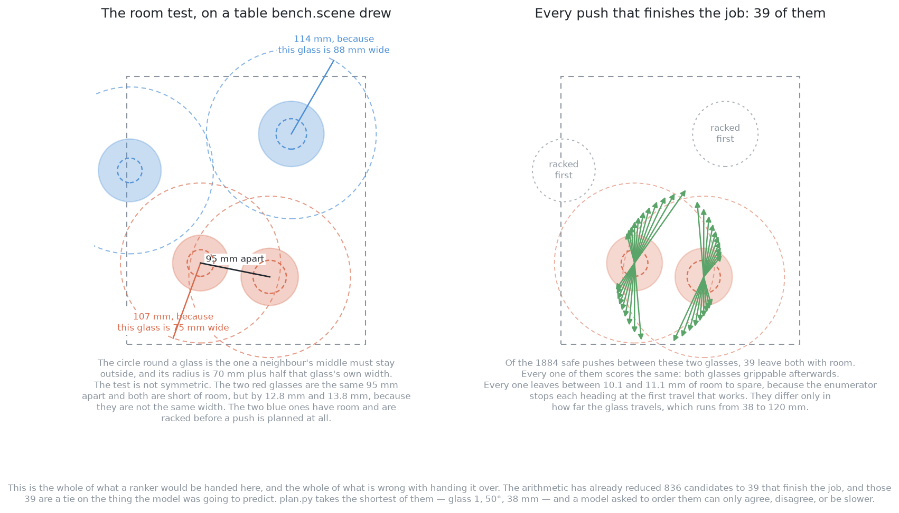
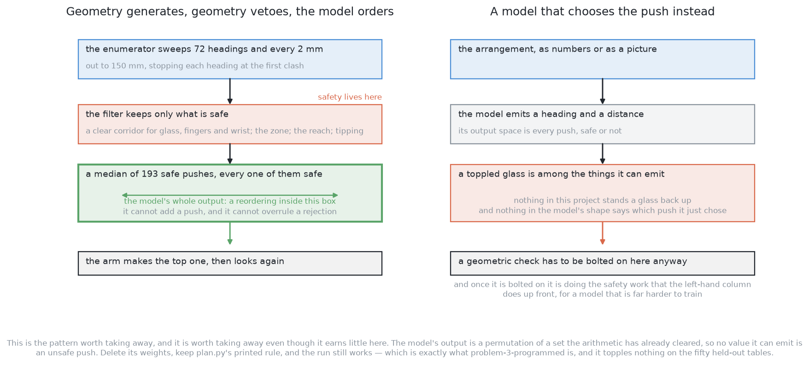
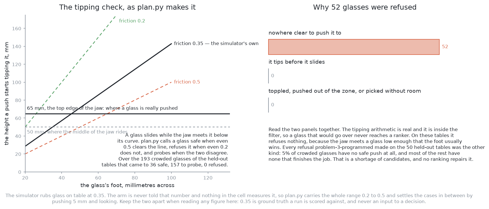
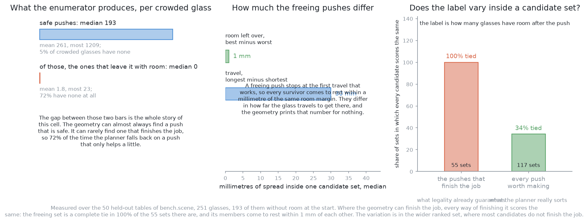
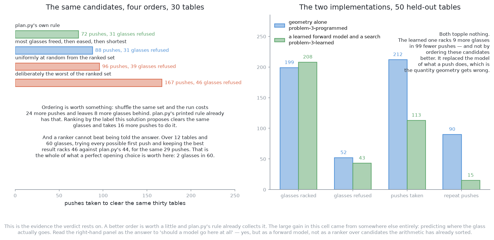

# Solution 6 — geometry generates, a model ranks

*Hybrid, with the model as a ranker. The planner writes down every safe push
and vetoes the unsafe ones; a learned model only decides which of the survivors
to try first. A bad ranking costs an extra push and can never cost a toppled
glass.*

> **The cell is described once, in [the cell](../../the-cell.md)** — the table,
> the arm, the glass zone, the gripper, and the words this project uses them
> with. What follows is only what is specific to this solution.

## Introduction

This document explains the safest way there is to put a learned component into a
machine that can break something, and then measures how much that particular
component would be worth in this particular cell. The two halves of that
sentence disagree with each other, and both of them are the point.

The pattern is called **generate, veto, then rank**. Arithmetic writes down
every action that is allowed. Arithmetic then throws away the ones that are not.
A model that has been fitted to data is handed whatever survives, and its only
job is to put that list in order. The arm does the first one on the list. The
model cannot add an action, and it cannot overrule a rejection, so the worst a
wrong prediction can do is waste one attempt. In a cell where a toppled glass
cannot be picked up again by anything in this project, that property is worth a
great deal.

Then there is the measurement, and this solution is unusually easy to measure
because **half of it is already written**. This repository holds a reference
implementation of problem 3: `problem-3-sim/bench.py` supplies the crowded
tables and the physics, and `problem-3-programmed/plan.py` enumerates the
candidate pushes and ranks them with a printed rule. That enumerator is exactly
the "geometry generates" half of this solution. So the question — would a
learned ranker earn its place here — can be answered by measuring the candidate
sets that code really produces, and by reordering them.

Three measurements decide it, and they point the same way.

**Where the geometry can finish the job, every way of finishing it scores the
same.** Over the fifty held-out tables there are 55 crowded glasses with at
least one push that leaves them with room. In **100% of those 55 sets** every
candidate leaves the same number of glasses grippable, and they come to rest
within **1 mm** of each other. That is not a coincidence; it follows from how
the enumerator works, and the section below shows why.

**Most of the time the geometry cannot finish the job at all.** 71.5% of crowded
glasses have no push that gives them room, and the planner falls back on pushes
that only help a little. Those do differ from one another, so there is real
signal in the wider set a ranker would be handed.

**But reordering that set buys almost nothing.** Carrying the run forward on
thirty tables, plan.py's printed rule clears 119 glasses in 72 pushes; a ranker
that scores candidates by the label this solution proposes clears exactly the
same glasses and takes 16 more pushes; a random order costs 24 more pushes and
leaves 8 more glasses behind. And an oracle told the best possible first push in
advance racks 46 glasses where plan.py racks 44, out of 60.

So the verdict is: safe, and worth little here. By the end you will understand
why the pattern is right, why this cell is the wrong place to spend it, exactly
which measurement would have to come out differently for the answer to change,
and what the same repository shows is worth building instead.

There is one general lesson worth carrying away even if you never build this.
**A ranker earns its place only when the thing that separates a good candidate
from a bad one cannot be computed from what you already know.** In
[problem 2](../../problem-2/solutions/06-learn-which-viewpoints-pay-off.md) it
could not be: whether a photograph would split an ambiguous pair depended on the
photograph, which did not exist yet. Here it can be, because the value of a push
is decided by where the glass ends up, and the geometry computes that before the
arm moves.

## The problem this solves

[Problem 3](../problem.md) hands the arm a table with four to six glasses on it,
some of them standing too close together for the gripper to get round one
without fouling its neighbour. The arm has to drag them apart. It may not lift
them, because lifting needs a measured profile, and measuring needs a clear
side-on view, which is exactly what the crowding has taken away.

A push therefore needs three things decided: which glass to move, in which
direction, and how far. The purely geometric answer is
[solution 3](03-plan-feel-look-again.md), which is what `problem-3-programmed`
implements. It enumerates the pushes, throws away the ones that fail its tests,
takes the shortest of what is left, pushes, looks again, and repeats.

This solution changes exactly one step. The planner is asked for **every** safe
push rather than the best one, and a learned model puts the survivors in order.
Everything else — the tests, the refusals, the re-survey, the loop — stays as it
is.

The complaint it is aimed at is not safety. `problem-3-programmed` toppled
nothing at all on the fifty held-out tables. The complaint is the number of
pushes: it took 212 of them for 251 glasses, and 90 of those were repeat pushes
of a glass it had already moved once.

### The room test is not symmetric, and this matters

The left-hand panel above is the test everything else here depends on, drawn on
a table `bench.scene` produced. It is worth reading slowly, because the obvious
version of it is wrong.

A gripper needs clear room round a glass before its jaw can close. The project
writes that as `has_room` in `bench.py`, and the rule is: a glass can be gripped
when every **other** glass's middle is at least `GRIP_ROOM` away plus **half of
that other glass's width**, with `GRIP_ROOM` fixed at 70 mm.

So the circle drawn round a glass in that picture is the one a *neighbour's*
middle has to stay outside, and its radius depends on how wide **that** glass
is, not on how wide the neighbour is. A wide glass pushes its neighbours further
away than a narrow one does. In the table drawn, the widest glass is 88 mm
across and keeps neighbours 114 mm away; the narrowest is 75 mm across and keeps
them 107 mm away.

**The test is therefore asymmetric.** The two red glasses in that picture stand
the same 95 mm apart, and both are short of room, but one is short by 12.8 mm
and the other by 13.8 mm, because they are not the same width. A single
centre-to-centre threshold gets that backwards, and gets the count of crowded
glasses wrong.

Across the fifty held-out tables this test finds **193 of 251 glasses crowded at
the start**, which is 77% of them. The closest pair anywhere in that population
stands 57 mm apart.

## The main idea: generate, veto, then order

The two columns above are the same job done two ways, and the difference is
which component holds the power to choose an unsafe action.

On the left, the enumerator writes down every push it can. The filter throws
away the ones that would drag the glass through a neighbour, swing the fingers
or the wrist into one, leave the zone, leave the arm's reach, or tip the glass
over. A median of 193 survive per crowded glass, and every one of them is safe.
The model's entire output is a reordering of those survivors. It cannot add one,
and it cannot bring back one the filter rejected.

On the right, the model reads the arrangement and emits a heading and a
distance. Its output space is every push there is, safe or not. Nothing in the
shape of the model says which of the two it just emitted, so a geometric check
has to be bolted on after it. Once that check is bolted on, it is doing exactly
the safety work the left-hand column does up front, for a model that is far
harder to train.

That is the whole argument for the pattern, and it is worth stating as a rule
rather than as an implementation detail: **everything that can reject a push is
arithmetic, and the model comes after all of it.** The model is never asked
about safety, so it cannot cause an unsafe movement.

The contrast that matters is with **reinforcement learning**, which is the
obvious alternative and is written up in
[learning with hardware](learned-with-hardware.md). Reinforcement learning fits
a policy — a function from the state of the world straight to the action — by
letting it act, scoring the result with a number called a reward, and adjusting
it towards whatever scored well. A policy has no field in it for "never topple a
glass", so safety has to arrive through the reward, usually as a fine for
toppling. A fine is a price, and a price is something an optimiser may decide to
pay. Here the output is a permutation of a set that is already safe, and no
value the model can emit is an unsafe push.

What the pattern costs is a ceiling. The model can only order what the
enumerator handed it. If the sweep is too coarse, or if one of the tests rejects
something that was in fact fine, no amount of training recovers it. The quality
of the answer is the enumerator's, not the model's.

## What the geometry proposes

The enumerator in `plan.py` is more thorough than a first guess at this problem
would be, and its exact shape is what produces the result this document turns
on.

It sweeps **72 headings**, one every 5°. Along each heading it steps the travel
out in **2 mm steps to 150 mm**. At every step it checks four things: that the
moving glass's own path clears every other glass, that the swept path of the
fingers clears them, that the swept path of the wrist and the gripper body
clears them, and that the destination is inside the glass zone and inside the
arm's reach. The first step that fails ends that heading, because every clash
found at one length is still there at any longer one.

Two properties of that loop matter later.

**It stops each heading at the first travel that gives the glass room.** Once a
push works, no longer push along the same heading is offered. So there is at
most one job-finishing push per heading, and it is the shortest one.

**It keeps the pushes that do not finish the job.** A push that leaves the glass
still crowded, but less crowded than it was, is kept as long as it cuts the
table's total shortfall of room by at least 10 mm. `plan.py` calls the first
kind freeing and uses the second only when there is no freeing push anywhere.

The counts that come out of this are large. Over the 193 crowded glasses of the
held-out tables, a crowded glass has a **median of 193 safe pushes**, a mean of
261, and as many as 1209. Only 5.2% have none at all.

## What the filter removes before the model is asked

One of those tests deserves its own section, because it is the one that can
cause the unrecoverable failure, and because the height it is evaluated at is
easy to get wrong.

A pushed object either slides along the table or tips over, and which one
happens is decided by how high up it is pushed. Push at height `h` on an object
whose foot is `2a` across, standing on a table it rubs against with friction
`μ`, and it slides while

    h  <  a / μ

and tips above that. `μ` is the **coefficient of friction**, a single number
saying how hard one surface resists sliding on another.

**The height is 65 mm, not 50 mm, and that is not a rounding difference.** The
middle of the jaw rides at `LOWEST_GRIP`, 50 mm above the table, because below
that the gripper body is through the table. But the jaw is a finger tall, so its
top edge is 15 mm higher, and a glass that is wider higher up meets that top
edge first. Every tapered glass is wider higher up, by definition. `bench.py`
records this as `JAW_TOP` and says so plainly: this, not the middle of the jaw,
is how high a glass is really pushed.

The difference is large. Over 400 glasses drawn from the tapered kind's range,
the share that slides rather than tips goes as follows. Read each row as one
push height, and each column as one guess at the friction.

| Pushed at | μ = 0.2 | μ = 0.3 | μ = 0.35 | μ = 0.5 |
| --- | --- | --- | --- | --- |
| the middle of the jaw, 50 mm | 100.0% | 93.0% | 77.0% | 13.5% |
| the top edge of the jaw, 65 mm | 99.2% | 55.8% | 25.0% | 0.0% |

The last figure in that table is exact rather than sampled, and it is worth
spelling out. A push at 65 mm slides a glass only while its foot is wider than
`2 × 65 × μ`, which at μ = 0.5 is 65 mm. The widest foot the tapered kind's
declared range allows is its widest rim times its largest base fraction, and
that is under 61 mm. **So at that friction no tapered glass the spawner can draw
could be pushed at all**, and a ranker would never be consulted about one. That
is a second reason for this solution's verdict, and unlike the first it does not
depend on the label being tied.

### Three numbers for friction, and only one of them is real

Nothing in this cell measures friction, and three different numbers appear in
this document. Keeping them apart is the difference between an honest figure and
a misleading one.

`bench.py` rubs glass on table at **0.35**. That is the simulator's ground
truth. A run is scored against it, and **no decision the arm makes is ever
allowed to use it**, because a real arm would not have it.

`plan.py` therefore carries the whole range it is willing to believe, **0.2 to
0.5**, and asks a three-way question of each glass. If even 0.5 clears the
tipping line, the glass is safe to push. If even 0.2 does not, it is refused. If
the two disagree, the arm pushes it 5 mm and looks: a glass that slid has moved,
and a glass that tipped leaned and fell back where it was.

Over the 193 crowded glasses of the held-out tables that came to **36 safe, 157
sent to a probe, and 0 refused**. The tipping check is inside the filter, so a
glass that would go over never reaches a ranker — but on these tables it turns
nothing away, because it only refuses a glass when the most generous friction in
its range still says the glass tips.

The refusals that did happen were the other kind. Every one of the 52 glasses
`problem-3-programmed` left on the table was refused for **"nowhere clear to
push it to"**. That is a shortage of candidates, and no ranking repairs it.

## What the model would be shown, and what it would predict

Suppose the ranker is built anyway. This section says what would go into it, so
that the measurement in the next section is a measurement of something real
rather than of a straw man.

Every input is a length, an angle or a count, and never a picture. There is a
hard reason for that rather than a stylistic one: at the moment the score is
wanted, **the push has not happened yet**, so the only input available is
computed from what the arm currently believes about the table.

For each candidate push, the model is shown the push itself, as a unit heading
and a travel distance, together with the width of the foot of the glass being
moved. It is shown the arrangement as it stands, as a list of centres and widths
or as an occupancy grid over the zone. And it is shown the crowding that would
remain afterwards, which is every clearance recomputed with the glass at its
destination.

The number it predicts has to be the thing the run is scored on. The solution
overview proposes two, and this document measures both:

- **how many glasses would have room** after this push, which is what the
  scorecard counts;
- **how many crowded pairs would remain**, which credits a push that opens
  nothing immediately but sets up the next one.

Only the ordering of the predictions is used. Nothing downstream reads the
number itself.

### Why gradient-boosted trees rather than a network

A number predicted from a short table of quantities of different kinds — angles,
lengths, ratios and counts — is the case **decision-tree boosting** was made
for.

A decision tree asks threshold questions, such as "is the travel more than
50 mm?", and lands in a leaf holding a prediction. **Boosting** fits one weak
tree, then fits the next tree to whatever the first one got wrong, and adds them
up. On a table of a few thousand rows that trains in seconds on an ordinary
processor, with no graphics card involved anywhere, and it reports which inputs
mattered, which is what lets a wrong answer be investigated.

The obvious alternative is a small neural network, and it is the right choice
only if the input becomes the occupancy grid rather than the list, because a
network handles a grid naturally and a tree does not. The cost of the network is
that it needs more rows to reach the same accuracy and it explains nothing about
why it answered as it did.

Implementations, all permissively licensed: scikit-learn
(<https://scikit-learn.org/>, BSD 3-clause) has
[histogram-based gradient boosting](https://scikit-learn.org/stable/modules/ensemble.html#histogram-based-gradient-boosting)
built in, and XGBoost (<https://github.com/dmlc/xgboost>, Apache 2.0) and
LightGBM (<https://github.com/microsoft/LightGBM>, MIT) are the two faster
specialists. PyTorch (<https://github.com/pytorch/pytorch>, BSD 3-clause) runs
on Apple Silicon if the network is wanted instead.

## The measurement that decides this

Everything above is the design. This section is the measurement. It runs
`plan.py`'s own enumerator over `bench.scene`'s fifty held-out tables — test
seeds 10000 to 10049, the same tables `problem-3-programmed` is scored on —
and asks what a ranker would be handed. Every candidate is produced by
`plan.along` and judged by `bench.has_room`, so the counts below are the
working code's and not a re-implementation of it. Measurements are taken from
the true positions rather than through the camera's error, so what follows is
the geometry's shape and not the noise's.

### The set that finishes the job is a complete tie

Take the crowded glasses that have at least one push leaving them with room.
There are 55 of them. In **100% of those 55 sets, every candidate scores the
same** on both labels above: the same glasses end up with room either way. They
also come to rest within **1 mm** of the same room margin.

The reason is in the enumerator, and it is worth stating plainly because it is
structural rather than accidental. **`along()` stops each heading at the first
travel that works.** A push that goes further along the same heading is never
offered. So every surviving push lands on the same contour: just past the line
where the glass has the room it needs, plus the 10 mm of aiming margin the
planner asks for. They are, quite literally, the same achievement reached from
different directions.

The right-hand panel of the worked example above makes this concrete. On that
table, 39 of the 1884 safe pushes finish the job. Every one of them leaves both
glasses grippable. Every one leaves between 10.1 and 11.1 mm of room to spare.
They differ only in how far the glass has to travel to get there, which runs
from 38 to 120 mm — and the geometry prints that number for nothing.

A ranking problem in which every group is a complete tie contains no
information. A model fitted to it would return the same value for every
candidate, which is the correct answer.

### But that set is usually empty

The left-hand panel of the figure above is the finding that changes the shape of
the argument, and it is the opposite of what the overview assumes.

A crowded glass has a median of 193 **safe** pushes and a median of **zero**
that give it room. **71.5% of crowded glasses have no job-finishing push at
all.** The geometry can almost always find a push that will not break anything.
It can rarely find one that finishes the job.

When that happens `plan.py` falls back on the pushes that only help — the ones
that cut the table's shortfall of room by at least 10 mm without clearing it. So
the set a ranker would really be sorting is that wider one, and there the tie
disappears: across the 117 crowded glasses that had any candidate worth making,
the label takes the same value on all of them in only **34.2%** of cases.

So the honest position is not "there is no signal". It is that the signal lives
in the part of the candidate set where the geometry is guessing at a sequence,
and the question becomes whether a model orders that part better than the
printed rule does. That is a question with an experiment attached, and the next
section runs it.

### What varies inside a set, and who already computes it

Before the experiment, one more thing has to be cleared away, because it is the
obvious place to reach for a model and it is a dead end.

Inside a job-finishing set the candidates differ in two measurable ways: how
much room they leave over, and how far the glass travels. The room left over
differs by a **median of 1 mm** — they are all on the same contour. The travel
differs by a median of **30 mm**, which is a real difference.

The trouble is who computes it. **The geometry computes both exactly, for every
candidate, before the arm moves.** They are distances between points the tests
have already worked out in order to decide legality at all. Sorting them costs
nothing. A model that predicted either would be predicting something the
arithmetic already knows, and predicting it worse.

## Does the order matter?

This is the experiment the verdict rests on, and it is cheap because the
enumerator already exists.

The run is carried forward on thirty of the held-out tables in geometry alone: a
glass is taken to land where the push aimed it, and the loop is the one
`run.py` uses — rack every glass that has room, otherwise push, up to three
pushes per glass and fifteen per table. Treating a push as landing where it
aimed is fair here, because `problem-3-programmed`'s own record says the glass
finished 1.0 mm from where it was aimed at the median and 3.9 mm away at worst.

Only the rule that picks a candidate out of the set changes. Read the table as
four ways of choosing, on identical tables with identical candidates.

| The rule that chooses | Glasses racked | Glasses refused | Pushes taken |
| --- | --- | --- | --- |
| `plan.py`'s own rule: shortest job-finishing push, else most crowding eased | 119 | 31 | 72 |
| most glasses freed, then most eased, then shortest | 119 | 31 | 88 |
| uniformly at random from the ranked set | 111 | 39 | 96 |
| deliberately the worst of the ranked set | 104 | 46 | 167 |

Three things follow, and together they settle the question.

**Ordering is worth something.** Shuffling the same candidate set costs 24 more
pushes and leaves 8 more glasses on the table. So this is not a cell where the
choice is irrelevant.

**The printed rule already collects it.** Ranking by the label this solution
proposes — how many glasses end up with room — clears exactly the same glasses
and needs 16 more pushes to do it, because the label ties so often that the
tie-break does the work, and it is a worse tie-break than shortest travel.

**And a ranker cannot beat being told the answer.** The strongest possible
ranker is an oracle that is simply given the best opening push. Trying every
distinct first push on twelve tables, and letting `plan.py`'s rule finish each
run, racks 46 glasses out of 60 where `plan.py` alone racks 44, for the same 29
pushes. **Two glasses in sixty is the whole of what a perfect opening choice is
worth here**, and a fitted model would collect some fraction of that.

### Where the learning did pay, in this same repository

The right-hand panel above is the part that makes this more than a negative
result. This repository holds a learned approach to problem 3 as well, in
`problem-3-learned`, scored on the same fifty tables by the same scorecard. It
is [solution 10](10-learn-a-forward-model-then-plan.md): a small network
predicts what a push will do, and a search chooses against that model.

| On the fifty held-out tables | Geometry alone | A learned forward model |
| --- | --- | --- |
| glasses racked | 199 | 208 |
| glasses refused | 52 | 43 |
| pushes taken | 212 | 113 |
| repeat pushes | 90 | 15 |
| glasses toppled | 0 | 0 |

Read that against the oracle bound. A perfect ranker over the geometry's
candidates was worth about two glasses in sixty. Replacing the *model of what a
push does* was worth nine glasses in 251 and halved the number of pushes. **The
learning that paid in this cell was a forward model, not a ranker**, and it paid
precisely because it attacked the quantity the geometry gets wrong rather than
the quantity the geometry already computes exactly.

## The same pattern as problem 2, and why it pays less here

[Problem 2's solution 6](../../problem-2/solutions/06-learn-which-viewpoints-pay-off.md)
is the same pattern applied to a different action. There the candidates are
places to stand the camera, the geometry vetoes the ones that are unreachable or
blocked, and a model orders the survivors by the chance that a picture from
there splits an ambiguous group into two glasses.

That one earns its place and this one does not. The table below compares them on
the three properties that decide whether a ranker is worth building. Read each
row as a question asked of both solutions, with problem 2's answer in the middle
column and this solution's on the right.

| The question | Problem 2, ranking viewpoints | Problem 3, ranking pushes |
| --- | --- | --- |
| Do the survivors have different outcomes? | Yes. One viewpoint resolves the pair, its mirror image returns the same blob. | Not where it counts. Every job-finishing set was a complete tie, in all 55 of them. |
| Can the geometry compute the outcome first? | No. It depends on the picture, which does not exist yet. | Yes. It is a distance between circles, computed before the arm moves. |
| Does the free label teach anything? | Yes. Every look taken is a new labelled row. | Little. Every job-finishing push confirms the same constant. |

**The first difference is a symmetry that geometry cannot see.** In problem 2,
two candidate viewpoints on opposite sides of the line out from the arm's base
score identically on reach and identically on line of sight, and yet one of them
looks across the line joining the hidden pair and resolves it, while the other
looks along that line and returns the same merged blob. No amount of arithmetic
on the quantities the rule has available separates them. Here the candidates
differ only in heading and travel, and both feed straight into a room margin the
arithmetic computes exactly.

**The second difference is that problem 2's answer could only be got from a
photograph.** The question "will this picture split the group" cannot be
answered without taking the picture or rendering it. That is precisely the
situation a fitted function is for: something cheap to check afterwards and
impossible to compute beforehand. Problem 3's question, "will this destination
have room", is computable beforehand in four lines of arithmetic.

**The third difference is what the free label teaches.** Both solutions get
their labels for nothing, because both take a measurement after every action
anyway. Problem 2's label is *did the answer change*, and it varies from look to
look, so every look taken makes the model better. Problem 3's label is *how many
glasses have room now*, and on the pushes that matter most it is constant, so
those pushes confirm what the model already returns for every candidate.

There is a fourth, smaller difference, and it raises the bar rather than
lowering the payoff. A wasted look in problem 2 costs seconds of arm movement. A
wasted push in problem 3 costs seconds **and a contact with a glass**, and
contact is where things break. So a push ranker has to be better than a
viewpoint ranker to be worth the same amount.

## The feedback loop

`run.py` looks at the table after every push regardless, because a push does not
go where you aimed it and the arm has to find out where the glass actually went.
That measurement is being taken for safety, so using it for training costs
nothing extra. The chosen candidate and what it achieved form a labelled row, on
a real table, with no simulator and nobody watching.

Everything about that loop is right in principle, and this is the place to say
what it delivers here.

**On the pushes that finish the job, the row is free and uninformative.** The
label is how many glasses have room, and the measurement above says that value
is the same for every candidate in the set. So the row records that the push the
model chose achieved what all of them would have achieved.

**On the pushes that only help, the row does carry something** — and it is
mostly a fact about the physics rather than about the ordering. What varies
between those candidates, once the geometry has had its say, is how far the
glass actually travels and how much it turns. That is a forward model's
business, and `problem-3-learned` is what happens when it is treated as one.

**Only the chosen candidate is ever measured for real.** This is the ordinary
failure of any feedback loop built on a ranker's own choices: the log fills up
with the region the model already prefers, and retraining on it locks in
whatever it believed first. The standard repair is to take the second-ranked
candidate occasionally.

**A flat ranking is itself an answer, and it should be acted on.** If the top
candidates score within the model's own error of each other, the model is saying
that it does not much matter which is chosen. That is information rather than a
failure, and the right response is to stop asking the model and let a printed
geometric rule decide. In this cell the job-finishing part of the ranking is
flat by construction rather than by accident.

Two guards belong on the retraining even so, because they are what makes any
version of this honest.

**Retrain offline, between runs, and never during one.** A model that changes
during a run makes the run impossible to reproduce, and a run that cannot be
reproduced cannot be debugged.

**Check that the model is calibrated rather than assuming it.** Of the pushes
the model was most confident about, did about that share actually achieve what
it predicted? If the answer is no, then this is a rule of thumb wearing a
weights file, and that should be said out loud rather than discovered later.

## A worked example

This runs one crowded table through the whole method, with every number read
from the table rather than chosen for the story. It is the table drawn in the
pictures above: `bench.scene(10017)`, four tapered glasses, whose heights, rims
and feet were all drawn from that kind's declared range.

Positions are in millimetres from the arm's base. Read the table as the arm's
belief after problem 2: a centre for each glass, the width across its widest
part, and how far that glass's own width obliges a neighbour to stand off. The
last column is how much room the glass itself has, over what it needs.

| Glass | Centre | Widest | Keeps neighbours out to | Its own room |
| --- | --- | --- | --- | --- |
| A | (540, −157) | 88 mm | 114 mm | +86 mm |
| B | (512, −349) | 77 mm | 108 mm | −13 mm |
| C | (324, −206) | 84 mm | 112 mm | +49 mm |
| D | (419, −331) | 75 mm | 107 mm | −14 mm |

**Two glasses are racked before any push is planned.** A and C already have
room, so `run.py` picks them up and takes them away. That is
[solution 1](01-do-not-drag-at-all.md) doing its work first, and it is why the
push planner is asked about a two-glass table rather than a four-glass one.

**B and D are 95 mm apart and both are short.** B needs 107 mm from D, because
D is 75 mm wide; D needs 108 mm from B, because B is 77 mm wide. The asymmetry
is small here, but it is the reason the two shortfalls differ by a millimetre.

**The tipping check runs first, and defers.** B's foot is 45 mm across and D's
is 36 mm. At the jaw's top edge of 65 mm, a 45 mm foot slides at friction 0.3
and tips at 0.5, so `plan.py` returns "try" for both glasses and the arm will
settle it with a 5 mm probe rather than by assuming. The simulator's real
friction is 0.35, and the arm is not told it.

**The geometry proposes, at length.** Between them the two glasses have **1884
safe pushes**: 823 for B and 1061 for D. That is 72 headings each, stepped out
in 2 mm, with everything that clashes thrown away.

**Thirty-nine of them finish the job.** Nineteen for B and twenty for D. For
each glass they fall into two arcs, one pointing roughly away from the neighbour
and one pointing roughly the opposite way round it.

**And all thirty-nine score identically.** Every one leaves both glasses with
room, so the label is 2 of 2 whichever is chosen. Every one comes to rest
between 10.1 and 11.1 mm past the line it had to clear, because the enumerator
stopped each heading the moment the push worked. The only thing that separates
them is travel, which runs from 38 to 120 mm.

**The printed rule takes the shortest.** `plan.choose` picks B, heading 50°,
travel 38 mm. A model asked to order those thirty-nine can agree with that, or
disagree with it and pick a longer push, or take longer to produce the same
answer. There is no fourth thing it can do, because the candidates are not
distinguishable on anything the model was asked to predict.

**The wider set is where the model would have something to say.** Beyond the
thirty-nine, B has 377 pushes that ease the crowding without clearing it and D
has 420. Those do differ from each other. They are also the pushes whose real
outcome depends most on friction and on how the weight sits under the glass,
which is to say on exactly the quantities a ranker is not being asked about.

## Where the idea comes from

Three separate lines of work meet in this solution, and they meet in most
hybrids of this shape.

### Pushing as a mechanics problem with a known answer

The tipping arithmetic in this document is not a rule of thumb. Matthew Mason's
*Mechanics and Planning of Manipulator Pushing Operations* (International
Journal of Robotics Research, 1986) is where planar pushing became a subject
with results in it, including which way an object rotates when it is pushed.
Kevin Lynch and Mason's *Stable Pushing: Mechanics, Controllability, and
Planning* (International Journal of Robotics Research, 1996) works out when a
push keeps an object under control rather than letting it slip away.

The lesson those papers carry into this document is the one the measurement
confirmed. Where the mechanics has an answer, arithmetic gets it, and the
uncertainty that is left sits in the numbers the mechanics needs and nobody
measured — the friction, and the way the weight is distributed under the foot.

### Predicting whether an action will work, from data

The second line is a move grasping made about ten years ago. Nobody could write
down a rule saying whether a gripper pose would hold an object, so people
collected attempts and fitted a function from the pose to whether it worked.
Pinto and Gupta's [*Supersizing Self-supervision*](https://arxiv.org/abs/1509.06825)
(ICRA 2016) had a robot try tens of thousands of grasps and label each by
whether the object came up.

That is not reinforcement learning, and the distinction is the reason this
pattern is cheap. There is no episode and no reward, only an input, an attempt
and a recorded outcome. The label is free because the world produces it.

### The same move made for pushing

The third line is that idea applied to pushes. Agrawal and colleagues'
[*Learning to Poke by Poking*](https://arxiv.org/abs/1606.07419) (2016) had a
robot poke objects at random and fit a model relating the poke to the resulting
displacement. Zeng and colleagues'
[*Learning Synergies Between Pushing and Grasping*](https://arxiv.org/abs/1803.09956)
(2018) learns where to push and where to grasp in a cluttered bin, with pushes
scored by whether they make a later grasp possible.

Both are worth reading against this document, because both are set in cluttered
bins where the geometry genuinely cannot enumerate the good actions. Objects
overlap, shapes are unknown, and a push rearranges several things at once. That
is the case a learned scorer was invented for. A table with four upright glasses
on it, each a circle of measured width, is not that case — and note which of the
two papers this repository's own learned approach resembles: it fits what a poke
does, not which poke to rank first.

## The general ideas behind this

Three ideas here are worth knowing separately from this cell.

### Generate, veto, then rank

The first is the structural pattern. Arithmetic generates the candidates and
holds an absolute veto, and the model is only allowed to reorder what survives.
**Position in the pipeline is what limits the damage a wrong prediction can
do.**

It is used wherever a learned component is wanted in a system that can cause
physical harm, and it is the standard answer in motion planning, grasp selection
and flight control alike. It is rarely the right shape when the action space is
too large or too awkward to enumerate, which is exactly when a policy earns its
keep. And it is the wrong shape, as here, when the enumerator can already tell
which survivor is best, because then the model is being asked a question that
has already been answered.

### Learning to rank

The second is that nothing downstream uses the predicted number. Only the order
matters. That is called
[learning to rank](https://en.wikipedia.org/wiki/Learning_to_rank), and it is an
easier problem than predicting the number, because a model that is wrong by the
same amount everywhere still ranks perfectly.

It is used for search, recommendation and advertisement placement, and in the
same shape for ordering candidate grasps, viewpoints or motions. It is rarely
right where the size of the number is used rather than the order, such as
deciding whether to act at all. **Ranking tells you which candidate is best. It
never tells you whether the best one is any good.**

There is one more condition, and this document is a case study in it. A ranking
model needs the candidates within a group to differ in the thing being ranked.
When a group is a tie, the training signal is empty, and the measured accuracy
of the fitted model will look perfect while telling you nothing. **Check the
within-group variance of the label before building the model.** It is one line
of arithmetic over an enumerator you already have, and here it would have
settled the question in an afternoon.

### Learning a utility rather than a perception

The third is that the model here does not say what is on the table. It says how
much a given action would help. That is called **utility** or **value**
estimation, and what makes it workable is that the answer is cheap to check:
take the action in simulation and see what happened.

It is used for choosing among actions wherever the outcome can be simulated or
replayed, such as view planning, grasp ranking and move ordering in games. It is
rarely right where the outcome cannot be judged without doing it for real,
because then there is no free label set and the problem becomes reinforcement
learning with all of its cost in attempts. And it is pointless — which is this
document's case — where the utility is a closed-form function of quantities the
planner already holds.

## Where it is strong and where it breaks

The strengths are real and they are the reason to understand the pattern even
after deciding not to build it here.

**The learned part cannot cause the unrecoverable failure.** Toppling, running
out of reach, hitting the rack and leaving the zone are all settled before the
model is consulted. In a cell whose one unrecoverable failure is a toppled
glass, that is the property worth designing around, and the reference
implementation's zero topples over fifty tables is what it looks like when it
holds.

**It degrades to what already exists.** Delete the weights file, keep the
printed rule, and the run is `problem-3-programmed` exactly. This solution
extends that one rather than replacing it, so it can be tried and abandoned at
no cost.

**It is checkable.** Every candidate can be printed with its score, and every
refusal remains geometry's and prints with a reason.

The weaknesses divide into what the measurement found, what the design cannot
do, and what it cannot survive.

**What the measurement found comes first, and it is decisive here.** Where the
geometry can finish the job, every way of finishing it is a tie — in all 55 sets
there are — and the candidates land within 1 mm of one another. Where it cannot,
the printed rule already collects nearly all of what ordering is worth: a
perfect opening choice was worth two glasses in sixty. **This is an ordering,
not a capability. Measure the within-group variance and the oracle gap before
building it.**

**What the design cannot do comes second.** It cannot invent a candidate, so its
ceiling is the enumerator's quality. It does not transfer by glass count,
because a ranker trained on five glasses has never seen the crowding that eight
produce and nothing errors when it is asked anyway. And it says nothing at all
about the largest single failure in this cell's record: 52 of 251 glasses were
refused for having nowhere clear to push them to, and a ranking over an empty
set is still empty.

**What it cannot survive comes third.** The log holds outcomes only for the
pushes the model already liked, so retraining without occasionally taking the
second-ranked candidate locks in an early mistake. Change the sweep or change
the spawner and the weights quietly describe a cell that no longer exists. And
the labels are only as honest as the simulator, while the friction that decides
every tipping limit in this document was never measured at all.

**How it fails, when it fails, is quietly.** A badly trained ranker orders
candidates roughly at random, and the measurement above says what that costs:
24 more pushes and 8 more glasses left behind over thirty tables. Nothing errors
and nothing topples. The test is to measure pushes per run against the printed
rule on the held-out tables, and to keep the simpler one if it wins. On the
evidence in this document, the simpler one wins.

## Where it sits among the other solutions

The clearest way to place this solution is against the one it extends and the
one that beat it.

It is **[solution 3](03-plan-feel-look-again.md) with the tie-break replaced**,
and solution 3 is `problem-3-programmed`. That code enumerates the destinations,
applies the tests, and takes the shortest surviving push. This solution
enumerates the same destinations, applies the same tests, and orders the
survivors with a model instead. Everything that makes the run safe belongs to
solution 3, and deleting the model gives solution 3 back exactly. So it is never
worth building before solution 3 exists and runs.

It is **not** [a learned residual](05-a-learned-residual-on-the-push-model.md)
or [a learned forward model](10-learn-a-forward-model-then-plan.md), and the
difference is what the model is asked about. Those two predict where the glass
will end up, which is the quantity the geometry gets wrong and the next look
measures for free. This one predicts how much a push helps, which is the
quantity the geometry gets right. The two results side by side in this
repository say which of those questions was worth a model here, and it was not
this one.

It is the **safe alternative to**
[searching a push strategy](11-search-a-push-strategy.md) and to the
reinforcement-learning policy in
[learning with hardware](learned-with-hardware.md). Those put the model in
charge of the action itself, which is the one place in this cell where being
wrong cannot be undone. If a learned component is wanted at all and the choice
is between this shape and that one, this shape wins on safety without argument.

It sits beside the two other hybrids that keep the model out of the action.
[A learned change-verifier](07-a-learned-change-verifier.md) puts the model
after the push, reading the before and after pictures.
[A learned early abort](08-a-learned-early-abort.md) puts it during the push,
watching the force trace. This one puts it before the push. All three are safe
for the same structural reason, and the question for each is the same: does the
model see something the arithmetic cannot? For the verifier and the abort the
answer is plausibly yes, because both watch the real contact. For this one the
measurement says no.

Finally, the eleven solutions to this problem form an order of increasing cost,
and this one sits high in it. [Do not drag at all](01-do-not-drag-at-all.md)
runs first on every table and is what racks two of the four glasses in the
worked example. [One fixed nudge](02-one-fixed-nudge.md) costs less than
solution 3. [Predicting the slide](04-predict-the-slide.md) and
[identifying the contact parameters](09-identify-the-contact-parameters.md) go
after the friction this document had to carry as a range, which is the number
that actually limits what any of these can promise. The right solution to build
is the cheapest one that measurably does the job, and the measurements here say
the job is already done before this one is reached.
