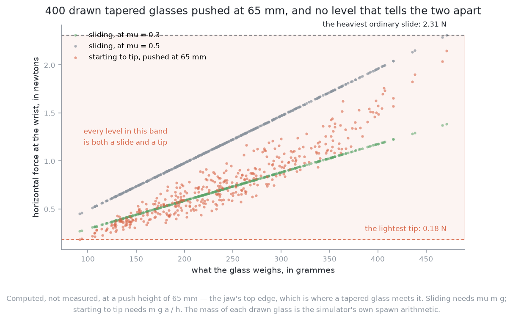
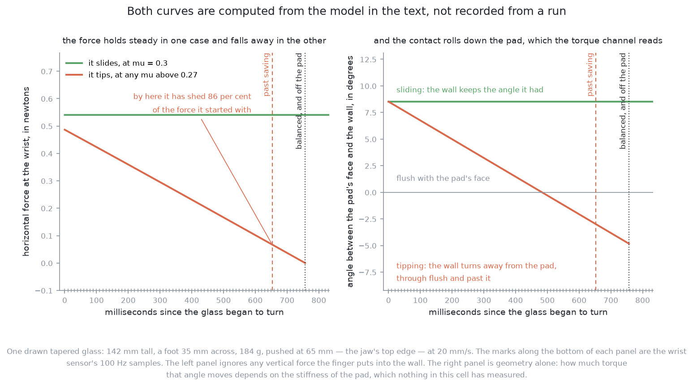
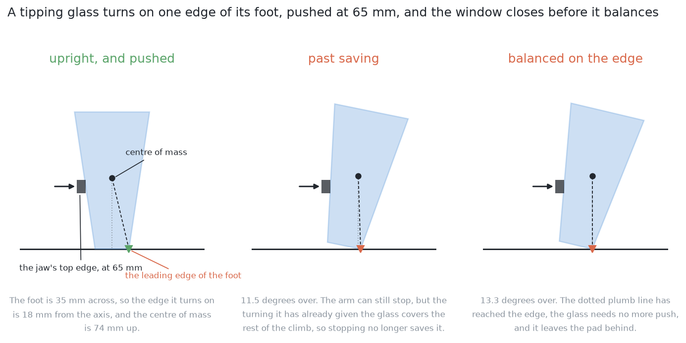
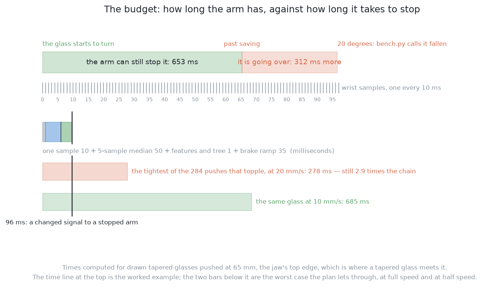
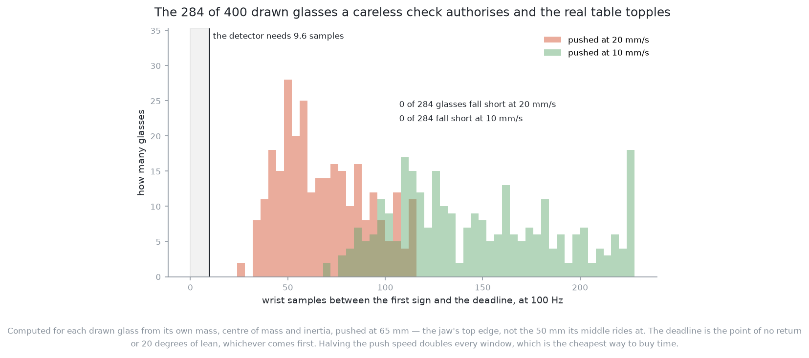

# Solution 8 — a learned early-abort

*Hybrid, with the learned part sitting as a verifier inside the push rather
than after it. A monitor watches the wrist force-torque signal while the arm is
still moving and stops the arm when the signal stops looking like a slide and
starts looking like the beginning of a tip. It is the only solution in problem
3 that can prevent a topple instead of reporting one.*

> **The cell is described once, in [the cell](../../the-cell.md)** — the table,
> the arm, the gripper, the four sensors and the words this project uses them
> with. What follows is only what is specific to this solution.

## Introduction

This document explains how the arm can make a push safe *while the push is
happening*, using the one sensor that is already in contact with the glass. It
is for someone who has read [the problem statement](../problem.md) and the
[solution overview](solution-overview.md), and who wants to know whether this
idea is sound engineering or wishful thinking.

Start with the size of the job, because it is larger than it looks. Take 400
tapered glasses drawn from the kind's own declared range. Give the arm a
tipping check that looks entirely correct: assume the friction is 0.3, and
compare the topple height against the 50 mm the jaw is aimed at. That check
declares **379 of the 400 safe to push**. Now account for two things the arm
was never told — that the table's real friction is 0.35, and that a tapered
glass meets the *top edge* of a 30 mm jaw at 65 mm rather than its middle at
50 mm. **284 of those 379 pushes end with the glass over.** That is 71 per cent
of the population, and 75 per cent of every push the check authorised.

Nothing in problem 3 can undo one of those. The camera can photograph the
result, the geometry can be corrected afterwards, and the glass is still on its
side. **This solution is the only one that can act while the glass is going
over**, and those 284 pushes are the work it exists to do.

Whether it can is a question about time. The wrist force-torque sensor produces
one reading every ten milliseconds. So everything turns on: **how many readings
arrive between the first sign that a glass is tipping and the moment it is past
saving?** If the answer is three, there is nothing to build. If the answer is
sixty-five, there is.

By the end of this document you will know what that number is for the glasses
this cell actually pushes, which of two possible deadlines it is measured
against, where it was computed from, what the arm can and cannot feel through
its wrist, why the level of the force tells you nothing and the shape of the
force over time tells you a great deal, and how this solution and [solution
7](07-a-learned-change-verifier.md) are the same idea one second apart.

There is one thing this document deliberately does not do. **It does not show
you a recorded force trace.** Every curve here is computed from a stated model
with stated assumptions, and every caption says so. A picture of a modelled
signal presented as a measurement is the most persuasive kind of wrong thing a
document like this can contain.

## The problem this solves

Problem 3 asks the arm to push crowded glasses apart on the table. A pushed
object either slides across the table or tips over, and which one happens is
decided by where the finger touches it. The rule is in the problem statement
and it is the piece of arithmetic every solution here shares. Pushing at height
`h` on an object whose foot is `2a` across, standing on a table it rubs against
with friction `μ`, the object slides while

    h  <  a / μ

and tips above it. Half the foot over the friction is the highest the finger
may touch.

**Friction** here means the coefficient of friction between the bottom of the
glass and the table: the sideways force needed to keep the glass sliding,
divided by the weight pressing down. It is a ratio, so it has no units. A
typical figure for dry glass on a dry hard surface is somewhere between 0.2 and
0.5.

The rule has two inputs, `h` and `μ`, and **the arm gets both of them wrong for
different reasons**. That is the whole problem, and the two are worth
separating because only one of them is unknowable.

### The height is knowable, and easy to get wrong

The gripper cannot put the middle of its jaw lower than 50 mm above the table
without its own body going through the table top. It is natural to take that
50 mm as the push height, and it is wrong.

The jaw is 30 mm tall. Its top edge is therefore 15 mm above its middle, at
65 mm. And a tapered glass is, by definition, wider higher up — so as the jaw
comes in, the glass meets its **top edge first**. The bench that runs these
pushes says so in as many words:

> A glass that is wider higher up meets the jaw here first, so this, not
> PUSH_HEIGHT, is how high it is pushed.
> — `problem-3-sim/bench.py`, defining `JAW_TOP`

Fifteen millimetres does not sound like it should matter. It decides most of
the population. The table below is read one row per combination of an assumed
friction and a choice of which height the check is written against. The middle
column is the narrowest foot that clears the check, and the right column is how
many of the 400 drawn glasses the arm would then be willing to push.

| check written against | assumed friction | narrowest foot it allows | glasses it would push |
|---|---|---|---|
| the jaw's middle, 50 mm | μ = 0.3 | 30 mm | 379 of 400, or 94.8 per cent |
| the jaw's middle, 50 mm | μ = 0.35 | 35 mm | 298 of 400, or 74.5 per cent |
| the jaw's middle, 50 mm | μ = 0.5 | 50 mm | 53 of 400, or 13.2 per cent |
| the jaw's top edge, 65 mm | μ = 0.3 | 39 mm | 231 of 400, or 57.8 per cent |
| the jaw's top edge, 65 mm | μ = 0.35 | 46 mm | 95 of 400, or 23.8 per cent |
| the jaw's top edge, 65 mm | μ = 0.5 | 65 mm | **0 of 400** |

Read the first and fourth rows against each other. Moving the check from the
jaw's middle to the jaw's top edge, with the friction assumption unchanged,
takes the pushable share from 95 per cent to 58 per cent. **148 of the 400
glasses are authorised by the first check and toppled by the second.** The last
row is worth a moment too: at μ = 0.5 and the real contact height, not one
tapered glass in 400 can be pushed at all, because it would need a foot 65 mm
across and the kind's widest is 60 mm.

### The friction is not knowable at all

Nothing in this cell measures `μ`. Not the camera, not the pads, not the wrist.
It is a property of the glass, the table, and whatever happens to be on both —
a ring of condensation, a smear of detergent, a patch that was wiped an hour
ago and a patch that was not. The bench sets it to 0.35 and does not tell the
arm, which is exactly right: it is ground truth to be scored against, not an
input to a decision.

So even with the height corrected, the friction still bites. Of the 231 glasses
a correctly written check authorises at μ = 0.3, **136 — 59 per cent — go over
at the table's real 0.35**. Get both wrong together, which is the natural thing
to do, and the count is the 284 from the introduction.

**This solution is what makes an optimistic guess survivable.** It does not
improve either number. It stands behind both with something that notices,
during the push, that a push is going wrong, and stops the arm while stopping
still helps. Every other solution in problem 3 either decides before the push
or measures after it. This is the only one that acts inside it.

## The main idea

The arm pushes as it would anyway, from the position and footprint that
[problem 2](../../problem-2/problem.md) produced. A separate piece of code, a
**monitor**, sits beside the controller and reads the wrist force-torque sensor
at its full rate. Its only power is to zero the arm's velocity command. It
cannot steer, it cannot choose a target, and it cannot approve anything. It can
stop.

The monitor asks one question of every reading: does the recent history of this
signal look like a glass that is sliding, or like a glass that has begun to go
over? When the answer is the second, it stops the arm, retreats a short way
along the push line, and hands over to the rest of the system to find out what
actually happened.

That is the whole idea. The rest of this document is about whether it can be
done in the time available, and about what the signal really looks like, which
is not what the obvious account of a topple suggests.

## What the arm can actually feel

The cell has four sensors and only three of them are in play here. Their rates
matter more than usual, because this is the one part of the project where an
answer that arrives late is worth nothing at all.

The table below is read as a list of what could possibly serve as evidence
during a push, with the rate that evidence arrives at and the reason it does or
does not help. The rates come from [the cell](../../the-cell.md).

| sensor | rate | what it offers during a push |
|---|---|---|
| wrist force-torque | 100 Hz | three forces and three torques at the flange; the only sensor in contact with the glass |
| pad contact × 2 | 60 Hz | whether each fingertip pad is touching anything; catches losing the glass, not tipping it |
| RGB-D camera | 15 Hz | on the wrist, pointing along the fingers during a push, at a range where a glass fills the frame; useless as a witness to its own push |

So the wrist sensor is not the best of several options. It is the only option.
Everything below follows from that, including the timing, because 100 Hz means
one reading every 10 milliseconds and nothing can make it arrive faster.

One further number from the same page matters later. The arm's usual way of
reading the wrist, used when it weighs a glass, is the median of 32 samples
(`arm/motion.py`, `WRIST_SAMPLES`). That is 320 milliseconds of history, which
is a sensible thing to do when you are measuring a weight that is not changing
and a poor thing to do when you are watching for a change. This solution cannot
use it.

### Why the level of the force tells you nothing

The obvious monitor is a threshold: stop if the horizontal force goes above
some number of newtons. It is worth understanding exactly why that cannot work
here, because the reason is arithmetic rather than opinion.

Keeping a glass sliding takes `μ m g` — friction times weight. Starting to tip
a glass pushed at height `h` takes `m g a / h`, which is the force whose moment
about the leading edge of the foot balances the moment of the glass's own
weight. Both are proportional to the mass, and the mass is the thing the arm
has not measured, because weighing a glass in this project happens after it has
been lifted and this is the problem where lifting is not yet possible.

Over the same 400 drawn glasses, computed from the mass each one is spawned
with and at the real 65 mm contact height:

| what is happening | force at the wrist |
|---|---|
| sliding, at μ = 0.3 | 0.27 N to 1.39 N |
| sliding, at μ = 0.5 | 0.45 N to 2.31 N |
| starting to tip, pushed at 65 mm | 0.18 N to 2.15 N |

Read those three ranges against each other. The lightest glass begins to tip at
0.18 N. The heaviest glass slides quite normally at 2.31 N. Every level between
those two is, for some glass in the range, an ordinary slide, and for some other
glass, a topple starting. A threshold placed anywhere in that band is wrong
about one of them, and the band covers the whole useful range of forces.

There is a tempting escape that does not work. Per glass, the tip force and the
slide force do separate: a glass tips at 65 mm exactly when its tip force is
below its own slide force, which is the same statement as `h ≥ a / μ`
rearranged, and the sweep confirms it — the 231 glasses that pass the geometry
check at μ = 0.3 and 65 mm are exactly the 231 whose tip force is above their
own slide force. But using that requires knowing both the mass and the friction
for the glass in front of you, and the friction is the thing that was missing in
the first place.

### What does separate them: the shape over time

A level cannot separate them. Behaviour over time can, and the reason is
mechanical rather than statistical.

A glass that is sliding presents a roughly steady resisting force. Friction
times weight does not change as the glass travels, so the wrist reads a ramp up
to a level as contact is made, and then a flat line for as long as the push
lasts. Small variations come from the table not being uniform, but the signal
has no trend.

A glass that has begun to tip presents a force that **changes character**, and
the change has a direction that can be computed. Once the glass is rotating
about the leading edge of its foot, the horizontal force the arm must supply is
whatever balances the moment of the glass's own weight about that edge. As the
glass rotates, its centre of mass swings towards a position straight above the
edge, and the moment falls. At the moment it is directly above, the moment is
zero and the glass needs no push at all. So the resisting force **falls away**
from the instant rotation begins, and it falls to nothing.

That corrects the usual account, which describes an object about to tip as one
whose resistance climbs, keeps climbing, then drops away as it goes over. The
climb is real, but it is not part of the tip.
The climb is the friction rising as the glass runs onto a grippier patch of
table, and it stops the instant tipping becomes the cheaper thing for the glass
to do — which is exactly when the sliding force would have reached `m g a / h`.
Tipping is not the top of that climb, it is the fall on the other side of it.
This matters for the design, because a detector armed to fire on a *rise* is
firing before anything has tipped, on evidence that requires knowing the mass to
interpret. A detector armed to fire on the *fall* is firing on the tip itself.

The second signal is a matter of geometry. A tapered glass's wall is not
vertical: it leans outwards going up, and for the drawn glasses in this range
that lean is 4 to 17 degrees off vertical. The pad's face is vertical, so the
pad is initially loaded along its top edge. When the glass rotates forward, the
wall turns away from the pad, passes through flush, and then leans the other
way, so the load rolls down the pad from its top edge to its bottom edge. The
pad is 14 mm tall, so the line along which the force enters the wrist moves by
up to that much. The wrist reads a torque that is no longer explained by the
horizontal force alone.

**Both curves in that picture are computed from the model stated here, not
recorded from a run.** The left panel comes from one line of mechanics: a
horizontal force at world height `h` has moment `F h` about the pivot whatever
the glass has rotated to, and gravity holds the glass back with `m g r sin(θ_c
− θ)`, where `r` is the distance from the pivot to the centre of mass and `θ_c`
is the rotation that brings the centre of mass over the pivot. It ignores any
vertical force the finger puts into the wall. The right panel is geometry
alone. How much torque that changing angle actually moves depends on how stiff
the silicone pad is, and **nothing in this cell has measured that**, so the
honest thing to plot is the angle and not the torque.

The same honesty applies to the vertical force. During a tip the glass's
surface climbs past a stationary pad — for the worked example below, at about
14 mm per second — and friction between pad and glass turns that relative
movement into a vertical force at the wrist. During a slide there is no such
movement and no such force. The direction of that signal is certain; its size
is bounded above by the pad's grip factor times the horizontal force, which for
the worked example is 0.6 × 0.49 N, or at most 0.29 N. Where in that range it
actually lands is a question for a measurement, not for this document.

So the honest ranking of the three channels is: the horizontal force's decline
is the signal that needs no unmeasured constants and should carry the design;
the wrist torque and the vertical force are real, are bounded, and are worth
feeding to the model as extra columns, but nothing should be promised on their
behalf before they have been measured in the simulator.

## Going over the leading edge

To put a number on the deadline, the tip has to be treated as the mechanical
event it is. A glass being pushed over is a rigid body turning on one edge of
its foot, which is a pendulum standing on its point.

Every glass in that picture is one drawn tapered glass, outline and all, rotated
about the real edge of its real foot. It is 142 mm tall, its foot is 35 mm
across, it weighs 184 g, and its centre of mass sits 74 mm up. None of those
numbers is written down anywhere in this project: they are what the draw
produced and what the simulator would be handed.

### The balance point

While the glass is upright, its centre of mass sits behind the leading edge of
its foot, by half the foot's width. Gravity therefore pulls it back onto its
base, and the arm has to do work to lift it. As the glass rotates, the centre
of mass rises and swings forward, and at one particular rotation it passes
straight over the edge. Call that the **balance point**. For the glass above it
is 13.3 degrees. Past it, gravity is no longer holding the glass back; it is
pushing it over.

The balance point is small. Across the 284 pushes that actually topple it
corresponds to points of no return between 4.9 and 24.9 degrees, with a median
of 11.5. A tall glass on a narrow foot has a centre of mass high up and an edge
close in, so it needs to lean only a few degrees before it is committed.

### The point of no return

The balance point is not quite the deadline, and the reason is worth following.
The glass does not arrive at the balance point at rest. It arrives already
turning, because the arm has been turning it, and that rotation carries energy.
So a little *before* the balance point there is a rotation at which the energy
the glass already has is enough to carry it over the rest of the climb by
itself. Stopping the arm there does not save the glass. That is the **point of
no return**.

How much earlier it comes depends on how fast the arm is pushing, because that
is what sets the rotation rate. The push is quasi-static — slow enough that
momentum does not carry the glass anywhere on its own — so the glass rotates
only as fast as the arm feeds the contact forward. The contact is at height `h`
above the table, so its forward speed is the rotation rate times `h`, and the
rotation rate is the push speed divided by `h`. At 65 mm and the bench's push
speed of 20 mm/s that is 0.31 radians per second.

This is where the 15 mm correction pays back. The rotation rate is the push
speed over the contact height, so pushing at 65 mm rather than 50 mm makes the
glass turn **more slowly** for the same feed, and every window below is about
30 per cent longer than a calculation at 50 mm would have given. The height
error that made the tipping check too permissive made the timing budget look
worse than it is. Both corrections had to be made before either number was
worth quoting.

For the glass in the picture the point of no return is 11.5 degrees, against a
balance point of 13.3 degrees.

There is a small consolation in the numbers. By the deadline the centre of mass
has risen by only 0.9 to 4.8 mm across the 284 pushes that topple, with a
median of 2.2 mm. That is how far it drops again when a successful abort lets
the glass rock back onto its foot, so a successful abort ends in a small thump
and not a second hazard.

## Which deadline, and why it turns out not to matter

There are two candidate deadlines and they have to be separated carefully,
because one of them is physics and the other is a line the project drew.

The first is the point of no return above. Past it the glass goes over whatever
the arm does.

The second is the project's own definition of a fallen glass:
`STANDING_TILT_DEG = 20.0` in `problem-3-sim/bench.py`, commented "A glass
leaning further than this has fallen over." A design that relied on a glass
passing through the project's own failure state and coming back out of it would
not be one to put in writing, so it is worth asking whether 20 degrees bites
first.

**For the scorer, it does not, and the reason is worth knowing.**
`scoring.py` reads `bench.tilt(i)` from the settled pose at the end of a run.
A glass has no resting place between upright and over — it either rocks back to
zero or goes all the way — so a glass that leans past 20 degrees and comes back
scores as standing. The scorer's deadline really is the point of no return.

**As a design rule it is worth adopting anyway**, and the interesting result is
that adopting it costs almost nothing. Of the 284 pushes that topple, only
**11** reach 20 degrees before they reach the point of no return. Taking the
earlier of the two deadlines for every glass:

| | to the point of no return | to the earlier of the two |
|---|---|---|
| shortest window | 278 ms | 278 ms |
| median window | 652 ms | 652 ms |
| longest window | 1415 ms | 1134 ms |

Read that table from the bottom row up. The stricter deadline shortens only the
*longest* windows, and it leaves the shortest and the median untouched. The
reason is structural rather than lucky: the glasses whose point of no return is
past 20 degrees are the ones with the widest feet, and those are exactly the
glasses that had the most time to begin with. The deadline that matters is set
by the narrow-footed end of the population, where the point of no return
arrives at five degrees and the 20-degree line is nowhere near.

So the answer to "does the margin survive the stricter deadline" is: **yes, and
by exactly the same margin**, because the two deadlines bind on different
glasses. Every figure and every number below uses the earlier of the two.

### And what 20 degrees looks like from above

One more measurement, because it decides the division of labour with solution 7.
Rotating each of the 400 drawn outlines by 20 degrees about the edge of its
foot and comparing with upright:

- the outline seen from above has grown by **−1 to 58 mm, median 28 mm**;
- the tallest point has **risen**, in **400 cases out of 400**, by 3 to 20 mm.

Both of those are the opposite of what an overhead check expects. The naive
rule for a fallen glass is that it becomes short and wide. At the project's own
failure line a glass is barely wider, and it is *taller* — every single one of
them — because the rim's far corner sweeps upwards as the glass turns on its
foot. A glass can be past the line that scores the run as wrong while still
looking very nearly upright from above.

That is the strongest argument in this document for watching force during the
push rather than pictures after it, and it was measured independently by the
agent writing [solution 7](07-a-learned-change-verifier.md), who reached the
same median of 28 mm and the same "risen in every case".

## The timing budget

Everything above was setting up one comparison: how long the arm has, against
how long the arm takes to stop.

### How long the arm has

The window runs from the first instant the signal departs from a steady slide —
which is the instant rotation begins, since that is when the force starts
falling — to the deadline.

The population to compute it over is not the set a correct check would push. It
is the **284 pushes that a check written against the jaw's middle authorises and
the real table topples**, because those are the pushes this monitor exists to
stop. Their feet run from 30.0 to 45.5 mm, median 38.2 mm. Each one is pushed
at 65 mm and the bench's 20 mm/s, and each window is computed from that glass's
own mass, centre of mass and moment of inertia.

| | milliseconds | wrist samples at 100 Hz |
|---|---|---|
| shortest | 278 | 27.8 |
| fifth percentile | 371 | 37.1 |
| median | 652 | 65.2 |
| longest | 1134 | 113.4 |

Read that table as the supply side of the budget. The typical doomed push gives
the detector sixty-five readings. The unlucky one in twenty gives it
thirty-seven. The worst single push in 400 gives it twenty-eight.

For comparison, the 231 glasses a correctly written check would push give 423 to
1134 ms, median 769 — more time, because they have wider feet. The detector's
hardest population is the one a sloppy check creates.

### How long the arm takes to stop

The demand side is a chain of four delays, and each one has to be counted
because they add.

The first is the sensor period itself: **10 ms**, because the evidence can only
arrive when a sample arrives.

The second is filtering. A raw force reading is noisy, and a monitor that fires
on one noisy sample will fire constantly. A **median filter** replaces each
reading with the middle value of the last few, which removes single-sample
spikes without smearing a genuine step the way an average does. Five samples is
a **50 ms** window. That is counted here in full, which is pessimistic: a
median's own lag is roughly half its window.

The third is the decision: computing a handful of summary numbers from the
recent window and evaluating a small model on them. **1 ms**, and that is
generous.

The fourth is the arm. Zeroing a velocity command does not stop the tool
instantly; the controller ramps it down. **35 ms** is the figure the solution
overview uses, and nothing in this project has measured it, so it is an
assumption and is marked as one here.

That is **96 ms** in total, which is 9.6 wrist samples, and 1.9 mm of further
travel at 20 mm/s.

### The answer, in samples

Put the two sides together and the verdict is comfortable:

**At the bench's 20 mm/s, all 284 of the pushes that topple give the detector
more time than the chain needs, and the worst of them gives it 2.9 times as
much.** There is no marginal case at that speed, and no glass for which this
solution is decoration.

The margin does not survive unlimited speed, and the table below says where it
goes. Read the last column first: it is the number of toppling pushes for which
the monitor would fire after the glass was already committed.

| push speed | median window | worst window | pushes the chain cannot cover |
|---|---|---|---|
| 10 mm/s | 1410 ms | 685 ms | 0 of 284 |
| 15 mm/s | 904 ms | 414 ms | 0 of 284 |
| 20 mm/s (the bench's) | 652 ms | 278 ms | 0 of 284 |
| 30 mm/s | 399 ms | 142 ms | 0 of 284 |
| 40 mm/s | 271 ms | 74 ms | 2 of 284 |
| 60 mm/s | 142 ms | 6 ms | 86 of 284 |
| 80 mm/s | 79 ms | 0 ms | 160 of 284 |

The protection holds all the way to 30 mm/s, starts to fray at 40, and is gone
by 60. The columns are identical whether the deadline is the point of no return
or the 20-degree line, for the reason given above.

So the design decision this analysis forces is not about the model at all.
**It is that the push speed is part of the safety argument**, and has to be
chosen after the timing budget rather than before it. The bench's 20 mm/s has
room to spare. Anyone who later raises it to 60 mm/s to save seconds will have
silently removed the protection for a third of the pushes that need it, without
touching a line of this code, and nothing will announce that they have.

One tempting shortcut does not work. The shortest windows do tend to belong to
the tall narrow-footed glasses, which are also the ones the geometry check has
least margin on, but the relationship is loose: across the doomed set, the
correlation between a glass's window and its geometric margin is 0.35. That is
a tendency, not a rule, so the geometry check cannot stand in for the timing
check.

### What happens after the deadline

It is worth knowing what the monitor is racing against on the other side of the
line, because it explains why no amount of looking afterwards can substitute.

Past the balance point the glass is in free fall about the edge of its foot,
with the small rotation the push gave it. Across the whole drawn family that
takes 314 to 425 ms to reach 30 degrees, and 411 to 574 ms to lie flat.

So a topple, from the first detectable sign to a glass on its side, is over in
about a second. The whole event fits comfortably inside the time it takes to
move a wrist-mounted camera somewhere useful and take a picture. That is the
single fact that separates this solution from the next one.

## Solutions 7 and 8 are the same idea a second apart

[Solution 7](07-a-learned-change-verifier.md) is a learned change-verifier: it
compares a picture taken before the push with one taken after and says what
happened. This solution reads a force trace during the push and says what is
happening. The two are the same instinct — put a trained model in the position
of a checker rather than a decider — and the entire difference is *when* the
check runs. It is worth being precise about what each one buys, because the
answer is not that one is better.

The table below lists what each solution is in a position to know, and should be
read as a list of capabilities rather than a score.

| | solution 8, during the push | solution 7, after the push |
|---|---|---|
| when the evidence arrives | 96 ms after the change | after the push finishes and a picture is taken |
| what it can do about a topple | prevent it | report it |
| what it senses | one contact, through one sensor | the whole scene, in colour and depth |
| what it can say went wrong | nothing, beyond "not a slide" | which glass, how far, standing or fallen |
| what it sees of the other glasses | nothing at all | all of them |
| what it costs when wrong | a false abort: a few seconds | a false verdict: another look, or a missed topple |
| where the code lives | beside the controller, in the loop | outside the loop, after the motion |

Take the first row seriously. The topple that solution 8 is trying to interrupt
is over in about half a second from the point of no return. Solution 7 cannot be
made fast enough to compete, and the reason is not that its model is slow. Its
evidence is a photograph, the camera is on the wrist, and the push has to finish
before the wrist can go anywhere useful. Even if the camera ran at a thousand
frames a second it would still be photographing the aftermath, because the
picture is taken from a pose the arm has to travel to.

The 20-degree measurement above sharpens this. At the project's own failure
line, an overhead look sees a glass a median of 28 mm wider and, in every one of
400 cases, *taller* than it was. A picture taken from above at exactly the wrong
moment does not merely arrive late; it arrives late carrying evidence that
points the wrong way. Solution 7 handles that by choosing a side-on viewpoint,
which is the right answer and takes seconds.

And take the fourth row equally seriously. When this monitor fires, it knows one
thing: the contact stopped behaving like a slide. It does not know whether the
glass tipped, jammed against a neighbour, ran onto a wet patch, or slipped out
from under the finger. A force trace has one contact in it and the table has
five glasses on it.

**So they are not rivals, they are two halves of one loop.** Solution 8 stops
the arm; solution 7 then says what the abort was about. Building solution 8
alone gives an arm that stops for reasons it cannot explain. Building solution 7
alone gives an arm that explains, accurately and four seconds too late, why the
glass on the floor is on the floor. The pair is worth more than the sum, and the
second between them is the entire argument for having both.

## How the detector would be built

### Try the thresholds first, and mean it

**What it is.** Two rules on the filtered horizontal force: abort if it falls
by more than some fraction of its recent steady level within some number of
samples, and abort if the fitted slope over the last few samples is below some
negative number of newtons per second.

**What it buys.** A page of code, no training set, no model file, and a refusal
that prints as two numbers a person can read.

**Why this rather than the model.** Because the signal really may be that
clean. By the deadline, the tipping glass has already shed 68 to 92 per cent of
the force it started with, with a median of 85 per cent, and a sliding glass
sheds none. If two thresholds catch every deliberate topple in seeded simulation
at a tolerable false-abort rate, then they are the answer and the model is
unnecessary. **Measure this before building anything else.** No figure is
invented here for how well they do, because none has been measured.

**What it costs.** Two numbers that have to be chosen and then re-chosen every
time the push speed, the pad or the table changes, and no way to combine the
force channel with the torque channel except by adding more thresholds. The
place it is most likely to fail is the start of the push, where the steady level
it compares against has not been established yet.

### The window and the features

The monitor keeps a sliding window of the last 20 samples, which at 100 Hz is
200 ms and at 20 mm/s is 4 mm of travel, and makes one decision per new sample.
Twenty samples is chosen as *context*, not as evidence: it is long enough to
hold the steady slide level that the fresh samples are compared against. The
fresh evidence is the last five samples, and that is the part that has to fit
inside the budget.

From the window, a fixed list of summary numbers: the mean, the spread and the
fitted slope of the horizontal force, of the vertical force, and of the wrist
torque about the axis across the push, each computed over the whole window and
again over its last five samples, plus the two pad contact flags. That is a
couple of dozen numbers per decision, each of them one line of arithmetic.

Two of those deserve a note. The slope over the last five samples is the feature
that carries the tip, because the tip is a decline. The ratio of the torque to
the horizontal force is worth adding as its own column, because it has units of
length and is the height at which the force enters the wrist — it is constant
during a slide and moves during a tip, and giving the model the ratio saves it
from having to discover the division.

### Which model, and why trees

**What it is.** **Gradient-boosted decision trees**: a stack of small decision
trees, each one trained to correct the errors of the ones before it, and the
prediction is their sum passed through a function that turns it into a
probability. Available in
[scikit-learn](https://scikit-learn.org/) (BSD-3-Clause),
[LightGBM](https://github.com/microsoft/LightGBM) (MIT) and
[XGBoost](https://github.com/dmlc/xgboost) (Apache-2.0).

**What it buys.** They are the strongest thing available on a table of a few
dozen hand-made numbers, they train in seconds on a laptop processor, they
predict in microseconds, they need no scaling of the inputs, and they will tell
you which features they used.

**Why this rather than the obvious alternative.** The obvious alternative is to
skip the features and give a network the raw trace: a small one-dimensional
convolutional network, or a small recurrent model carrying a summary forward
sample by sample, both in [PyTorch](https://pytorch.org/) (BSD-3-Clause) on
this Mac's Metal backend. Those are the right choice when nobody knows what to
measure. Here the mechanics above says exactly what to measure — a decline in
one channel and a moving line of action in another — so the features are not a
guess, and handing a network the job of rediscovering them from a few thousand
simulated pushes buys nothing but a longer training loop and a slower
prediction. If the features turn out to be wrong, the raw-trace models are the
honest next step, and
[ROCKET](https://arxiv.org/abs/1910.13051) is the cheap middle ground: random
convolutional kernels over the raw series, fed to a linear model.

**What it costs.** A weights file that has to be kept in step with the cell, a
prediction that cannot explain itself beyond a list of feature importances, and
a model that answers with its usual confidence about a glass unlike anything it
was trained on.

### Where the labels come from

The simulator knows where it put every glass and `bench.tilt()` reports the lean
of each one, so a run is labelled for free.

The choice that decides whether this is a warning or a report is what each
window is labelled with. **It is not labelled with what the window shows. It is
labelled with what the window precedes.** A window is positive if the glass
passes its deadline within the next 300 ms. That one decision is what makes the
model a predictor of the near future rather than a describer of the present, and
it is the same trick solution 7 does not get to use, because by the time
solution 7 looks there is no near future left.

Three hundred milliseconds is chosen against the budget above and not for
neatness: it is comfortably longer than the 96 ms chain, so a window labelled
positive is one where stopping still had a chance, and comfortably shorter than
the 652 ms median window, so the label does not fire at the very start of a push
that was going to be fine.

### The imbalance problem

A topple in ordinary running is rare, and a model trained on a mixture where one
push in a few hundred goes over, and scored on accuracy, learns the cheapest
possible rule — nothing ever tips — which is right almost always and worth
nothing.

The fix is to make topples on purpose, and this cell makes that unusually easy,
because the population analysis above says exactly how. Push at the jaw's top
edge with a check written for its middle. Raise the table's friction above the
assumed figure. Spawn tall glasses on narrow feet. All of those are free in
[Gazebo](https://gazebosim.org/) (Apache-2.0) and in the MuJoCo bench, and none
of them is available on a real table with real glass. Generate until one push in
four is a topple, and score the model on how many topples it catches at a fixed
false-abort rate, never on accuracy.

### The cost of being wrong in each direction

The two errors are not worth the same and the design should say so out loud.

A **false abort** — stopping a push that was fine — costs the arm a retreat, a
look, and a second attempt. Call it five or six seconds, and a line in the
report.

A **missed topple** costs the glass, and `scoring.py` records the whole run as
wrong. Broken glass leaves shards on a table an arm will carry on moving over,
and this project's standing rule is that a refused glass is a result and a
broken one is a failure.

So weight a missed topple many times a false abort in the training loss, and set
the run-time bar low rather than in the middle. The limit on how low is
usability rather than principle: if ordinary clean runs start aborting more
often than about one push in five, the monitor has stopped being a safety net
and started being the thing that prevents the task from finishing, and the fix
then is a better model, not a higher bar.

## The feedback loop

An abort is a measurement, and the loop that follows it is where this solution
earns more than its own safety.

**Stop, then retreat.** Zero the velocity, then back the finger off 20 mm along
the push line. Never lift the arm: lifting drags the pad up the wall and
finishes the rotation that was just prevented. Below the point of no return the
glass rocks back onto its foot by itself, dropping its centre of mass the 0.9 to
4.8 mm it had raised.

**Then look.** The force trace has said something is wrong and cannot say what.
This is where [solution 7](07-a-learned-change-verifier.md) is the other half of
a pair rather than a competitor: the arm takes the camera to a side-on viewpoint
and asks what actually happened.

**Write the row back.** The window that fired, together with whatever the camera
concluded, is a labelled example from a real table rather than a simulator. A
false alarm is the single most valuable row there is, because deliberate
simulation produces almost none of them.

**Feed the friction estimate.** This is the part that changes the rest of the
system. An abort confirmed as a genuine tip, at a contact height of 65 mm on a
glass whose half-foot `a` has been measured, says that `a / μ` is below 65 mm,
and therefore that `μ` is above `a / 65`. That is a real observation of the one
number nobody in this cell has.

One rule governs that update, and it is the rule that keeps a learned component
from quietly making the system less safe: **evidence may only make the geometry
check stricter, never looser.** A confirmed tip raises the friction the refusal
rule uses. A push that went perfectly says nothing at all, because a glass that
slid at 65 mm only proves `μ` is below `a / 65`, which the plan already assumed.
The estimate ratchets in one direction.

And it is worth noticing that the same loop catches the *other* unmeasured
number. The estimate this produces is really an estimate of `μ` *at the height
the glass is actually touched*. If the check has been written against the wrong
height, the friction it infers comes back systematically too high, the rule gets
stricter, and the arm stops pushing the glasses it was toppling. It will have
fixed the wrong constant and got the right behaviour — which is a poor way to
find a bug and a good way to survive one.

## A worked example

Take one glass out of the draw: 142 mm tall, a rim 78 mm across, a foot 35 mm
across, 184 g, its centre of mass 74 mm up. Half its foot is 17.6 mm. It is the
middling case of the 284 — chosen by that rule, not by hand.

**The plan, and why it passes.** At the assumed μ = 0.3 its topple height is
17.6 / 0.3 = 59 mm. A check written against the jaw's middle compares that with
50 mm, finds 9 mm of margin, and authorises the push. A check written against
the jaw's top edge would have compared it with 65 mm and refused. The glass is
authorised by exactly the mistake the introduction describes.

**What is actually under it.** The table's friction is 0.35. At the real
contact height of 65 mm this glass tips at any friction above 17.6 / 65 = 0.27.
A check written against 50 mm would have tolerated friction up to 0.35 — the
table's real value, to two figures. The push is authorised by a hair and doomed
by the same hair.

**The first 200 ms.** The finger meets the glass and the horizontal force rises
to a steady level. The monitor fills its 20-sample window and establishes that
level. Nothing is odd yet.

**The tip begins.** The glass does not slide; it starts to rotate about the
leading edge of its foot at 0.31 radians per second. At the instant rotation
begins the arm is holding 0.49 N, which is `m g a / h`. From there the force
falls, because the glass's weight is swinging towards a position over the edge,
and the fall averages 0.6 N per second. The sliding force for this glass at the
assumed friction would have been 0.54 N and would not have moved at all.

**The deadline.** The balance point is 13.3 degrees away, which is 757 ms of
rotation. The point of no return is 11.5 degrees, which is **653 ms, or 65.3
wrist samples**, and 20 degrees of lean comes later still, so the point of no
return is this glass's deadline. By it the force has fallen to 14 per cent of
what it started at.

**The decision.** The chain is 10 ms of waiting for a sample, 50 ms of median
window, 1 ms of features and model, and 35 ms of brake ramp: 96 ms, and 1.9 mm
of further travel. Even with every one of those counted pessimistically, the arm
is stopped with 85 per cent of the window unused, and the glass rocks back
through the 2 mm its centre of mass had risen.

**The loop.** The arm retreats 20 mm, takes the camera to a side-on viewpoint,
and solution 7 confirms the glass is standing and has barely moved. That
confirmation turns the abort into an observation: μ under this glass is above
17.6 / 65 = 0.27. The refusal rule's friction is raised, its topple height for
this foot becomes 65 mm, and the glass is now correctly refused rather than
pushed.

**And the hardest case in the set.** The tightest of the 284 is 227 mm tall on a
foot 30.7 mm across, 270 g, its centre of mass 122 mm up. Its topple height at
μ = 0.3 is 51 mm, so the check against the jaw's middle passes it by a single
millimetre. Its balance point is 7.2 degrees and its point of no return is 4.9
degrees, which at 20 mm/s is **278 ms, or 27.8 samples** — still 2.9 times the
chain. Even the worst push in 400 is not a close-run thing at the speed the
bench uses.

## What it needs

No new hardware. The wrist force-torque sensor and the pad contacts are already
in the cell and already simulated by [Gazebo](https://gazebosim.org/)
(Apache-2.0).

New code, in four pieces. A **monitor node** that subscribes to the wrist wrench
at its full rate and can zero the active velocity command — it has to sit beside
the controller rather than in the planner, because cancelling a plan is far too
slow; [ros2_control](https://github.com/ros-controls/ros2_control) (Apache-2.0)
is where that belongs. A **generation script** that spawns glasses across the
kind's whole range and pushes them with a deliberately permissive check until a
quarter of the pushes topple. A **training script**, a few dozen lines around a
gradient-boosting call. And the **retreat-and-look behaviour** that turns an
abort into a measurement.

No graphics card, no pretrained weights, no real-world data, and no data
collected by a human.

## Where the idea comes from

Four separate lines of work meet here, and it is worth knowing which is which,
because they contribute different things.

**Pushing mechanics.** The arithmetic this whole document rests on is not new
and not contested. Mason's *Mechanics and Planning of Manipulator Pushing
Operations* (1986) is where the analysis of a pushed object's motion under a
finger was set out, and Lynch and Mason's *Stable Pushing* (1996) is the
planning side of it. The slide-or-tip condition and the moment balance about the
leading edge are textbook results from that tradition. Nothing learned is needed
to know when a glass tips; what is missing is only the two inputs.

**Collision and contact monitoring on industrial arms.** Watching a robot's own
force signals for the signature of an unplanned contact, and stopping the arm
when it appears, is an established part of industrial safety engineering.
Haddadin, De Luca and Albu-Schäffer's survey *Robot Collisions: A Survey on
Detection, Isolation, and Identification* (2017) collects the methods. This
solution is the same architecture — a fast monitor with the single power to
stop — pointed at a failure of the object rather than a failure of the arm.

**Learning from touch during contact-rich manipulation.** The move of feeding a
contact signal to a learned model, rather than a threshold, has a decade of work
behind it in grasping. Calandra and colleagues' [*The Feeling of
Success*](https://arxiv.org/abs/1710.05512) (2017) predicted whether a grasp
would hold from tactile readings; their [*More Than a
Feeling*](https://arxiv.org/abs/1805.11085) (2018) used it to decide how to
re-grasp; Lee and colleagues' [*Making Sense of Vision and
Touch*](https://arxiv.org/abs/1810.10191) (2019) learned a shared
representation of the two. All three make the same argument this document makes
about the wrist: the level of a contact signal means little and its behaviour
over time means a lot.

**Early classification of time series.** The statistical framing — decide as
soon as possible, on a prefix of the series, trading accuracy against how long
you wait — is a named problem with its own literature, and
[ROCKET](https://arxiv.org/abs/1910.13051) (2020) is the cheap modern baseline
for it. The timing budget above is that trade-off written out in milliseconds
for one specific machine.

The general idea underneath all four is worth naming on its own, because it
recurs: **a monitor whose only power is to stop is safe to make learned.** It
cannot choose a wrong action, because it cannot choose an action. Its worst
failure is to stop when it should not have, and the cost of that is bounded and
measured in seconds. That is the same argument as the ranker and verifier
positions in the [solution overview](solution-overview.md), applied to the one
position that acts in real time.

## Where it is strong and where it breaks

The strengths come from where it sits rather than from how good the model is.

**It acts inside the failure.** Alone among the eleven solutions in problem 3,
it can prevent a topple rather than predict one in advance or report one
afterwards. A topple is the one failure in this problem that nothing else can
undo.

**The job it is doing is large.** 284 of 400 drawn glasses topple under a
tipping check that looks correct. That is not a rare corner case being guarded
against; it is most of the population.

**It is the net under two unmeasured numbers, not one.** The friction is
unknowable and the contact height is merely easy to get wrong, and the monitor
does not care which of them was the cause. It reads what the contact is doing.

**It measures the number nobody has.** Every confirmed abort is one real
observation of the friction under one real glass, obtained by an arm that has no
friction sensor. Nothing else in problem 3 produces one.

**It degrades to nothing.** Delete the model file and the two thresholds
underneath it remain, and the push runs as it did before.

**Its cost at run time is nothing.** A couple of dozen arithmetic operations and
one tree evaluation per sample. There is no budget argument against having it.

The weaknesses divide into what the clock will not allow, what the sensor cannot
see, and what the training cannot cover.

**What the clock will not allow** comes first. At the bench's 20 mm/s there is
no marginal case, but the margin is bought with the push speed and can be sold
again by anyone who raises it: at 40 mm/s two of the 284 fall short, at 60 mm/s
eighty-six do, and nothing in the code will say so. The 35 ms brake ramp is an
assumed figure and needs measuring; if the real arm takes 100 ms to stop, the
whole budget has to be recomputed and the safe speed falls. And every window in
this document assumes the push is quasi-static — push fast enough for momentum
to matter and the analysis does not hold at all, which is a second reason the
speed is not free.

**What the sensor cannot see** comes second. One contact, one glass. The
monitor knows nothing about the neighbour that gets knocked, nothing about a
glass that is already leaning, and nothing about what is happening anywhere else
on the table. When it fires it can say only that the contact stopped behaving
like a slide, which is why it is useless without a camera behind it. And it has
no parts: a threshold refuses with a number and a reason, and this refuses with
a probability.

**What the training cannot cover** comes third. The model is fitted to a
contact solver. The *shapes* of these signals come from geometry and should
transfer to a real table; the *levels* and the *rates* come from the simulator's
friction model and will not. A glass rocking on a slightly convex base gives a
force that falls and rises again, which nobody will have generated and which the
model will call a tip. And the standing hazard of any verifier that is usually
right applies here too: a monitor that fires on one clean push in two hundred
stops being read, and the two hundredth was the one that mattered.

There is also a case where this solution is simply the wrong tool. On a table
where a toppled glass is a nuisance rather than a loss, the whole apparatus is
not worth the monitor node.

## Where it sits among the other solutions

The clearest way to place this solution is on a time line, because that is the
axis the eleven solutions in problem 3 actually differ on.

[Solution 1](01-do-not-drag-at-all.md) acts before there is a push, by declining
to make one. [Solution 2](02-one-fixed-nudge.md) and [solution
4](04-predict-the-slide.md) act before the push, by choosing its height and
distance from geometry — solution 4 with the friction guessed. [Solution
5](05-a-learned-residual-on-the-push-model.md) and [solution
6](06-geometry-generates-a-model-ranks.md) also act before the push, correcting
or ordering what the geometry proposed. [Solution
9](09-identify-the-contact-parameters.md) acts between pushes, fitting the
friction and weight distribution from what earlier pushes did. [Solution
10](10-learn-a-forward-model-then-plan.md) and [solution
11](11-search-a-push-strategy.md) act before the push too, over a longer horizon.
[Solution 3](03-plan-feel-look-again.md) and [solution
7](07-a-learned-change-verifier.md) act after the push, by looking again.

This is the only one that acts during it, and that is its entire claim.

Three specific relationships are worth stating.

**With solution 4, it is the safety net under a guess.** Solution 4 has the
right mathematics and guesses the friction it needs. This solution does not
improve the guess; it catches the case where the guess was wrong, and then feeds
one real observation back so that the guess is less wrong next time. The
population numbers above are the measure of how often that matters.

**With solution 9, it is a supplier rather than a rival.** Solution 9 sets out
to estimate the contact parameters from what pushes did. Every confirmed abort
here is one such observation, delivered in the most informative form there is —
a known contact height on a measured foot that turned out to tip.

**With solution 7, it is one half of a pair**, as set out above. Neither is
complete. Together they cover both ends of the same failure: one stops it, the
other explains it. The 20-degree measurement is the cleanest statement of the
division of labour there is. A glass can be past the project's own failure line
and still look almost upright from above, and taller than it was — so the force
channel has to be the one that notices, and the camera has to be the one that
explains.

The rung to build first, as everywhere else in this project, is the lowest one
that measurably does the job. That means the two thresholds go in before the
model does, and the timing budget goes in before either. And before all of them
goes the one-line change that makes the tipping check compare against the height
the jaw actually touches at, because that alone removes 148 of the 284 toppling
pushes and costs nothing at all.
