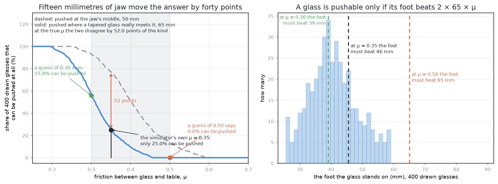
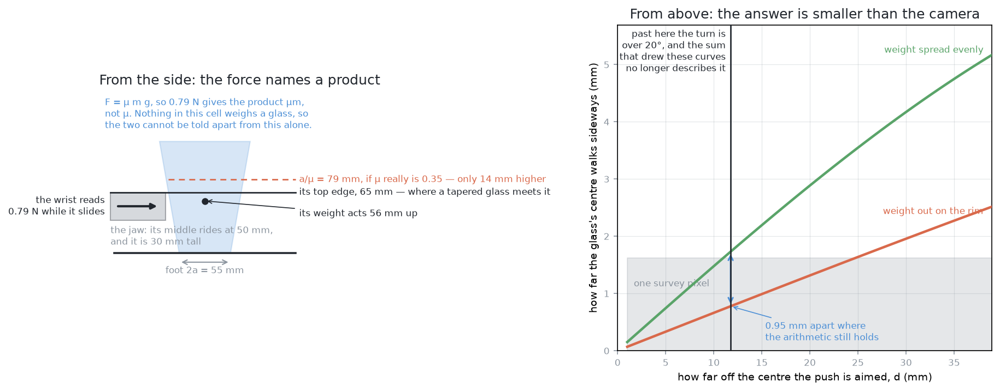
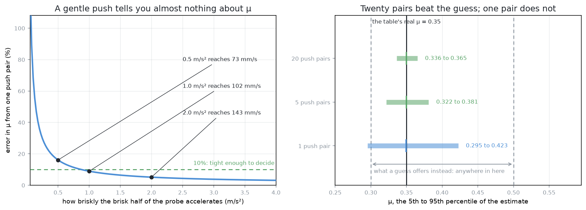
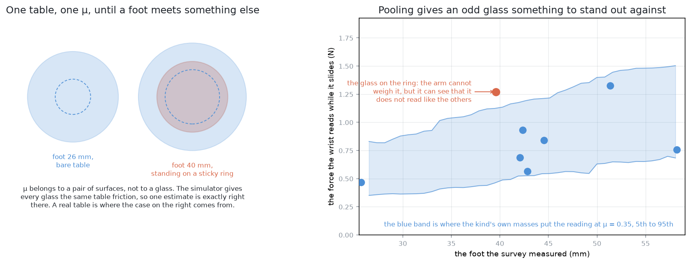
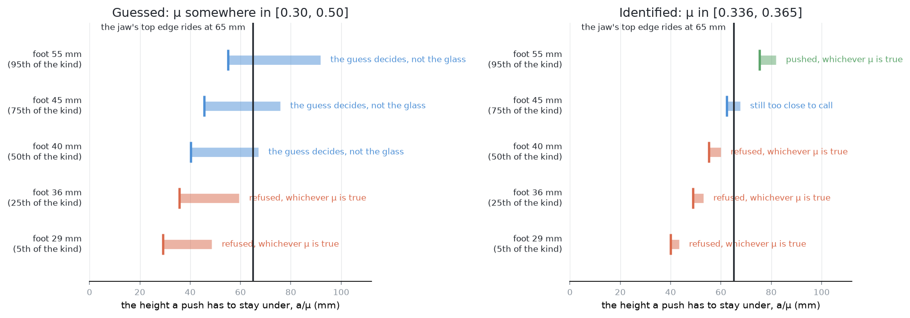

# Solution 9 — identify the contact parameters

*Programmed, with a fitted constant inside it. Every other solution in problem 3
works around not knowing the friction between a glass and the table. This one
goes and measures it, from pushes the arm was making anyway, and hands the
tipping check the number it has been guessing.*

> **The cell is described once, in [the cell](../../the-cell.md)** — the layout,
> the two places the camera works from, all four sensors, and the words this
> project uses them with. What follows is only what is specific to this
> solution.

## Introduction

This document is about one missing number and what it costs.

The rule that decides whether a glass may be pushed is
[`problem.md`](../problem.md)'s: a glass whose foot is `2a` across, standing on
a table it rubs against with friction `μ`, slides while it is pushed below
`a / μ` and tips over above it.

**The height that goes into that rule is 65 mm, and it is not the number most
people would write down.** The middle of the closed jaw rides at 50 mm, because
below that the gripper's own body is through the table. But the jaw is 30 mm
tall, so its top edge is at 65 mm, and a glass that is wider higher up — which
every tapered glass is, by definition — meets that top edge before it meets
anything else. `problem-3-sim/bench.py` says so in as many words, in the comment
on `JAW_TOP = PUSH_HEIGHT + FINGER_HEIGHT / 2`: "A glass that is wider higher up
meets the jaw here first, so this, not PUSH_HEIGHT, is how high it is pushed."
Every figure in this document uses 65 mm, and where it matters the document says
which of the two heights it means.

So a glass can be pushed at all only if `a / μ` is above 65 mm, and whether that
is true depends on `μ`.

**There is a definite answer, and the arm cannot see it.** The simulator this
problem is scored in sets one number for the friction between every glass and
the table: `TABLE_FRICTION = 0.35` in `problem-3-sim/bench.py`. It is applied
uniformly, to every glass, on every table, in every run. Nothing in the cell
measures it and no solution is told it. It is the ground truth a run is judged
against, not an input any decision may use.

That arrangement is unusual and it is worth pausing on, because it is what makes
this solution checkable rather than merely plausible. Every other solution in
problem 3 arranges itself around the gap. Solution 1 refuses to push.
Solution 2 pushes a fixed small amount and looks. Solution 4 puts a guessed `μ`
into the arithmetic and accepts that the answer is only as good as the guess.
Solution 5 learns how wrong that guess tends to be. This one estimates `μ`
itself, and then — uniquely — the estimate can be held up against 0.35 and
scored.

By the end of this document you will know what that is worth, as a number this
document computes rather than asserts. Over 400 glasses drawn from the project's
own spawner, **a guessed `μ` of 0.30 says 55.8% of them can be pushed, a guessed
`μ` of 0.50 says none of them can, and the simulator's real 0.35 says 25.0%
can.** Three glasses in four of this kind cannot be pushed at the height they
are really pushed at, and nothing in the cell can tell the arm that. You will
also know what a push can and cannot actually reveal, which is less than the
idea promises. The force the wrist reads gives friction multiplied by mass,
and this cell does not weigh a glass. Separating the two needs a second push made
deliberately faster than the first, and that push is in tension with every other
safety rule in the problem.

The honest summary sits at both ends. Knowing `μ` is worth a great deal. Getting
it is harder than it looks, and a document that promised a decimal point from
two nudges would be lying.

## The problem this solves

Problem 2 has ended. The arm knows where each glass stands and how wide its
flattened outline is. Some glasses are too close together for the gripper to
close on either, and the fix is to drag them apart with the closed gripper.

Before any push, one question has to be answered: will this push slide the glass
or tip it over? Toppling cannot be undone, so the answer has to be conservative,
and the whole check is the single inequality above.

The arm has two of the three quantities that inequality needs. It has `a`, half
the foot, from the survey. It has `h`, the push height, because it chose it, and
in practice `h` is 65 mm — the top edge of the jaw, which is what a tapered glass
meets. It does not have `μ`.

**`μ` is a property of a pair of surfaces, not of an object.** Glass on a clean
dry table is one number, glass on a wiped-but-still-damp table is another, and a
base with a rough unpolished ring on it is another again. `bench.py`'s own
comment puts glass on a dry wooden top somewhere between 0.2 and 0.5 and then
picks 0.35. Nothing available to the arm narrows that range.

So the arm currently does one of two things, and neither is satisfying. It picks
an optimistic `μ` and pushes glasses that topple. Or it picks a pessimistic `μ`
and refuses glasses it could have moved. The next section puts numbers on both
mistakes.

## What knowing μ is worth

The argument for this whole solution is one curve, and the curve is computed
rather than sketched. Four hundred tapered glasses are drawn from the project's
own spawner, `family("tapered_glass", 400, 0)` in `glasses/shapes.py`, which
draws each glass's height, rim and foot fraction at random inside the kind's
declared range. For each one, the question asked is the only one that matters
before a push: is `a / μ` above the jaw's top edge at 65 mm? The share that
answers yes is plotted against `μ`.

The left panel has two curves. The solid one is the real question, at the 65 mm
the glass is really pushed at. The dashed one is the same arithmetic at 50 mm,
where the jaw's middle rides, which is the height a careless tipping check would
use. The right panel shows why the solid curve has the shape it has.

### The closed form, and where the cliff is

Rearrange the pushability condition. `a / μ > 65` is the same as
`2a > 2 × 65 × μ`, so **a glass can be pushed at all only if its foot is wider
than `130 μ` millimetres**. At `μ` = 0.30 the foot must beat 39 mm. At the
simulator's 0.35 it must beat 46 mm. At `μ` = 0.50 it must beat 65 mm. The curve
is nothing more than the histogram of the kind's own feet, read at a threshold
that `μ` slides along.

That gives the cliff's position without any simulation at all. The kind's
declared range allows rims of 65 to 105 mm and foot fractions of 0.38 to 0.58,
so the narrowest foot it can produce is 24.7 mm and the widest is 60.9 mm.
Dividing each by 130 mm gives the two ends of the cliff directly: **below
`μ` = 0.190 every glass of the kind can be pushed, above `μ` = 0.468 none of them
can, and the whole collapse happens in between.**

**The simulator's 0.35 sits inside that collapse, past its half-way point.** The
widest foot the kind can produce is 60.9 mm, so at `μ` = 0.50 nothing whatever is
pushable — the pessimistic end of the ordinary guessing range is not a cautious
reading of the table, it is a reading under which the run cannot start.

Here is the solid curve as numbers. Read each row as: if the table's friction
were this, this share of the kind could be pushed at all, and a glass would need
a foot at least this wide to qualify.

| if `μ` were | share of the kind that can be pushed | the foot has to beat |
|---|---|---|
| 0.20 | 99.2% | 26.0 mm |
| 0.25 | 85.2% | 32.5 mm |
| 0.30 | 55.8% | 39.0 mm |
| **0.35 — the simulator's own value** | **25.0%** | **45.5 mm** |
| 0.40 | 9.5% | 52.0 mm |
| 0.45 | 1.0% | 58.5 mm |
| 0.50 | 0.0% | 65.0 mm |

Four things follow, and together they are the argument for this solution.

**The true answer is 25.0%, and it is a surprise.** Three glasses in four of this
kind cannot be pushed at all, at the height they are really pushed at. That is
the headline the arm has no way of reaching, and it changes what a run is: most
of the work is refusing, and the interesting question is which quarter can be
moved.

**The spread across the usual guessing range is 55.8 percentage points.** A `μ`
of 0.30 and a `μ` of 0.50 are both defensible guesses for glass on a table, and
they disagree about more than half the kind. One says the majority can be moved
and the other says nothing can.

**Guessing optimistically breaks glasses, and it breaks a lot of them.** A guess
of 0.30 authorises 55.8% of the kind. Only 25.0% of it is actually safe. **The
other 30.8 percentage points are pushes the checker approved that would tip a
glass over.** That is not a tail case. It is nearly a third of every table, and
the glasses concerned are exactly identifiable: their feet fall between 39.0 mm,
where the guess starts authorising, and 45.5 mm, where the truth starts allowing.

**Guessing pessimistically stops the run entirely.** A guess of 0.50 authorises
nothing at all, against 25.0% that are genuinely safe. A cautious engineer using
the upper end of the handbook would conclude that this cell cannot do its job,
and would be wrong about a quarter of it.

### Fifteen millimetres of jaw

The gap between the two curves in the left panel is worth its own paragraph,
because it is the same class of mistake as guessing `μ` and it is easier to make.

A tipping check written against the height the jaw's *middle* rides at would use
50 mm, and the multiplier would be 100 mm rather than 130 mm. At the true `μ` of
0.35 it would report that **77.0% of the kind can be pushed, when the answer is
25.0%**. That is **52.0 percentage points**, and every one of them is in the
dangerous direction: glasses declared safe that topple.

Two things make this worth stating rather than fixing quietly. The error is
larger than the one this whole document exists to remove — 52.0 points against
the 30.8 an optimistic `μ` costs. And nobody would think to measure it, because
the jaw's height is a property of the gripper rather than of the glass, and it
never appears in the inequality that people actually write down. **A constant
nobody thought to question is worth more than a constant everybody knows is
guessed**, which is an argument for identification generally and not only for
`μ`.

### The curve is not an accident of one draw

Every figure above comes from one draw of 400 glasses, so the obvious objection
is that it describes that draw rather than the kind. It does not, and the check
is cheap: redraw the family at five other seeds and read the same four points off
each. These are measured here, by this document's own generator, over
`family("tapered_glass", 400, seed)` for seeds 0 to 5, all at 65 mm.

Read each row as the range the share took across those six independent draws.

| if `μ` were | share of the kind that can be pushed, across six draws |
|---|---|
| 0.30 | 52.0% to 59.0% |
| **0.35 — the simulator's own value** | **23.8% to 28.7%** |
| 0.40 | 8.2% to 11.5% |
| 0.50 | 0.0% to 0.0% |

The sampling noise is two or three points and the structure is not noise at all.
Not knowing `μ` leaves the arm unable to tell a world where more than half the
glasses can be moved from one where none of them can.

The same draws give the cliff a one-line statement. The median foot of the kind
is 39.5 to 40.6 mm, so **the median glass stops being pushable somewhere above
`μ` = 0.304 to 0.312**. Half the kind lives on each side of that line, and the
simulator's 0.35 is past it.

### How accurate the estimate has to be

Having an estimate is not the same as having a useful one, and the steepness of
the curve near the truth is what makes the difference.

**Between `μ` = 0.35 and `μ` = 0.40 the share falls 15.5 points**, over a span of
`μ` that most people would call the same guess. Measured across the band 0.325 to
0.375, which is where the truth sits, **the curve falls 4.5 percentage points for
every 0.01 of `μ`.** The steepest part of the whole curve is a little below
that, near `μ` = 0.295, where it falls 8.0 points per 0.01.

Turn that round and it says how tight the estimate has to be. Read the next table
as: to know the share of the kind that can be safely pushed to within this many
points, `μ` has to be known to within this much.

| to know the share to | `μ` must be known to | as a share of 0.35 |
|---|---|---|
| ±5 points | ±0.011 | ±3.1% |
| ±10 points | ±0.022 | ±6.3% |

Those are demanding numbers. An estimate good to ±0.05, which sounds respectable
for a friction coefficient, leaves the share of the kind in doubt by more than
twenty points. This is the sense in which a guess is worth least exactly where
the truth lies.

Whether that precision is reachable is the subject of [how wide the answer comes
out](#how-wide-the-answer-comes-out-and-how-close-to-035) below. The short
answer is that a handful of pushes cannot deliver it and a few runs' worth can.

## What system identification is

**System identification means fitting the constants of an equation you already
believe, using measurements of the system behaving.** The shape of the answer is
settled in advance by physics; only its size is in question.

That is worth setting against the two neighbours it sits between, because the
comparison is the reason to choose it.

**Analytical modelling** writes the equation and then takes its constants from a
handbook or a supplier's data sheet. It costs nothing and runs instantly. It is
wrong by however wrong the handbook is about your particular pair of surfaces,
and it has no way of finding out. That is exactly the position problem 3 is in
now: 0.2 to 0.5 from the handbook, 0.35 in the room, and no way to tell.

**Machine learning** fits an arbitrary function to examples and supplies no
equation at all. It can capture effects nobody can write down. It pays for that
with a training set large enough to discover the *shape* of the relationship as
well as its size, which for anything with several inputs means thousands of
examples, and with an answer that cannot be inspected.

System identification keeps the equation and fits a handful of numbers. Because
the shape is given, the data needed is counted in tens rather than thousands, and
the fitted numbers mean something outside the model that produced them: the `μ`
this method returns is the same `μ` the tipping check wants, and the same `μ` the
simulator was configured with. Its weakness is inherited from the equation. **If
the model is wrong, identification returns confident wrong constants, and it
returns them with a decimal point.**

That is the trade. Fewer data, an interpretable answer, and an assumption you
have to be willing to defend.

## What one push actually measures

Every push in problem 3 already produces three things without any extra work: a
picture of the table before, the commanded motion, and a picture of the table
after. The wrist force-torque sensor adds the force that kept the glass sliding,
at 100 readings a second. The question is what those can be read for.

Three quantities are candidates, and they are not equally available. The
difference between them is the most useful part of this document.

The glass in that picture is a real one, drawn by the spawner: a foot 55.1 mm
across, 119.5 mm tall, a rim 97.0 mm across, weighing 229 g with its weight
acting 55.7 mm above the table. It is 77.9 mm wide where the jaw's top edge meets
it. All of those come from the project's own shell model, the same one the
simulator is handed. None of them is known to the arm. It is a wide-footed glass
by the standards of its kind, which is why it can be pushed at all: at the
simulator's 0.35 its ceiling is 78.6 mm, which clears the jaw's top edge by
13.6 mm.

### The force names a product, not a coefficient

While a glass slides at a steady speed, the horizontal force the gripper applies
exactly balances the friction under the foot. So the wrist reads

    F = μ m g

with `m` the glass's mass and `g` gravity. On the glass above, on the
simulator's table at `μ` = 0.35, that is 0.785 N.

One reading, two unknowns. **The wrist measures the product `μm`, and nothing in
this cell weighs a glass.** Problem 3 is defined so that the arm never lifts
anything, and lifting is the one operation that would settle the mass.

So the reading has to be turned into a range for `μ` using whatever is known
about the mass, and all that is known is the kind's declared range. Building
every glass the range allows and running the project's own mass model over them
gives **88 g at the lightest and 492 g at the heaviest, a factor of 5.62**. The
400 actually drawn come out between 97 g and 453 g, a factor of 4.65.

Put the 0.785 N reading through that. It gives `μ` somewhere in **[0.163,
0.914]**. That interval contains the whole plausible range of `μ` and a good deal
besides. It decides nothing at all.

This is where the idea has to be rescued or abandoned. A single steady push tells
you almost nothing about the friction, because the mass ambiguity is larger than
the question.

### The turn would name the spread of the weight, if anyone could see it

The second candidate is not `μ` at all. It is how the glass's weight is spread
over the foot it stands on, which decides how a push that misses the centre turns
the glass as well as moving it.

The standard quasi-static treatment of planar pushing reduces that spread to one
length, usually written `c`. For a foot of radius `R` carrying its load evenly,
`c` is `(2/3)R`. For a foot that has worn so that it rests on its outer edge, `c`
is `R`. A push of length `L` offset by `d` from the centre of the foot then turns
the glass through `L d / c²` radians, about a point `c² / d` away. On the glass
above, `c` is 18.4 mm if the weight is spread evenly and 27.5 mm if it sits out
on the rim, so the two hypotheses are far apart and ought to be easy to tell
between.

They are not, and the reason is the measurement rather than the physics. **A
drinking glass seen from straight above is a circle, and a circle looks the same
whichever way round it is.** There is no feature in the overhead picture whose
rotation could be read, so the turn itself is not observable in this cell.

What is observable is the consequence of the turn: the glass's centre does not
travel straight along the push, it walks sideways. The right panel of the picture
plots that sideways walk against how far off-centre the push was aimed, for both
hypotheses.

Read it against the grey band, which is one pixel of the survey view, 1.62 mm on
the table. The two curves have to be further apart than that band before the
camera could tell them apart at all.

They are not, over the range where the arithmetic that drew them holds. The
relation above assumes the offset `d` stays roughly constant through the push,
which stops being true once the glass has turned much. Past about 20 degrees it
is no longer describing what happens. **The turn passes 20 degrees at an offset
of 11.8 mm, and at that offset the two hypotheses differ by 0.95 mm — 0.59 of one
survey pixel.** Push further off-centre and the gap grows, but only to 2.65 mm,
or 1.64 pixels, at the widest offset the gripper could manage, and by then the
predicted turn is 66 degrees and the prediction is worthless.

The conclusion is unwelcome and worth stating plainly. **In this cell, with this
camera and this kind of glass, the spread of the weight over the foot cannot be
identified from a push.** The published method is sound. The measurement it needs
is below this camera's resolution before the systematic error from splay is even
counted. Anyone building this should drop `c` from the list rather than fitting
it and believing the answer.

### The finger's own friction hardly shows at all

The third candidate is the friction between the silicone pad and the glass wall,
which is a different pair of surfaces again. The simulator sets it at 0.6, in
`bench.py`'s `JAW_FRICTION`, and the arm is not told that either.

A push reveals it only when the pad **slips** across the glass. If the pad
sticks, all that has been shown is that the finger friction was at least enough
to transmit the push, which is a lower bound and not a measurement. Since the
gripper is deliberately run so that it does not slip, the informative event
almost never happens.

Treat this one as bounded rather than estimated. It is the least identifiable of
the three, and fortunately it is also the one the tipping check does not use.

## Separating μ from the mass needs a second kind of push

The force route gave a product. Getting `μ` out of it needs a second equation,
and the classical way to get one is to change the input on purpose and see what
changes in the output. In control engineering that idea has a name: **persistent
excitation**, which means the inputs have to vary enough for the parameters to
separate. Inputs that never vary leave the parameters tangled together no matter
how many measurements are taken.

The variation available here is the speed of the push, because the arm commands
the trajectory and therefore knows it exactly.

### The arithmetic

A glass sliding at a steady speed needs only the friction. A glass being
accelerated needs the friction plus the force to accelerate its own mass:

    steady:       F₁ = μ m g
    accelerating: F₂ = m (μ g + a)

Two readings, two unknowns, and the mass divides out:

    μ = a F₁ / ( g (F₂ − F₁) )

So the probe is one push in two halves. The first half slides at a steady 20 mm a
second, which is where `F₁` is read. The second half accelerates away from that
speed at a commanded `a`, which is where `F₂` is read. The whole thing is 10 mm
long, which is the same nudge solution 2 already makes.

### What it costs

The estimate divides by the *difference* between two force readings, and that is
where its accuracy lives. A gentle acceleration makes the difference small, and a
small difference magnifies whatever noise is on the readings.

The cell specifies the wrist sensor's rate — 100 readings a second — but not its
noise, so a figure has to be assumed and the sensitivity quoted against it. Take
0.05 N on one reading of one channel. The steady half of the probe lasts a
quarter of a second and so yields 25 readings, which average down to 0.010 N. The
accelerating half is shorter and yields fewer.

Read the next table as: at this acceleration, the probe's second half reaches this
speed, the force rises from the steady 0.785 N to this, and the resulting
estimate of `μ` from that one push pair is wrong by about this much.

| acceleration | speed reached | force during it | error in `μ` |
|---|---|---|---|
| 0.10 m/s² | 37 mm/s | 0.808 N | 68% |
| 0.50 m/s² | 73 mm/s | 0.899 N | 16% |
| 1.00 m/s² | 102 mm/s | 1.014 N | 9% |
| 2.00 m/s² | 143 mm/s | 1.242 N | 5% |
| 4.00 m/s² | 201 mm/s | 1.700 N | 3% |

The left panel below is that table as a curve, so the shape of the trade is
visible: the error falls away steeply at first and then flattens, so there is
little reward for pushing harder than about 1 m/s².

Two costs are real and one that looks real is not.

**Quasi-static reasoning is what gets given up.** Everything else in problem 3
assumes the push is slow enough that momentum does not matter — let go and the
glass stops rather than sliding on. A probe at 1 m/s² leaves the glass moving at
about 100 mm a second, which is five times the ordinary push speed. That is not
fast in absolute terms, but it is fast enough that the assumption has to be
re-examined rather than assumed.

**Stopping is the dangerous half, not starting.** A sliding object allowed to
decelerate under friction alone pitches its load forward onto the leading edge of
its foot, which is the same effect as a car nose-diving under braking. The
condition for that to tip the object is `μ` above `a` divided by the height of
its centre of mass, which for the narrower glasses of this kind is easily met. It
does not usually tip them, because a quasi-static push carries so little momentum
that the glass rocks and settles. A faster probe carries more. So the probe
should accelerate and then be brought down gently, not stopped dead.

**Accelerating mostly does not make the forward topple worse, and where it does
the amount is small.** Working the moment balance through, the centre of pressure
under the foot sits at `μ h + (h − h_cm)(a / g)` from the foot's centre, where
`h_cm` is the height of the glass's own centre of mass. At zero acceleration that
reduces to `μ h` and recovers the familiar `h < a / μ`. The acceleration term
carries the factor `h − h_cm`, and with `h` now 65 mm, **71.8% of this kind has
its centre of mass above the push height**, so for those the factor is negative
and accelerating pulls the pressure back towards the middle of the foot.

For the remaining 28.2% the factor is positive, and the largest it gets over the
kind is 20.5 mm. That shifts the centre of pressure by **2.09 mm at the 1 m/s²
the probe actually uses, and by 8.34 mm at 4 m/s²**, against a half-foot of 12.8
to 29.5 mm. At the probe's own acceleration this is small even on the narrowest
glass. At 4 m/s² it is a third of the way to the edge of a narrow foot, which is
one more reason not to push harder than the error curve rewards.

### How wide the answer comes out, and how close to 0.35

One push pair is not enough, and the right panel of the picture says by how much.
Each row is 4000 simulated runs in which the pairs land on glasses drawn from the
kind, each carrying its own real mass, with the assumed force noise applied to
every reading. The bar is the 5th to 95th percentile of the estimate, and the
vertical line is the simulator's 0.35.

Read the table as: with this many push pairs behind it, the estimate lands in
this range, its middle is off the true value by this much, and the range is this
wide compared with the true value.

| push pairs | `μ` lands in | middle is off 0.35 by | width, as a share of 0.35 |
|---|---|---|---|
| 1 | 0.295 to 0.423 | 0.2% | 36% |
| 5 | 0.322 to 0.381 | 0.0% | 17% |
| 20 | 0.336 to 0.365 | 0.0% | 8% |

Two things in that table deserve to be separated, because confusing them is the
classic way to oversell an estimator.

**The estimate is unbiased, and that is the easy half.** The middle lands on 0.35
essentially exactly even from one pair, because the arithmetic relating the two
forces to `μ` is correct and the noise is symmetric. Nothing here is systematically
wrong.

**The estimate is wide, and that is the half that matters.** From one pair it
runs from 0.295 to 0.423. That is no narrower than the guessing range it was
meant to replace, so a single probe has bought nothing but confidence. Five pairs
cut it to about a sixth of the guessing range, and twenty pairs — about four
ordinary runs' worth of pushes — cut it to 0.336-to-0.365.

**A handful of pushes does not pin the friction down. A run's worth of them does,
and a few runs' worth does it well.** Anything that promised a number from two
nudges would be selling the method's reputation rather than its arithmetic.

### Is that precision enough to make the check honest?

[How accurate the estimate has to be](#how-accurate-the-estimate-has-to-be) asked
for `μ` to ±0.011 before the share of the kind that can safely be pushed is known
to ±5 points. Here is what that costs in pushes. Read each row as: with this many
push pairs, the estimate is this tight, and the share of the kind is therefore
known to about this.

| push pairs | half-width of the `μ` interval | the share is known to |
|---|---|---|
| 10 | ±0.0204 | ±9.3 points |
| 20 | ±0.0145 | ±6.6 points |
| 40 | ±0.0105 | ±4.8 points |
| 80 | ±0.0071 | ±3.2 points |

**About forty push pairs is where the check becomes honest to within five
points**, and forty pairs is roughly eight runs' worth of pushes on a table of
five or six glasses. Twenty pairs gets close. Ten does not.

Two consequences worth being blunt about. **The estimate has to persist between
runs**, because no single run makes enough pushes, which is what the file of a
few numbers and a covariance matrix is for. And **on a real table the forgetting
factor fights this**: evidence old enough to be forgotten is evidence not
counted, so a table that changes often can never be known to ±0.011, and the
honest response there is a wider interval and a more pessimistic check rather
than a longer memory.

## What the pushes that already happened prove

There is a second source of evidence about `μ` that costs nothing at all, and it
needs separating carefully from the force route, because it is easy to overstate.

**A glass pushed at height `h` that did not tip proves `μ < a / h`.** No
measurement is needed beyond noticing that it is still standing. On the glass in
the worked picture, with a foot of 55.1 mm pushed at 65 mm, surviving the push
proves `μ < 0.423`.

That is genuinely free, and it is in exactly the currency the decision needs: the
question the checker asks is always whether `μ` is below `a / 65` for some other
glass, and this evidence has the same form.

The catch is that it is usually **confirmatory rather than sharpening**. Under a
policy that only pushes what the current pessimistic `μ` already allows, the
bound a push returns is the bound that authorised it. Nothing new is learned.

It sharpens in exactly three situations, and they should be named rather than
glossed over.

**The run started with a deliberately loose floor.** If the checker begins at a
conservative `μ` of 0.60 rather than at a handbook guess, the first successful
push on a wide-footed glass immediately beats it.

**A glass turned out narrower than the survey said.** The push was riskier than
intended, so the bound it returns is tighter than the one that authorised it.
That is evidence bought by accident, and it should be recorded rather than
discarded.

**A push was made on purpose at a height the current bound would not have
allowed.** That is an experiment with a real risk attached, and it needs somebody
to have accepted it.

There is a ceiling on what this evidence can reach, and it is instructive. On the
simulator's table, the narrowest foot in the 400 that survives a push at 65 mm is
45.5 mm, and that glass proves `μ < 0.350`. The best bound the no-tip route can
ever give is the true value itself, reached by the one glass sitting exactly on
the edge — which is the glass nobody should be pushing to find out.

## The estimator

With the two evidence sources settled, the estimator is the small part.

### Least squares, and then recursive least squares

The plain version writes one row per push and solves for the unknowns in the
least-squares sense, which means choosing the constants that make the total
squared disagreement between predicted and measured forces as small as possible.
For a handful of unknowns this is a few lines of NumPy and runs in well under a
millisecond.

**Recursive least squares** is the better shape for a robot. Instead of keeping
every push ever made and re-solving from scratch, it carries the current estimate
and a matrix saying how sure it is, and updates both when a push arrives. The
update is algebraically identical to re-solving over everything, so nothing is
lost, and the memory does not grow with the length of the run.

Why this rather than the obvious alternative of just re-solving? Two reasons. The
cost stops depending on how long the cell has been running, which matters for
something meant to run all day. And the estimate carries its own confidence as a
first-class object rather than as an afterthought, which is what the next section
needs.

A **Kalman filter** is the same machinery with a model of how the quantity itself
moves between measurements. In the simulated cell the friction is a constant, so
the filter reduces almost exactly to recursive least squares. The useful knob it
brings matters on a real table rather than this one: a **forgetting factor**,
which weighs recent pushes more than old ones. Set so that evidence a few hundred
pushes old has faded, a table that gets wiped mid-shift is tracked rather than
averaged in with everything before it.

What it costs: one more parameter to choose, and a wrong choice is invisible. Too
much forgetting and the estimate chases noise. Too little and it takes hours to
notice a real change.

### Why the answer has to be an interval

A single number would throw away the only property that makes this solution safe
to use.

Every estimate above arrived with a width. The force route's width comes mostly
from not knowing the mass, and it narrows as pushes accumulate. The no-tip route
gives a one-sided bound and nothing else. The right way to combine them is to
keep an interval, or better a distribution, and let each new piece of evidence
narrow it.

**Bayesian linear regression** does this directly: it returns a distribution over
the fitted constants rather than a point, so the width comes out of the
arithmetic instead of being bolted on. scikit-learn ships one. The cost is that
it needs a prior — a statement of what was believed before any pushes — and a
badly chosen prior is a thumb on the scale that nobody can see afterwards. State
it explicitly and keep it wide.

### The pessimistic end is the one the check may use

This is the design decision that makes the whole solution acceptable, and it is
worth one line.

**The tipping check uses the largest `μ` the evidence still allows, never the
middle and never the smallest.**

That is not a more accurate system. It is a safer one. A `μ` at the pessimistic
end refuses some glasses that could have been moved, and refusing a glass is a
result this project explicitly asks for. A `μ` at the optimistic end pushes
glasses that topple, and a toppled glass ends the run.

Two further rules follow from the asymmetry. **The identified `μ` may never go
below a fixed floor** until the interval is narrow, so that a few flattering
pushes cannot unlock the whole table. And **loosening the check needs more
evidence than tightening it**, because the two errors do not cost the same.

## Per object, or per table

Everything so far has quietly assumed one `μ` for the whole table. That
assumption is worth its own section, because it decides whether this is a
per-glass experiment or a once-per-run one, and the difference is most of the
cost.

### In the simulated cell, per table is the right answer and the only answer

`bench.py` sets `TABLE_FRICTION = 0.35` once, at the top of the file, and applies
it to the table surface that every glass stands on. There is no per-glass
friction in the model at all.

That settles the question for this cell, and it settles it in a way worth stating
bluntly. **Every push anywhere on the table is evidence about the same single
number. An estimate per table is exactly the right granularity, and an estimate
per glass would be fitting noise.** A per-glass estimator run against this
simulator would produce a scatter of values whose spread came entirely from force
noise and mass variation, and it would be impossible to tell that from a real
effect, because there is no real effect to find.

That also changes the economics of the whole solution. Three pushes on one glass
is noise. **Twenty pushes across the run, pooled, is the 0.336-to-0.365 interval
from the table above.** The experiment stops being something the arm repeats per
glass and becomes something the run accumulates for free.

**What would have to change in `bench.py` before a per-glass estimate could be
validated at all.** The friction would have to move from the table geometry to
the individual glass bodies, so that each spawned glass carried its own
coefficient, drawn from a distribution the way its size is. Then a per-glass
estimator would have something to recover and could be scored against it. Until
that exists, a per-glass estimator built here is untestable, and untestable is
worse than absent.

The spread of the weight over the foot, `c`, is the one quantity that genuinely
is per glass, because it depends on that glass's own base. Since an earlier
section showed it cannot be measured in this cell at all, that is a cost this
cell does not have to pay.

### What a real table would do differently

A real table is not one surface with one number, and the three ways it departs
are worth naming in order of how likely they are.

**Something is under one foot.** A ring of dried liquid, a crumb of sugar, a film
of water left by a cloth. Any of these makes that one glass's pair of surfaces
different from every other glass's. The direction is not predictable: a sticky
residue raises `μ`, and a film of water on a smooth surface can lower it. A
document that asserted which would be guessing.

**One glass's base is finished differently.** Two glasses of the same kind can
come out of different moulds, and a sand-blasted or unpolished base grips
noticeably harder than a fire-polished one. This one is per glass and persistent,
so it will not go away between runs.

**The table itself changes.** A wipe is the obvious case, and it changes `μ` for
every glass at once while announcing nothing. This is the case the forgetting
factor exists for, and the only one of the three that keeps a per-table estimate
as the right shape.

So the honest position is: per table is right for the cell as it stands and right
for most of what a real table does, and the per-glass machinery below is
insurance against the first two cases rather than something this simulator can
justify.

### How the arm would notice a glass that did not belong

The pooled estimate gives a per-glass reading something to be compared against,
and that comparison is the whole detection mechanism.

The right panel of the picture is what the arm can actually plot. The horizontal
axis is the foot width the survey measured, which the arm has. The vertical axis
is the force the wrist read, which the arm has. The shaded band is where the
kind's own masses put that reading, computed over all 400 drawn glasses at
`μ` = 0.35.

The band is wide, because mass and foot width are only loosely related — the
correlation over the 400 is 0.58, so measuring the foot barely narrows the mass.
At a foot of 40 mm, the kind's own masses put the reading anywhere between 0.40 N
and 1.33 N, a spread of 27% about a middle of 0.79 N. A per-glass anomaly has to
clear that before it means anything.

Read the next table as: if one glass's own `μ` were this multiple of the table's,
a glass of ordinary weight for its foot would read this, which is this many
spreads from the middle of the pool. The figures are quoted for an ordinary
weight on purpose — quoting them for a heavy glass would make the same sticky
ring look more obvious than it is.

| that glass's own `μ` | the wrist reads | spreads from the middle |
|---|---|---|
| 1.2 × the table's, so 0.42 | 0.95 N | 0.7 |
| 1.4 × the table's, so 0.49 | 1.11 N | 1.5 |
| 1.6 × the table's, so 0.56 | 1.27 N | 2.2 |
| 2.0 × the table's, so 0.70 | 1.59 N | 3.7 |

Those numbers are more sobering than the idea suggests. A glass gripping 20%
harder than its neighbours sits 0.7 spreads out, which is invisible. A glass
gripping 60% harder sits 2.2 spreads out, which on a table of five glasses will
happen by chance often enough to be a suspicion rather than a finding. **Only a
glass whose friction has roughly doubled clearly leaves the pool.** The ordinary
push is a weak detector, because what it measures is the product and the mass is
the larger part of the uncertainty.

**Repeating the ordinary push does not help, and it is worth saying why.** The
mass is the same both times, so both readings carry the same error, and averaging
them narrows nothing. The pool's width comes from not knowing the mass, and no
number of steady pushes on one glass learns the mass.

**The probe does help, because the mass divides out of it.** Run the two-speed
probe on the suspect glass and it returns that glass's *own* `μ` rather than its
`μm`. A probe on a glass whose friction is really 0.56 returns 0.56 to about
±0.049, so the gap from the pooled 0.35 is 4.3 times the probe's own uncertainty,
which is a finding. On a glass whose friction is 0.42 it returns ±0.037 and the
gap is 1.9 times the uncertainty, which is a second suspicion and an argument for
a second probe.

So the detection rule has two stages, and the second is the one that decides. The
pool flags a glass whose reading is unusual. The probe settles whether the
unusual part is its weight or its contact.

### Partial pooling

The general form of this is standard statistics and the name is worth knowing:
**partial pooling**, or a **hierarchical model**. Instead of choosing between one
shared `μ` and a separate `μ` per glass, fit both: a shared value, plus a
per-glass offset held near zero unless that glass's own pushes argue otherwise.

What it buys is that the choice stops being a choice. A glass with two pushes
behind it is described almost entirely by the pool, because two pushes cannot
outvote twenty. A glass with a dozen pushes that all disagree with the pool drifts
away from it. Nobody has to decide in advance which regime the table is in.

What it costs is a hyperparameter — how strongly the offsets are pulled towards
zero — and one more thing that can be set wrong without anybody noticing. **For
this cell, use full pooling.** The simulator has one friction, so every offset
the model fits is noise, and the hyperparameter has nothing real to trade off
against. Add the offsets on the day the friction moves onto the glasses, or on
the day this leaves the simulator.

## The feedback loop

The interval is not just an output. It is what decides what the arm does next,
and that is what makes this a loop rather than a calculation.

The rule is short. **Spend a probe only when the interval's two ends disagree
about something that has to be decided.**

Concretely: a glass has to be moved, its foot is `2a`, and the checker finds that
the optimistic end of the interval would authorise the push while the pessimistic
end would refuse it. That glass is stuck. No amount of further reasoning settles
it, because the disagreement is about a number nobody has measured. A probe is
then worth its cost, because it can change the answer.

The probe is a 10 mm push into clear table, with the jaw as low as it goes, on
the widest-footed glass available — the glass with the most margin, and so the
least to lose. Note that putting the jaw as low as it goes still lands the push
at 65 mm on a tapered glass, so a probe on a narrow-footed glass is not made safe
by lowering the arm. Its two halves are the steady half and the brisk half described above.
Its purpose is not to separate anything. It is to measure.

**When not to spend one.** If both ends of the interval agree, the probe cannot
change a decision and it is fifteen to twenty seconds of arm time for nothing. If
the glass does not need to move, the same applies.

**When to spend one anyway.** At the start of a run on a table that has been
sitting since yesterday, or that somebody may have wiped. In the simulator that
never happens, because the friction is a constant; on a real table it is the main
reason the estimate goes stale, and one probe at the start is cheap insurance.

The loop has an exit, and it is the same exit every other solution in problem 3
has. A glass that cannot be pushed safely is reported with the reason, and a
glass whose interval will not narrow enough to authorise it is reported the same
way. **Refusing is a result, not a failure.**

## A worked example

This follows one real glass, drawn by the spawner, through the whole thing, and
then checks the answer against the number the simulator was configured with.

**The glass.** Index 43 of `family("tapered_glass", 400, 0)`: a foot 55.1 mm
across, 119.5 mm tall, a rim 97.0 mm across, weighing 229 g. It is 77.9 mm wide
where the jaw's top edge meets it. The arm knows the foot and the position from
the survey. It knows none of the rest.

**The state before.** The estimate stands at the guessing range, `μ` somewhere in
[0.30, 0.50]. Half the foot is 27.53 mm, so the tipping ceiling `a / μ` is
between 55.1 mm and 91.8 mm. The jaw's top edge is at 65 mm. **The pessimistic
end refuses this glass by 10 mm and the optimistic end allows it with 27 mm to
spare.** That is exactly the disagreement the loop spends a probe on.

**The probe.** A 10 mm push into clear table. The first 5 mm slide at a steady
20 mm a second and the wrist averages 25 readings to 0.785 N. The second 5 mm
accelerate at 1.0 m/s², reaching 102 mm a second, and the wrist averages 8
readings to 1.014 N.

**The arithmetic.** The difference is 0.229 N. Putting the two readings into
`μ = a F₁ / (g (F₂ − F₁))` gives 0.35. The uncertainty from one pair on a glass
this light is about 9%, so the honest statement after one probe is `μ` in roughly
[0.32, 0.38].

**Checked against the simulator.** `bench.py` set the table to 0.35. The estimate
is 0.35 and the interval contains it. That is the right result, and it should be
read with the whole of the section above it in mind: the estimate is unbiased, so
a single probe lands on the true value on average, and the interval it comes with
is wide enough that a single probe is not by itself proof of anything. Over 4000
simulated single probes the answer ran from 0.295 to 0.423.

**What the steady reading alone would have given.** 0.785 N over the kind's
declared mass range of 88 to 492 g gives `μ` in [0.163, 0.914]. That is worth
seeing beside the line above, because it is the whole argument for the second
half of the probe. The brisk half is not a refinement. It is the thing that makes
the measurement a measurement.

**The free bound.** The glass did not tip, so `μ < 27.53 / 65 = 0.423`. That is
consistent with the estimate and adds nothing to it, which is the usual outcome
and the reason the earlier section was careful about it.

**The verdict on this glass.** At the pessimistic end of 0.38, the ceiling is
27.53 / 0.38 = 72.2 mm, against the jaw's top edge at 65 mm. The push is
authorised with 7.2 mm of margin. Under the guessing range it would have been
refused. The measurement moved it.

**The verdict on the next glass, which is the point.** The arm turns to a glass
with a 42 mm foot. Under the optimistic guess of 0.30 its ceiling would be
70.0 mm, comfortably above the jaw's top edge, and a checker using that guess
would authorise the push. **The simulator's real 0.35 puts its true ceiling at
60.0 mm, five millimetres below where the jaw meets it, so that push topples
it.** At the identified pessimistic end of 0.38 the ceiling is 55.1 mm, well
below 65, and the glass is refused. The guess would have broken it. The
measurement will not.

That glass is not unusual. **Feet between 39.0 mm and 45.5 mm are exactly the
band an optimistic guess authorises and the real friction topples, and 30.8% of
the kind falls in it.**

**And the cost of being careful, stated honestly.** A third glass has a 47 mm
foot. Its true ceiling at 0.35 is 67.1 mm, so a push at 65 mm would have been
safe with 2.1 mm to spare. The identified pessimistic 0.38 puts its ceiling at
61.7 mm and refuses it. That refusal is wrong, and it is the price of using the
pessimistic end. It costs one glass left where it stood and a line in the report,
which is the cheap error rather than the expensive one.

## How the verdict changes as μ is pinned down

The point of the whole exercise is what happens to individual glasses, so here
are five real ones, chosen at the 5th, 25th, 50th, 75th and 95th percentiles of
the kind's foot width.

Each bar is the range of tipping ceilings consistent with the current interval
for `μ`, and the vertical line is the jaw's top edge at 65 mm. A bar entirely to
the right of the line means the glass can be pushed whatever `μ` turns out to be.
A bar entirely to the left means it is refused whatever `μ` turns out to be. A
bar crossing the line means the glass's fate is being decided by the uncertainty
rather than by the glass.

Read the table the same way. The last column is the ceiling across the identified
interval after twenty push pairs, from its optimistic end to its pessimistic one.

| glass | foot | ceiling at `μ` = 0.30 | ceiling at `μ` = 0.50 | ceiling across [0.336, 0.365] |
|---|---|---|---|---|
| 5th percentile | 29.1 mm | 49 mm | 29 mm | 43 to 40 mm |
| 25th percentile | 35.7 mm | 59 mm | 36 mm | 53 to 49 mm |
| 50th percentile | 40.3 mm | 67 mm | 40 mm | 60 to 55 mm |
| 75th percentile | 45.5 mm | 76 mm | 45 mm | 68 to 62 mm |
| 95th percentile | 55.1 mm | 92 mm | 55 mm | 82 to 75 mm |

**Three of these five were decided by the guess rather than by the glass. After
identification, one is.** Two of the three resolve, and they resolve in opposite
directions: the 95th-percentile glass is confirmed safe, and the 50th-percentile
glass — the median of the kind — turns out to be refused, because its ceiling
across the identified interval runs from 60 mm down to 55 mm and never reaches
the 65 mm the jaw meets it at. That second one is the more valuable answer, and
it is the one a guess of 0.30 would have got wrong.

The 75th-percentile glass, with its 45.5 mm foot, remains on the line: its
ceiling runs from 68 mm down to 62 mm, so 65 mm falls inside it. That is what a
measurement that has narrowed a question without quite closing it looks like, and
it should be reported as a near thing rather than as a clean verdict. Another
twenty pairs would close it.

Across the whole kind, the identified interval authorises 19.2% of it at the
pessimistic end and 32.8% at the optimistic end, against a true 25.0%. Set that
beside the alternatives. A guess of 0.30 authorises 55.8% and topples nearly a
third of the kind. A guess of 0.50 authorises nothing at all and the run does not
start. **The measurement brackets the truth from both sides, and its pessimistic
end is six points short of it rather than thirty points past it.**

## What it needs

**From the cell**, all of which exists: the wrist force-torque sensor at 100 Hz,
the survey view for before-and-after positions, and the arm's own commanded
trajectory.

**Software.** [NumPy](https://numpy.org/) (BSD-3-Clause) for the solve, which is
the whole of the plain version. [SciPy](https://scipy.org/) (BSD-3-Clause) if the
fit is ever made nonlinear. [scikit-learn](https://scikit-learn.org/)
(BSD-3-Clause) for the Bayesian linear fit, which returns the interval directly
rather than needing it derived.

**No training run.** There is no data campaign, no weights file and no graphics
card. What persists between runs is a few numbers and a covariance matrix, which
fit in a small text file.

**A way to be scored, which this solution alone has.** `problem-3-sim/bench.py`
sets `TABLE_FRICTION = 0.35` and no approach is told it, so the estimator can be
checked against a true value it never saw: run the cell, and see whether the
interval contains 0.35 and how fast it narrows. Nothing else in problem 3 has a
ground truth this clean, because nothing else in problem 3 produces a number that
the simulator also holds.

**One honest omission.** Everything above uses an assumed 0.05 N of noise on one
wrist reading, because the cell's specification gives the sensor's rate and not
its noise. That number should be measured before any of the error figures here
are believed, and it is a half-hour job: hold the gripper still and log the
channel.

## Where the idea comes from

**System identification** is the parent field and it is old and well settled. Its
standard reference is Lennart Ljung's *System Identification: Theory for the
User* (1987, second edition 1999), which sets out the least-squares and recursive
forms properly. For an overview, see [system
identification](https://en.wikipedia.org/wiki/System_identification).

It is used wherever a controller has to work against a plant whose constants
nobody wrote down: process control, aircraft, engines, and robot arms, where
identifying the link masses and inertias from a few commanded motions is routine
practice. It is rarely right where the model itself is in doubt, because it
cannot tell you the equation is wrong, only which constants fit it best.

**Recursive least squares** and the **Kalman filter** are the online forms.
Recursive least squares updates a fit as data arrives instead of re-solving; see
[recursive least
squares](https://en.wikipedia.org/wiki/Recursive_least_squares_filter). The
Kalman filter adds a model of how the quantity moves between measurements; see
[Kalman filter](https://en.wikipedia.org/wiki/Kalman_filter). They buy constant
cost per measurement and a confidence that comes with the estimate. They cost a
forgetting factor or a process-noise term, both easy to set wrong and hard to
notice.

**Persistent excitation** is the condition that the inputs vary enough for the
parameters to separate, and it comes from the adaptive control literature — see
[adaptive control](https://en.wikipedia.org/wiki/Adaptive_control). It is the
formal version of this document's central complaint: a steady push is not
exciting, so it cannot separate `μ` from the mass however many times it is
repeated.

**Planar pushing** is where the specific physics comes from, and three papers
carry it. Matthew Mason's *Mechanics and Planning of Manipulator Pushing
Operations* (1986) established which way a pushed object rotates. Goyal, Ruina
and Papadopoulos introduced the **limit surface** (1991), the object that
summarises how a sliding contact trades force against torque, and the ellipsoidal
approximation to it is what gives the `c² / d` relation used above. Lynch and
Mason's *Stable pushing* (1996) worked out which pushes keep an object under
control.

**Identifying those parameters from interaction** is the recent line, and both
its optimistic and its sceptical halves are worth knowing.

Zhou and colleagues fit a force-motion model to real pushing data and showed the
fitted model transfers to prediction and planning: [A Convex Polynomial
Force-Motion Model for Planar Sliding: Identification and
Application](https://arxiv.org/abs/1602.06056). Yu and colleagues published the
dataset that made such comparisons possible, over a million recorded pushes:
[More than a Million Ways to Be Pushed](https://arxiv.org/abs/1604.04038). Bauza
and Rodriguez fit a *probabilistic* model, which returns a distribution over
outcomes rather than a single prediction: [A probabilistic data-driven model for
planar pushing](https://arxiv.org/abs/1704.03033).

The sceptical half is the one this document leans on hardest. Fazeli and
colleagues took the common rigid-body contact models and asked how well their
parameters can actually be recovered from data, and the answer is chastening:
different parameter sets fit the same data about equally well, so the fitted
numbers are not as meaningful as they look. See [Fundamental Limitations in
Performance and Interpretability of Common Planar Rigid-Body Contact
Models](https://arxiv.org/abs/1710.04979). That result is why this document keeps
an interval rather than a number, and why it uses the interval's pessimistic end.

**Bayesian linear regression** is how the interval comes out of the arithmetic
rather than being added afterwards; see [Bayesian linear
regression](https://en.wikipedia.org/wiki/Bayesian_linear_regression). **Partial
pooling** is the per-object-or-per-table question in its general form; see
[multilevel model](https://en.wikipedia.org/wiki/Multilevel_model).

## Where it is strong and where it breaks

**It produces a number other things can use.** No other solution in problem 3 has
this property. Solution 5's learned residual corrects one model's predictions and
is meaningless outside it. A friction coefficient is meaningful everywhere `μ`
appears, starting with the tipping check and continuing into solution 3's
replanning and solution 4's slide prediction. It composes rather than competes.

**It is the only solution here that can be checked against the truth.** The
simulator holds 0.35 and the estimator either recovers it or does not. Every
other solution is scored on outcomes — how many glasses ended up grippable, how
many toppled — which is a blunter instrument and a slower one.

**It is small.** Tens of pushes, not thousands of examples, because only the size
of the answer is fitted and not its shape. There is no training run, no weights
file and no graphics card.

**It carries its own doubt.** The interval tells the checker to be pessimistic and
tells the loop when a probe is worth spending. A learned model that returns a
number and no width can do neither.

Now the other side, and it is substantial.

**Quantities that arrive multiplied are the core difficulty.** The wrist reads
`μm` and this cell does not weigh glasses. From one steady push the interval is
as wide as the kind's mass range, a factor of 5.62, which decides nothing. That
is a limit of the cell rather than of the method, and the only way past it inside
problem 3's rules is the brisk half of the probe.

**The most informative experiment is the one every other rule discourages.**
Separating `μ` from the mass needs acceleration, acceleration needs speed, and
problem 3's own statement warns that too fast is a knock and a knock on a tall
glass is the thing the problem exists to avoid. The tension is real and no amount
of better software resolves it.

**One of the three advertised parameters is not identifiable at all.** The spread
of the weight over the foot would show as a sideways walk of under two survey
pixels across the whole range of offsets, and by the time the offset is large
enough to make it visible, the arithmetic predicting it has stopped applying.

**A per-glass estimate cannot be validated here at all,** because the simulator
has no per-glass friction to recover. Anything built for the per-glass case is
insurance against a real table, and it should be labelled as such rather than
reported as a result.

**It survives a wrong model badly, and quietly.** A glass rocking on three high
spots is not sliding on a flat foot. The estimator does not notice; it returns a
number.

**Its worst failure mode is being believed.** A guessed `μ` is treated with
suspicion. An identified one carries a decimal point and an implied authority.
Bias it — by a survey that mislocates glasses by 3 mm, by rows taken from pushes
that half-toppled, by a table wiped an hour ago — and the check is confidently
wrong where it used to be cautiously guessed. The mitigations are structural
rather than statistical: the pessimistic end only, never below a fixed floor until
the interval is narrow, and more evidence required to loosen the check than to
tighten it.

**On a real table it drifts without announcing anything.** A wipe changes `μ` and
says nothing. The forgetting factor is the defence and it is an imperfect one.

## Where it sits among the other solutions

The best way to place this solution is by what it hands to the others rather than
by what it competes with.

It is the supplier. [Predict the slide](04-predict-the-slide.md) has the right
mathematics and guesses two of its inputs; this estimates one of them properly
and bounds the other. [Plan, feel, look again](03-plan-feel-look-again.md)
replans against a model whose friction is assumed; this makes the assumption a
measurement. [A learned residual on the push
model](05-a-learned-residual-on-the-push-model.md) learns how large the error
from a guessed `μ` tends to be; give it an identified `μ` and there is less
residual left to learn.

It competes with almost nothing. The only solution it really argues with is
[predict the slide](04-predict-the-slide.md) as usually stated, and the argument
is narrow: not "use a different model" but "stop guessing that constant".

Three others answer the same worry without needing `μ` at all, and the comparison
is worth making honestly. [Do not drag at all](01-do-not-drag-at-all.md) avoids
the question by refusing the operation. [One fixed nudge](02-one-fixed-nudge.md)
makes the smallest push that could possibly matter and looks. [A learned early
abort](08-a-learned-early-abort.md) watches the force during the push and stops
when it starts to look like a topple, which catches a wrong `μ` in flight rather
than preventing it. **That last one is the natural partner**: identification
narrows the set of pushes attempted, and the abort catches the ones the narrowed
set still got wrong.

Two solutions sit further away. [Geometry generates, a model
ranks](06-geometry-generates-a-model-ranks.md) and [a learned change
verifier](07-a-learned-change-verifier.md) are about choosing and checking
pushes, not about the physics of one. [Learn a forward model, then
plan](10-learn-a-forward-model-then-plan.md) and [search a push
strategy](11-search-a-push-strategy.md) replace the physics with something fitted
and give up the interpretable constant in exchange for capturing effects nobody
wrote down. They are the opposite bet: more data, less meaning, and no number at
the end that can be held up against 0.35.

**When this is the right choice.** When one unmeasured constant is used by several
decisions, and one of those decisions is a safety check. Both hold here. It is
the wrong choice when the parameter can simply be measured directly — if this
cell ever gets a tilting plate, a two-minute experiment beats all of the above and
this document becomes a historical curiosity.

The last word should be the one this document spent the most effort earning.
There is a real number, 0.35, sitting in the simulator where the arm cannot see
it. Not knowing it puts the share of the kind that can be pushed anywhere between
nothing at all and 55.8%. Twenty push pairs recover it to within 8%, which puts
that share within seven points of the true 25.0% and brackets it from both sides.
The cost is a willingness to push slightly faster than the rest of problem 3
would like. Both halves of that are facts, and a design argument needs both.

And one thing the exercise turned up on the way, which is worth carrying into the
other ten documents. **The largest error found here was not the guessed `μ` at
all.** It was fifteen millimetres of jaw: using the height the gripper's middle
rides at rather than the height a tapered glass actually meets it moves the
answer by 52.0 points, against the 30.8 an optimistic `μ` costs. Identification
is the habit of asking what a constant really is. `μ` is the obvious place to
start and it was not the most expensive one.
