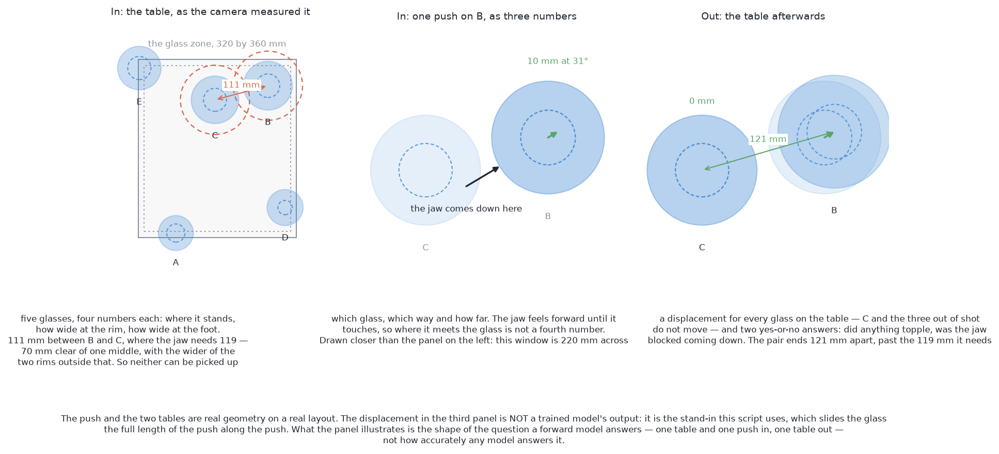
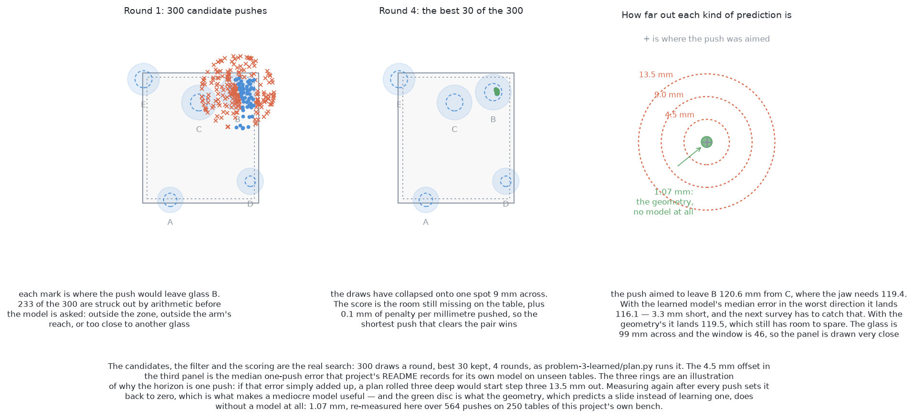
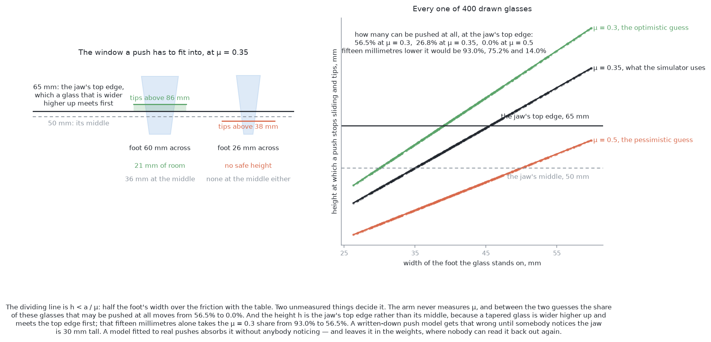
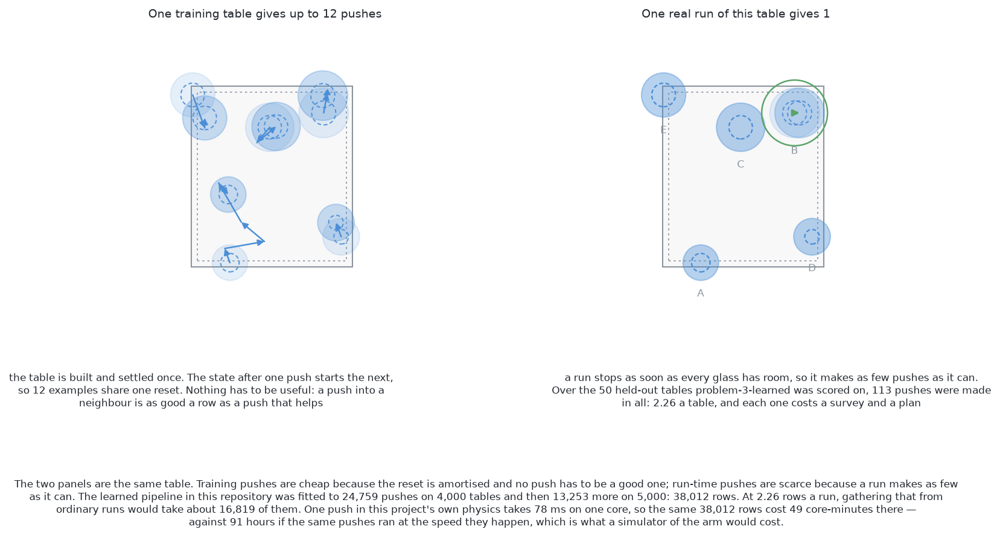
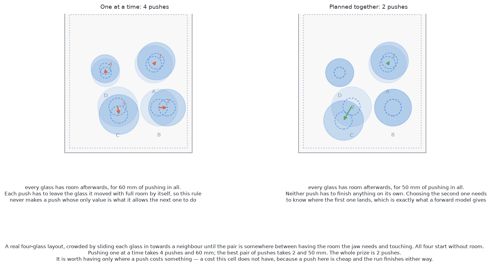

# Solution 10 — learn a forward model, then plan against it

*Learned, as the decider, and model-based rather than model-free. Learn what a
push will do rather than which push to make, then let an ordinary search choose
the push using what was learned.*

> **The cell is described once, in [the cell](../../the-cell.md)** — the
> layout, the arm, the camera, all four sensors, and the words this project
> uses them with. [`problem.md`](../problem.md) says what problem 3 asks for.
> What follows is only what is specific to this solution.

## Introduction

This document explains how to learn what a push does, and then use what was
learned to choose the next push. The problem it addresses is that nobody in
this cell knows the friction under a glass, so the classical arithmetic for
where a pushed object ends up has inputs it cannot supply. The idea here is
to stop deriving the answer and fit it instead: record tens of thousands of
pushes in a simulator, fit a function from the table and the push to the table
afterwards, and then search over candidate pushes by asking that function about
each one. By the end you will understand what a forward model is, why planning
against one is an ordinary search rather than anything exotic, what the data
costs in measured seconds, what the method buys that the arithmetic cannot, and
why — on this table, today — it is still not needed.

This document is unusual among the eleven in one respect, and it is worth
saying at the top. **This solution is the one that has actually been built
here.** The folder [`problem-3-learned`](../../../problem-3-learned/) holds a
working forward model, a search that plans against it, and a scored run on
fifty held-out tables. So the sections below quote measurements rather than
estimates wherever they can, and they say which measurement came from where.

There is one general lesson worth carrying away even if you never build this,
and it is not the one I expected to write. **A model that is four times less
accurate can still do the job better, if it is accurate about the right
question.** The geometry predicts where a pushed glass lands to about a
millimetre and then has to spend half its pushes finding out things it cannot
predict. The learned model is four times worse at the landing and answers the
questions the task is actually scored on, so it clears more of the table with
half the pushes. Measured accuracy is not the same as usefulness, and choosing
what to predict decides which one you get.

## The problem this solves

Problem 3 asks the arm to push crowded glasses apart without knocking any of
them over. A push needs two decisions: which glass, and where to push it to.
Both decisions want the same thing — some idea of where the glass will end up.

[Solution 4](04-predict-the-slide.md) answers that with the classical mechanics
of planar pushing. The mathematics is written down and correct, and it needs two
numbers this cell does not have: the friction between the glass and the table,
and how the glass's weight is spread across its foot. The second of those has no
unique answer even in principle.

[Solution 3](03-plan-feel-look-again.md) answers it by refusing to predict at
all. It aims a push, makes it, takes a fresh picture, and measures what
happened. Guess, push, measure, correct.

This solution takes the third road. It **fits** the prediction from recorded
experience instead of deriving it from mechanics, and then plans against the
fit. Nothing is guessed about friction, because friction is never named.

## What a forward model is

A **forward model** — also called **learned dynamics** — is a function fitted to
recorded experience. Give it the state of the world now and an action you are
considering, and it returns the state afterwards. It is the physics
[solution 4](04-predict-the-slide.md) could not fill in, fitted rather than
derived.

Here the state is the table as problem 2 measured it, the action is a push, and
the state afterwards is where every glass has ended up.

That picture is one table, one push and the table afterwards. The arrangement is
real: the positions come from the project's own spawner and every glass's
proportions are drawn from the tapered kind's declared range. The push and both
tables are real geometry. **The displacement in the third panel is not a trained
model's output.** No model runs anywhere in the diagram script; the displacement
drawn is a stand-in, stated in the caption, which slides the glass the full
length of the push. The panel illustrates the *shape* of the question a forward
model answers, not how well any model answers it.

The important structural point is in the third panel. The model does not decide
anything. It answers a question about a hypothetical, and something else does
the deciding. That separation is the whole of this solution, and it is what
makes it different from
[learning a policy by reward](learned-with-hardware.md#learn-to-push), where the
network's answer *is* the action.

### Two flavours, and only one of them belongs here

There are two ways to build a forward model, and they differ in what they
predict.

**State prediction** maps a short list of numbers plus an action to a new short
list of numbers. Here that is five glasses' positions and widths plus a push,
giving five new positions.

**Image prediction** — also called **video prediction**, or **visual foresight**
— returns a predicted camera frame instead. It is for tasks with no state you
can write down. You cannot list a towel's coordinates, so you predict the
picture of the towel.

**State prediction is the only sensible choice in this cell**, for three reasons
that are all about size. Problem 2 has already measured the state, so it costs
nothing to use. The state is a few dozen numbers, while the camera returns
320 × 240 pixels in colour, which is 230,400 numbers. And predicting a quarter
of a million numbers to recover a few dozen already in hand loses accuracy in
the round trip, while the models that do it want a large NVIDIA graphics card
for days. This machine has no NVIDIA graphics card, which is the condition set
out in [the companion document](learned-with-hardware.md) and applied to every
solution in [the overview](solution-overview.md).

## Why anyone does it this way

Three reasons, and the first is the one that matters most.

**The data needs no reward.** A reinforcement-learning episode needs a score,
and a score needs someone to have decided what a toppled glass is worth as a
number. Push at random, record what moved, and every push is a usable example
whether it helped or not. The hardest problem in reinforcement learning — a
reward that cannot be gamed — never arises. The
[companion document](learned-with-hardware.md#learn-to-push) works through why
that problem is genuinely hard here: "never topple a glass" is a constraint, and
written as a fine it becomes a price, and a price is a trade the policy may
choose to make.

**The model is reusable across goals.** The model says what a push does. It says
nothing about what you want. Change the goal — separate the pair, clear a path
to the rack, tidy everything to one end of the table — and only the scoring
function changes. A policy trained by reward serves the one goal it was rewarded
for.

**The deciding stays code you wrote.** The search over candidate pushes is
ordinary arithmetic. It can print why a candidate was rejected, and the safety
checks sit outside the model where a wrong prediction cannot reach them.

## What the model is shown, and what it returns

The implementation in this repository is the reference for this section, and its
own description of what it is doing is the clearest statement of the case
anywhere in the project. From
[`features.py`](../../../problem-3-learned/features.py):

> The inputs are only what the arm has: the camera's readings of every glass and
> the push it is thinking of making. No friction, no tipping rule, no mass.
> Whether a push slides or topples a glass is for the model to learn from the
> pushes it has seen.

**What goes in.** Which kind of glass the table holds, the pushed glass's height
and its widths at the rim and at the foot, the push itself as two numbers — how
far across the glass the jaw meets it, and how far it pushes — and then where
each of the five nearest other glasses stands and how big it is.

**What comes out.** A displacement for the pushed glass, a displacement for each
of those other glasses, and two yes-or-no answers: did anything topple, and was
the jaw blocked on its way down.

### The push's own frame

Every distance in that list is expressed in the push's own frame. One axis runs
along the push and the other runs across it, so **a push to the north and the
same push to the east are one training example rather than two.**

This is a deliberate data-efficiency decision and it rests on a physical claim:
the table's friction is the same everywhere on it, so the direction of a push
carries no information. If that claim were false — a wet patch, a seam, a
tablecloth — the frame would be throwing away exactly the information that
mattered, and the model would average over it silently.

### It answers about the whole table, not one glass

The extra outputs are easy to skim past and they are the strongest argument for
this solution.

A glass being pushed can shunt its neighbour. The classical arithmetic of
[solution 4](04-predict-the-slide.md) predicts one object's slide and has
nothing to say about what that object then touches. This model predicts a
displacement for the neighbours too, so it has an opinion about knock-on
contacts, and it can refuse a push that would cause one.

The same goes for the two flags. "Is the jaw blocked coming down" is a question
about the gripper's whole body against every glass around the target, and the
honest rule-based answer is worst case: treat the jaw as though it were as wide
as the widest part of every neighbour, all the way up. That rule is safe and it
is strict, and [the comparison in this repository](../../../problem-3-results/)
records it refusing glasses the jaw could in fact have reached.

## Planning against it: model-predictive control

Having a model is not having a plan. The plan comes from searching over
candidate pushes and asking the model about each one.

**Model-predictive control**, usually shortened to **MPC**, is that search done
in a particular way. Work out the best action from where you are now, execute
only the first part of the answer, throw the rest away, measure the world again,
and search again from the fresh measurement. The name comes from process
control, where it has been standard for decades on chemical plants and
refineries.

The point of throwing the rest away is not tidiness. It is that a plan computed
from a prediction gets worse the further it runs, and a fresh measurement resets
that error to nothing.

### Random shooting, and the cross-entropy method

The simplest search is **random shooting**. Draw a few hundred candidate pushes
at random, run each one through the model, score the tables it predicts, and
execute the best. It needs no gradients and no special structure, and on a model
this small the few hundred predictions are one batched pass costing
milliseconds.

The **cross-entropy method**, or **CEM**, is random shooting done three or four
times over, each time in a narrower region. Draw candidates from a broad
Gaussian over the push's heading and length. Score them. Keep the best few — the
**elite set** — throw the rest away, refit the Gaussian to the elites, and draw
again. After a few rounds the draws have collapsed onto the good region and the
elites' mean is the push.

Why this rather than plain random shooting? Because the good region is a small
part of what you have to draw from, and three more rounds of a few hundred draws
are far cheaper than one round of tens of thousands. What it costs is a
tendency to collapse onto the first decent region it finds, which on a problem
with several separate good answers can leave the best one unvisited.

The first two panels of that picture are the real search on the real
arrangement, with the same settings the implementation uses: 300 draws a round,
the best 30 kept, four rounds. In the first round **233 of the 300 candidates
are struck out by arithmetic before the model is consulted at all**, and by the
fourth round the draws have collapsed onto a spot 9 mm across.

The third panel is the comparison this document exists to make, and it is
discussed under [the measured verdict](#the-measured-verdict) below.

### The arithmetic comes first

This is a rule, not an implementation detail. **Everything that can reject a
push is arithmetic, and the model is consulted only on what survives.**

Three filters run before the model, in that order because that is the order of
increasing cost. Is the landing spot inside the zone the glasses may stand in,
with a margin, because the glass will not land exactly where it was aimed? Is it
inside the ring the arm reaches comfortably? Would the moved glass have the room
a jaw needs once it is there, and would every glass that already had room still
have it?

That last test is the one worth stating carefully, because problem 3's round
number hides an asymmetry.

The jaw needs about 70 mm of clear space around a glass's middle, and what has
to be outside that space is the **neighbour's edge**. So the distance two
glasses need between their middles depends on how wide the *neighbour* is, not
on how wide the glass being picked up is. A narrow glass beside a wide one is
crowded while the wide one beside it is not. [`problem.md`](../problem.md)
rounds this to 140 mm between middles, which is the worst case — two of the
widest glasses the tapered kind allows. For the pair in the worked example
below, the real figure is 119.4 mm.

Getting this backwards does not make the arm unsafe. It makes it count the
crowded glasses wrongly, which is worse, because a miscount is silent.

## The feedback loop

The loop is the method, so it is worth setting out on its own.

The model is trusted **one push ahead and no further**. The search produces a
push. The arm makes it. Everything the search believed about what came
afterwards is discarded. The arm takes fresh pictures, runs problem 2's
separation again, and gets the real arrangement. The next search starts from
that. **A prediction is never fed into another prediction on the real table.**

So the model is not asked to be right. It is asked to be right enough to *rank*
a few hundred candidates, once, before the world is measured again. A model that
is consistently five millimetres out still knows that pushing away from a
neighbour beats pushing into it, and every measurement sets its error back to
zero.

This matters because the error does not stay put if you roll the prediction
forward. It compounds for two reasons that stack. Each step's error adds to the
last one's. And a predicted state sits slightly off the states the model was
trained on, so step two is being asked about a world it has never seen. On the
measurements below, a plan rolled three deep would begin its third push with
about 13.5 mm of accumulated error, which is a fifth of the room a jaw needs.

**Replanning every step is what makes a mediocre model useful.** It is also what
makes a mediocre model *acceptable*, which is a different and more important
claim: the loop bounds the damage a wrong prediction can do to one wasted push.

## A worked example

This example follows one crowded pair through the method. Every number in it is
printed by
[`make_10_images.py`](../../../images/generators/problem-3/make_10_images.py)
when it runs, so it can be checked rather than believed.

The table is a five-glass layout from the project's own spawner, seed 4, with
its closest pair slid together afterwards. That last step needs explaining and
is explained under [what the data costs](#what-the-data-costs); the short
version is that the shipped spawner cannot produce a crowded table.

Read the table below as the numbers problem 2 hands over for each glass, in
millimetres, with the arm's base at the origin. The last two columns are the
arithmetic [`problem.md`](../problem.md) sets out: the height at which a push
stops sliding the glass and starts tipping it, at two values of the friction,
and whether that is above the height the jaw actually pushes at.

| Glass | Where it stands | Rim | Foot | Height | Tips above, μ = 0.3 | μ = 0.35 | Can be pushed? |
| --- | --- | --- | --- | --- | --- | --- | --- |
| A | (396.1, −431.2) | 70.8 | 36.8 | 219.7 | 61 | 53 | no, at either |
| B | (582.5, −133.2) | 98.7 | 47.8 | 161.2 | 80 | 68 | yes, at both |
| C | (475.4, −161.7) | 96.3 | 46.7 | 165.9 | 78 | 67 | yes, at both |
| D | (617.2, −379.7) | 73.1 | 29.0 | 223.5 | 48 | 41 | no, at either |
| E | (322.2, −97.4) | 88.0 | 47.0 | 169.6 | 78 | 67 | yes, at both |

**Two of the five cannot be pushed at all.** A and D tip before they slide, at
the height the jaw meets them, at either value of the friction. That is a
refusal rather than a failure, and it is arithmetic rather than a judgement. It
is also worth noticing how ordinary those two glasses are: A and D are simply
the tall narrow-footed ones, and the tapered kind's declared range is full of
them.

**The crowding.** Nine of the ten pairs have room. B and C stand 110.9 mm apart,
and the jaw needs 119.4 mm between those two, so neither of them can be picked
up.

**The filter first.** The search draws 300 candidate pushes on B. It strikes out
233 of them by arithmetic — outside the zone, outside the arm's reach, or
landing too close to another glass — and hands 67 to the model to be scored. The
model gets no vote on any of the 233.

**The scoring.** Each surviving candidate is scored by how much room the table
would still be short of afterwards, summed over every glass, plus a tenth of a
millimetre of penalty for each millimetre pushed. The penalty is what makes the
shortest push that does the job win, and the reason to want that is that every
millimetre pushed is a millimetre in which something can be knocked.

**The choice.** After four rounds the elites have collapsed onto a spot 9 mm
across, and the chosen push moves B 10.0 mm at 31°. That is a short push,
because the pair is only 8.5 mm short of the room it needs.

**Execute, then look.** B lands 120.6 mm from C, which is 1.2 mm past what the
jaw needs. The arm surveys again, finds that every glass now has room, and the
run goes on. One push, and nothing is carried forward from the plan except the
fact that it was made.

**What a worse prediction would have cost.** At the learned model's own measured
error — 4.5 mm, taken in the worst direction, straight back towards C — the
glass would land 116.1 mm from C, which is 3.3 mm short. The pair would still be
crowded, the survey would see that, and a second push would be planned. At the
geometry's measured error of 1.07 mm the same push lands 119.5 mm out, which
still clears. That is the loop doing its job either way: a wrong prediction
costs one push, not a failure.

## The number it absorbs rather than measures

Everything in problem 3 turns on quantities nobody measures, and this solution's
relationship to them is the most interesting thing about it. There are two, and
the second one surprised three of us independently.

A pushed object slides while the contact height `h` is below `a / μ`, where `a`
is half the width of the foot it stands on and `μ` is the friction between the
foot and the table. Above that height it tips instead.

**The first unmeasured quantity is μ.** No sensor in this cell touches it.

**The second is `h` itself**, and it is not the number it looks like. The middle
of the jaw rides at 50 mm above the table, which is as low as the gripper goes
without its own body passing through the table. But the jaw is 30 mm tall, so
its top edge is at 65 mm — and a tapered glass is wider higher up, so it meets
that top edge first. **65 mm, not 50 mm, is the height a tapered glass is
actually pushed at.** The simulator gets this right, and says so in a comment.
A push model written from the gripper's specification will get it wrong until
somebody notices.

Fifteen millimetres is not a detail. Read the table below as one population of
glasses — 400 drawn from the tapered kind's own range, with feet from 26.3 mm to
59.9 mm across and a median of 40.3 mm — asked the same question at two heights
and three frictions. The question is: can this glass be pushed at all, anywhere
the jaw can reach?

| Share that can be pushed at all | μ = 0.3 | μ = 0.35 | μ = 0.5 |
| --- | --- | --- | --- |
| at the jaw's top edge, 65 mm — the real height | 56.5% | 26.8% | 0.0% |
| at the jaw's middle, 50 mm — the height it looks like | 93.0% | 75.2% | 14.0% |

Those are measured, over one draw of 400 glasses; over 4,000 they come out at
55.6, 26.2 and 0.0 per cent at the top edge. **At μ = 0.5 not one tapered glass
in four thousand can be pushed safely at all.**

Three different things are being called friction in this project and they must
be kept apart.

- **What the arm knows.** Nothing. No sensor in this cell measures μ.
- **What a document guesses.** 0.3 and 0.5 bracket what is usually quoted for
  glass on a dry top, and the arithmetic above is only as good as the guess.
- **What the simulator uses.** The bench that scores problem 3 sets friction to
  0.35. That is ground truth a run is scored against, never an input to a
  decision.

**Here is the argument for this solution, and it is the strongest one
available.** A learned forward model holds none of the three, and it does not
need to. Fit it to real pushes and it absorbs the friction, and it absorbs the
fact that the glass meets the top edge of the jaw, and it absorbs the flare of
the glass wall, and it absorbs whatever else is true of the contact — without
anybody having to notice any of it. The mistake described above is a mistake a
written-down model makes and a fitted model cannot.

**And here is the same fact cutting the other way.** The model absorbs it
silently. Nobody learns that the jaw's top edge is what matters. The knowledge
sits in the weights, where it cannot be read, cannot be checked, cannot be
carried into the next problem, and cannot be quoted in a refusal a person has to
act on. [Solution 9](09-identify-the-contact-parameters.md) is the answer that
does not have this problem: it estimates μ from the arm's own pushes and hands
back a number with physical meaning, which the tipping check can then use, in a
sentence somebody can check with a ruler. It needs data counted in tens rather
than tens of thousands, because it is fitting a handful of constants in an
equation somebody already wrote rather than the equation itself.

A model that transfers to no other table and explains nothing about this one is
paying a real price for that silence.

## What the data costs

This is the section the verdict turns on, so it is worth being careful about
where each number comes from.

### The spawner cannot make a crowded table

The first thing to establish is what a crowded table even is here, because it
surprised me.

`random_glasses` in `glasses/spawn.py` places glasses one at a time wherever the
ones already down leave room, and it enforces a minimum of 150 mm between
middles. Over **400 spawned tables of four to six tapered glasses, not one pair
was closer than 150.0 mm**, and the median nearest-neighbour distance was
162.0 mm. A glass loses the room a jaw needs somewhere below 123 mm. So the
shipped spawner produces no crowding at all, ever.

The crowded tables problem 3 is scored on come from `scene()` in
[`problem-3-sim/bench.py`](../../../problem-3-sim/bench.py), which deliberately
places a share of the glasses between touching and having room. Over **300 of
its tapered tables — 1,500 glasses — 1,083 of them, 72.2 per cent, start without
the room the jaw needs**, at 3.61 a table. That is measured, by a throwaway
script run against the bench itself; the bench needs MuJoCo, which is not in
this project's root environment, so it cannot be imported by the diagram scripts
that must run there.

The arrangements in the diagrams here are therefore spawner layouts with the
crowding put in deliberately, the same way the bench does it, and every caption
says so.

### How many pushes a run yields

A **training** table is cheap, and the reason is in the left panel. The table is
built and settled once, and the state after one push is the start of the next,
so up to twelve examples share one reset. Nothing has to be useful either: a
push straight into a neighbour is as good a training row as a push that helps,
because the label is what happened rather than whether it was wise.

A **run** is expensive, and the reason is in the right panel. A run stops as soon
as every glass has room, so it makes as few pushes as it can. Over the 50
held-out tables the learned pipeline was scored on, it made **113 pushes in all,
which is 2.26 a table.**

### How many pushes the model needs

The model in this repository was fitted to **38,012 pushes**: 24,759 random ones
on 4,000 tables, then 13,253 more on 5,000 new tables, mostly chosen by the
planner using the first model. That second round is the interesting half. The
planner searches thousands of candidates and finds the few where the model is
wrong in its own favour; making exactly those pushes and recording what really
happened fills exactly those holes.

I did not collect that data again. Those two counts are recorded in
[`problem-3-learned/README.md`](../../../problem-3-learned/README.md) and are
quoted here, not re-derived.

Whether 38,012 is the right number is an open question that the repository does
not answer, because no learning curve was run. A state this small might well be
fitted from a few thousand. The honest statement is that this is what was used,
not what was needed.

### What that adds up to, in measured seconds

Here is the arithmetic that decides where this method can be built, and every
input to it is measured.

One push in this project's own physics takes **78 milliseconds on one core**,
median, and builds 4,331 steps of simulation — **8.66 seconds of simulated
time.** So the physics runs about 111 times faster than the thing it is
simulating. Building a table's model costs 5 ms, and is paid once per twelve
pushes.

Read the table below as the same 38,012 pushes costed three ways. The first row
is what was actually done. The second is what a simulator of the arm running at
the speed things happen would cost. The third is what collecting the same
experience from ordinary working runs would cost.

| How the pushes are gathered | What it costs |
| --- | --- |
| this project's physics, one core | 49 core-minutes, or about 6 minutes across eight |
| any simulator running at real time | 91 hours, or nearly four days |
| the arm doing its actual job, at 2.26 pushes a run | about 16,800 runs |

Three things follow.

**The method is affordable, and comfortably.** Against the eleven days of
continuous simulation that
[reinforcement learning](learned-with-hardware.md#learn-to-push) wants for one
reward function, an hour is nothing. The repository's own record says the whole
thing — both collection rounds and training five copies of the network — took
under an hour on a laptop processor.

**But only in a fast simulator.** The 91-hour row is what the same experience
costs in anything that runs the arm at the speed an arm moves, and Gazebo is
such a thing. The choice of physics engine is not a detail here; it is the
difference between a method you can iterate on and one you cannot.

**And never on the robot.** At 2.26 rows a working run, a real arm gathering its
own experience needs about 16,800 runs before it has what this model was fitted
to. That is the number that settles it. The claim "it improves from real pushes
for free" is true and nearly worthless: the pushes are free, and there are
almost none of them.

## What it needs

**A physics engine that is fast rather than faithful, for the data.**
[MuJoCo](https://github.com/google-deepmind/mujoco) (Apache-2.0) runs natively
on Apple Silicon and is what this project uses for problem 3. [Gazebo
Harmonic](https://gazebosim.org/) (Apache-2.0) is the cell's real simulator and
is the wrong tool for collecting tens of thousands of pushes, for the reason in
the table above.

**A small network, and something to train it in.**
[PyTorch](https://pytorch.org/) (BSD-3-Clause); its Metal backend uses the Apple
Silicon graphics processor, although a model this small trains on the processor
in minutes. Three layers of 256 units is what the implementation uses, trained
five times from different starting points so that the copies can be asked to
disagree.

**Nothing for the search.** The cross-entropy method is about thirty lines of
[NumPy](https://numpy.org/) (BSD-3-Clause). For a tree-based baseline on a state
this short, [scikit-learn](https://scikit-learn.org/) (BSD-3-Clause).

**What this machine rules out.** Isaac Sim and Isaac Lab are CUDA-only with no
macOS build. MuJoCo's batched version, MJX, wants JAX on an NVIDIA graphics card
or a TPU. Video prediction goes with them, and the published visual-foresight
systems are research code rather than libraries, with licences to be read rather
than assumed.

## Where the idea comes from

Four lines of work meet here, and they are worth separating because they are
usually run together under the word "learning".

### Measuring pushes, and fitting a model to them

Planar pushing is one of the few manipulation problems with a real, careful,
published dataset behind it. Yu, Bauza, Fazeli and Rodriguez's [*More than a
Million Ways to Be Pushed: A High-Fidelity Experimental Dataset of Planar
Pushing*](https://arxiv.org/abs/1604.04038) (IROS 2016) recorded a robot pushing
objects on several different surfaces, with the pusher's path, the object's
motion and the contact forces all logged. The [dataset's own
page](https://web.mit.edu/mcube/push-dataset/) is still up.

What it buys is the thing this cell's model most lacks: pushes on *more than one
surface*, which is what makes it possible to ask whether a fitted model
transfers at all. What it costs is a robot, a motion-capture rig and months,
which is why nobody repeats it casually.

Bauza and Rodriguez's [*A Probabilistic Data-Driven Model for Planar
Pushing*](https://arxiv.org/abs/1704.03033) (ICRA 2017) fits a model to that data
with a Gaussian process, which is a method that returns a spread as well as a
value. Its answer is not "the glass ends here" but "the glass ends approximately
here, and here is how sure I am". That second half is exactly what a plain
network does not give you, and it is why their result matters for this solution
rather than just being adjacent to it. Why one rather than the other? A Gaussian
process on a few thousand rows is slower to query and does not scale past tens
of thousands, but it tells you when you have left the region it knows about. A
network is fast and silent. The implementation here takes a middle road: five
copies of the same network trained from different starts, and a push is refused
if *any* of them thinks it might topple something, on the grounds that where the
copies disagree the model has not seen a push like this one.

### Visual foresight, and why it is not the answer here

The image-prediction branch of forward models runs through three papers. Finn,
Goodfellow and Levine's [*Unsupervised Learning for Physical Interaction through
Video Prediction*](https://arxiv.org/abs/1605.07157) (2016) learns to predict the
next camera frame given the current one and an action. Finn and Levine's [*Deep
Visual Foresight for Planning Robot Motion*](https://arxiv.org/abs/1610.00696)
(ICRA 2017) plans against that prediction to push objects to targets. Ebert and
colleagues' [*Visual Foresight: Model-Based Deep Reinforcement Learning for
Vision-Based Robotic Control*](https://arxiv.org/abs/1812.00568) (2018) is the
full system.

What they buy is enormous: manipulation of objects whose state cannot be written
down, learned from unlabelled interaction with no reward and no human
annotation. What they cost is a large graphics card, days of training, hours of
robot interaction, and a model whose predictions blur after a few frames. In
this cell they would be paying all of that to recover five positions that
problem 2 has already measured to a fraction of a millimetre. That is the whole
argument against them here, and it is an argument about this cell rather than
about the method.

### Planning against a learned model

Nagabandi, Kahn, Fearing and Levine's [*Neural Network Dynamics for Model-Based
Deep Reinforcement Learning with Model-Free
Fine-Tuning*](https://arxiv.org/abs/1708.02596) (2017) is the clearest statement
of the recipe this solution follows: fit a plain network to (state, action, next
state) triples gathered by random exploration, then control with
model-predictive control and random shooting on top of it. Its headline is
sample efficiency — orders of magnitude fewer interactions than a model-free
policy for the same task.

Chua, Calandra, McAllister and Levine's [*Deep Reinforcement Learning in a
Handful of Trials using Probabilistic Dynamics
Models*](https://arxiv.org/abs/1805.12114) (2018), usually called PETS, is the
version that plans with the cross-entropy method against an **ensemble** of
networks rather than one, and keeps track of where the ensemble disagrees. The
implementation in this repository is a simplified PETS: five networks, CEM, and
a safety veto driven by the worst copy rather than the average.

What an ensemble buys is a usable signal for "I have not seen this before". What
it costs is five times the training and five times the inference, which on a
model this small is nothing at all.

### Model-based against model-free

The last idea is the distinction the whole document rests on, and it is worth
stating plainly.

A **model-free** method learns what to do. A **model-based** method learns what
will happen, and computes what to do from it. The trade is well established in
both directions: model-based methods need far fewer interactions, because every
interaction teaches them about the world rather than about one goal; model-free
methods reach a higher ceiling, because they never have to be right about the
world, only about the action.

In a cell where interactions are cheap and the goal is fixed, that trade favours
model-free. In a cell where interactions are expensive or irreversible and the
goals change, it favours model-based. **A topple here is irreversible — nothing
in this project can stand a glass back up — but a push is cheap and reversible,
and the goal has not changed since problem 1.**

## Where it is strong and where it breaks

The strengths are real and they are not the ones usually advertised.

**It absorbs facts about the contact that nobody wrote down.** The height a
tapered glass is really pushed at is the example in this document, and it is not
a hypothetical: the written-down version of that number is wrong by 15 mm, and
15 mm moves the share of pushable glasses from 93 per cent to 56 per cent. A
model fitted to real pushes never had the chance to make that mistake.

**It never needs μ, or the spread of a glass's weight over its foot.** Solution
4's two missing inputs are absorbed into fitted weights rather than guessed.

**It has an opinion about the neighbours.** The model predicts what happens to
the *table*, not to one glass. Where the geometry has to be worst-case about
whether the jaw will foul something on the way down, the model has seen it
happen and can be less strict. The repository's comparison records exactly that:
the learned side racked nine more glasses than the geometry and used about half
as many pushes, because the geometry refuses glasses the jaw could in fact
reach.

**The safety stays in arithmetic.** Every filter that can refuse a push runs
before the model is asked. A wrong prediction costs a wasted push.

**It is cheap to train.** Under an hour, on a laptop, with no reward function to
design.

The weaknesses divide into what it cannot promise, what it cannot say, and what
it cannot survive.

**It promises nothing.** Solution 4's tipping rule holds for every μ. This holds
only for the pushes it was shown. There is no bound, no proof, and no way to ask
it how sure it is short of training copies to disagree with each other.

**It cannot explain a refusal.** "The model did not expect any push to help" is
the whole of what a learned refusal says. This project treats a refused glass as
a result rather than a failure, and a result that cannot be read is worth much
less.

**It cannot hand anything back.** This is the flip side of its best strength.
Everything it discovered about the contact — the jaw's top edge, the flare of
the wall, the friction — stays inside the weights. Nobody can read it, check it,
argue with it, or use it in problem 4.

**It is confidently wrong outside what it saw, and silently.** A sixth glass, a
kind it was not trained on, a 120 mm foot, a push twice as long as any in the
data: the network returns a number with no warning attached. A rule refuses; a
model extrapolates. The mitigation in the implementation is a sanity envelope —
reject any predicted displacement much longer than the push that caused it — and
that is a patch rather than a fix.

**It learns the simulator's contact solver.** Whatever the physics engine does
about friction and contact is what the model has learned about the world. This
is reinforcement learning's sim-to-real objection at a twentieth of the training
cost, but it is the same objection — and it is sharper here than usual, because
the thing being learned *is* the contact.

**Compounding error, if the horizon is ever raised.** Covered above. The answer
is to plan short and replan often, and the implementation does.

## The measured verdict

Here is the part that decides the conclusion, and it is measured rather than
argued. It is also the opposite of what I expected when I started measuring.

### First, the question everybody asks

Ask both approaches the same question: *how far from where you aimed it does a
pushed glass actually stop?*

I re-measured the geometry side myself. Running the geometry-only planner over
250 of this project's bench tables, seeds 10100 to 10349, and comparing every
push's aim with the simulator's record of where the glass landed, gives **564
full-length pushes with a median miss of 1.07 mm**, 3.00 mm at the ninetieth
percentile, and 34.40 mm at worst. The median push was 14.0 mm long. None was
blocked and none missed the glass.

The learned model's own figure is **4.5 mm**, median, on tables it was not
trained on. That is `landing_mm_median` from the training script's validation
report. I did **not** re-derive it: the training data is not kept in the
repository, and reproducing it means collecting 38,012 pushes again. It appears
in [`problem-3-learned/README.md`](../../../problem-3-learned/README.md) and
nowhere else, with no date attached, so it is quoted here on that document's
authority rather than on a measurement of mine.

The two figures are not quite the same quantity, and the difference cuts against
the learned side. Mine is aim-against-landing on pushes the geometry chose, with
a median length of 14 mm. The 4.5 mm is prediction-against-outcome on validation
pushes drawn from the full 10 to 100 mm range, and a longer push has more room
to go wrong in absolute millimetres.

Take the comparison at face value anyway. **Per push, the learned forward model
is about four times less accurate than the geometry it was meant to improve on.**

### Then, the question the task is scored on

Landing accuracy is not what problem 3 asks for. Problem 3 asks for every glass
to end up with room around it, with nothing knocked over.

Read the table below as the two approaches on identical work: the same 50
held-out tables, the same 251 glasses, the same 190 of them crowded at the
start. Every figure comes from the two `results.json` files, which I read
directly. Neither file carries a date or any record of what produced it, so
they are taken on trust that they are current.

| On 50 held-out tables | Geometry only | Learned forward model |
| --- | --- | --- |
| glasses racked | 199 | **208** |
| glasses refused | 52 | **43** |
| glasses toppled | 0 | 0 |
| tables finished | **35** | 34 |
| pushes made | 212 | **113** |
| of those, repeat pushes on a glass already pushed | 90 | **15** |
| pushes that went wrong | **0** | 6 |
| where the glass stopped, from its aim: median · worst | **1.0 · 3.9 mm** | 1.7 · 24.8 mm |

**The learned model racks nine more glasses using half the pushes, while being
four times less accurate per push.** That is the finding, and it is worth
sitting with, because it looks like a contradiction and is not.

### Why being less accurate wins here

Landing accuracy answers *where will this glass go*. Nothing in problem 3 is
scored on that. What the task needs to know is *will this push leave the glass
with room*, *will it topple anything*, *will the jaw get down there at all*, and
*what happens to the neighbour*. Those are four different questions, and a model
that is precise about the first can still be silent on the other three.

The geometry is silent on the other three, and the cost is visible in the table.
**Ninety of its 212 pushes are repeats.** The repository's own comparison
records that 92 of those 212 are deliberate 5 mm test pushes, whose only purpose
is to find out whether this glass slides or tips before committing to a real
one, and my own run over 250 tables found the same proportion — 426 test pushes
against 564 full ones. So roughly half the geometry's pushes are spent asking
the world a question, because it cannot answer the question itself. The learned
model answers it from pushes it has already seen, for nothing, before the arm
moves at all.

The refusal reasons say the same thing in the two runs' own words. Every one of
the geometry's 52 refusals is "nowhere clear to push it to" — a statement about
the map, made by something that reasons about the map and nothing else. Forty-two
of the learned run's 43 are "no push the model expects to make room" — a
statement about outcomes, made by something that reasons about outcomes.

**Being right about the question the task asks beats being precise about a
question it does not.** That is the lesson of this document, and it is the
opposite of the lesson the 1.07-against-4.5 comparison suggests on its own.

### And what it costs

This is not a clean win, and the same table shows the price.

**A new class of failure.** The geometry had no push blocked on the way down, no
push that missed the glass, and none that jammed. The learned run had four, one
and one. Six pushes in 113 did something the planner did not intend, against
zero in 212. Those come from being less strict about where the jaw fits, which is
the same property that racks the extra nine glasses. It is one trade, not two.

**A much worse tail.** 24.8 mm at worst against 3.9. A glass 25 mm from where it
was aimed is still on the table and still recoverable, so this is not a safety
number — but it is the number that would become a safety number the moment the
zone got tighter.

**One table fewer finished**, which is within the noise of fifty tables and
should not be argued either way.

**And a run that cannot explain itself.** "No push the model expects to make
room" is a better answer than the geometry's when it is right, and there is no
way to check it when it is wrong.

One more caveat about the tail. I re-measured the geometry's accuracy over 250
tables rather than 50 and got a worst case of 34.40 mm — nearly ten times the
3.9 mm in the table above. **A worst case measured over fifty tables is not a
worst case.** The learned side's 24.8 mm would very likely grow the same way if
it were measured over five times as many tables, and nobody has done that.

### One hypothesis, labelled as one

There is an obvious explanation for why the per-push prediction is the weaker
half, and it should be labelled as a hypothesis rather than a finding. The model
is spending its capacity on four things at once: the pushed glass, five
neighbours, a topple flag and a blocked flag. Only the first of those is what
the 4.5 mm measures. A model trained to predict the pushed glass alone might do
better on that one number — and would lose the neighbour and blocked predictions
that are, on the evidence above, where its advantage actually comes from.
**Nothing here tests that**, and the test is cheap: train a second model with
only the target's displacement as its output, and compare the same validation
figure.

## Why it is not needed yet, and what would change that

The verdict from [the overview](solution-overview.md) is that this is the best of
the three learned solutions and still not needed. The measurements above make
that a narrower claim than it was, and it is worth saying exactly what survives
of it.

**What does not survive is "the learned model does the job worse".** It does not.
It racks more glasses, with fewer pushes, and topples nothing, on the same
tables.

**What survives is that the job is already being done.** The geometry finishes
50 tables with zero toppled glasses, zero pushes that went wrong, a refusal for
every left glass that a person can check with a ruler, and no training set, no
weights file and no simulator run to keep in step with the cell. It costs about
a hundred extra pushes, which is fifteen or twenty seconds of arm time each and
nothing else. **Nothing about this cell makes that trade worth reversing.**

**A forward model pays when predicting is cheaper than trying.** That is the
economic case, and it is a comparison rather than a principle. Predicting costs
a training set, a weights file, a simulator, and an answer that cannot explain
itself. Trying costs one push. So the method wins where a push is expensive, or
slow, or cannot be undone — and here a push is none of the three.

The one outcome that genuinely cannot be undone is a topple, and the answer to
that is not a better prediction either. It is [solution 8's early
abort](08-a-learned-early-abort.md), which watches the wrist force during the
push and stops it. **A prediction made before the push cannot prevent what the
push turns out to be doing. Only watching can.**

So what would change it? Four things, and each one is a condition that can be
checked rather than an opinion.

**More glasses, or less table.** The case for planning ahead is that the greedy
choice can spoil the next one, and how often that happens depends on how full
the table is. Over 200 crowded tables, pushing one glass at a time finished in
one push on 4 of them, two pushes on 32, three or more on 137, and refused
outright on 27. On the four-glass table below it takes four pushes where the
best pair of pushes takes two.

Look at what the difference actually is. The rule on the left has to leave every
glass it moves with full room by itself, so it never makes a push whose only
value is what it allows the next one to do. The plan on the right may. Choosing
the second push needs to know where the first one lands, and that is precisely
what a forward model supplies. But the prize is two pushes, the run finishes
either way, and this table had four glasses on 320 by 360 mm. Put nine on it, or
the same five on half the table, and the runs that refuse outright go from a
minority to the common case.

**A cost per push.** Right now a push costs arm time and nothing else, and the
run has time. Give a push a real price — a consumable, a cycle-time target, a
chance of damage per contact — and the difference between four pushes and two
stops being cosmetic.

**A goal that needs a sequence planned as a sequence.** Everything above is still
one-at-a-time planning with a better tie-break. A goal like "clear a corridor
from the crowd to the rack" cannot be expressed as one push at all, and a model
that can be rolled forward is the only way to search for it.

**A cell where the arithmetic runs out.** Mixed kinds, objects that rock rather
than slide, wet rings under the glasses, a tote of jumbled glassware with no
clean footprints to plan against. There [solution 4](04-predict-the-slide.md)
has no inputs to compute with and [solution 3](03-plan-feel-look-again.md) has
no destination search, and a fitted model knows something nothing else can
supply. That is the case the singulation literature exists for, and it is real.

None of those four is true of this table today. All four become true somewhere
between [problem 4](../../problem-4/problem.md) and a real kitchen.

## Where it sits among the other solutions

The clearest way to place this solution is against the three that answer the
same question — *where will the glass end up?* — in three different ways.

[Solution 4](04-predict-the-slide.md) derives the answer from mechanics, and
cannot finish, because two of its inputs do not exist here and a third is easy
to write down wrongly. [Solution 9](09-identify-the-contact-parameters.md) keeps
solution 4's equations and learns the missing constants, so it needs tens of
examples and hands back a number with physical meaning. This solution learns the
whole mapping and needs tens of thousands, and hands back a number with no
meaning outside the table it was fitted on.
[Solution 3](03-plan-feel-look-again.md) declines to answer the question and
measures instead, which makes it the most accurate of the four per push and the
most expensive in pushes.

That is a ladder, and the rung to build is the lowest one that does the job.

Against its two siblings in the learned family, this one is clearly the better
buy. [Reinforcement learning](learned-with-hardware.md#learn-to-push) wants
about eleven days of continuous simulation for one reward function, and it needs
a reward function, which means pricing a broken glass.
[Solution 11](11-search-a-push-strategy.md) searches over the numbers inside a
strategy somebody wrote, which is cheaper still but cannot learn anything the
strategy's shape does not allow — including that the jaw's top edge is what a
tapered glass meets. This one costs under an hour, needs no reward, produces
something reusable across goals, and leaves every safety decision in arithmetic.

Against the hybrids it is the more ambitious and the less safe choice.
[Solution 5](05-a-learned-residual-on-the-push-model.md) learns a correction to
a prediction somebody already wrote, so it starts from the physics and only has
to learn the error; this starts from nothing and has to learn the physics too.
[Solution 7](07-a-learned-change-verifier.md) and
[solution 8](08-a-learned-early-abort.md) put their models after the action
rather than before it, where being wrong costs a measurement or an unnecessary
stop. [Solution 6](06-geometry-generates-a-model-ranks.md) lets the model only
reorder candidates the geometry already approved.

And against [doing nothing at all](01-do-not-drag-at-all.md) and [one fixed
nudge](02-one-fixed-nudge.md) — the two baselines — it is a great deal of
machinery, and unlike most of the eleven it has the measurements to show what
the machinery buys: nine more glasses off the table, in half as many pushes, on
the same fifty tables.

Keep it on the list. It is the right learned solution for this cell if one is
ever wanted, and the day the table stops holding five glasses of one known kind
it will be wanted.

---

← [The solutions](solution-overview.md) · [Problem 3](../problem.md) ·
[The ones that need more than a simulator](learned-with-hardware.md)
