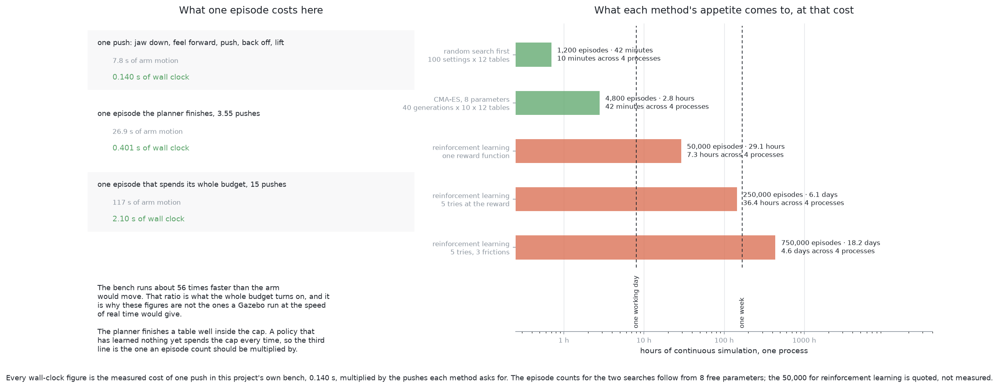
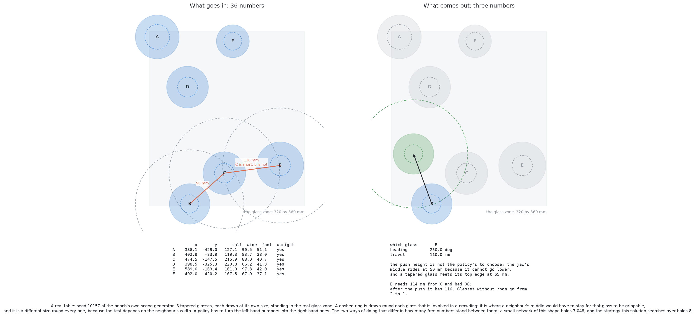
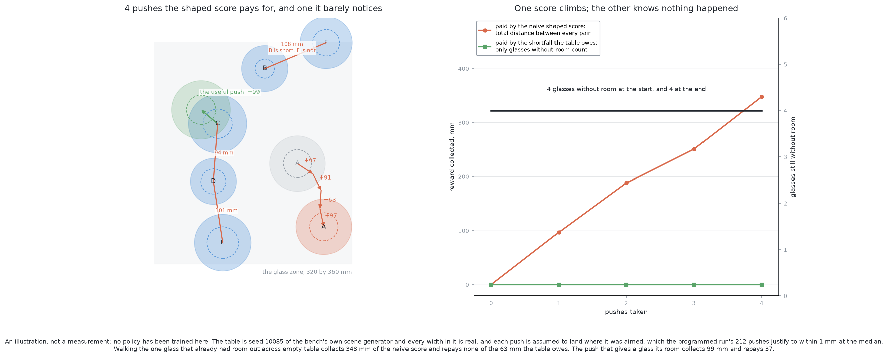
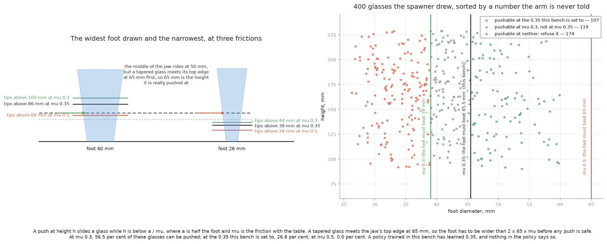

# Solution 11 — search a push strategy

*Learned, as the decider, with no gradients and no neural network. Write the
push strategy down as a rule with a handful of numbers in it, then let a
computer choose the numbers by trying them in simulation.*

> **The cell is described once, in [the cell](../../the-cell.md)** — the layout,
> the two places the camera works from, all four sensors, and the words this
> project uses them with. [The problem](../problem.md) says what is being asked
> for. What follows is only what is specific to this solution.

## Introduction

This document is about the cheapest way to get a learned answer out of a
simulator, and about the arithmetic that decides whether a more expensive one is
worth buying. The problem it addresses is that
[plan, feel, look again](03-plan-feel-look-again.md) already works, and that
about eight of the numbers inside it were chosen by a person at a keyboard
rather than measured. Nobody knows whether they are anywhere near right.

The idea here is to leave the strategy exactly as it is and search over those
eight numbers, scoring each setting by running whole tables in the simulator
this project already has. That is a direct search for a strategy, and it is the
same family of idea as reinforcement learning: try things, keep what scores
well, try more like it. The difference is how many free numbers the search has
to move, and that difference decides what the search costs.

By the end you will know what one simulated push costs on this machine, because
it was measured rather than guessed; how many pushes a run of this problem
actually contains, because that was measured too; how those two numbers
multiply out into hours for a small search and into days for a policy network;
why writing the goal of this problem as a reward is harder than training against
it; and why a policy trained in this project's simulator has silently learned
two things at once — a friction coefficient that nothing in the cell measures,
and the exact height at which its own gripper touches a glass.

The short version of the verdict is that the arithmetic supports the search and
does not support the policy, but by a smaller margin than the usual telling of
this story allows, and for a different reason. That is set out in [the sample
budget](#the-sample-budget-worked-out).

## The problem this solves

Four to six glasses of one kind stand on the table. Some of them are too close
together for the gripper to get round one without fouling its neighbour, and the
arm has to move them apart by dragging them, because it cannot lift anything
until it can get round it.

[Plan, feel, look again](03-plan-feel-look-again.md) answers that with geometry.
It generates every push it could make, throws away the ones that would land a
glass somewhere unsafe, takes the shortest of what is left, makes it, and looks
again. There is no model in it and nothing is fitted to data.

It works. Over fifty held-out tables it racked 199 of 251 glasses, refused 52
with a reason, and toppled none. The complaint is not that it fails. The
complaint is that its constants are guesses. How far past "just enough room"
should a push aim? How much clearance should the jaw keep from a neighbour it
passes? How many times should one glass be pushed before it is given up on? Each
of those is a number in a file, each was chosen because it sounded about right,
and each trades safety against how often the run finishes.

**A person cannot answer those questions by thinking about them, and a simulator
can answer them by trying.** That is what this solution is.

## The words, first

Six terms, and each matters later.

A **policy** is a function from what the robot can see to what it should do
next. In this problem the input is where every glass stands and how wide it is,
and the output is a push: which glass, which way, and how far. Every solution in
this problem has a policy in that sense. What differs is how the function is
written down. [Plan, feel, look again](03-plan-feel-look-again.md) writes it as a
program with constants in it. A neural policy writes it as a matrix of weights.

**Sample efficiency** is how much experience a method needs before it is any
good, counted in attempts rather than in seconds. It is the property that
decides everything below, because the experience here is simulated and every
simulated attempt costs wall-clock time on one laptop.

An **episode** is one attempt from a fresh table to a finish: spawn the glasses,
push until the job is done or the budget is spent, stop. A **reward** is a single
number saying how well that went. Reinforcement learning is the family of methods
that improve a policy from rewards alone, with no examples of correct behaviour.

**Reward shaping** is paying part of the reward early, for progress, rather than
paying it all at the end for success. It is what people reach for when the end
reward is too rare for anything to learn from, and it is where this family of
methods most often goes wrong. [The reward problem](#the-reward-problem) is about
exactly that.

**Black-box optimisation**, also called **derivative-free optimisation**, is
choosing numbers to maximise a score when the score is all you get. *Black box*
means you can put numbers in and read a score out and nothing else: you cannot
differentiate the score with respect to the numbers, because between the numbers
and the score sit a motion planner, a contact solver and five sliding glasses.
So the only thing left to do is try candidates, keep what worked, and try more
like them.

## What one run of this problem actually contains

Before any budget can be worked out, the job has to be sized. This project
already has the answer, in `problem-3-sim/bench.py`, which is the reference
implementation for problem 3: a MuJoCo simulation of a crowded table, shared by
the programmed and the learned approaches so that the two are scored on the same
tables by the same physics.

Its `scene(seed)` builds one table: four to six glasses of one kind, drawn at
their own sizes, placed so that most do not touch and a share of them stand
deliberately between touching and having room. Every table it builds holds at
least one glass without room. `TEST_SEEDS = 10_000` divides the tables a method
may train on from the tables it is judged on, and that division matters later.

Fifty of its held-out tables of tapered glasses hold 250 glasses between them.
**182 of those glasses — 72.8 per cent — have no room at the start.** The two
closest glasses on a table are 95.4 mm apart typically and 81.8 mm apart at
worst. Across those fifty tables there are 147 crowded pairs, so a little under
three a table.

Running the programmed planner over the fifty held-out tables of all four kinds
gives the other half of the size: **212 pushes over fifty tables, 4.24 a table**,
of which 90 were a second or later push at a glass that had already been pushed
once. A run allows at most fifteen, which is `PUSHES_PER_TABLE` in
`problem-3-programmed/run.py`, and that cap is what an episode costs when the
policy making the decisions has learned nothing yet.

### The room test is asymmetric, and the count depends on it

One detail has to be got right before any of these counts mean anything. Whether
a glass can be gripped is `has_room` in the bench:

    distance  >=  70 mm  +  half the neighbour's widest width

The 70 mm is the clear room the open jaw needs round the glass it is closing on.
The neighbour's half-width is there because what fouls the jaw is the
neighbour's *edge*, not its middle.

**That test is not symmetric.** A narrow glass standing beside a wide one is
without room while the wide one beside it has plenty, because the room each
needs depends on the other one's width and not on its own. Over the fifty
held-out tapered tables, 27 of the 147 crowded pairs are crowded in one
direction only.

[The problem](../problem.md) rounds this to "140 mm between middles", which is
the symmetric worst case: two of the widest glasses the tapered kind allows,
105 mm each, needing 70 + 52.5 = 122.5 mm — and 140 mm is the rounder,
more cautious number that covers the widest pair with margin. It is a good
number to hold in your head and the wrong number to count with. Applied to the
same fifty tables it reports 158 crowded pairs where the real test reports 147.

## The main idea: search the strategy that is already written

`problem-3-programmed/plan.py` is a few hundred lines of geometry with about a
dozen named constants in it. Some of those constants are **vetoes**: rules that
decide whether a push is allowed at all. The rest are **preferences**: rules that
decide which of the allowed pushes to prefer.

The main idea is to leave every veto alone and search over the preferences.

Eight of them are worth searching. The table below lists each one, the value it
holds today, the range a search would explore, and which direction is the
cautious one. Read it as a description of what the search is allowed to change:
nothing outside this list moves, and inside it the ranges are chosen so that the
safety argument for the planner survives every setting.

| the constant | today | searched over | the cautious direction |
| --- | --- | --- | --- |
| `AIM_MARGIN` | 10 mm | 10–30 mm | more: aim further past where the glass would just have room |
| `CLEARANCE` | 8 mm | 8–25 mm | more: keep further from a neighbour the jaw passes |
| `APPROACH_GAP` | 10 mm | 10–25 mm | more: come down further outside the glass |
| `TAKE_MARGIN` | 5 mm | 4.3–20 mm | more: be surer a glass has room before picking it |
| `LEAST_EASING` | 10 mm | 10–40 mm | more: make fewer pushes that free nothing |
| `LONGEST_PUSH` | 150 mm | 30–150 mm | less: a shorter push has less to go wrong in |
| `PUSHES_PER_GLASS` | 3 | 1–3 | fewer: touching a glass is the only way to topple it |
| `PROBE` | 5 mm | 2–5 mm | shorter: a shorter probe leans the glass less |

Five of the eight can only grow and three can only shrink, and in every case the
direction the search is free to move is the cautious one. So **no setting of
these eight can produce a push the planner would not already have allowed.** The
search can make the arm fussier and slower. It cannot make it reckless.

One of those bounds is worth pulling out, because it is computed rather than
chosen. `TAKE_MARGIN` decides how much more than enough room a glass must have
before the arm picks it up, and its floor comes from the measurement error the
bench injects: 0.5 mm on each of two positions and 2.5 mm on the neighbour's
width, of which half enters the gap. Added in quadrature that is 1.44 mm, and
three of those is 4.31 mm. `run.py` rounds it to 5 mm and says so in a comment.
The search explores upward from the arithmetic, not from the rounding.

### What is deliberately not a parameter

The friction bracket the tipping check uses, `MU_LOWEST = 0.2` and
`MU_HIGHEST = 0.5`; the share of its own height a glass's centre of mass may sit
at; the 70 mm of grip room; the 50 mm floor the jaw cannot get below and the
65 mm top edge the glass actually meets; the zone
test, the reach test and the three clash tests. None of these moves.

This is the property that separates this solution from a learned policy, and it
is worth being exact about why. A neural policy emits a push directly, so there
is no place inside it for a rule, and the only way to stop it proposing an
unsafe push is to check the push afterwards with the geometry — at which point
the geometry, not the policy, is doing the safety work. Here the search never
sees a push at all. It sets preferences inside a planner that keeps its vetoes,
and the vetoes hold for every candidate the search proposes, including the worst
one.

The price is stated later, in [what it is bad
at](#where-it-is-strong-and-where-it-breaks): a search that cannot change the
strategy cannot discover a better one.

## Why a search rather than a gradient

Gradient descent is the standard way to fit numbers, and it is unavailable here,
for a reason worth stating plainly.

To follow a gradient you need to know how the score changes when a parameter
changes by a little. Between `CLEARANCE` and the score sit a candidate
enumeration, a set of if-statements, a contact solver and five glasses sliding on
a table. Some of that is not differentiable at all — an if-statement has no
derivative — and the rest is a simulator nobody wrote a derivative for. Worse,
the score is not even continuous: it counts glasses racked and pushes made, and
those are integers. Move `CLEARANCE` by a tenth of a millimetre and the score
usually does not move at all, and then at some threshold one candidate push drops
out of the allowed set and the score jumps.

So the only thing available is to try settings and compare scores. That is what
black-box optimisation is for, and the cost of it is set by how many free numbers
there are, not by how hard the task is.

**What it is.** A loop: propose a setting, run it, read a score, propose
another setting informed by the scores so far.

**What it does for you.** It tunes numbers nobody can reason about, because they
turn on friction and contact that nothing in this cell measures.

**Why this rather than the obvious alternative.** The obvious alternative is to
learn the whole strategy, which is what [reinforcement
learning](learned-with-hardware.md#learn-to-push) does. That searches over the
weights of a policy network, of which there are thousands, starting from noise,
with the strategy itself among the things to be discovered. Here the strategy is
already written and eight numbers are free. Hundreds of evaluations against tens
of thousands of episodes is the whole argument, and the next section does the
arithmetic.

**What it costs.** It cannot invent a behaviour the written strategy does not
contain, it needs a scenario harness that resets and reports a score, and its
answer is only as good as the tables it was scored on.

### The four methods, and which one to reach for

All of these run on the processor, in Python, with no graphics card, which
matters on a machine that has no NVIDIA card. Read the list as a progression:
each one uses the scores it has seen more cleverly than the last, and pays for it
with more machinery.

**Random search.** Draw settings uniformly from the ranges, keep the best. Run
this first, always. It costs nothing to write, it sets the number every other
method has to beat, and it answers the question that decides whether any of this
is worth doing: does the score move with these parameters at all? If a hundred
random settings all score the same, the constants were not the problem.

**Nelder-Mead.** A simplex of nine points crawls downhill by reflecting its worst
point through the middle of the others. It is in
[SciPy](https://docs.scipy.org/doc/scipy/reference/generated/scipy.optimize.minimize.html)
([BSD 3-Clause](https://github.com/scipy/scipy)), so it is one line. It is a poor
fit here: it assumes a smooth surface, and on a score that is flat and then jumps
it collapses onto a face and stops.

**CMA-ES**, the covariance matrix adaptation evolution strategy, and the default
choice here. It holds a cloud of probability over the eight parameters, samples a
batch of settings from it, keeps the better half, and moves the cloud towards
what helped — both its centre and its shape, so it learns which parameters matter
and which move together. It is the standard answer for five to fifty noisy or
rough parameters. Its default batch size is 4 + ⌊3 ln n⌋, which for eight
parameters is **ten settings a generation**. The reference implementation is
[`pycma`](https://github.com/CMA-ES/pycma) (BSD 3-Clause), by the author of the
[tutorial](https://arxiv.org/abs/1604.00772) that is still the clearest
description of it.

**Bayesian optimisation with a Gaussian process.** Fit a model of score against
parameters, with error bars, and evaluate next wherever that model predicts
either a high score or a large uncertainty. It needs the fewest evaluations of
any of these, which is exactly the right property when an evaluation is
expensive. [scikit-optimize](https://github.com/scikit-optimize/scikit-optimize)
(BSD 3-Clause) is the usual package and its maintenance has been intermittent, so
treat that as **uncertain**.
[Optuna](https://github.com/optuna/optuna) (MIT) carries several of these behind
one interface, with parallel workers and the ability to stop and resume, which is
what you want for a search that runs overnight.

For eight parameters and a rough score, CMA-ES is the right default and random
search is the right thing to run first.

## The sample budget, worked out

This is the section the solution stands or falls on, so every number in it is
either measured on this machine or marked as quoted.

### What one push costs, measured

`problem-3-sim/bench.py` is MuJoCo, not Gazebo. One push in it is the whole
sequence: the closed jaw comes down from 300 mm until its middle is at 50 mm,
feels forward at 10 mm/s until the force sensor reads 0.1 N, pushes at 20 mm/s,
backs off 20 mm, lifts, and the world settles for half a second of simulated
time.

Timed over 300 such pushes on twenty held-out tapered tables, driven from the
`problem-3-programmed` environment because that is the one with MuJoCo installed:

- one push is **7.8 seconds of arm motion** and **0.140 seconds of wall clock**;
- one episode the planner finishes — 3.55 pushes on those tables — is
  **26.9 seconds of arm motion** and **0.401 seconds of wall clock**;
- one episode that spends its whole fifteen-push budget is **117 seconds of arm
  motion** and **2.10 seconds of wall clock**.

**The bench runs about 56 times faster than the arm would move.** That single
ratio is what the rest of the arithmetic turns on.

The honest figure to multiply an episode count by is the third one, 2.10 s,
because a policy that has learned nothing spends its whole budget on every table
and only stops spending it once it has learned something.

### What the search costs

Random search first, a hundred settings, each scored on twelve frozen
arrangements: 1,200 episodes, **42 minutes** on one process.

CMA-ES next, forty generations of ten settings, each scored on the same twelve:
4,800 episodes, **2.8 hours** on one process.

Then the winner checked on thirty tables it has never seen: 30 episodes, about a
minute.

**The whole programme is three and a half hours on one core**, or 53 minutes
across the four performance cores this machine has. That is the worst case, in
which every candidate spends its entire push budget on every table. At the rate
the planner actually pushes it is 50 minutes on one core. Either way it is one
evening.

### What reinforcement learning costs

[Learn to push](learned-with-hardware.md#learn-to-push) settles on **50,000
episodes** for one reward function, and calls it a floor: contact-rich policies
are trained on tens of thousands of attempts at the very least. That figure is
quoted, not measured here, and it is the only number in this section that is.

At the measured 2.10 s an episode, 50,000 episodes is **29.1 hours**, or a day
and a quarter of continuous running on one core, and 7.3 hours across four.

That is one reward function. [The reward problem](#the-reward-problem) below
argues that the reward is the hard part and takes several attempts; at five, the
bill is **6.1 days** on one core. Training across a range of friction rather than
at one value — the standard answer to the sim-to-real problem, and the one
[learn to push](learned-with-hardware.md#learn-to-push) names — multiplies it
again; at three friction levels, **18.2 days**.

### The comparison, and what the verdict really rests on

Read this table as the same measured episode cost multiplied by five different
appetites. The first column is what each method needs, the second is what that
comes to on one core, the third across the four performance cores.

| | episodes | one core | four cores |
| --- | --- | --- | --- |
| random search, 100 settings | 1,200 | 42 minutes | 10 minutes |
| CMA-ES, 8 parameters, 40 generations | 4,800 | 2.8 hours | 42 minutes |
| reinforcement learning, one reward function | 50,000 | 29.1 hours | 7.3 hours |
| reinforcement learning, five tries at the reward | 250,000 | 6.1 days | 1.5 days |
| reinforcement learning, five tries across three frictions | 750,000 | 18.2 days | 4.6 days |

So the overview's verdict holds — hours for the search, days for the policy —
and the ratio is about **ten to one per reward function and fifty to one over the
reward attempts it will really take**.

But two things in the overview's account of this turned out to be wrong, and both
are worth saying, because the second one is the more interesting.

**The eleven and a half days is a Gazebo figure, and problem 3 does not use
Gazebo.** The overview costs an episode at twenty seconds of real time and
multiplies. Problem 3 runs in MuJoCo, where the same episode costs 2.10 seconds
of wall clock, so the real figure for one reward function is 29 hours and not
eleven days. The overview overstates it by about ten to one.

**The twenty seconds an episode is itself too cheap, for a Gazebo run.** One
push in this cell is 7.8 seconds of arm motion, measured, and a fifteen-push
episode is 117 seconds of it. A simulator running at the speed of real time would
need over a minute an episode, not twenty seconds. So if the argument *were*
being made about Gazebo, the answer would be nearer 68 days than eleven.

Both errors point the same way: **the absolute numbers in the overview are not
reliable and the ratio between the two methods is.** The decision turns on the
ratio, so the conclusion survives — but the reason to prefer the search on this
machine is that it finishes in an evening, not that the alternative is impossible.
Model-free reinforcement learning on one reward function is a long weekend here,
and a well-resourced team would simply run it.

## What a policy would have to map, and how many numbers that takes

The argument above is about counting. This section is about what is being
counted.

On the left is a real table: seed 10157 of the bench's own scene generator, six
tapered glasses, each drawn at its own size and standing in the real glass zone.
Everything the arm knows about it is six numbers a glass — where it stands in two
coordinates, how tall it is, how wide at its widest, how wide at the foot, and
whether it is still upright — so **thirty-six numbers for six glasses**. That is
the observation.

Two of the six glasses have no room. B and C take each other's room, 95.8 mm
apart where B needs 114.0 mm from C; and C is also short of E, 116.1 mm apart
where it needs 118.6 mm. E itself has room, because C is narrower than E is: the
asymmetry again, in one picture.

On the right is the action: which glass, which heading, how far. B pushed 110 mm
along a heading of 250 degrees leaves it 116.2 mm from C, over the 114.0 mm it
needs, in a spot clear of everything else and inside the zone and the reach. The
push height is not the policy's to choose — the middle of the jaw goes to 50 mm
because that is as low as it goes, and the glass meets the jaw's top edge at
65 mm.

So both methods compute the same function: thirty-six numbers in, three out.
**They differ only in how many free numbers stand between the two.**

A small policy network on this observation — thirty-six inputs, two hidden layers
of sixty-four, and eight outputs for four actions with their spreads — holds
**7,048 weights and biases**, and an actor-critic method trains two critics
alongside it, so about twenty thousand in total. The strategy this solution
searches over holds **eight**.

That ratio, not the wall-clock table, is the real reason the budgets differ by
the factor they do.

### The fair version of the argument, which is not the flattering one

It would be easy to stop there, and it would be misleading, because the
literature contains a result that cuts the other way.

**Small policies with very few parameters are competitive with deep
reinforcement learning on continuous-control benchmarks.** Rajeswaran and
colleagues showed that *linear* policies — one matrix, no hidden layer — solve the
standard MuJoCo locomotion tasks
([arXiv:1703.02660](https://arxiv.org/abs/1703.02660)). Mania, Guy and Recht then
showed that a basic random search over such a linear policy matches or beats the
published deep results
([arXiv:1803.07055](https://arxiv.org/abs/1803.07055)). Salimans and colleagues
had already shown that a plain evolution strategy — perturb the weights, keep
what scored better, with no gradients and no value function — is a workable
alternative to reinforcement learning on hard control problems, and parallelises
almost perfectly ([arXiv:1703.03864](https://arxiv.org/abs/1703.03864)).

The honest reading of those three is that **the dividing line is not "search
versus reinforcement learning". It is how many free numbers you give the
search.** A linear policy on this observation would be 36 × 3 + 3 = 111 numbers.
That is more than eight and far fewer than seven thousand, and a search over it
would sit between the two rows of the table above — plausibly a few days on one
core, an afternoon on four.

That version is worth taking seriously, and it is the one to reach for if the
eight-parameter search runs and turns out to have nothing left to give. It also
carries the safety cost in full: a linear policy emits a push directly, so the
vetoes have to be bolted on outside it, and then the vetoes are doing the safety
work again.

## The reward problem

This is where the family usually fails in practice, and it fails for the search
as readily as for the policy, because both need a score.

[The problem](../problem.md) says a run is done when **every glass has 70 mm of
clear room around it and at least one usable viewpoint, and nothing has been
knocked over.** Turning that sentence into a number is not trivial.

### A sparse reward teaches almost nothing

Pay one point when the whole table comes right and nothing otherwise, and the
first few thousand episodes of a policy that pushes at random score zero. There
is nothing to climb. The standard name for this is the sparse-reward problem and
it is the reason reward shaping exists.

It is worth noticing that **the search does not have this difficulty, and the
policy does.** A search scores a whole run at a time and compares whole runs, so a
sparse score is merely a coarse one: two candidates that both fail can be
separated by how many glasses they freed. A policy has to assign credit to
individual pushes inside the run, and a reward that arrives only at the end tells
it nothing about which of fifteen pushes helped.

### A shaped reward gets gamed

So you shape it: pay a little for progress at every step. The obvious progress
measure is separation — the glasses are getting further apart, so pay for that.

That picture is an illustration rather than a result. No policy has been trained
here. The table is seed 10085 of the bench's own scene generator, every width in
it is real, and each push is assumed to land where it was aimed — which the
programmed run's 212 real pushes justify to within 1.0 mm at the median and
3.9 mm at worst.

Six glasses, four of them without room. Glass A has plenty of room and is in
nobody's way. Walk it across the empty part of the table in four 30 mm pushes,
each of which passes every test the planner applies — inside the zone, inside the
reach, clear of everything, taking nobody's room.

The naive shaped score is the total distance between every pair of glasses. Those
four pushes collect **347 mm of it**, because A has five partners and moving it
away from the cluster increases all five distances at once. The one push that
actually helps — C moved so that it and D both have room — collects **99 mm**.

**The number of glasses without room is four before the walk and four after it.**
The score went up by three and a half times what the useful push was worth, and
nothing was achieved. Worse, the walk can be repeated for as long as the table
has empty space in it, while the useful push pays once and then that pair is
fixed and stops paying.

This is not a hypothetical failure mode. It is the standard one, catalogued as
reward hacking or specification gaming: Amodei and colleagues set it out as a
safety problem ([arXiv:1606.06565](https://arxiv.org/abs/1606.06565)), and
DeepMind keep [a list of real
examples](https://deepmind.google/discover/blog/specification-gaming-the-flip-side-of-ai-ingenuity/)
of agents doing precisely this.

### What a workable reward looks like

The fix is in the picture too, as the flat green line, and this project had
already found it. `plan.py` has a function called `shortfall`:

> How much room the table is short of, summed over its glasses. A glass short of
> room by 20 mm from its worst neighbour adds 20 mm. Zero means every glass can
> be gripped.

Pay the *reduction* in the shortfall, push by push. It has the property the naive
score lacks: **it counts only glasses that are short, so moving a glass that
already had plenty changes it by nothing.** On the table above the shortfall is
63 mm at the start and 63 mm after all four pushes of the walk. The useful push
repays 37 mm of it.

Two more things are needed to make it a reward rather than a progress bar.

**A small fine per push**, so that the policy prefers to finish. Without it, a
shortfall of zero pays nothing more and charges nothing either, so the policy is
indifferent between stopping and shoving glasses about for the rest of the
episode — and every push it makes while indifferent is another chance to topple
something.

**A reward for a refusal.** This project counts a glass correctly refused as a
success, and a naive reward counts it as a failure, so a policy learns to push
glasses it should have declined. The programmed run refused 52 of 251 glasses and
was right to. Paying for a correct refusal means the reward has to know which
refusals are correct, and the only thing that knows that is the geometry —
another place where the rules end up doing the work.

There is a theoretical result worth knowing here, because it says exactly how
much shaping is safe. Ng, Harada and Russell showed that if the shaping term is
the *difference of a potential function* between consecutive states, then the
optimal policy is unchanged by the shaping — and that this form is essentially
the only one with that guarantee ([the 1999
paper](https://people.eecs.berkeley.edu/~pabbeel/cs287-fa09/readings/NgHaradaRussell-shaping-ICML1999.pdf)).
The shortfall reduction is exactly such a difference, with the shortfall as the
potential. The total distance between every pair is also a potential difference,
which is why it cannot be farmed by going back and forth — and it is still the
wrong potential, because its minimum is not the job. **Potential-based shaping
protects you from one failure and not from the other: it stops the reward being
farmed in a loop, and it does nothing about the reward measuring the wrong
thing.**

### Toppling has to end the episode, not cost points

The last piece is the one that cannot be a number at all.

A toppled glass cannot be recovered by anything else in this project. Nothing
stands a glass back up. On a real table it may also be broken, and broken glass
means shards and an arm that will keep moving through them.

Written as a fine, "do not topple" becomes a price, and a price is a trade the
policy is entitled to make. Set the fine at ten separations and a policy that
topples one glass in twenty runs still scores well and gets selected for. Set it
at a thousand and doing nothing scores zero, which beats any push that carries
risk, so the policy learns to stand still. Somewhere between is a number that
behaves, found by training again, and it still means "a topple is worth this many
separations". It never means "do not".

**So a topple must terminate the episode**, and the project has already defined
when one has happened: `STANDING_TILT_DEG = 20.0` in the bench, a glass leaning
more than twenty degrees from upright has fallen over. Terminating is different
from fining in a way that matters: the episode simply stops and collects no more
reward, so there is nothing left to trade the topple against. The programmed
run's own loop does the same thing — it sees a fallen glass, stops, and reports
the reason, because the arm does not work near one.

That is a constraint, and reinforcement learning's reward channel is not built to
carry constraints. Which is the whole argument for this solution: **the search
does not have to express the constraint as a number, because the constraint stays
in the planner's vetoes where it already lives.**

## Fixed seeds, and the protocol the project already has

Score every candidate on the *same* arrangements, drawn once and frozen. This is
the mistake that is easiest to make and hardest to see.

Redraw the tables for every candidate and a candidate that happened to get easy
tables beats a better one that got hard tables, and the search follows luck
rather than quality. Frozen, the difference between two scores is the difference
between two strategies.

This project has already decided how to do that honestly. `TEST_SEEDS = 10_000`
in the bench separates the tables a method may train on from the tables it is
judged on. So the twelve tuning tables come from seeds below ten thousand, and
the held-out check comes from seeds at or above it — the same fifty the
programmed and the learned approaches are already scored on, so the numbers can
be set beside each other without argument.

Twelve tables is not many, and the overfitting it invites is real: twenty
generations of improvement on twelve tables that does not reproduce on thirty
unseen ones is the symptom, and checking is the only cure.

**One property of this bench makes the search easier than it usually is.** The
score is deterministic. The physics is deterministic, and the measurement noise
the bench injects is drawn from a generator seeded by the table and the look
number, so the same candidate on the same twelve tables gives the same score
every time. Running the programmed planner three times on one table gives the
same pushes and the same final positions to nine decimal places.

That is worth having, because it removes one of the two things that make this
kind of search hard. What it does not remove is the other: the score is still
rough. It counts glasses and pushes, which are integers, so it is flat over small
parameter changes and then jumps. That is exactly the surface Nelder-Mead fails
on and CMA-ES is built for, and it is the reason CMA-ES is the default here
rather than the simplex that is one line of SciPy away.

## The feedback loop

There are two loops, and they run at very different speeds.

### Inside the search

The fast one is the search itself, and it is a closed loop in the ordinary sense:
CMA-ES proposes ten settings, the bench returns ten scores, and the next ten
settings are chosen from what those scores said. Nothing about it is special.
What is worth noticing is where it stops: at a fixed generation count, checked
against held-out tables, with the champion written to a file of eight numbers
that can be read, compared against the previous eight, and reverted.

### Between real runs

The slow one is what happens after the search is over and the arm is running for
real. Keep the tuned numbers as the **champion**, keep a variant as the
**challenger**, assign one at random to each real run, and switch if the
challenger is ahead.

That is A/B testing rather than training. Nothing learns; two fixed strategies
are compared on the arrangements that actually occur. And it is the weak half of
this solution, so it is worth being concrete about how weak.

Separating two strategies whose scores differ by `d` standard deviations takes
about `16 / d²` runs on each side. Half a standard deviation is 64 runs a side.
A third is 144 a side, so nearly three hundred runs in total. At a handful of
runs a day that is months.

And a rare event cannot be tested this way at all. Telling a one per cent topple
rate from a two per cent one needs well over two thousand runs a side, because
the quantity being estimated is a proportion near zero and its error bar shrinks
only as the square root of the count. **The loop between runs can catch slow
drift — a new table surface, a worn pad — and it cannot catch anything rare.**
That is the argument for scoring on the continuous shortfall rather than on
counts: a continuous score separates two strategies in far fewer runs than a
count of failures does.

## A worked example

Take the table from the picture above: seed 10157, six tapered glasses, B and C
without room.

**What the planner does today.** `choose` enumerates every push of every glass
along 72 headings in 2 mm steps up to 150 mm, throws away any that would take a
glass out of the zone, out of reach, through a neighbour, or into a spot where it
still lacks room, and takes the shortest survivor. For B that is a 110 mm push at
250 degrees, which leaves it 116.2 mm from C against the 114.0 mm it needs — a
margin of 2.2 mm, plus the 10 mm of `AIM_MARGIN` already built into the test that
selected it. Then the arm looks again, and C's remaining shortfall against E
becomes the next problem.

**What the search would ask about it.** Three of the eight parameters bear
directly on that push.

`AIM_MARGIN` is the one to watch. At 10 mm it demands the landing spot clear the
requirement by a centimetre; the push chosen clears it by 2.2 mm on top of that.
Raise the margin and shorter pushes stop qualifying, so the arm pushes further
each time — fewer pushes, each with more in it to go wrong. Lower it and pushes
get shorter and more numerous. Which of those is better depends on how accurately
a push lands, and the programmed run measured that: **1.0 mm at the median and
3.9 mm at worst over 212 pushes**. Against a worst case of 3.9 mm, 10 mm of aim
margin is two and a half times what the error demands, and that is exactly the
sort of number a person guesses too high.

`LONGEST_PUSH` is the second. At 150 mm the planner is willing to make the 110 mm
push in one go. Cap it at 60 mm and the same separation takes two pushes with a
look between them, which costs about fourteen extra seconds of arm time and
removes the accumulated error, because the second push is planned from a fresh
measurement rather than from a prediction.

`PUSHES_PER_GLASS` is the third. Today a glass is pushed at most three times
before it is left with a reason. Over the fifty scored tables, 90 of 212 pushes
were repeats, so this parameter is live: nearly half the pushes in a run are a
second or later attempt at the same glass.

**What might come out.** An honest expectation is a shorter `LONGEST_PUSH` and a
smaller `AIM_MARGIN` than are set now — two short pushes with a look between them
beating one long one, and an aim margin closer to three times the measured
landing error than to ten times it. It is also entirely possible that random
search reports no setting better than the default, and that is a result worth
having for 42 minutes of machine time. It says the constants were fine and the
next improvement has to come from somewhere else.

## The friction it learns without being told

This is the cross-cutting fact of problem 3, and it bites this solution in a
particular way.

A pushed object slides while the push height `h` is below `a / μ`, where `a` is
half the base width and `μ` is the friction between the glass and the table.
Above that height the moment about the leading edge of the foot wins and the
glass goes over.

**The push height is not where you would first put it.** The middle of the jaw
rides at 50 mm, because that is as low as the gripper goes without its own body
going through the table. But the jaw is 30 mm tall, so its top edge is at 65 mm,
and a tapered glass is wider higher up — that is what tapered means — so the
glass meets the top edge first. `65 mm`, not `50 mm`, is the height a tapered
glass is really pushed at. The bench says so in a comment beside `JAW_TOP`, and
`plan.py`'s `slides()` uses that height and not the other one.

Fifteen millimetres sounds like a detail and it is not. Read the table below as
one population of 400 tapered glasses, drawn by the project's own spawner with
feet from 26.3 mm to 59.9 mm across, asked the same question at the two heights.
The bold column is the true one:

| friction | the foot must beat, at 65 mm | pushable at 65 mm | pushable at 50 mm |
| --- | --- | --- | --- |
| μ = 0.3 | 39 mm | 226 of 400, **56.5 per cent** | 372 of 400, 93.0 per cent |
| μ = 0.35 | 45.5 mm | 107 of 400, **26.8 per cent** | 301 of 400, 75.2 per cent |
| μ = 0.5 | 65 mm | **0 of 400** | 56 of 400, 14.0 per cent |

Getting the height wrong by 15 mm changes the share of glasses that may be
pushed at all from three quarters to a quarter at the friction this bench
actually uses. At μ = 0.5 the foot would have to beat 65 mm and the widest foot
the tapered kind ever draws is 59.9 mm, so **no tapered glass at all could be
pushed** and the only correct behaviour for the whole population would be to
refuse.

**The middle row is the one that matters here.** `TABLE_FRICTION = 0.35` in
`problem-3-sim/bench.py`. So μ is not unknown to the simulator. It is unknown to
the *arm*. A policy trained in this bench is trained in a world where 26.8 per
cent of tapered glasses can be pushed, and it will learn behaviour appropriate to
that world — and nothing anywhere in the policy records that it did. The weights
do not say 0.35. They do not say anything. Move the same policy to a table with
more friction and it will push glasses that topple, silently, with no error
message and no way to ask it what it assumed.

That is the sim-to-real gap in its sharpest form for this problem, and it is
sharper here than in most tasks, because μ does not merely shift the outcome. It
moves the boundary between a safe push and a broken glass.

### The best argument for a learned policy, and its bill

That same 65 mm is the strongest case anyone can make *for* the family of methods
this document is weighing against the search, and leaving it out would make the
comparison dishonest.

The number has to be derived, from three separate facts: how high the jaw rides,
how tall the jaw is, and that a tapered glass is wider higher up. Every geometric
answer in problem 3 rests on that derivation, and the table above prices getting
it wrong — at the friction this bench uses, fifteen millimetres is the difference
between three quarters of the glasses being pushable and a quarter of them.

**A policy searched directly against outcomes cannot make that mistake**, because
it never derives the number at all. It pushes, the glass topples, the episode
ends, and whatever settings led to that push are selected against. The contact
height is not a fact the search has to know. It is implicit in which pushes work,
and a method that learns from outcomes gets it free.

That is the real argument for model-free search, and it is rarely examined this
concretely. The usual version — "it learns things nobody can write down" — is
vague enough to be unfalsifiable. This version is specific: here is a number a
person has to get right, that every geometric answer in problem 3 depends on, and
that a search gets right without being told it exists.

Now the bill. The policy would encode the 65 mm silently, in the same weights, in
the same undifferentiated way, alongside μ = 0.35, alongside the bench's contact
solver, alongside the widths the tapered kind happens to draw. **Nothing in it
says which is which.** So:

- it cannot be inspected — you cannot ask the policy what contact height it
  assumed, and if you could there would be no single number to answer with;
- it cannot be reused — the 65 mm is a fact about this gripper that
  [plan, feel, look again](03-plan-feel-look-again.md)'s tipping check, [identify
  the contact parameters](09-identify-the-contact-parameters.md)'s estimator and
  [predict the slide](04-predict-the-slide.md)'s arithmetic could all use, and a
  policy hands it to none of them;
- it cannot be checked when the hardware changes — fit a thinner jaw and
  `JAW_TOP` becomes a different number that one edit propagates everywhere,
  while a trained policy is silently wrong and has to be retrained from nothing
  to find out.

**A derivation a person can read survives a hardware change. A policy does not.**
That is the trade in one sentence, and it is why the correct response to the
65 mm is to fix the derivation rather than to stop deriving.

**The search is milder, and the reason is structural rather than a matter of
degree.** It is tuned in the same world, on the same 0.35 and the same 65 mm, so
its eight numbers are fitted to both. But the tipping refusal it leaves untouched
does not use 0.35 at all: `plan.py` brackets friction between `MU_LOWEST = 0.2`
and `MU_HIGHEST = 0.5`, evaluates at the jaw's top edge, and refuses anything
that tips at the pessimistic end. A search tuned at the wrong friction produces
an arm that is slower or fussier than it needs to be. A policy trained at the
wrong friction produces an arm that breaks a glass. The vetoes survive the wrong
number and a policy has no vetoes to survive with.

The limit of that claim is worth being precise about. The vetoes survive a wrong
*friction* because they already bracket it, between 0.2 and 0.5, and take the
pessimistic end. **Nothing brackets the contact height.** It is a single derived
number that the tipping check uses directly, so an error in it propagates through
every refusal the arm makes with nothing to catch it. Arithmetic protects you
exactly as far as somebody thought to make it pessimistic, and no further — which
is an argument for bracketing the contact height too, not an argument against
arithmetic.

One entry in problem 3 fixes the friction half of this rather than mitigating it.
[Identify the contact parameters](09-identify-the-contact-parameters.md)
estimates μ from the pushes the arm has already made and hands back an interval
the tipping check can use at its pessimistic end, which is the only improvement
in this problem that makes a safety decision better rather than a performance
one.

## Where the idea comes from

This solution sits in two literatures that rarely cite each other, and the
interesting part is the seam between them.

### Derivative-free optimisation

Choosing parameters to maximise a score you can only evaluate is an old field
with a name: [derivative-free
optimisation](https://en.wikipedia.org/wiki/Derivative-free_optimization). It is
used wherever the objective comes out of a simulation, a physical experiment or a
piece of code nobody differentiated — engineering design, hyper-parameter tuning,
and control.

**CMA-ES** (Hansen, [arXiv:1604.00772](https://arxiv.org/abs/1604.00772)) is the
workhorse of the field for a handful to a few dozen parameters. It keeps a
Gaussian over the parameters and adapts both its centre and its full covariance
from the ranking of the samples, which lets it learn the scale of each parameter
and the correlations between them without being told either. It is rarely right
above a few hundred parameters, where the covariance matrix itself becomes the
expense.

**The cross-entropy method**
([overview](https://en.wikipedia.org/wiki/Cross-entropy_method)) is the same
shape with less machinery: sample, keep the best fraction, refit the
distribution to those, repeat. It is a good thing to know because it is thirty
lines of NumPy and because it also appears inside planners — [learn a forward
model then plan](10-learn-a-forward-model-then-plan.md) uses it to choose an
action against a learned model rather than to tune a strategy offline.

**Evolution strategies for control** is where this meets robotics. Salimans and
colleagues ([arXiv:1703.03864](https://arxiv.org/abs/1703.03864)) perturbed the
weights of a policy network directly, kept what scored better, and got results
competitive with reinforcement learning on hard control tasks — with no gradients
through the environment, no value function, and near-perfect parallel scaling
because each worker only has to send back a scalar. The paper is the reason
"evolutionary search over a policy" is a serious suggestion rather than a
curiosity, and it is the method that would sit between this solution and a
policy if eight parameters turned out not to be enough.

**Random search as a baseline** is the discipline the field keeps having to
relearn. Mania, Guy and Recht
([arXiv:1803.07055](https://arxiv.org/abs/1803.07055)) showed that basic random
search over a linear policy matched published deep reinforcement learning results
on the standard benchmarks, and Rajeswaran and colleagues
([arXiv:1703.02660](https://arxiv.org/abs/1703.02660)) showed that linear
policies solve those benchmarks at all. Both are arguments for running the
simplest thing first and making everything else beat it.

### Reinforcement learning, and what it would be doing instead

The methods this solution is being weighed against are the standard ones.
**Policy gradient** methods improve a policy by pushing its weights in the
direction that made high-reward actions more likely; **proximal policy
optimisation** (Schulman and colleagues,
[arXiv:1707.06347](https://arxiv.org/abs/1707.06347)) is the version most people
reach for, because it limits how far the policy may move in one update and is
therefore hard to make unstable. **Actor-critic** methods train a second network
to predict the reward a state is worth, and use it to judge individual actions
rather than whole episodes: **DDPG** (Lillicrap and colleagues,
[arXiv:1509.02971](https://arxiv.org/abs/1509.02971)) was the first widely used
continuous-action version, **TD3** (Fujimoto and colleagues,
[arXiv:1802.09477](https://arxiv.org/abs/1802.09477)) fixed its worst instability,
and **SAC** (Haarnoja and colleagues,
[arXiv:1801.01290](https://arxiv.org/abs/1801.01290)) added an explicit
preference for keeping the policy varied, which makes it markedly more robust to
its own settings. Any of these would be a reasonable choice, and all of them are
in [Stable-Baselines3](https://github.com/DLR-RM/stable-baselines3) (MIT) behind
a [Gymnasium](https://github.com/Farama-Foundation/Gymnasium) (MIT) interface,
which the bench could be wrapped in without much work.

I quote no sample counts from any of those papers, because I am not confident of
particular numbers and this document's argument depends on the ones it measured.

Two more results belong here for a different reason. Henderson and colleagues
([arXiv:1709.06560](https://arxiv.org/abs/1709.06560)) documented how much
published reinforcement learning results vary with the random seed, the
implementation and the reward scale — which is the strongest practical argument
for the frozen-seed discipline above, and for treating any single training run as
one sample rather than as a result.

### Pushing and rearrangement

The research line pointed at this exact task is **singulation**: pushing objects
apart until one stands alone enough to be gripped. The best known result joining
pushing and grasping is Zeng and colleagues' *Learning Synergies between Pushing
and Grasping with Self-supervised Deep Reinforcement Learning*
([arXiv:1803.09956](https://arxiv.org/abs/1803.09956)), usually shortened to VPG.
Both behaviours are learned from one overhead picture, every pixel gets a score
for "push here" and one for "grasp here", and only grasp success is rewarded —
and useful pushing appeared anyway, without the system being told that pushing
had a purpose. It is the strongest evidence that a learned policy can discover
pushing behaviour nobody wrote down.

The wider framing is **rearrangement**, set out as a benchmark problem by Batra
and colleagues ([arXiv:2011.01975](https://arxiv.org/abs/2011.01975)): bring a
scene from one configuration to a goal configuration by moving objects. Problem 3
is a small, geometrically tidy instance of it — which is exactly why a search over
a written strategy is enough here and would not be on a tote of mixed objects.

### The tools

[MuJoCo](https://github.com/google-deepmind/mujoco) (Apache-2.0) is what
`problem-3-sim/bench.py` uses and what every timing above was measured in; it
runs natively on Apple Silicon.
[Gazebo Harmonic](https://gazebosim.org/) (Apache-2.0) is what the rest of the
project simulates in and what the overview's budget was costed against.
[`pycma`](https://github.com/CMA-ES/pycma) (BSD 3-Clause),
[SciPy](https://github.com/scipy/scipy) (BSD 3-Clause),
[Optuna](https://github.com/optuna/optuna) (MIT) and
[scikit-optimize](https://github.com/scikit-optimize/scikit-optimize)
(BSD 3-Clause) are the search packages. Every licence here was read from the
project's own `LICENSE` file rather than from a badge.
[PyTorch](https://pytorch.org/) (BSD-3-Clause) is needed only by the policy
alternative, not by this solution, which uses no neural network at all.

## Where it is strong and where it breaks

### What it is good at

**Its cost is known before it starts.** Forty generations of ten candidates on
twelve tables is 4,800 episodes, and 4,800 episodes is 2.8 hours. There is no
learning curve to watch and no question of whether another day would have helped.

**It keeps every safety property the programmed solution has.** It changes no
veto, and every range it searches is one-sided towards caution, so the worst
candidate it can propose is a fussy arm rather than a broken glass.

**Its output is eight numbers in a file.** They can be read, diffed against the
previous eight, argued about, and reverted. Nothing else in this project's
learned column has that property.

**It tunes against a friction the arm never measures.** Settling numbers whose
right value turns on contact nobody can measure is what the learned methods are
really selling, and this is the cheapest way to buy it.

**It cannot be reward-gamed in the way a shaped reward can**, because the score
is a whole-run summary. There are no steps to collect payment at.

**It can be thrown away.** If random search finds nothing better than the
defaults, the answer is that the constants were fine, and the cost of finding
that out was one evening.

### What it is bad at

**It cannot invent anything.** A tuned strategy is only as good as the strategy
somebody wrote down. If the right behaviour on a crowded table is to pin one
glass against the zone edge and pivot a second around it, no setting of eight
numbers expresses that, and the search will contentedly report the best member of
a set that did not contain it. A policy could in principle find it, and VPG is
the evidence that this is not an idle worry.

**Its one-sided ranges only answer half the question.** Every range is bounded so
that the search can be more cautious than the defaults and not less. So it can
tell you the constants are too bold and it cannot tell you they are too timid,
which is the more likely fault. Widening the ranges downwards is possible — the
floor for each should come from a measurement-error argument, as `TAKE_MARGIN`'s
already does — and doing so gives the safety argument away.

**It is tuned to the simulator's friction**, 0.35, exactly as a policy would be.
The difference is in consequences, not in kind.

**Twelve tables is few.** The held-out thirty are what catch a strategy that has
learned their quirks, and the symptom of overfitting is twenty good generations
that do not reproduce.

### How it fails

**A parameter sneaks past a veto.** Let the search tune the assumed friction
bracket, or the 70 mm of grip room downwards, or either of the two jaw heights,
and the whole safety argument evaporates in one line of configuration. What
is searchable is the security boundary, and it should be written down as such and
reviewed.

**The score is flat.** If a hundred random settings all score alike, either the
parameters do not matter or the score is too coarse to see them. Both are
findings, and the second is the one to check first: a score that counts only
"done" and "not done" will be flat where a score that adds the remaining
shortfall in millimetres is not.

**The winner does not reproduce.** Twelve tuning tables and thirty held-out ones,
and the gap between them is what this failure looks like. More tuning tables cost
episodes linearly, so the fix is affordable: doubling to twenty-four tables
doubles the search to 5.6 hours, still one night.

## Where it sits among the other solutions

This solution is not an alternative to the programmed ones. It is a thing you do
*to* one of them, and it needs [plan, feel, look
again](03-plan-feel-look-again.md) built and working first, with its constants
gathered into one settings object rather than scattered through the file.

Against the other two learned entries, the difference is what is being learned.
[Learn a forward model then plan](10-learn-a-forward-model-then-plan.md) learns
what a push *does* and leaves the deciding to a planner, which is why it is the
best of the three: a forward model serves any goal, while a policy serves only
the goal it was rewarded for. [Learn to
push](learned-with-hardware.md#learn-to-push) learns the deciding itself, and
pays for it with the episode count and the reward design this document has been
about. This solution learns neither. It learns eight preferences inside a decider
that already exists, which is the smallest learned thing in problem 3 and the
only one whose output a person can read.

Against the components, it is a different kind of object again. [A learned change
verifier](07-a-learned-change-verifier.md) and [a learned early
abort](08-a-learned-early-abort.md) add a capability the geometry does not have —
seeing whether a push worked, and stopping one that is going wrong. [Identify the
contact parameters](09-identify-the-contact-parameters.md) supplies a number the
geometry is currently guessing. [A learned residual on the push
model](05-a-learned-residual-on-the-push-model.md) corrects a prediction the
geometry already makes, and [geometry generates, a model
ranks](06-geometry-generates-a-model-ranks.md) orders candidates the geometry has
already vetted. This solution adds no capability, supplies no number and ranks
nothing. It only sets better values for numbers that already exist, which is why
it is both the cheapest entry here and the one with the lowest ceiling.

Two of the programmed solutions sit below it rather than beside it. [Do not drag
at all](01-do-not-drag-at-all.md) is a prefix to everything here: every glass
racked is a glass off the table, and a crowd of five with one bad pair can solve
itself after three ordinary picks — so the cheapest way to improve the numbers
this search optimises is to have fewer pushes to make. [One fixed
nudge](02-one-fixed-nudge.md) is the strategy this solution would be tuning if
[plan, feel, look again](03-plan-feel-look-again.md) had not been built, and it
is a warning about the ceiling: a fixed nudge has two or three numbers in it and
tuning them perfectly still leaves a method that can push a glass into a third
glass. **Tuning cannot rescue a strategy that is wrong in kind**, which is the
same limit as [what it is bad
at](#where-it-is-strong-and-where-it-breaks) states, seen from the other side.

So the place for it is specific: **the day
[plan, feel, look again](03-plan-feel-look-again.md) runs end to end and somebody
asks whether its constants are right.** It is the cheapest way to find out, it
takes an evening, and it can be discarded without trace if the answer is that
they already were.

---

← [The problem](../problem.md) ·
[All eleven solutions](solution-overview.md) ·
[Learn a forward model then plan](10-learn-a-forward-model-then-plan.md) ·
[The ones that need more than a simulator](learned-with-hardware.md)
