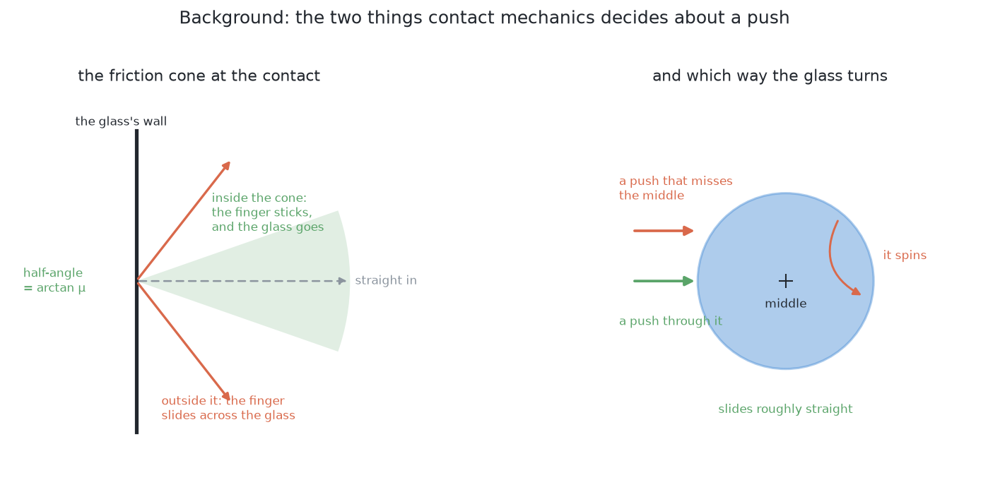

# Problem 3 — how it would be solved

## Introduction

[`problem.md`](../problem.md) says what is being asked for. This document says
how it would be answered, and it is the way into the eleven solution documents
that sit beside it. It explains why the job is done by pushing rather than by
lifting, the words all eleven documents share, the one question worth asking of
any solution that contains a trained model, and the combination of solutions
this project recommends and has built. By the end you will know which document
to read next and why.

Each of the eleven has a full document of its own, so this one does not repeat
them. For each it says what the method is, the single most important thing that
was measured about it, and the verdict. Every number here is owned by one of
those documents, and this one names which.

## Where we are

Problem 2 has finished. The arm knows which pixels are which glass and where
each one stands on the table. Some of those glasses are standing too close
together for the gripper to get round one without fouling its neighbour.

They have to be moved apart. Not by picking them up — **by dragging them across
the table.**

One thing about the tables themselves has to be said before any rate in any of
the eleven documents can be read, because a reader who tries to reproduce a
number will hit it immediately. **Problem 2's spawner cannot produce a crowded
table.** `random_glasses` in `work_cell.glasses.spawn` refuses any position
closer than `MIN_SEPARATION`, which is 150 mm between middles, and that is above
every crowding threshold in this problem, so nothing it draws is ever crowded.
Problem 3 therefore has a generator of its own, `scene(seed)` in
[`problem-3-sim/bench.py`](../../../problem-3-sim/bench.py), which guarantees at
least one glass without room on every table and in which about three glasses in
four start without room. Both populations are real and both are in the
repository, so every rate below says which one it was measured on. [Do not drag
at all](01-do-not-drag-at-all.md) owns that finding and measured it over 1500 of
problem 2's tables, on which the count of crowded pairs is zero.

## Why dragging, and not lifting

This is worth restating, because the whole document rests on it.

To lift a glass, the fingers have to close on it in a chosen place. To choose
that place, the arm needs the glass's profile. To measure the profile, it needs
a side-on photograph from 380 mm away. To take that photograph, it needs a
viewpoint that is not blocked — which is exactly what the crowding has taken
away.

So lifting depends on measuring, measuring depends on seeing, and seeing is what
is broken. A push breaks the circle because it needs almost nothing: a position
and a base width, both of which problem 2 already produced. It does not need the
glass's height, its shape, its weight, or where its stem is.

## The words, first

Seven terms, used throughout.

A **push** here means moving a glass across the table with the closed gripper,
in contact the whole way. **Dragging** and **pushing** are used
interchangeably.

**Singulation** is the name the robotics literature gives to this job:
separating objects that are touching or crowded so that they can be picked up
one at a time. It is worth knowing the word, because it is what to search for.

**Quasi-static** describes a push slow enough that momentum does not matter.
Let go of a glass mid-push and it stops rather than sliding on. Everything in
this document assumes it, and at the speed an arm pushes it is true.

The **friction cone** is the set of directions in which a finger can push a
surface without sliding across it. Push within the cone and the finger grips
and the object moves. Push outside it and the finger skids across the glass.

The **centre of the footprint** is where the glass's circular base sits on the
table. A push whose line passes through it slides the glass roughly straight. A
push that misses it spins the glass as well as moving it.

**Room** is the test that decides whether a glass is crowded, and it is not the
symmetric distance most people write down first. `bench.has_room` says a glass
has room when every other glass on the table satisfies

    distance  >=  GRIP_ROOM + that other glass's width / 2

with `GRIP_ROOM` at 70 mm. The obstacle the open jaw has to clear is the
*neighbour's* material, so the threshold depends on the neighbour's width rather
than on the pair. A narrow glass beside a wide one is therefore crowded while
the wide one beside it is not. Across all four kinds the threshold runs from
92.5 mm, when the neighbour is the narrowest glass in the ranges, to 122.5 mm,
when it is the widest. [Geometry generates, a model
ranks](06-geometry-generates-a-model-ranks.md) and [do not drag at
all](01-do-not-drag-at-all.md) both work from that rule.

**Toppling** is the failure that cannot be undone. A pushed object slides while
the contact height is below `a / μ` — half the base width over the friction with
the table — and tips above it. Everything here has to stay below that line, and
the height that goes into it is **65 mm and not 50 mm**. The middle of the
closed jaw rides at `LOWEST_GRIP`, 50 mm, because below that the gripper's own
body is through the table, but the jaw is 30 mm tall, so its top edge is at
65 mm, and a glass that is wider higher up meets that top edge first. Every
tapered glass is wider higher up. `bench.py` says so itself, in
`JAW_TOP = PUSH_HEIGHT + FINGER_HEIGHT / 2`. [Identify the contact
parameters](09-identify-the-contact-parameters.md) owns that finding, and it is
the single most consequential number in the set.

## Three families, and what "hybrid" means

Every solution below belongs to one of three families. The difference is worth
setting out before the list, because it is not quite the difference most people
expect.

**Programmed.** You state the rule and the computer applies it. No training
data, no model file, no graphics card. It runs in about a millisecond, it works
on an object it has never seen, and when it fails you can usually find out why
by printing one number. Its limit is that somebody has to be able to write the
rule down, and for some questions nobody can.

**Learned.** The behaviour comes from numbers fitted to examples rather than
from a rule anybody wrote. It can do things nobody knows how to state — telling
one object from another in a cluttered photograph, for instance. It pays for
that with a training set, a file of weights that has to be kept in step with
the world, hardware to run it on, and an answer that cannot explain itself.

**Hybrid.** Both, arranged so that the learned part sits inside something
checkable.

The interesting question about a hybrid is not how much of it is learned. It is
**where the learned part sits**, because that is what decides what happens when
the model is wrong — and a model is wrong sometimes, by construction.

There are four positions, and only the first is what most people picture when
they hear "we used a model".

**As the decider.** The model takes the input and its answer is the answer. A
wrong answer is acted on, because nothing downstream is in a position to
disagree.

**As a proposer.** The rules find candidates and hand the hard ones to the
model; the model suggests something better; the rules then check the
suggestion. A wrong suggestion is rejected by arithmetic, and the system falls
back to what it had.

**As a ranker.** The rules generate every candidate *and* veto the unsafe ones.
The model only puts the survivors in order. A bad ordering costs one wasted
attempt. It cannot cost anything worse, because every candidate had already
passed the safety checks before the model saw it.

**As a verifier.** The rules act, and the model's job is to check what actually
happened. A wrong check costs one extra measurement.

The last three share a property worth naming, because it is the whole argument
for hybrids in a physical system: **the learned part's mistakes are bounded by
something that does not need the model to be right.** That is not a statement
about model quality. A better model narrows the failures; only the arrangement
caps them.

One practical consequence is worth having in mind while reading. A hybrid is
usually *cheaper* than a full learned solution, not more expensive, because the
learned piece has one narrow job. Learning "is this one object or two, given
this crop" needs a fraction of the data of learning "find all the objects", and
it trains on a laptop.

## Feedback: choosing what to measure next

The second theme running through what follows is that **the number of
measurements does not have to be decided in advance.**

Most pipelines are open loop. Take the pictures, work everything out, act. The
number of pictures is fixed before the run starts, so if one object turns out
to be unclear, unclear is how it stays. Everything downstream inherits the
doubt without being told there was one.

A closed loop spends its measurements where they are needed. It takes a
picture, works out what is settled and what is not, and if something is not, it
asks a different question: *where would I have to look for this to become
clear?* Then it goes and looks there, and repeats.

Three things are needed to make that work, and a solution that has only two of
them is not really a loop:

1. **A measure of doubt.** Something that distinguishes "settled" from "not
   sure", rather than always producing an answer. A method that cannot be
   unsure has nothing to drive the loop with.
2. **Actions that could reduce it.** A set of measurements the arm could
   actually take — reachable camera poses, a touch, a different angle — and
   some way of guessing which would help.
3. **A budget.** Every extra look costs arm time, which is by far the most
   expensive resource here. Moving the camera and letting it settle costs
   seconds; running any of the models below costs milliseconds. So the loop has
   to stop, and the sensible rule is to stop when nothing is unclear *or* the
   budget is spent, reporting whatever is still doubtful rather than guessing
   at it.

That third point reverses an instinct most developers bring with them. The
thing to economise on is not computation. It is the number of times the arm has
to move.

## Everything here runs in simulation

One rule has been applied to every solution below, and it is worth stating
before the list because it removed some obvious candidates.

**A solution is in this document only if everything it needs can be produced by
the simulator on the machine this project runs on** — an Apple Silicon Mac with
no NVIDIA graphics card, no robot on a bench, and no real-world data. Problem 3
is scored in MuJoCo rather than in Gazebo, which matters to the fourth condition
below and to nothing else. Four conditions:

1. **No artefact from outside.** Any model has to be trainable from what the
   simulator renders. A downloaded file of weights fitted to photographs of the
   real world is not reproducible here, however good it is.
2. **No sensor the simulator does not have.** This cell has a depth camera, pad
   contact sensors and a wrist force-torque sensor. Anything else is a purchase
   order.
3. **No graphics card it has not got.** Anything needing compiled CUDA kernels
   is out.
4. **Hours, not days.** A method needing a week of continuous simulation to
   train cannot be iterated on, and a method you cannot iterate on will not get
   debugged. That condition has been measured rather than asserted, and the
   measurement is smaller than this document used to claim. One push in
   `bench.py` is 78 to 140 milliseconds of wall clock against 7.8 to 8.66
   seconds of simulated arm motion, so the bench runs 56 to 111 times faster
   than the thing it simulates. [Search a push
   strategy](11-search-a-push-strategy.md) works the consequences out: a
   black-box search over a small strategy is under three core-hours, and one
   reinforcement-learning reward function is about 29 core-hours. "Hours against
   days" therefore holds at about ten to one per reward function, and fifty to
   one once the several attempts a reward function really takes are counted.

That rule is not a view about learned methods. Several good answers fail it,
and they are written up in full in
[`learned-with-hardware.md`](learned-with-hardware.md) beside the condition
each one fails — a promptable foundation model, a fine-tuned instance
segmenter, and the rest. None of them needs a different *algorithm* to become
usable. They need a different *setup*.

The rule does have one consequence worth seeing coming. It pushes the learned
solutions towards **small models trained from scratch on synthetic data**, and
away from the fine-tune-a-big-model recipe that is the default advice
everywhere else. For a cell that handles one kind of object, under one lighting
setup, through one camera, that turns out to be less of a sacrifice than it
sounds.

## The eleven solutions, at a glance

Four programmed, four hybrid, three learned. Read each row as one solution: its
family, where a trained model sits in it if there is one, whether it decides
what to measure next rather than measuring once, and the verdict the solution's
own document reaches. The solution name links to that document.

| | Solution | Family | Where the learned part sits | Closed loop? | Verdict |
| --- | --- | --- | --- | --- | --- |
| 1 | [Do not drag at all](01-do-not-drag-at-all.md) | programmed | — | **yes** | **chosen — the loop's other half** |
| 2 | [One fixed nudge](02-one-fixed-nudge.md) | programmed | — | no | build it, ship none of it |
| 3 | [Plan, feel, look again](03-plan-feel-look-again.md) | programmed | — | **yes** | **chosen — the core, and built** |
| 4 | [Predict the slide](04-predict-the-slide.md) | programmed | — | no | correct theory, missing inputs |
| 5 | [A learned residual on the push model](05-a-learned-residual-on-the-push-model.md) | hybrid | proposer | **yes** | cheap, and aimed at the wrong number |
| 6 | [Geometry generates, a model ranks](06-geometry-generates-a-model-ranks.md) | hybrid | ranker | partly | safe, and worth nothing measurable here |
| 7 | [A learned change-verifier](07-a-learned-change-verifier.md) | hybrid | verifier | **yes** | **the first learned thing worth adding** |
| 8 | [A learned early-abort](08-a-learned-early-abort.md) | hybrid | verifier, during the act | **yes** | the only one that can *prevent* a topple |
| 9 | [Identify the contact parameters](09-identify-the-contact-parameters.md) | learned | proposer | **yes** | the only one that improves a safety decision |
| 10 | [Learn a forward model, then plan](10-learn-a-forward-model-then-plan.md) | learned | decider | **yes** | built, and it beats the programmed run |
| 11 | [Search a push strategy](11-search-a-push-strategy.md) | learned | decider | partly | cheapest entry, lowest ceiling |

Every one of the eleven is written to the same plan. What it is. Why anyone does
it that way. How it would work in this cell. The feedback loop, if it has one. A
worked example with real numbers. What it needs. What it is good and bad at. How
it fails. And where it sits among the other ten.

## The four programmed solutions

### Solution 1 — do not drag at all

Before any push, rack every glass that already has room around it. A racked
glass is nobody's neighbour any more, so some glasses that were crowded stop
being crowded without anything touching them.

The measured thing worth knowing is that this is **not a prefix to pushing; it
is the other half of a loop that pushing drives.** Run as a prefix on the
bench's tables it clears 3.6 per cent of them and racks 1.40 glasses before the
first push, which looks marginal. Run as the loop's other half it is what turns
every push that works into racked glasses, and `problem-3-programmed/run.py`
runs the two as one loop: look, rack everything with room, and only if nothing
has room choose one push, make it, and start again.

A glass that qualifies needs two things, not one: the jaw has to have room, and
the camera has to have somewhere to stand to measure the profile from. The second
condition turns out to be the harsher of the two. Offered nine places on the
circle round a glass, 54.0 per cent of glasses on a crowded table have no clear
direction of the nine, and on problem 2's uncrowded tables the figure is still
45.6 per cent — so nearly all of that is there before any crowding is.

It is chosen, and it runs first on every pass, for one reason that has nothing
to do with its clearance rate. **Touching a glass is the only step in this
problem that can topple one**, so doing it fewer times is worth more than doing
it better.

→ [the full document](01-do-not-drag-at-all.md)

### Solution 2 — one fixed nudge

Find the glass that has no room, find the neighbour in its way, and push one of
the two a fixed distance along the line between them. No search, no map of the
free table, no model of what a push does.

Its important property is not that it is risky. In its simplest form it is
**geometrically impossible**, and this is the finding that decides the whole
comparison with solution 3. The push direction and the approach direction are the
same line, so pushing a glass straight away from its neighbour asks the arm to
stand 270 mm of tool where the neighbour is. Not one of 420 crowded glasses
could be pushed directly away from its neighbour. With the arm treated as a
point the best fixed distance is 24 to 28 mm depending on the population
measured, and it is still wrong 53 to 56 per cent of the time; with the arm's
body in the arithmetic every fixed-nudge variant scores 0.0 per cent, and even
free choice of direction reaches only 55.7 per cent.

The distance was never where the failure lived, which is why the formula this
overview used to print — the shortfall against 140 mm plus 20 mm of margin — is
*worse* than a flat number rather than better, at about 69 per cent wrong
against 56. Build it first anyway, because it is the cheapest way to get a real
push happening against a real glass, and ship none of it.

→ [the full document](02-one-fixed-nudge.md)

### Solution 3 — plan the destination, feel for the glass, look again

Enumerate every destination the glass could be pushed to, throw away the ones
that fail a test, push to the shortest survivor, feel the last centimetres of
the approach rather than driving them, and take a fresh overhead photograph
afterwards.

The case for looking again is **not** that pushes are inaccurate. They are
accurate: 1.0 mm at the median and 3.9 mm at worst over 212 real pushes, and the
planner lands 1.07 mm at the median over 564 of them. The real reason to look is
that what does go wrong — a lean, a missed contact, a third glass losing its
room, a table with no safe push at all — is invisible to any push model and
obvious in the next photograph.

Two of the four destination tests can never fire. Every corner of the glass zone
is 330 to 777 mm from the base against a reach of 300 to 780 mm, and the rack is
on the arm's other side, so the zone test and the reach test never reject
anything. The tests that do the work are the room test and **the arm's own
corridors**: 12.5 per cent of 42,529 enumerated candidates die on the fingers or
the body.

It is chosen, it is the core, and it is built. `problem-3-programmed` racks 199
of 251 glasses over 50 held-out tables, finishes 35 of them, and topples nothing.

→ [the full document](03-plan-feel-look-again.md)

### Solution 4 — predict the slide with pushing mechanics

Derive where a pushed glass goes from contact mechanics rather than measuring
it. This is the document the rest of problem 3 borrows its arithmetic from: it
derives `h < a / μ`, shows why the glass's mass drops out of it, and explains
the friction cone, the limit surface and Mason's voting theorem in ordinary
words.

The measurement it ends on is the surprise. The two inputs this cell cannot
supply cost **very little where everybody expects them to cost a lot**, in the
predicted landing place, where the error is a couple of millimetres against a
photograph's half. They cost a great deal where nobody thought to press: in
deciding whether the glass may be touched at all.

The verdict is correct theory, missing inputs. Keep the qualitative half — push
as low as the gripper can reach, always; push through the middle of a round
footprint; keep the contact inside the pad's friction cone — and drop the
numerical half rather than printing a guessed base to two figures and calling
the result a prediction.

→ [the full document](04-predict-the-slide.md)

## The four hybrids

### Solution 5 — a learned residual on the push model

Keep solution 4's physics and learn only its error. The physics predicts where
the glass will finish, the camera measures where it actually finished, and a
small model learns the difference as a function of things the arm already
measured. The physics supplies the structure; the learned part supplies only
what the physics could not know.

No residual model exists in this repository, so the design is a design. The
residual it would have to learn **was** measured, though, over 248 real pushes
made by this project's own planner, and it is about 1.3 mm. So the arrangement
would sharpen a quantity already good to a millimetre while 90 of the geometric
pipeline's 212 pushes are repeats for reasons the landing accuracy has nothing
to do with.

The lesson the document ends on is worth more than the component: **check that
the quantity you are about to improve is the quantity the task is scored on.**
One thing to keep straight while reading — `problem-3-learned/` implements
solution 10, not this one.

→ [the full document](05-a-learned-residual-on-the-push-model.md)

### Solution 6 — geometry generates, a model ranks

Arithmetic writes down every push that is allowed, arithmetic throws away the
ones that are not, and a model is handed whatever survives with one job: put the
list in order. The model cannot add an action and cannot overrule a rejection,
so the worst a wrong prediction can do is waste one attempt. It is the safest
place there is to put a learned component in a machine that can break something.

And here it has nothing to rank. In **100 per cent** of the freeing sets
measured, every legal candidate scores identically on the labels this solution
proposes, and the reason is structural rather than accidental: the legality test
already requires the destination to be clear, and `plan.along()` stops each
heading at the first travel that works, so every survivor lands on the same
contour. Meanwhile 71.5 per cent of crowded glasses have no push that frees them
at all, so most of the time there is no freeing set to order in the first place.

The verdict is safe, and worth nothing measurable here. The general lesson is
the transferable part: **a ranker earns its place only when the thing that
separates a good candidate from a bad one cannot be computed from what you
already know.**

→ [the full document](06-geometry-generates-a-model-ranks.md)

### Solution 7 — a learned change-verifier

Replace only solution 3's last step. The planning, the destination search, the
tipping check and the push itself stay exactly as written, and the geometric
before-and-after comparison becomes one question put to a small trained model:
what happened?

The reason it is needed is that **a glass past the project's own failure line
still looks upright from above.** `STANDING_TILT_DEG = 20.0` in `bench.py` is
the definition of fallen. At exactly 20 degrees the overhead blob has grown by a
median of only 28 mm, and the tallest point has *risen* for all 400 glasses
drawn from the kind's range, because the glass is balanced on the edge of its
foot with its rim swung up. A camera looking straight down is therefore the
worst available place to ask whether a glass went over.

Its most useful answer is the one that decides nothing: "I cannot tell" is what
sends the arm to a low, side-on viewpoint that settles the case. It is the first
learned thing worth adding, because it is the cheapest, it cannot influence the
action at all, and it is aimed at the failure the problem statement says to
watch hardest — and the case for building it rests on a measurement of how often
this cell actually topples a glass, which should be taken first.

→ [the full document](07-a-learned-change-verifier.md)

### Solution 8 — a learned early-abort

Watch the wrist force-torque sensor during the push and stop the arm when the
trace looks like a glass beginning to tip. This is the only entry in the set
that acts *while* the glass is going over, which makes it the only one that can
**prevent** a topple rather than report one.

The size of the job is what justifies it. Take 400 tapered glasses and give the
arm a tipping check that looks entirely correct: friction assumed at 0.3,
compared against the 50 mm the jaw's middle is aimed at. That check declares 379
of the 400 safe to push, and **284 of those 379 pushes end with the glass over**,
once the two things the arm was never told are accounted for — that the table's
real friction is 0.35 and that a tapered glass meets the jaw's top edge at 65 mm.

Two things this document corrects are worth carrying. The force **falls** during
a tip rather than climbing, so a detector armed to fire on a rise fires before
anything has tipped. And the latency chain sums to **96 ms**, not the 45 ms this
overview used to state. It goes last of the learned additions, because it is the
one with a real-time constraint — and before any of it, the one-line change that
compares the tipping check against 65 mm removes 148 of the 284 toppling pushes
and costs nothing.

→ [the full document](08-a-learned-early-abort.md)

## The three learned solutions

### Solution 9 — identify the contact parameters

Estimate the friction under the glass from the pushes the arm is making anyway,
hand back an interval rather than a number, and let the tipping check use the
pessimistic end of it. Friction is not unknown in this cell: `bench.py` sets
`TABLE_FRICTION = 0.35` uniformly, on every glass and every table. **The arm is
simply not told it**, and 0.35 is the ground truth a run is scored against
rather than an input any decision may use. That is what makes this the one
solution whose answer can be held up against the truth and marked.

What the estimate is worth, at the real 65 mm push height: a guessed μ of 0.30
says 55.8 per cent of 400 drawn tapered glasses can be pushed at all, the
simulator's 0.35 says 25.0 per cent, and a guessed 0.50 says **none of them
can**, because a 65 mm push needs a foot wider than 65 mm and the kind's widest
possible foot is under 61 mm. Twenty push pairs recover μ to within 8 per cent,
which brackets the true share from both sides, and the price is a willingness to
make one push deliberately faster than the rest of problem 3 would like.

This is the only entry here that improves a **safety** decision rather than a
performance one. It also produced the single most important finding in the whole
set, which the section on failures below takes up.

→ [the full document](09-identify-the-contact-parameters.md)

### Solution 10 — learn a forward model, then plan against it

Stop deriving where a push leads and fit it instead. Record tens of thousands of
pushes, fit a function from the table and the push to the table afterwards, and
then search candidate pushes by asking that function about each one. This is the
one solution in the set that has actually been built as a learned pipeline:
`problem-3-learned` holds the model, the search and a scored run.

On the same 50 held-out tables, **the learned pipeline beats the programmed one
on the task while being four times less accurate per push.** It racks 208
glasses in 113 pushes with 15 repeats, against 199 glasses in 212 pushes with 90
repeats; neither topples anything. Landing error is 1.7 mm at the median and
24.8 mm at worst, against 1.0 mm and 3.9 mm. The reason is that landing accuracy
is not what the task is scored on. Knowing where a glass lands does not tell you
which push will make room, and the learned model predicts the latter, including
where the neighbours go and whether the push will topple something or be blocked.

That comparison should not be oversold as a controlled experiment. The two
pipelines differ in search method and in corridor checks as well as in model,
their refusal reasons differ in kind rather than in count, and the learned run
has six execution faults against none. Its planner is a cross-entropy search
with the implementation's own settings, 300 draws a round, the best 30 kept, four
rounds.

It is the best of the three learned entries even so, because a forward model
serves any goal while a policy serves only the goal it was rewarded for, and
because replanning at every step makes a mediocre model useful. If a learned
approach were taken here, this would be it — and it is still not the thing to
build first.

→ [the full document](10-learn-a-forward-model-then-plan.md)

### Solution 11 — search a push strategy

Leave solution 3 exactly as it is and search over the eight numbers inside it —
the clearance, the aiming margin, the probe distance and the rest — scoring each
setting by running whole tables in the simulator this project already has. It is
the same family of idea as reinforcement learning, with a few numbers to move
instead of a million weights.

Its value is the budget arithmetic, and it corrects this overview by about a
factor of ten. The old figure of eleven and a half days for reinforcement
learning was a Gazebo figure, and problem 3 runs in MuJoCo. Measured on this
machine, one reward function is about 29 core-hours, a black-box search over the
eight numbers is under three core-hours, and the honest verdict is that "hours
against days" holds at about ten to one per reward function and fifty to one
once the several attempts the reward will really take are counted.

It adds no capability, supplies no number and ranks nothing. It is the cheapest
learned thing in problem 3 and the only one whose output a person can read, and
its ceiling is the lowest: **tuning cannot rescue a strategy that is wrong in
kind**, which is what solution 2 is a warning about.

→ [the full document](11-search-a-push-strategy.md)

## The decision

**Solution 1 and solution 3, as one loop, and they are built. Before anything
learned, make the tipping check compare against 65 mm. Solution 7 is then the
first learned thing worth adding, solution 9 the number worth having, and
solution 8 the last. Solution 10 is built too, and measurably better on the
task, and it is still not what to build first.**

### Do the free thing before the risky thing

Solution 1 runs first on every pass of the loop, because every glass racked is a
glass off the table and **touching a glass is the only step in this problem that
can topple one**. On its own it clears 3.6 per cent of the bench's tables, so it
is not an alternative to pushing. Run as the loop's other half it is what
converts each push that works into racked glasses.

### Then plan, feel, and look

Solution 3 replaces solution 2 outright, and the reason is stronger than a
fixed nudge being risky. A fixed nudge can indeed push a glass into a third
glass, and that was measured. But the fatal objection is the other one: the
nudge pushes straight away from the neighbour, and **not one of 420 crowded
glasses has any safe push in that direction at all**, because that is where the
arm would have to stand. The baseline is not risky. It is impossible.

Solution 3 is also not chosen for being more accurate. Both methods push and
then look, and in this simulator both aim to about a millimetre. It is chosen
because it checks the destination against the whole table and against the arm's
own body, and because the freedom that turns out to matter is the **direction**
rather than the distance.

### The fifteen millimetres that come before any model

One change is worth making before anything on the learned half of this list, and
it is one line. The tipping check has to compare against the height the jaw
actually touches at, 65 mm, and not the height its middle rides at, 50 mm. On
the population [a learned early abort](08-a-learned-early-abort.md) measures,
that alone removes 148 of 284 toppling pushes, and it costs nothing at all. Every
learned component below is a way of catching consequences that this line removes
outright.

### Why the verifier first, and the early-abort second

These two are the same idea a second apart, and the second apart is the whole
difference.

**Solution 7** watches what happened after the push. It answers the questions
the geometry answers badly, and its "I cannot tell" is what sends the arm to a
low, side-on viewpoint that settles the case. It is needed because at the
project's own 20-degree failure line the overhead blob has grown by a median of
28 mm and the glass has got *taller*, so the camera cannot tell a topple from a
big push.

**Solution 8** watches the force *during* the push, which makes it the only
thing here that can prevent a topple rather than report one. It is second
because it is harder: it has a 96 ms latency chain to live inside, and a model
too slow to stop the arm is worthless however accurate. The force also falls
rather than rises as a glass goes over, so the naive detector fires on the wrong
feature.

Both have free labels in simulation, and both need topples produced on purpose,
because they are rare in normal running and the model has to have seen some.

### Why the parameter estimate is the quiet one to want

The tipping check decides which glasses may be pushed at all, and it runs on a
friction the arm is not told. **Solution 9 replaces that guess with an estimate
and an interval**, and the check can then use the pessimistic end. That is not a
more accurate system. It is a *safer* one, and it is the only entry here that
improves a safety decision rather than a performance one.

Solution 5 is its close relative and the difference is worth keeping straight:
solution 5 learns the model's error, solution 9 learns the model's missing
input. The second hands back a number every other part of the system can use,
and a number that can be held up against the simulator's 0.35 and marked.

One caution from the implementation. Taking the pessimistic end literally, and
refusing anything that would tip at μ = 0.5, refused 35 of the first 60 glasses,
which is not a working system. What `plan.py` does instead is push the glass
5 mm and look: if it moved it slid, and if it did not it leaned and came back
and is refused. That is the same shape as every other decision in the project, a
cheap guess checked by a measurement, and it is why roughly half the geometric
pipeline's pushes are questions rather than moves.

### What solutions 10 and 11 are for

**Solution 10** is built, and on the same 50 tables it racks nine more glasses in
half the pushes. That is a real result and it should not be waved away. It is
still not what to build first, for three reasons. It needed 38,012 pushes and
five trained networks where the geometric pipeline needed none. It introduced six
execution faults where the geometry had none. And the comparison is not
controlled: the two pipelines differ in more than their model, so the nine
glasses cannot all be charged to the model.

What it does establish is worth more than the nine glasses. **A model that is
four times less accurate can do the job better if it is accurate about the right
question.** The geometry predicts where a glass lands and then spends half its
pushes finding out things it cannot predict; the learned model is worse at the
landing and answers what the task is actually scored on.

**Solution 11** is the cheap one. Eight numbers rather than a million weights
means an evening rather than a long weekend, and because the parameters live
inside the geometric planner, which keeps its vetoes, no candidate the search
proposes can be unsafe. It is the cheapest way to find out whether the
hand-chosen constants are anywhere near right, and it can be discarded without
trace if the answer is that they already were.

### What would be built, in order

1. **The reachability test** — solution 1. A handful of comparisons, run on
   every pass of the loop rather than once at the start.
2. **The tipping check** from the measured base width, **compared against
   65 mm**. It must exist before anything touches a glass, and the height is the
   part most likely to be written down wrongly.
3. **The push**, as a sideways guarded move with the fingers closed.
4. **The destination search** — solution 3's tests, with the arm's own body in
   them, because the body is what rejects almost everything that is rejected.
5. **The look-again comparison**, geometric to begin with.
6. **The change-verifier** — solution 7 — once runs have been scored and the
   numbers say the geometric comparison misses topples or raises false alarms.
7. **The parameter estimate** — solution 9 — after enough pushes have been
   logged, which is the point: it cannot be built first even if you wanted to.
8. **The early-abort** — solution 8 — last, because it is the one with a
   real-time constraint and the most ways to be subtly wrong.

Steps 1 to 5 are programmed. The ordering of 6 to 8 is the argument: **measure
which failure you actually have before choosing a component to fix it**, and
take the cheap observer before the thing that has to act in milliseconds.

### How it would be known to work

Against the simulator's own record of what it spawned, and stating which
population the tables came from. The figures in brackets are what the built
geometric pipeline scored over 50 held-out bench tables, so a change can be
compared against something.

- how many glasses ended up with the room they need (199 of 251), and how many
  tables were finished (35 of 50);
- how many pushes it took (212), and how many were repeats because the first
  fell short (90);
- how far each glass ended up from where the push aimed it (1.0 mm at the
  median, 3.9 mm at worst);
- how many were refused, and for which reason (52, every one of them "nowhere
  clear to push it to");
- **how many were toppled, which should be none** (none) — and separately, how
  many topples were *caught* by solution 7 and how many were *prevented* by
  solution 8. Those are three different numbers and all three matter.

## Where the chosen solution can fail

Naming the failures of the chosen answer is more useful than listing its
strengths. The first of these was the most valuable thing the eleven documents
turned up, and it was not the failure anybody went looking for.

**The height error is bigger than the friction error.** A tipping check written
against the jaw's middle, at 50 mm, reports 77 per cent of drawn tapered glasses
pushable when the true answer at the simulator's own friction is 25 per cent.
That is 52 percentage points, every one of them in the dangerous direction, and
it is **larger than the 31 points an optimistic friction guess costs**. The
biggest error in the cell was not the constant everyone knew was guessed. It was
the one nobody thought to question, and the fix is one line. [Identify the
contact parameters](09-identify-the-contact-parameters.md) owns the finding, and
the general habit it argues for is to ask what a constant really is before
asking how accurately it is known.

**The friction is not measured, so the tipping check is not measured either.**
The arithmetic is sound and one of its two inputs is a guess. Pushing as low as
the gripper can reach, always, is the mitigation, and the 5 mm probe push is how
the built implementation gets a measurement instead. Neither is a proof, and the
stakes are visible in the numbers: at the real 65 mm, a guess of 0.30 says 55.8
per cent of glasses are pushable, the simulator's 0.35 says 25.0 per cent, and a
guess of 0.50 says none are.

**Most crowded glasses have no push that frees them.** 71.5 per cent of them,
measured by [geometry generates, a model
ranks](06-geometry-generates-a-model-ranks.md). The planner falls back on pushes
that only loosen the table, and without that fallback 107 glasses were left
stuck where 50 are with it. The honest output when nothing works is a named
refusal, not a shuffle.

**A glass can be pushed somewhere that is clear for it and not clear for
everybody else.** The destination tests ask whether the *moved* glass will have
room where it lands, and because the room test is asymmetric that is a different
question from whether every other glass still has room afterwards. Measured over
40 tables, 11 of 84 pushes — 13.1 per cent — took the room away from a glass that
had it. The loop recovers, because it looks again, but it costs a push, and it is
a gap in the test rather than an accident. Adding the reverse check is four lines.

**The arm runs out of places to stand, not out of table.** This overview used to
say that five glasses each needing 140 mm in a zone 320 by 360 mm is close to
what fits and that six may be unsolvable. That is wrong. Nine glasses fit in the
zone on a 140 mm grid with every one of them having room, and 140 mm is the
symmetric worst case anyway. The loop still gets stuck, and [plan, feel, look
again](03-plan-feel-look-again.md) shows why with table 10009: five glasses, none
with room, four spare places on the table, and after one push no safe push for
any of the other four, because the arm cannot get 270 mm of tool behind them.

**Pushing changes the viewpoints as well as the spacing.** A glass moved to make
room for the gripper can block the line of sight to another one. The loop catches
it, because it re-runs the whole separation each time, but it means the number of
pushes is not bounded by the number of crowded pairs.

**Nothing measures the glass's mass before touching it.** A push is applied to a
glass of unknown weight, and over the drawn tapered range that weight runs from
97 g to 453 g, a factor of 4.65. In the simulator that is harmless. On a real
table a heavy glass resists and a light one skates, and separating friction from
mass needs a second push made deliberately faster than the first, which is in
tension with every other safety rule in the problem.

← [The problem](../problem.md) · [The ones that need more than a simulator](learned-with-hardware.md) · [Problem 4 — several kinds at once](../../problem-4) →
