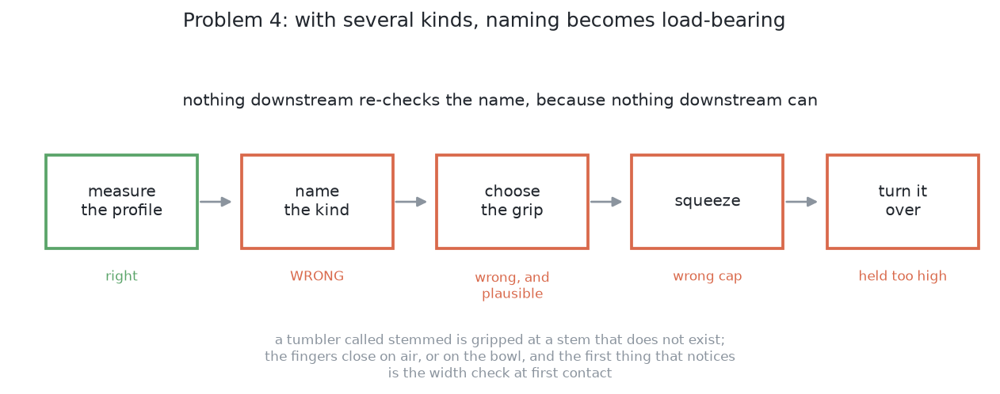

# Problem 4 — several kinds at once

A few kinds of glass stand on the table together. The arm has to measure each
one, decide which kind it is, pick it up, turn it over, and stand it on the
rack — one at a time, until the table is clear.

This is problems 1, 2 and 3 joined up, plus one thing none of them has: **the
rule changes per glass.**

## What is on the table

Four to six glasses, drawn from more than one of the four kinds — straight,
tapered, stemmed, short-stemmed — at proportions picked at random inside each
kind's plausible range. Upright, opaque, at least 150 mm apart to begin with.

The rack is where it always is: six slots, position found from its marker.

## What is new

### Naming the kind becomes load-bearing

In problem 1 the classifier has to be right, but a wrong answer is cheap. There
is one glass, and a rule applied to the wrong kind of glass almost always fails
its own checks — the opening comes out impossible, or the band is too short —
so the glass is refused and the run says so.

With several kinds on the table, two things change. The classifier runs several
times per run, so an error rate that was invisible at one glass a run becomes
visible. And a wrong name can be **wrong and plausible**: a tapered glass with a
very shallow wall called straight is fine, but a tumbler with a notch in its
outline called stemmed is not, and the rule for a stemmed glass will happily
return a grip at a stem that does not exist.

Nothing downstream re-checks the name, because nothing downstream can. The
first thing that notices is the width at first contact in step 5, by which time
the arm has already travelled to the glass and closed on it.

### The rack has to be shared out

Six slots, several glasses, and glasses of different widths. A wide glass needs
its neighbouring slot left empty; a narrow one does not. Which glass goes in
which slot stops being "the next free one" and becomes a decision that can run
out of room — and the order the glasses are handled in decides whether it does.

Problem 1 has this arithmetic already, in the tilt budget. What it does not have
is the case where taking the wrong slot early leaves a later glass with nowhere
to go.

### Problem 2's strongest tool is taken away

Problem 2 separates glasses partly by fitting a circle to each footprint and
checking it against the one known kind's diameter range. With several kinds the
range is the union of four ranges, which is wide enough to be much weaker: a
footprint that is too wide for a tumbler is a perfectly ordinary wine glass
foot.

So the separation has to lean harder on clustering by distance and on agreement
between stations, and the merged-pair check gets less reliable exactly when
there are more glasses to merge.

## The six steps, and what changes at each

The pipeline is problem 1's. What follows is what each step has to do
differently, and nothing else.

**Step 1 — find the glasses.** Problem 2's separation, with the weaker
footprint check above. Output is a position and a rough width per glass, as
before.

**Step 2 — measure one.** Unchanged in what it does, harder in where it can be
done from: problem 2's viewpoint search decides which glasses can be measured at
all, and problem 3 moves the ones that cannot.

**Step 3 — name the kind.** Unchanged in method and much more important. This is
the step that needs a confidence, which it does not currently have: the answer
is a name or nothing, and a glass that only just cleared a threshold is treated
exactly like one well clear of it.

**Step 4 — choose where to hold it.** Unchanged. It already switches rule by
kind; that is what `spec.py` is for. The rules themselves need no new work.

**Step 5 — how hard to squeeze.** Unchanged per glass, and now the force cap
varies between glasses in one run, because the cap belongs to the kind. A run
that racks a thick tumbler at 12 N and then a thin flute at 6 N is working
correctly.

**Step 6 — turn it over and stand it down.** The slot choice is the part that
changes, for the reason above: it has to be made with the glasses still to come
in mind, not just the one in hand.

## What is deliberately not in this problem

**Unknown proportions.** The kinds are the four known ones and the proportions
are drawn from ranges the project holds. Taking those away is
[problem 5](../problem-5/problem.md).

**New kinds.** A shape that is none of the four is refused, as in problem 1.

## What "done" means

A run is **done** when every glass on the table is standing mouth-down over a
slot peg, or has been left standing with a sentence saying which step gave up
and why.

The numbers worth watching are problem 1's, plus three this problem adds:

- how many glasses were named correctly, against what was spawned;
- how many were named *incorrectly but plausibly* — the dangerous case, where
  the error survived until the fingers closed;
- how many were refused for want of a slot rather than for want of a grip,
  which is a sign the slot choice needs to look further ahead.

## Where the work would start

Nothing here needs a new technique. Problem 4 is problems 1 to 3 with the
pieces joined and two decisions made better: a classifier that reports how close
the call was, and a slot choice that plans for the glasses still on the table.

Both are written up as open items in
[problem 1's step 3](../problem-1/step3-what-kind-of-glass.md) and
[step 6](../problem-1/step6-turning-it-over.md).
