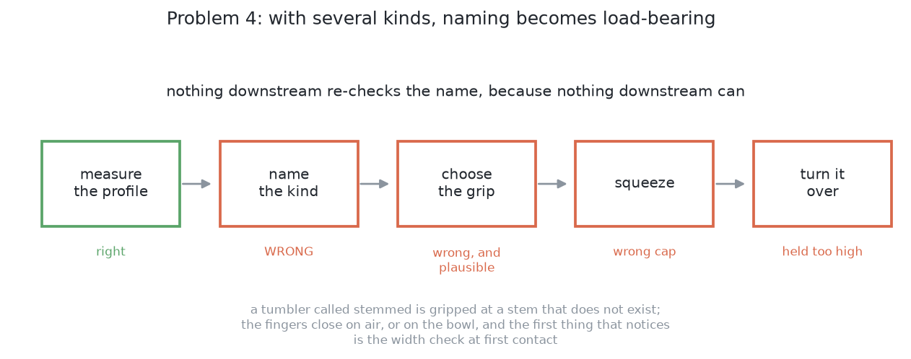

# Problem 4 — several kinds at once

A few glasses of **different kinds** stand on the table together. The arm has
to measure each one, decide which kind it is, pick it up, turn it over, and
stand it on the rack. One at a time, until the table is clear.

In one sentence: **this is problems 1, 2 and 3 joined up, plus one thing none
of them has — the rule changes from one glass to the next.**

## What is already done

Problem 4 starts with most of its pieces in hand. Each earlier problem solved
one part of it.

| Problem | What it solved | What problem 4 takes from it |
| --- | --- | --- |
| [1](../problem-1/README.md) | One glass, start to finish: find it, measure it, name its kind, choose the grip, squeeze, turn it over. Built, and runs in Gazebo. | The six steps, done on each glass in turn. |
| [2](../problem-2/problem.md) | Several glasses of **one** kind. Tell them apart and choose where to stand the camera for each. | Finding every glass on the table, and choosing a clear side view of each. |
| [3](../problem-3/problem.md) | Glasses standing too close to grip. Push them apart along the table. | Moving a crowded glass until the gripper can get round it. |

So most of a problem 4 run is old work done in the right order. The question
this document answers is: **what breaks when the glasses are not all the same
kind?**

## What is on the table

- **Four to six glasses**, of more than one of the four kinds: straight,
  tapered, stemmed, short-stemmed.
- Each glass's proportions are drawn at random from inside its kind's range.
- All upright and opaque.
- Some may stand too close together to be gripped, as in problem 3.
- **The rack** is where it always is: six slots, found from its marker.

## What is new: three things

In every earlier problem, one fact held: either there was one glass, or every
glass was the same kind. Take that away and three things change.

| | Before | Now |
| --- | --- | --- |
| **1. Naming the kind** | A wrong name was cheap. The glass was refused. | A wrong name can look right, and the arm acts on it. |
| **2. Sharing the rack** | One glass, any free slot. | Several glasses of different widths. Slots can run out. |
| **3. Telling glasses apart** | Every glass had the same width range. | The range is four kinds wide, so width says much less. |

Each one is explained below.

### 1. Naming the kind becomes load-bearing

**Why the name matters.** Each kind has its own rule for where to hold the
glass and how hard to squeeze. The name picks the rule. Nothing after that
looks at the name again.

**Before, in problem 1.** There is one glass. If the classifier gets the kind
wrong, the wrong rule almost always fails its own checks: the opening comes
out impossible, or the band to hold is too short. So the glass is refused, and
the run says why. A wrong name costs a glass, never a breakage.

**Now, with several kinds,** two things change:

- **Errors show up more.** The classifier runs four to six times per run, not
  once. An error rate nobody noticed at one glass per run becomes visible.
- **A wrong name can be wrong *and* plausible.** Some mistakes are harmless.
  Calling a tapered glass with a very shallow wall "straight" changes little.
  Others are not. Call a tumbler "stemmed" because a notch in its outline
  looks like a stem, and the stemmed rule will happily return a grip at a stem
  that does not exist.

**Why this is dangerous.** Nothing downstream re-checks the name, because
nothing downstream can. The first thing that notices is the width the fingers
meet in step 5. By then the arm has already travelled to the glass and closed
on it.

### 2. The rack has to be shared out

**Before.** One glass, six slots. Take the next free one.

**Now.** Several glasses, and they are different widths. A wide glass needs
the slots beside it left empty; a narrow one does not. So where a glass goes
is a real decision:

- Put an early glass in the wrong slot, and a later glass can find nowhere to
  go.
- The **order** the glasses are handled in decides whether that happens.

Problem 1 already has the arithmetic for "does this glass need an empty
neighbour" — the tilt budget in `rack/layout.py`. What it has never faced is a
choice made for one glass that leaves no room for the next.

### 3. Telling glasses apart from above gets harder

**Before.** In problem 2 every glass is one kind, with one known range of
widths. A footprint far outside that range is a warning sign: maybe two glasses
merged into one blob.

**Now.** The allowed range is the four kinds' ranges joined together. That is
wide. A footprint too wide for a tumbler is an ordinary wine glass foot. So
width is a much weaker check. The separation has to lean on clustering by
distance, and on the camera's different stations agreeing.

This matters less than it sounds. Neither of problem 2's built pipelines uses
the width check, so neither loses it.

## A run, step by step

The pipeline is problem 1's six steps, run once per glass, with problem 2's
finding before them and problem 3's pushing where a glass is crowded. This
table shows which steps carry over as they are and which have to change.

| Step | Comes from | In problem 4 |
| --- | --- | --- |
| **Find** every glass from above | problem 2 | **Weaker.** Width says less (new thing 3). Output is still a position and a rough width per glass. |
| **Push** a crowded glass apart | problem 3 | **Harder.** Its kind decides its foot, and its foot decides whether it can be pushed without tipping. The kind may not be known yet. |
| 1. **Find** this glass | problem 1 | Unchanged. |
| 2. **Measure** its profile | problems 1, 2 | Unchanged in what it does. Where it can be done from is problem 2's job; problem 3 moves glasses that block the view. |
| 3. **Name** the kind | problem 1 | **Same method, far more important** (new thing 1). Today the answer is a name or nothing. A glass that only just cleared a line is treated like one far from it. |
| 4. **Choose** where to hold it | problem 1 | Unchanged. It already switches rule by kind; that is what `spec.py` is for. |
| 5. **Squeeze** | problem 1 | Unchanged per glass. The force cap now varies within one run, because it belongs to the kind. Racking a thick tumbler at 12 N and then a thin flute at 6 N is correct. |
| 6. **Turn it over** and stand it down | problem 1 | **The slot choice changes** (new thing 2). It has to keep room for the glasses still on the table. |

Four of the six steps carry over untouched. The work is in **naming**,
**pushing** and **racking**.

## What is deliberately left out

- **Unknown proportions.** The kinds are the four known ones, and each glass's
  proportions come from ranges the project holds. Taking those away is
  [problem 5](../problem-5/problem.md).
- **New kinds.** A shape that is none of the four is refused, as in problem 1.

## What "done" means

A run is **done** when every glass on the table either:

- stands mouth-down over a slot peg, or
- is left standing, with a sentence saying which step gave up and why.

The numbers to watch are problem 1's, plus three new ones:

| Number | What it shows |
| --- | --- |
| glasses named correctly, against what was spawned | how good the naming is |
| glasses named **wrongly but plausibly** | the dangerous case: the error survived until the fingers closed. Should be zero. |
| glasses refused for want of a **slot**, not a grip | the slot choice is not looking far enough ahead |

## Where the work starts

No new technique is needed. Problem 4 is problems 1 to 3 joined, with two
decisions made better:

- a classifier that reports **how close the call was**, not just a name;
- a slot choice that **plans for the glasses still on the table**.

Both are already noted as open items in
[problem 1's step 3](../problem-1/step3-what-kind-of-glass.md) and
[step 6](../problem-1/step6-turning-it-over.md). Writing the solutions found
two more — measuring a crowded glass before it is pushed, and telling the push
model each glass's kind.

## How it would be solved

→ [Solution overview](solutions/solution-overview.md)
