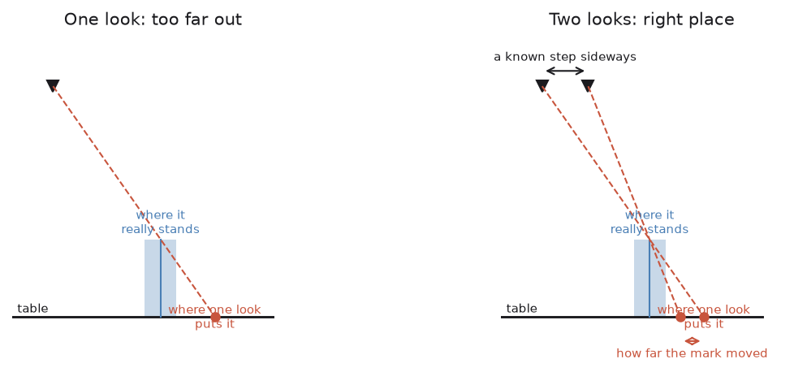

# Step 1 — finding the glasses

The run starts with the arm knowing nothing about the table in front of it. It
does not know how many glasses are on it, where they are, or how big any of
them is, and the [problem statement](../problem-statement.md) does not let it
be told: everything it uses from here on it has to have measured. This step is
where that begins.

What it has to produce is modest and deliberately so — a position on the table
for each glass, and roughly how wide each one's footprint is. What it must not
produce is anything about height or shape, because from directly above a tall
glass and a short one look almost identical and a stem is invisible. Those
belong to step 2, which looks from the side, and asking for them here would
mean guessing.

The difficulty is that the one sensor built for this job does not work. A
depth camera gets nothing back through glass, so where a glass is, the depth
picture has a hole in it. This document is mostly about why that hole is the
answer rather than the obstacle, and about the one thing a single picture from
above still cannot tell you however good the hole is.

Code: `glasses/detect.py`, and `_survey()` in `task.py`.

Below: why the hole is the signal, what it took to make the simulator honest
about glass, how a blob becomes a place on the table, what this step refuses
to guess at, why one look from above is not enough on its own, how else it
could have been done, and what the arm does with the answer.

## The depth camera sees nothing where the glass is

An RGB-D camera works by measuring how far away each pixel is. Most of them do
it by projecting a pattern of infrared light and watching where it lands.

Point one at a drinking glass and almost none of that light comes back. Some
goes straight through, some is bent sideways by the curved wall, and a little
scatters off at an angle that misses the sensor. The result is that the depth
image has a **hole** exactly the shape of the glass, while the colour image
shows the glass perfectly well.

This is the single most common complaint about using depth cameras with
glassware, and it is usually treated as the obstacle to get past.

It is better treated as the measurement.

```python
missing = ~np.isfinite(depth) | (depth <= 0.0)
lit = rgb.max(axis=2) > 25
return missing & lit
```

A pixel where the depth is missing but the colour camera can see something is a
pixel looking through a transparent object. That is what a glass is.

The second line matters. A hole on its own is not enough — the depth image is
also blank over the far wall, over anything beyond the camera's 3 m range, and
around the edges of the frame. Requiring that *something is visible there*
throws all of that away.

## Why this is honest rather than convenient

It would be fair to ask whether this only works because it is a simulator.

It is the reverse. A simulated depth sensor is configured to return nothing
where it cannot get a reading, which is precisely what a real one does with
glass. Building the pipeline on the hole means the code meets the same
difficulty a real cell would, and the piece that would have to change on real
hardware is one function.

What would change is the *quality* of the hole. In a real kitchen there are
reflections, one glass seen through another, and highlights that confuse the
outline. The production answer there is a segmentation model, and
`glass_mask()` is the function it would be called from. Everything downstream
takes a boolean mask and does not care where it came from.

## What it took to make the hole real

Everything above is true of a real depth camera and was not true of this one,
which is worth recording because it cost a long time to find. Gazebo's depth
camera measures a glass as though it were painted wood: transparency is
something its renderer applies to colour and not to depth, so the picture
arriving at `glass_mask()` had nothing missing from it anywhere, the mask came
back empty, and every run ended with nothing found and no explanation.

The repair keeps the idea and fixes the simulation, because the alternative
would have quietly thrown the idea away. A segmentation camera sits beside the
depth one and reports which pixels are glass, and `WristCamera` blanks the
depth at those pixels before handing the frame on, so what leaves the camera
is an ordinary depth picture with holes in it — which is exactly what a real
sensor hands over, and everything downstream is unchanged and none the wiser.
Letting the perception read those labels directly would have been less work
and worth nothing, because the pipeline would then depend on something no
real cell has.

With holes in the picture at last, the sky turned into a glass. Past the edge
of the table a camera looking level sees nothing at all, so the depth comes
back empty there too, and the only thing separating that from a glass is the
second line of the mask: whether anything is visible through the hole. The
background had been set dark for exactly that reason, but not dark enough —
the simulator writes colours out gamma encoded, so a nearly black two per cent
grey arrives as 41 out of 255, which counts as something visible. The whole
horizon read as a single glass 346 mm across. Black is black now, and the
window keeps its own lighter background so that none of this changes what a
person sees.

## From a blob to a place on the table

`_label()` groups the mask into blobs with a flood fill — a few glasses in a
320×240 frame, so the simple version is fast and brings in no dependency.
Anything under 150 pixels is thrown away as a speck.

Turning a blob into a position is the interesting part, because the one thing
the camera cannot give here is a distance. The glass has no depth reading; that
is how it was found in the first place.

So the position comes from geometry instead. A pixel is not a point, it is a
**ray**: everything along that line projects to the same pixel. Saying which
height the thing is at picks one point off the ray, and here the height is
known, because the glass is standing on the table and the table is at 75 cm.

```python
direction = [(column - cx) / fx, (row - cy) / fy, 1.0]
ray = camera_rotation @ direction
point = eye + ray * ((z - eye[2]) / ray[2])
```

That is `View.to_world()`. The plane does the job the missing depth reading
would have done.

The footprint width is measured the same way: both edges of the blob are put on
the table and the distance between them is taken there. It is *not* a pixel
count scaled by a constant, because the same glass photographed from twice the
height covers half as many pixels and is still the same glass.

One detail that is worth half a millimetre: the edges are taken half a pixel
outside the outermost glass pixels. A pixel's position is its centre, so the
outside of the leftmost pixel is half a pixel further left. Without that, every
width comes out one pixel short — a bias, not noise.

## What this step deliberately does not produce

**Not the height.** From directly above, a glass is seen end-on. A 240 mm flute
and a 90 mm tumbler present the same silhouette, and no amount of care with the
overhead image will separate them. So `Detection` has no height field at all,
and anything that needs one gets it from step 2.

**Not the kind.** For the same reason, and worse: a stem is entirely hidden
under the bowl when seen from above. Classifying here would mean guessing, and
a glass given the wrong rule is a glass held in the wrong place.

**Not a precise width.** The footprint width is a rough figure used to tell
MoveIt roughly where the glass is, so that the planner keeps the arm out of it.
The width that the fingers are actually set to comes from step 2 and is a
different number measured a different way.

A `Detection` is therefore three fields: a name, a position, and a rough width.
Being this sparse is the point. Everything the arm decides about a glass is
decided after it has looked at it properly.

## One look cannot say how far away a glass is



The projection above is exact for anything lying *on* the table, which is why
the marker on the rack is found perfectly every run — it is printed flat on
the rack's base. A glass is not flat. What the camera sees from overhead is
the widest part of the glass, standing some way above the table, and following
that ray down to the table carries it past where the glass actually is, out
and away from the point directly under the camera. The further off to one side
the glass is, the worse it gets: measured against a glass whose true position
was known, one standing 157 mm from the camera was being reported 244 mm away.

The arm cannot correct for this from one picture, because the correction needs
the glass's height and the height is exactly what the overhead view cannot
see. It can correct for it from two. That same unknown height decides how far
the glass appears to shift when the camera steps sideways by a known amount,
so the shift measures it: step by `d`, and a glass laid down on the table
appears to move by `d` divided by however much it was stretched. The survey
therefore takes two pictures at each station, a known distance apart, and
`where_they_stand()` works the rest out.

Two things follow from that. Stations are tiled over the part of the table
that *both* pictures of a pair cover rather than over one picture, because a
glass caught in only one of them cannot be placed at all and is better left to
the next station. And a glass so short that it barely leans reads as having
moved exactly as far as the camera did, which the arithmetic turns into a
glass below the table; that is not a different glass, it is one with almost no
lean to measure, so it is taken as standing on the table rather than thrown
away.

## Other ways to find a glass

Finding transparent things is a small field of its own, and the depth hole is
only one answer to it. The others are worth knowing, partly because two of
them would be the right answer on real hardware and partly because one of them
is the reason this project does not need a neural network at all.

| Approach | What it does | What it runs on | Suitability here |
| --- | --- | --- | --- |
| **The hole in the depth picture** | treats the sensor's failure as the measurement | [OpenCV](https://github.com/opencv/opencv), in `glasses/detect.py` | good, and in use |
| **A trained segmentation model** | learns to outline glass in the colour picture | [Segment Anything](https://github.com/facebookresearch/segment-anything), [Detectron2](https://github.com/facebookresearch/detectron2) or [Ultralytics YOLO](https://docs.ultralytics.com/), on [PyTorch](https://pytorch.org/) | what a real cell would use |
| **Depth completion for glass** | fills in the depth the glass did not return | [ClearGrasp](https://sites.google.com/view/cleargrasp), [TransCG](https://github.com/Galaxies99/TransCG), [DREDS](https://github.com/PKU-EPIC/DREDS) | solves a problem this does not have |
| **Many views into one shape** | builds the glass from a set of pictures | [NeRF-style methods](https://sites.google.com/view/dex-nerf), [3D Gaussian splatting](https://repo-sam.inria.fr/fungraph/3d-gaussian-splatting/) | far too slow per glass |
| **Polarised light** | glass changes the polarisation of reflected light | a polarisation camera, then OpenCV | real, but needs a camera this cell does not have |
| **Plain background subtraction** | anything that is not the table | OpenCV | brittle the moment the table is not empty |
| **Ask the simulator** | read the glass's true position out of Gazebo | [Gazebo](https://gazebosim.org/) directly | cheating, and it teaches nothing |

**The hole, which is what is used here.** Its virtue is that the hardest
property of the object is turned into the measurement rather than fought:
nothing has to be trained, there is no model to ship or to keep in step with
the glassware, and the same three lines work on a glass the project has never
seen. Its weakness is that the hole is only as clean as the sensor, and a real
kitchen adds reflections, one glass seen through another, and highlights that
break the outline — none of which are modelled here. It also cannot tell two
touching glasses apart, which is why the side-on step has to pick the one in
the middle.

**A trained segmentation model** is what a real cell would use, and the
project is arranged so that it would drop straight in: `glass_mask()` is the
function it would be called from, everything downstream takes a plain boolean
mask, and nothing else would change. [Segment Anything](https://github.com/facebookresearch/segment-anything)
will outline a glass with no training at all, which makes it an unusually good
fit for a first try, though it is heavy and needs prompting. A smaller
[YOLO segmentation model](https://docs.ultralytics.com/tasks/segment/) trained
on a few hundred labelled pictures would be faster and more reliable in one
kitchen, at the cost of needing those pictures and of going stale when the
glassware changes. The honest trade is that a model handles reflections far
better than a depth hole ever will, and brings with it a training set, a
training pipeline, and a thing that fails in ways nobody can explain from a
log line.

**Depth completion** — [ClearGrasp](https://sites.google.com/view/cleargrasp)
and the work that followed it — takes the broken depth picture and guesses the
surface the sensor could not see, so that the glass arrives as an ordinary
point cloud and everything written for opaque objects starts working. It is
the right move if what you want is a *point cloud*, because it unlocks every
off-the-shelf grasp planner in the next few steps. It is the wrong move here,
because this project never wanted a point cloud: it wants a silhouette and a
distance it already knows, and completing the depth would be inventing data in
order to throw most of it away.

**Building the glass from many views**, whether by classical photogrammetry or
by the newer radiance-field and splatting methods, gives by far the richest
answer — a full three-dimensional model rather than an outline. It also takes
a circuit of the table and seconds to minutes of computation per object, and
the whole point of the solid-of-revolution argument in the next step is that
one picture already carries everything the shape rules need. Paying minutes
for information the task does not use is a bad trade.

**Polarisation** deserves a mention because it is the one physically different
idea on the list: glass changes how reflected light is polarised, so a
polarisation camera sees it where an ordinary camera does not. It is used in
industrial inspection for exactly this. It needs hardware this cell does not
have, and it is not modelled in Gazebo at all, so it could not be tried here
even in principle.

**Background subtraction** and reading poses out of the simulator are on the
list to be dismissed. The first works on an empty table and stops working the
moment anything else is on it, which is the situation this task is about. The
second is the one option that would certainly work and would make the project
worthless, because a pipeline that depends on ground truth cannot be moved to
a real cell at all — which is the same argument the depth-blanking fix above
had to be careful about.

## What the arm does next

The glasses are sorted by distance from the robot base and the nearest one is
taken first, so the arm never reaches over one glass for another it could have
taken first. Then every *other* glass is handed to MoveIt as a cylinder, and
the target is left out — because the planner will not let the fingers enter a
space it believes is solid.

→ [Step 2 — measuring one](step2-measuring-one.md)
