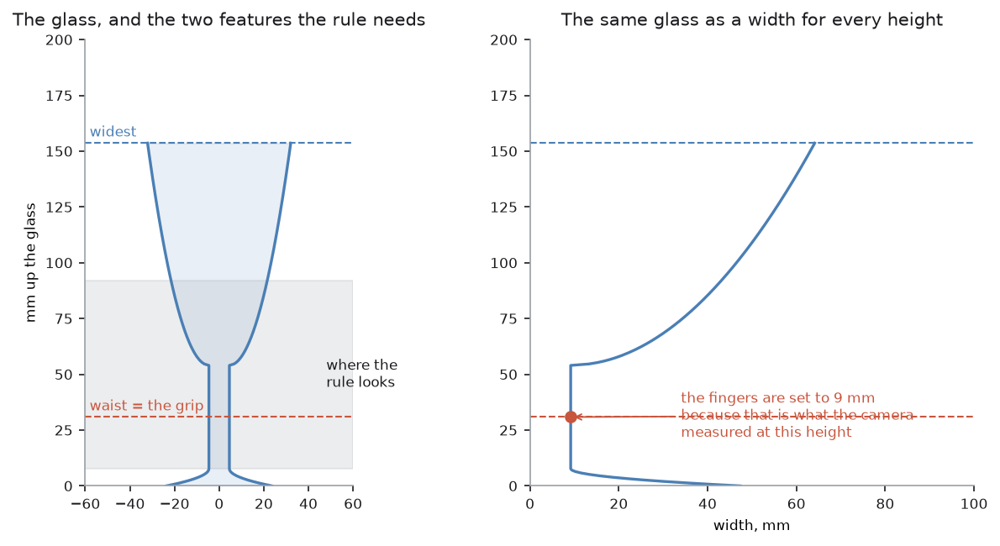

# Step 2 — measuring one

Step 1 handed over a place on the table and a rough width. That is enough to
walk up to a glass. It is nothing like enough to pick one up. Every decision
still to come needs the *shape* — which kind of glass this is, where on it the
fingers can close, how far apart they go, how hard they squeeze.

This step produces that shape. The arm carries the wrist camera round to the
side of the glass and takes one picture. Out of that comes a **profile**: the
glass's width at every height up it, in millimetres. The profile is the only
thing the next three steps ever see. If it is wrong, everything downstream is
confidently wrong with it. That is why this document spends as long on how the
measurement goes bad as on how it works.

One picture is enough, and the reason is worth stating early, because the whole
project leans on it. A drinking glass is a solid of revolution. So the outline
seen from any one side is the whole shape.

Code: `glasses/perception.py`, and `_view_from()` in `task.py`.

Background, in robotics-basics: this step is
[silhouettes of a solid of revolution](https://github.com/RobinNagpal/robotics-basics/blob/main/docs/06_object-perception/03_programmed-methods.md#27-silhouettes-of-a-solid-of-revolution),
scaled by [the plane the object stands on](https://github.com/RobinNagpal/robotics-basics/blob/main/docs/06_object-perception/03_programmed-methods.md#22-the-plane-the-object-stands-on),
and the arithmetic in the middle is
[the one calculation underneath everything](https://github.com/RobinNagpal/robotics-basics/blob/main/docs/06_object-perception/01_overview.md#6-the-one-calculation-underneath-everything).

What follows, in order:

- the step in pseudocode, and the libraries it uses
- why one picture is enough
- how pixels become millimetres without a depth reading
- how good the result really is
- the five things that were wrong with this picture when it was first taken
- where the method can still fail
- where the other ways of measuring a glass are compared

## The step in pseudocode

Each line says who does the work: **ours** means code in this repo, and a named
library means the work is not ours.

```text
work out how far back to stand                    ours: task.py
                                                  _measuring_distance()
    from the lens and the tallest glass           ROS 2: the /camera_info topic

list the places to stand, best first              ours: task.py _standoffs()
    prefer a line of sight with nothing behind
    then prefer the least reach

for each of those places until one works:         ours: task.py _view_from()
    move the camera there, looking level          MoveIt 2: plan a path
                                                  ros2_control: drive the joints
    take one RGB-D frame                          Gazebo -> ros_gz_bridge -> cv_bridge
    mask = what stands up, near the standoff      ours: glasses/detect.py
                                                  standing_on_the_table()
    mask = just the patch in the middle           ours: detect.py
                                                  the_one_in_the_middle()
    profile = a width for every row of mask       ours: glasses/perception.py
                                                  row_widths(), smooth(),
                                                  raggedness(), profile_from_mask()
    check the answer is possible                  ours: task.py _view_from()
        not taller than the cell's tallest glass
        foot near where the arm aimed

if this kind may have a handle, look again        ours: glasses/spec.py
                                                  Kind.expects_handle, and
                                                  perception.py handle_direction()
```

### What each library gives this step

| Piece | Ours or a library | What it does here |
| --- | --- | --- |
| `glasses/perception.py` | ours | the whole measurement: mask to widths, widths to millimetres, and the refusal when the mask is not worth trusting |
| `glasses/detect.py` | ours | which pixels are the glass, and which patch is the one the camera was aimed at |
| `glasses/profile.py` | ours | the `Profile` itself — height, widths, and the questions steps 3 and 4 ask of it |
| `task.py` | ours | where to stand, in what order, and what to do when a view does not work |
| [NumPy](https://numpy.org/) | library | all of the arithmetic: row widths, the median filter, the scaling |
| [Gazebo Harmonic](https://gazebosim.org/docs/harmonic/) | library | simulates the camera that takes the picture |
| [ros_gz_bridge](https://github.com/gazebosim/ros_gz) + [cv_bridge](https://github.com/ros-perception/vision_opencv) | library | carry the frame from Gazebo to a NumPy array |
| [MoveIt 2](https://moveit.picknik.ai/main/index.html) | library | gets the camera to a spot beside the glass without hitting anything, and says so when it cannot |
| [tf2](https://docs.ros.org/en/jazzy/Concepts/Intermediate/About-Tf2.html) | library | the camera pose the mask bounds are worked out in |

There is no computer-vision library doing the measuring. OpenCV is linked into
the project for the rack's marker, and it is not used on this page at all. A
row width is `argmax` on a boolean array, and the scale factor is one division.

## Why one picture is enough

A drinking glass is a **solid of revolution**: it is a shape spun about a
vertical axis. Spin anything about an axis and the outline you see from the
side is the same from every side, and that outline is the full description of
the shape. The width on screen at some height *is* the diameter of the glass at
that height. It is
[a special case that is unreasonably powerful when it applies](https://github.com/RobinNagpal/robotics-basics/blob/main/docs/06_object-perception/03_programmed-methods.md#27-silhouettes-of-a-solid-of-revolution),
and it covers anything made on a lathe or a wheel: bottles, cans, jars, bushes,
bearings.

So there is nothing a second viewpoint could add. A circuit of the table — the
obvious thing to do with an object you cannot see through — would return the
same silhouette four times.

The one exception is a handle, because a mug with a handle is not a solid of
revolution. That is the only reason `expects_handle` exists in `spec.py`, and
the only case that takes a second picture, a quarter turn round.

## Pixels to millimetres

A camera measures angles, not lengths. A pixel covers `1/fx` radians, and how
many millimetres that is depends entirely on how far away the thing is. Divide
by the focal length to get an angle, multiply by the distance to get a length:
[the one calculation underneath everything](https://github.com/RobinNagpal/robotics-basics/blob/main/docs/06_object-perception/01_overview.md#6-the-one-calculation-underneath-everything),
which every measurement in this project reduces to.

Here the camera is 320×240 with a 60° horizontal field of view, so `fx` is
about 277 pixels. At the standoff this works out at:

    380 / 277 = 1.37 mm per pixel

and the frame is 240 × 1.37 ≈ 330 mm tall. That is what lets the camera aim at
120 mm above the table and still catch two things at once: the foot a glass
stands on, and the rim of the tallest glass the cell handles.

The standoff itself is not written down. It is worked out per cell, from the
lens, the height the camera aims at, and that tallest glass. What has to fit in
the frame is as much a question about the lens as about the glass, so a number
written down here would be right for one camera only. It comes to 380 mm with
this one. It used to be a flat 300 mm, and the faults section below is about
what that cost.

The standoff is the whole conversion, so the arm has to *know* it rather than
measure it. It does, for a reason that has nothing to do with the glass. The
arm put the camera there itself, and it can read its own joints. **At no point
does the arm need a depth reading of the glass.** That matters more than it
looks. It is the one part of this step that would still work on real, clear
glassware, where a depth reading of the glass is not available at all.

## Reading the silhouette

Three details in `row_widths()` and `smooth()` do more work than they look.

**The width is edge to edge, not a pixel count.** A mask can come back with a
gap up the middle of an object. A highlight does it. So does a patch the
sensor missed. So does real clear glassware, where the table shows through and
gets labelled background. Counting glass pixels in a row turns every one of
those into a glass that is too narrow. Measuring from the leftmost glass pixel
in the row to the rightmost does not care what happened in between.

**The profile is smoothed with a five-row median.** A mask edge wanders by a
pixel or two, and an unsmoothed profile then has a waist in every wobble. That
matters here more than it would elsewhere, because "find the waist" is a rule
the project actually uses.

**The raggedness check runs on the raw widths, not the smoothed ones.** This
was a bug for a while and is worth spelling out. Smoothing makes any mask look
clean, so a quality check applied afterwards never fires. It is the second of
the two corrections in
[reading a mask honestly](https://github.com/RobinNagpal/robotics-basics/blob/main/docs/06_object-perception/03_programmed-methods.md#18-reading-a-mask-honestly),
which puts the general form of it well: the check and the measurement want
different inputs, and a check that never fails is worse than no check because
it is also reassuring. The question
"was this mask worth trusting?" has to be asked of what came out of the mask;
the smoothed version is what gets measured. The threshold is 2% of the glass's
own width, averaged over neighbouring rows.

If the mask fails that check, or holds almost no glass, `profile_from_mask()`
raises `NotMeasurable` and the glass is left standing. It is not guessed at.

## What comes out

For the wine glass in the pictures below — 153.6 mm tall, drawn at random
proportions the arm knows nothing about:

| Measured | Value |
| --- | --- |
| Total height | 153.6 mm |
| Widest point | 64.1 mm, at the rim |
| Waist | 30.8 mm up |
| Width at the waist | 9.2 mm |



The left panel is the glass. The right panel is the same information as the
project actually holds it: two arrays, a height and a width, one pair per row
of the picture. Everything after this point is arithmetic on those two arrays,
which is why none of it needs a robot to test.

## How good is the measurement, really

About a millimetre and a half. One pixel is 1.37 mm at the standoff this
works out at, and smoothing along the height does nothing to improve
resolution *across* it.

That is only the pixel term.
[Where the millimetres go](https://github.com/RobinNagpal/robotics-basics/blob/main/docs/06_object-perception/01_overview.md#8-where-the-millimetres-go) puts
it next to the others, and the ordering is not what most people expect: a
hand-eye calibration one degree out costs almost 6 mm at this sort of reach,
more than twice what a one-pixel error at each edge costs. In simulation that
term is zero, because the camera is exactly where the model says. On hardware
it would be the largest number on this page.

That figure is not a footnote; it sets a number further down. When the fingers
close on the glass in step 5, the width at first contact is compared against
the width the camera predicted, and the tolerance on that comparison is 4 mm.
Four rather than one, because one would fail on a good grasp about as often as
on a bad one. A tolerance tighter than the measurement is a tolerance that
reports noise as failure.

## Five things that were wrong with this picture

Once the survey started working, this step was asked real questions for the
first time, and most of its answers came back wrong. They were five separate
faults that happened to look like one, and untangling them is most of what it
took to measure a glass at all.

**The picture came out rolled.** Pointing a camera leaves one angle free: the
roll about the direction it is looking. The function that points the camera
pinned that angle with a hint chosen for poses that look downwards. Every pose
here looks along the table instead. For those, it handed back a different roll
for each side of the glass the arm happened to stand on. The same glass
therefore measured differently depending on where the arm was standing. That
matters because the profile is read one row at a time, with a row meaning a
height. A picture that comes out turned measures the glass across instead of
up. The roll is now pinned against the room's own upright, the same from every
side.

**The camera stood too close.** It looks level from `MEASURE_VIEW_HEIGHT`
above the table. At the old 300 mm the foot of the glass sat 21.8 degrees below
the middle of the picture, against a half frame of 23.4 degrees. So the foot
was inside the picture, but in the last few pixels of it, and seen almost edge
on. That matters more than a few lost pixels. A wine glass with its foot cut
off the bottom is a bowl narrowing into a stem with nothing below it. That
shape has no waist in it. And a glass with no waist is not a stemmed glass to
any rule that looks for one. How far back to stand is now worked out per cell,
from the lens, the height the camera aims at, and the tallest glass the cell
handles. It comes to 380 mm here, which is why the resolution above is 1.37 mm
rather than 1.08.

**It measured everything else in the frame too.** `row_widths()` measures the
full width of the mask in each row, whatever is in that row. So a glass with a
neighbour standing behind it measured as one glass the width of the table. Two
things fixed it. The mask is now cut down to the patch in the middle, which is
the one the camera was aimed at. And the arm now prefers a line of sight with
nothing behind it. That preference is judged as an angle at the camera, not as
a distance on the table, because an angle is what decides whether two glasses
overlap in a picture.

**The test for a ragged outline assumed a bigger glass.** `MAX_RAGGEDNESS` is
a fraction of the glass's own width. That quietly assumes a glass a
hundred-odd pixels across. Standing further back made them forty pixels across
instead. Any mask edge wanders by about a pixel, and one pixel in forty is
already two and a half per cent. So clean pictures of narrow glasses were being
refused. Now whichever limit is the more forgiving wins — the fraction, or two
pixels. The test still catches a reflection or a neighbour, and no longer
catches ordinary noise.

**Nothing checked that the answer was possible.** A profile taller than the
tallest glass the cell handles is not one glass. It is two, standing one behind
the other. A foot further from where the arm aimed than a glass is wide belongs
to some other glass. Either of those now sends the arm round to look from
another side. That is what the retry was always for.

## Where this approach can fail

The measurement is good to about 1.5 mm when it works. These are the ways it
does not work.

**Anything that is not a solid of revolution is measured wrongly.** This is the
assumption the whole step rests on, and it is the first of the
[five jobs a silhouette cannot do](https://github.com/RobinNagpal/robotics-basics/blob/main/docs/06_object-perception/03_programmed-methods.md#27-silhouettes-of-a-solid-of-revolution). A jug, a square tumbler, a glass with a
spout: each is measured as if it were round, and the number that comes back is
the width of one particular side. A handle is the only exception the project
handles, and only because `expects_handle` sends the arm round for a second
picture.

**Whatever is behind the glass can still get in.** The mask keeps points within
a band around the standoff, and takes the patch in the middle. That deals with
the ordinary case. Two glasses almost exactly one behind the other, at almost
the same distance, still merge into one patch. The height check catches the
worst of it, because two glasses read as one very tall one.

**A glass outside the cell's size range is refused rather than measured.** Over
260 mm tall, the profile is rejected. That is right when the cause is two
glasses, and wrong when the glass really is that tall.

**The scale factor is only as good as the arm's own position.** Every
millimetre comes from the standoff, and the standoff is where the arm believes
it put the camera. A systematic error in the arm's kinematics scales every
width by the same wrong factor, and nothing in the picture would reveal it.
This is the one error a second camera would catch and this design cannot. On
real hardware it is the
[hand-eye calibration](https://github.com/RobinNagpal/robotics-basics/blob/main/docs/06_object-perception/02_sensors.md#4-calibration-which-decides-all-of-it),
and the way to find it is rung three of the
[diagnosis ladder](https://github.com/RobinNagpal/robotics-basics/blob/main/docs/06_object-perception/07_making-it-work.md#3-when-it-does-not-work-a-diagnosis-ladder):
put a marker somewhere you can measure by hand and compare the arm's answer
against a tape measure.

**A glass not standing on the table is measured against the wrong plane.** The
foot is found by laying the bottom of the mask down on the table top. A glass
standing on a mat, or on another glass, reads as too short and the wrong
distance away.

**The outline is refused, not guessed at, when the mask is poor.** That is the
intended behaviour, and it is still a way the step "fails": a glass with a
strong reflection down one side is left standing rather than measured badly. In
Gazebo this is rare. On real hardware it would be the common case.

## Other ways to measure a glass

One side-on picture works because a glass is a solid of revolution. The ways
of measuring that do not need that assumption — several silhouettes,
photogrammetry, radiance fields, laser scanning, fitting a shape — are compared
in [`step2-approaches.md`](step2-approaches.md).

→ [Step 3 — what kind of glass is it](step3-what-kind-of-glass.md)
