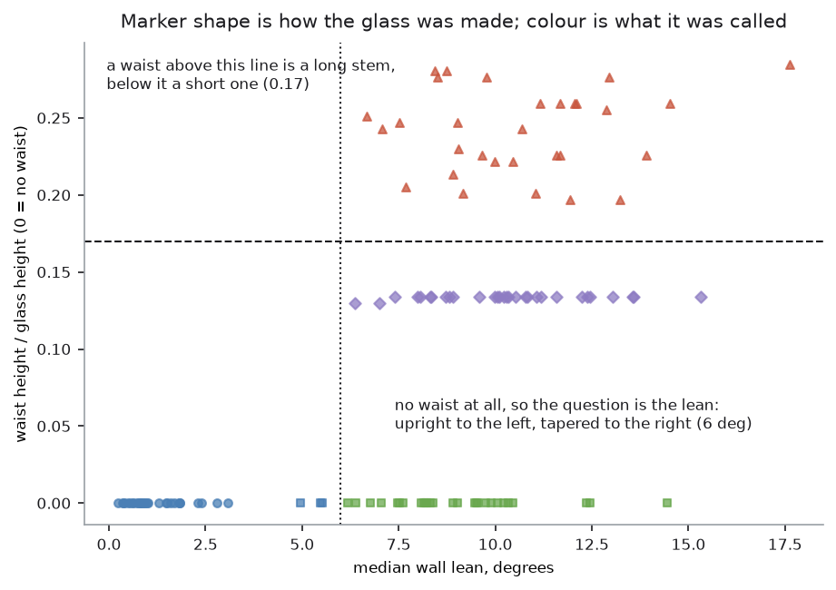

# Step 3 — what kind of glass is it

The arm now has a profile — a width at every height — and it is about to have
to decide where on the glass to close the fingers. It cannot, yet, because
where to hold a glass depends on what sort of glass it is: the stem of a wine
glass and the lower wall of a tumbler are both right answers to the same
question asked of different objects.

So this step puts a name to the shape. The four names it can give are the four
kinds the [problem statement](../problem-statement.md) sets out — straight,
tapered, stemmed and short-stemmed — and it may also decline to give one,
which is a real answer and not an error.

This is the step where the absence of a neural network is most obvious, and
the reason is the point of the document. Naming an object from a picture is
the textbook job for a trained model. Naming a *shape* from a measurement of
that shape is arithmetic, and by the time this step runs the glass has already
been reduced to a curve.

Code: `classify()` in `glasses/detect.py`.

Below: why the measurement removes the need for a classifier, the three tests
and the order they have to be asked in, why returning nothing matters, and
what a trained model would have bought and cost.

## The realisation that removes a whole component

A "kind" in this project is a **shape**: a tube, a cone, a bowl on a stem. And
the profile from step 2 is a *description of the shape*. So the kind can be
read off the profile with a few arithmetic tests, and this project needs no
trained classifier, no labelled dataset and no model to keep up to date.

That is worth pausing on, because the reflex when a robot has to recognise
something is to train a classifier. Here it would be both more work and less
reliable than three comparisons.

## The three tests, in an order that matters

```python
waist = profile.waist_at()
if waist is not None:
    fraction = waist / profile.total_height
    return "short_stemmed_glass" if fraction < 0.17 else "stemmed_glass"

lean = median slope over the lower half
return "tapered_glass" if lean > 6 degrees else "straight_glass"
```

**Is there a waist?** A waist is a local narrowing with wider glass above and
below it. That is what a stem is, and nothing else on a drinking glass looks
like one.

The order is not incidental. A stemmed glass *also* has a sloping bowl, so
asking about slope first would call every wine glass tapered and hand it the
wrong rule.

**If there is a waist, how far up is it?** This is the one place the classifier
has to separate two things the silhouette barely distinguishes, and the
threshold came from looking at the populations rather than from a principle. A
wine glass's waist sits at 20–28% of its height. An Irish coffee glass's sits
at about 13%. `SHORT_STEM_FRACTION` is 0.17, which leaves room on both sides.

They are separated at all because they want different things: a different
search band, a different opening range, and a very different force cap — a
wine glass stem is thin-walled and an Irish coffee glass is thick.

**If there is no waist, does the wall lean?** `TAPER_THRESHOLD_DEG` is 6,
measured over the lower half of the glass, because that is where a grip would
go. Below six degrees, the wall is upright enough for flat pads to press on
without sliding; above it, they would.

Note what that threshold is a statement about. It is not a fact about
glassware, it is a fact about **the gripper**. Fit softer pads and it moves.

## What the classifier actually looks like



Every glass in that picture is one the project generated at random
proportions. The marker shape says which kind it was *made* as; the colour says
what `classify()` *called* it. The two dotted lines are the two thresholds.

Three things are visible in it.

**The stemmed and short-stemmed populations separate cleanly** — the 0.17 line
has empty space on both sides, which is what a threshold should look like.

**Straight and tapered glasses overlap at the boundary.** Some glasses drawn as
tapered were called straight. That is not an error, and it took a wrong test to
work out why.

## The test that was asking the wrong question

There was a test called `test_every_drawn_glass_is_classified_as_its_own_kind`.
It demanded that a glass be labelled with the kind it was generated as, and it
failed.

The test was wrong, not the code. A glass drawn as a tapered glass with a very
shallow taper is, physically, a glass with nearly upright walls — and the
straight-glass rule holds it perfectly well. Insisting on the generated label
would have meant contorting the classifier to preserve a distinction that does
not matter to the gripper.

The test now asks the question that does matter:

> does every glass get a kind whose rule can actually hold it?

That is both easier to pass and much harder to cheat, because it can only be
satisfied by the arm ending up able to pick the glass up.

## Returning nothing is a real answer

`classify()` can return `None`, and `task.py` turns that into `UnknownShape`
and leaves the glass standing with a line in the report.

This matters more than it looks. The alternative — snapping every shape to the
nearest known kind — means an unfamiliar object gets handed a rule derived from
something it is not, and the arm closes its fingers somewhere that was never
checked. A project that refuses to say "I do not know what that is" is a
project that will eventually break something.

## Other ways to decide what kind of glass it is

This is the step where the absence of a neural network is most conspicuous,
because naming the kind of a thing from a picture is the textbook job for one.
It is worth being clear about what a model would buy and what it would cost,
since the argument for the rules is not that learning is bad but that the
input here is already a description of the shape.

| Approach | What it does | What it runs on | Suitability here |
| --- | --- | --- | --- |
| **Rules on the profile** | three tests on the measured outline | NumPy, in `glasses/detect.py` | good, and in use |
| **Classical machine learning** | learns a boundary from a few numbers per glass | [scikit-learn](https://scikit-learn.org/) decision tree, SVM or random forest | would work, and explain itself less |
| **A small network on the profile** | learns the kind from the width-at-every-height curve | a 1-D CNN or MLP on [PyTorch](https://pytorch.org/) | more machinery than the problem needs |
| **An image model on the silhouette** | learns the kind from the picture directly | [Ultralytics YOLO classify](https://docs.ultralytics.com/tasks/classify/), [timm](https://github.com/huggingface/pytorch-image-models) | throws away the measurement first |
| **Zero-shot vision and language** | asks "is this a wine glass?" with no training at all | [CLIP](https://github.com/openai/CLIP) | remarkable, and cannot be held to a rule |
| **Nearest neighbour on profiles** | compares against stored example outlines | [scikit-learn](https://scikit-learn.org/), or dynamic time warping | needs the table of sizes this project refuses |
| **Fit a parametric family** | fits a bowl-stem-foot model and reads the kind off the fit | SciPy least squares | the strongest alternative |

**The rules, which is what is used here.** By the time this step runs the
glass has already been reduced to a width at every height, and a kind in this
project *is* a shape — a tube, a cone, a bowl on a stem. So the question "what
kind is this?" is already a question about a curve, and three tests on that
curve answer it. It needs no training data, it cannot go stale when the
glassware changes, it runs in microseconds, and when it refuses it says which
test failed and by how much, which is what the run report prints next to the
glass that was left standing. Its weakness is that every kind has to be
written by hand, and that the thresholds — `SHORT_STEM_FRACTION` at 0.17 above
all — were set by looking at two populations rather than derived from
anything.

**Classical machine learning** is the fairest comparison, because it would
take the same handful of numbers the rules take and learn the boundaries
between kinds instead of having them written down. A decision tree on
[scikit-learn](https://scikit-learn.org/) would probably match the rules on
this data and could be read afterwards, which keeps most of the explainability.
What it costs is a labelled set of glasses, and it would find boundaries that
fit the sample rather than boundaries that are true of glassware — the rule
"the narrowest part below the widest part is the stem" is true of every
stemmed glass ever made, and no amount of data makes a learned threshold true
in that way.

**A small network on the profile, or an image model on the silhouette**, would
both work and both go further from the grain of the project. The network on
the profile is the less wasteful of the two, since it at least uses the
measurement; the image model skips the measurement entirely and learns from
pixels, which means the shape has to be measured all over again afterwards
because the grip rules need it. Both need hundreds of labelled examples, both
put a file of weights in the repository that has to be kept in step with the
glassware, and neither can say why it decided anything.

**[CLIP](https://github.com/openai/CLIP)** deserves its own line because it is
genuinely impressive here: it will tell you that a picture contains a wine
glass with no training whatsoever, which is the single cheapest way to get a
name. The trouble is that a name is not what this step is for. The next step
does not want to know the glass is *called* a wine glass, it wants to know
there is a narrow part below a wide part so it can hold the narrow part, and a
model that answers the first question confidently while the second is false is
worse than no model. Names and shapes agree most of the time and the times
they do not are exactly the times something gets broken.

**Fitting a parametric family** — described at the end of step 2 — is the
strongest alternative, because it would produce the kind and the dimensions
together with a measure of how well the glass actually matched. That last part
is the appeal: a bad fit is a natural way of saying "this is not any kind I
know", which is the behaviour the next section on this page argues for. It was
not chosen because it needs every family written out as an equation with free
parameters, which is a good deal more work than writing three tests, and
because a fit that goes wrong goes wrong quietly.

→ [Step 4 — where to hold it](step4-where-to-hold-it.md)
