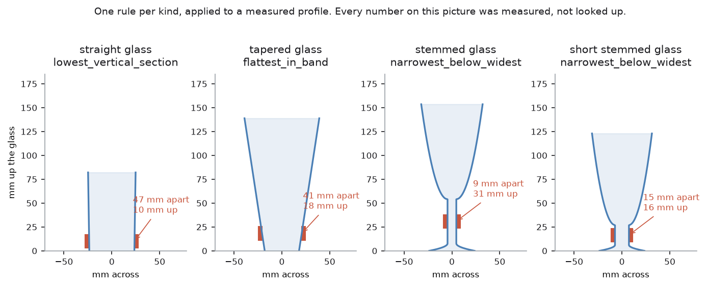
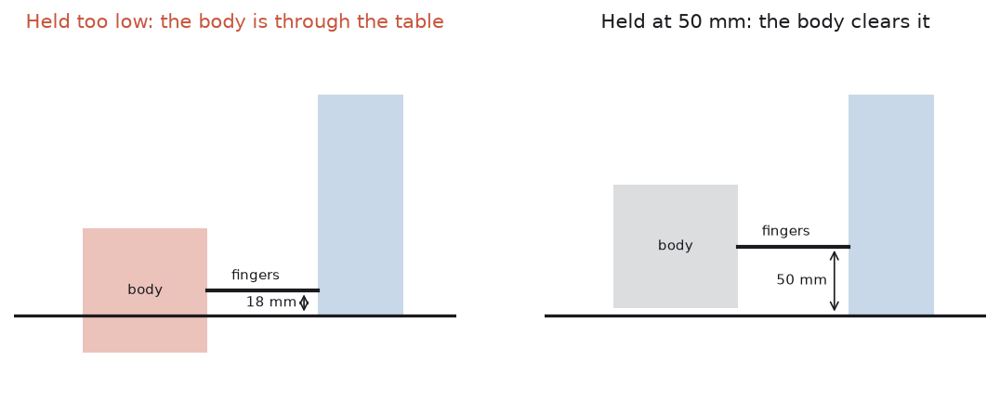
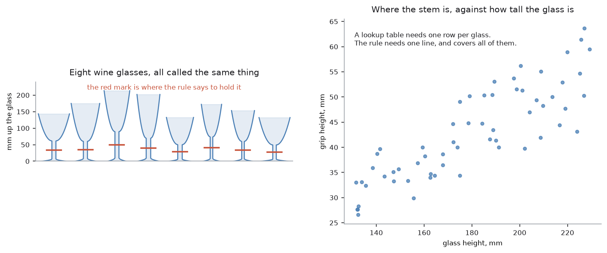

# Step 4 — where to hold it

The arm knows the shape and it knows the kind. Now it has to pick a height to
grip at and a distance to open the fingers to.

Code: `glasses/rules.py`, `glasses/profile.py`, `glasses/spec.py`.

## What makes a grip point good

Three things, and every rule in the project is an attempt to satisfy all three
at once.

**The wall must be upright enough.** Flat pads on a sloping wall slide, and the
steeper the slope the more of the grip force turns into a push down the wall
instead of into it. `VERTICAL_TOLERANCE` is 6 degrees, and the number comes
from the pads: a 12 mm silicone pad conforms by about 1.2 mm across its height,
and `atan(1.2/12)` is 5.7 degrees.

It started at 2 degrees, which is what you pick if you are thinking about
geometry rather than about rubber. It refused every short mould-tapered tumbler
in the test family, because a wall that leans 3 degrees is not vertical and 2
degrees says so. Six is a fact about the hardware; two was an opinion.

**There must be enough of it.** A pad needs a band of wall at least as tall as
the pad to sit on. That is `min_band_height_m`, and it is 8–12 mm depending on
the kind.

**It must be low.** After the turn, the end that was at the bottom is at the
top. Hold a glass halfway up and, once it is upside down, the fingers are level
with the rack pegs. Every search band in `spec.py` stops at or below half the
glass's height, and `_check()` enforces it as well, because a rule that finds
something high up has found the wrong thing.

## Three rules



| Rule | Used by | What it looks for |
| --- | --- | --- |
| `lowest_vertical_section` | straight glass | the lowest band of wall within 6° of upright, at least a pad tall |
| `flattest_in_band` | tapered glass | the least-sloping band in the search window |
| `narrowest_below_widest` | stemmed, short-stemmed | the waist below the widest point |

`flattest_in_band` exists because a cone has no upright wall anywhere. Asking
for one returns nothing, so the tapered rule asks a different question: of all
the places a pad could sit, which is closest to upright? On a conical tumbler
that is near the base, where the wall has had least distance to spread.

`narrowest_below_widest` is the one that reads like a sentence about glassware,
and it is true of every stemmed glass ever made. The widest point of a wine
glass is its rim or the belly of its bowl; below that the glass necks down to
the stem before flaring out again into the foot. The narrowest point in
between is the stem, wherever it happens to be on this particular glass.

## Finding the waist was harder than it sounds

`waist_at()` originally returned the first index of the narrowest run of
widths. On a glass with a long parallel stem that is a plateau, many rows wide,
and the first row of that plateau is at the bottom — right where the stem
starts flaring into the foot. The arm would have gripped the flare, which is
sloping, wider, and exactly where a stem is weakest.

It now returns the **middle of the longest narrowest run**, which on a parallel
stem is the middle of the stem.

A second bug in the same area is worth recording because it only appeared once
in forty glasses. The generator drew the foot diameter independently of the
bowl diameter, so occasionally the foot came out wider than the bowl — which
makes the *base* the widest point of the glass, leaves `waist_at()` searching a
slice below the base, and crashes on an empty array. Real glasses do not have
feet wider than their bowls, and the generator now draws the foot as a fraction
of the bowl.

Neither of those would have been found with one test glass. Both were found by
running the rules over a family of forty.

## The opening is read off, never looked up

Once the rule has returned a height, the finger opening is the width the camera
measured **at that height**:

```python
opening = profile.width_at(height)
```

That single line is the whole reason this project can handle a glass nobody
measured. There is no lookup, no average stem diameter, no per-kind default.
The camera saw 9.2 mm at 30.8 mm up, so the fingers go to 9.2 mm.

Change the glass and both numbers change, with nothing to edit.

## Four ways an answer is rejected

A rule can return a number that is arithmetically correct and a bad idea — a
"waist" found in a mask artefact, a stem on a glass far too wide for the
gripper. `_check()` catches four cases, each one much cheaper here than with
the arm already moving:

1. **The opening is outside what this kind should ever need.** A stem 60 mm
   across is not a stem; the rule found something else.
2. **The opening is wider than the gripper opens at all** (95 mm).
3. **The band is shorter than the pads need.**
4. **The grip is more than halfway up the glass**, which after the turn puts
   the fingers among the rack pegs.

Each raises `NoGrip` with the reason written out, and that reason is what ends
up in the run report next to the glass that was left standing.

There is a fifth, added later and for a reason nobody had thought about: the
gripper has a body, and it has to go somewhere.

## The gripper has a body



`lowest_vertical_section` did its job on the first straight glass it was given
and came back with a grip 18 mm above the table, which is a perfectly good
piece of upright wall and an impossible place to hold a glass. The gripper
comes in level, so its body lies *across* the grip height rather than above
it, and the body is a 90 mm box — holding a glass 18 mm up therefore puts
27 mm of gripper through the table.

What came back from that was not a refusal but a path that solved none of the
way, which reads exactly like an arm that cannot lift a glass and sent the
search off in entirely the wrong direction for some time. `LOWEST_GRIP` is
half the body plus a little clearance, and it bounds the band each rule
*searches* rather than checking the answer at the end. That distinction is the
whole of it: every rule on this page looks for the lowest wall that will do,
so a floor applied afterwards would turn "hold it a little higher" into "this
glass cannot be held" on every single glass.

It does mean some glasses cannot be held at all. Below 50 mm the gripper is
through the table and above half the glass's own height the fingers end up
among the rack pegs after the turn, so a glass under roughly 120 mm tall has
nothing left in between. That is a fact about this gripper and this rack
rather than a failure of measurement, and it is now reported as a reason,
which is the behaviour this whole page is built around.

## Looking down the fingers before closing

Everything on this page decides *where* to hold a glass from pictures taken
half a metre away, and the answer was landing about 10 mm out — enough that
the fingers arrived beside the glass rather than around it, closed on its
shoulder or on nothing, and the width check in step 5 refused the grasp. The
measurement was not the problem; the aim was.

The camera is bolted to the wrist, so at the grasp pose it is looking straight
down the approach at the glass from a hand's breadth away, which is by far the
best view of the glass anything in this task ever gets — a millimetre on the
table is worth many pixels from there. The arm now takes one look from that
position and shifts sideways onto what it sees before the fingers close, along
the axis the fingers close on and no further than half the gripper's opening,
since a glass further off than that is not the one about to be held. The width
at first contact went from 10 mm out to the fingers finding 76.6 mm where the
camera had said 76.9.

It corrects sideways and nothing else on purpose. How high up to hold the
glass came from the measured profile and is better known than anything this
view could say about it, and how far *along* the approach the glass is, this
view cannot see at all. What it can see better than anything else is whether
the glass is between the fingers or beside them, which is exactly what was
going wrong.

## Why this beats a table of measurements



The left panel is eight wine glasses the project generated. They are all called
the same thing and no two are alike: heights from 131 to 230 mm, bowls of
different depths, stems of different lengths and thicknesses. The red mark on
each is where `narrowest_below_widest` decided to hold it.

The right panel is the same information as a table of measurements would have
to hold it — one dot per glass, and a spread of 25 mm in grip height for a
glass height that varies by 100 mm. The relationship is loose enough that no
single number works, which is exactly what makes a lookup table the wrong
shape for this problem.

One rule covers all of them. Adding a ninth glass to the left panel needs no
change at all, and *that* is the property the project is really built around.

## Every way of choosing a grip point

There are only two ways to answer "where do I hold this?": work it out from a
measurement, or learn it from examples. Everything below is one of those two,
or a way of correcting the answer once it exists. Some of them overlap, and
two of them are only useful together.

| Approach | What it does | What it runs on | Suitability here |
| --- | --- | --- | --- |
| **Rules on the profile** | one sentence per kind, applied to the measured outline | NumPy, in `glasses/rules.py` | good, and in use |
| **Ranked search** | scores every possible grip instead of returning the first one | NumPy, [MoveIt 2](https://moveit.ai/) to ask what the arm can reach | best next step |
| **Feel for it** | when the fingers meet nothing, hunt for the stem by touch | the sensors already in the cell, through [ros2_control](https://control.ros.org/) | cheap, and nothing new to install |
| **Camera in the loop** | corrects the aim on the way down | [OpenCV](https://github.com/opencv/opencv), on the wrist camera | useful, but only fixes aiming error |
| **Score grasps on a spun mesh** | classical grasp planning on a mesh built from the profile | [trimesh](https://trimesh.org/), already a dependency | redundant — same answer, more arithmetic |
| **Copy an expert** | learns the movement by watching the rules do the job | [PyTorch](https://pytorch.org/), [LeRobot](https://github.com/huggingface/lerobot) or [ACT](https://tonyzhaozh.github.io/aloha/) | fits, once search and touch are done |
| **Reinforcement learning** | discovers a grasp by trial and reward | [Stable-Baselines3](https://stable-baselines3.readthedocs.io/), on [Isaac Lab](https://isaac-sim.github.io/IsaacLab/) or [MuJoCo](https://mujoco.org/) | poor fit |
| **Off-the-shelf grasp network** | point cloud in, ranked grasps out | [Contact-GraspNet](https://github.com/NVlabs/contact_graspnet), [GraspNet-1Billion](https://graspnet.net/), [AnyGrasp](https://graspnet.net/anygrasp.html) | does not apply as things stand |
| **Depth completion** | invents the depth the glass did not return | [ClearGrasp](https://sites.google.com/view/cleargrasp), [TransCG](https://github.com/Galaxies99/TransCG), [DREDS](https://github.com/PKU-EPIC/DREDS) | only worth it to feed the row above |

### What each one actually does

#### Rules on the profile

Write down a sentence about glassware, and apply it to whatever the camera
measured.

1. The camera measures the glass from the side. The result is a list: 40 mm
   wide at 1 mm up, 41 mm wide at 2 mm up, and so on to the top. That list is
   the profile.
2. A few simple tests read the shape off the list. Thin in the middle? Then it
   is stemmed. Wall leans? Then it is tapered.
3. Each shape has one rule. For a wine glass it is "the narrowest point below
   the widest point", which is the stem.
4. The rule gives a height — say 31 mm up. The finger opening is the width the
   list holds at that height — say 7 mm.
5. Four checks follow. Can the gripper open to 7 mm? Is the flat part tall
   enough for a pad? Is the grip low enough on the glass? Any failure and the
   glass is left standing, with the reason written down.

**Needs:** NumPy, and nothing else. No training, no dataset, no internet.

**Good:** you can read the rule, and you can read the reason when it refuses.
A glass of a size nobody has seen needs no change at all.

**Bad:** it produces one answer. If that answer is 3 mm out, there is no
second plan.

#### Ranked search

The same rules, but they stop picking a single winner. They hand back a list,
best first.

The rule scores every height in the allowed band, from every direction the arm
could come in, and every wrist rotation. Each option gets marked on how upright
the wall is there, how much of the pad would touch, whether the arm can reach
that pose, and whether the wrist can still turn the glass over afterwards. The
arm tries the best one. If that fails it tries the next.

**Needs:** NumPy for the scoring, and [MoveIt 2](https://moveit.ai/) — already in the project — to
answer "can the arm reach this?"

**Why it matters:** most failures today are not "this glass cannot be held".
They are "this glass cannot be held *the first way tried*".

#### Feel for it

The fingers are sensors too. If they close and find nothing, look around with
them.

The fingers close slowly. Each fingertip has a contact sensor, so the arm knows
the moment it touches something and what the gap was at that moment. If they
close all the way and touch nothing, the stem is not where it was expected. So
the arm opens, moves 3 mm up, and closes again. Still nothing? Then 3 mm down.
A stem usually turns up in two or three tries.

**Needs:** nothing new. The contact sensors and the wrist force sensor are
already in the cell.

The project already says the last millimetres should be felt rather than
driven. At the grasp, it does not yet follow through.

#### Camera in the loop

Do not trust one measurement taken from a distance. Keep checking on the way
in.

The rule says hold this glass 31 mm up. To put the hand there, the arm also has
to know where the glass stands on the table, and that number can be a few
millimetres wrong. So the camera keeps looking at the glass while the hand
comes down, and the arm keeps nudging sideways to keep the glass between the
two fingers. The closer it gets, the smaller the error.

**Needs:** [OpenCV](https://github.com/opencv/opencv), on the camera already on the wrist.

**Limit:** in the last few centimetres the gripper covers the glass and the
camera sees nothing. That is where feeling takes over.

#### Score grasps on a spun mesh

Build a 3D model of the glass, and search its surface for good finger spots.

A glass is round, like a pot made on a potter's wheel, so the measured outline
can be spun around into a full 3D model. trimesh does this in one line — it is
how the glasses in the simulator are built. Then comes the usual grasp search:
take every pair of surface spots that face each other, and score whether the
fingers would hold or slide.

**Needs:** [trimesh](https://trimesh.org/), already a dependency.

**Why it is skipped:** the 3D model was built *from* the outline, so it holds
nothing the outline did not. All that searching arrives at the same height the
one-line rule gives, slower.

This is the family the older grasp planners belong to, and it is worth naming
them because they are what a robotics textbook would reach for first.
[GraspIt!](https://graspit-simulator.github.io/) scores grasps on a known mesh
by simulating the contacts, [GPD](https://github.com/atenpas/gpd) samples
candidate grasps straight out of a point cloud and ranks them with a small
classifier, and [Dex-Net](https://berkeleyautomation.github.io/dex-net/) built
the bridge to the learned methods by generating millions of scored grasps in
simulation and training on them. All three are strong on an object whose shape
you have and whose shape is awkward. None of them earns its place here,
because a solid of revolution has no awkwardness left to find once the
profile is known: the interesting question has already been answered by the
time you would call them.

#### Copy an expert

Let something do the job many times, record it, and train a model to imitate
it.

1. Run the rules a few hundred times. Each run, record two things at every
   instant: what the camera saw, and where the joints were.
2. That is the dataset. Nothing is labelled by hand.
3. Train a policy — ACT, or a diffusion policy — whose job is: given this
   picture and this arm position, what is the next stretch of movement?
4. At run time the camera still measures the glass and the rules still decide
   where to hold it. The policy only drives the hand in over the last stretch,
   instead of MoveIt planning a path.

**Needs:** [PyTorch](https://pytorch.org/), with [LeRobot](https://github.com/huggingface/lerobot) or the original [ACT](https://tonyzhaozh.github.io/aloha/) code, a GPU, and the
collection runs.

**Proof:** [`v5-learn-pick-place`](../../v5-learn-pick-place) does exactly this
with blocks and reaches 74% on blocks it never saw.

**The catch:** the model has only ever seen these glasses, so their proportions
end up inside its weights — which breaks this project's one rule, quietly,
where nobody can read it. And when it fails it cannot say why.

#### Reinforcement learning

No teacher. The arm tries, gets scored, and finds its own way.

The arm grabs. Glass ends up on the rack, points; glass dropped, no points.
Repeat a few hundred thousand times and the policy slowly gets good.

**Needs:** [Stable-Baselines3](https://stable-baselines3.readthedocs.io/) for the learning, and [Isaac Lab](https://isaac-sim.github.io/IsaacLab/) or
MuJoCo for the simulator — a run here takes about five minutes in Gazebo, which
would take a lifetime.

**Why it fits badly** is the three reasons set out further down.

#### Off-the-shelf grasp network

Someone has already trained a large model on millions of grasps. Give it a 3D
scan, and it gives grasps back.

The workflow is: depth picture, then point cloud — a cloud of dots in space
showing the surfaces — then the network, then throw away the grasps the arm
cannot reach, then do the best one that is left.

**Needs:** [Contact-GraspNet](https://github.com/NVlabs/contact_graspnet), [GraspNet-1Billion](https://graspnet.net/) or [AnyGrasp](https://graspnet.net/anygrasp.html), on PyTorch. No data
collection: the weights are a download.

**Why it fails here:** the first step. A depth camera cannot see glass, so the
depth picture has a hole where the glass is. No dots, no cloud, nothing to feed
the network. Even if it worked, it knows shapes in general, not glassware — it
has no idea that the stem is the part to hold.

#### Depth completion

Use a model to invent the depth the glass did not return.

A model trained on see-through objects looks at the colour picture and the
broken depth picture, and fills in the hole with a sensible guess. Now there is
a full depth picture, so there is a point cloud, so a grasp network becomes
possible.

**Needs:** [ClearGrasp](https://sites.google.com/view/cleargrasp), [TransCG](https://github.com/Galaxies99/TransCG) or [DREDS](https://github.com/PKU-EPIC/DREDS), on PyTorch. Also a download.

**Where it sits:** it decides nothing by itself. It is only ever the first half
of a chain — repair the picture, then a grasp network. That is two trained
models and two things that can go wrong, in front of a network that still does
not know a stem from a bowl. The rules get there in one step.

### The three that need a trained model

Three of the rows above train a model, and it is easy to think they are the
same idea. They are not. What matters is which part of the job the model takes
over, and who has to train it.

| | What the model learns | What it is given | What it hands back | Who trains it |
| --- | --- | --- | --- | --- |
| **Copy an expert** | the movement | the camera picture, and where the joints are | the next stretch of movement | you, from a few hundred of your own runs |
| **Grasp network** | what a good grasp looks like on any object | a 3D point cloud of the scene | a ranked list of gripper poses | someone else; you download it |
| **Depth completion** | what the missing depth should have been | the colour picture and the broken depth | a full depth picture | someone else; you download it |

The split that matters is what each model takes over. Copying an expert
replaces the *moving* — the rules still decide where to hold the glass. A grasp
network replaces the *deciding* — it never measures a glass or names a kind.
Depth completion replaces neither; it repairs the picture so that a grasp
network has something to work on.

## Which of them to do next

The rules are not producing wrong numbers. A glass that really is 189 mm tall
and 64 mm across measures 180 × 63, is called a stemmed glass, and the stem is
found. What goes wrong is narrower than that: the rules produce **one** answer,
and when that answer is three millimetres out the arm has nowhere to go. The
fingers close on a 5 mm stem, meet nothing, and the glass is left standing.

So the real weakness is not that the grip point is calculated. It is that it is
calculated *once*. Ranked search, touch and a closed loop on the camera all
attack exactly that, none of them is learning, and all three are cheap. They
come first.

### Learning it, after that

Copying an expert is proven next door.
[`v5-learn-pick-place`](../../v5-learn-pick-place) reaches 74% on blocks it
never saw. Note what that project did *not* learn: the block is still found
with plain geometry from a depth camera, and only the movement is learned. That
split would carry over here — the profile and the kind stay measured, the last
part of the reach becomes a policy, and MoveIt stops being in the way.

Reinforcement learning is the wrong member of that family for this job, for
three reasons in order of how much they matter:

1. *The reward is the hard part.* "Do not chip the rim, do not crush it, and
   leave it standing if you are unsure" is a set of constraints, not a score.
   This project treats a refused glass as a success, and there is no natural
   way to reward an arm for declining.
2. *It would not touch most of the failures.* A glass that is measured wrongly
   is refused by the rules before anything moves. No policy sees that.
3. *The sample cost.* Contact-rich grasping wants a number of episodes with
   five or more zeroes on it. A run here takes about five minutes in Gazebo,
   so this would mean rebuilding the cell in a fast simulator first — most of
   a project before the first episode.

Copying an expert avoids all three, and there *is* an expert to copy: the rules
on this page, on the glasses they already handle.

### What learning would cost

Two things, and neither is the training time.

The project's one rule is that no glass's size appears anywhere in it. A policy
trained on this family of glasses has their proportions in its weights. Nothing
would be written down, and the rule would still be broken — just somewhere
nobody can read it.

And a rule can say why it refused. "The rule wants the fingers 246 mm apart,
outside the 20 to 95 mm a straight glass should ever need" is a sentence that
sends you to the bug. A policy that does not grasp a glass has no reason to
offer, and a project whose refusals are results needs its refusals to be
legible.

The honest summary: search and touch first, because they are cheap and they fix
what is broken. Learn the movement after that, if the reach is still the weak
part. Learning where to hold a glass is the last thing to give away, not the
first.

→ [Step 5 — how hard to squeeze](step5-how-hard-to-squeeze.md)
