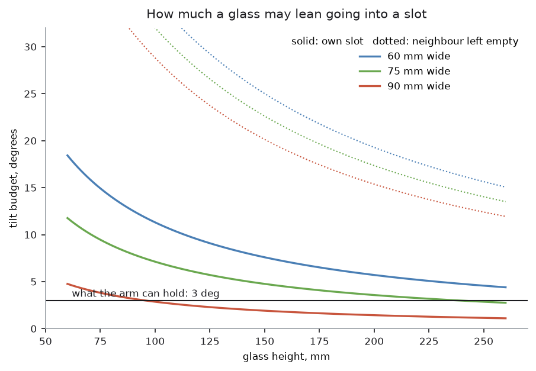
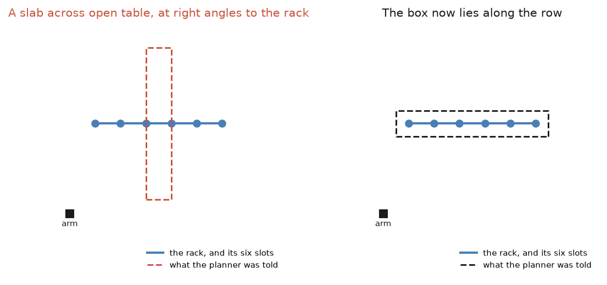
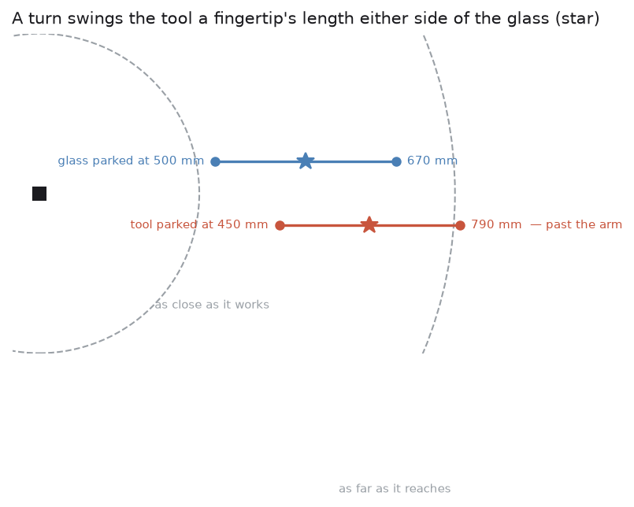

# Step 6 — turning it over and standing it down

The glass is held, weighed and squeezed correctly. What remains is to turn it
through 180 degrees and stand it mouth-down in a rack slot without touching
anything on the way.

Code: `rotate_tool()` and `descend_until_contact()` in `arm/motion.py`,
`rack/layout.py`, and `_invert_and_place()` in `task.py`.

## Turning about the grip, not about the wrist

Inverting a glass is a rotation. *What it rotates about* decides whether it is
safe.

The obvious implementation turns the tool about its own origin, because that is
what a pose command does. The fingertips are 170 mm from the tool origin, so
the glass swings through an arc 340 mm across — straight through whatever is
standing next to it.

Rotating about the **grip point** turns the glass on the spot, because the grip
point is the one place on the glass that is not moving relative to the fingers.

So `rotate_tool()` takes the point to turn about:

```python
turn = rotation_about(rotation[:, axis], angle)
moved = turn @ rotation
landing = about + turn @ (position - about)
```

and `task.py` passes the grip point, recomputed live from where the tool is now:

```python
def _grip_point(self):
    position, rotation = self._arm.current_pose()
    return position + rotation[:, 2] * FINGERTIP_OFFSET
```

`tilt()` and `turn_over()` are the same function with the two angles the task
uses — 20 degrees for the slip test, 180 for the real thing.

## The wrist limit, and why it is checked before the fingers close

The last wrist joint on a UR5e does not turn indefinitely. It stops a little
short, and there is a hard limit in the middle of its range that no plan can
cross.

That means whether the arm can invert a glass **depends on which way round it
took hold of it**. Approach from one side and the 180 degrees fits; approach
from the other and the wrist runs out halfway.

A parallel gripper is symmetric, so there are always exactly two ways round
that grip the same glass identically:

```python
for rotation in grasp_options(_grasp_rotation(approach)):
    hover above the glass in that orientation
    if self._arm.can_rotate_tool(math.pi):
        return rotation
```

`can_rotate_tool()` plans the turn without executing it. The arm asks this
question while hovering, **before the fingers close**, and takes the second way
round if the first cannot be turned.

Getting this wrong is the most expensive mistake available in the whole task,
because it is discovered with the glass already in the gripper and there is
nothing left to do but put it back down. It is also the kind of mistake that
works fine in testing and fails on the glass that happens to be standing at an
awkward angle.

## How much room a glass has in a slot

A glass going into a slot has `(spacing - width) / 2` of clearance on each
side. It pivots about its rim as it goes down, so the lean that uses up that
clearance is

    atan(clearance / height)



The numbers are less forgiving than they look. Slots are 100 mm apart:

| Glass | Clearance each side | Budget |
| --- | --- | --- |
| 80 mm wide, 90 mm tall | 10 mm | 6.3° |
| 80 mm wide, 175 mm tall | 10 mm | 3.3° |
| 90 mm wide, 175 mm tall | 5 mm | 1.6° |

The arm holds about 3 degrees. So the third row is not something to attempt,
and `needs_empty_neighbour()` says so. Leaving the slot beside it empty doubles
the effective spacing, which takes 1.6 degrees to 17.4 — the dotted lines in
the picture.

What makes this worth a function rather than a rule of thumb is that it depends
on the **measured** width and height. It is decided per glass, on the day, and
it is why the rack takes six glasses on one run and four on another.

Slots are filled furthest-from-the-arm first, so a glass already standing in
the rack is never between the arm and the next slot.

## Feeling for the rack

The height at which the rim lands is

    slot height + (glass height - grip height)

and *both* of those glass numbers were measured, so both carry error, and the
errors add. Driving to a calculated height is how a rim gets chipped.

`descend_until_contact()` comes down in 2 mm steps until something reports a
touch, up to a 60 mm limit. Two millimetres because a rim meeting a peg at
that step size is a touch rather than a knock.

What counts as a touch took a correction. It originally watched the contact
sensors on the pads, which is the right signal when the pads are what arrives
first — and setting a glass down, they are not. The rim lands and the pads
touch nothing at all, so the descent reported an empty 60 mm every time while
the glass was already standing on the rack. What does give it away is the
weight going out of the wrist as the rack takes it, so that is watched as
well, which is the same reading the check below the next heading depends on.

Reaching the limit without touching anything is itself an answer — the glass is
not where it was thought to be — and it raises rather than carrying on.

## One last check before letting go

```python
if not self._arm.load_transferred(GRIPPER_WEIGHT_N):
    raise MotionFailed("the rack is not taking the weight, so the glass is caught")
```

Contact is not the same as support. A glass whose rim has caught on the edge of
a peg registers a contact while still hanging from the gripper, and opening the
fingers on it drops it.

The wrist sensor settles this. If the rack has taken the weight, the sensor is
back to reading the gripper alone. If it is not, the glass is still there in
the reading, and the arm says so instead of letting go.

Only then do the fingers open, MoveIt is told the arm is empty, and the arm
lifts away for the next glass.

## What the planner had to be told, and what it was told wrongly

Three separate faults lived in what MoveIt believed about the world at this
point in the run, and all three arrived as the same symptom: a path that
solved none of the way, which is indistinguishable from a move that is simply
impossible.

**The pads were not allowed to touch the glass they were holding.** When a
glass is attached to the gripper, MoveIt is given a list of links that may be
against it without that counting as a collision, and the list named the
gripper body and the two fingers but not the two pads. The pads are the only
parts that ever touch a held glass — the fingers never reach it, because the
pads are what stands between — so from the moment a glass was picked up it was
in collision with the gripper holding it, and the arm could not move at all.
It could not even stand clear, because standing clear is also a move, so one
stuck glass ended the whole run.

**The glass was attached in the wrong place.** Where a glass sits in the
gripper is worked out by comparing where the glass is with where the tool is,
and the two were being taken a lift apart: the glass from before the 180 mm
lift off the table, the tool from after it. MoveIt therefore believed in a
glass hanging 180 mm below the real one, straight through the table, and
everything after that started in collision.

**The rack the planner saw was turned a quarter circle from the rack.**



The box describing the rack was built from the length of the row of slots and
never turned to match it, so it came out at right angles to the thing it was
standing in for. That put a 600 mm slab across open table where the arm has to
work — which is what the arm kept meeting when it failed to reach places with
nothing in them — and left the real rack covered by nothing at all.

The same quarter turn appeared again, independently, in the marker. The way
that printed square is oriented is what says which way the rack is facing, and
every slot is placed from it; it is painted onto a box face, and how a texture
lies on a box face is the simulator's business rather than ours. The arm read
a rack square to the world when the rack is turned across it, laid its six
slots out at right angles to the real rack, and lowered a glass over bare
table — which is the other reason the descent above kept finding nothing.

## Where a glass is turned over, and which slot it goes in



Turning in place asks more of the wrist than anything else in this task, and
it was being done wherever the pick happened to leave the arm — usually
stretched out towards the far corner of the glass zone, which is exactly where
the last joint has least left to give. The glass is now carried to the middle
of the table first, so that the turn is the same problem every time rather
than a different one for every glass.

That needed a second go, and the reason is the picture above. The first
version parked the *tool* at a comfortable reach, and since a turn swings the
tool a fingertip's length either side of the glass, a tool parked at 450 mm
came out of the turn at 790 mm — past the end of the arm, with the glass in
hand. The glass is the thing that stays still during a turn, so the glass is
what gets parked: at 500 mm the tool starts the turn at 330 mm and finishes it
at 670, and the arm can do both.

The same arithmetic decides which slot a glass may go in. Standing a glass in
a slot puts the tool a fingertip's length to one side of it, and which side is
settled long before, by how the glass was picked up and which way it was
turned. A slot that only works from one side is a coin toss with a glass
already in hand, so slots are filtered to the ones the arm can stand over from
either side — the far end of the row put the tool 796 mm out. If none qualify
the list is left alone, because a slot that might not work still beats
refusing a glass that is already held.

## What the run reports

Both columns, with the same weight given to each:

```
finished: 4 racked, 0 left standing
  1. glass_0: straight_glass, 164 mm tall, 63 mm wide, 244 g, held 14 mm up, slot 5
  2. glass_1: stemmed_glass, 134 mm tall, 77 mm wide, 77 g, held 31 mm up, slot 4
  ...
```

A refused glass gets a line saying which one and why — "nowhere safe to hold
it: the rule wants the fingers 61 mm apart, outside the 4 to 40 mm a
stemmed_glass should ever need". That is a working run, not a failed one. The
run to worry about is the one that racks everything by ignoring a doubt.

## Other ways to move the arm and place the glass

Two separate questions hide in this step: how the arm works out a path, and
how it knows the glass has landed. Both have well-trodden alternatives.

| Approach | What it does | What it runs on | Suitability here |
| --- | --- | --- | --- |
| **Sampling planner, with straight lines where it matters** | plans free moves by random sampling, and forces a straight line for the delicate ones | [MoveIt 2](https://moveit.ai/) with [OMPL](https://ompl.kavrakilab.org/) | good, and in use |
| **Plan the whole task at once** | treats pick, turn and place as one problem with alternatives at each stage | [MoveIt Task Constructor](https://github.com/moveit/moveit_task_constructor) | already a dependency, and a good fit |
| **Optimising planners** | starts from a rough path and smooths it against a cost | CHOMP and STOMP in [MoveIt](https://moveit.ai/), [TrajOpt](https://github.com/tesseract-robotics/trajopt) | steadier paths, worse at squeezing through gaps |
| **Planning on a GPU** | solves thousands of candidate paths at once | [cuRobo](https://curobo.org/) | would make the retries free |
| **Full dynamics and contact** | plans with the physics of contact in the loop | [Drake](https://drake.mit.edu/) | more than this task needs |
| **Servo on the goal** | streams small corrections instead of planning a path | [MoveIt Servo](https://moveit.ai/) | good for the last few centimetres |
| **A learned policy** | outputs joint moves directly, with no planner at all | [ACT](https://tonyzhaozh.github.io/aloha/), [Diffusion Policy](https://diffusion-policy.cs.columbia.edu/) on [PyTorch](https://pytorch.org/) | would sidestep most of the failures above |

**What is in use** is the ordinary ROS arrangement: free moves go to a
sampling planner, which is very good at finding a way around the rack, and the
delicate moves — in to the glass, off the table, down into the slot — ask for
a straight line so the fingers cannot sweep sideways through a neighbour. The
weakness of that split is written all over the faults above: a straight-line
request is all or nothing, so it comes back having solved none of the way as
readily as all of it, and a sampling planner gives a different answer every
time you ask, which is why moves are now planned up to three times before
being believed.

**[MoveIt Task Constructor](https://github.com/moveit/moveit_task_constructor)**
is the most interesting entry, because the project already depends on it and
does not use it. It is built for exactly this shape of problem: a sequence of
stages, each with several possible ways of being done, solved together so that
a choice made early is not allowed to make a later stage impossible. Almost
every failure in this document is that class of mistake — a grasp chosen
without knowing which side the tool would end up on at the rack, a turn
attempted from wherever the pick happened to finish. Planning the whole task
at once would have prevented several of them outright. The cost is that it is
a much larger way of expressing the task, and that the sequencing, which
currently reads top to bottom in `task.py`, would become a tree.

**Optimising planners** such as CHOMP, STOMP and
[TrajOpt](https://github.com/tesseract-robotics/trajopt) start from a guess
and push it away from obstacles, which gives smooth, repeatable paths — the
opposite of the sampling planner's habit of finding a different contortion
each time. They are worse in tight spaces, because a path that has to thread a
gap is exactly where a local method gets stuck, and this cell is tight:
an arm bolted to the middle of its own table, with a rack alongside.

**[cuRobo](https://curobo.org/)** solves many candidate paths in parallel on a
GPU, fast enough to plan inside a control loop. Given that the fix for
marginal planning here was to ask three times and hope, a planner that can ask
a thousand times in the same wall-clock second is an appealing answer to the
same problem, and it needs a GPU the development machine may not have.
**[Drake](https://drake.mit.edu/)** goes further again and plans with contact
physics in the loop, which is the right tool for assembly or in-hand
manipulation and more than a pick-and-place needs.

**[MoveIt Servo](https://moveit.ai/)** streams small velocity corrections
rather than planning a path, and it is the natural home for the two closed
loops this task has grown by hand: the sideways nudge onto the glass in step 4
and the feel-for-the-rack descent on this page. Both are servo loops written
as a sequence of small planned moves, which works and is clumsy.

**A learned policy** — [ACT](https://tonyzhaozh.github.io/aloha/) or a
[diffusion policy](https://diffusion-policy.cs.columbia.edu/) — would replace
the planner entirely for the parts near the object, outputting joint moves
directly from what the arm sees and feels. That is attractive here for a
specific reason rather than a general one: a large share of the failures in
this document are the planner refusing a pose that the arm could physically
hold, and a policy never asks the planner anything. The sibling project
[`v5-learn-pick-place`](../../v5-learn-pick-place) does exactly this and
reaches 74 per cent on blocks it never saw. What it gives up is the thing this
project is built on — a policy cannot say why it refused a glass, and the
refusals here are supposed to be legible.

### And for knowing the glass has landed

Feeling for the rack has alternatives too, and they are much simpler. The
honest one is a **table of known slot heights**: the rack is a fixed object,
so the height its base sits at could be written down once and the glass driven
to it. That is a good deal simpler than the descent on this page, and it fails
the moment either the glass measurement or the marker reading is a couple of
millimetres out, which is the case this project is about — so the same
argument that rules out a table of glass sizes rules this out too. A
**downward-looking camera check** before letting go would confirm the glass is
standing rather than leaning, which is a real gap: nothing currently checks
that. And a **load cell under the rack** would say the rack had taken the
weight far more directly than watching it leave the wrist, at the cost of
instrumenting the furniture.

← [Back to the walkthrough](README.md)
