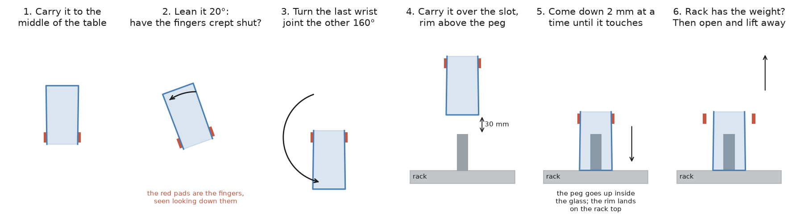

# Step 6 — turning it over and standing it down

The glass is held and weighed. Three things are left: turn it upside down,
stand it mouth-down over a peg in the drying rack, and let go. A person does
this without thinking. For a robot, three parts of it are hard:

1. **Turning the glass without it moving in the fingers.** Two flat pads hold a
   round glass well against falling, and poorly against swinging.
2. **The wrist cannot turn forever.** Whether a glass can be turned over
   depends on how it was picked up, so that has to be settled before the
   fingers close.
3. **Landing it gently.** The height the rim lands at comes from two
   measurements, and both carry error. So the arm feels its way down instead of
   driving to a number.

**Where this stands:** no glass has yet been seen standing in the rack at the
end of a run. The turn now holds the glass to within a degree or two, and the
latest fix to the landing has not been tried yet. Both are written up in
[`step6-approaches.md`](step6-approaches.md), under *What was found in the
simulator*.

Code: `_invert_and_place()` in `task.py`; `turn_wrist()`,
`descend_until_contact()` and `load_transferred()` in `arm/motion.py`; and
`rack/layout.py`.

What follows, in order:

- the whole step in six pictures
- the step in pseudocode, and the libraries it uses
- finding the rack
- choosing a slot
- turning the glass over
- the wrist limit, and why it is checked before the fingers close
- carrying it over the slot
- feeling for the rack
- one last check before letting go
- what went wrong
- where the method can still fail
- other ways it could have been done

## The whole step in six pictures



Each picture is looking straight down the fingers, so the two red pads are the
two fingers, one on each side of the glass. The rest of this document goes
through the pictures one at a time.

## The step in pseudocode

Each line says who does the work: **ours** means code in this repo, and a named
library means the work is not ours.

```text
before any glass:                                 ours: task.py _find_rack()
    read the rack's ArUco marker                  OpenCV: cv2.aruco, on the wrist
                                                  camera's colour picture
    place the six slots from it                   ours: rack/layout.py
                                                  slots_from_marker()

choose a slot                                     ours: rack/layout.py. Done before
                                                  the pick-up, so a glass with
                                                  nowhere to go is never lifted.
    only slots this glass fits in                 usable_slots()
    only slots reachable from either side         slots_within_stretch()
    furthest from the arm first                   fill_order()
    leave a neighbour empty if it may tilt        needs_empty_neighbour() and
                                                  tilt_budget_deg()

with the glass held:                              ours: task.py _invert_and_place()
    carry the glass to the middle of the table    ours: arm/dimensions.py
                                                  TURNING_ROOM, in a straight line
    lean it 20 degrees and watch the finger gap   ours: glasses/force.py
                                                  is_slipping(). A gap that has
                                                  shrunk means the glass is sliding.
    turn 180 degrees about the grip point         ours: arm/motion.py turn_over().
                                                  Only the last wrist joint turns,
                                                  160 degrees, since the lean
                                                  already did 20. Its axis runs
                                                  through the grip point.

    move above the slot                           ours: task.py _carry_over(), slowly
                                                  in a straight line; MoveIt 2
                                                  plans a path only if none works
    point the gripper away from the base          ours: transforms.py facing_options()
    come down in 2 mm steps until it touches      ours: motion.py
                                                  descend_until_contact()
                                                  ros2_control: the pad contact
                                                  sensors and the wrist broadcaster
                                                  the peg's height plus 60 mm with no
                                                  touch means the glass is not where
                                                  it was thought to be
    is the rack really taking the weight?         ours: motion.py
                                                  load_transferred(). No means the
                                                  rim is caught: do not let go.
    open the fingers                              ros2_control: back to position
    tell the planner the arm is empty             MoveIt 2: the planning scene
```

### What each library gives this step

| Piece | Ours or a library | What it does here |
| --- | --- | --- |
| `task.py` | ours | the order: carry, lean, turn, carry over the slot, lower, check, let go |
| `arm/motion.py` | ours | turning the last wrist joint, feeling the way down, and reading the weight off the wrist |
| `rack/layout.py` | ours | where the slots are, which ones this glass fits, and how much it may lean going in |
| [MoveIt 2](https://moveit.picknik.ai/main/index.html) | library | the straight-line moves, a planned path when no straight line works, and the planning scene that keeps the held glass out of the rack |
| [OMPL](https://ompl.kavrakilab.org/) | library | the planner MoveIt runs underneath for those planned paths |
| [ros2_control](https://control.ros.org/jazzy/index.html) | library | runs every move on the joints, including the wrist turn, which is sent to it directly without planning; and publishes the contact and wrist-force readings |
| [Gazebo Harmonic](https://gazebosim.org/docs/harmonic/) | library | simulates the rim meeting the rack, which the descent is feeling for |
| [OpenCV](https://github.com/opencv/opencv) | library | reads the rack's marker, which is where every slot position comes from |

Steps 1 to 5 are mostly arithmetic on arrays. This step is mostly movement, so
it leans on the libraries more than any other. The work in this repo is telling
them the truth about the world, and choosing moves simple enough that nothing
is left for a planner to get wrong.

## Finding the rack

This happens once, before the first glass. The arm looks down at where the
rack stands and reads the square **ArUco marker** printed on the rack's base.
An ArUco marker is a black-and-white square, like a simple QR code, that
OpenCV can find in a picture and measure: where it is, and which way it is
turned. The rack's shape is known, so one sighting of the marker places all
six slots.

## Choosing a slot

The slot is chosen before the glass is picked up, so that a glass with nowhere
to go is never lifted.

**Will it fit?** A glass going into a slot has a little room on each side:
`(slot spacing − glass width) / 2`. It goes in rim first and can lean a little
as it does, and a tall glass uses up that room with a much smaller lean than a
short one. The biggest lean a glass can afford is

    atan(room on each side / glass height)


Slots are 100 mm apart:

| Glass | Room each side | Biggest lean it can afford |
| --- | --- | --- |
| 80 mm wide, 90 mm tall | 10 mm | 6.3° |
| 80 mm wide, 175 mm tall | 10 mm | 3.3° |
| 90 mm wide, 175 mm tall | 5 mm | 1.6° |

The arm holds a glass upright to within about 3°. So the third glass cannot
safely go into a slot next to another glass, and `needs_empty_neighbour()`
says so. Leaving the slot beside it empty doubles the room, and the lean it
can afford goes from 1.6° to 17.4°. That is the dotted line in the picture.

This is worked out from the **measured** width and height, glass by glass. It
is why the rack holds six glasses on one run and four on another.

**Which slot?** The furthest from the arm first, so the arm never reaches over
a glass already standing in the rack. And only slots the arm can reach whether
it arrives on one side of the slot or the other, because which side is decided
later, by how the glass is picked up. If no slot passes that test, the test is
dropped. A slot that might not work is better than refusing a glass the arm is
already holding.

## Turning the glass over

**Only the last wrist joint turns.** Its axis runs along the fingers and
straight through the grip point, the spot where the pads hold the glass. So the
grip point stays still, the rest of the arm stays still, and the glass turns on
the spot. Nothing is planned, because there is nothing to choose: the joint is
simply told to turn. It turns slowly, a half turn taking about six seconds,
easing in at the start and out at the end, because the pads hold a still glass
far better than a flung one.

There is another way to turn a held glass over: about the line between the two
pads. That was tried, and the gripper rolled over while the glass hung upright
between the pads. Two flat pads on a round glass make a hinge along that line,
and only friction stops the glass swinging on it. Why the hinge is weak, with
pictures, and the other ways the turn could be done, are in
[`step6-approaches.md`](step6-approaches.md).

**First, carry it to the middle of the table.** The turn asks more of the wrist
than anything else in the task. Doing it from wherever the pick-up happened to
leave the arm made it a different problem for every glass. So the glass is
first carried, in a straight line, to one fixed spot 500 mm out from the arm's
base and 350 mm above the table (`TURNING_ROOM`). It goes in a straight line,
not along a planned path, because a planner that is free to pick its own route
can swing the arm right round with the glass in hand. That has thrown a glass
out of the fingers; see *What went wrong*.

**Then lean it 20 degrees.** A lean puts some of the glass's weight sideways on
the pads, which is what makes a weak grip give way. The arm measures the gap
between the fingers before and during the lean. If the gap has shrunk, the
fingers have crept closed because the glass is sliding through them, and the
glass is put back. Twenty degrees is a lean the glass can recover from. Upside
down, it could not.

**Then turn the rest of the way: 160 degrees, not 180.** The lean already
turned the glass 20 degrees in the same direction. A full 180 on top of it
left the glass 20 degrees past upside down.

**The squeeze is at the most the glass is rated for.** Step 5 works out the
force needed to stop the glass sliding down. That is not enough to stop it
swinging on the hinge once it is upside down, so for the turn and the carry
the arm holds the glass as hard as its wall is safe at.

## The wrist limit, and why it is checked before the fingers close

The last wrist joint on a UR5e can turn a little less than a full circle each
way from its middle, and no further. So whether it has room for a half turn
depends on where it starts, and that is decided by how the glass was picked up.

A two-finger gripper can hold a glass two ways round, one the mirror of the
other. Both grip the glass in exactly the same place. But they leave the wrist
joint half a circle apart, and one of them may leave no room for the turn.

So while the arm hovers above the glass, **before the fingers close**, it asks
`can_rotate_tool()`: does the joint have room to turn half a circle from here,
one way or the other? If not, it tries the other way round.

This is checked early because finding out later is the most expensive mistake
available. With the glass already in the fingers, there is nothing to do but
put it back down.

## Carrying it over the slot

Upside down, the rim hangs below the grip by the glass's height minus the grip
height. The arm carries the glass across so that the rim is **30 mm above the
top of the peg**, not 30 mm above the rack. The carry comes in sideways, and a
rim any lower meets the peg side-on. That knocked the glass round in the
fingers and left it sitting on top of the peg.

The carry is **slow**: a quarter of the arm's usual speed. Upside down, the
glass hangs from the hinge between the pads, and a quick move swings it.

It is also a **straight line**, for the same reason as the carry to the middle.
Several ways of facing are tried, starting with the gripper pointing away from
the arm's base, because that keeps the reach shortest. Only if no straight line
works is a planned path allowed. By then the glass is upside down in the
fingers, and there is nowhere better to take it.

## Feeling for the rack

The rim lands on the top of the rack's base, with the peg going up inside the
glass. The height it lands at is

    rack top + (glass height − grip height)

Both glass numbers were measured, so both carry error, and the errors add. Driving
the glass to a calculated height is how a rim gets chipped. So
`descend_until_contact()` comes down 2 mm at a time and stops at the first sign
of a touch. Two millimetres, because a rim meeting the rack at that step is a
touch rather than a knock.

**What counts as a touch.** The pads have contact sensors, but when a glass is
set down the pads touch nothing: the rim does. So the arm also watches the
wrist force sensor. As the rack starts to carry the glass, the weight the wrist
feels drops. That drop is the touch.

The reading has a direction as well as a size. One step past the moment of
touching, the arm is pressing the glass down onto the rack, which pushes back
up on the wrist. Read as a size only, that looked like *more* weight, not
less, so the touch was never noticed and the arm pushed the glass up through
its fingers. The reading is now signed, so pressing down reads as less weight,
as it should.

**How far it will go.** The peg's height, which passes inside the glass
untouched, plus 60 mm. Going that far without feeling anything is an answer in
itself: the glass is not where the arm thought it was, and the glass is not let
go.

## One last check before letting go

Touching is not the same as resting. A glass whose rim has caught on the edge
of a peg touches the rack while still hanging from the fingers, and opening the
fingers would drop it.

So `load_transferred()` asks the wrist sensor one more question. If the rack
has taken the glass's weight, the wrist is back to feeling the gripper alone,
about 9.5 N. If it still feels the glass, the rim is caught, and the fingers
stay shut.

Only then do the fingers open, MoveIt is told the arm is empty, and the arm
lifts away for the next glass.

## What went wrong

The faults found in the turn itself, and in the carry and the landing, are in
the table in [`step6-approaches.md`](step6-approaches.md). Two more are about
how the turn was asked for:

**The turn was asked for as a new pose.** The first version told the planner
where the gripper should end up, upside down, and let it find a way there. The
planner was free to swing the whole arm round on the way, and it threw the
glass out of the fingers. Asking for a straight line to the same pose instead
gave up a few degrees in. Turning just the last joint has neither problem.

**The turn was about the line between the pads.** Covered above: that is the
hinge, and the glass hung upright while the gripper turned around it.

Three more faults were in what MoveIt was told about the world. All three
looked the same from outside: a path that the planner could not find at all,
which is exactly what a truly impossible move looks like.

**The pads were not allowed to touch the glass.** When a glass is attached to
the gripper, MoveIt is given a list of the parts that may touch it. The list
had the gripper body and the fingers, but not the pads, and the pads are the
only parts that ever touch the glass. So from the moment it was picked up, the
glass was colliding with its own gripper, and the arm could not move at all.

**The glass was attached in the wrong place.** Where the glass sits in the
gripper is worked out from where the glass is and where the tool is. The two
were being read at different times, one before the 180 mm lift off the table
and one after. So MoveIt believed in a glass hanging 180 mm below the real one,
through the table.

**The rack the planner saw was turned a quarter circle from the real rack.**


The box standing in for the rack was never turned to match it. It lay across
open table, right where the arm works, and the real rack was covered by nothing.
The same quarter turn happened, separately, in reading the marker: how a
picture lies on the face of a box is up to the simulator, and the marker was
read as turned the wrong way. So the slots were laid out across the real rack,
and the arm lowered a glass over bare table.

## Where this approach can fail

**No glass has been seen standing in the rack yet.** See *Where this stands*,
at the top.

**The hold has little to spare.** The turn only works at the full squeeze,
and on glasses whose weight sits near the grip. Glasses that differ from the
ones tested may not hold, and [`step6-approaches.md`](step6-approaches.md)
is about what to do then.

**Every slot position comes from one marker.** If the marker is misread, or
read at the wrong angle, the arm lowers the glass over bare table and cannot
tell. That has already happened once.

**The slot is chosen before the path to it is known.** The lean budget says
whether a glass fits in a slot. It does not say whether the arm can get it
there without brushing a glass already standing in the next slot.

**Any touch counts as the touch.** A rim landing on the edge of a peg, or on a
neighbouring glass, stops the descent just as the rack would. The weight check
afterwards is what catches it, and that is a threshold on a noisy sensor.

**The wrist's room is checked, then assumed.** It is checked while hovering,
before the fingers close. Between then and the turn, the arm grips, lifts,
leans and carries the glass. The turn checks again, and a refusal at that point
comes with a glass already in the fingers.

**The middle of the table is assumed to be free.** `TURNING_ROOM` is a fixed
spot. Nothing checks whether a glass is standing under it. If one is, the
straight line to it is refused, and the glass is turned wherever the arm is.

**Nothing watches the glass after it is let go.** The fingers open, the arm
lifts away, and the run moves on. A glass that topples out of its slot a second
later is counted as racked.

## Other ways it could have been done

This step asks two questions besides the turn: how the arm plans its moves, and
how it knows the glass has landed. The turn has its own document,
[`step6-approaches.md`](step6-approaches.md).

| Approach | What it does | What it runs on | Suitability here |
| --- | --- | --- | --- |
| **Straight lines, with a planner as a fallback** | moves in straight lines where it matters, and plans a path only when it must | [MoveIt 2](https://moveit.ai/) with [OMPL](https://ompl.kavrakilab.org/) | good, and in use |
| **Plan the whole task at once** | treats pick, turn and place as one problem, with choices at each stage | [MoveIt Task Constructor](https://github.com/moveit/moveit_task_constructor) | already a dependency, and a good fit |
| **Optimising planners** | start from a rough path and smooth it | CHOMP and STOMP in [MoveIt](https://moveit.ai/), [TrajOpt](https://github.com/tesseract-robotics/trajopt) | steadier paths, worse in tight spaces |
| **Planning on a GPU** | tries thousands of paths at once | [cuRobo](https://curobo.org/) | would make retries free |
| **Full dynamics and contact** | plans with the physics of touching in the loop | [Drake](https://drake.mit.edu/) | more than this task needs |
| **Servo on the goal** | streams small corrections instead of planning a path | [MoveIt Servo](https://moveit.ai/) | good for the last few centimetres |
| **A learned policy** | outputs joint moves directly, with no planner | [ACT](https://tonyzhaozh.github.io/aloha/), [Diffusion Policy](https://diffusion-policy.cs.columbia.edu/) on [PyTorch](https://pytorch.org/) | would avoid most planner failures |

**What is in use.** The delicate moves are straight lines: into the glass, to
the middle of the table, over the slot, and down. The turn is one joint and no
plan at all. A planner is only called when no straight line works. The
weakness is that a straight line is all or nothing, and a planner gives a
different answer each time it is asked. That is why every planned move is tried
up to three times before it is believed impossible.

**[MoveIt Task Constructor](https://github.com/moveit/moveit_task_constructor)**
is the most interesting entry, because the project already depends on it and
does not use it. It plans a series of stages together, each with several
possible ways of being done, so a choice made early cannot make a later stage
impossible. Many of the failures in this document are exactly that kind of
mistake: a grasp chosen without knowing which side the tool would end up on at
the rack. The cost is that the step-by-step sequence in `task.py` would become
a tree of choices, which is much harder to read.

**Optimising planners** begin with a rough guess at a path and push it away
from obstacles. The paths are smooth and the same each time. But they get stuck
threading through gaps, and this cell is tight: an arm in the middle of its own
table, with a rack beside it.

**[cuRobo](https://curobo.org/)** tries many paths at once on a graphics card,
fast enough that asking a thousand times costs less than asking three times
here. It needs a graphics card the development machine may not have.
**[Drake](https://drake.mit.edu/)** plans with the physics of contact included,
which suits assembly or turning an object in the hand, and is more than a
pick-and-place needs.

**[MoveIt Servo](https://moveit.ai/)** streams small corrections instead of
planning a path. It is the natural tool for the two feedback loops this task
has built by hand out of many small moves: the sideways nudge onto the glass in
step 4, and the feel-for-the-rack descent on this page.

**A learned policy** such as [ACT](https://tonyzhaozh.github.io/aloha/) or a
[diffusion policy](https://diffusion-policy.cs.columbia.edu/) would replace the
planner near the object, turning what the arm sees and feels straight into
joint moves. Many of the failures here are a planner refusing a move the arm
could physically make, and a policy never asks a planner. The sibling project
[`v5-learn-pick-place`](../../v5-learn-pick-place) does this and reaches 74% on
blocks it never saw. What it gives up is the thing this project is built on: a
policy cannot say why it refused a glass.

### And for knowing the glass has landed

**A table of known heights.** The rack never changes shape, so the height of
its top could be written down and the glass driven there. It fails the moment
the glass measurement or the marker reading is a couple of millimetres out,
which is exactly the case this project is about.

**A camera check before letting go** would confirm the glass is standing
straight rather than leaning. Nothing does that now, and it is a real gap.

**A weighing sensor under the rack** would say the rack had taken the weight
far more directly than watching it leave the wrist, at the cost of adding a
sensor to the furniture.

← [Back to the walkthrough](README.md)
