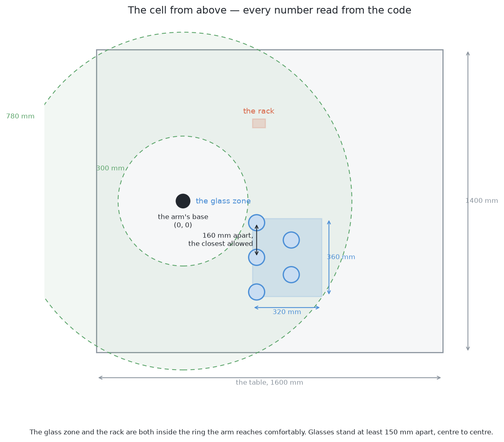
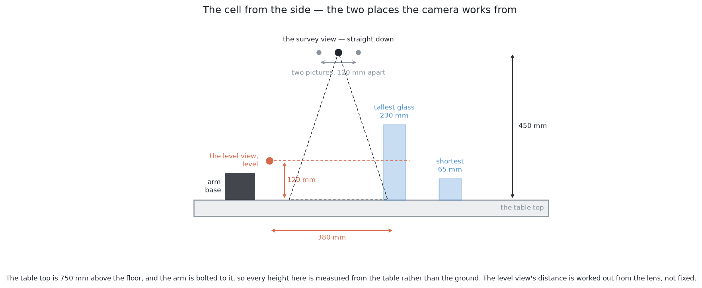
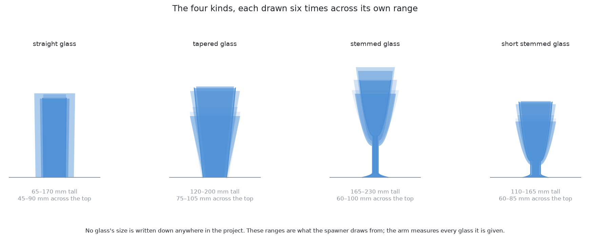
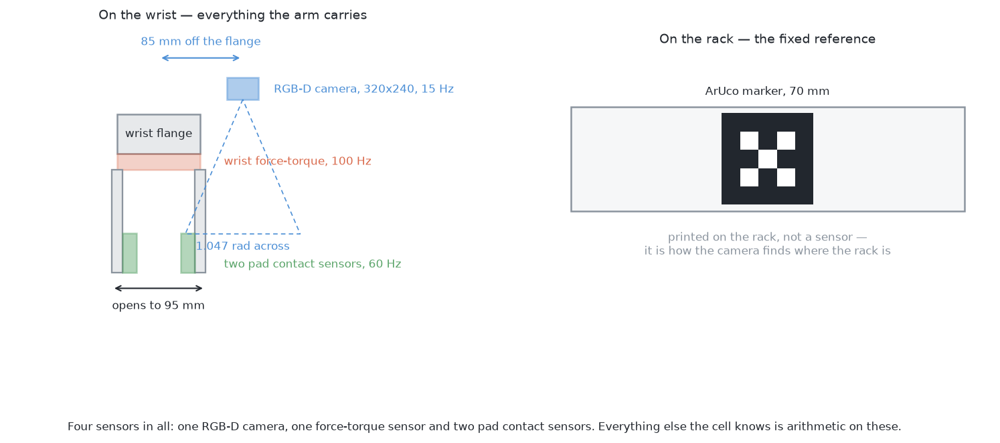
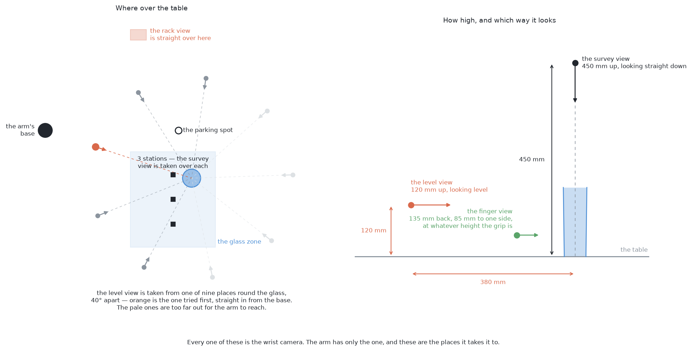
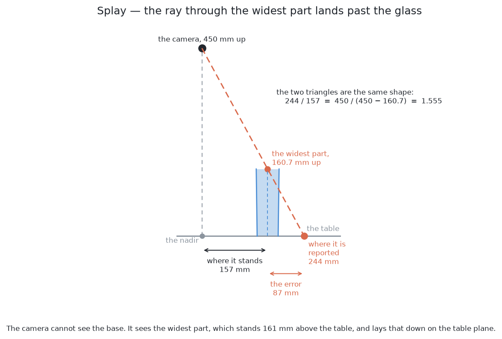
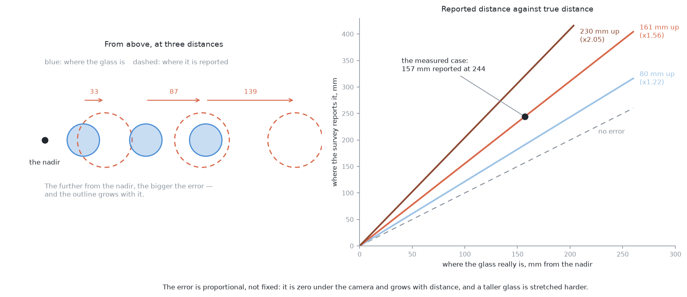

# The cell — the layout, the sensors, and the words

Every solution in this project works in the same room, with the same arm, the
same camera and the same table. Rather than restate those numbers in each
document, they are here once.

**Every dimension on this page is read from the project's own constants** by
[`make_cell_images.py`](../images/generators/make_cell_images.py), which imports
`arm/dimensions.py`, `table/layout.py`, `rack/layout.py` and
`glasses/shapes.py` and draws what it finds. If a number moves in the code, the
pictures move with it the next time the script runs. Nothing here is typed in
by hand.

## The layout, from above

The arm is bolted to the table at the origin. Everything it does happens in two
rectangles on that table:

- **the glass zone**, 320 by 360 mm, where glasses may stand;
- **the rack**, 60 by 40 mm, where they end up, upside down on pegs.

Both sit inside the ring the arm reaches comfortably — closer than 300 mm and it
is folded over itself, further than 780 mm and it is reaching straight out with
nothing left for the wrist. That ring is a working preference, not a hard joint
limit.

## The layout, from the side

The table top is 750 mm above the floor and the arm stands on it, so **every
height in this project is measured from the table**, not the ground. A glass's
height, the camera's height, the rack's pegs: all from the table top.

The camera is only ever put in two poses, and almost every misunderstanding in
these documents comes from mixing them up.

| | the survey view | the level view |
|---|---|---|
| where | 450 mm above the table | 120 mm above the table |
| looking | straight down | level |
| how far from the glass | directly overhead | about 380 mm |
| one pixel covers | 1.62 mm | 1.37 mm |
| the frame covers | 519 by 390 mm of table | 439 by 329 mm |
| what it is for | finding everything, roughly | measuring one glass, precisely |

These two have three more beside them — over the rack, down the fingers, and
the spot the arm waits at. All five are named and drawn in
[Where the camera stands](#where-the-camera-stands-and-what-each-place-is-called).
Older documents call these two the *survey pose* and the *side-on pose*; they
are the same two places.

The 380 mm is **not a constant**. `MEASURE_STANDOFF` fixes only a floor of
300 mm — nearer than that and a glass fills the frame before it is all in it.
The distance actually used is worked out per run from the lens and the tallest
glass the cell handles, and comes to about 380 mm. `MEASURE_VIEW_HEIGHT` is a
fixed 120 mm, deliberately: the overhead view cannot tell how tall a glass is,
which is what the side view is for, so aiming at a fixed height is the only
option available.

## The glasses

Four kinds, each drawn at random inside its own range of proportions. **No
glass's size is written down anywhere in this project** — not in a constant,
not in a test fixture, not in a mesh. The arm measures every glass during the
run. What the code holds is the *range the spawner draws from*, which is a
different thing and is what makes the tests meaningful.

| kind | height | across the top |
|---|---|---|
| straight glass | 65–170 mm | 45–90 mm |
| tapered glass | 120–200 mm | 75–105 mm |
| stemmed glass | 165–230 mm | 60–100 mm |
| short stemmed glass | 110–165 mm | 60–85 mm |
| **all four** | **65–230 mm** | **45–105 mm** |

## The sensors

Four, and that is the whole list. Everything else the cell believes is
arithmetic on these.

| sensor | where | rate | what it returns |
|---|---|---|---|
| **RGB-D camera** | on the wrist, 85 mm off the flange | 15 Hz | colour and aligned depth, 320 × 240, 1.047 rad across, usable from 0.05 to 3.0 m |
| **wrist force-torque** | between the flange and the gripper | 100 Hz | three forces and three torques |
| **pad contact** × 2 | one in each fingertip pad | 60 Hz | whether that pad is touching something |

There is a fourth thing that is not a sensor but is easy to mistake for one: an
**ArUco marker**, 70 mm square, printed on the rack. It is how the camera works
out where the rack is, rather than trusting that it was placed exactly.

The camera being *on the wrist* rather than above the table is the single fact
that shapes most of these solutions. It means the arm chooses its own
viewpoints. It means moving the camera costs seconds of arm time. And it means
the camera's pose is known exactly, from the joint encoders — which is what makes
[solution 9](problem-2/solutions/09-self-supervised-from-the-arms-own-movement.md)
possible at all.

## Where the camera stands, and what each place is called

The arm has one camera and it is on the wrist, so a camera position here always
means a place the arm carries that one camera to. Five places cover the whole
run. These are their names, and the rest of the documents use them.

| name | where it stands | which way it looks | what it is for |
|---|---|---|---|
| **the survey view** | over a station in the glass zone, 450 mm up | straight down | what is on the table, and roughly where |
| **the rack view** | straight over the middle of the rack, 450 mm up | straight down | reading the marker, once, before anything else |
| **the level view** | 380 mm out from one glass, 120 mm up | level, at the glass | measuring that one glass |
| **the finger view** | 135 mm back from the glass and 85 mm to one side, at the height of the grip | along the fingers | is the glass between the pads, or beside them |
| **the parking spot** | 500 mm out from the base, 450 mm up | straight down | where the arm waits with nothing to do |

**The survey view.** The camera is taken up to 450 mm and pointed straight down.
One picture from there covers 519 by 390 mm of table, but a station takes two
pictures 120 mm apart and only the part in *both* is worth anything, which
leaves 424 by 175 mm. The glass zone is 320 by 360 mm, so it takes **three
stations** in a line to cover it, and the stations overlap.

One honest detail. The 450 mm is where the *tool* is sent. The camera sits
85 mm to one side of the tool and 15 mm along the way it points, so it is
actually about 435 mm up and a hand's breadth off to the side. The code does
not guess this. It reads where the camera really was from the joint angles, and
that reading is what the pair of pictures is measured against.

**The rack view.** The same height and the same straight-down aim, over the
middle of the rack instead of over the glasses. It happens once, at the start of
a run, and all it does is read the ArUco marker. Here the code *does* take the
85 mm out of the tool's position first, so the camera itself ends up over the
middle of the rack.

**The level view.** The camera comes down to 120 mm above the table, points
level, and stands 380 mm back from the glass. This is the view that measures a
glass, and the view [solution 3](problem-2/solutions/03-move-the-camera.md)
sends the camera to.

The 380 mm is worked out, not stored. The frame has to reach from the table at
the bottom to the rim of the tallest glass the cell handles at the top. Both of
those are angles, so how far back that puts the camera depends on the lens.

The arm can stand anywhere on a circle round the glass, and it is offered
**nine places on that circle, 40° apart**. The first one it tries is straight in
from its own base, because that is the shortest reach. It moves on to the next
if something is standing behind the glass — a glass behind the target joins it
in the mask and the two measure as one wide glass — or if the pose is too far
out for the arm to reach.

**The finger view.** This one is not chosen at all. It is wherever the camera
ends up once the fingers are round the glass: 135 mm back from the glass's axis,
85 mm off to one side, at whatever height the grip was fixed at. Everything
before it aimed the fingers from pictures taken half a metre away. This is the
one look taken from where the fingers actually are, and at this range a
millimetre on the table is worth many pixels. It is used for one thing only —
shifting sideways onto the glass before the fingers close.

**The parking spot.** 500 mm out from the base, 450 mm up, looking down. The
arm goes here when it has finished, and when it has given up on something, so
that it is out of the way and the next move starts from a known place.

### Naming a place that is not one of these

Some documents talk about cameras this cell does not have: one bolted above the
table, one standing at the edge looking across. Describe any of them with three
things, in this order — **the spot, the height, the aim**.

- **The spot** is where on the table it stands over, or beside: *over the middle
  of the glass zone*, *over the rack*, *at the near edge of the table*, *beside
  the glass*.
- **The height** is in millimetres above the table top, because every height in
  this project is. The landmarks are 0 (table level), 120 (the level view) and
  450 (the survey view). A fraction is fine when the exact number does not
  matter: *half the survey height* is 225 mm.
- **The aim** is *looking down*, *looking level*, *looking at a slant of 30°*,
  or *looking along the fingers*.

So "a camera at the near edge of the table, at table level, looking level" is
the fixed side camera some of the solutions weigh up, and "over the middle of
the glass zone, 450 mm up, looking down" is the survey view written out the
long way.

## The words

Terms used throughout, several of which mean different things elsewhere.

**The survey.** The opening move of a run: the arm flies the camera over the
glass zone, looking straight down from 450 mm, and takes pictures from several
**stations** until every part of the zone has been seen. It answers *what is on
the table and roughly where*, not *how big is this glass*.

**A station.** One place the camera is parked during the survey. Each station
takes **two** pictures 120 mm apart — the **baseline** — so that the apparent
shift between them gives depth. Stations overlap by 35 per cent of a frame, so
a glass cut off at the edge of one picture is well inside another.

**Standoff.** How far the camera is from the thing it is looking at. Used almost
always of the side-on pose.

**The nadir.** The point on the table directly under the camera. Only meaningful
in the survey pose. Things directly under the camera are seen honestly; things
off to the side are seen at an angle, which matters more than it sounds.

**Splay.** The consequence of that angle. It is worth doing slowly, because
almost every distance the survey reports is wrong by it.

Start with what the camera can see. A glass off to the side is seen from above
and a little from the side. The base is hidden — the bowl of the glass sits over
it. What the camera actually sees is the widest part of the glass, usually the
rim.

Now, one picture from above cannot tell how tall anything is. So the survey
assumes that everything it sees is lying flat on the table. It draws a straight
line from the lens through the widest part of the glass, and takes the point
where that line meets the table as the place the glass is standing. The widest
part is well above the table, so the line carries on past the glass and lands
further out.

Similar triangles give the size of the mistake. Call the camera's height *H* and
the height of the widest part *h*. That sloping line makes two right-angled
triangles, one inside the other: a big one that runs all the way down to the
table, and a small one that stops at the height of the widest part. Both have
the same angle at the lens, so their sides are in the same ratio:

> reported distance = true distance × *H* / (*H* − *h*)

Put the cell's numbers in. *H* is 450 mm. Take a real glass from the spawner
whose widest part is 160.7 mm up. The factor is 450 / 289.3 = 1.555. Problem 1
measured exactly this: a glass standing 157 mm from the nadir was reported at
244 mm, which is 87 mm out.

Three things follow from that formula, and all three matter later:

- **The error is proportional, not fixed.** It is zero directly under the
  camera and grows with distance. You cannot correct it by subtracting a
  constant.
- **A taller glass is pushed further.** The factor depends on *h*, so two
  glasses standing side by side are moved by different amounts. One correction
  applied to the whole picture cannot fix both.
- **The outline grows as well as moving.** Every point of the glass is scaled by
  the same factor, so the reported outline is bigger than the real one. This is
  why a glass seen from above is a teardrop leaning away from the nadir and not
  a circle.

None of this is a fault in the camera or the code. It is what a single picture
from one point can tell you, and no more. It is also the reason the survey's job
is stated as *roughly where*, and the reason the arm carries the camera round to
the side before it measures anything.

**Mask, patch, blob.** A **mask** marks every pixel as glass or not glass. A
**patch** or **blob** is one group of touching marked pixels — what connected
components returns. One patch is not the same as one glass, which is the whole
of problem 2's first difficulty.

**Silhouette.** The outline of one glass in one picture. Not a circle in either
pose: from above it is a teardrop leaning away from the nadir, from the side it
is the glass's profile.

**Cluster.** A group of 3-D points that belong together, formed by distance in
the room rather than by adjacency in the picture.

**Footprint — and the one word that does double duty.** Read this one slowly.
Two different quantities get called by the same name:

- the **contact patch**, where the glass actually touches the table, which is
  30–88 mm across over the four kinds;
- the **flattened disc**, what you get when every point of a glass is dropped
  straight down onto the table, which is the glass's *widest* part and is
  45–105 mm across.

Most of these documents mean the second, because that is what
[clustering on the table](problem-2/solutions/02-cluster-on-the-table.md) groups
and what a circle is fitted to, and it is also what limits how close two glasses
can stand. [Solution 1](problem-2/solutions/01-split-the-blob-in-the-picture.md)
is the exception: its contact runs read the first. Where a number matters, the
documents say which they mean.

## Every constant, and where it lives

Numbers live with their subject and nowhere else, so this table is a directory
rather than a second copy.

| what | value | where it is defined |
|---|---|---|
| table top above the floor | 750 mm | `table/layout.py` `TABLE_TOP_Z` |
| table | 1600 × 1400 × 50 mm | `table/layout.py` `TABLE_SIZE` |
| arm's base | (0, 0) on the table top | `table/layout.py` `ROBOT_BASE` |
| comfortable reach | 300–780 mm | `arm/dimensions.py` `COMFORTABLE_REACH` |
| glass zone | 320 × 360 mm | `rack/layout.py` `GLASS_ZONE` |
| rack area | 60 × 40 mm | `rack/layout.py` `RACK_AREA` |
| rack top / peg | 770 mm / 55 mm tall | `rack/layout.py` `RACK_TOP_Z`, `PEG_HEIGHT` |
| ArUco marker | 70 mm | `rack/layout.py` `MARKER_SIZE` |
| survey height | 450 mm above the table | `arm/dimensions.py` `SURVEY_HEIGHT` |
| survey baseline | 120 mm | `arm/dimensions.py` `SURVEY_BASELINE` |
| survey overlap | 35 per cent | `arm/dimensions.py` `SURVEY_OVERLAP` |
| side-on standoff, floor | 300 mm | `arm/dimensions.py` `MEASURE_STANDOFF` |
| side-on view height | 120 mm above the table | `arm/dimensions.py` `MEASURE_VIEW_HEIGHT` |
| camera offset from the flange | 85 mm out, 15 mm up | `arm/dimensions.py` `CAMERA_OFFSET` |
| gripper opening | up to 95 mm | `arm/dimensions.py` `GRIPPER_MAX_OPENING` |
| lowest the fingers reach | 50 mm above the table | `arm/dimensions.py` `LOWEST_GRIP` |
| pad | 14 × 40 mm | `arm/dimensions.py` `PAD_HEIGHT`, `PAD_LENGTH` |
| camera | 320 × 240, 1.047 rad, 15 Hz | `arm/camera/wrist_camera.urdf.xacro` |
| the kinds and their ranges | see above | `glasses/shapes.py` `KIND_RANGES` |

Two useful numbers are **derived**, not stored, and are recomputed every run:

- the **focal length in pixels**, `fx = (320 / 2) / tan(1.047 / 2) ≈ 277.1`,
  which turns every angle into pixels;
- the **side-on standoff**, about 380 mm, from the lens and the tallest glass.

## Where to go next

- [The five problems](README.md) — the map.
- [Problem 1](problem-1/) — one glass, start to finish.
- [Problem 2](problem-2/) — many glasses of one kind.
